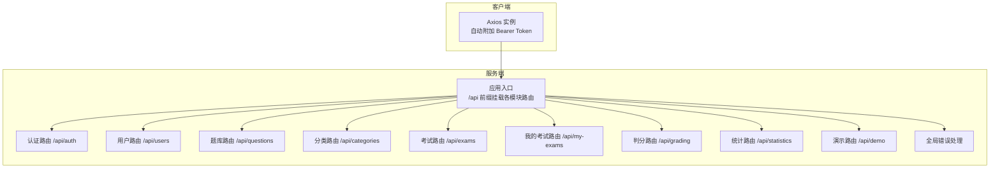
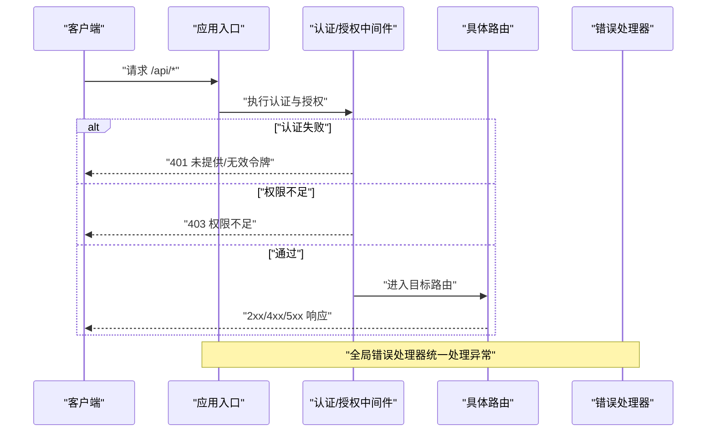
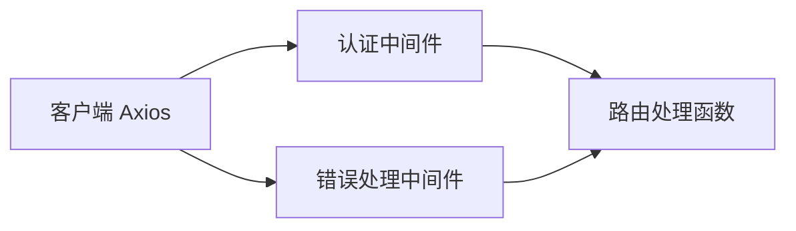

# API参考

<cite>
**本文档引用的文件**
- [packages/server/src/app.ts](file://packages/server/src/app.ts)
- [packages/server/src/middleware/auth.ts](file://packages/server/src/middleware/auth.ts)
- [packages/server/src/routes/auth.ts](file://packages/server/src/routes/auth.ts)
- [packages/server/src/routes/users.ts](file://packages/server/src/routes/users.ts)
- [packages/server/src/routes/questions.ts](file://packages/server/src/routes/questions.ts)
- [packages/server/src/routes/categories.ts](file://packages/server/src/routes/categories.ts)
- [packages/server/src/routes/exams.ts](file://packages/server/src/routes/exams.ts)
- [packages/server/src/routes/my-exams.ts](file://packages/server/src/routes/my-exams.ts)
- [packages/server/src/routes/grading.ts](file://packages/server/src/routes/grading.ts)
- [packages/server/src/routes/statistics.ts](file://packages/server/src/routes/statistics.ts)
- [packages/server/src/routes/demo.ts](file://packages/server/src/routes/demo.ts)
- [packages/server/src/middleware/error-handler.ts](file://packages/server/src/middleware/error-handler.ts)
- [packages/client/src/services/api.ts](file://packages/client/src/services/api.ts)
- [gen_docx.py](file://gen_docx.py)
</cite>

## 目录
1. [简介](#简介)
2. [项目结构](#项目结构)
3. [核心组件](#核心组件)
4. [架构总览](#架构总览)
5. [详细组件分析](#详细组件分析)
6. [依赖关系分析](#依赖关系分析)
7. [性能与安全](#性能与安全)
8. [故障排查指南](#故障排查指南)
9. [结论](#结论)
10. [附录](#附录)

## 简介
本API参考面向前端开发者与第三方集成方，系统性梳理考试系统的RESTful接口，覆盖认证、用户管理、题库管理、考试管理、判分与统计等模块。文档提供每个端点的HTTP方法、URL模式、请求参数、响应格式、认证与权限要求、错误码说明，并给出调用流程图与时序图，帮助快速集成。

## 项目结构
后端基于Express应用，统一通过中间件处理CORS与JSON解析；路由按模块划分，前缀为/api；全局错误处理器集中处理异常；客户端Axios实例统一注入JWT并处理401自动登出。

图表来源
- [packages/server/src/app.ts:14-41](file://packages/server/src/app.ts#L14-L41)
- [packages/client/src/services/api.ts:3-32](file://packages/client/src/services/api.ts#L3-L32)

章节来源
- [packages/server/src/app.ts:14-41](file://packages/server/src/app.ts#L14-L41)
- [packages/client/src/services/api.ts:3-32](file://packages/client/src/services/api.ts#L3-L32)

## 核心组件
- 应用入口与路由挂载：在应用启动时挂载健康检查与各模块路由，统一前缀/api。
- 认证中间件：从Authorization头提取Bearer Token，校验JWT有效性并将用户信息注入请求上下文。
- 授权中间件：按角色白名单放行，支持教师、管理员等角色。
- 全局错误处理：捕获业务异常并标准化响应。
- 客户端Axios拦截器：自动附加Token并在401时清理本地存储并跳转登录。

章节来源
- [packages/server/src/app.ts:14-41](file://packages/server/src/app.ts#L14-L41)
- [packages/server/src/middleware/auth.ts:19-45](file://packages/server/src/middleware/auth.ts#L19-L45)
- [packages/server/src/middleware/error-handler.ts](file://packages/server/src/middleware/error-handler.ts)
- [packages/client/src/services/api.ts:3-32](file://packages/client/src/services/api.ts#L3-L32)

## 架构总览
下图展示客户端到服务端的典型交互路径：认证成功后，后续请求携带JWT，服务端进行鉴权与授权，再进入对应路由处理业务逻辑。

图表来源
- [packages/server/src/app.ts:14-41](file://packages/server/src/app.ts#L14-L41)
- [packages/server/src/middleware/auth.ts:19-45](file://packages/server/src/middleware/auth.ts#L19-L45)
- [packages/server/src/middleware/error-handler.ts](file://packages/server/src/middleware/error-handler.ts)

## 详细组件分析

### 认证 (Auth)
- 模块前缀：/api/auth
- 中间件：无（公开接口）
- 角色：无
- 关键端点
  - POST /api/auth/login
    - 功能：用户登录，返回JWT
    - 请求体：用户名、密码
    - 成功响应：包含token与用户信息
    - 可能错误：400、401
  - POST /api/auth/register
    - 功能：用户注册
    - 请求体：用户名、密码、角色等
    - 成功响应：用户信息（不含敏感字段）
    - 可能错误：400、409
  - POST /api/auth/refresh
    - 功能：刷新访问令牌
    - 请求体：刷新令牌
    - 成功响应：新的访问令牌
    - 可能错误：400、401
  - GET /api/auth/me
    - 功能：获取当前登录用户信息
    - 需要认证：是
    - 成功响应：用户信息
    - 可能错误：401

章节来源
- [packages/server/src/routes/auth.ts](file://packages/server/src/routes/auth.ts)
- [gen_docx.py:244-250](file://gen_docx.py#L244-L250)

### 用户管理 (Admin)
- 模块前缀：/api/users
- 中间件：认证 + 授权(管理员)
- 角色：admin
- 关键端点
  - GET /api/users
    - 功能：分页查询用户列表，支持关键词搜索
    - 查询参数：page、pageSize、keyword
    - 成功响应：分页结果
    - 可能错误：400、401、403
  - POST /api/users
    - 功能：创建用户
    - 请求体：用户基本信息
    - 成功响应：新建用户
    - 可能错误：400、401、403、409
  - PUT /api/users/:id
    - 功能：更新用户
    - 路径参数：id
    - 请求体：可更新字段
    - 成功响应：更新后的用户
    - 可能错误：400、401、403、404
  - DELETE /api/users/:id
    - 功能：删除用户
    - 路径参数：id
    - 成功响应：空对象
    - 可能错误：400、401、403、404
  - POST /api/users/batch-import
    - 功能：批量导入（CSV）
    - 请求体：multipart/form-data
    - 成功响应：导入结果统计
    - 可能错误：400、401、403

章节来源
- [packages/server/src/routes/users.ts](file://packages/server/src/routes/users.ts)
- [gen_docx.py:251-257](file://gen_docx.py#L251-L257)

### 题库管理 (Teacher)
- 模块前缀：/api/questions
- 中间件：认证 + 授权(教师/管理员)
- 角色：teacher, admin
- 关键端点
  - GET /api/questions
    - 功能：题目列表，支持分类、难度、类型、状态筛选
    - 查询参数：category、difficulty、type、status、page、pageSize
    - 成功响应：分页结果
    - 可能错误：400、401、403
  - POST /api/questions
    - 功能：创建题目（含验证规则）
    - 请求体：题目数据
    - 成功响应：新建题目
    - 可能错误：400、401、403
  - GET /api/questions/:id
    - 功能：题目详情
    - 路径参数：id
    - 成功响应：题目详情
    - 可能错误：400、401、403、404
  - PUT /api/questions/:id
    - 功能：更新题目
    - 路径参数：id
    - 请求体：可更新字段
    - 成功响应：更新后的题目
    - 可能错误：400、401、403、404
  - DELETE /api/questions/:id
    - 功能：删除题目
    - 路径参数：id
    - 成功响应：空对象
    - 可能错误：400、401、403、404
- 分类相关
  - GET /api/categories
    - 功能：分类树
    - 成功响应：分类树结构
    - 可能错误：400、401、403
  - POST /api/categories
    - 功能：创建分类
    - 请求体：分类信息
    - 成功响应：新建分类
    - 可能错误：400、401、403

章节来源
- [packages/server/src/routes/questions.ts](file://packages/server/src/routes/questions.ts)
- [packages/server/src/routes/categories.ts](file://packages/server/src/routes/categories.ts)
- [gen_docx.py:258-266](file://gen_docx.py#L258-L266)

### 考试管理 (Teacher)
- 模块前缀：/api/exams
- 中间件：认证 + 授权(教师/管理员)
- 角色：teacher, admin
- 关键端点
  - GET /api/exams
    - 功能：考试列表，支持分页与过滤
    - 查询参数：page、pageSize、status、mode
    - 成功响应：分页结果
    - 可能错误：400、401、403
  - POST /api/exams
    - 功能：创建考试
    - 请求体：考试基础信息（标题、描述、模式、时长、时间范围、及格分、设置等）
    - 成功响应：新建考试
    - 可能错误：400、401、403
  - PUT /api/exams/:id/questions
    - 功能：选题组卷（设置题目顺序与分数）
    - 路径参数：id
    - 请求体：题目ID列表（含排序与可选分数覆盖）
    - 成功响应：更新后的试卷
    - 可能错误：400、401、403、404
  - POST /api/exams/:id/publish
    - 功能：发布考试
    - 路径参数：id
    - 成功响应：发布状态
    - 可能错误：400、401、403、404
  - POST /api/exams/:id/start
    - 功能：开始考试
    - 路径参数：id
    - 成功响应：开始状态
    - 可能错误：400、401、403、404
  - POST /api/exams/:id/end
    - 功能：结束考试
    - 路径参数：id
    - 成功响应：结束状态
    - 可能错误：400、401、403、404

章节来源
- [packages/server/src/routes/exams.ts](file://packages/server/src/routes/exams.ts)
- [gen_docx.py:267-273](file://gen_docx.py#L267-L273)

### 我的考试 (Student)
- 模块前缀：/api/my-exams
- 中间件：认证 + 授权(学生/教师/管理员)
- 角色：student, teacher, admin
- 关键端点
  - GET /api/my-exams
    - 功能：当前用户的考试列表
    - 查询参数：status、page、pageSize
    - 成功响应：分页结果
    - 可能错误：400、401、403
  - GET /api/my-exams/:id
    - 功能：我的考试详情
    - 路径参数：id
    - 成功响应：考试与答题信息
    - 可能错误：400、401、403、404
  - POST /api/my-exams/:id/submit
    - 功能：提交答卷
    - 路径参数：id
    - 请求体：答案
    - 成功响应：提交确认
    - 可能错误：400、401、403、404

章节来源
- [packages/server/src/routes/my-exams.ts](file://packages/server/src/routes/my-exams.ts)

### 判分 (Teacher/Admin)
- 模块前缀：/api/grading
- 中间件：认证 + 授权(教师/管理员)
- 角色：teacher, admin
- 关键端点
  - POST /api/grading/manual
    - 功能：手动批改主观题
    - 请求体：答题ID、得分、评语
    - 成功响应：评分结果
    - 可能错误：400、401、403、404
  - POST /api/grading/auto
    - 功能：自动判分（如适用）
    - 请求体：答题ID集合
    - 成功响应：批量判分结果
    - 可能错误：400、401、403、404

章节来源
- [packages/server/src/routes/grading.ts](file://packages/server/src/routes/grading.ts)

### 统计 (Teacher/Admin)
- 模块前缀：/api/statistics
- 中间件：认证 + 授权(教师/管理员)
- 角色：teacher, admin
- 关键端点
  - GET /api/statistics/exam/:id
    - 功能：考试统计
    - 路径参数：id
    - 成功响应：统计指标
    - 可能错误：400、401、403、404
  - GET /api/statistics/question/:id
    - 功能：题目统计
    - 路径参数：id
    - 成功响应：题目维度统计
    - 可能错误：400、401、403、404

章节来源
- [packages/server/src/routes/statistics.ts](file://packages/server/src/routes/statistics.ts)

### 演示 (Demo)
- 模块前缀：/api/demo
- 中间件：认证 + 授权(教师/管理员)
- 角色：teacher, admin
- 关键端点
  - GET /api/demo/data
    - 功能：演示数据
    - 成功响应：示例数据
    - 可能错误：400、401、403

章节来源
- [packages/server/src/routes/demo.ts](file://packages/server/src/routes/demo.ts)

### 健康检查
- GET /api/health
  - 功能：服务健康检查
  - 成功响应：包含状态与时间戳的对象
  - 可能错误：无（公开）

章节来源
- [packages/server/src/app.ts:21-24](file://packages/server/src/app.ts#L21-L24)

## 依赖关系分析
- 客户端Axios实例统一注入Authorization头，简化调用。
- 服务端路由均受认证/授权中间件保护，避免重复实现。
- 错误处理中间件集中处理异常，保证响应一致性。

图表来源
- [packages/client/src/services/api.ts:3-32](file://packages/client/src/services/api.ts#L3-L32)
- [packages/server/src/middleware/auth.ts:19-45](file://packages/server/src/middleware/auth.ts#L19-L45)
- [packages/server/src/middleware/error-handler.ts](file://packages/server/src/middleware/error-handler.ts)

章节来源
- [packages/client/src/services/api.ts:3-32](file://packages/client/src/services/api.ts#L3-L32)
- [packages/server/src/middleware/auth.ts:19-45](file://packages/server/src/middleware/auth.ts#L19-L45)
- [packages/server/src/middleware/error-handler.ts](file://packages/server/src/middleware/error-handler.ts)

## 性能与安全
- 认证与授权
  - 使用JWT Bearer Token，建议HTTPS传输，避免明文泄露。
  - 建议短令牌+刷新令牌策略，合理设置过期时间。
  - 对高危操作（删除、发布、批改）启用更严格的角色校验。
- 速率限制
  - 建议对登录、注册等高频接口增加IP/账号级限流，防止暴力破解与刷单。
- 数据校验
  - 后端使用Schema校验输入参数，前端也应做基础校验以减少无效请求。
- 响应与日志
  - 返回体仅包含必要字段，避免敏感信息泄露。
  - 错误响应统一格式，便于前端一致化处理。
- 前端实践
  - 登录成功后缓存token与用户信息；401时清除缓存并跳转登录页。
  - 大列表分页加载，避免一次性拉取过多数据。

[本节为通用指导，不直接分析具体文件]

## 故障排查指南
- 401 未提供/无效令牌
  - 检查Authorization头是否以Bearer开头，Token是否过期。
  - 客户端拦截器会在收到401时自动清理本地存储并跳转登录页。
- 403 权限不足
  - 确认当前用户角色是否满足端点所需角色。
- 404 资源不存在
  - 检查路径参数ID是否正确。
- 400 参数错误
  - 检查请求体字段类型与长度约束，参考各端点定义。
- 5xx 服务器内部错误
  - 查看服务端日志，定位具体路由与处理逻辑。

章节来源
- [packages/server/src/middleware/auth.ts:19-45](file://packages/server/src/middleware/auth.ts#L19-L45)
- [packages/client/src/services/api.ts:17-30](file://packages/client/src/services/api.ts#L17-L30)
- [packages/server/src/middleware/error-handler.ts](file://packages/server/src/middleware/error-handler.ts)

## 结论
本API参考覆盖了认证、用户、题库、考试、判分与统计等核心模块，明确了端点、认证授权、错误处理与前后端协作方式。建议在生产环境中结合速率限制、日志审计与安全扫描进一步加固。

[本节为总结，不直接分析具体文件]

## 附录
- 版本管理
  - 当前版本：v1（/api前缀），后续可通过子路径扩展新版本，保持向后兼容。
- 常见问题
  - 如何获取Token：登录成功后保存返回的token。
  - 如何刷新Token：使用刷新接口获取新的访问令牌。
  - 如何批量导入用户：使用批量导入端点上传CSV文件。

[本节为补充说明，不直接分析具体文件]