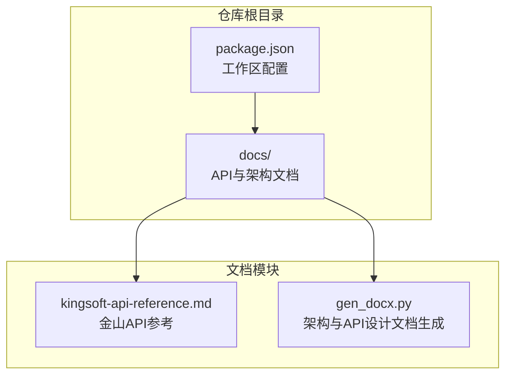
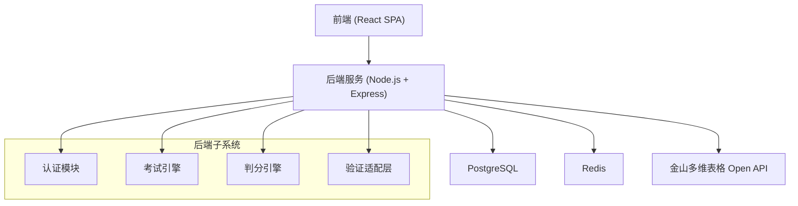
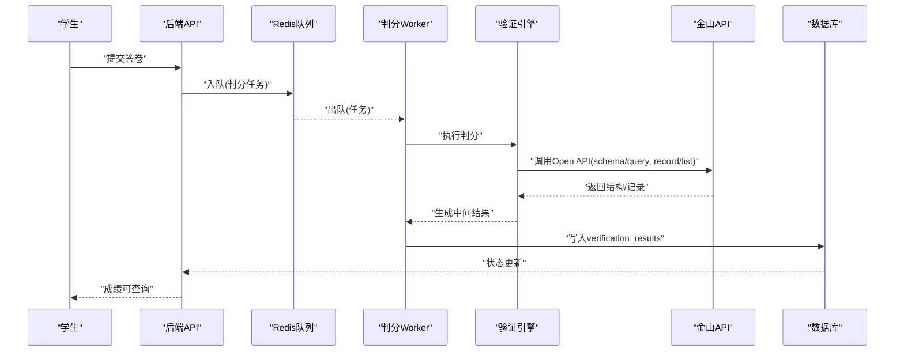
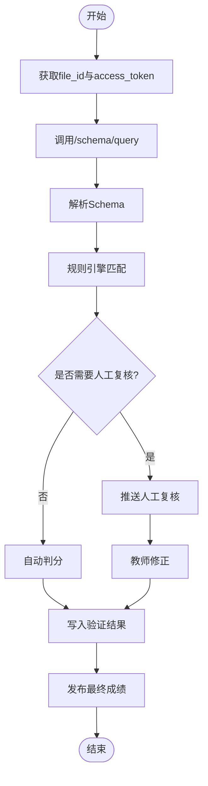
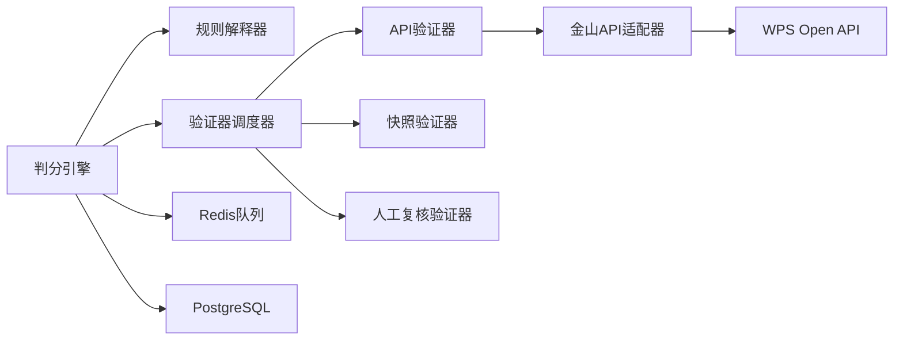

# 判分系统API

<cite>
**本文档引用的文件**
- [package.json](file://package.json)
- [kingsoft-api-reference.md](file://docs/kingsoft-api-reference.md)
- [gen_docx.py](file://gen_doc_docx.py)
</cite>

## 目录
1. [简介](#简介)
2. [项目结构](#项目结构)
3. [核心组件](#核心组件)
4. [架构总览](#架构总览)
5. [详细组件分析](#详细组件分析)
6. [依赖分析](#依赖分析)
7. [性能考虑](#性能考虑)
8. [故障排除指南](#故障排除指南)
9. [结论](#结论)
10. [附录](#附录)

## 简介
本文件面向判分系统API的使用者与维护者，系统性梳理自动判分、人工复核、成绩管理等接口规范，并结合现有仓库文档，给出18种验证动作的API调用方式、异步判分队列与成绩更新机制、判分规则配置、复核流程与最终成绩发布说明。同时解释验证引擎与API的交互方式以及性能优化策略，并提供判分准确性保证与异常处理方案。

## 项目结构
该仓库采用monorepo结构，使用npm workspaces组织前后端工程；判分系统相关的核心设计与API规范主要沉淀在文档中，包括：
- 金山多维表格Open API参考与规则映射
- 判分系统总体架构与数据库模型
- 验证引擎设计与验证动作清单
- API设计与判分相关端点

**图表来源**
- [package.json:17-20](file://package.json#L17-L20)
- [kingsoft-api-reference.md:1-603](file://docs/kingsoft-api-reference.md#L1-L603)
- [gen_docx.py:510-542](file://gen_docx.py#L510-L542)

**章节来源**
- [package.json:17-20](file://package.json#L17-L20)
- [kingsoft-api-reference.md:1-603](file://docs/kingsoft-api-reference.md#L1-L603)
- [gen_docx.py:510-542](file://gen_docx.py#L510-L542)

## 核心组件
- 验证引擎与规则解释器：负责解析题目中的验证规则JSONB，调度对应验证器执行判分。
- 验证器适配层：提供可插拔的验证器实现，包括API验证器、快照验证器、人工复核验证器。
- 金山API适配器：封装WPS Open API调用，统一鉴权、错误处理与重试。
- 异步判分队列：基于Redis的后台任务队列，承载批量判分与重试。
- 成绩管理服务：负责成绩聚合、人工复核、最终发布与历史归档。

**章节来源**
- [gen_docx.py:305-356](file://gen_docx.py#L305-L356)
- [kingsoft-api-reference.md:540-561](file://docs/kingsoft-api-reference.md#L540-L561)

## 架构总览
判分系统采用三层架构：前端SPA、后端REST API、数据层（PostgreSQL + Redis），并通过金山多维表格Open API进行外部验证。

**图表来源**
- [gen_docx.py:140-170](file://gen_docx.py#L140-L170)
- [gen_docx.py:189-206](file://gen_docx.py#L189-L206)

## 详细组件分析

### 1. 验证动作与API映射
根据规则映射表，18种验证动作与对应API调用方式如下：

- 表操作
  - check_table_exists → schema/query：检查表是否存在
  - check_table_name → schema/query：模糊匹配表名
  - check_table_count → schema/query：统计表数量

- 字段
  - check_field → schema/query：匹配字段名与类型
  - check_field_count → schema/query：统计字段数量
  - check_field_required → schema/query：检查必填属性
  - check_field_formula → schema/query：检查公式字段
  - check_linked_record → schema/query：检查关联字段与目标表

- 视图
  - check_view_exists → schema/query：检查视图存在
  - check_view_type → schema/query：检查视图类型
  - check_view_filter → 需额外API：视图筛选条件
  - check_view_sort → 需额外API：视图排序规则
  - check_view_group → schema/query：看板视图分组字段

- 表单
  - check_form_exists → schema/query：检查表单视图存在
  - check_form_fields → 需额外API：表单字段可见性
  - check_form_settings → 需额外API：表单设置

- 记录
  - check_record_exists → record/list：检查记录存在
  - check_record_value → record/list：匹配字段值
  - check_record_count → record/list：统计记录数量

上述映射关系与调用方式详见规则映射表与示例。

**章节来源**
- [kingsoft-api-reference.md:514-539](file://docs/kingsoft-api-reference.md#L514-L539)

### 2. 金山多维表格Open API规范
- 基础信息
  - Base URL：https://openapi.wps.cn/kopen/office/file/:file_id/core/execute/{action}
  - 请求方法：全部为POST
  - 鉴权方式：WPS-3签名（Content-Md5 + Date + X-Auth）
  - Content-Type：application/json
  - 通用响应：{ "result": 0, "detail": {...} } — result=0表示成功

- 认证请求头
  - Content-Md5：请求体MD5（十六进制小写）
  - Content-Type：application/json
  - Date：RFC 7231格式
  - X-Auth：WPS-3签名计算结果

- 核心接口
  - Schema查询：/schema/query（一次性获取完整表结构）
  - 表操作：/sheet/create、/sheet/update、/sheet/delete
  - 字段操作：/fields/create、/fields/update、/fields/delete
  - 记录操作：/record/create、/record/update、/record/delete、/record/retrieve、/record/list

- 请求示例
  - Schema查询与创建表的完整请求示例

**章节来源**
- [kingsoft-api-reference.md:33-68](file://docs/kingsoft-api-reference.md#L33-L68)
- [kingsoft-api-reference.md:449-500](file://docs/kingsoft-api-reference.md#L449-L500)

### 3. 判分规则配置
- 规则存储：题目answer_rules以JSONB形式存储，支持灵活扩展。
- 规则结构示例：包含action、params、score等字段。
- 规则构建器：提供可视化界面帮助教师构建规则。

**章节来源**
- [gen_docx.py:227-239](file://gen_docx.py#L227-L239)
- [gen_docx.py:389-414](file://gen_docx.py#L389-L414)

### 4. 异步判分队列与成绩更新机制
- 判分队列：使用Redis Bull队列，承载批量判分与重试。
- 判分生命周期：
  - 学生提交答卷 → 系统加入判分队列
  - 后台Worker消费队列 → 调用验证引擎 → 生成中间结果
  - 人工复核（needs_review=true）→ 教师介入修正
  - 最终成绩发布 → 更新student_submissions与verification_results

**图表来源**
- [gen_docx.py:416-435](file://gen_docx.py#L416-L435)
- [kingsoft-api-reference.md:503-513](file://docs/kingsoft-api-reference.md#L503-L513)

**章节来源**
- [gen_docx.py:416-435](file://gen_docx.py#L416-L435)
- [kingsoft-api-reference.md:503-513](file://docs/kingsoft-api-reference.md#L503-L513)

### 5. 人工复核流程
- 标记机制：当规则无法自动判定时，标记needs_review=true。
- 复核界面：教师可在阅卷页面查看待复核任务，进行分数修正与评语编写。
- 复核后更新：复核结果写回verification_results，并触发最终成绩更新。

**章节来源**
- [gen_docx.py:357-366](file://gen_docx.py#L357-L366)
- [gen_docx.py:432-434](file://gen_docx.py#L432-L434)

### 6. 最终成绩发布
- 成绩聚合：汇总每题得分，计算总分与通过状态。
- 成绩落库：更新student_submissions状态为已评分，写入总分与评语。
- 成绩发布：向学生端推送成绩，支持查看详情与导出。

**章节来源**
- [gen_docx.py:216-226](file://gen_docx.py#L216-L226)
- [gen_docx.py:283-288](file://gen_docx.py#L283-L288)

### 7. 验证引擎与API交互
- 核心流程：获取file_id与access_token → 调用/schema/query → 规则引擎匹配 → 生成判分报告。
- 适配器实现：提供KingsoftAdapter接口，封装API调用与缓存查询。
- 错误处理：针对401、404、429等常见错误进行处理与重试。

**图表来源**
- [kingsoft-api-reference.md:503-513](file://docs/kingsoft-api-reference.md#L503-L513)
- [kingsoft-api-reference.md:540-561](file://docs/kingsoft-api-reference.md#L540-L561)

**章节来源**
- [kingsoft-api-reference.md:503-513](file://docs/kingsoft-api-reference.md#L503-L513)
- [kingsoft-api-reference.md:540-561](file://docs/kingsoft-api-reference.md#L540-L561)

## 依赖分析
- 组件耦合
  - 验证引擎与验证器解耦，通过统一接口扩展新验证器。
  - 金山API适配器与业务层解耦，便于替换与测试。
- 外部依赖
  - 金山多维表格Open API：作为外部验证源。
  - Redis：用于队列与缓存。
  - PostgreSQL：持久化业务数据。

**图表来源**
- [gen_docx.py:305-356](file://gen_docx.py#L305-L356)
- [gen_docx.py:510-542](file://gen_docx.py#L510-L542)

**章节来源**
- [gen_docx.py:305-356](file://gen_docx.py#L305-L356)
- [gen_docx.py:510-542](file://gen_docx.py#L510-L542)

## 性能考虑
- 异步判分：提交后异步处理，避免同步阻塞与API调用延迟影响用户体验。
- 队列与并发：使用Redis队列承载批量任务，合理设置并发Worker数量。
- 缓存策略：对Schema与常用元数据进行缓存，减少重复API调用。
- 错误重试：对限流与临时失败进行指数退避重试，提升成功率。
- 并发判分：在高并发场景下，合理拆分任务与分片处理。

**章节来源**
- [gen_docx.py:494-507](file://gen_docx.py#L494-L507)
- [kingsoft-api-reference.md:556-561](file://docs/kingsoft-api-reference.md#L556-L561)

## 故障排除指南
- 401错误：access_token过期 → 引导学生重新授权或刷新token。
- 404错误：file_id无效 → 检查表格链接与权限。
- 429错误：频率限制 → 指数退避重试，降低并发。
- 网络抖动：增加超时与重试策略，确保幂等性。
- 人工复核积压：监控队列长度，及时扩容Worker或优化规则。

**章节来源**
- [kingsoft-api-reference.md:556-561](file://docs/kingsoft-api-reference.md#L556-L561)

## 结论
本判分系统通过规则驱动的验证引擎与可插拔的验证器，结合异步判分队列与人工复核机制，实现了高效、准确、可追溯的成绩管理流程。依托金山多维表格Open API，系统能够精确验证学生操作结果，并通过清晰的发布流程保障最终成绩的权威性与透明度。

## 附录

### A. 判分相关API端点概览
- 认证与用户管理：登录、注册、刷新、个人信息
- 题库与考试：题目CRUD、分类管理、考试CRUD、发布/开始/结束
- 学生参与：我的考试、开始答题、提交答卷、查看成绩
- 判分：触发自动判分、手动打分、批量评分、完成评分
- 统计分析：总览、单场分析、学生画像
- 金山API代理：统一代理调用、获取表/字段/视图列表

**章节来源**
- [gen_docx.py:241-300](file://gen_docx.py#L241-L300)

### B. 验证动作清单（18种）
- 表操作：check_table_exists、check_table_name、check_table_count
- 字段：check_field、check_field_count、check_field_required、check_field_formula、check_linked_record
- 视图：check_view_exists、check_view_type、check_view_filter、check_view_sort、check_view_group
- 表单：check_form_exists、check_form_fields、check_form_settings
- 记录：check_record_exists、check_record_value、check_record_count

**章节来源**
- [gen_docx.py:315-339](file://gen_docx.py#L315-L339)