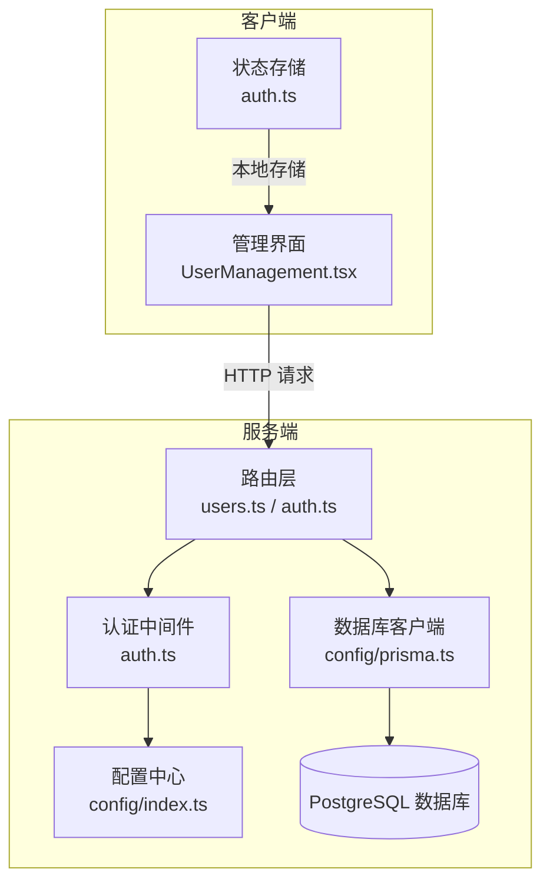
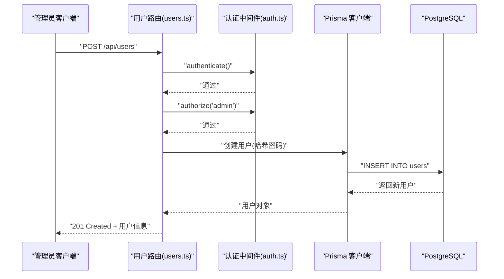
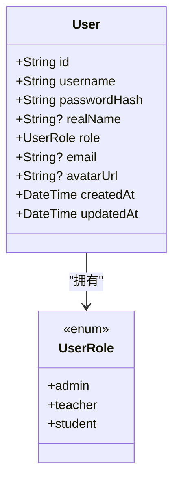
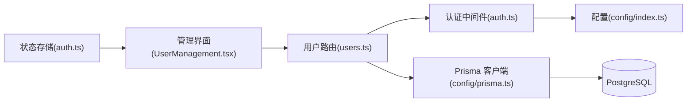

# 用户管理API

<cite>
**本文档引用的文件**
- [packages/server/src/routes/users.ts](file://packages/server/src/routes/users.ts)
- [packages/server/src/middleware/auth.ts](file://packages/server/src/middleware/auth.ts)
- [packages/server/src/config/index.ts](file://packages/server/src/config/index.ts)
- [packages/server/src/config/prisma.ts](file://packages/server/src/config/prisma.ts)
- [packages/server/prisma/schema.prisma](file://packages/server/prisma/schema.prisma)
- [packages/server/src/routes/auth.ts](file://packages/server/src/routes/auth.ts)
- [packages/client/src/pages/admin/UserManagement.tsx](file://packages/client/src/pages/admin/UserManagement.tsx)
- [packages/client/src/stores/auth.ts](file://packages/client/src/stores/auth.ts)
- [packages/server/src/middleware/error-handler.ts](file://packages/server/src/middleware/error-handler.ts)
</cite>

## 目录
1. [简介](#简介)
2. [项目结构](#项目结构)
3. [核心组件](#核心组件)
4. [架构总览](#架构总览)
5. [详细组件分析](#详细组件分析)
6. [依赖关系分析](#依赖关系分析)
7. [性能考虑](#性能考虑)
8. [故障排除指南](#故障排除指南)
9. [结论](#结论)
10. [附录](#附录)

## 简介
本文件为“用户管理API”的完整技术文档，覆盖用户CRUD操作、分页查询与筛选、角色分配、权限控制与数据验证规则，并提供请求示例、响应格式与错误处理方案。同时解释用户状态管理与安全策略，包含管理员操作指南与批量处理最佳实践。

## 项目结构
后端采用Express + Prisma + PostgreSQL，前端使用React + Ant Design。用户管理API位于服务端路由模块中，配合认证中间件实现基于JWT的权限控制；前端通过Ant Design组件实现用户列表、新增、编辑与删除操作。

图表来源
- [packages/server/src/routes/users.ts:1-180](file://packages/server/src/routes/users.ts#L1-L180)
- [packages/server/src/routes/auth.ts:1-152](file://packages/server/src/routes/auth.ts#L1-L152)
- [packages/server/src/middleware/auth.ts:1-45](file://packages/server/src/middleware/auth.ts#L1-L45)
- [packages/server/src/config/index.ts:1-22](file://packages/server/src/config/index.ts#L1-L22)
- [packages/server/src/config/prisma.ts:1-9](file://packages/server/src/config/prisma.ts#L1-L9)
- [packages/client/src/pages/admin/UserManagement.tsx:1-63](file://packages/client/src/pages/admin/UserManagement.tsx#L1-L63)
- [packages/client/src/stores/auth.ts:1-43](file://packages/client/src/stores/auth.ts#L1-L43)

章节来源
- [packages/server/src/routes/users.ts:1-180](file://packages/server/src/routes/users.ts#L1-L180)
- [packages/server/src/routes/auth.ts:1-152](file://packages/server/src/routes/auth.ts#L1-L152)
- [packages/server/src/middleware/auth.ts:1-45](file://packages/server/src/middleware/auth.ts#L1-L45)
- [packages/server/src/config/index.ts:1-22](file://packages/server/src/config/index.ts#L1-L22)
- [packages/server/src/config/prisma.ts:1-9](file://packages/server/src/config/prisma.ts#L1-L9)
- [packages/client/src/pages/admin/UserManagement.tsx:1-63](file://packages/client/src/pages/admin/UserManagement.tsx#L1-L63)
- [packages/client/src/stores/auth.ts:1-43](file://packages/client/src/stores/auth.ts#L1-L43)

## 核心组件
- 用户路由模块：提供用户列表、详情、创建、更新、删除接口，支持分页、模糊搜索与角色过滤。
- 认证与授权中间件：统一鉴权入口，校验JWT并按角色放行。
- 数据模型与验证：基于Prisma schema与Zod进行数据约束与输入校验。
- 前端管理界面：提供用户增删改查UI，集成分页与表单校验。

章节来源
- [packages/server/src/routes/users.ts:26-180](file://packages/server/src/routes/users.ts#L26-L180)
- [packages/server/src/middleware/auth.ts:19-45](file://packages/server/src/middleware/auth.ts#L19-L45)
- [packages/server/prisma/schema.prisma:60-79](file://packages/server/prisma/schema.prisma#L60-L79)
- [packages/client/src/pages/admin/UserManagement.tsx:13-63](file://packages/client/src/pages/admin/UserManagement.tsx#L13-L63)

## 架构总览
用户管理API遵循“路由-中间件-数据访问-数据库”分层设计，所有接口均需通过认证中间件，管理员可执行创建、更新、删除操作，教师可读取用户信息。

图表来源
- [packages/server/src/routes/users.ts:97-131](file://packages/server/src/routes/users.ts#L97-L131)
- [packages/server/src/middleware/auth.ts:19-45](file://packages/server/src/middleware/auth.ts#L19-L45)
- [packages/server/src/config/prisma.ts:1-9](file://packages/server/src/config/prisma.ts#L1-L9)

## 详细组件分析

### 路由与控制器
- GET /api/users：分页查询用户，支持关键词搜索（用户名/真实姓名/邮箱）与角色过滤，返回数据、总数、页码与每页大小。
- GET /api/users/:id：按ID获取用户详情。
- POST /api/users：管理员创建用户，校验用户名唯一性，密码加密后入库。
- PUT /api/users/:id：管理员更新用户信息（真实姓名、邮箱、角色、头像URL）。
- DELETE /api/users/:id：管理员删除用户。

章节来源
- [packages/server/src/routes/users.ts:26-180](file://packages/server/src/routes/users.ts#L26-L180)

### 认证与授权中间件
- 认证流程：从Authorization头解析Bearer Token，使用JWT密钥验证签名，将用户信息注入请求上下文。
- 授权流程：根据所需角色列表判断是否放行，未认证返回401，权限不足返回403。

章节来源
- [packages/server/src/middleware/auth.ts:19-45](file://packages/server/src/middleware/auth.ts#L19-L45)

### 数据模型与验证
- 用户模型字段：id、username、passwordHash、realName、role、email、avatarUrl、createdAt、updatedAt。
- 输入验证：
  - 创建用户：用户名长度限制、密码最小长度、角色枚举、可选真实姓名与邮箱。
  - 更新用户：可选字段更新，角色枚举。
- 错误处理：Zod校验失败返回400，Prisma记录不存在返回404，其他异常返回500。

章节来源
- [packages/server/prisma/schema.prisma:60-79](file://packages/server/prisma/schema.prisma#L60-L79)
- [packages/server/src/routes/users.ts:11-24](file://packages/server/src/routes/users.ts#L11-L24)
- [packages/server/src/middleware/error-handler.ts:7-12](file://packages/server/src/middleware/error-handler.ts#L7-L12)

### 前端管理界面
- 列表展示：分页加载用户数据，显示角色标签。
- 新增/编辑：弹窗表单，提交时调用后端接口。
- 删除：二次确认，调用删除接口。
- 状态存储：登录态与用户信息持久化到本地存储。

章节来源
- [packages/client/src/pages/admin/UserManagement.tsx:13-63](file://packages/client/src/pages/admin/UserManagement.tsx#L13-L63)
- [packages/client/src/stores/auth.ts:13-43](file://packages/client/src/stores/auth.ts#L13-L43)

### 数据模型类图

图表来源
- [packages/server/prisma/schema.prisma:12-16](file://packages/server/prisma/schema.prisma#L12-L16)
- [packages/server/prisma/schema.prisma:60-79](file://packages/server/prisma/schema.prisma#L60-L79)

## 依赖关系分析
- 路由依赖认证中间件与Prisma客户端。
- 认证中间件依赖配置中心中的JWT密钥与过期时间。
- Prisma客户端连接PostgreSQL数据库。
- 前端依赖路由与状态存储。

图表来源
- [packages/server/src/routes/users.ts:1-10](file://packages/server/src/routes/users.ts#L1-L10)
- [packages/server/src/middleware/auth.ts:1-17](file://packages/server/src/middleware/auth.ts#L1-L17)
- [packages/server/src/config/index.ts:4-10](file://packages/server/src/config/index.ts#L4-L10)
- [packages/server/src/config/prisma.ts:1-9](file://packages/server/src/config/prisma.ts#L1-L9)
- [packages/client/src/pages/admin/UserManagement.tsx:1-6](file://packages/client/src/pages/admin/UserManagement.tsx#L1-L6)
- [packages/client/src/stores/auth.ts:1-11](file://packages/client/src/stores/auth.ts#L1-L11)

章节来源
- [packages/server/src/routes/users.ts:1-10](file://packages/server/src/routes/users.ts#L1-L10)
- [packages/server/src/middleware/auth.ts:1-17](file://packages/server/src/middleware/auth.ts#L1-L17)
- [packages/server/src/config/index.ts:4-10](file://packages/server/src/config/index.ts#L4-L10)
- [packages/server/src/config/prisma.ts:1-9](file://packages/server/src/config/prisma.ts#L1-L9)
- [packages/client/src/pages/admin/UserManagement.tsx:1-6](file://packages/client/src/pages/admin/UserManagement.tsx#L1-L6)
- [packages/client/src/stores/auth.ts:1-11](file://packages/client/src/stores/auth.ts#L1-L11)

## 性能考虑
- 分页查询：使用skip/take避免一次性拉取大量数据，建议前端默认pageSize不超过100。
- 并发查询：列表接口对查询与计数使用Promise并发执行，减少往返延迟。
- 密码哈希：使用bcrypt进行哈希，成本因子为10，兼顾安全性与性能。
- 缓存策略：可结合Redis缓存热点用户信息，降低数据库压力。

## 故障排除指南
- 未提供认证令牌或格式不正确：返回401，提示未提供认证令牌。
- JWT无效或已过期：返回401，提示认证令牌无效或已过期。
- 权限不足：返回403，提示权限不足。
- 参数校验失败：返回400，包含具体字段错误。
- 用户名冲突：创建用户时用户名已存在返回409。
- 记录不存在：更新/删除用户时返回404。
- 服务器内部错误：返回500，开发环境包含详细错误信息。

章节来源
- [packages/server/src/middleware/auth.ts:20-32](file://packages/server/src/middleware/auth.ts#L20-L32)
- [packages/server/src/middleware/auth.ts:35-44](file://packages/server/src/middleware/auth.ts#L35-L44)
- [packages/server/src/routes/users.ts:125-130](file://packages/server/src/routes/users.ts#L125-L130)
- [packages/server/src/routes/users.ts:103-105](file://packages/server/src/routes/users.ts#L103-L105)
- [packages/server/src/routes/users.ts:162-166](file://packages/server/src/routes/users.ts#L162-L166)
- [packages/server/src/middleware/error-handler.ts:7-17](file://packages/server/src/middleware/error-handler.ts#L7-L17)

## 结论
用户管理API以清晰的分层架构与严格的权限控制为基础，结合Prisma与Zod实现高效、安全的数据访问与输入校验。前端提供直观的管理界面，便于管理员进行用户维护。建议在生产环境中启用HTTPS、合理设置JWT过期时间，并对高频接口引入缓存与限流策略。

## 附录

### 接口规范总览
- 基础路径：/api/users
- 认证方式：Bearer Token（Authorization 头）
- 默认分页：page=1，pageSize=20
- 支持查询参数：
  - page：页码
  - pageSize：每页条数
  - search：关键词（用户名/真实姓名/邮箱）
  - role：角色过滤

章节来源
- [packages/server/src/routes/users.ts:29-44](file://packages/server/src/routes/users.ts#L29-L44)

### 用户CRUD接口定义
- 获取用户列表
  - 方法：GET
  - 路径：/api/users
  - 查询参数：page、pageSize、search、role
  - 成功响应：包含data、total、page、pageSize的对象
- 获取用户详情
  - 方法：GET
  - 路径：/api/users/:id
  - 成功响应：用户对象（含基础字段）
- 创建用户
  - 方法：POST
  - 路径：/api/users
  - 需要角色：admin
  - 请求体：username、password、realName（可选）、email（可选）、role
  - 成功响应：新建用户摘要信息
- 更新用户
  - 方法：PUT
  - 路径：/api/users/:id
  - 需要角色：admin
  - 请求体：realName（可选）、email（可选）、role（可选）、avatarUrl（可选）
  - 成功响应：更新后的用户对象
- 删除用户
  - 方法：DELETE
  - 路径：/api/users/:id
  - 需要角色：admin
  - 成功响应：删除成功消息

章节来源
- [packages/server/src/routes/users.ts:26-180](file://packages/server/src/routes/users.ts#L26-L180)

### 请求与响应示例
- 获取用户列表（成功）
  - 请求：GET /api/users?page=1&pageSize=20&search=张三&role=student
  - 响应：{
    "data": [ { "id": "...", "username": "...", "realName": "...", "role": "...", "email": "...", "avatarUrl": "...", "createdAt": "..." } ],
    "total": 1,
    "page": 1,
    "pageSize": 20
  }
- 创建用户（成功）
  - 请求：POST /api/users
  - 请求体：{ "username": "testuser", "password": "Password123", "realName": "测试用户", "email": "test@example.com", "role": "student" }
  - 响应：{ "id": "...", "username": "testuser", "realName": "测试用户", "role": "student", "email": "test@example.com" }
- 更新用户（成功）
  - 请求：PUT /api/users/:id
  - 请求体：{ "realName": "修改后的姓名", "email": "new@example.com", "role": "teacher" }
  - 响应：同上更新后的用户对象
- 删除用户（成功）
  - 请求：DELETE /api/users/:id
  - 响应：{ "message": "删除成功" }

章节来源
- [packages/server/src/routes/users.ts:26-180](file://packages/server/src/routes/users.ts#L26-L180)

### 数据验证规则
- 创建用户
  - username：字符串，最小长度2，最大长度64
  - password：字符串，最小长度6
  - realName：字符串（可选），最大长度128
  - email：邮箱格式（可选）
  - role：枚举值['admin','teacher','student']
- 更新用户
  - realName：字符串（可选），最大长度128
  - email：邮箱格式（可选）
  - role：枚举值['admin','teacher','student']（可选）
  - avatarUrl：字符串（可选）

章节来源
- [packages/server/src/routes/users.ts:11-24](file://packages/server/src/routes/users.ts#L11-L24)
- [packages/server/prisma/schema.prisma:60-79](file://packages/server/prisma/schema.prisma#L60-L79)

### 权限控制与安全策略
- 所有用户管理接口均需认证，未携带有效Bearer Token将被拒绝。
- 管理员（admin）可执行创建、更新、删除；教师（teacher）可读取用户信息。
- JWT密钥与过期时间在配置中心集中管理，建议生产环境使用强密钥与合理过期时间。
- 密码采用bcrypt哈希存储，不可逆。

章节来源
- [packages/server/src/middleware/auth.ts:19-45](file://packages/server/src/middleware/auth.ts#L19-L45)
- [packages/server/src/config/index.ts:7-10](file://packages/server/src/config/index.ts#L7-L10)
- [packages/server/src/routes/users.ts:98-131](file://packages/server/src/routes/users.ts#L98-L131)

### 批量导入与最佳实践
- 批量导入建议通过后端脚本或定时任务实现，避免前端直接发起大量请求导致超时或限流。
- 导入前进行数据清洗与去重（如用户名唯一性检查），减少重复请求。
- 使用事务批量写入数据库，确保一致性。
- 对高并发场景增加限流与重试机制，防止数据库压力过大。
- 导入完成后进行校验与回滚策略，保证数据质量。

[本节为通用实践建议，无需特定文件引用]

### 管理员操作指南
- 登录系统后，在管理界面进行用户管理。
- 新增用户时选择合适角色（admin/teacher/student），填写必要信息并设置密码。
- 更新用户信息时谨慎修改角色，避免权限提升风险。
- 删除用户前确认其无关联业务数据，防止影响考试或评分流程。
- 定期清理长期未使用的账户，保持系统整洁。

[本节为通用操作说明，无需特定文件引用]