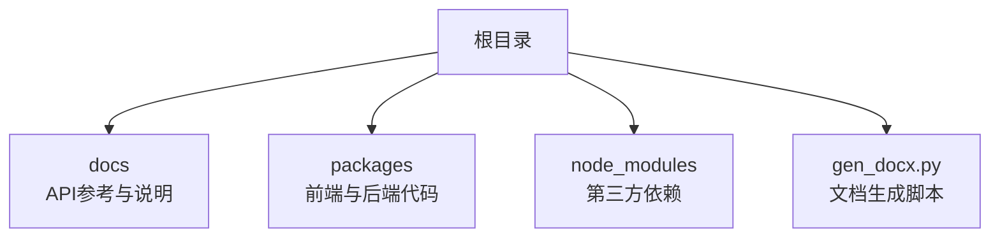
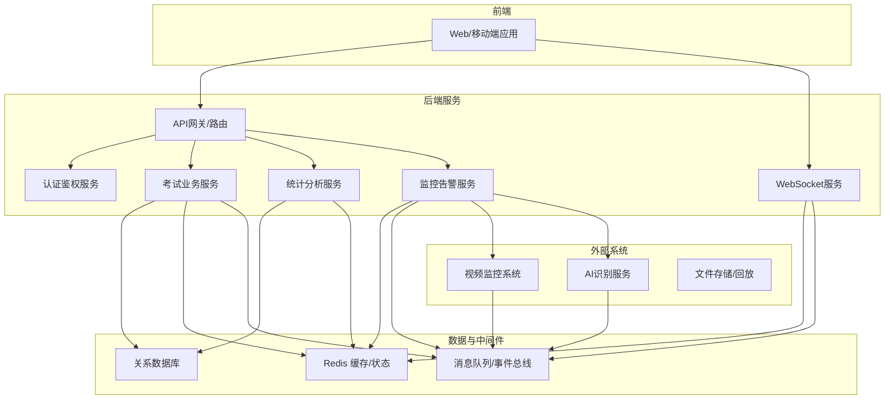
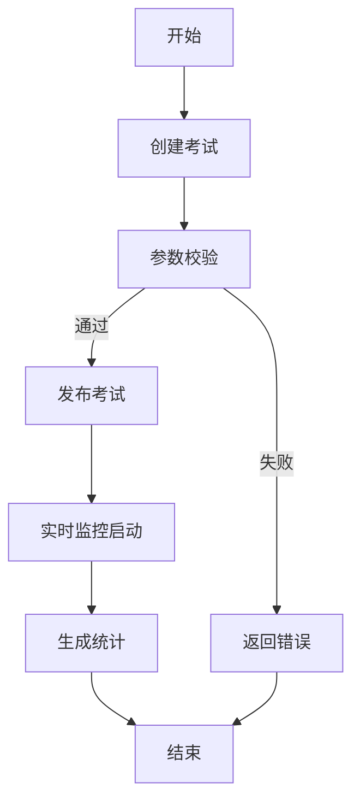
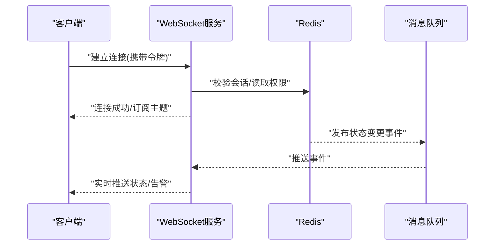
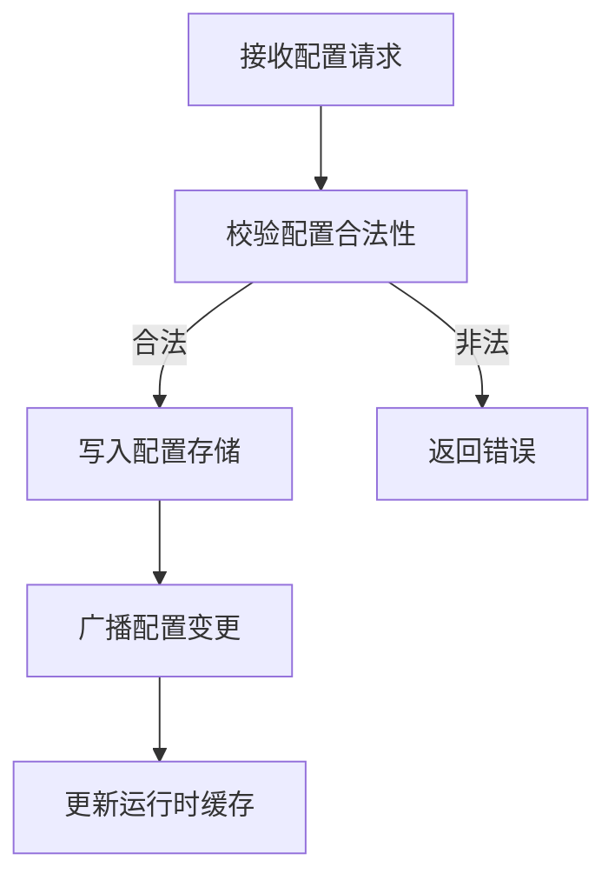
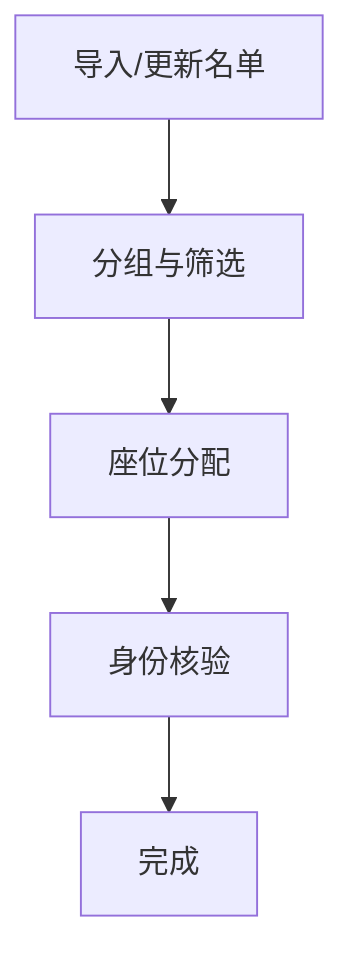
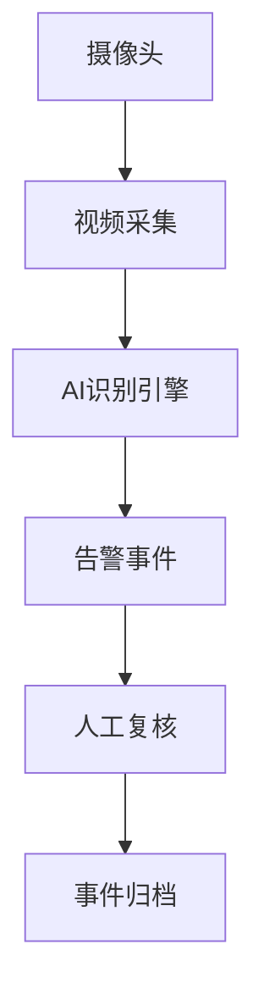
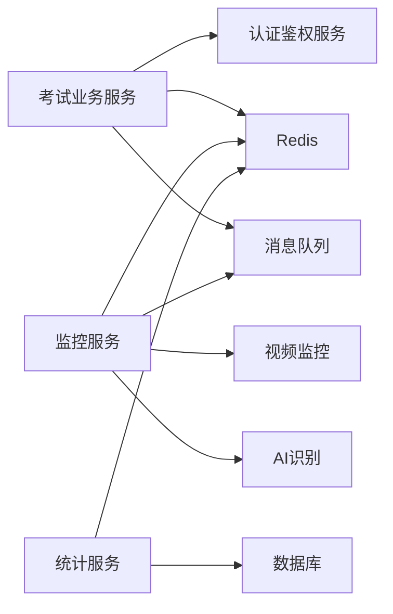

# 考试管理API

<cite>
**本文档引用的文件**
- [gen_docx.py](file://gen_docx.py)
- [kingsoft-api-reference.md](file://docs/kingsoft-api-reference.md)
</cite>

## 目录
1. [引言](#引言)
2. [项目结构](#项目结构)
3. [核心组件](#核心组件)
4. [架构总览](#架构总览)
5. [详细组件分析](#详细组件分析)
6. [依赖关系分析](#依赖关系分析)
7. [性能考虑](#性能考虑)
8. [故障排除指南](#故障排除指南)
9. [结论](#结论)
10. [附录](#附录)

## 引言
本文件为考试管理API的完整技术文档，聚焦于系统提供的考试生命周期管理（创建、发布、监控、统计）、实时监控与状态同步、考试配置与时间设置、参与学生管理以及考场监控等能力。同时，结合仓库中的现有资料，对WebSocket实时通信与Redis状态管理进行概念性说明，并给出异常处理与流程管理建议。

由于当前仓库中未包含后端服务的具体实现代码，本文档在“核心组件”“详细组件分析”等章节以概念性描述为主，重点通过“架构总览”“依赖关系分析”“流程图”等帮助读者理解整体设计思路与集成点；在“故障排除指南”中提供通用的异常处理策略与最佳实践。

## 项目结构
仓库采用多包结构组织，包含客户端与服务端两个主要部分。当前可确认的关键文件如下：
- 文档参考：docs/kingsoft-api-reference.md（API参考）
- 文档生成脚本：gen_docx.py（用于生成文档）

**章节来源**
- [gen_docx.py](file://gen_docx.py)
- [kingsoft-api-reference.md](file://docs/kingsoft-api-reference.md)

## 核心组件
本节从系统视角概述考试管理API的核心模块与职责边界，便于理解各模块如何协同完成考试全生命周期管理。

- 考试生命周期管理
  - 考试创建：定义考试基本信息、科目、题型、分值权重等配置项
  - 考试发布：设置开始/结束时间、发布范围、是否启用防切屏等策略
  - 考试监控：实时监控考生状态、异常行为检测、考场画面回放
  - 考试统计：生成答题统计、得分分布、排名等报表
- 实时监控与状态同步
  - WebSocket：用于推送实时状态（如考生登录、异常告警、监考指令）
  - Redis：用于缓存考试状态、会话信息、并发控制与分布式锁
- 考试配置与时间设置
  - 配置维度：时长、交卷策略、防作弊规则、显示/隐藏选项
  - 时间维度：开考/收考、临时暂停/恢复、延时/提前交卷
- 参与学生管理
  - 学生分组、名单导入、座位安排、身份核验
- 考场监控
  - 多路视频流接入、异常行为识别、人工复核通道

上述模块在实际系统中通常由独立的服务或微服务承载，通过统一的网关或内部RPC进行交互。

## 架构总览
下图展示了考试管理API的整体架构：前端通过HTTP与WebSocket与后端交互；后端服务负责业务编排，使用Redis进行状态存储与同步；外部系统（如视频监控、AI识别）通过事件或消息队列接入。

## 详细组件分析

### 考试生命周期管理
- 考试创建
  - 输入：考试基础信息、题目集合、作答时限、防作弊策略
  - 输出：考试标识、默认配置、初始状态
  - 关键约束：时间窗口校验、题目数量与分值一致性检查
- 考试发布
  - 输入：发布时间、可见范围、是否启用防切屏
  - 输出：发布状态、可访问链接/入口
  - 关键约束：发布窗口与系统维护窗口冲突检查
- 考试监控
  - 输入：实时心跳、异常事件、监考指令
  - 输出：状态变更通知、告警事件、处置建议
- 考试统计
  - 输入：答题记录、主观题评分、异常标记
  - 输出：统计报表、排名、趋势分析

### 实时监控与状态同步
- WebSocket连接建立
  - 前端发起握手，携带认证令牌与订阅主题
  - 后端验证后建立持久连接，向客户端推送状态更新
- 状态同步机制
  - 使用Redis存储考试状态与会话信息，确保多实例一致性
  - 通过消息队列广播状态变更，避免轮询带来的延迟
- 典型事件
  - 考生登录/登出
  - 异常行为触发告警
  - 监考指令下发与确认

### 考试配置与时间设置
- 配置项
  - 时长、交卷策略（立即/定时）、防作弊规则（切屏检测、摄像头监控）
  - 显示/隐藏选项（答案、解析、排名）
- 时间设置
  - 开考/收考时间、临时暂停/恢复、延时/提前交卷
- 并发与一致性
  - 使用分布式锁防止并发修改
  - 通过版本号或时间戳保证最终一致性

### 参与学生管理
- 分组与名单
  - 支持批量导入、手动添加、分组筛选
- 座位安排
  - 自动/手动分配座位，绑定摄像头与监控视角
- 身份核验
  - 考前核验、人脸识别、设备绑定

### 考场监控
- 视频接入
  - 多路视频流接入，支持断线重连与清晰度切换
- 行为识别
  - AI识别异常行为（左顾右盼、多人、手机出现等）
- 人工复核
  - 告警事件进入人工复核通道，支持标注与归档

## 依赖关系分析
- 组件耦合
  - 考试业务服务与认证鉴权服务强耦合，确保访问控制
  - 监控服务与消息队列、Redis高耦合，保障低延迟与高可用
- 外部依赖
  - 视频监控与AI识别作为外部系统，通过消息队列解耦
- 数据一致性
  - 使用Redis作为共享状态存储，配合消息队列实现最终一致

## 性能考虑
- 连接池与超时
  - WebSocket连接池大小按峰值并发设定，合理设置读写超时
- 缓存策略
  - 将高频读取的配置与会话信息放入Redis，减少数据库压力
- 消息批处理
  - 对状态变更进行批处理与去抖，降低消息风暴
- 异步处理
  - 统计计算与日志落盘采用异步队列，避免阻塞主流程

## 故障排除指南
- 认证失败
  - 检查令牌有效性与过期时间，确认鉴权服务可用性
- 连接中断
  - 检查网络稳定性与防火墙策略，确认WebSocket代理配置
- 状态不同步
  - 校验Redis可用性与键空间一致性，排查消息丢失
- 性能瓶颈
  - 监控数据库慢查询与Redis热点键，优化索引与缓存命中率
- 异常处理建议
  - 对外统一返回错误码与提示，内部记录详细日志与追踪ID
  - 对关键操作增加幂等性与重试机制，避免重复执行

## 结论
本文件基于现有仓库资料，构建了考试管理API的概念性架构与流程说明。尽管当前未包含具体后端实现代码，但通过“架构总览”“流程图”“依赖关系分析”等可视化方式，读者可以快速把握系统设计思路与集成要点。建议后续补充后端服务代码与数据库Schema，以便进一步完善接口定义与实现细节。

## 附录
- 文档生成工具：gen_docx.py（用于将Markdown转换为Word文档）
- API参考：docs/kingsoft-api-reference.md（包含接口命名、请求示例与响应格式）

**章节来源**
- [gen_docx.py](file://gen_docx.py)
- [kingsoft-api-reference.md](file://docs/kingsoft-api-reference.md)