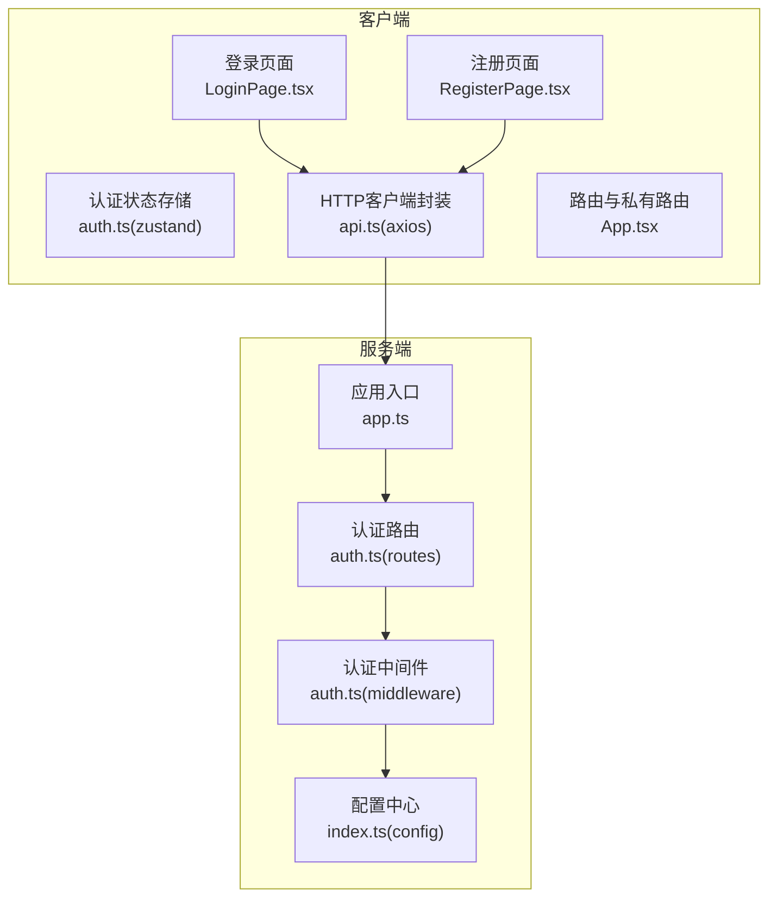
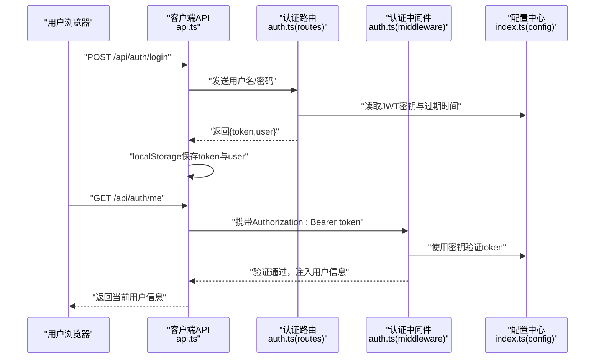
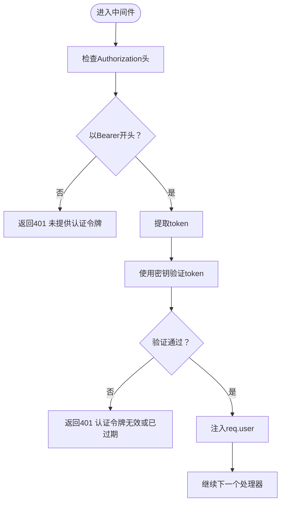
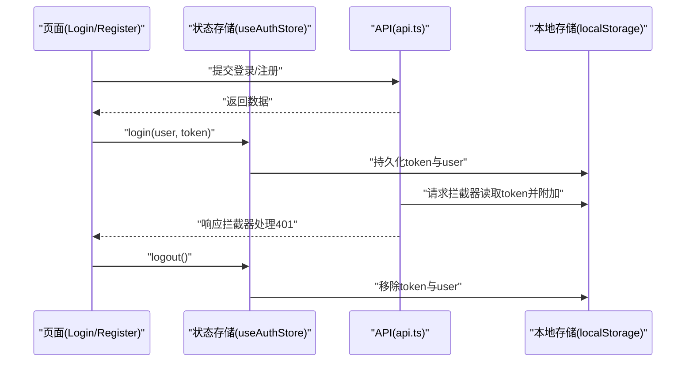
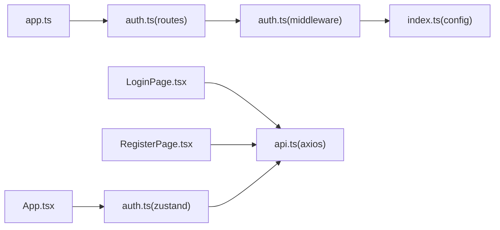

# 认证API

<cite>
**本文引用的文件**
- [auth.ts](file://packages/server/src/routes/auth.ts)
- [auth.ts](file://packages/server/src/middleware/auth.ts)
- [index.ts](file://packages/server/src/config/index.ts)
- [app.ts](file://packages/server/src/app.ts)
- [api.ts](file://packages/client/src/services/api.ts)
- [auth.ts](file://packages/client/src/stores/auth.ts)
- [LoginPage.tsx](file://packages/client/src/pages/auth/LoginPage.tsx)
- [RegisterPage.tsx](file://packages/client/src/pages/auth/RegisterPage.tsx)
- [App.tsx](file://packages/client/src/App.tsx)
- [index.ts](file://packages/client/src/types/index.ts)
</cite>

## 目录
1. [简介](#简介)
2. [项目结构](#项目结构)
3. [核心组件](#核心组件)
4. [架构总览](#架构总览)
5. [详细组件分析](#详细组件分析)
6. [依赖关系分析](#依赖关系分析)
7. [性能考量](#性能考量)
8. [故障排查指南](#故障排查指南)
9. [结论](#结论)
10. [附录](#附录)

## 简介
本文件为考试系统的认证API详细文档，覆盖用户登录、注册与令牌刷新等接口规范；解释JWT令牌的生成、验证与刷新机制；提供请求参数、响应格式、错误码与使用示例；阐述认证中间件工作原理与安全注意事项，并给出前端集成指南与最佳实践。

## 项目结构
后端采用Express框架，认证路由位于服务端路由模块；认证中间件负责解析与校验JWT；前端通过Axios封装的API拦截器自动注入与处理认证令牌；全局状态管理存储用户与令牌信息；应用在启动时挂载认证路由并统一接入错误处理。

**图表来源**
- [app.ts:15-43](file://packages/server/src/app.ts#L15-L43)
- [auth.ts:1-152](file://packages/server/src/routes/auth.ts#L1-L152)
- [auth.ts:1-45](file://packages/server/src/middleware/auth.ts#L1-L45)
- [index.ts:1-22](file://packages/server/src/config/index.ts#L1-L22)
- [api.ts:1-32](file://packages/client/src/services/api.ts#L1-L32)
- [auth.ts:1-43](file://packages/client/src/stores/auth.ts#L1-L43)
- [LoginPage.tsx:1-33](file://packages/client/src/pages/auth/LoginPage.tsx#L1-L33)
- [RegisterPage.tsx:1-34](file://packages/client/src/pages/auth/RegisterPage.tsx#L1-L34)
- [App.tsx:1-60](file://packages/client/src/App.tsx#L1-L60)

**章节来源**
- [app.ts:15-43](file://packages/server/src/app.ts#L15-L43)
- [auth.ts:1-152](file://packages/server/src/routes/auth.ts#L1-L152)
- [auth.ts:1-45](file://packages/server/src/middleware/auth.ts#L1-L45)
- [index.ts:1-22](file://packages/server/src/config/index.ts#L1-L22)
- [api.ts:1-32](file://packages/client/src/services/api.ts#L1-L32)
- [auth.ts:1-43](file://packages/client/src/stores/auth.ts#L1-L43)
- [LoginPage.tsx:1-33](file://packages/client/src/pages/auth/LoginPage.tsx#L1-L33)
- [RegisterPage.tsx:1-34](file://packages/client/src/pages/auth/RegisterPage.tsx#L1-L34)
- [App.tsx:1-60](file://packages/client/src/App.tsx#L1-L60)

## 核心组件
- 认证路由模块：提供登录、注册、获取当前用户信息、刷新令牌四个接口。
- 认证中间件：从Authorization头解析Bearer令牌并验证有效性，向后续处理器注入用户信息。
- 配置中心：读取JWT密钥与过期时间等配置。
- 客户端API封装：统一设置基础URL、自动附加令牌、处理401未授权重定向。
- 客户端状态管理：持久化存储token与用户信息，支持加载本地存储初始化状态。
- 登录/注册页面：调用认证接口，成功后写入状态并跳转到对应角色的主界面。

**章节来源**
- [auth.ts:24-152](file://packages/server/src/routes/auth.ts#L24-L152)
- [auth.ts:19-33](file://packages/server/src/middleware/auth.ts#L19-L33)
- [index.ts:7-10](file://packages/server/src/config/index.ts#L7-L10)
- [api.ts:3-30](file://packages/client/src/services/api.ts#L3-L30)
- [auth.ts:13-43](file://packages/client/src/stores/auth.ts#L13-L43)
- [LoginPage.tsx:16-33](file://packages/client/src/pages/auth/LoginPage.tsx#L16-L33)
- [RegisterPage.tsx:13-24](file://packages/client/src/pages/auth/RegisterPage.tsx#L13-L24)

## 架构总览
下图展示认证流程的关键交互：客户端发起登录/注册请求，服务端返回JWT；后续请求由客户端自动携带令牌；服务端中间件验证令牌并放行受保护资源。

**图表来源**
- [auth.ts:24-128](file://packages/server/src/routes/auth.ts#L24-L128)
- [auth.ts:19-33](file://packages/server/src/middleware/auth.ts#L19-L33)
- [index.ts:7-10](file://packages/server/src/config/index.ts#L7-L10)
- [api.ts:8-15](file://packages/client/src/services/api.ts#L8-L15)

## 详细组件分析

### 认证路由与接口规范
- 路由前缀：/api/auth
- 支持方法：POST /login、POST /register、GET /me、POST /refresh
- 数据校验：使用Zod对请求体进行严格校验
- 密码处理：注册时使用bcrypt进行哈希存储
- JWT配置：密钥与过期时间来自环境变量配置

接口一览
- POST /api/auth/login
  - 请求体：username(string, 2-64)、password(string, ≥6)
  - 成功响应：token(string)、user对象(含id/username/realName/role/email/avatarUrl)
  - 错误码：400 参数错误、401 用户名或密码错误、500 服务器错误
- POST /api/auth/register
  - 请求体：username/password/realName(email可选)/role(student/teacher，默认student)
  - 成功响应：新建用户的精简信息
  - 错误码：400 参数错误、409 用户名已存在、500 服务器错误
- GET /api/auth/me
  - 需要认证：Bearer token
  - 成功响应：当前用户完整信息
  - 错误码：401 未认证、404 用户不存在、500 服务器错误
- POST /api/auth/refresh
  - 需要认证：Bearer token
  - 成功响应：新的token
  - 错误码：401 未认证、404 用户不存在、500 服务器错误

请求头
- Authorization: Bearer <token>

响应示例（登录）
- 成功时返回：
  - token: "字符串"
  - user: { id, username, realName, role, email, avatarUrl }

错误响应通用结构
- { message: "字符串", errors?: 数组(仅参数错误时) }

**章节来源**
- [auth.ts:11-22](file://packages/server/src/routes/auth.ts#L11-L22)
- [auth.ts:24-66](file://packages/server/src/routes/auth.ts#L24-L66)
- [auth.ts:68-102](file://packages/server/src/routes/auth.ts#L68-L102)
- [auth.ts:104-128](file://packages/server/src/routes/auth.ts#L104-L128)
- [auth.ts:130-152](file://packages/server/src/routes/auth.ts#L130-L152)
- [index.ts:7-10](file://packages/server/src/config/index.ts#L7-L10)
- [index.ts:12-20](file://packages/client/src/types/index.ts#L12-L20)

### 认证中间件与授权
- authenticate中间件
  - 从Authorization头提取Bearer token
  - 使用配置中的JWT密钥验证签名与有效期
  - 将解码后的用户信息注入到req.user，供后续处理器使用
  - 未提供或无效令牌时返回401
- authorize高阶中间件
  - 接收一个角色列表，校验req.user的角色是否在允许范围内
  - 不满足权限时返回403

**图表来源**
- [auth.ts:19-33](file://packages/server/src/middleware/auth.ts#L19-L33)

**章节来源**
- [auth.ts:19-45](file://packages/server/src/middleware/auth.ts#L19-L45)

### JWT配置与生命周期
- 密钥：JWT_SECRET（默认开发值）
- 过期时间：JWT_EXPIRES_IN（如“24h”）
- 生成策略：登录与刷新均基于相同的payload与配置生成新token
- 安全建议：生产环境务必设置强密钥与合理过期时间；建议结合HTTPS与安全的存储策略

**章节来源**
- [index.ts:7-10](file://packages/server/src/config/index.ts#L7-L10)

### 前端集成与最佳实践
- Axios拦截器
  - 请求拦截：自动从localStorage读取token并附加到Authorization头
  - 响应拦截：捕获401，清理本地存储并跳转至登录页
- 状态管理
  - 使用zustand存储user与token，提供login/logout/loadFromStorage
  - 应用启动时尝试从localStorage恢复状态
- 页面逻辑
  - 登录页：提交用户名/密码，成功后写入状态并按角色跳转
  - 注册页：提交注册信息，成功提示后跳转登录
- 私有路由
  - App中定义PrivateRoute，未认证或角色不匹配时重定向到登录

**图表来源**
- [api.ts:8-30](file://packages/client/src/services/api.ts#L8-L30)
- [auth.ts:13-43](file://packages/client/src/stores/auth.ts#L13-L43)
- [LoginPage.tsx:16-33](file://packages/client/src/pages/auth/LoginPage.tsx#L16-L33)
- [RegisterPage.tsx:13-24](file://packages/client/src/pages/auth/RegisterPage.tsx#L13-L24)
- [App.tsx:24-36](file://packages/client/src/App.tsx#L24-L36)

**章节来源**
- [api.ts:1-32](file://packages/client/src/services/api.ts#L1-L32)
- [auth.ts:1-43](file://packages/client/src/stores/auth.ts#L1-L43)
- [LoginPage.tsx:1-33](file://packages/client/src/pages/auth/LoginPage.tsx#L1-L33)
- [RegisterPage.tsx:1-34](file://packages/client/src/pages/auth/RegisterPage.tsx#L1-L34)
- [App.tsx:24-36](file://packages/client/src/App.tsx#L24-L36)

## 依赖关系分析
- 服务端
  - app.ts挂载auth路由
  - auth路由依赖中间件进行认证与授权
  - 中间件依赖配置中心读取JWT密钥
- 客户端
  - api.ts依赖localStorage与Axios
  - 页面组件依赖状态存储与API封装
  - App.tsx依赖私有路由与角色判断

**图表来源**
- [app.ts:27-37](file://packages/server/src/app.ts#L27-L37)
- [auth.ts:1-9](file://packages/server/src/routes/auth.ts#L1-L9)
- [auth.ts:1-9](file://packages/server/src/middleware/auth.ts#L1-L9)
- [index.ts:1-22](file://packages/server/src/config/index.ts#L1-L22)
- [api.ts:1-32](file://packages/client/src/services/api.ts#L1-L32)
- [auth.ts:1-11](file://packages/client/src/stores/auth.ts#L1-L11)
- [LoginPage.tsx:1-8](file://packages/client/src/pages/auth/LoginPage.tsx#L1-L8)
- [RegisterPage.tsx:1-6](file://packages/client/src/pages/auth/RegisterPage.tsx#L1-L6)
- [App.tsx:1-10](file://packages/client/src/App.tsx#L1-L10)

**章节来源**
- [app.ts:15-43](file://packages/server/src/app.ts#L15-L43)
- [auth.ts:1-152](file://packages/server/src/routes/auth.ts#L1-L152)
- [auth.ts:1-45](file://packages/server/src/middleware/auth.ts#L1-L45)
- [index.ts:1-22](file://packages/server/src/config/index.ts#L1-L22)
- [api.ts:1-32](file://packages/client/src/services/api.ts#L1-L32)
- [auth.ts:1-43](file://packages/client/src/stores/auth.ts#L1-L43)
- [LoginPage.tsx:1-33](file://packages/client/src/pages/auth/LoginPage.tsx#L1-L33)
- [RegisterPage.tsx:1-34](file://packages/client/src/pages/auth/RegisterPage.tsx#L1-L34)
- [App.tsx:1-60](file://packages/client/src/App.tsx#L1-L60)

## 性能考量
- 密码哈希成本：注册时使用固定成本（如10）平衡安全性与性能
- JWT签发：登录与刷新均重新签发，避免频繁数据库查询
- 前端拦截器：统一处理令牌附加与401重定向，减少重复逻辑
- 建议
  - 生产环境启用HTTPS，限制令牌在内存中的暴露
  - 合理设置过期时间，结合刷新接口实现无感续期
  - 对高频接口可考虑缓存用户基本信息（需配合令牌撤销策略）

## 故障排查指南
常见问题与定位
- 400 参数错误
  - 检查请求体字段长度、类型与枚举值是否符合要求
- 401 未提供认证令牌/认证令牌无效或已过期
  - 确认Authorization头格式为Bearer token
  - 检查本地存储中token是否存在且未被篡改
  - 核对JWT密钥与过期时间配置
- 409 用户名已存在
  - 更换用户名或确认用户是否已注册
- 404 用户不存在
  - 刷新令牌时目标用户可能已被删除
- 500 服务器错误
  - 查看服务端日志，关注数据库连接与依赖异常

前端调试要点
- 打开浏览器开发者工具Network标签，确认请求头Authorization是否正确
- 在Application/Storage查看localStorage中的token与user是否一致
- 观察响应拦截器是否触发401后的清理与跳转

**章节来源**
- [auth.ts:60-65](file://packages/server/src/routes/auth.ts#L60-L65)
- [auth.ts:96-101](file://packages/server/src/routes/auth.ts#L96-L101)
- [auth.ts:20-32](file://packages/server/src/middleware/auth.ts#L20-L32)
- [api.ts:17-30](file://packages/client/src/services/api.ts#L17-L30)

## 结论
该认证体系以JWT为核心，结合服务端中间件与前端拦截器实现了完整的登录、注册、信息获取与令牌刷新能力。通过严格的请求校验与统一的错误处理，保证了接口的稳定性与安全性。建议在生产环境中强化密钥管理、启用HTTPS与合理的令牌策略，并持续监控与优化性能。

## 附录

### 接口清单与示例路径
- 登录
  - 请求：POST /api/auth/login
  - 示例路径：[LoginPage.tsx:16-33](file://packages/client/src/pages/auth/LoginPage.tsx#L16-L33)
  - 响应结构：[index.ts:17-20](file://packages/client/src/types/index.ts#L17-L20)
- 注册
  - 请求：POST /api/auth/register
  - 示例路径：[RegisterPage.tsx:13-24](file://packages/client/src/pages/auth/RegisterPage.tsx#L13-L24)
- 获取当前用户
  - 请求：GET /api/auth/me
  - 示例路径：[auth.ts:104-128](file://packages/server/src/routes/auth.ts#L104-L128)
- 刷新令牌
  - 请求：POST /api/auth/refresh
  - 示例路径：[auth.ts:130-152](file://packages/server/src/routes/auth.ts#L130-L152)

### 安全最佳实践
- 强制HTTPS传输，防止令牌在传输中泄露
- 严格管理JWT密钥，避免硬编码与泄露
- 合理设置过期时间，结合刷新接口实现安全续期
- 对敏感操作增加角色授权中间件
- 定期轮换密钥并通知客户端更新