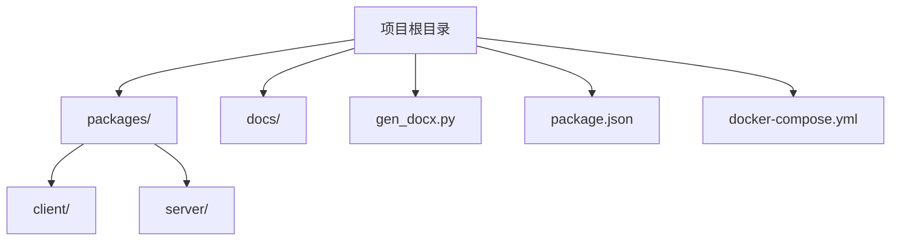
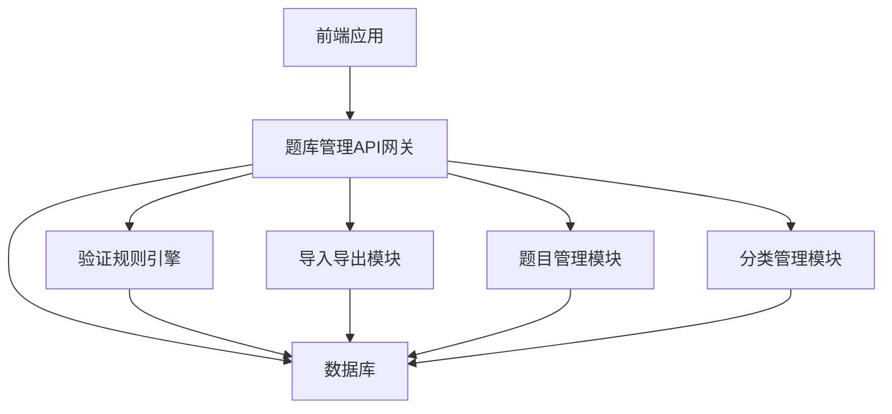
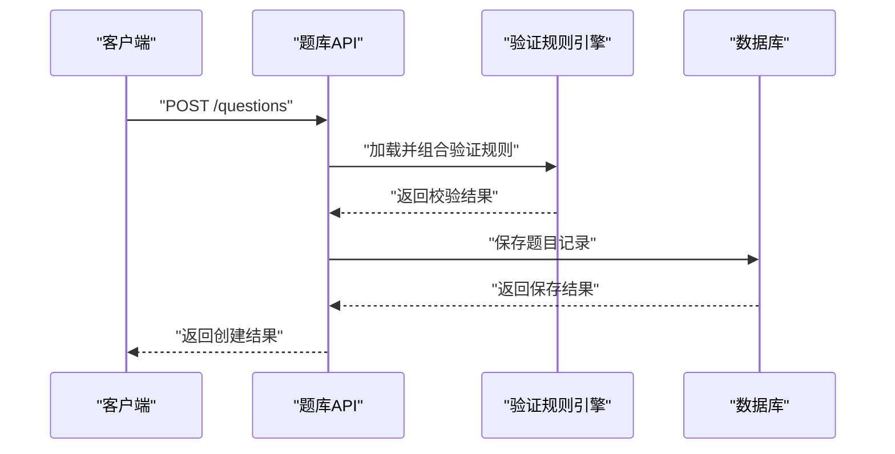
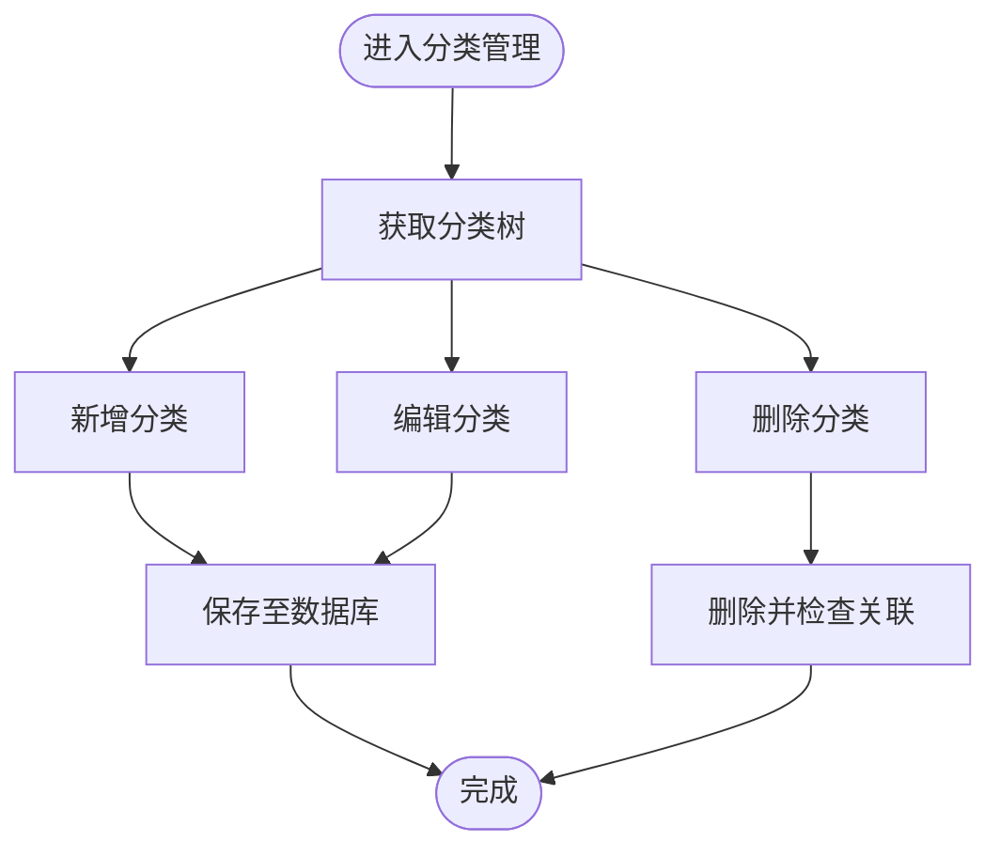
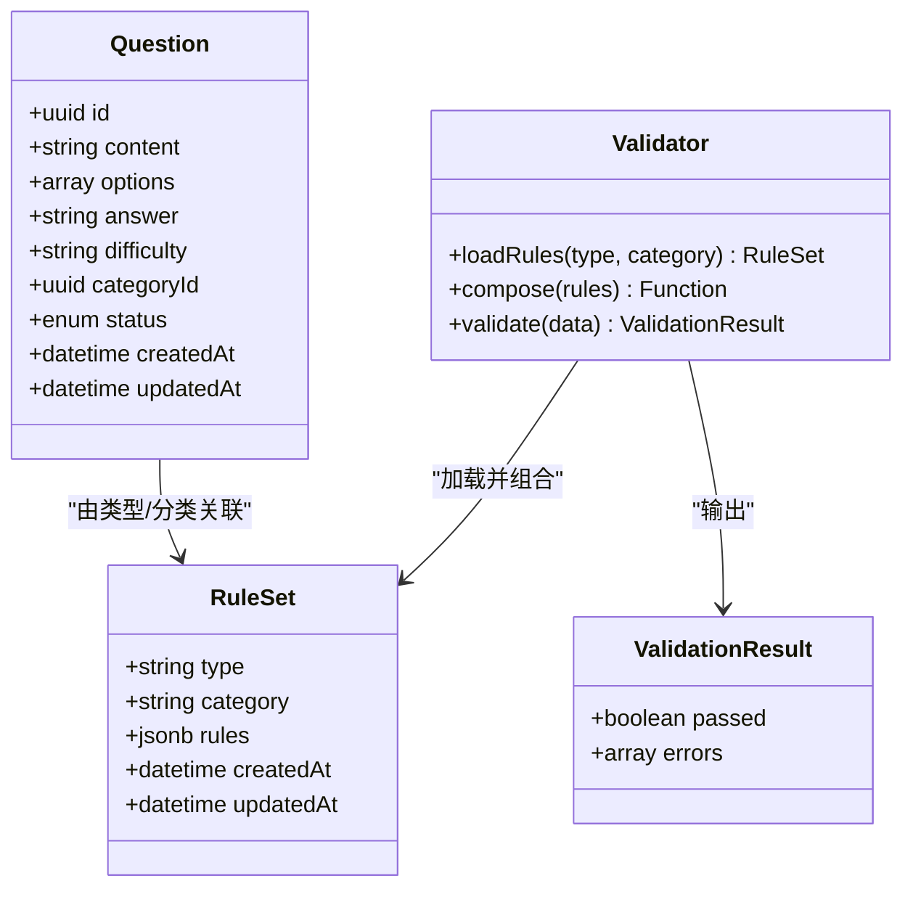
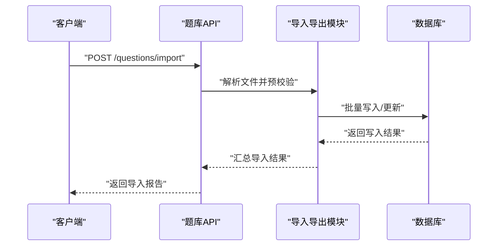
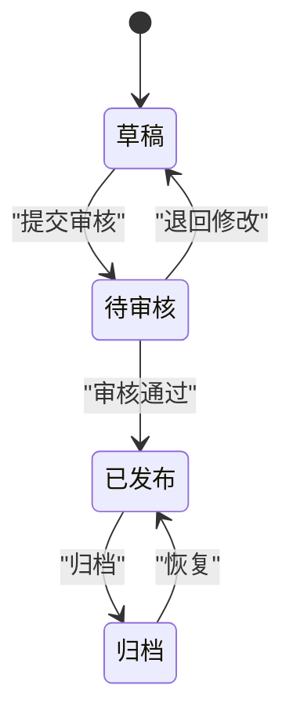
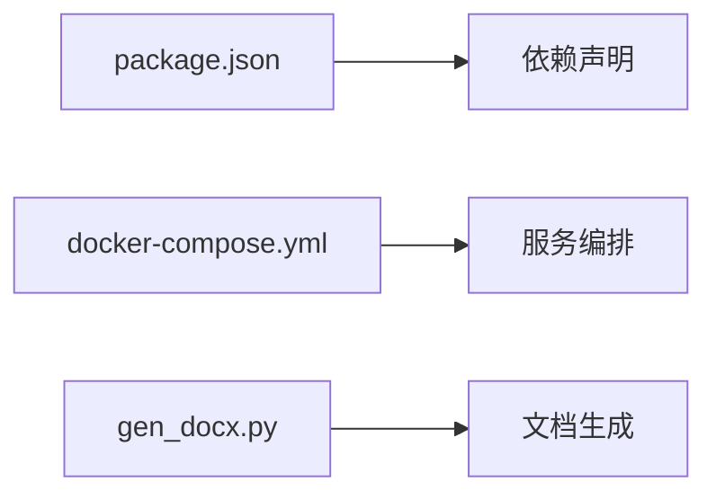

# 题库管理API

<cite>
**本文档引用的文件**
- [gen_docx.py](file://gen_docx.py)
- [package.json](file://package.json)
- [docker-compose.yml](file://docker-compose.yml)
</cite>

## 目录
1. [简介](#简介)
2. [项目结构](#项目结构)
3. [核心组件](#核心组件)
4. [架构总览](#架构总览)
5. [详细组件分析](#详细组件分析)
6. [依赖关系分析](#依赖关系分析)
7. [性能考虑](#性能考虑)
8. [故障排除指南](#故障排除指南)
9. [结论](#结论)
10. [附录](#附录)

## 简介
本文件为题库管理API的技术文档，面向后端服务与前端集成开发者，系统性阐述题库管理相关的接口规范、数据模型、验证规则与动态校验机制，并提供批量操作、导入导出及分类管理的最佳实践建议。由于当前仓库中未包含具体的后端实现代码，本文档以通用的题库管理场景为蓝本，结合现有配置文件信息，给出可落地的API设计与实施指导。

## 项目结构
从仓库可见的顶层文件可知，该项目采用多包（monorepo）结构，包含客户端与服务端两个主要包，以及文档生成脚本与容器编排配置。该结构便于前后端分离开发与统一发布。

**图表来源**
- [package.json](file://package.json)
- [docker-compose.yml](file://docker-compose.yml)

**章节来源**
- [package.json](file://package.json)
- [docker-compose.yml](file://docker-compose.yml)

## 核心组件
围绕题库管理的核心能力，建议在服务端实现以下模块：
- 题目管理：支持题目创建、编辑、删除、查询与分页列表
- 分类管理：支持分类增删改查、层级结构与关联题目统计
- 验证规则引擎：基于JSONB存储的动态校验规则，支持运行时组合与执行
- 批量操作：批量更新状态、批量导入/导出
- 导入导出：支持Excel/CSV等格式，含模板与校验反馈
- 状态管理：题目状态流转（草稿、待审核、已发布、归档）

上述模块通过RESTful API对外暴露，配合鉴权中间件与统一错误处理，确保接口一致性与安全性。

## 架构总览
下图展示题库管理服务的整体架构：前端通过HTTP调用后端API；后端聚合各领域模块，持久化层负责数据存取；验证引擎与导入导出模块作为横切关注点参与流程。

## 详细组件分析

### 题目管理模块
- 功能职责
  - 创建题目：接收题目内容、选项、答案、解析、难度、标签、分类等字段
  - 编辑题目：按ID更新题目元数据与内容
  - 删除题目：软删除或物理删除策略
  - 查询题目：支持按ID、分类、标签、状态、关键词等条件筛选
  - 分页列表：支持排序、过滤与高亮匹配
- 关键接口（示例）
  - POST /questions：创建题目
  - GET /questions/{id}：获取单题详情
  - PUT /questions/{id}：更新题目
  - DELETE /questions/{id}：删除题目
  - GET /questions：分页查询题目
  - POST /questions/batch：批量操作（如批量删除、批量状态变更）
  - POST /questions/import：导入题目
  - POST /questions/export：导出题目
- 数据模型要点
  - 题目实体包含：基础信息、选项集合、正确答案、解析、难度、标签、分类ID、状态、创建/更新时间等
  - 选项与答案可采用数组或独立表结构，便于扩展
  - 状态枚举建议统一管理，避免魔法值
- 验证规则与动态校验
  - 规则以JSONB形式存储，包含字段级规则（必填、长度、类型、范围）、业务规则（答案与选项一致性、难度与分类匹配等）
  - 运行时根据题目类型与分类动态拼装校验链，返回结构化错误
- 批量操作
  - 支持传入题目ID集合，原子性地执行状态变更、删除等操作
  - 返回成功/失败明细，便于前端提示与重试

**图表来源**
- [gen_docx.py](file://gen_docx.py)

**章节来源**
- [gen_docx.py](file://gen_docx.py)

### 分类管理模块
- 功能职责
  - 分类增删改查：支持树形结构、层级关系与排序
  - 统计关联：统计每个分类下的题目数量
  - 分类与题目绑定：创建/编辑题目时选择分类
- 关键接口（示例）
  - GET /categories：获取分类树
  - POST /categories：新增分类
  - PUT /categories/{id}：更新分类
  - DELETE /categories/{id}：删除分类
  - GET /categories/{id}/stats：获取分类统计
- 数据模型要点
  - 分类实体包含：名称、父级ID、排序、是否启用、创建/更新时间
  - 树形结构建议使用邻接列表或路径枚举，兼顾查询与修改效率

**图表来源**
- [gen_docx.py](file://gen_docx.py)

**章节来源**
- [gen_docx.py](file://gen_docx.py)

### 验证规则引擎（JSONB存储与动态校验）
- 存储结构
  - 字段级规则：针对具体字段定义必填、长度、类型、范围等约束
  - 业务规则：跨字段/跨实体的复杂校验（如答案与选项一致性）
  - 条件规则：按题目类型、分类、难度等维度启用不同规则集
- 动态校验机制
  - 加载：按题目类型与分类读取对应规则集
  - 组合：将字段级与业务规则按优先级与依赖关系组合
  - 执行：对输入数据逐条执行，收集错误并返回结构化结果
  - 缓存：热点规则集可缓存，降低重复计算开销
- 错误格式
  - 包含字段名、错误码、错误消息与建议修复方式
  - 支持多语言与上下文提示

**图表来源**
- [gen_docx.py](file://gen_docx.py)

**章节来源**
- [gen_docx.py](file://gen_docx.py)

### 批量操作与导入导出
- 批量操作
  - 接口：POST /questions/batch
  - 参数：操作类型（删除、状态变更）、题目ID集合
  - 返回：成功/失败明细与原因
- 导入导出
  - 导出：支持筛选条件与字段选择，输出Excel/CSV
  - 导入：提供模板下载、字段映射、预校验与错误报告
  - 失败重试：记录每条记录的导入状态，支持断点续传与二次校验

**图表来源**
- [gen_docx.py](file://gen_docx.py)

**章节来源**
- [gen_docx.py](file://gen_docx.py)

### 题目状态管理
- 状态枚举：草稿、待审核、已发布、归档
- 流转规则：仅已发布题目可参与组卷；归档不可再使用
- 审核流程：提交审核后由管理员审批，审批通过自动发布
- 变更审计：记录每次状态变更的时间、操作人与原因

**图表来源**
- [gen_docx.py](file://gen_docx.py)

**章节来源**
- [gen_docx.py](file://gen_docx.py)

## 依赖关系分析
- 包管理与版本
  - 使用统一的包管理工具进行依赖管理，确保前后端依赖一致
- 容器化部署
  - 通过容器编排文件定义服务拓扑、环境变量与持久化卷
- 文档生成
  - 提供脚本用于生成Word文档，便于交付与归档

**图表来源**
- [package.json](file://package.json)
- [docker-compose.yml](file://docker-compose.yml)
- [gen_docx.py](file://gen_docx.py)

**章节来源**
- [package.json](file://package.json)
- [docker-compose.yml](file://docker-compose.yml)
- [gen_docx.py](file://gen_docx.py)

## 性能考虑
- 查询优化
  - 对常用筛选字段建立索引（分类ID、状态、创建时间）
  - 分页查询使用游标或基于主键的分页策略
- 写入优化
  - 批量导入使用事务与批量写入，减少往返
  - 导入前进行字段映射与基础校验，降低失败率
- 缓存策略
  - 热门分类与规则集缓存，降低重复加载成本
- 并发控制
  - 导入任务队列化，避免并发写冲突
  - 审核流程引入锁或乐观锁，防止竞态

## 故障排除指南
- 常见问题
  - 导入失败：检查模板字段与数据类型，查看错误报告中的行列号与错误码
  - 校验不通过：根据返回的字段级错误逐项修正，必要时调整规则集
  - 批量操作部分失败：根据返回的明细重试失败项或修正数据
- 日志与监控
  - 记录关键操作日志与异常堆栈，便于定位问题
  - 监控导入/导出耗时与成功率，及时发现性能瓶颈

## 结论
本文档基于通用题库管理场景，给出了接口规范、数据模型、验证规则与动态校验机制的设计思路，并提供了批量操作、导入导出与分类管理的最佳实践。建议在服务端实现时遵循统一的数据格式与错误规范，确保前后端协作顺畅与系统可维护性。

## 附录
- 接口清单（示例）
  - 题目管理：创建、查询、更新、删除、分页、批量、导入、导出
  - 分类管理：树形查询、增删改查、统计
  - 验证规则：按类型/分类加载、组合与执行
- 数据模型（示例）
  - 题目实体、分类实体、规则集实体、导入结果实体
- 最佳实践
  - 规则集版本化与灰度发布
  - 导入模板标准化与字段映射
  - 批量操作幂等性与重试策略
  - 审核流程与状态机设计