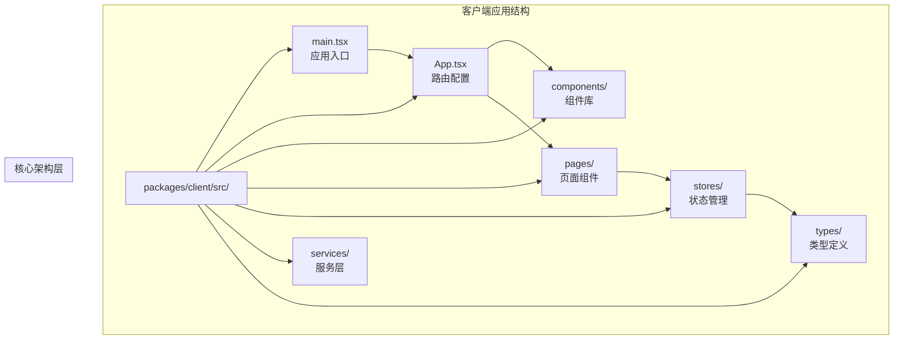
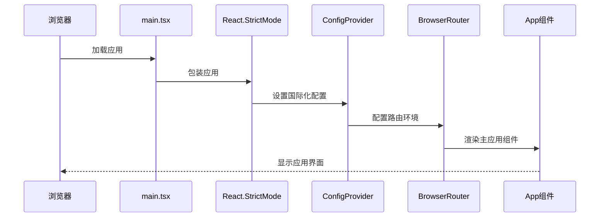
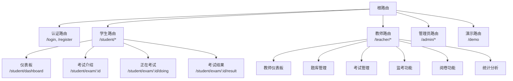
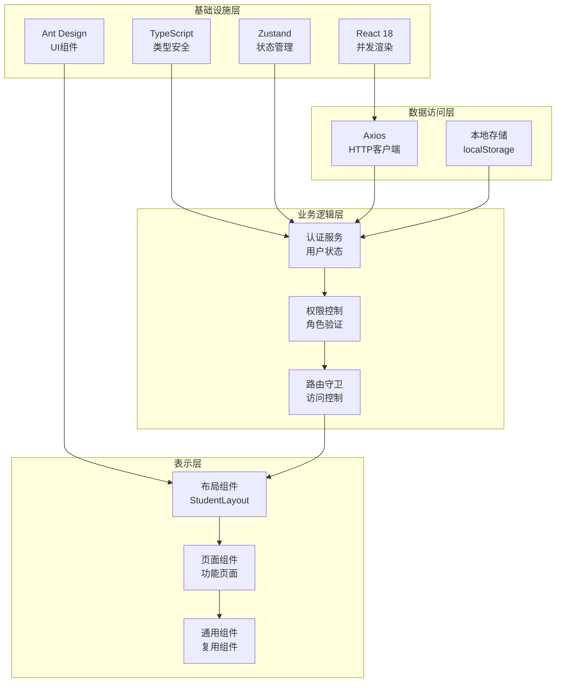
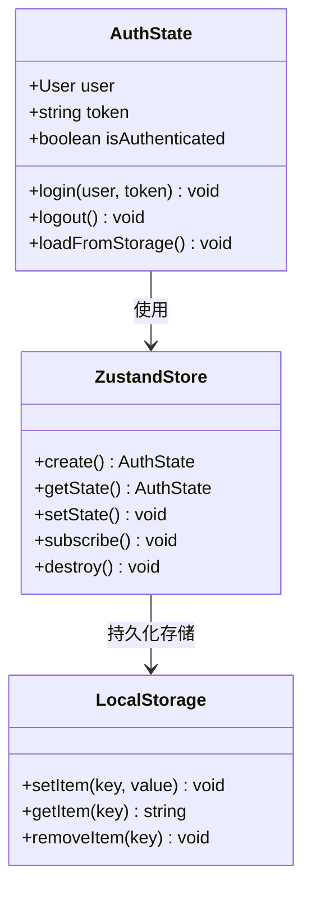
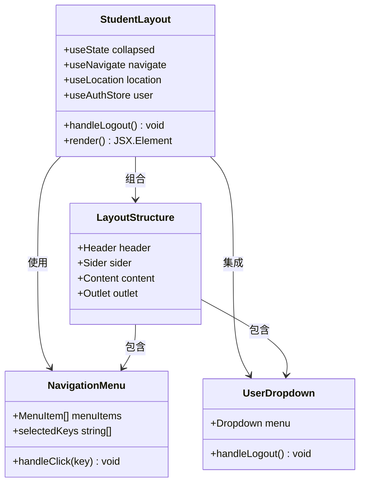
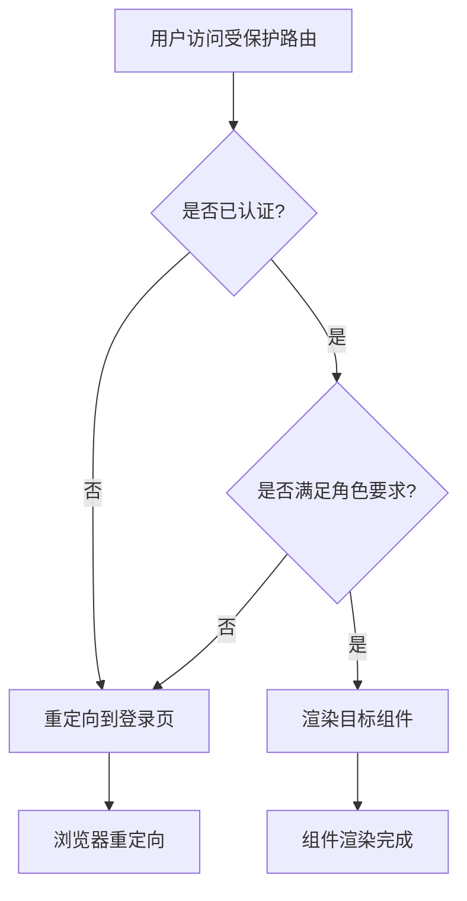
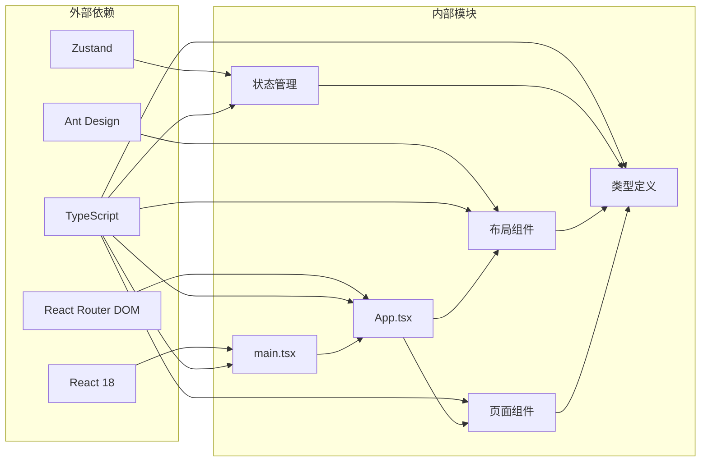

# React架构设计

<cite>
**本文档引用的文件**
- [main.tsx](file://packages/client/src/main.tsx)
- [App.tsx](file://packages/client/src/App.tsx)
- [StudentLayout.tsx](file://packages/client/src/components/layout/StudentLayout.tsx)
- [auth.ts](file://packages/client/src/stores/auth.ts)
- [gen_docx.py](file://gen_docx.py)
</cite>

## 目录
1. [引言](#引言)
2. [项目结构](#项目结构)
3. [核心组件](#核心组件)
4. [架构概览](#架构概览)
5. [详细组件分析](#详细组件分析)
6. [依赖关系分析](#依赖关系分析)
7. [性能考虑](#性能考虑)
8. [故障排除指南](#故障排除指南)
9. [结论](#结论)

## 引言

本文件详细阐述了基于React 18的考试系统前端架构设计。该系统采用现代化的React技术栈，结合TypeScript进行类型安全编程，使用Zustand作为状态管理解决方案，并通过Ant Design提供UI组件库支持。系统实现了完整的用户认证授权机制，支持学生、教师、管理员三种角色的不同功能模块。

## 项目结构

项目采用monorepo结构，主要包含客户端和服务器端两个核心包。客户端应用位于`packages/client`目录下，采用TypeScript编写，使用React 18的新特性如并发渲染和改进的Suspense行为。

**图表来源**
- [main.tsx:1-18](file://packages/client/src/main.tsx#L1-L18)
- [App.tsx:1-96](file://packages/client/src/App.tsx#L1-L96)

**章节来源**
- [main.tsx:1-18](file://packages/client/src/main.tsx#L1-L18)
- [App.tsx:1-96](file://packages/client/src/App.tsx#L1-L96)
- [gen_docx.py:533-540](file://gen_docx.py#L533-L540)

## 核心组件

### 应用入口配置

应用入口文件负责初始化React应用环境，配置国际化支持，设置路由容器，并启用严格模式进行开发时的额外检查。

**图表来源**
- [main.tsx:9-17](file://packages/client/src/main.tsx#L9-L17)

### 路由系统架构

应用采用嵌套路由设计，支持多角色权限控制和动态路由参数。路由系统实现了清晰的模块化结构，每个角色都有独立的路由前缀和对应的布局组件。

**图表来源**
- [App.tsx:45-94](file://packages/client/src/App.tsx#L45-L94)

**章节来源**
- [main.tsx:1-18](file://packages/client/src/main.tsx#L1-L18)
- [App.tsx:1-96](file://packages/client/src/App.tsx#L1-L96)

## 架构概览

系统采用分层架构设计，从底层到上层依次为：基础设施层、数据访问层、业务逻辑层、表示层。这种架构确保了各层职责明确，便于维护和扩展。

**图表来源**
- [main.tsx:1-6](file://packages/client/src/main.tsx#L1-L6)
- [auth.ts:1-43](file://packages/client/src/stores/auth.ts#L1-L43)

## 详细组件分析

### 认证状态管理

系统使用Zustand实现轻量级的状态管理，专门处理用户认证相关状态。该实现提供了简洁的API，避免了Redux等重型状态管理库的复杂性。

**图表来源**
- [auth.ts:4-43](file://packages/client/src/stores/auth.ts#L4-L43)

#### 状态管理模式

认证状态管理采用函数式编程范式，通过create函数创建store实例，返回包含状态和动作的对象。这种设计具有以下优势：

- **类型安全**：完整的TypeScript类型定义确保编译时类型检查
- **易于测试**：纯函数和可预测的状态更新便于单元测试
- **性能优化**：细粒度的状态选择减少不必要的重渲染
- **开发体验**：直观的API设计降低学习成本

**章节来源**
- [auth.ts:1-43](file://packages/client/src/stores/auth.ts#L1-L43)

### 布局组件设计

系统采用响应式布局设计，使用Ant Design的Layout组件实现复杂的界面结构。每个角色都有专门的布局组件，提供一致的用户体验。

**图表来源**
- [StudentLayout.tsx:15-68](file://packages/client/src/components/layout/StudentLayout.tsx#L15-L68)

#### 布局组件特点

- **响应式设计**：支持侧边栏折叠，适应不同屏幕尺寸
- **导航集成**：内置菜单系统，支持程序化导航
- **用户管理**：集成用户信息显示和登出功能
- **内容区域**：使用Outlet实现嵌套路由内容渲染

**章节来源**
- [StudentLayout.tsx:1-69](file://packages/client/src/components/layout/StudentLayout.tsx#L1-L69)

### 权限控制系统

系统实现了基于角色的访问控制(RBAC)机制，通过PrivateRoute组件实现路由级别的权限验证。

**图表来源**
- [App.tsx:24-36](file://packages/client/src/App.tsx#L24-L36)

#### 权限控制实现

权限控制通过高阶组件模式实现，具备以下特性：

- **灵活的角色配置**：支持单角色和多角色访问控制
- **即时验证**：每次路由变化时进行权限检查
- **用户体验**：自动重定向到合适的目标页面
- **安全性**：防止未授权访问敏感功能

**章节来源**
- [App.tsx:24-36](file://packages/client/src/App.tsx#L24-L36)

## 依赖关系分析

系统依赖关系清晰，各模块间耦合度适中，便于维护和扩展。

**图表来源**
- [main.tsx:1-6](file://packages/client/src/main.tsx#L1-L6)
- [App.tsx:1-22](file://packages/client/src/App.tsx#L1-L22)

**章节来源**
- [main.tsx:1-6](file://packages/client/src/main.tsx#L1-L6)
- [App.tsx:1-22](file://packages/client/src/App.tsx#L1-L22)

## 性能考虑

### 渲染优化策略

系统采用多种性能优化技术：

- **React 18并发特性**：利用并发渲染提高用户体验
- **细粒度状态更新**：Zustand提供精确的状态订阅
- **懒加载组件**：按需加载大型组件
- **虚拟滚动**：大数据列表的高效渲染

### 内存管理

- **自动清理**：组件卸载时自动清理事件监听器
- **缓存策略**：合理使用浏览器缓存减少请求
- **内存泄漏防护**：严格的引用管理和定时器清理

## 故障排除指南

### 常见问题诊断

1. **认证失败**：检查localStorage中的token和用户信息格式
2. **路由跳转异常**：验证PrivateRoute组件的角色配置
3. **样式问题**：确认Ant Design主题配置正确
4. **构建错误**：检查TypeScript配置和依赖版本兼容性

### 调试技巧

- 使用React DevTools检查组件树和状态
- 利用Zustand DevTools监控状态变化
- 启用严格模式发现潜在问题
- 实施适当的错误边界处理

**章节来源**
- [auth.ts:30-42](file://packages/client/src/stores/auth.ts#L30-L42)
- [App.tsx:24-36](file://packages/client/src/App.tsx#L24-L36)

## 结论

该React架构设计展现了现代前端开发的最佳实践。通过合理的分层设计、清晰的组件职责划分、完善的权限控制机制，以及高效的性能优化策略，构建了一个可维护、可扩展的企业级应用。

系统的主要优势包括：

- **架构清晰**：层次分明，职责明确
- **开发效率**：TypeScript提供类型安全保障
- **用户体验**：React 18的新特性提升交互流畅度
- **可维护性**：模块化设计便于长期维护
- **扩展性强**：良好的架构基础支持功能扩展

未来可以考虑的方向包括：引入代码分割进一步优化首屏加载、实施更完善的测试策略、探索服务端渲染提升SEO效果等。