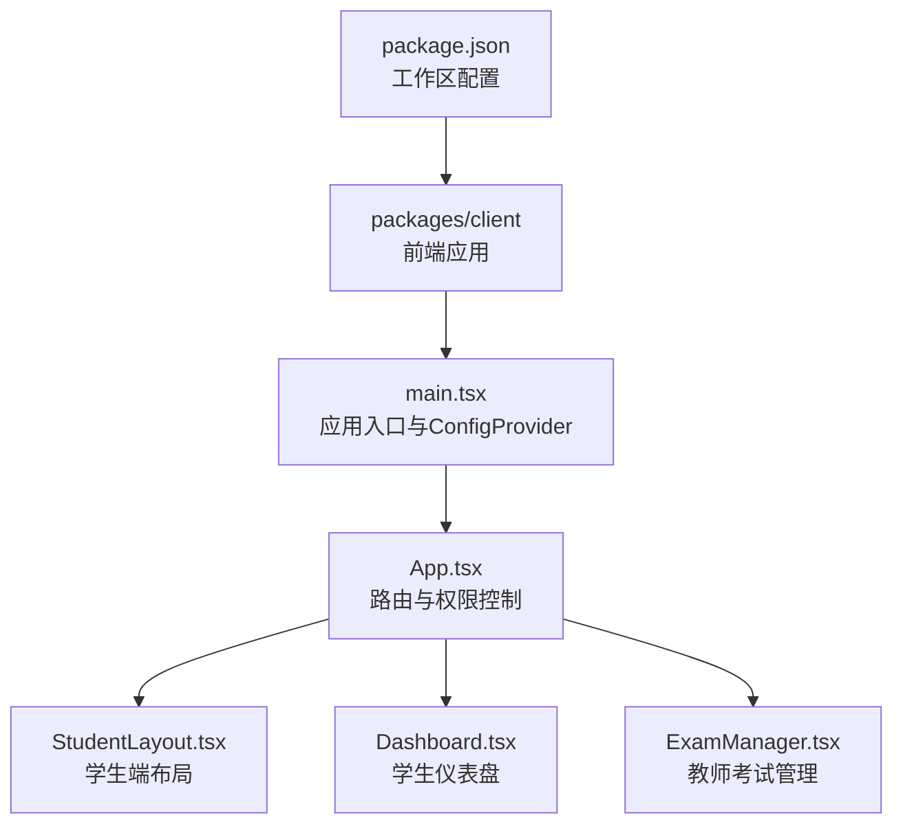
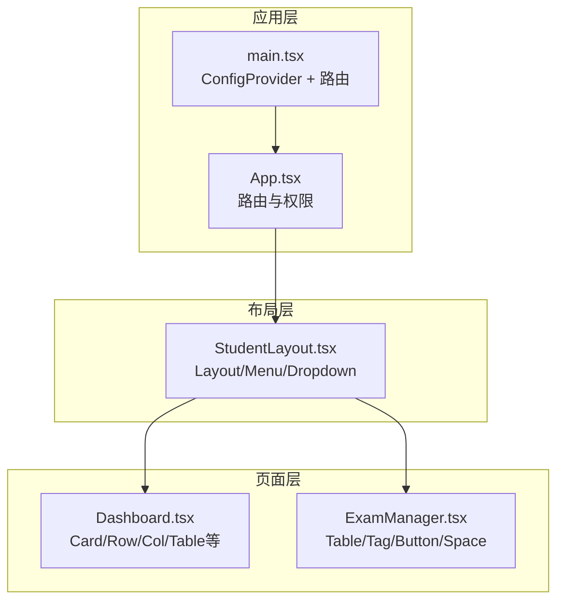
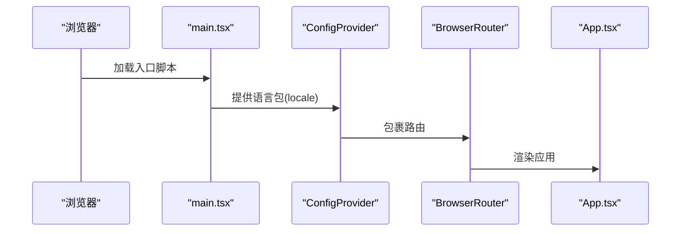
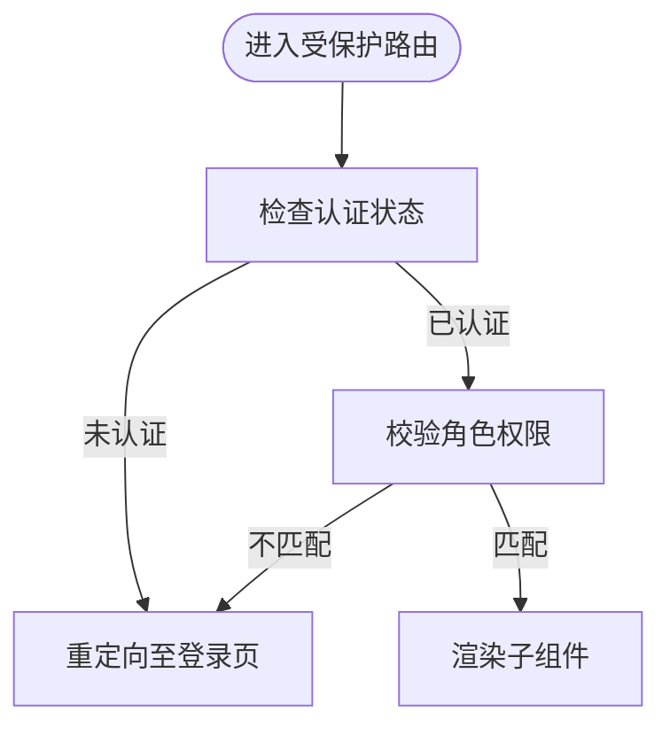
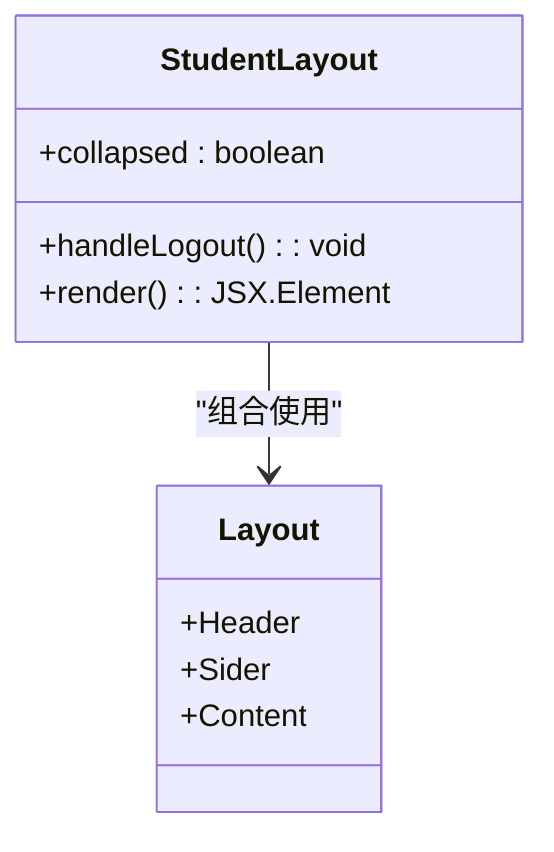
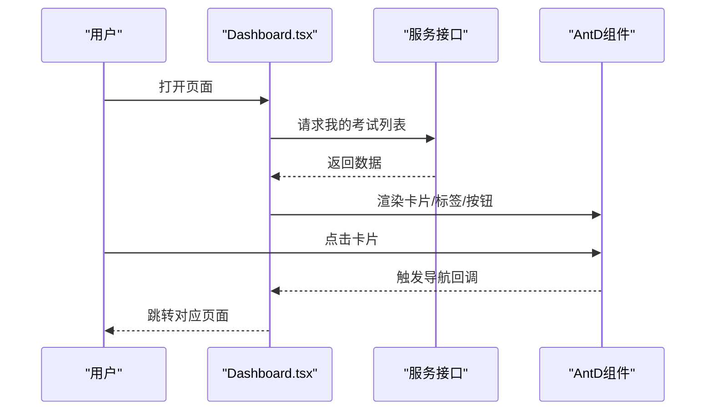
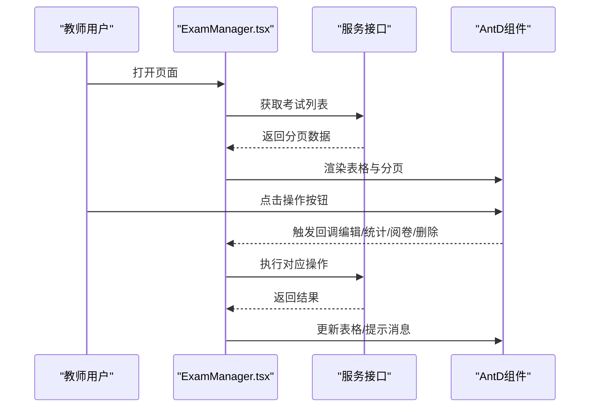
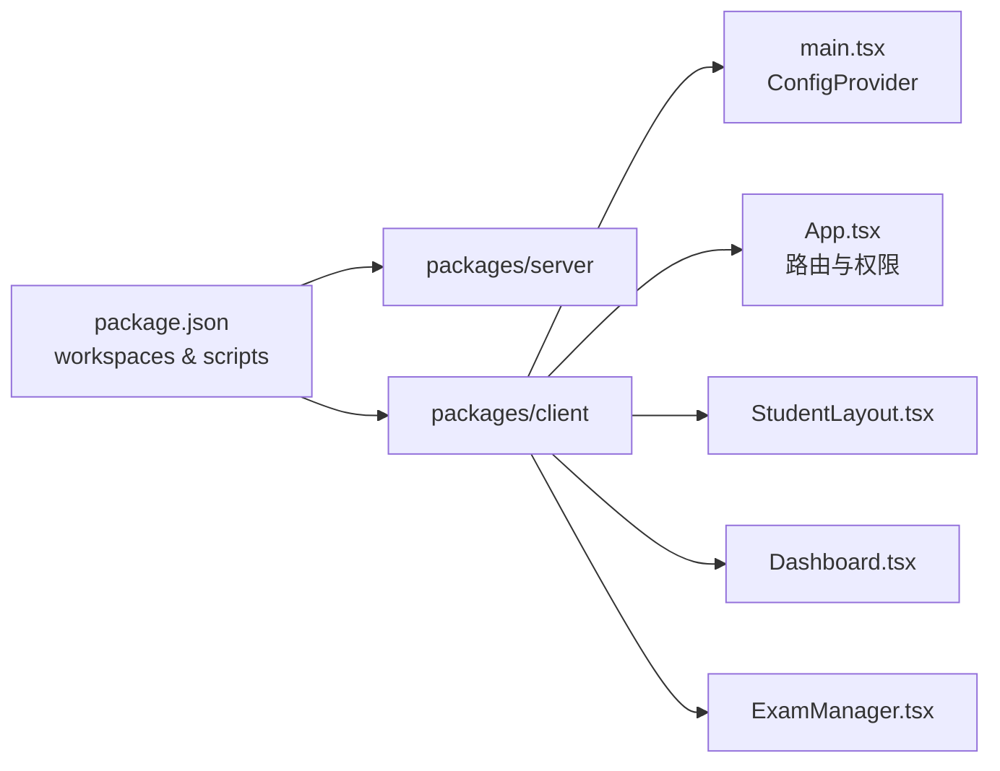

# UI组件库

<cite>
**本文引用的文件**
- [package.json](file://package.json)
- [main.tsx](file://packages/client/src/main.tsx)
- [App.tsx](file://packages/client/src/App.tsx)
- [StudentLayout.tsx](file://packages/client/src/components/layout/StudentLayout.tsx)
- [Dashboard.tsx](file://packages/client/src/pages/student/Dashboard.tsx)
- [ExamManager.tsx](file://packages/client/src/pages/teacher/ExamManager.tsx)
</cite>

## 目录
1. [简介](#简介)
2. [项目结构](#项目结构)
3. [核心组件](#核心组件)
4. [架构概览](#架构概览)
5. [详细组件分析](#详细组件分析)
6. [依赖分析](#依赖分析)
7. [性能考虑](#性能考虑)
8. [故障排查指南](#故障排查指南)
9. [结论](#结论)
10. [附录](#附录)

## 简介
本文件面向“UI组件库”的使用与扩展，围绕 Ant Design 5 的设计系统在本项目中的集成方式进行系统化说明。内容涵盖主题定制、组件配置与样式覆盖、自定义组件开发规范（属性设计与事件处理）、响应式设计指南、主题切换实现思路、组件可访问性支持、使用示例路径、样式定制方法以及性能优化建议。  
为便于不同技术背景的读者理解，文档采用由浅入深的方式组织，并通过图示展示关键流程与关系。

## 项目结构
本项目采用工作区（workspaces）组织，前端位于 packages/client，后端位于 packages/server。前端入口通过路由与布局组件组织页面，Ant Design 5 在应用根部通过 ConfigProvider 进行全局配置（如语言包）。页面组件广泛使用 Ant Design 组件（如 Layout、Menu、Card、Table、Button、Tag、Spin、Empty 等），并结合图标库与本地化资源。

**图表来源**
- [package.json:17-20](file://package.json#L17-L20)
- [main.tsx:1-18](file://packages/client/src/main.tsx#L1-L18)
- [App.tsx:1-96](file://packages/client/src/App.tsx#L1-L96)
- [StudentLayout.tsx:1-69](file://packages/client/src/components/layout/StudentLayout.tsx#L1-L69)
- [Dashboard.tsx:1-77](file://packages/client/src/pages/student/Dashboard.tsx#L1-L77)
- [ExamManager.tsx:1-71](file://packages/client/src/pages/teacher/ExamManager.tsx#L1-L71)

**章节来源**
- [package.json:1-26](file://package.json#L1-L26)
- [main.tsx:1-18](file://packages/client/src/main.tsx#L1-L18)
- [App.tsx:1-96](file://packages/client/src/App.tsx#L1-L96)

## 核心组件
- 应用入口与全局配置
  - 入口文件在应用根部引入路由与 ConfigProvider，并设置语言包为中文简体，确保 Ant Design 组件的文案与日期等本地化行为符合预期。
  - 参考路径：[main.tsx:1-18](file://packages/client/src/main.tsx#L1-L18)

- 路由与权限控制
  - App 组件集中定义路由与角色权限校验逻辑，使用私有路由包装器对不同角色进行访问控制。
  - 参考路径：[App.tsx:24-36](file://packages/client/src/App.tsx#L24-L36)

- 布局组件
  - 学生端布局使用 Layout/Sider/Header/Content 组织侧边菜单、头部用户信息与主内容区域；菜单项与用户下拉菜单通过 Ant Design 组件实现。
  - 参考路径：[StudentLayout.tsx:15-69](file://packages/client/src/components/layout/StudentLayout.tsx#L15-L69)

- 页面组件
  - 学生仪表盘：使用 Card、Row/Col、Tag、Button、Spin、Empty 等组件构建卡片式列表与状态展示。
    - 参考路径：[Dashboard.tsx:12-77](file://packages/client/src/pages/student/Dashboard.tsx#L12-L77)
  - 教师考试管理：使用 Table 展示数据、Tag 渲染状态、Space 控制按钮间距、分页与消息提示。
    - 参考路径：[ExamManager.tsx:17-71](file://packages/client/src/pages/teacher/ExamManager.tsx#L17-L71)

**章节来源**
- [main.tsx:1-18](file://packages/client/src/main.tsx#L1-L18)
- [App.tsx:24-36](file://packages/client/src/App.tsx#L24-L36)
- [StudentLayout.tsx:15-69](file://packages/client/src/components/layout/StudentLayout.tsx#L15-L69)
- [Dashboard.tsx:12-77](file://packages/client/src/pages/student/Dashboard.tsx#L12-L77)
- [ExamManager.tsx:17-71](file://packages/client/src/pages/teacher/ExamManager.tsx#L17-L71)

## 架构概览
下图展示了从应用入口到页面组件的数据流与交互关系，以及 Ant Design 组件在各层的使用方式。

**图表来源**
- [main.tsx:1-18](file://packages/client/src/main.tsx#L1-L18)
- [App.tsx:1-96](file://packages/client/src/App.tsx#L1-L96)
- [StudentLayout.tsx:1-69](file://packages/client/src/components/layout/StudentLayout.tsx#L1-L69)
- [Dashboard.tsx:1-77](file://packages/client/src/pages/student/Dashboard.tsx#L1-L77)
- [ExamManager.tsx:1-71](file://packages/client/src/pages/teacher/ExamManager.tsx#L1-L71)

## 详细组件分析

### 应用入口与全局配置
- 设计要点
  - 使用 ConfigProvider 设置 locale，保证组件文案与日历等本地化一致。
  - 通过 BrowserRouter 包裹应用，统一路由上下文。
- 实施建议
  - 如需主题定制，可在 ConfigProvider 内传入 theme 或 token，以覆盖默认设计令牌。
  - 若需全局样式覆盖，可在入口处引入重置样式或自定义 CSS 变量。

**图表来源**
- [main.tsx:1-18](file://packages/client/src/main.tsx#L1-L18)

**章节来源**
- [main.tsx:1-18](file://packages/client/src/main.tsx#L1-L18)

### 路由与权限控制
- 设计要点
  - 私有路由组件根据认证状态与角色决定是否放行。
  - App 中集中声明路由层级与默认跳转规则。
- 实施建议
  - 将角色常量与权限白名单集中管理，便于维护。
  - 对于复杂权限场景，可引入细粒度权限守卫与缓存策略。

**图表来源**
- [App.tsx:24-36](file://packages/client/src/App.tsx#L24-L36)

**章节来源**
- [App.tsx:24-36](file://packages/client/src/App.tsx#L24-L36)

### 布局组件（学生端）
- 设计要点
  - 使用 Layout/Sider/Header/Content 组织结构，Sider 支持折叠与主题切换。
  - 头部集成用户头像、下拉菜单与登出动作。
- 实施建议
  - 折叠状态与主题选择可通过状态管理或主题上下文传递。
  - 下拉菜单项应支持键盘导航与无障碍属性。

**图表来源**
- [StudentLayout.tsx:15-69](file://packages/client/src/components/layout/StudentLayout.tsx#L15-L69)

**章节来源**
- [StudentLayout.tsx:15-69](file://packages/client/src/components/layout/StudentLayout.tsx#L15-L69)

### 页面组件（学生仪表盘）
- 设计要点
  - 使用 Row/Col 实现卡片网格布局，支持响应式断点。
  - Card 作为卡片容器，配合 Tag 展示状态，Button 触发导航。
  - 加载态使用 Spin，空态使用 Empty。
- 实施建议
  - 列表项点击后根据状态跳转至不同页面，保持交互一致性。
  - 状态映射集中管理，避免分散硬编码。

**图表来源**
- [Dashboard.tsx:12-77](file://packages/client/src/pages/student/Dashboard.tsx#L12-L77)

**章节来源**
- [Dashboard.tsx:12-77](file://packages/client/src/pages/student/Dashboard.tsx#L12-L77)

### 页面组件（教师考试管理）
- 设计要点
  - 使用 Table 展示考试列表，列渲染包含状态 Tag 与操作按钮。
  - Space 控制按钮间距，分页与加载状态同步更新。
- 实施建议
  - 删除等危险操作建议增加二次确认。
  - 列渲染逻辑可抽离为独立渲染器，提升可复用性。

**图表来源**
- [ExamManager.tsx:17-71](file://packages/client/src/pages/teacher/ExamManager.tsx#L17-L71)

**章节来源**
- [ExamManager.tsx:17-71](file://packages/client/src/pages/teacher/ExamManager.tsx#L17-L71)

## 依赖分析
- 工作区与脚本
  - 通过 workspaces 指定 packages/server 与 packages/client 为工作区，便于统一安装与开发。
  - 脚本命令支持并行启动前后端、打包与数据库迁移等。
- Ant Design 集成
  - 在入口文件中引入 ConfigProvider 并设置 locale，体现全局配置。
  - 页面组件广泛使用 Ant Design 组件，形成统一的设计语言与交互体验。

**图表来源**
- [package.json:17-20](file://package.json#L17-L20)
- [package.json:6-16](file://package.json#L6-L16)
- [main.tsx:1-18](file://packages/client/src/main.tsx#L1-L18)
- [App.tsx:1-96](file://packages/client/src/App.tsx#L1-L96)
- [StudentLayout.tsx:1-69](file://packages/client/src/components/layout/StudentLayout.tsx#L1-L69)
- [Dashboard.tsx:1-77](file://packages/client/src/pages/student/Dashboard.tsx#L1-L77)
- [ExamManager.tsx:1-71](file://packages/client/src/pages/teacher/ExamManager.tsx#L1-L71)

**章节来源**
- [package.json:1-26](file://package.json#L1-L26)
- [main.tsx:1-18](file://packages/client/src/main.tsx#L1-L18)
- [App.tsx:1-96](file://packages/client/src/App.tsx#L1-L96)

## 性能考虑
- 组件懒加载与分割
  - 对大型页面或非首屏路由可采用动态导入，减少初始包体积。
- 表格与列表优化
  - 对长列表使用虚拟滚动（若 Ant Design Table 支持相关能力时），降低 DOM 节点数量。
  - 合理设置分页大小与请求频率，避免频繁刷新。
- 图标与媒体资源
  - 使用按需引入图标，避免全量引入导致体积增大。
- 样式与主题
  - 通过 ConfigProvider 的 token 或主题配置减少重复覆盖，提高样式计算效率。
- 缓存与去抖
  - 对高频查询（如搜索、筛选）加入防抖策略，减轻后端压力。

## 故障排查指南
- 登录与权限
  - 若出现无法进入受保护页面，请检查认证状态与角色字段是否正确写入存储。
  - 参考路径：[App.tsx:24-36](file://packages/client/src/App.tsx#L24-L36)
- 语言与本地化
  - 若文案未显示为中文，请确认入口文件中 ConfigProvider 的 locale 是否正确设置。
  - 参考路径：[main.tsx:11](file://packages/client/src/main.tsx#L11)
- 表格与列表
  - 若表格不显示或分页异常，检查数据结构与分页参数是否一致。
  - 参考路径：[ExamManager.tsx:17-71](file://packages/client/src/pages/teacher/ExamManager.tsx#L17-L71)
- 卡片与状态
  - 若卡片点击无响应或状态标签颜色异常，检查状态映射与事件绑定。
  - 参考路径：[Dashboard.tsx:12-77](file://packages/client/src/pages/student/Dashboard.tsx#L12-L77)

**章节来源**
- [App.tsx:24-36](file://packages/client/src/App.tsx#L24-L36)
- [main.tsx:11](file://packages/client/src/main.tsx#L11)
- [ExamManager.tsx:17-71](file://packages/client/src/pages/teacher/ExamManager.tsx#L17-L71)
- [Dashboard.tsx:12-77](file://packages/client/src/pages/student/Dashboard.tsx#L12-L77)

## 结论
本项目基于 Ant Design 5 构建了统一的 UI 设计体系，入口通过 ConfigProvider 完成语言与主题的全局配置，页面组件围绕 Layout、Card、Table、Button、Tag 等组件展开，实现了清晰的路由与权限控制。建议在后续迭代中进一步完善主题切换、可访问性增强与性能优化策略，以提升用户体验与可维护性。

## 附录
- 自定义组件开发规范（建议）
  - 属性设计：遵循单一职责，将可变状态外置，使用受控/非受控两种模式满足不同场景。
  - 事件处理：统一事件命名与参数结构，必要时提供默认行为与可取消机制。
  - 可访问性：为交互元素提供 aria 属性与键盘支持，确保屏幕阅读器友好。
  - 响应式：优先使用栅格系统与断点，避免过度依赖固定尺寸。
  - 主题与样式：通过 ConfigProvider 的 token 或 CSS 变量进行主题定制，避免内联样式的大量重复。
- 主题切换实现思路（建议）
  - 引入主题上下文或状态管理，保存当前主题标识与设计令牌。
  - 在 ConfigProvider 中动态注入 token 或使用 CSS 变量切换。
  - 将主题偏好持久化到本地存储，刷新后恢复。
- 组件使用示例路径
  - 布局与导航：[StudentLayout.tsx:15-69](file://packages/client/src/components/layout/StudentLayout.tsx#L15-L69)
  - 列表与卡片：[Dashboard.tsx:12-77](file://packages/client/src/pages/student/Dashboard.tsx#L12-L77)
  - 数据表格：[ExamManager.tsx:17-71](file://packages/client/src/pages/teacher/ExamManager.tsx#L17-L71)
- 样式定制方法（建议）
  - 全局重置：在入口引入 reset 样式，统一基础排版与边距。
  - 组件级覆盖：针对特定页面或组件使用局部样式类名，避免影响全局。
  - CSS 变量：通过 CSS 变量集中管理色彩与间距，便于主题切换。
- 性能优化建议（补充）
  - 路由懒加载、组件拆分与代码分割。
  - 列表虚拟化与分页加载。
  - 图标与静态资源按需引入与压缩。