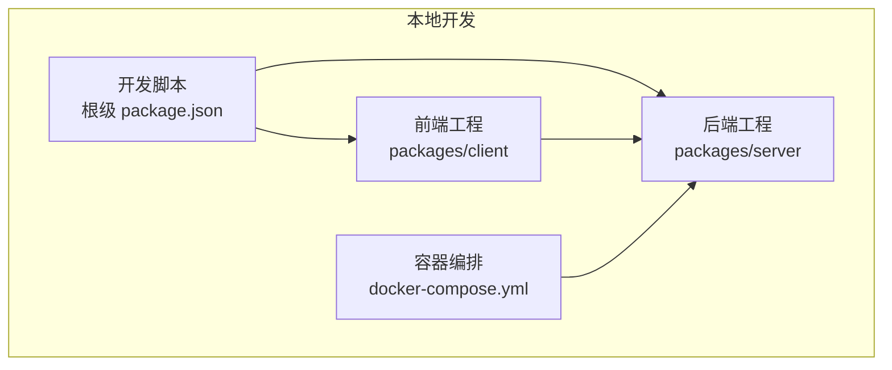
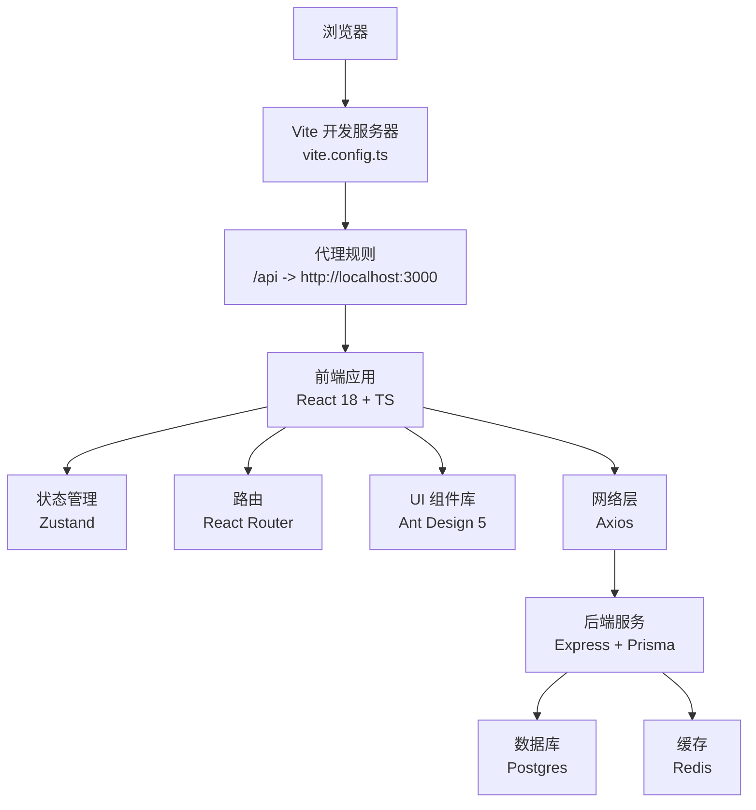
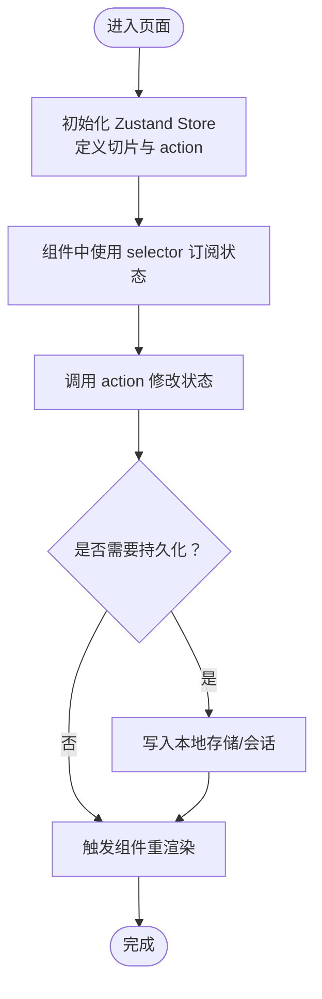
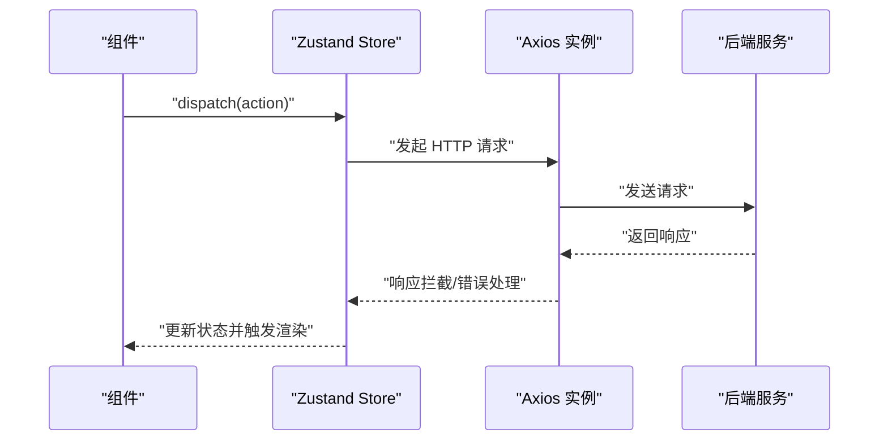
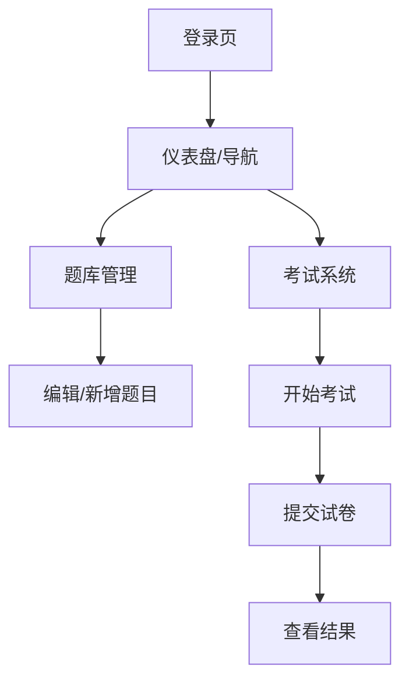
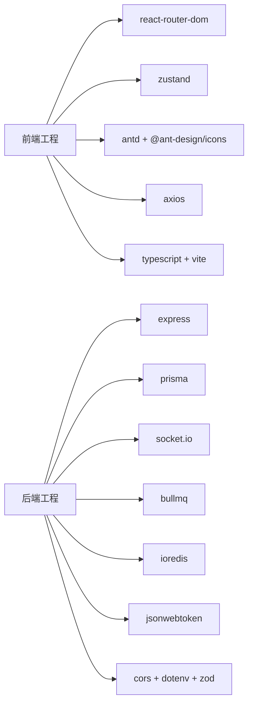

# 前端应用

<cite>
**本文引用的文件**
- [package.json](file://package.json)
- [docker-compose.yml](file://docker-compose.yml)
- [packages/client/package.json](file://packages/client/package.json)
- [packages/client/tsconfig.json](file://packages/client/tsconfig.json)
- [packages/client/vite.config.ts](file://packages/client/vite.config.ts)
- [packages/server/package.json](file://packages/server/package.json)
- [packages/server/tsconfig.json](file://packages/server/tsconfig.json)
</cite>

## 目录
1. [引言](#引言)
2. [项目结构](#项目结构)
3. [核心组件](#核心组件)
4. [架构总览](#架构总览)
5. [详细组件分析](#详细组件分析)
6. [依赖关系分析](#依赖关系分析)
7. [性能考虑](#性能考虑)
8. [故障排查指南](#故障排查指南)
9. [结论](#结论)
10. [附录](#附录)

## 引言
本文件为基于 React 18 与 TypeScript 的前端应用综合文档，聚焦于客户端工程（packages/client）的架构设计与实现要点，涵盖组件结构、状态管理（Zustand）、路由设计（React Router）、UI 组件库（Ant Design 5）集成、以及与后端服务（packages/server）的协作方式。文档同时提供组件开发规范、样式定制与响应式设计指南，并结合现有仓库配置给出可操作的最佳实践建议。

## 项目结构
该仓库采用多工作区（Workspaces）组织方式，前后端分离部署：
- 根级通过脚本统一启动开发环境，分别运行前端与后端服务
- 前端工程位于 packages/client，使用 Vite 构建、React 18 与 TypeScript
- 后端工程位于 packages/server，使用 Express + Prisma 等技术栈
- 数据库与缓存通过 Docker Compose 提供 Postgres 与 Redis

图表来源
- [package.json:6-16](file://package.json#L6-L16)
- [docker-compose.yml:1-37](file://docker-compose.yml#L1-L37)

章节来源
- [package.json:1-26](file://package.json#L1-L26)
- [docker-compose.yml:1-37](file://docker-compose.yml#L1-L37)

## 核心组件
- 框架与构建
  - React 18：函数组件与 Hooks 驱动的 UI 开发
  - TypeScript：类型安全与更好的开发体验
  - Vite：快速开发与构建工具链
- 路由与导航
  - React Router DOM：单页应用路由与导航
- 状态管理
  - Zustand：轻量级状态管理方案，支持切片与中间件
- UI 组件库
  - Ant Design 5：设计系统与高复用 UI 组件
  - Ant Design Icons：图标体系
- 网络请求
  - Axios：HTTP 客户端封装与拦截器
- 工具库
  - Day.js：日期时间处理

章节来源
- [packages/client/package.json:11-20](file://packages/client/package.json#L11-L20)
- [packages/client/tsconfig.json:1-25](file://packages/client/tsconfig.json#L1-L25)
- [packages/client/vite.config.ts:1-21](file://packages/client/vite.config.ts#L1-L21)

## 架构总览
前端应用通过 Vite 在本地开发时提供代理，将 /api 请求转发至后端服务端口；Ant Design 作为统一设计语言，Zustand 管理全局状态，React Router 实现页面级导航。数据库与缓存由 Docker Compose 提供，后端通过 Prisma 访问数据库。

图表来源
- [packages/client/vite.config.ts:14-19](file://packages/client/vite.config.ts#L14-L19)
- [packages/client/package.json:11-20](file://packages/client/package.json#L11-L20)
- [docker-compose.yml:4-32](file://docker-compose.yml#L4-L32)
- [packages/server/package.json:13-24](file://packages/server/package.json#L13-L24)

## 详细组件分析

### 路由与页面导航（React Router）
- 设计目标：单页应用内页面切换、嵌套路由与参数传递
- 关键点
  - 使用 React Router DOM 进行声明式路由配置
  - 结合 Suspense/懒加载优化首屏性能
  - 通过导航守卫或上下文控制访问权限
- 推荐实践
  - 将路由定义集中管理，便于维护与扩展
  - 对需要鉴权的页面使用路由级守卫
  - 使用相对路径与动态参数提升可维护性

章节来源
- [packages/client/package.json:16](file://packages/client/package.json#L16)

### 状态管理（Zustand）
- 设计目标：轻量、易用、可组合的状态管理，避免样板代码
- 关键点
  - 切片化状态：将用户、题库、考试等状态拆分为独立切片
  - 中间件：日志、持久化、调试等能力按需启用
  - 选择器：使用 selector 精准订阅，减少不必要重渲染
- 典型场景
  - 用户认证：登录态、权限信息、会话刷新
  - 题库管理：题目列表、筛选条件、编辑状态
  - 考试系统：当前试卷、答题进度、提交状态
- 最佳实践
  - 将副作用（如网络请求）集中在 action 内部
  - 对复杂状态使用 immer 中间件简化不可变更新
  - 对持久化状态设置合理的过期策略

图表来源
- [packages/client/package.json:17](file://packages/client/package.json#L17)

章节来源
- [packages/client/package.json:17](file://packages/client/package.json#L17)

### UI 组件库（Ant Design 5）
- 设计目标：统一视觉语言与交互规范，提升开发效率
- 关键点
  - 基础组件：Layout、Grid、Button、Form、Table、Modal 等
  - 反馈组件：Message、Notification、Modal、Popconfirm
  - 导航组件：Menu、Breadcrumb、Dropdown、Tabs
  - 表单组件：Input、Select、DatePicker、Upload 等
- 自定义与主题
  - 使用 CSS 变量与 less 覆盖变量
  - 通过 ConfigProvider 全局配置主题与语言
  - 仅按需引入组件样式，降低打包体积
- 响应式设计
  - 基于屏幕尺寸断点进行布局调整
  - 使用 Flex/Grid 布局适配移动端与桌面端

章节来源
- [packages/client/package.json:12-13](file://packages/client/package.json#L12-L13)

### 网络层与数据流（Axios）
- 设计目标：统一请求与响应处理、错误拦截与重试机制
- 关键点
  - 创建 axios 实例，配置 baseURL、超时与通用头部
  - 拦截器：请求前注入 token、响应后统一对错误码处理
  - 并发控制：对重复请求去重或取消
- 与后端协作
  - 通过 Vite 代理将 /api 请求转发到后端服务
  - 对鉴权接口与非鉴权接口区分处理

图表来源
- [packages/client/vite.config.ts:14-19](file://packages/client/vite.config.ts#L14-L19)
- [packages/client/package.json:18](file://packages/client/package.json#L18)

章节来源
- [packages/client/package.json:18](file://packages/client/package.json#L18)
- [packages/client/vite.config.ts:1-21](file://packages/client/vite.config.ts#L1-L21)

### 页面与功能模块（概念性说明）
以下为前端侧常见业务模块的职责与交互思路（概念性描述，不对应具体源码）：
- 用户认证
  - 登录/登出流程、Token 管理、自动刷新
  - 鉴权守卫与路由保护
- 题库管理
  - 题目增删改查、分类筛选、批量操作
  - 编辑器与预览分离、富文本/公式支持
- 考试系统
  - 试卷生成、倒计时、交卷与防作弊策略
  - 答题卡、进度条与异常中断恢复

（本图为概念性流程图，无需图表来源）

## 依赖关系分析
- 前端依赖
  - React 18、React Router DOM、Ant Design 5、Zustand、Axios、Day.js
  - Vite、TypeScript、@vitejs/plugin-react
- 后端依赖
  - Express、Prisma、BcryptJS、Socket.IO、BullMQ、ioredis、jsonwebtoken、Cors、Dotenv、Zod
- 开发与运维
  - concurrently：并行启动前后端
  - Docker Compose：Postgres 与 Redis 容器编排

图表来源
- [packages/client/package.json:11-20](file://packages/client/package.json#L11-L20)
- [packages/server/package.json:13-33](file://packages/server/package.json#L13-L33)

章节来源
- [package.json:21-24](file://package.json#L21-L24)
- [packages/client/package.json:11-20](file://packages/client/package.json#L11-L20)
- [packages/server/package.json:13-33](file://packages/server/package.json#L13-L33)

## 性能考虑
- 构建与打包
  - 使用 Vite 的按需编译与 Tree Shaking，减少包体积
  - 按需引入 Ant Design 组件与图标，避免全量引入
- 运行时性能
  - Zustand 选择器精准订阅，避免全局重渲染
  - 图标与静态资源使用 CDN 或内联策略优化加载
- 网络性能
  - Axios 设置合理超时与重试策略
  - 使用请求去重与并发限制，避免重复请求
- 响应式与渲染
  - 使用 React.lazy 与 Suspense 分割大组件
  - Ant Design 组件按需加载样式，避免阻塞关键渲染

（本节为通用指导，无需章节来源）

## 故障排查指南
- 本地开发无法访问后端
  - 检查 Vite 代理配置是否正确指向后端端口
  - 确认后端服务已启动且端口可用
- 端口冲突
  - 修改 Vite server.port 或后端监听端口
  - 使用 docker-compose 停止占用容器后再启动
- 数据库连接失败
  - 检查 Postgres 容器健康状态与凭据
  - 确认 Prisma 连接字符串与环境变量一致
- 缓存问题
  - 清理浏览器缓存与本地存储中的过期 Token
  - 检查 Redis 容器状态与数据清理策略

章节来源
- [packages/client/vite.config.ts:12-20](file://packages/client/vite.config.ts#L12-L20)
- [docker-compose.yml:15-19](file://docker-compose.yml#L15-L19)
- [packages/server/package.json:9-11](file://packages/server/package.json#L9-L11)

## 结论
本前端工程围绕 React 18 与 TypeScript 构建，采用 Ant Design 5 提供一致的视觉与交互体验，使用 Zustand 管理状态，借助 React Router 实现页面导航，并通过 Axios 与后端服务协同。配合 Vite 的高效开发体验与 Docker Compose 的基础设施支撑，形成一套可扩展、可维护的前端架构。后续可在组件开发规范、样式定制与响应式设计方面进一步沉淀最佳实践，持续提升开发效率与用户体验。

## 附录
- 开发命令
  - 启动前后端：根级脚本统一启动
  - 前端开发：进入 packages/client 执行 dev
  - 后端开发：进入 packages/server 执行 dev
- 构建与预览
  - 前端构建：tsc -b && vite build
  - 预览：vite preview
- 数据库迁移与种子
  - db:migrate 与 db:seed 在后端工作区执行

章节来源
- [package.json:6-16](file://package.json#L6-L16)
- [packages/client/package.json:6-10](file://packages/client/package.json#L6-L10)
- [packages/server/package.json:5-12](file://packages/server/package.json#L5-L12)