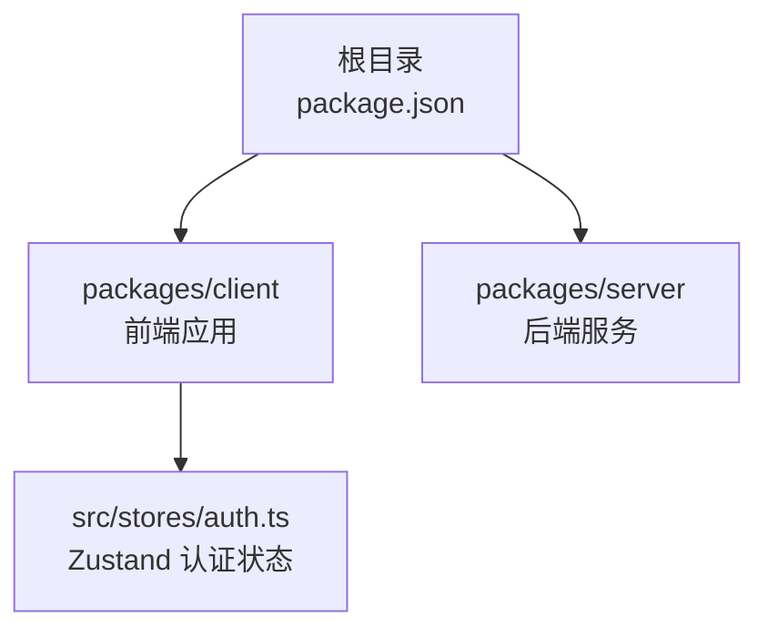
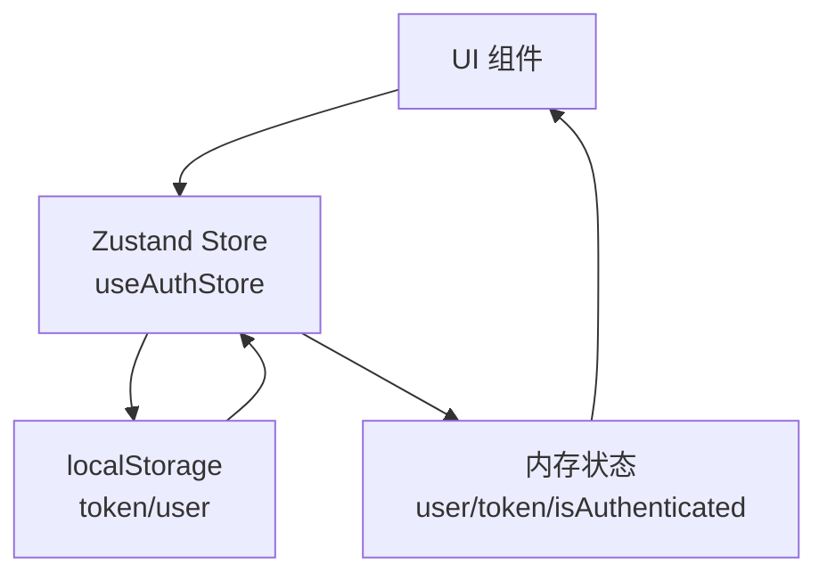
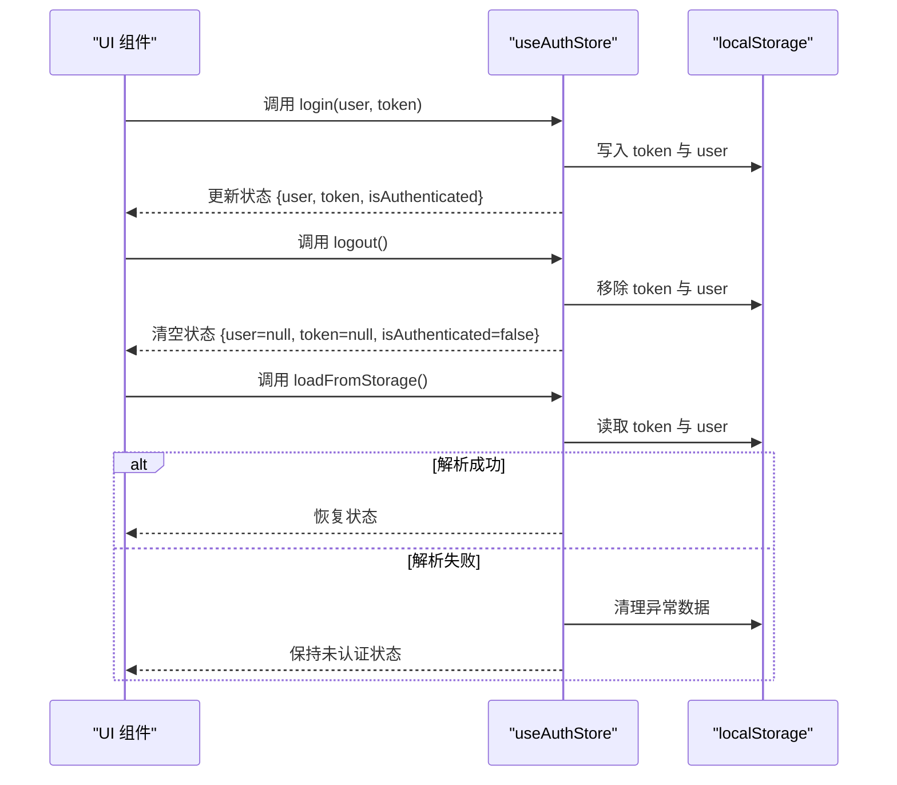
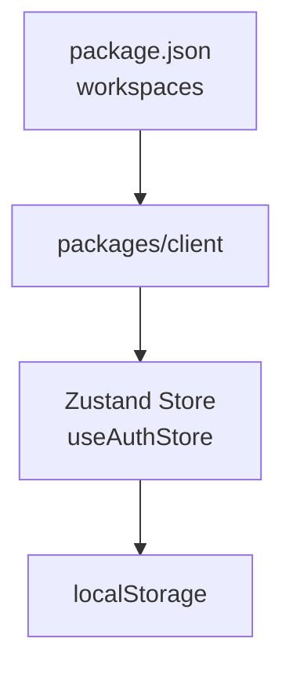

# 状态管理

<cite>
**本文引用的文件**
- [package.json](file://package.json)
- [auth.ts](file://packages/client/src/stores/auth.ts)
</cite>

## 目录
1. [引言](#引言)
2. [项目结构](#项目结构)
3. [核心组件](#核心组件)
4. [架构总览](#架构总览)
5. [详细组件分析](#详细组件分析)
6. [依赖关系分析](#依赖关系分析)
7. [性能考量](#性能考量)
8. [故障排查指南](#故障排查指南)
9. [结论](#结论)
10. [附录](#附录)

## 引言
本文件围绕考试系统的状态管理进行系统性说明，重点基于仓库中已实现的 Zustand 状态存储方案，总结其创建方式、状态订阅与 Action 定义方法，并给出全局状态与局部状态的划分原则、状态持久化策略与同步机制建议。同时提供最佳实践（状态结构设计、性能优化与调试技巧）以及常见问题的解决方案。

## 项目结构
- 项目采用多包工作区布局，前端位于 packages/client，后端位于 packages/server。
- 前端通过 Zustand 实现认证状态管理，文件路径为 packages/client/src/stores/auth.ts。
- 根目录 package.json 提供工作区配置与脚本入口。

**图表来源**
- [package.json](file://package.json)
- [auth.ts](file://packages/client/src/stores/auth.ts)

**章节来源**
- [package.json](file://package.json)

## 核心组件
- 认证状态存储（useAuthStore）
  - 职责：维护用户登录态、令牌与认证状态；支持从本地存储加载、登录写入与登出清理。
  - 关键字段：user、token、isAuthenticated。
  - 关键动作：login、logout、loadFromStorage。
  - 持久化：localStorage 存储 token 与序列化后的 user。

该组件体现了典型的 Zustand 使用范式：通过 create 创建 Store，将状态与派生状态（如 isAuthenticated）与更新函数（Actions）统一管理。

**章节来源**
- [auth.ts](file://packages/client/src/stores/auth.ts)

## 架构总览
下图展示了前端状态层与外部依赖的关系：Zustand Store 作为状态中心，通过 Actions 更新状态并持久化到 localStorage；UI 组件通过订阅 store 获取状态并在交互时触发 Actions。

**图表来源**
- [auth.ts](file://packages/client/src/stores/auth.ts)

## 详细组件分析

### 认证状态存储（useAuthStore）
- 数据结构
  - 状态字段：user（用户信息或空）、token（字符串或空）、isAuthenticated（布尔）。
  - 动作函数：login、logout、loadFromStorage。
- 行为流程
  - login：将 token 与 user 写入 localStorage，并设置状态为已认证。
  - logout：移除 localStorage 中的 token 与 user，并清空状态。
  - loadFromStorage：从 localStorage 读取 token 与 user，若解析成功则恢复状态；失败则清理异常数据。
- 订阅与使用
  - UI 组件通过 Zustand 的订阅机制获取 user/token/isAuthenticated，实现登录态展示与路由守卫等场景。
  - 登录/登出按钮绑定对应 Action，完成状态变更与持久化。

**图表来源**
- [auth.ts](file://packages/client/src/stores/auth.ts)

**章节来源**
- [auth.ts](file://packages/client/src/stores/auth.ts)

### 全局状态与局部状态的划分原则
- 全局状态：跨页面共享且影响范围广的状态，例如用户认证信息、主题偏好、语言设置等。
- 局部状态：仅在单个页面或组件树内使用的状态，例如表单临时输入、弹窗开关、列表分页参数等。
- 划分建议
  - 将“用户是否已登录”“当前用户信息”等作为全局状态，便于在导航栏、侧边栏、权限控制等处共享。
  - 将“当前页面的筛选条件”“某个对话框的显隐”等作为局部状态，避免污染全局 Store。

### 状态持久化策略
- 适用场景
  - 需要刷新页面后仍保留的轻量状态，如登录态、用户偏好。
- 实施要点
  - 仅对必要字段进行持久化，避免 localStorage 过载。
  - 对复杂对象进行 JSON 序列化/反序列化，注意异常处理与数据迁移。
  - 区分“状态即持久化源”与“状态与持久化解耦”的场景，后者可采用“首次加载从持久化恢复，后续变更增量同步”。

### 状态同步机制
- 单向数据流：UI 触发 Action → Store 更新状态 → 订阅者响应。
- 多 Store 同步：可通过一个中心 Store 或事件总线协调多个 Store 的联动更新。
- 与后端同步：登录成功后可拉取用户详情并合并到全局 Store；登出时清理本地缓存。

## 依赖关系分析
- Zustand 作为状态库被引入并使用。
- 本地持久化依赖浏览器 localStorage API。
- 工作区通过根目录 package.json 的 workspaces 字段管理前后端包。

**图表来源**
- [package.json](file://package.json)
- [auth.ts](file://packages/client/src/stores/auth.ts)

**章节来源**
- [package.json](file://package.json)

## 性能考量
- 状态粒度
  - 将高频更新的字段拆分为独立状态，减少无关重渲染。
  - 将只读派生状态（如 isAuthenticated）由计算得出，避免冗余存储。
- 订阅范围
  - 仅订阅必要的状态片段，避免过度订阅导致不必要的重渲染。
- 持久化成本
  - 控制持久化字段数量与体积，避免阻塞主线程。
  - 对大对象采用懒加载或按需拉取策略。

## 故障排查指南
- 登录后状态未更新
  - 检查 login 是否正确调用 set 并写入 localStorage。
  - 确认 UI 组件是否订阅了正确的状态字段。
- 退出登录后仍显示已登录
  - 检查 logout 是否删除了 localStorage 中的 token 与 user。
  - 确认 Store 中状态是否被置空。
- 页面刷新后丢失登录态
  - 检查 loadFromStorage 是否被调用（如在应用初始化阶段）。
  - 校验 localStorage 中 token 与 user 的格式与完整性。
- 解析异常导致状态不一致
  - 在 loadFromStorage 中捕获解析错误并清理异常数据，防止脏数据残留。

## 结论
本项目基于 Zustand 实现了认证状态的集中管理，具备清晰的 Action 分层与本地持久化能力。遵循“全局共享、局部隔离”的划分原则，结合合理的持久化与同步策略，可在保证性能的同时提升开发体验与可维护性。建议在后续扩展中引入更细粒度的状态模块与统一的中间件/插件体系，进一步规范状态流转与调试手段。

## 附录
- 示例参考
  - 认证状态 Store 的创建与使用：[auth.ts](file://packages/client/src/stores/auth.ts)
  - 工作区配置与脚本入口：[package.json](file://package.json)