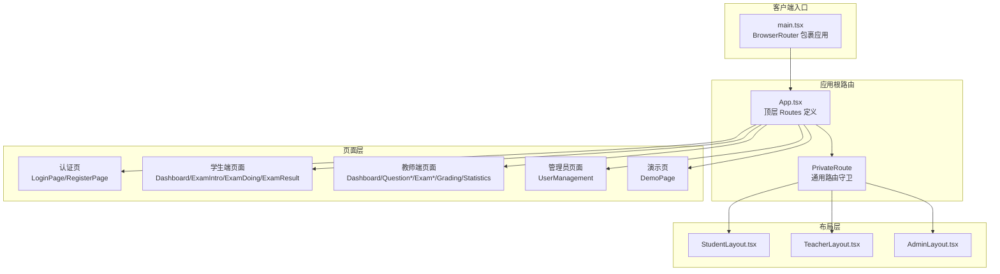
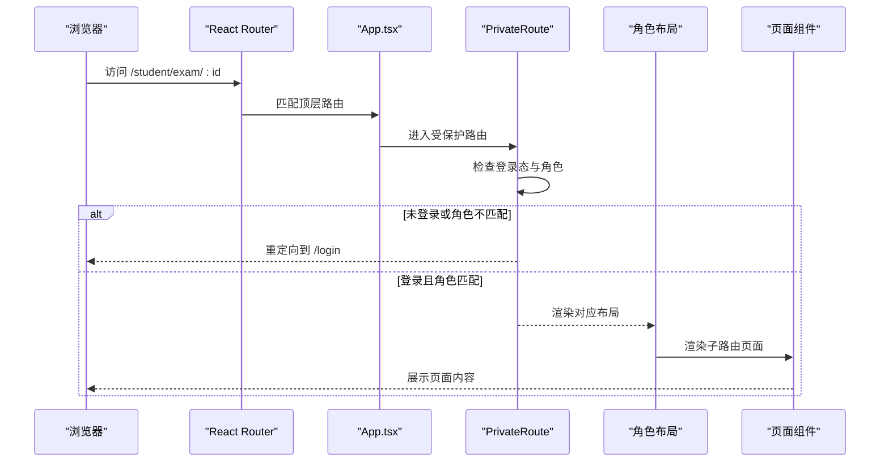
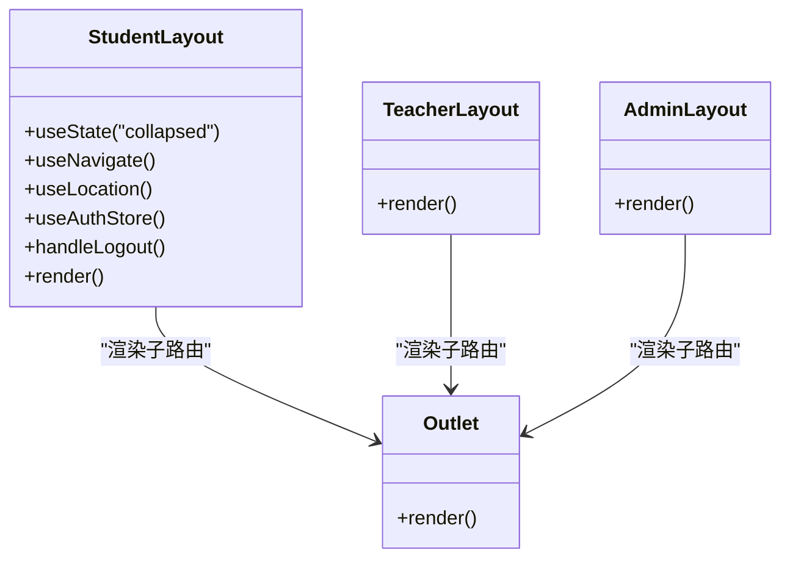
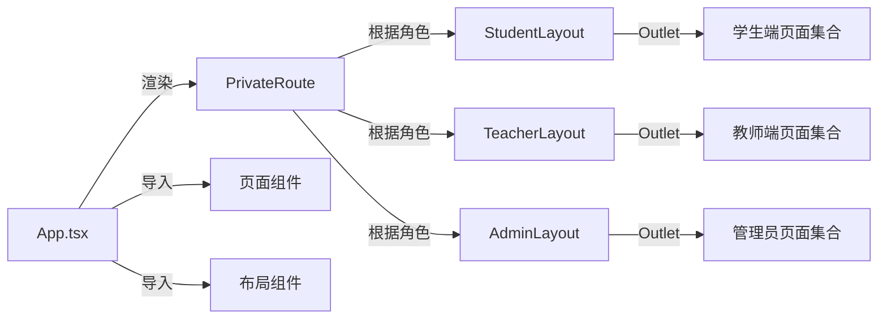

# 路由导航

<cite>
**本文引用的文件**
- [App.tsx](file://packages/client/src/App.tsx)
- [StudentLayout.tsx](file://packages/client/src/components/layout/StudentLayout.tsx)
- [TeacherLayout.tsx](file://packages/client/src/components/layout/TeacherLayout.tsx)
- [AdminLayout.tsx](file://packages/client/src/components/layout/AdminLayout.tsx)
- [LoginPage.tsx](file://packages/client/src/pages/auth/LoginPage.tsx)
- [RegisterPage.tsx](file://packages/client/src/pages/auth/RegisterPage.tsx)
- [Dashboard.tsx（学生）](file://packages/client/src/pages/student/Dashboard.tsx)
- [ExamIntro.tsx](file://packages/client/src/pages/student/ExamIntro.tsx)
- [ExamDoing.tsx](file://packages/client/src/pages/student/ExamDoing.tsx)
- [ExamResult.tsx](file://packages/client/src/pages/student/ExamResult.tsx)
- [Dashboard.tsx（教师）](file://packages/client/src/pages/teacher/Dashboard.tsx)
- [QuestionBank.tsx](file://packages/client/src/pages/teacher/QuestionBank.tsx)
- [QuestionEditor.tsx](file://packages/client/src/pages/teacher/QuestionEditor.tsx)
- [ExamManager.tsx](file://packages/client/src/pages/teacher/ExamManager.tsx)
- [ExamForm.tsx](file://packages/client/src/pages/teacher/ExamForm.tsx)
- [ExamMonitor.tsx](file://packages/client/src/pages/teacher/ExamMonitor.tsx)
- [GradingPage.tsx](file://packages/client/src/pages/teacher/GradingPage.tsx)
- [StatisticsPage.tsx](file://packages/client/src/pages/teacher/StatisticsPage.tsx)
- [UserManagement.tsx](file://packages/client/src/pages/admin/UserManagement.tsx)
- [DemoPage.tsx](file://packages/client/src/pages/demo/DemoPage.tsx)
- [main.tsx](file://packages/client/src/main.tsx)
- [auth.ts（store）](file://packages/client/src/stores/auth.ts)
</cite>

## 目录
1. [简介](#简介)
2. [项目结构](#项目结构)
3. [核心组件](#核心组件)
4. [架构总览](#架构总览)
5. [详细组件分析](#详细组件分析)
6. [依赖关系分析](#依赖关系分析)
7. [性能考量](#性能考量)
8. [故障排查指南](#故障排查指南)
9. [结论](#结论)
10. [附录](#附录)

## 简介
本文件系统性梳理考试系统的前端路由导航体系，覆盖以下主题：
- 路由定义与嵌套路由组织
- 动态路由参数与查询字符串处理
- 布局组件设计与角色化布局切换
- 路由守卫、权限控制与页面跳转最佳实践
- 历史记录管理与导航行为

该系统基于 React Router v6 的现代路由模型，采用“布局 + 嵌套路由”的分层设计，结合全局认证状态与角色权限，实现清晰的用户路径与安全边界。

## 项目结构
客户端采用工作空间分包结构，路由相关代码集中在 packages/client/src 下，核心入口为应用根组件与布局组件，页面按角色划分到 student、teacher、admin 与 demo 目录。

图表来源
- [main.tsx](file://packages/client/src/main.tsx)
- [App.tsx](file://packages/client/src/App.tsx)
- [StudentLayout.tsx](file://packages/client/src/components/layout/StudentLayout.tsx)
- [TeacherLayout.tsx](file://packages/client/src/components/layout/TeacherLayout.tsx)
- [AdminLayout.tsx](file://packages/client/src/components/layout/AdminLayout.tsx)

章节来源
- [main.tsx](file://packages/client/src/main.tsx)
- [App.tsx](file://packages/client/src/App.tsx)

## 核心组件
- 应用根路由与默认跳转：顶层 Routes 统一声明所有路由规则，并设置默认首页与兜底跳转。
- 路由守卫 PrivateRoute：统一处理登录态校验与角色白名单校验，未通过则重定向至登录页。
- 角色化布局：StudentLayout、TeacherLayout、AdminLayout 分别承载对应角色的侧边菜单、头部与内容区域，内部通过 Outlet 渲染子路由。
- 页面组件：各角色下的页面按功能模块拆分，支持动态路由参数与查询字符串。

章节来源
- [App.tsx](file://packages/client/src/App.tsx)
- [StudentLayout.tsx](file://packages/client/src/components/layout/StudentLayout.tsx)
- [TeacherLayout.tsx](file://packages/client/src/components/layout/TeacherLayout.tsx)
- [AdminLayout.tsx](file://packages/client/src/components/layout/AdminLayout.tsx)

## 架构总览
下图展示从浏览器地址到页面渲染的关键流程，以及权限拦截与布局切换的时序。

图表来源
- [App.tsx](file://packages/client/src/App.tsx)
- [StudentLayout.tsx](file://packages/client/src/components/layout/StudentLayout.tsx)

## 详细组件分析

### 路由定义与嵌套路由
- 顶层路由组织：App.tsx 使用 Routes/Route 组织所有路由，包含认证、学生、教师、管理员与演示页。
- 嵌套路由：以 /student、/teacher、/admin 为父路由，内部通过子 Route 定义 index、dashboard、exam/:id 等子路径。
- 默认与兜底：根路径与通配符均重定向到登录页，确保未授权访问被阻断。

章节来源
- [App.tsx](file://packages/client/src/App.tsx)

### 路由守卫与权限控制
- 登录态校验：PrivateRoute 读取全局认证状态，未登录则重定向到 /login。
- 角色白名单：可选 roles 参数限制仅特定角色可见；若当前用户角色不在白名单中，同样重定向到 /login。
- 全局初始化：应用启动时从本地存储恢复认证状态，保证刷新后仍保持登录态。

章节来源
- [App.tsx](file://packages/client/src/App.tsx)
- [auth.ts（store）](file://packages/client/src/stores/auth.ts)

### 布局组件设计与实现
- 统一结构：每个布局均包含 Sider（侧边栏）、Header（头部）与 Content（内容区），通过 Ant Design Layout 组件组合。
- 导航与交互：侧边菜单项点击触发 useNavigate 跳转；头部右上角提供用户下拉菜单，包含登出操作。
- 响应式折叠：侧边栏支持折叠，标题文案随折叠状态变化。
- 子路由渲染：布局内部通过 Outlet 渲染当前匹配的子路由页面。

图表来源
- [StudentLayout.tsx](file://packages/client/src/components/layout/StudentLayout.tsx)
- [TeacherLayout.tsx](file://packages/client/src/components/layout/TeacherLayout.tsx)
- [AdminLayout.tsx](file://packages/client/src/components/layout/AdminLayout.tsx)

章节来源
- [StudentLayout.tsx](file://packages/client/src/components/layout/StudentLayout.tsx)
- [TeacherLayout.tsx](file://packages/client/src/components/layout/TeacherLayout.tsx)
- [AdminLayout.tsx](file://packages/client/src/components/layout/AdminLayout.tsx)

### 动态路由与参数传递
- 动态段：如 exam/:id、questions/:id/edit、exams/:id/edit 等，用于携带资源标识。
- 参数读取：页面组件通过 useParams 获取动态参数，结合 useNavigate 实现跳转与回退。
- 示例路径
  - 学生端：/student/exam/:id（介绍页）、/student/exam/:id/doing（答题页）、/student/exam/:id/result（结果页）
  - 教师端：/teacher/questions/:id/edit、/teacher/exams/:id/edit、/teacher/exams/:id/monitor、/teacher/exams/:id/grading、/teacher/exams/:id/statistics

章节来源
- [App.tsx](file://packages/client/src/App.tsx)
- [ExamIntro.tsx](file://packages/client/src/pages/student/ExamIntro.tsx)
- [ExamDoing.tsx](file://packages/client/src/pages/student/ExamDoing.tsx)
- [ExamResult.tsx](file://packages/client/src/pages/student/ExamResult.tsx)
- [QuestionEditor.tsx](file://packages/client/src/pages/teacher/QuestionEditor.tsx)
- [ExamForm.tsx](file://packages/client/src/pages/teacher/ExamForm.tsx)
- [ExamMonitor.tsx](file://packages/client/src/pages/teacher/ExamMonitor.tsx)
- [GradingPage.tsx](file://packages/client/src/pages/teacher/GradingPage.tsx)
- [StatisticsPage.tsx](file://packages/client/src/pages/teacher/StatisticsPage.tsx)

### 查询字符串与历史记录管理
- 查询字符串：页面组件可通过 URLSearchParams 或路由库提供的工具读取查询参数，用于筛选、排序或状态传递。
- 历史记录：使用 useNavigate 的 replace 或相对路径跳转，避免历史栈冗余；在表单提交或确认后使用 replace 提升用户体验。
- 回退策略：在子页面返回父级列表时，优先使用相对路径或 replace，减少历史栈层级。

章节来源
- [App.tsx](file://packages/client/src/App.tsx)

### 认证与注册页面
- 登录/注册：独立路由，无需登录态即可访问；登录成功后由业务逻辑决定跳转目标（通常为对应角色的首页）。
- 与守卫配合：登录页不包裹 PrivateRoute，避免循环重定向。

章节来源
- [LoginPage.tsx](file://packages/client/src/pages/auth/LoginPage.tsx)
- [RegisterPage.tsx](file://packages/client/src/pages/auth/RegisterPage.tsx)
- [App.tsx](file://packages/client/src/App.tsx)

### 角色化页面与导航
- 学生端：以“我的考试”为核心导航，支持考试介绍、答题、结果查看。
- 教师端：题库编辑、试卷管理、监考、阅卷、统计分析等功能模块。
- 管理员：用户管理。

章节来源
- [StudentLayout.tsx](file://packages/client/src/components/layout/StudentLayout.tsx)
- [TeacherLayout.tsx](file://packages/client/src/components/layout/TeacherLayout.tsx)
- [AdminLayout.tsx](file://packages/client/src/components/layout/AdminLayout.tsx)
- [Dashboard.tsx（学生）](file://packages/client/src/pages/student/Dashboard.tsx)
- [Dashboard.tsx（教师）](file://packages/client/src/pages/teacher/Dashboard.tsx)
- [UserManagement.tsx](file://packages/client/src/pages/admin/UserManagement.tsx)

## 依赖关系分析
- 路由依赖：App.tsx 作为唯一路由出口，依赖各页面组件与布局组件。
- 权限依赖：PrivateRoute 依赖认证状态 store，实现全局守卫。
- 导航依赖：布局组件依赖 react-router-dom 的 useNavigate/useLocation，实现页面间跳转与状态同步。

图表来源
- [App.tsx](file://packages/client/src/App.tsx)
- [StudentLayout.tsx](file://packages/client/src/components/layout/StudentLayout.tsx)
- [TeacherLayout.tsx](file://packages/client/src/components/layout/TeacherLayout.tsx)
- [AdminLayout.tsx](file://packages/client/src/components/layout/AdminLayout.tsx)

章节来源
- [App.tsx](file://packages/client/src/App.tsx)

## 性能考量
- 路由懒加载：建议对大型页面或不常用模块启用懒加载，减少首屏体积。
- 嵌套路由复用：共享布局与菜单的状态尽量局部化，避免不必要的重渲染。
- 历史记录优化：批量跳转时合并历史记录，减少回退链长度。
- 权限判断前置：在进入受保护路由前完成角色判定，避免无效渲染。

## 故障排查指南
- 无法进入受保护路由
  - 检查认证状态是否正确初始化与更新。
  - 确认用户角色是否在 PrivateRoute 的角色白名单内。
- 登录后未跳转到预期页面
  - 检查登录成功后的跳转逻辑是否设置目标路径。
- 布局菜单不响应点击
  - 确认 useNavigate 的调用与菜单 key 对齐。
- 动态路由参数为空
  - 检查 App.tsx 中的路径定义与页面 useParams 的读取是否一致。

章节来源
- [App.tsx](file://packages/client/src/App.tsx)
- [auth.ts（store）](file://packages/client/src/stores/auth.ts)

## 结论
本系统通过“顶层路由 + 布局 + 子路由”的分层设计，结合统一的路由守卫与角色权限控制，实现了清晰、可维护的导航体系。动态路由与参数传递满足了多角色场景下的差异化需求；布局组件的模块化设计便于扩展与维护。建议后续引入路由懒加载与错误边界，进一步提升性能与稳定性。

## 附录
- 最佳实践清单
  - 所有受保护路由统一使用 PrivateRoute 包裹
  - 动态路由参数命名规范，页面中统一读取
  - 使用 useNavigate 替代硬编码跳转，增强可测试性
  - 在布局中集中处理用户信息与登出逻辑
  - 为重要页面添加回退策略，避免历史栈过深