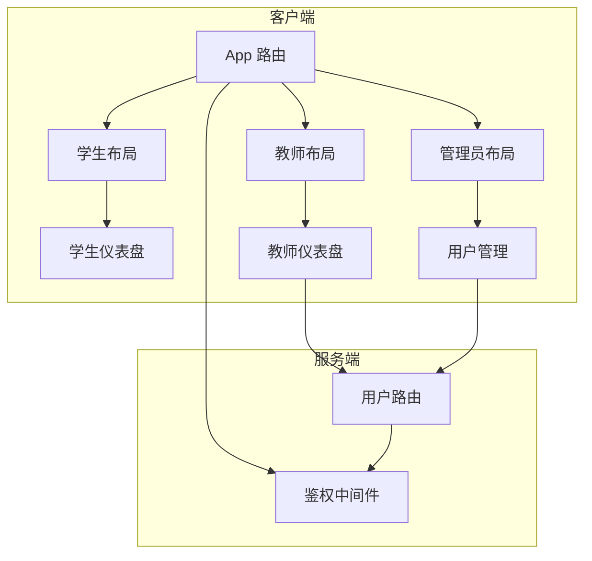
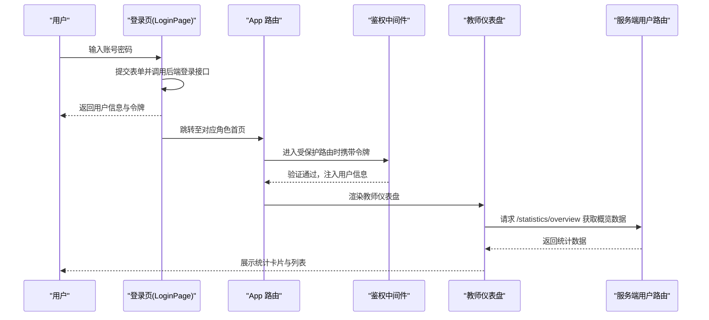
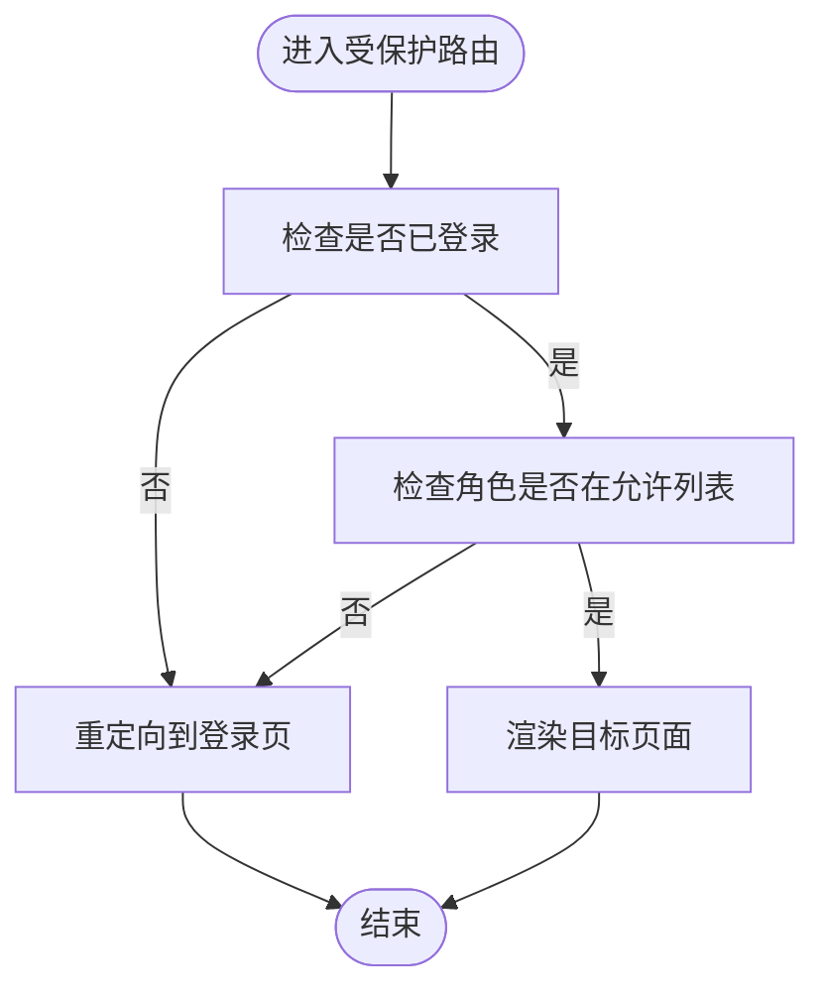
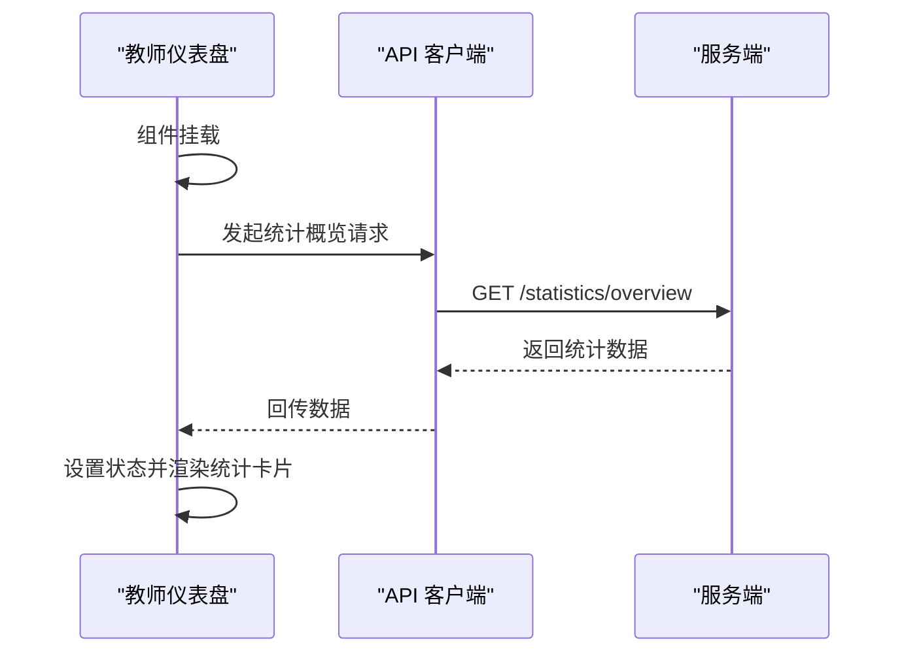
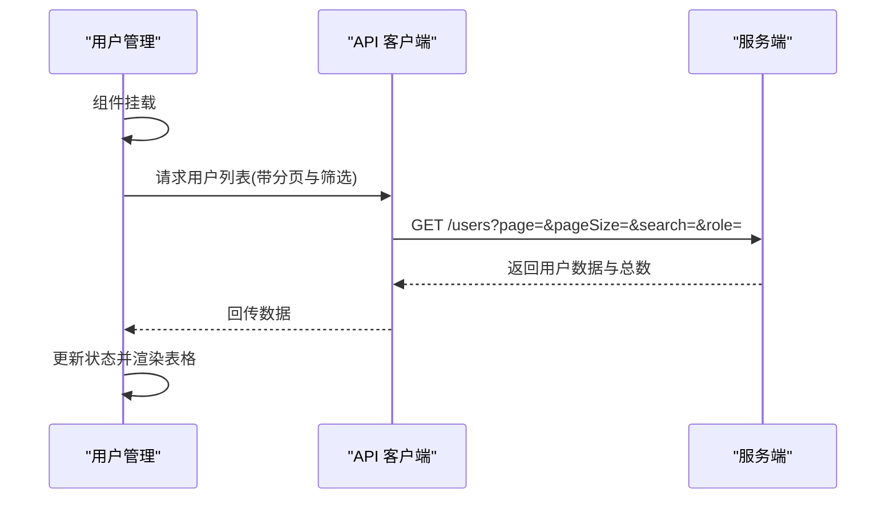
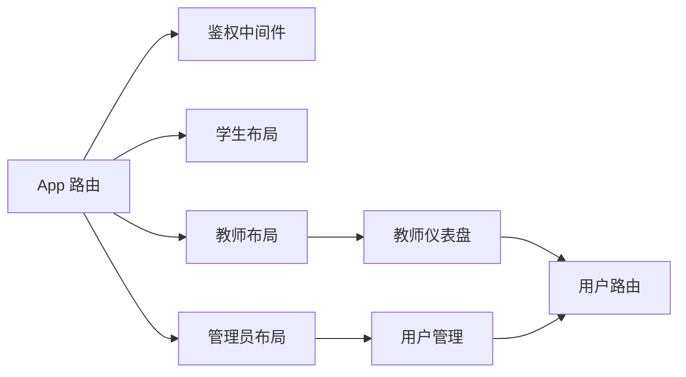

# 仪表盘页面

<cite>
**本文档引用的文件**
- [App.tsx](file://packages/client/src/App.tsx)
- [LoginPage.tsx](file://packages/client/src/pages/auth/LoginPage.tsx)
- [StudentLayout.tsx](file://packages/client/src/components/layout/StudentLayout.tsx)
- [TeacherLayout.tsx](file://packages/client/src/components/layout/TeacherLayout.tsx)
- [AdminLayout.tsx](file://packages/client/src/components/layout/AdminLayout.tsx)
- [Dashboard.tsx（教师）](file://packages/client/src/pages/teacher/Dashboard.tsx)
- [UserManagement.tsx](file://packages/client/src/pages/admin/UserManagement.tsx)
- [auth.ts（中间件）](file://packages/server/src/middleware/auth.ts)
- [users.ts（路由）](file://packages/server/src/routes/users.ts)
- [gen_docx.py](file://gen_docx.py)
</cite>

## 目录
1. [引言](#引言)
2. [项目结构](#项目结构)
3. [核心组件](#核心组件)
4. [架构总览](#架构总览)
5. [详细组件分析](#详细组件分析)
6. [依赖关系分析](#依赖关系分析)
7. [性能考虑](#性能考虑)
8. [故障排除指南](#故障排除指南)
9. [结论](#结论)
10. [附录](#附录)

## 引言
本文件聚焦于考试系统的仪表盘页面实现，覆盖学生、教师与管理员三类角色的仪表盘设计与交互。内容包括：
- 角色权限控制与导航结构
- 数据聚合与统计卡片展示
- 快捷入口与功能跳转
- 个性化配置与响应式布局
- 后端接口与鉴权机制

## 项目结构
前端采用 React + Ant Design 构建，路由通过私有路由组件进行角色级权限校验；后端使用 Express + Prisma 提供 REST 接口，并通过 JWT 中间件完成鉴权与授权。

**图示来源**
- [App.tsx:38-95](file://packages/client/src/App.tsx#L38-L95)
- [StudentLayout.tsx:15-68](file://packages/client/src/components/layout/StudentLayout.tsx#L15-L68)
- [TeacherLayout.tsx:16-71](file://packages/client/src/components/layout/TeacherLayout.tsx#L16-L71)
- [AdminLayout.tsx:14-67](file://packages/client/src/components/layout/AdminLayout.tsx#L14-L67)
- [Dashboard.tsx（教师）:8-29](file://packages/client/src/pages/teacher/Dashboard.tsx#L8-L29)
- [UserManagement.tsx:13-88](file://packages/client/src/pages/admin/UserManagement.tsx#L13-L88)
- [auth.ts（中间件）:19-45](file://packages/server/src/middleware/auth.ts#L19-L45)
- [users.ts（路由）:26-68](file://packages/server/src/routes/users.ts#L26-L68)

**章节来源**
- [App.tsx:38-95](file://packages/client/src/App.tsx#L38-L95)
- [StudentLayout.tsx:15-68](file://packages/client/src/components/layout/StudentLayout.tsx#L15-L68)
- [TeacherLayout.tsx:16-71](file://packages/client/src/components/layout/TeacherLayout.tsx#L16-L71)
- [AdminLayout.tsx:14-67](file://packages/client/src/components/layout/AdminLayout.tsx#L14-L67)
- [gen_docx.py:391-414](file://gen_docx.py#L391-L414)

## 核心组件
- 私有路由组件：在进入受保护页面前进行登录状态与角色校验，不满足条件则重定向至登录页。
- 三大布局组件：分别承载学生、教师、管理员的侧边菜单与头部信息，统一处理登出与面包屑风格的导航高亮。
- 仪表盘页面：
  - 教师仪表盘：从后端拉取概览统计数据，渲染统计卡片与加载态。
  - 学生仪表盘：根据组件树文档标注为“我的考试”入口，具体实现位于对应页面组件中。
  - 管理员仪表盘：当前以“用户管理”作为入口，负责用户增删改查与分页列表展示。

**章节来源**
- [App.tsx:24-36](file://packages/client/src/App.tsx#L24-L36)
- [StudentLayout.tsx:26-28](file://packages/client/src/components/layout/StudentLayout.tsx#L26-L28)
- [TeacherLayout.tsx:27-31](file://packages/client/src/components/layout/TeacherLayout.tsx#L27-L31)
- [AdminLayout.tsx:25-27](file://packages/client/src/components/layout/AdminLayout.tsx#L25-L27)
- [Dashboard.tsx（教师）:8-29](file://packages/client/src/pages/teacher/Dashboard.tsx#L8-L29)
- [UserManagement.tsx:13-88](file://packages/client/src/pages/admin/UserManagement.tsx#L13-L88)
- [gen_docx.py:391-414](file://gen_docx.py#L391-L414)

## 架构总览
下图展示了从登录到进入各角色仪表盘的整体流程，以及教师仪表盘的数据请求链路。

**图示来源**
- [LoginPage.tsx:16-33](file://packages/client/src/pages/auth/LoginPage.tsx#L16-L33)
- [App.tsx:38-95](file://packages/client/src/App.tsx#L38-L95)
- [auth.ts（中间件）:19-45](file://packages/server/src/middleware/auth.ts#L19-L45)
- [Dashboard.tsx（教师）:13-15](file://packages/client/src/pages/teacher/Dashboard.tsx#L13-L15)
- [users.ts（路由）:26-68](file://packages/server/src/routes/users.ts#L26-L68)

## 详细组件分析

### 登录与角色跳转
- 登录成功后根据用户角色决定跳转路径：学生、教师或管理员。
- 登录页对错误进行统一提示，保证用户体验一致性。

**章节来源**
- [LoginPage.tsx:16-33](file://packages/client/src/pages/auth/LoginPage.tsx#L16-L33)

### 私有路由与权限控制
- 私有路由组件在渲染子组件前检查登录状态与角色白名单。
- 不满足条件时直接重定向至登录页，避免未授权访问。

**图示来源**
- [App.tsx:24-36](file://packages/client/src/App.tsx#L24-L36)

**章节来源**
- [App.tsx:24-36](file://packages/client/src/App.tsx#L24-L36)

### 教师仪表盘（工作台）
- 初始化加载：首次渲染显示加载指示器。
- 数据请求：通过 API 获取概览统计，包含学生总数、题目总数、考试总数与评分率等指标。
- 展示方式：使用栅格布局与统计卡片组件，支持响应式断点适配。

**图示来源**
- [Dashboard.tsx（教师）:8-29](file://packages/client/src/pages/teacher/Dashboard.tsx#L8-L29)

**章节来源**
- [Dashboard.tsx（教师）:8-29](file://packages/client/src/pages/teacher/Dashboard.tsx#L8-L29)

### 学生仪表盘（我的考试）
- 导航入口：侧边菜单“我的考试”指向学生仪表盘。
- 页面职责：根据组件树文档标注为“我的考试”入口，用于展示学生可参与的考试列表与状态。

**章节来源**
- [StudentLayout.tsx:26-28](file://packages/client/src/components/layout/StudentLayout.tsx#L26-L28)
- [gen_docx.py:391-414](file://gen_docx.py#L391-L414)

### 管理员仪表盘（用户管理）
- 导航入口：侧边菜单“用户管理”指向用户管理页面。
- 功能特性：分页查询用户、新增/编辑/删除用户、按关键词与角色筛选、标签化展示角色。
- 技术要点：使用分页参数与搜索条件组合查询，统一错误提示与加载状态。

**图示来源**
- [UserManagement.tsx:13-88](file://packages/client/src/pages/admin/UserManagement.tsx#L13-L88)
- [users.ts（路由）:26-68](file://packages/server/src/routes/users.ts#L26-L68)

**章节来源**
- [UserManagement.tsx:13-88](file://packages/client/src/pages/admin/UserManagement.tsx#L13-L88)
- [users.ts（路由）:26-68](file://packages/server/src/routes/users.ts#L26-L68)

### 布局与导航结构
- 学生布局：左侧菜单仅包含“我的考试”，顶部显示用户名与头像，支持登出。
- 教师布局：左侧菜单包含“工作台”、“题库管理”、“考试管理”，顶部显示用户名与头像，支持登出。
- 管理员布局：左侧菜单包含“用户管理”，顶部显示用户名与头像，支持登出。

**章节来源**
- [StudentLayout.tsx:26-34](file://packages/client/src/components/layout/StudentLayout.tsx#L26-L34)
- [TeacherLayout.tsx:27-37](file://packages/client/src/components/layout/TeacherLayout.tsx#L27-L37)
- [AdminLayout.tsx:25-33](file://packages/client/src/components/layout/AdminLayout.tsx#L25-L33)

### 鉴权与授权（后端）
- 认证中间件：从 Authorization 头部提取 Bearer 令牌并验证，失败返回 401。
- 授权中间件：基于角色白名单进行权限校验，不在白名单内返回 403。
- 用户路由：对 GET /users 应用认证与授权（admin、teacher），支持分页、模糊搜索与角色过滤。

**章节来源**
- [auth.ts（中间件）:19-45](file://packages/server/src/middleware/auth.ts#L19-L45)
- [users.ts（路由）:8-9](file://packages/server/src/routes/users.ts#L8-L9)
- [users.ts（路由）:26-68](file://packages/server/src/routes/users.ts#L26-L68)

## 依赖关系分析
- 前端路由依赖鉴权中间件，确保只有登录且具备角色权限的用户才能访问对应页面。
- 教师仪表盘依赖用户路由提供的统计接口；管理员用户管理依赖用户路由的列表与分页能力。
- 布局组件与页面组件解耦，通过路由与私有路由组件进行装配。

**图示来源**
- [App.tsx:38-95](file://packages/client/src/App.tsx#L38-L95)
- [auth.ts（中间件）:19-45](file://packages/server/src/middleware/auth.ts#L19-L45)
- [users.ts（路由）:26-68](file://packages/server/src/routes/users.ts#L26-L68)

**章节来源**
- [App.tsx:38-95](file://packages/client/src/App.tsx#L38-L95)
- [auth.ts（中间件）:19-45](file://packages/server/src/middleware/auth.ts#L19-L45)
- [users.ts（路由）:26-68](file://packages/server/src/routes/users.ts#L26-L68)

## 性能考虑
- 列表分页：用户管理采用分页查询，避免一次性加载大量数据。
- 懒加载与缓存：建议在仪表盘中对统计卡片增加本地缓存策略，减少重复请求。
- 响应式布局：Ant Design 的栅格系统已在统计卡片中应用，确保在不同屏幕尺寸下的良好体验。
- 错误与加载态：统一的加载与错误提示提升用户体验，降低无效重试带来的压力。

## 故障排除指南
- 登录失败：检查登录页的错误提示与网络请求状态码，确认用户名与密码正确性。
- 权限不足：确认用户角色与目标路由的角色白名单匹配，必要时更新后端授权策略。
- 数据为空：检查后端统计接口是否正常返回数据，确认数据库连接与查询条件。
- 分页异常：核对分页参数与服务端实现，确保 page 与 pageSize 合法。

**章节来源**
- [LoginPage.tsx:16-33](file://packages/client/src/pages/auth/LoginPage.tsx#L16-L33)
- [auth.ts（中间件）:19-45](file://packages/server/src/middleware/auth.ts#L19-L45)
- [users.ts（路由）:26-68](file://packages/server/src/routes/users.ts#L26-L68)

## 结论
该仪表盘体系以角色为中心，结合私有路由与鉴权中间件实现了清晰的权限边界；教师仪表盘通过统计卡片直观呈现关键指标，管理员仪表盘提供完善的用户管理能力。整体架构简洁、扩展性强，适合后续在各角色仪表盘中引入更丰富的图表与个性化配置。

## 附录
- 组件树参考（来自文档生成脚本）：包含学生端“我的考试”、教师端“工作台”与管理员端“用户管理”的层次关系，便于理解页面职责与导航路径。

**章节来源**
- [gen_docx.py:391-414](file://gen_docx.py#L391-L414)