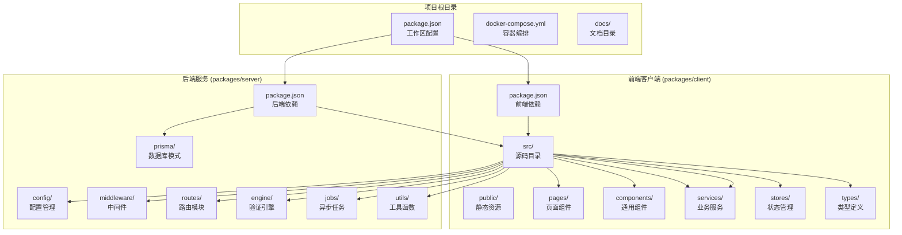
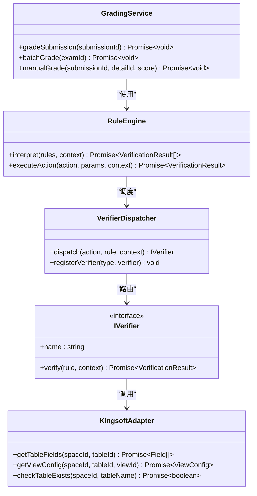
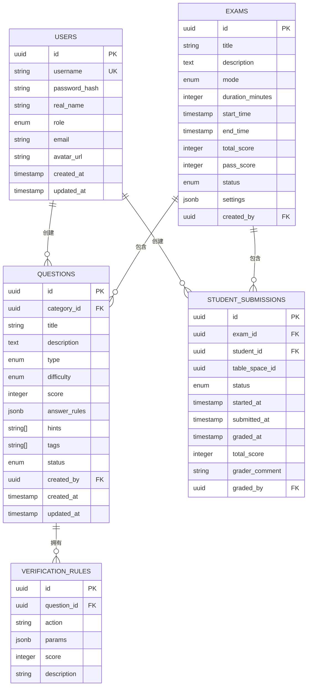
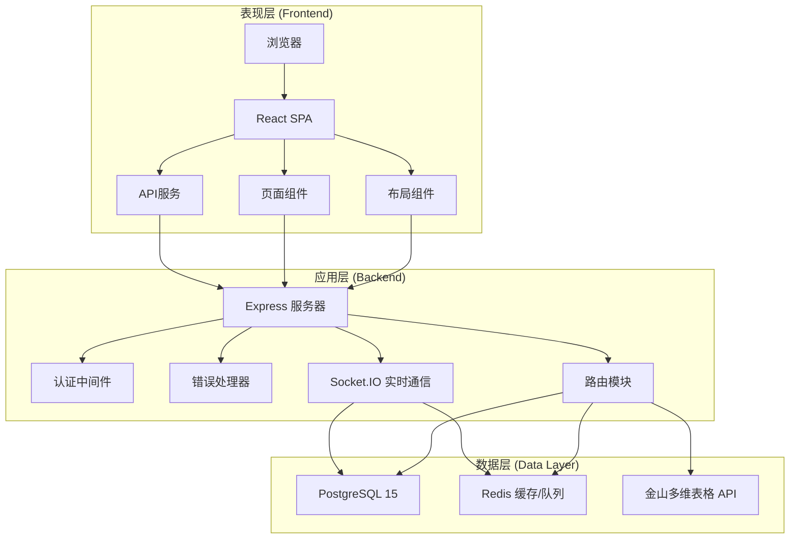
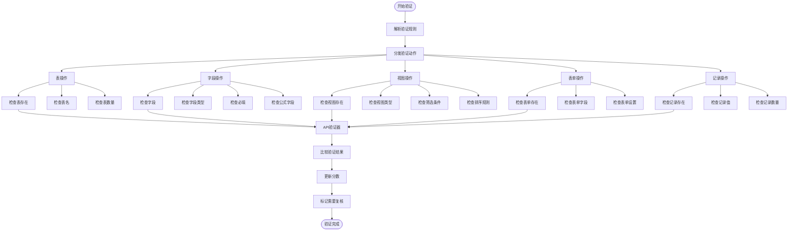
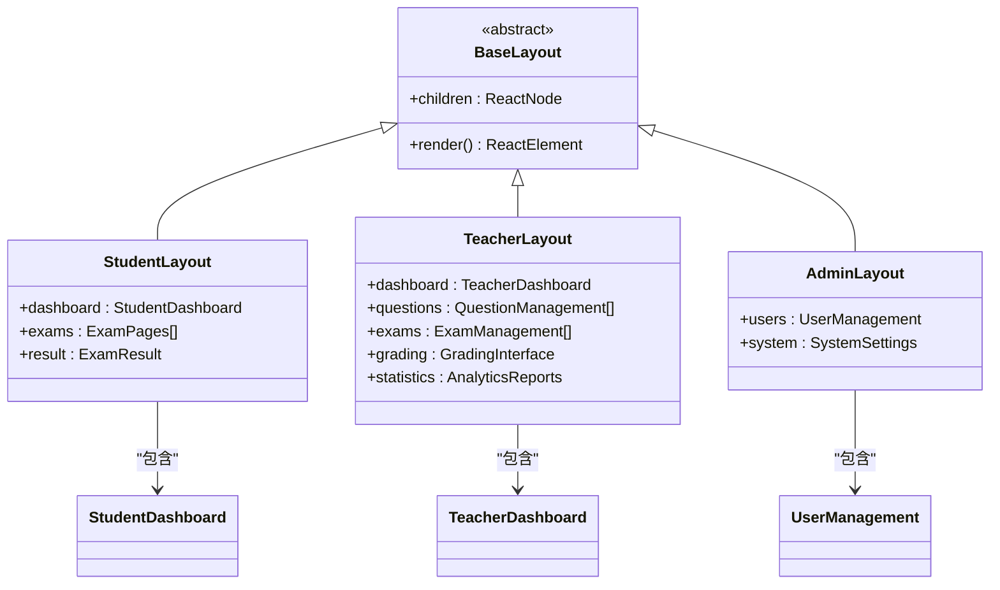
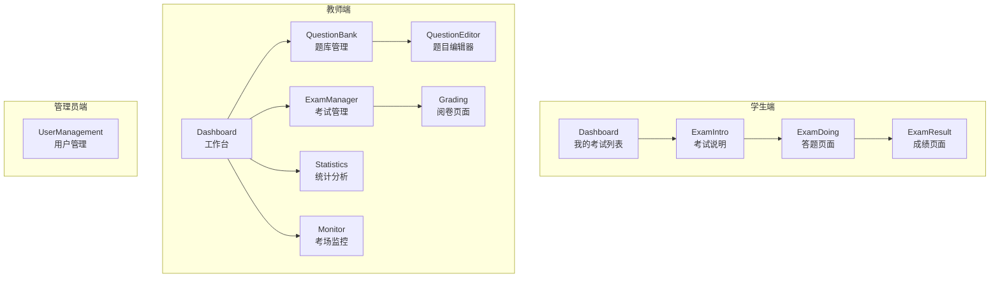
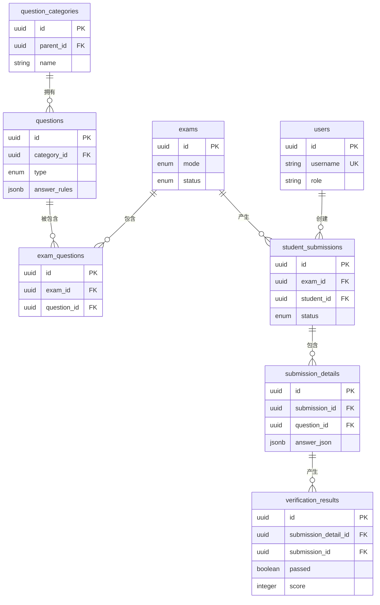
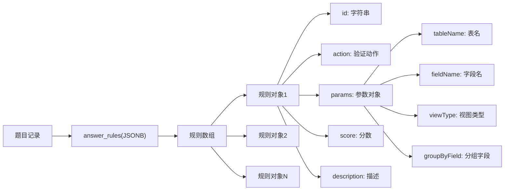
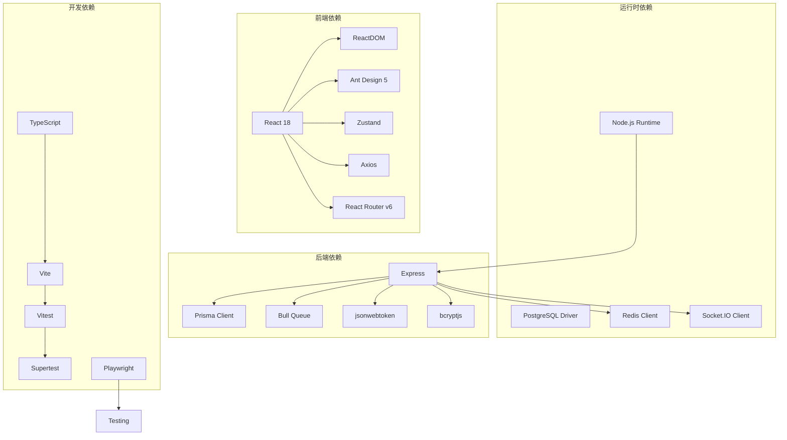

# 学生档案分析

<cite>
**本文档引用的文件**
- [gen_docx.py](file://gen_docx.py)
- [package.json](file://package.json)
- [docker-compose.yml](file://docker-compose.yml)
- [packages/server/src/engine/rule-engine.ts](file://packages/server/src/engine/rule-engine.ts)
- [packages/server/src/engine/adapters/kingsoft-adapter.ts](file://packages/server/src/engine/adapters/kingsoft-adapter.ts)
- [packages/server/src/services/grading-service.ts](file://packages/server/src/services/grading-service.ts)
- [packages/server/prisma/schema.prisma](file://packages/server/prisma/schema.prisma)
- [packages/client/src/App.tsx](file://packages/client/src/App.tsx)
- [packages/client/src/pages/student/Dashboard.tsx](file://packages/client/src/pages/student/Dashboard.tsx)
- [packages/client/src/pages/teacher/Dashboard.tsx](file://packages/client/src/pages/teacher/Dashboard.tsx)
- [packages/client/src/pages/admin/UserManagement.tsx](file://packages/client/src/pages/admin/UserManagement.tsx)
- [packages/client/src/components/layout/StudentLayout.tsx](file://packages/client/src/components/layout/StudentLayout.tsx)
- [packages/client/src/components/layout/TeacherLayout.tsx](file://packages/client/src/components/layout/TeacherLayout.tsx)
- [packages/client/src/components/layout/AdminLayout.tsx](file://packages/client/src/components/layout/AdminLayout.tsx)
</cite>

## 目录
1. [项目概述](#项目概述)
2. [项目结构](#项目结构)
3. [核心组件](#核心组件)
4. [架构总览](#架构总览)
5. [详细组件分析](#详细组件分析)
6. [依赖关系分析](#依赖关系分析)
7. [性能考虑](#性能考虑)
8. [故障排除指南](#故障排除指南)
9. [结论](#结论)

## 项目概述
本项目是面向金山多维表格操作技能的考试系统，旨在通过真实环境中的操作任务评估学生的技能水平。系统采用前后端分离架构，后端基于 Node.js + Express，前端基于 React 18 + TypeScript，数据层包含 PostgreSQL 和 Redis，同时对接金山多维表格 Open API 进行自动化验证。

该系统支持三种用户角色：教师（出题、阅卷）、学生（考试、查看成绩）和管理员（用户与系统管理）。核心功能包括题库管理、考试组织、自动判分、人工复核、成绩分析等。

## 项目结构
项目采用 Monorepo 结构，包含前端客户端和后端服务两个主要包：

**图表来源**
- [package.json:17-20](file://package.json#L17-L20)
- [docker-compose.yml:1-37](file://docker-compose.yml#L1-L37)

**章节来源**
- [package.json:1-26](file://package.json#L1-L26)
- [docker-compose.yml:1-37](file://docker-compose.yml#L1-L37)

## 核心组件
系统的核心组件围绕验证引擎展开，主要包括：

### 验证引擎架构
验证引擎采用可插拔的设计模式，支持多种验证策略：

**图表来源**
- [packages/server/src/services/grading-service.ts](file://packages/server/src/services/grading-service.ts)
- [packages/server/src/engine/rule-engine.ts](file://packages/server/src/engine/rule-engine.ts)
- [packages/server/src/engine/adapters/kingsoft-adapter.ts](file://packages/server/src/engine/adapters/kingsoft-adapter.ts)

### 数据模型设计
系统采用 JSONB 存储验证规则，支持灵活的规则配置：

**图表来源**
- [packages/server/prisma/schema.prisma](file://packages/server/prisma/schema.prisma)

**章节来源**
- [packages/server/src/services/grading-service.ts](file://packages/server/src/services/grading-service.ts)
- [packages/server/src/engine/rule-engine.ts](file://packages/server/src/engine/rule-engine.ts)
- [packages/server/prisma/schema.prisma](file://packages/server/prisma/schema.prisma)

## 架构总览
系统采用经典的三层架构，结合微服务设计理念：

**图表来源**
- [gen_docx.py:140-170](file://gen_docx.py#L140-L170)
- [docker-compose.yml:1-37](file://docker-compose.yml#L1-L37)

系统架构特点：
- **分层清晰**：表现层、应用层、数据层职责明确
- **可扩展性**：验证引擎采用插件化设计
- **实时性**：支持 WebSocket 实时监控
- **可靠性**：Redis 缓存和队列机制保证系统稳定性

## 详细组件分析

### 验证引擎组件分析
验证引擎是系统的核心，负责将题目规则转换为具体的验证操作：

#### 验证动作类型
系统支持多种验证动作，涵盖表、字段、视图、表单等各个方面：

**图表来源**
- [gen_docx.py:315-365](file://gen_docx.py#L315-L365)

#### 验证策略实现
系统采用多层次的验证策略：

1. **精确匹配策略**：用于存在性检查，要求完全符合预期
2. **深度对比策略**：用于属性检查，进行 JSON 结构的深度比较
3. **模糊匹配策略**：用于公式字段，使用正则表达式和编辑距离算法
4. **人工复核策略**：无法自动判断的情况标记为需要人工审核

**章节来源**
- [gen_docx.py:305-365](file://gen_docx.py#L305-L365)

### 前端组件架构分析
前端采用模块化的组件设计，支持三个角色的不同需求：

#### 布局组件体系

**图表来源**
- [packages/client/src/components/layout/StudentLayout.tsx](file://packages/client/src/components/layout/StudentLayout.tsx)
- [packages/client/src/components/layout/TeacherLayout.tsx](file://packages/client/src/components/layout/TeacherLayout.tsx)
- [packages/client/src/components/layout/AdminLayout.tsx](file://packages/client/src/components/layout/AdminLayout.tsx)

#### 页面组件层次结构
前端页面组件按照功能模块组织：

**图表来源**
- [packages/client/src/pages/student/Dashboard.tsx](file://packages/client/src/pages/student/Dashboard.tsx)
- [packages/client/src/pages/teacher/Dashboard.tsx](file://packages/client/src/pages/teacher/Dashboard.tsx)
- [packages/client/src/pages/admin/UserManagement.tsx](file://packages/client/src/pages/admin/UserManagement.tsx)

**章节来源**
- [packages/client/src/App.tsx](file://packages/client/src/App.tsx)
- [packages/client/src/components/layout/StudentLayout.tsx](file://packages/client/src/components/layout/StudentLayout.tsx)
- [packages/client/src/components/layout/TeacherLayout.tsx](file://packages/client/src/components/layout/TeacherLayout.tsx)
- [packages/client/src/components/layout/AdminLayout.tsx](file://packages/client/src/components/layout/AdminLayout.tsx)

### 数据库设计分析
系统采用 PostgreSQL 作为主数据库，利用 JSONB 类型存储灵活的验证规则：

#### 核心表关系

**图表来源**
- [packages/server/prisma/schema.prisma](file://packages/server/prisma/schema.prisma)

#### 验证规则存储结构
验证规则采用 JSONB 格式存储，支持复杂的嵌套结构：

**图表来源**
- [gen_docx.py:227-240](file://gen_docx.py#L227-L240)

**章节来源**
- [packages/server/prisma/schema.prisma](file://packages/server/prisma/schema.prisma)
- [gen_docx.py:189-240](file://gen_docx.py#L189-L240)

## 依赖关系分析
系统依赖关系呈现清晰的层次结构：

**图表来源**
- [gen_docx.py:172-187](file://gen_docx.py#L172-L187)
- [package.json:21-25](file://package.json#L21-L25)

**章节来源**
- [gen_docx.py:172-187](file://gen_docx.py#L172-L187)
- [package.json:1-26](file://package.json#L1-L26)

## 性能考虑
系统在设计时充分考虑了性能优化：

### 缓存策略
- **Redis 缓存**：用户会话、考试状态、频繁查询结果
- **数据库连接池**：Prisma 连接池管理，减少连接开销
- **静态资源缓存**：前端资源 CDN 缓存策略

### 并发处理
- **异步判分队列**：使用 Redis Bull 实现判分任务队列
- **WebSocket 广播**：实时状态更新，避免轮询
- **批量操作**：支持批量评分和批量导入

### 数据库优化
- **索引设计**：关键查询字段建立适当索引
- **查询优化**：使用 Prisma 的预加载和联表查询
- **分页查询**：大数据量场景下的分页处理

## 故障排除指南
常见问题及解决方案：

### 验证引擎相关问题
1. **规则不生效**
   - 检查验证规则的 action 和参数配置
   - 确认规则的 score 设置是否合理
   - 验证规则的执行顺序

2. **API 调用失败**
   - 检查金山多维表格 API Token 配置
   - 验证网络连接和防火墙设置
   - 查看 API 响应状态码和错误信息

### 前端交互问题
1. **页面加载缓慢**
   - 检查网络请求和 API 响应时间
   - 验证组件渲染性能
   - 检查静态资源加载情况

2. **状态管理异常**
   - 确认 Zustand store 的状态更新
   - 检查组件订阅和状态同步
   - 验证路由状态传递

### 后端服务问题
1. **数据库连接问题**
   - 检查 PostgreSQL 服务状态
   - 验证连接字符串和凭据
   - 查看数据库日志和错误信息

2. **队列任务积压**
   - 检查 Redis 服务状态
   - 验证队列消费者配置
   - 监控队列长度和处理速度

**章节来源**
- [gen_docx.py:544-563](file://gen_docx.py#L544-L563)

## 结论
本学生档案分析系统是一个功能完整、架构清晰的考试平台。系统的主要优势包括：

1. **灵活的验证机制**：支持多种验证策略和可扩展的规则系统
2. **清晰的架构设计**：分层明确，职责分离，易于维护和扩展
3. **完整的功能覆盖**：从题库管理到成绩分析的全流程支持
4. **良好的用户体验**：针对不同角色提供专门的界面和功能
5. **可靠的系统架构**：采用成熟的开源技术和最佳实践

系统通过将传统的纸质档案管理转变为数字化、自动化的操作技能评估，为教育评估提供了新的解决方案。验证引擎的设计使得系统能够准确评估学生的实际操作能力，而不仅仅是理论知识的掌握程度。

未来可以考虑的功能增强包括更丰富的统计分析功能、移动端支持、以及与其他教育系统的集成能力。