# 成绩管理页面

<cite>
**本文档引用的文件**
- [gen_docx.py](file://gen_docx.py)
- [kingsoft-api-reference.md](file://docs/kingsoft-api-reference.md)
- [package.json](file://package.json)
</cite>

## 目录
1. [项目概述](#项目概述)
2. [系统架构](#系统架构)
3. [核心组件](#核心组件)
4. [架构概览](#架构概览)
5. [详细组件分析](#详细组件分析)
6. [依赖关系分析](#依赖关系分析)
7. [性能考虑](#性能考虑)
8. [故障排除指南](#故障排除指南)
9. [结论](#结论)

## 项目概述

本项目是一个基于金山多维表格的考试系统，专注于自动化判分和人工复核流程。系统采用前后端分离架构，后端使用Node.js + Express，前端使用React 18 + TypeScript，数据库采用PostgreSQL 15。

该系统的核心功能包括：
- 自动判分引擎：通过金山多维表格Open API进行自动化验证和评分
- 人工复核流程：对无法自动判断的题目进行人工审核
- 成绩管理：完整的成绩展示、统计分析和报表导出功能
- 考试生命周期管理：从创建题目到最终成绩发布的完整流程

## 系统架构

系统采用经典的三层架构设计：

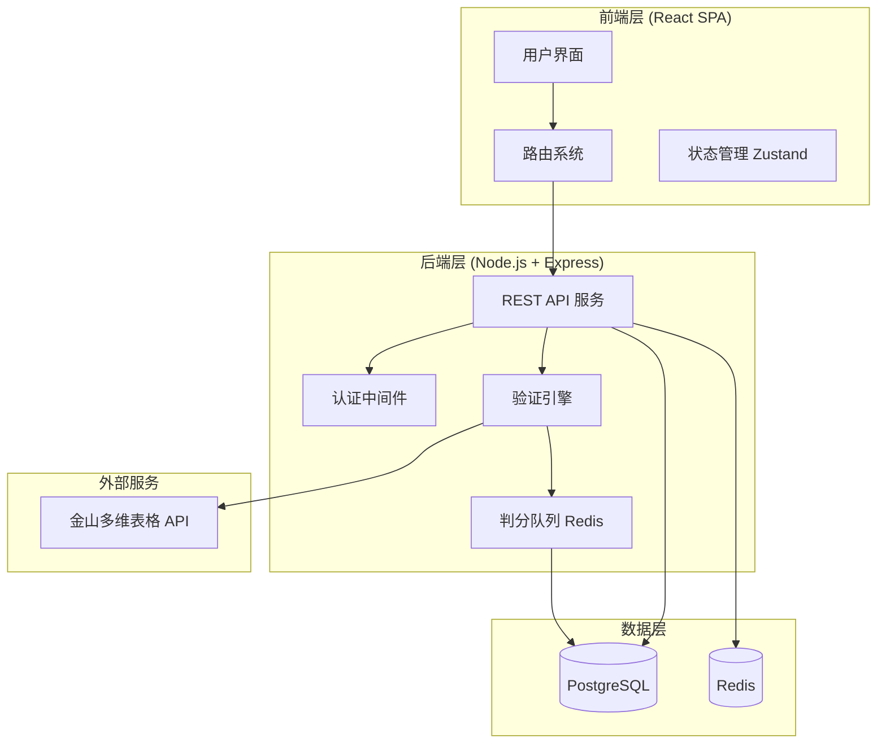

**图表来源**
- [gen_docx.py:144-170](file://gen_docx.py#L144-L170)

**章节来源**
- [gen_docx.py:140-187](file://gen_docx.py#L140-L187)

## 核心组件

### 数据库设计

系统采用关系型数据库设计，核心实体包括：

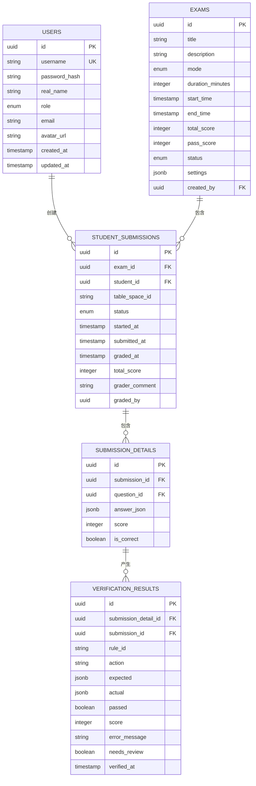

**图表来源**
- [gen_docx.py:194-220](file://gen_docx.py#L194-L220)

### API 设计

系统提供完整的REST API接口，涵盖认证、用户管理、题库管理、考试管理、判分和统计分析等功能模块。

**章节来源**
- [gen_docx.py:241-304](file://gen_docx.py#L241-L304)

## 架构概览

### 考试生命周期

系统实现了完整的考试生命周期管理，从创建题目到最终成绩发布的全流程：

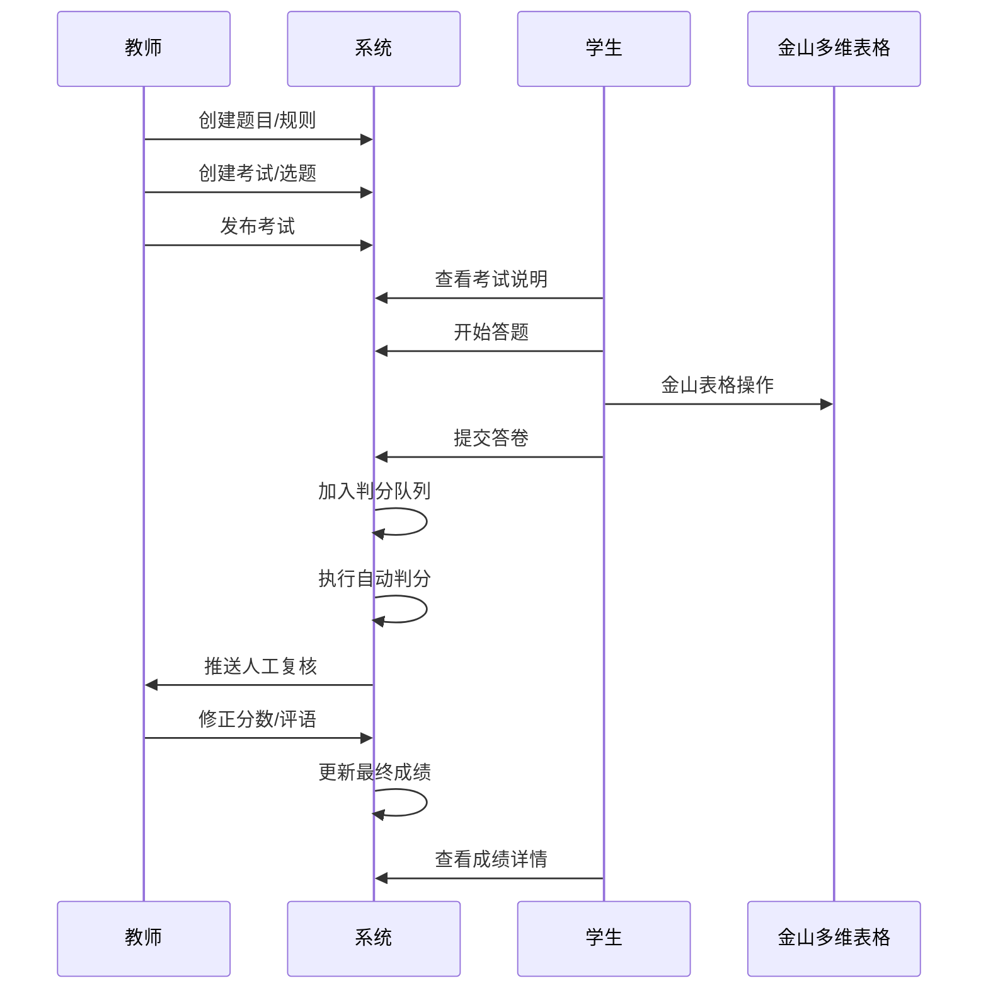

**图表来源**
- [gen_docx.py:419-435](file://gen_docx.py#L419-L435)

### 验证引擎架构

验证引擎采用可插拔设计，支持多种验证策略：

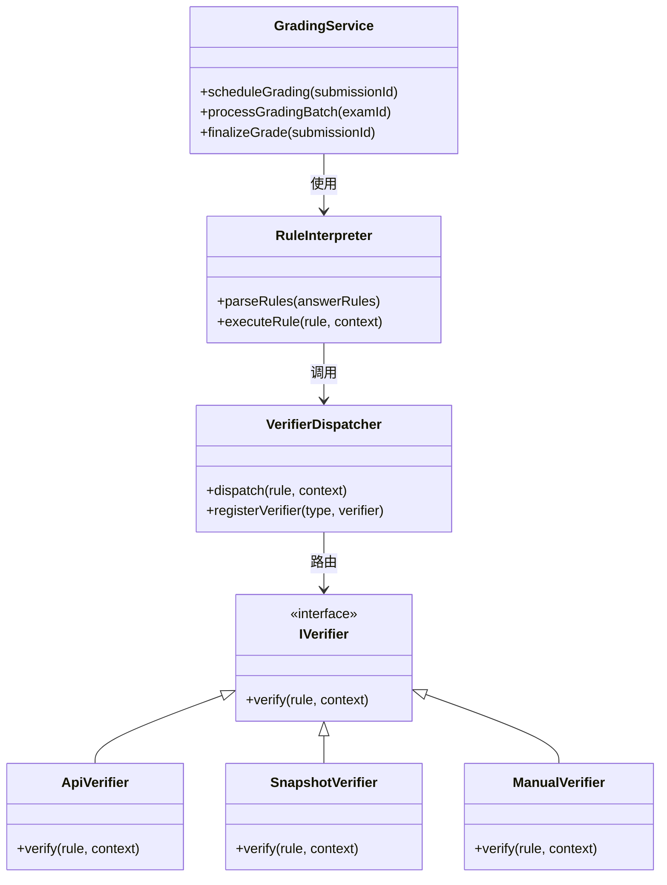

**图表来源**
- [gen_docx.py:308-356](file://gen_docx.py#L308-L356)

**章节来源**
- [gen_docx.py:305-366](file://gen_docx.py#L305-L366)

## 详细组件分析

### 成绩列表页面

成绩列表页面为教师提供批量查看和管理学生成绩的功能：

#### 页面布局设计

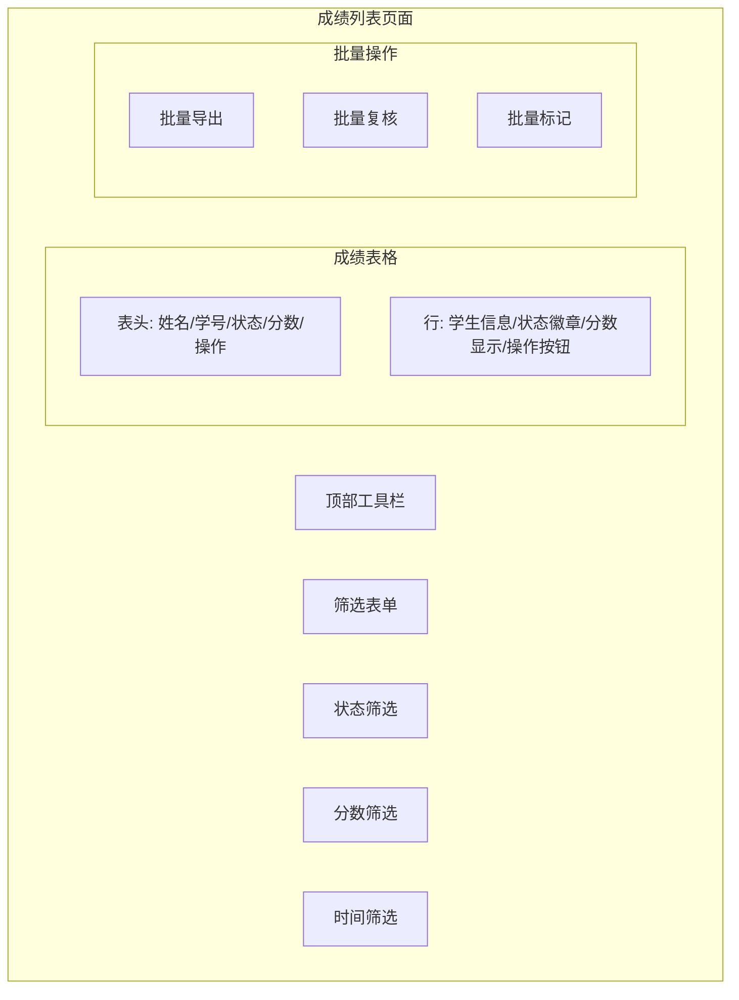

#### 数据流处理

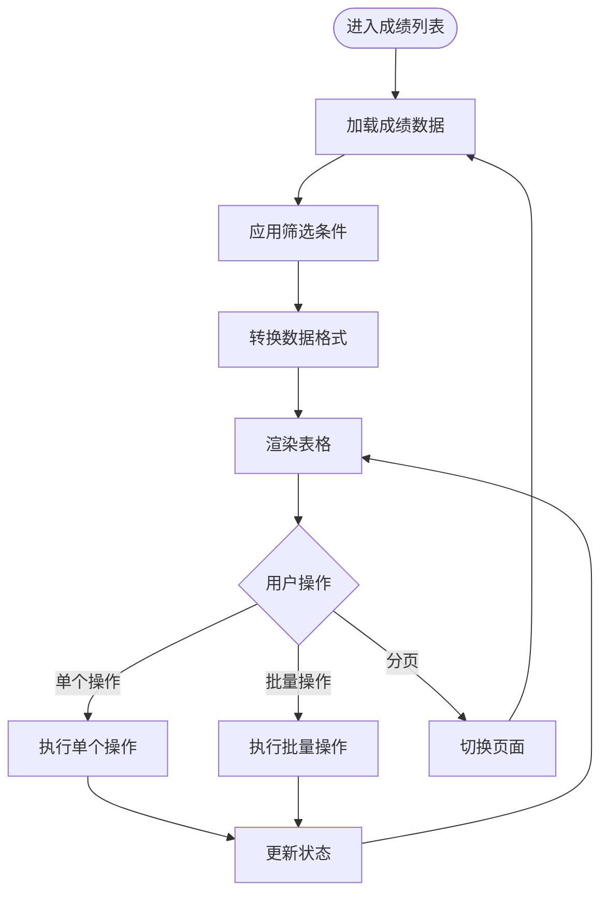

**图表来源**
- [gen_docx.py:376-389](file://gen_docx.py#L376-L389)

### 成绩详情页面

成绩详情页面提供详细的答题过程和判分记录：

#### 详情展示结构

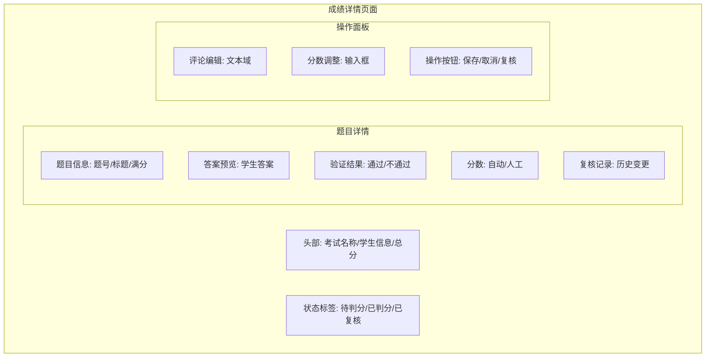

#### 复核流程控制

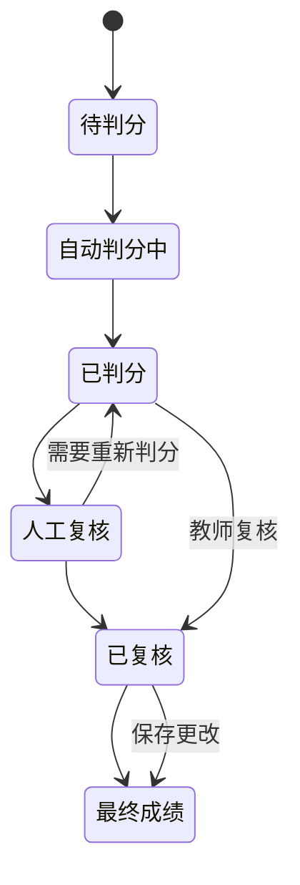

**图表来源**
- [gen_docx.py:431-433](file://gen_docx.py#L431-L433)

### 人工复核页面

人工复核页面专门处理需要人工干预的判分情况：

#### 复核界面设计

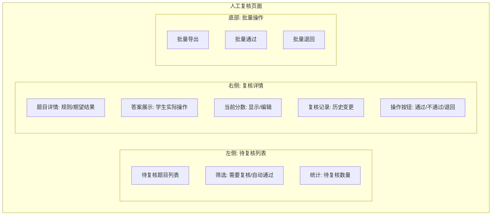

#### 复核决策流程

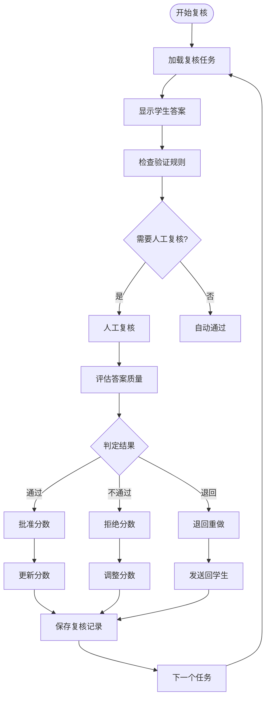

**图表来源**
- [gen_docx.py:452-453](file://gen_docx.py#L452-L453)

**章节来源**
- [gen_docx.py:367-414](file://gen_docx.py#L367-L414)

## 依赖关系分析

### 技术栈依赖

系统采用现代化的技术栈组合：

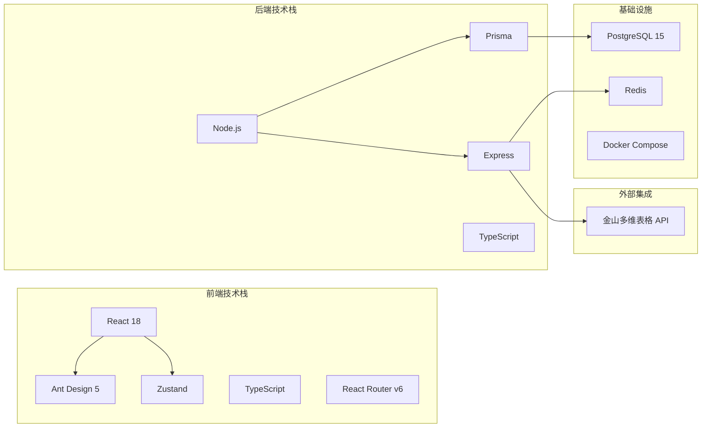

**图表来源**
- [gen_docx.py:173-187](file://gen_docx.py#L173-L187)

### 核心依赖关系

系统的关键依赖关系包括：

1. **验证引擎依赖**：GradingService依赖RuleInterpreter和VerifierDispatcher
2. **数据访问依赖**：所有服务层操作都通过Prisma ORM访问数据库
3. **外部服务依赖**：验证引擎依赖金山多维表格API进行自动化判分
4. **缓存依赖**：Redis用于存储考试状态和判分队列

**章节来源**
- [gen_docx.py:189-240](file://gen_docx.py#L189-L240)

## 性能考虑

### 异步判分队列

系统采用Redis队列实现异步判分，避免同步阻塞：

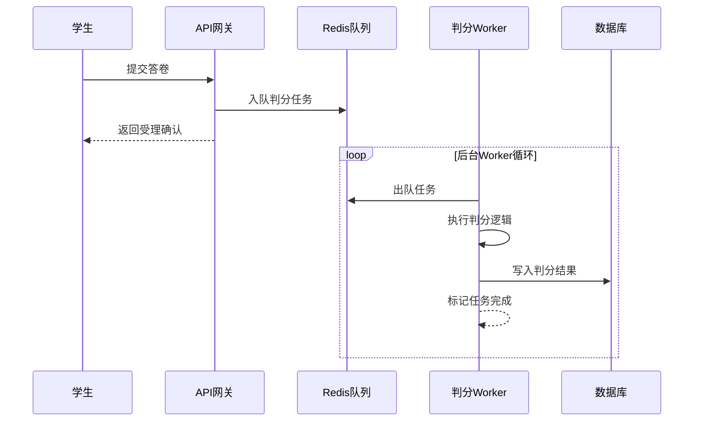

### 缓存策略

系统采用多层缓存策略提升性能：
- **Redis缓存**：存储考试状态、用户会话、判分结果
- **数据库连接池**：优化数据库连接复用
- **静态资源缓存**：前端资源CDN缓存

## 故障排除指南

### 常见问题诊断

1. **判分失败**：检查金山多维表格API连接和认证配置
2. **成绩延迟**：确认Redis队列正常运行和Worker进程状态
3. **页面加载缓慢**：检查数据库查询优化和缓存命中率
4. **人工复核异常**：验证复核权限和状态流转逻辑

### 错误处理机制

系统实现完善的错误处理和恢复机制：
- **重试机制**：对临时性错误进行指数退避重试
- **降级策略**：在外部服务不可用时提供基本功能
- **监控告警**：实时监控系统健康状态和性能指标

**章节来源**
- [gen_docx.py:544-563](file://gen_docx.py#L544-L563)

## 结论

本考试系统通过自动化判分和人工复核相结合的方式，实现了高效准确的成绩管理。系统采用模块化的架构设计，支持灵活的扩展和维护。通过异步处理和缓存优化，确保了良好的用户体验和系统性能。

核心优势包括：
- **自动化程度高**：大部分判分工作可自动完成
- **人工复核灵活**：对复杂场景提供人工审核保障
- **数据可视化丰富**：提供全面的成绩分析和统计功能
- **扩展性强**：支持新的验证规则和判分策略

未来可以进一步优化的方向包括：
- 增强机器学习算法提升判分准确性
- 扩展移动端支持
- 增加更丰富的数据分析功能
- 优化用户体验和界面设计