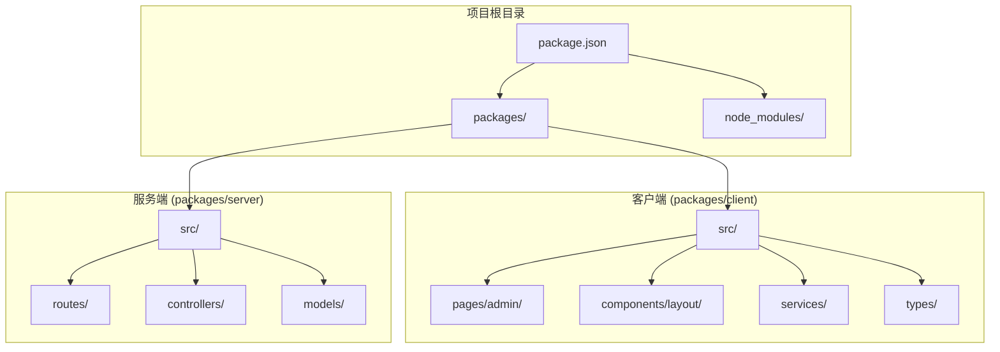
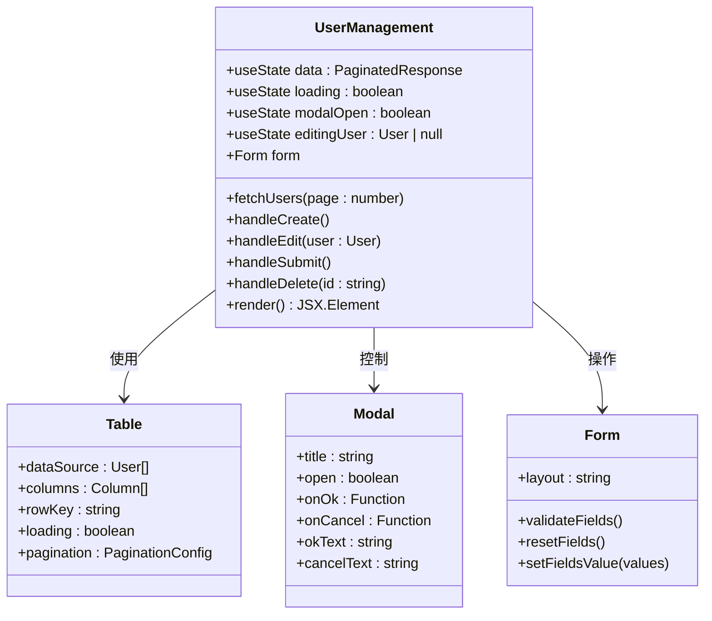
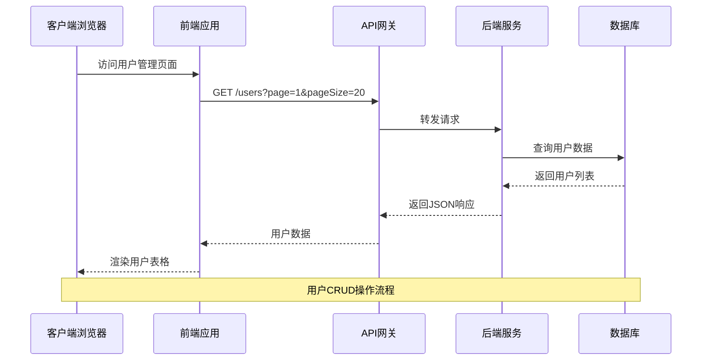
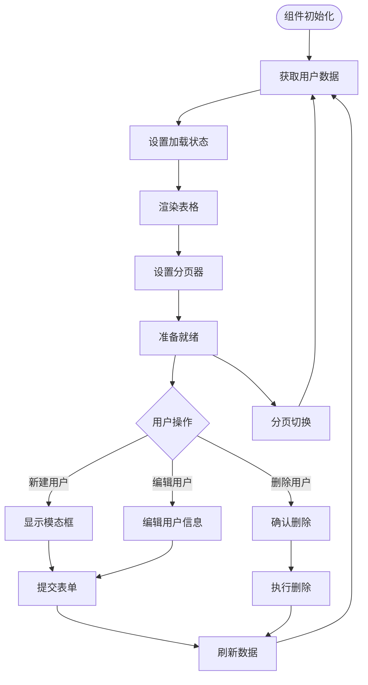
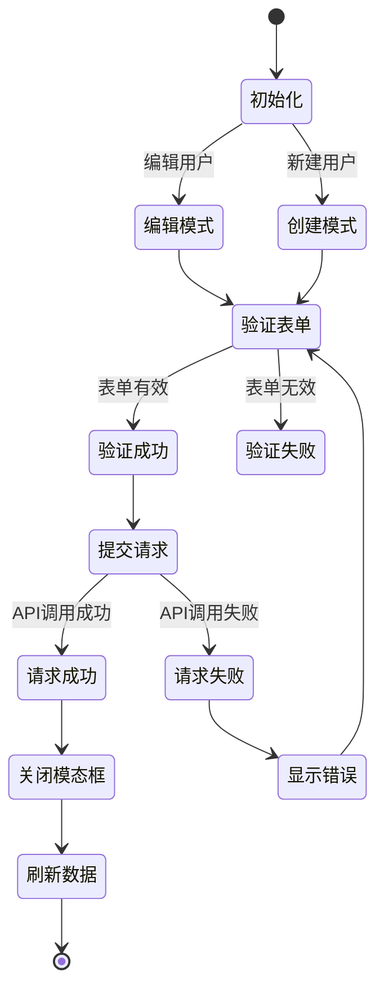
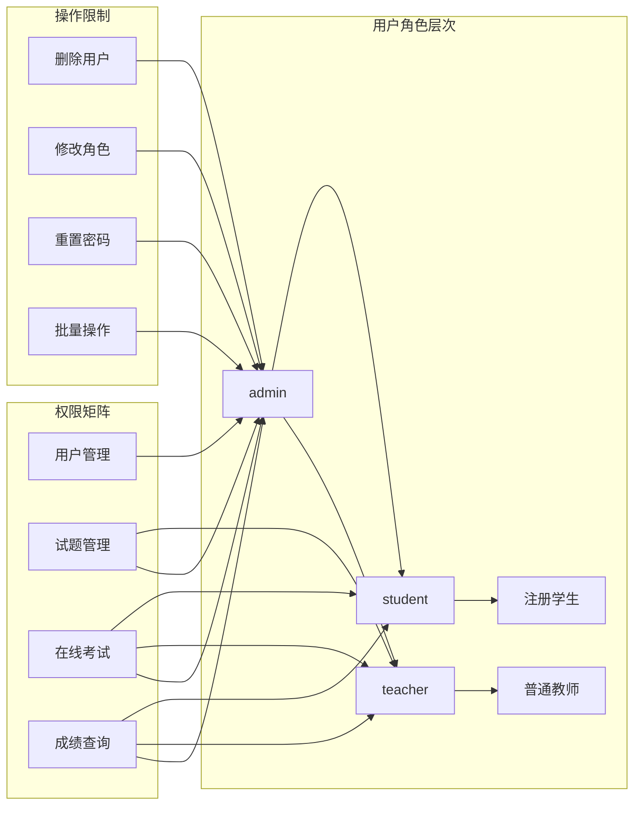
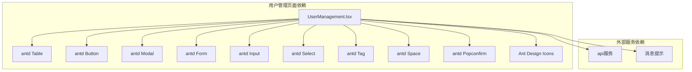
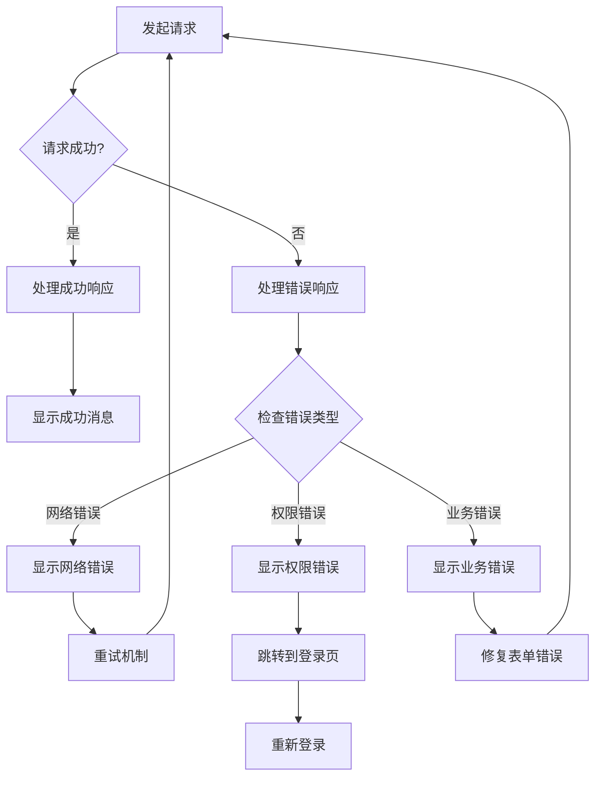

# 用户管理页面

<cite>
**本文档引用的文件**
- [UserManagement.tsx](file://packages/client/src/pages/admin/UserManagement.tsx)
- [AdminLayout.tsx](file://packages/client/src/components/layout/AdminLayout.tsx)
- [users.ts](file://packages/server/src/routes/users.ts)
- [package.json](file://package.json)
</cite>

## 目录
1. [项目概述](#项目概述)
2. [项目结构](#项目结构)
3. [核心组件](#核心组件)
4. [架构概览](#架构概览)
5. [详细组件分析](#详细组件分析)
6. [依赖关系分析](#依赖关系分析)
7. [性能考虑](#性能考虑)
8. [故障排除指南](#故障排除指南)
9. [结论](#结论)

## 项目概述

这是一个基于 React + Ant Design 的考试系统用户管理页面。该系统采用前后端分离架构，前端使用 TypeScript 和 React 构建用户界面，后端使用 Node.js 提供 RESTful API 接口。

用户管理页面提供了完整的用户生命周期管理功能，包括用户列表展示、用户信息编辑、角色分配和权限控制等核心功能。

## 项目结构

项目采用工作空间（Workspaces）组织方式，主要包含以下结构：

**图表来源**
- [package.json:17-20](file://package.json#L17-L20)

**章节来源**
- [package.json:1-26](file://package.json#L1-L26)

## 核心组件

### 用户管理页面组件

用户管理页面是整个系统的核心功能模块，实现了完整的用户管理功能：

**图表来源**
- [UserManagement.tsx:13-128](file://packages/client/src/pages/admin/UserManagement.tsx#L13-L128)

### 角色管理系统

系统支持三种用户角色，每种角色具有不同的权限级别：

| 角色 | 颜色 | 权限描述 | 功能范围 |
|------|------|----------|----------|
| admin | 红色 | 系统管理员 | 完全访问权限，可管理所有用户和系统配置 |
| teacher | 蓝色 | 教师用户 | 可创建和管理试题，查看学生成绩 |
| student | 绿色 | 学生用户 | 只能进行在线考试和查看个人成绩 |

**章节来源**
- [UserManagement.tsx:7-11](file://packages/client/src/pages/admin/UserManagement.tsx#L7-L11)

## 架构概览

系统采用前后端分离的微服务架构，通过 RESTful API 进行通信：

**图表来源**
- [UserManagement.tsx:20-26](file://packages/client/src/pages/admin/UserManagement.tsx#L20-L26)
- [users.ts](file://packages/server/src/routes/users.ts)

## 详细组件分析

### 用户列表组件

用户列表组件实现了完整的数据展示和分页功能：

**图表来源**
- [UserManagement.tsx:13-90](file://packages/client/src/pages/admin/UserManagement.tsx#L13-L90)

#### 表格列定义

用户列表表格包含以下关键列：

| 列名 | 字段名 | 类型 | 描述 | 显示格式 |
|------|--------|------|------|----------|
| 用户名 | username | string | 用户登录标识 | 文本显示 |
| 姓名 | realName | string/null | 用户真实姓名 | 文本或"-"占位符 |
| 邮箱 | email | string/null | 联系邮箱地址 | 文本或"-"占位符 |
| 角色 | role | string | 用户角色标识 | 颜色标签显示 |
| 创建时间 | createdAt | string | 用户创建日期 | 本地化日期格式 |

**章节来源**
- [UserManagement.tsx:65-81](file://packages/client/src/pages/admin/UserManagement.tsx#L65-L81)

### 用户表单组件

用户表单组件支持用户创建和编辑两种模式：

**图表来源**
- [UserManagement.tsx:43-58](file://packages/client/src/pages/admin/UserManagement.tsx#L43-L58)

#### 表单字段验证规则

| 字段名 | 验证规则 | 错误提示 | 必填性 |
|--------|----------|----------|--------|
| username | required, min: 2 | 用户名不能为空且至少2个字符 | 创建时必填 |
| password | required, min: 6 | 密码不能为空且至少6个字符 | 创建时必填 |
| realName | optional | - | 可选 |
| email | type: email | 请输入有效邮箱 | 可选 |
| role | required | 角色不能为空 | 必填 |

**章节来源**
- [UserManagement.tsx:100-124](file://packages/client/src/pages/admin/UserManagement.tsx#L100-L124)

### 权限控制机制

系统通过角色基础的权限控制（RBAC）实现用户权限管理：

**图表来源**
- [UserManagement.tsx:7-11](file://packages/client/src/pages/admin/UserManagement.tsx#L7-L11)

**章节来源**
- [UserManagement.tsx:117-123](file://packages/client/src/pages/admin/UserManagement.tsx#L117-L123)

## 依赖关系分析

### 前端依赖关系

**图表来源**
- [UserManagement.tsx:1-5](file://packages/client/src/pages/admin/UserManagement.tsx#L1-L5)

### 后端API接口设计

系统后端提供标准的RESTful API接口：

| 方法 | 路径 | 功能 | 权限要求 |
|------|------|------|----------|
| GET | /users | 获取用户列表 | admin, teacher |
| GET | /users/:id | 获取用户详情 | admin, teacher |
| POST | /users | 创建新用户 | admin |
| PUT | /users/:id | 更新用户信息 | admin |
| DELETE | /users/:id | 删除用户 | admin |
| GET | /users/search | 搜索用户 | admin, teacher |

**章节来源**
- [users.ts](file://packages/server/src/routes/users.ts)

## 性能考虑

### 前端性能优化

1. **虚拟滚动**: 对于大量用户数据，建议实现虚拟滚动以提升渲染性能
2. **懒加载**: 图标和组件按需加载，减少初始包体积
3. **缓存策略**: 用户列表数据实现智能缓存，避免重复请求
4. **防抖处理**: 搜索和筛选操作添加防抖机制

### 后端性能优化

1. **数据库索引**: 在用户名、邮箱等常用查询字段上建立索引
2. **分页查询**: 实现高效的分页查询，避免全表扫描
3. **连接池**: 使用数据库连接池管理数据库连接
4. **缓存层**: 实现Redis缓存，缓存热点用户数据

## 故障排除指南

### 常见问题及解决方案

| 问题类型 | 症状 | 可能原因 | 解决方案 |
|----------|------|----------|----------|
| 加载失败 | 页面空白或错误提示 | API请求失败 | 检查网络连接和API可用性 |
| 表单验证失败 | 无法提交表单 | 字段验证规则不满足 | 检查输入格式和必填字段 |
| 权限不足 | 无权访问某些功能 | 角色权限不够 | 检查用户角色和权限配置 |
| 数据不同步 | 更新后显示旧数据 | 缓存未刷新 | 手动刷新页面或清除缓存 |

### 错误处理机制

系统实现了完善的错误处理机制：

**图表来源**
- [UserManagement.tsx:43-58](file://packages/client/src/pages/admin/UserManagement.tsx#L43-L58)

**章节来源**
- [UserManagement.tsx:55-57](file://packages/client/src/pages/admin/UserManagement.tsx#L55-L57)

## 结论

用户管理页面是一个功能完整、架构清晰的管理系统模块。它采用了现代化的React技术栈和Ant Design组件库，提供了良好的用户体验和开发体验。

系统的主要优势包括：

1. **完整的功能覆盖**: 支持用户全生命周期管理
2. **清晰的权限控制**: 基于角色的细粒度权限管理
3. **良好的用户体验**: 响应式设计和直观的操作界面
4. **可扩展性强**: 模块化设计便于功能扩展
5. **安全性保障**: 完善的错误处理和权限验证机制

未来可以考虑的功能增强包括：用户导入导出功能、批量操作支持、高级搜索过滤、用户状态管理等。