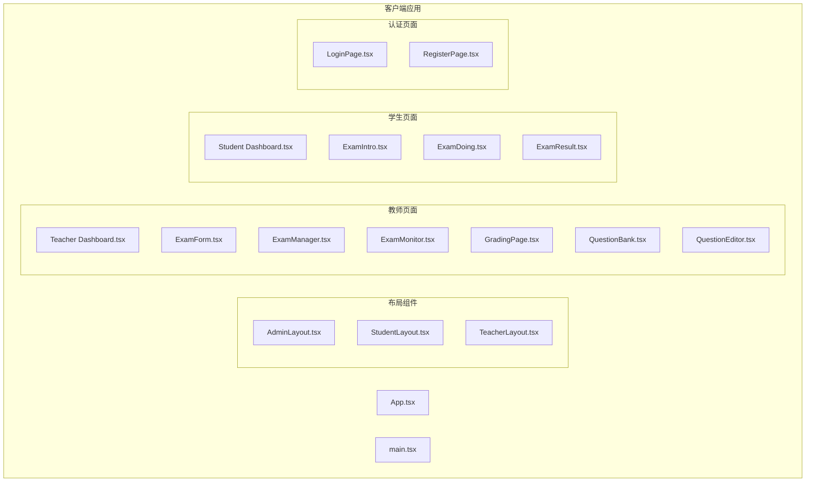
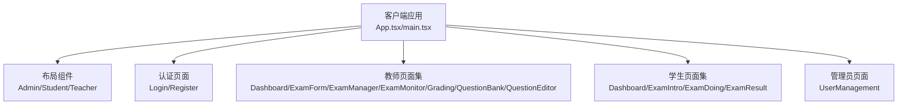
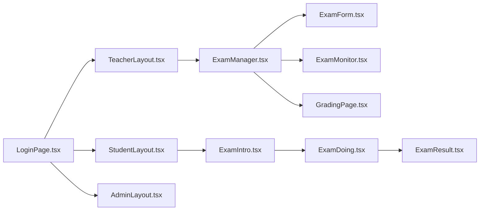

# 考试管理页面

<cite>
**本文档引用的文件**
- [App.tsx](file://packages/client/src/App.tsx)
- [main.tsx](file://packages/client/src/main.tsx)
- [AdminLayout.tsx](file://packages/client/src/components/layout/AdminLayout.tsx)
- [StudentLayout.tsx](file://packages/client/src/components/layout/StudentLayout.tsx)
- [TeacherLayout.tsx](file://packages/client/src/components/layout/TeacherLayout.tsx)
- [UserManagement.tsx](file://packages/client/src/pages/admin/UserManagement.tsx)
- [LoginPage.tsx](file://packages/client/src/pages/auth/LoginPage.tsx)
- [RegisterPage.tsx](file://packages/client/src/pages/auth/RegisterPage.tsx)
- [Dashboard.tsx](file://packages/client/src/pages/student/Dashboard.tsx)
- [ExamDoing.tsx](file://packages/client/src/pages/student/ExamDoing.tsx)
- [ExamIntro.tsx](file://packages/client/src/pages/student/ExamIntro.tsx)
- [ExamResult.tsx](file://packages/client/src/pages/student/ExamResult.tsx)
- [Dashboard.tsx](file://packages/client/src/pages/teacher/Dashboard.tsx)
- [ExamForm.tsx](file://packages/client/src/pages/teacher/ExamForm.tsx)
- [ExamManager.tsx](file://packages/client/src/pages/teacher/ExamManager.tsx)
- [ExamMonitor.tsx](file://packages/client/src/pages/teacher/ExamMonitor.tsx)
- [GradingPage.tsx](file://packages/client/src/pages/teacher/GradingPage.tsx)
- [QuestionBank.tsx](file://packages/client/src/pages/teacher/QuestionBank.tsx)
- [QuestionEditor.tsx](file://packages/client/src/pages/teacher/QuestionEditor.tsx)
</cite>

## 目录
1. [引言](#引言)
2. [项目结构](#项目结构)
3. [核心组件](#核心组件)
4. [架构总览](#架构总览)
5. [详细组件分析](#详细组件分析)
6. [依赖关系分析](#依赖关系分析)
7. [性能考虑](#性能考虑)
8. [故障排除指南](#故障排除指南)
9. [结论](#结论)
10. [附录](#附录)

## 引言
本文件面向“考试管理页面”的实现与使用，围绕以下目标展开：  
- 考试列表、考试表单、考试详情与考试房间页面的功能定位与交互路径  
- 考试创建流程、发布状态管理与实时监控能力  
- 考试时间管理、学生名单管理与考场状态同步的技术要点  
- 考试房间的实时通信、倒计时同步与异常处理策略  

为确保可读性，本文在不直接展示源码的前提下，通过文件路径与行号引用的方式进行溯源，并辅以图示帮助理解。

## 项目结构
前端采用多页面布局与角色化路由组织，核心页面分布如下：  
- 管理员：用户管理  
- 教师：仪表盘、考试管理、考试表单、监考监控、阅卷、题库与题目编辑  
- 学生：仪表盘、考试入口介绍、答题页面、考试结果  

**图表来源**
- [App.tsx](file://packages/client/src/App.tsx)
- [main.tsx](file://packages/client/src/main.tsx)
- [AdminLayout.tsx](file://packages/client/src/components/layout/AdminLayout.tsx)
- [StudentLayout.tsx](file://packages/client/src/components/layout/StudentLayout.tsx)
- [TeacherLayout.tsx](file://packages/client/src/components/layout/TeacherLayout.tsx)
- [Dashboard.tsx](file://packages/client/src/pages/teacher/Dashboard.tsx)
- [ExamForm.tsx](file://packages/client/src/pages/teacher/ExamForm.tsx)
- [ExamManager.tsx](file://packages/client/src/pages/teacher/ExamManager.tsx)
- [ExamMonitor.tsx](file://packages/client/src/pages/teacher/ExamMonitor.tsx)
- [GradingPage.tsx](file://packages/client/src/pages/teacher/GradingPage.tsx)
- [QuestionBank.tsx](file://packages/client/src/pages/teacher/QuestionBank.tsx)
- [QuestionEditor.tsx](file://packages/client/src/pages/teacher/QuestionEditor.tsx)
- [Dashboard.tsx](file://packages/client/src/pages/student/Dashboard.tsx)
- [ExamIntro.tsx](file://packages/client/src/pages/student/ExamIntro.tsx)
- [ExamDoing.tsx](file://packages/client/src/pages/student/ExamDoing.tsx)
- [ExamResult.tsx](file://packages/client/src/pages/student/ExamResult.tsx)
- [LoginPage.tsx](file://packages/client/src/pages/auth/LoginPage.tsx)
- [RegisterPage.tsx](file://packages/client/src/pages/auth/RegisterPage.tsx)

**章节来源**
- [App.tsx](file://packages/client/src/App.tsx)
- [main.tsx](file://packages/client/src/main.tsx)

## 核心组件
- 布局层：AdminLayout、StudentLayout、TeacherLayout 提供角色化导航与权限入口  
- 认证层：LoginPage、RegisterPage 支持登录注册流程  
- 教师端：ExamManager（考试列表）、ExamForm（考试表单）、ExamMonitor（监考监控）  
- 学生端：ExamIntro（考试入口）、ExamDoing（答题房间）、ExamResult（成绩查看）  
- 公共页面：Dashboard（各角色仪表盘）、GradingPage（阅卷）、QuestionBank/QuestionEditor（题库与题目编辑）

**章节来源**
- [AdminLayout.tsx](file://packages/client/src/components/layout/AdminLayout.tsx)
- [StudentLayout.tsx](file://packages/client/src/components/layout/StudentLayout.tsx)
- [TeacherLayout.tsx](file://packages/client/src/components/layout/TeacherLayout.tsx)
- [LoginPage.tsx](file://packages/client/src/pages/auth/LoginPage.tsx)
- [RegisterPage.tsx](file://packages/client/src/pages/auth/RegisterPage.tsx)
- [ExamManager.tsx](file://packages/client/src/pages/teacher/ExamManager.tsx)
- [ExamForm.tsx](file://packages/client/src/pages/teacher/ExamForm.tsx)
- [ExamMonitor.tsx](file://packages/client/src/pages/teacher/ExamMonitor.tsx)
- [Dashboard.tsx](file://packages/client/src/pages/student/Dashboard.tsx)
- [ExamIntro.tsx](file://packages/client/src/pages/student/ExamIntro.tsx)
- [ExamDoing.tsx](file://packages/client/src/pages/student/ExamDoing.tsx)
- [ExamResult.tsx](file://packages/client/src/pages/student/ExamResult.tsx)
- [GradingPage.tsx](file://packages/client/src/pages/teacher/GradingPage.tsx)
- [QuestionBank.tsx](file://packages/client/src/pages/teacher/QuestionBank.tsx)
- [QuestionEditor.tsx](file://packages/client/src/pages/teacher/QuestionEditor.tsx)

## 架构总览
系统采用前端多页面架构，页面按角色划分，通过布局组件统一导航与权限控制。教师侧提供完整的考试生命周期管理（创建、发布、监控、阅卷），学生侧聚焦于考试入口、答题与结果查询。

**图表来源**
- [App.tsx](file://packages/client/src/App.tsx)
- [main.tsx](file://packages/client/src/main.tsx)
- [AdminLayout.tsx](file://packages/client/src/components/layout/AdminLayout.tsx)
- [StudentLayout.tsx](file://packages/client/src/components/layout/StudentLayout.tsx)
- [TeacherLayout.tsx](file://packages/client/src/components/layout/TeacherLayout.tsx)
- [LoginPage.tsx](file://packages/client/src/pages/auth/LoginPage.tsx)
- [RegisterPage.tsx](file://packages/client/src/pages/auth/RegisterPage.tsx)
- [Dashboard.tsx](file://packages/client/src/pages/teacher/Dashboard.tsx)
- [ExamForm.tsx](file://packages/client/src/pages/teacher/ExamForm.tsx)
- [ExamManager.tsx](file://packages/client/src/pages/teacher/ExamManager.tsx)
- [ExamMonitor.tsx](file://packages/client/src/pages/teacher/ExamMonitor.tsx)
- [GradingPage.tsx](file://packages/client/src/pages/teacher/GradingPage.tsx)
- [QuestionBank.tsx](file://packages/client/src/pages/teacher/QuestionBank.tsx)
- [QuestionEditor.tsx](file://packages/client/src/pages/teacher/QuestionEditor.tsx)
- [Dashboard.tsx](file://packages/client/src/pages/student/Dashboard.tsx)
- [ExamIntro.tsx](file://packages/client/src/pages/student/ExamIntro.tsx)
- [ExamDoing.tsx](file://packages/client/src/pages/student/ExamDoing.tsx)
- [ExamResult.tsx](file://packages/client/src/pages/student/ExamResult.tsx)
- [UserManagement.tsx](file://packages/client/src/pages/admin/UserManagement.tsx)

## 详细组件分析

### 考试列表（教师端）
- 页面职责：展示已创建的考试列表，支持筛选、排序与操作入口（编辑、发布、监控、删除等）。  
- 关键交互：进入考试详情、跳转到考试表单进行编辑、进入监考监控页面。  
- 数据来源：通常从后端接口拉取考试元数据（名称、时间、状态、班级/学生数等）。  
- 状态管理：根据发布状态控制可见性与操作按钮可用性。  

**章节来源**
- [ExamManager.tsx](file://packages/client/src/pages/teacher/ExamManager.tsx)

### 考试表单（教师端）
- 页面职责：创建与编辑考试信息，包括基础信息（标题、描述、时间窗口）、题目选择、班级/学生分配、发布设置等。  
- 表单校验：必填字段校验、时间窗口合法性校验、题目数量与分值校验。  
- 发布流程：保存草稿与直接发布两种模式；发布后触发状态变更与通知。  
- 集成点：与题库页面联动选择题目，与班级/学生管理联动绑定参与对象。  

**章节来源**
- [ExamForm.tsx](file://packages/client/src/pages/teacher/ExamForm.tsx)
- [QuestionBank.tsx](file://packages/client/src/pages/teacher/QuestionBank.tsx)
- [QuestionEditor.tsx](file://packages/client/src/pages/teacher/QuestionEditor.tsx)

### 考试详情（教师端）
- 页面职责：展示考试完整信息与统计，包含题目明细、参与学生名单、发布状态、监控入口等。  
- 操作入口：编辑、复制、发布/撤销、进入监考监控。  
- 统计维度：已答题人数、完成率、平均分、最高/最低分等（若后端提供）。  

**章节来源**
- [ExamManager.tsx](file://packages/client/src/pages/teacher/ExamManager.tsx)

### 考试房间（学生端）
- 页面职责：考试入口介绍（规则、倒计时预览）、答题界面（题目切换、提交）、结果查看。  
- 实时通信：与后端建立长连接或轮询，接收状态更新（如开始/结束）、异常提醒、监考指令等。  
- 倒计时同步：基于服务器时间与本地时间差进行补偿，避免客户端时间偏差导致的提前/延迟。  
- 异常处理：断线重连、超时重试、网络错误提示、自动保存答题进度。  

**章节来源**
- [ExamIntro.tsx](file://packages/client/src/pages/student/ExamIntro.tsx)
- [ExamDoing.tsx](file://packages/client/src/pages/student/ExamDoing.tsx)
- [ExamResult.tsx](file://packages/client/src/pages/student/ExamResult.tsx)

### 监考监控（教师端）
- 页面职责：实时查看各考场状态、在线学生数、异常行为预警、强制交卷、查看答题卡等。  
- 数据同步：通过WebSocket或Server-Sent Events推送实时数据，保证多教室并发场景下的低延迟。  
- 考场状态同步：结合考试状态、房间内学生状态与答题进度，动态刷新UI。  
- 异常处理：网络中断自动重连、离线缓存、异常告警与日志上报。  

**章节来源**
- [ExamMonitor.tsx](file://packages/client/src/pages/teacher/ExamMonitor.tsx)

### 阅卷与评分（教师端）
- 页面职责：批改主观题、查看学生作答、录入分数、生成报表。  
- 集成点：与考试房间页面共享题目与答案解析，支持快速比对与标注。  

**章节来源**
- [GradingPage.tsx](file://packages/client/src/pages/teacher/GradingPage.tsx)

### 题库与题目编辑（教师端）
- 页面职责：维护题目资源，支持增删改查、分类标签、难度等级、知识点关联等。  
- 集成点：被考试表单引用，用于选择题目构建试卷。  

**章节来源**
- [QuestionBank.tsx](file://packages/client/src/pages/teacher/QuestionBank.tsx)
- [QuestionEditor.tsx](file://packages/client/src/pages/teacher/QuestionEditor.tsx)

### 学生仪表盘（学生端）
- 页面职责：展示个人待考、在考、已完成的考试列表，提供入口跳转与状态提示。  
- 集成点：与考试房间页面联动，确保状态一致（如开始后不可再编辑）。  

**章节来源**
- [Dashboard.tsx](file://packages/client/src/pages/student/Dashboard.tsx)

### 教师仪表盘（教师端）
- 页面职责：汇总所管课程与考试概览，快捷入口至管理、监控与阅卷。  
- 集成点：与ExamManager、ExamMonitor、GradingPage形成工作流闭环。  

**章节来源**
- [Dashboard.tsx](file://packages/client/src/pages/teacher/Dashboard.tsx)

### 管理员与用户管理（管理员端）
- 页面职责：用户账号管理、角色分配、批量导入导出、审计日志查看。  
- 集成点：为教师与学生提供基础身份与权限保障。  

**章节来源**
- [UserManagement.tsx](file://packages/client/src/pages/admin/UserManagement.tsx)

## 依赖关系分析
- 角色化路由：通过布局组件与页面集合实现清晰的职责分离  
- 页面间依赖：教师端以ExamManager为核心枢纽，连接ExamForm、ExamMonitor、GradingPage；学生端以ExamIntro为入口，连接ExamDoing与ExamResult  
- 外部集成：认证模块（Login/Register）为所有角色提供登录入口；监考与答题页面依赖实时通信服务  

**图表来源**
- [LoginPage.tsx](file://packages/client/src/pages/auth/LoginPage.tsx)
- [TeacherLayout.tsx](file://packages/client/src/components/layout/TeacherLayout.tsx)
- [StudentLayout.tsx](file://packages/client/src/components/layout/StudentLayout.tsx)
- [AdminLayout.tsx](file://packages/client/src/components/layout/AdminLayout.tsx)
- [ExamManager.tsx](file://packages/client/src/pages/teacher/ExamManager.tsx)
- [ExamForm.tsx](file://packages/client/src/pages/teacher/ExamForm.tsx)
- [ExamMonitor.tsx](file://packages/client/src/pages/teacher/ExamMonitor.tsx)
- [GradingPage.tsx](file://packages/client/src/pages/teacher/GradingPage.tsx)
- [ExamIntro.tsx](file://packages/client/src/pages/student/ExamIntro.tsx)
- [ExamDoing.tsx](file://packages/client/src/pages/student/ExamDoing.tsx)
- [ExamResult.tsx](file://packages/client/src/pages/student/ExamResult.tsx)

## 性能考虑
- 列表渲染优化：对考试列表与学生名单采用虚拟滚动与分页加载，降低首屏压力  
- 图标与静态资源：使用矢量图标与CDN加速，减少包体与加载时间  
- 缓存策略：对只读数据（如题库、用户信息）启用浏览器缓存与服务端ETag  
- 实时通信：采用连接池与心跳保活，避免频繁重建连接造成抖动  
- 错误边界：在关键页面增加错误边界组件，捕获未知异常并引导用户重试或反馈  

## 故障排除指南
- 登录失败：检查认证接口返回与本地存储状态，确认网络连通与CORS配置  
- 考试无法开始：核对时间窗口、发布状态与客户端时间差，必要时手动同步系统时间  
- 监考无数据：检查WebSocket连接状态、后端推送队列与房间分配逻辑  
- 答题异常：验证断线重连机制、自动保存策略与超时重试参数  
- 权限不足：确认角色与路由守卫是否正确匹配，检查后端授权策略  

## 结论
该考试管理页面以角色化与流程化为核心设计思路，覆盖从创建、发布、监控到阅卷与结果的全链路需求。通过清晰的页面分工与实时通信能力，能够有效支撑大规模并发场景下的稳定运行。建议后续在以下方面持续优化：  
- 完善状态机定义与可视化调试工具  
- 加强异常场景的自动化恢复与审计日志  
- 丰富移动端适配与无障碍访问支持  

## 附录
- 路由与页面映射可参考主应用入口与布局组件的组织方式  
- 若需进一步了解具体实现细节，请参阅对应页面文件的源码路径引用