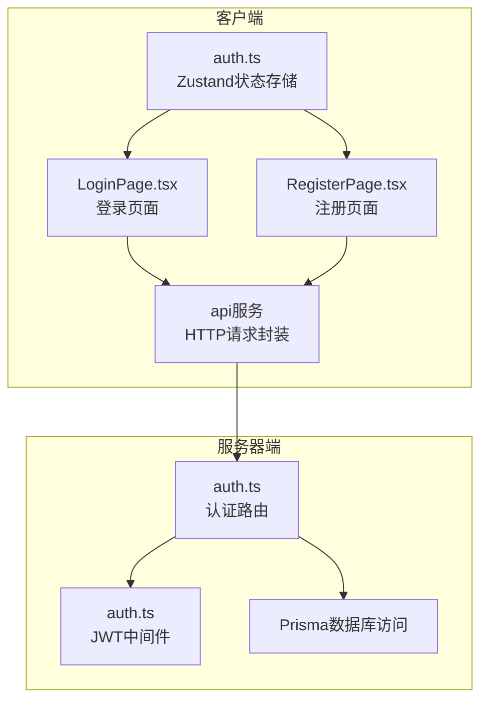
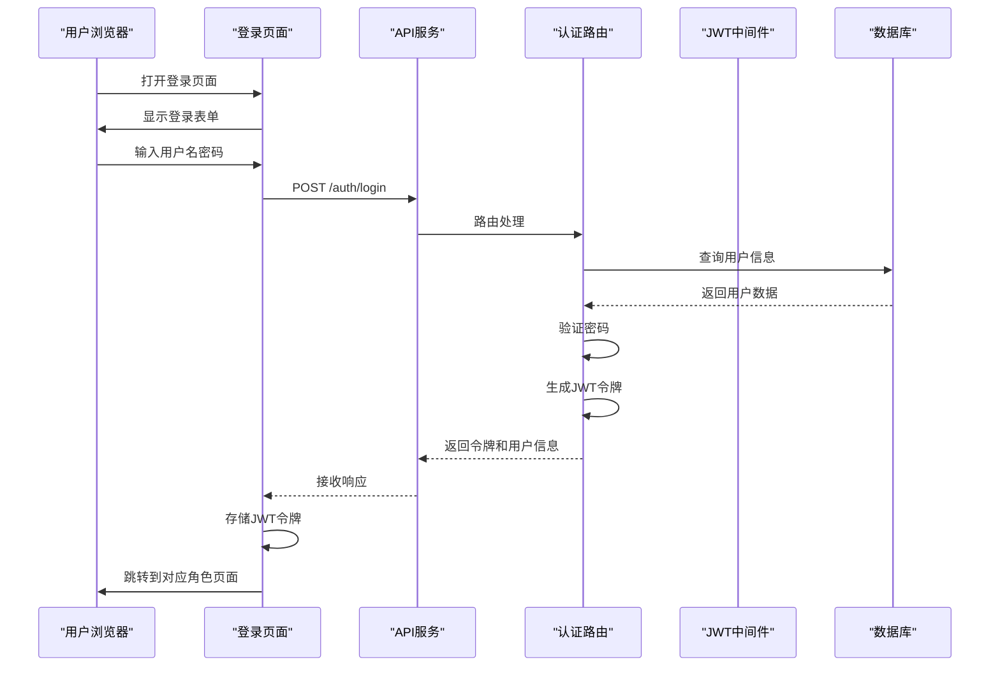
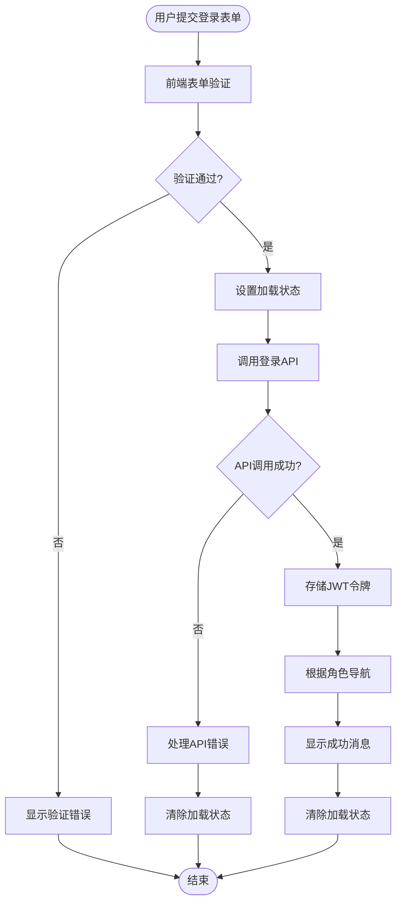
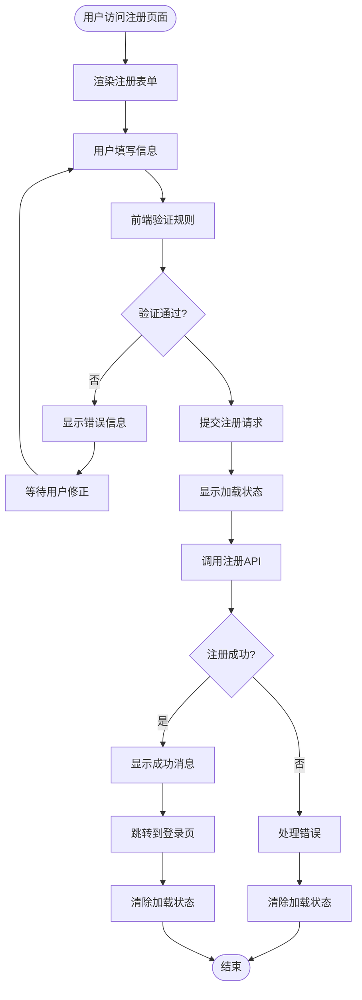
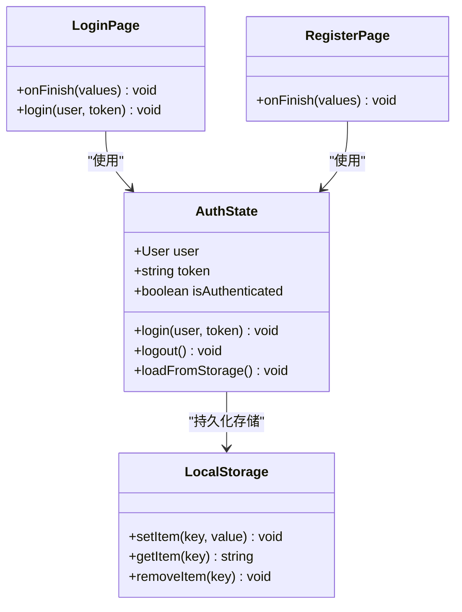
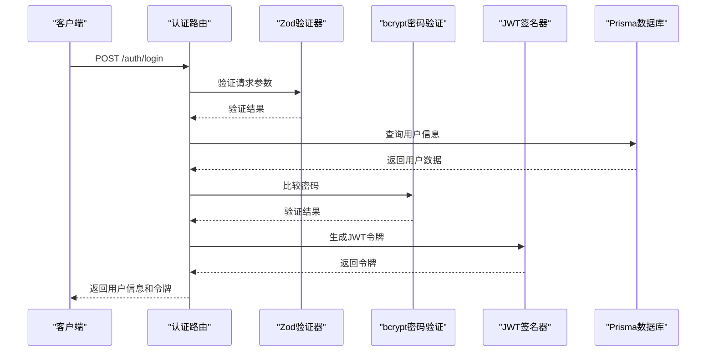
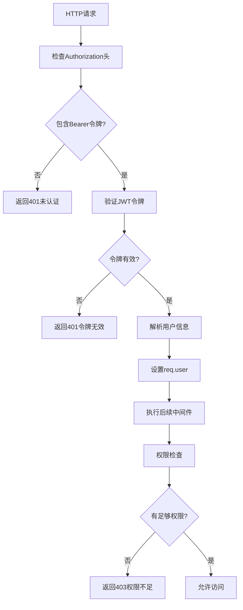
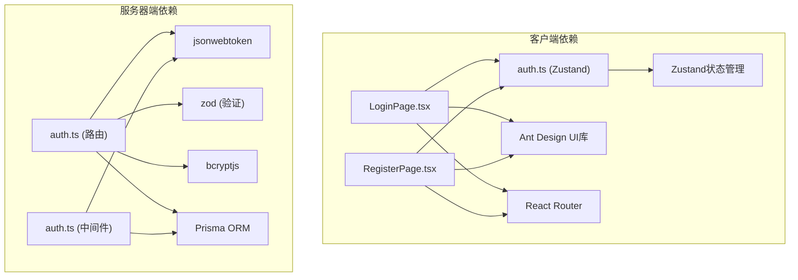

# 认证页面

<cite>
**本文档引用的文件**
- [packages/client/src/pages/auth/LoginPage.tsx](file://packages/client/src/pages/auth/LoginPage.tsx)
- [packages/client/src/pages/auth/RegisterPage.tsx](file://packages/client/src/pages/auth/RegisterPage.tsx)
- [packages/client/src/stores/auth.ts](file://packages/client/src/stores/auth.ts)
- [packages/server/src/routes/auth.ts](file://packages/server/src/routes/auth.ts)
- [packages/server/src/middleware/auth.ts](file://packages/server/src/middleware/auth.ts)
</cite>

## 目录
1. [简介](#简介)
2. [项目结构](#项目结构)
3. [核心组件](#核心组件)
4. [架构概览](#架构概览)
5. [详细组件分析](#详细组件分析)
6. [依赖关系分析](#依赖关系分析)
7. [性能考虑](#性能考虑)
8. [故障排除指南](#故障排除指南)
9. [结论](#结论)

## 简介
本文件详细说明考试系统的认证页面实现，包括登录、注册页面的前端实现以及后端认证服务。文档覆盖表单验证、用户输入处理、认证流程、JWT令牌管理、会话状态维护和路由守卫机制，并提供错误处理、加载状态显示和安全最佳实践指导。

## 项目结构
认证相关代码主要分布在客户端和服务器端两个包中：
- 客户端：包含登录页、注册页和全局认证状态存储
- 服务器端：包含认证路由、JWT中间件和授权中间件

**图表来源**
- [packages/client/src/pages/auth/LoginPage.tsx:1-73](file://packages/client/src/pages/auth/LoginPage.tsx#L1-L73)
- [packages/client/src/pages/auth/RegisterPage.tsx:1-70](file://packages/client/src/pages/auth/RegisterPage.tsx#L1-L70)
- [packages/client/src/stores/auth.ts:1-44](file://packages/client/src/stores/auth.ts#L1-L44)
- [packages/server/src/routes/auth.ts:1-153](file://packages/server/src/routes/auth.ts#L1-L153)
- [packages/server/src/middleware/auth.ts:1-46](file://packages/server/src/middleware/auth.ts#L1-L46)

**章节来源**
- [packages/client/src/pages/auth/LoginPage.tsx:1-73](file://packages/client/src/pages/auth/LoginPage.tsx#L1-L73)
- [packages/client/src/pages/auth/RegisterPage.tsx:1-70](file://packages/client/src/pages/auth/RegisterPage.tsx#L1-L70)
- [packages/client/src/stores/auth.ts:1-44](file://packages/client/src/stores/auth.ts#L1-L44)
- [packages/server/src/routes/auth.ts:1-153](file://packages/server/src/routes/auth.ts#L1-L153)
- [packages/server/src/middleware/auth.ts:1-46](file://packages/server/src/middleware/auth.ts#L1-L46)

## 核心组件
本认证系统由以下核心组件构成：

### 前端组件
- **登录页面**：处理用户名密码登录，进行表单验证，调用API并管理JWT令牌
- **注册页面**：处理用户注册，包含角色选择，提交后跳转到登录页
- **认证状态存储**：使用Zustand管理用户登录状态、JWT令牌和持久化存储

### 后端组件
- **认证路由**：提供登录、注册、获取当前用户信息、刷新令牌接口
- **JWT中间件**：验证JWT令牌的有效性并解析用户信息
- **授权中间件**：基于用户角色进行权限控制

**章节来源**
- [packages/client/src/pages/auth/LoginPage.tsx:11-33](file://packages/client/src/pages/auth/LoginPage.tsx#L11-L33)
- [packages/client/src/pages/auth/RegisterPage.tsx:9-24](file://packages/client/src/pages/auth/RegisterPage.tsx#L9-L24)
- [packages/client/src/stores/auth.ts:4-11](file://packages/client/src/stores/auth.ts#L4-L11)
- [packages/server/src/routes/auth.ts:24-102](file://packages/server/src/routes/auth.ts#L24-L102)
- [packages/server/src/middleware/auth.ts:19-45](file://packages/server/src/middleware/auth.ts#L19-L45)

## 架构概览
认证系统采用前后端分离架构，通过RESTful API进行通信，使用JWT进行无状态认证。

**图表来源**
- [packages/client/src/pages/auth/LoginPage.tsx:16-33](file://packages/client/src/pages/auth/LoginPage.tsx#L16-L33)
- [packages/server/src/routes/auth.ts:24-66](file://packages/server/src/routes/auth.ts#L24-L66)

## 详细组件分析

### 登录页面实现
登录页面负责用户身份验证，包含完整的前端表单验证和错误处理机制。

**图表来源**
- [packages/client/src/pages/auth/LoginPage.tsx:16-33](file://packages/client/src/pages/auth/LoginPage.tsx#L16-L33)

#### 表单验证机制
- 用户名：必填字段，提供中文错误提示
- 密码：必填字段，支持密码强度验证
- 使用Ant Design的Form组件进行实时验证

#### 用户输入处理
- 异步表单提交，防止重复提交
- 加载状态管理，提升用户体验
- 成功后的自动重定向逻辑

**章节来源**
- [packages/client/src/pages/auth/LoginPage.tsx:16-33](file://packages/client/src/pages/auth/LoginPage.tsx#L16-L33)
- [packages/client/src/pages/auth/LoginPage.tsx:45-56](file://packages/client/src/pages/auth/LoginPage.tsx#L45-L56)

### 注册页面实现
注册页面提供用户账户创建功能，包含角色选择和基础信息收集。

**图表来源**
- [packages/client/src/pages/auth/RegisterPage.tsx:13-24](file://packages/client/src/pages/auth/RegisterPage.tsx#L13-L24)

#### 注册表单字段
- 用户名：2-64字符，唯一性要求
- 真实姓名：必填字段
- 邮箱：可选的邮箱格式验证
- 密码：至少6字符
- 角色：下拉选择（学生/教师）

#### 错误处理策略
- 使用中文错误提示，提升本地化体验
- 统一的错误消息显示机制
- 失败后的状态清理

**章节来源**
- [packages/client/src/pages/auth/RegisterPage.tsx:13-24](file://packages/client/src/pages/auth/RegisterPage.tsx#L13-L24)
- [packages/client/src/pages/auth/RegisterPage.tsx:36-60](file://packages/client/src/pages/auth/RegisterPage.tsx#L36-L60)

### JWT令牌管理
认证状态存储使用Zustand进行集中管理，提供完整的令牌生命周期管理。

**图表来源**
- [packages/client/src/stores/auth.ts:4-11](file://packages/client/src/stores/auth.ts#L4-L11)
- [packages/client/src/stores/auth.ts:18-28](file://packages/client/src/stores/auth.ts#L18-L28)

#### 令牌存储策略
- 使用localStorage持久化存储JWT令牌
- 自动从存储中恢复认证状态
- 提供安全的令牌移除机制

#### 状态同步机制
- 全局状态管理，确保组件间状态一致
- 自动化的状态恢复流程
- 类型安全的用户数据结构

**章节来源**
- [packages/client/src/stores/auth.ts:18-28](file://packages/client/src/stores/auth.ts#L18-L28)
- [packages/client/src/stores/auth.ts:30-42](file://packages/client/src/stores/auth.ts#L30-L42)

### 后端认证服务
服务器端提供完整的认证服务，包括用户验证、令牌签发和权限控制。

**图表来源**
- [packages/server/src/routes/auth.ts:24-66](file://packages/server/src/routes/auth.ts#L24-L66)

#### 登录认证流程
- 参数验证：使用Zod进行严格的输入验证
- 用户查询：从数据库获取用户信息
- 密码验证：使用bcrypt进行安全比较
- 令牌签发：生成JWT令牌并设置过期时间

#### 注册处理流程
- 数据验证：确保用户名唯一性和数据完整性
- 密码加密：使用bcrypt进行哈希处理
- 用户创建：在数据库中创建新用户记录

**章节来源**
- [packages/server/src/routes/auth.ts:24-66](file://packages/server/src/routes/auth.ts#L24-L66)
- [packages/server/src/routes/auth.ts:68-102](file://packages/server/src/routes/auth.ts#L68-L102)

### JWT中间件和路由守卫
服务器端实现了完整的JWT验证和授权机制。

**图表来源**
- [packages/server/src/middleware/auth.ts:19-45](file://packages/server/src/middleware/auth.ts#L19-L45)

#### 中间件功能
- **authenticate中间件**：验证JWT令牌的完整性和有效性
- **authorize中间件**：基于用户角色进行权限控制
- **类型安全**：为Express请求对象添加JWT负载类型定义

#### 安全特性
- Bearer令牌格式验证
- JWT签名验证
- 过期时间检查
- 角色权限控制

**章节来源**
- [packages/server/src/middleware/auth.ts:19-45](file://packages/server/src/middleware/auth.ts#L19-L45)

## 依赖关系分析
认证系统的依赖关系清晰，遵循分层架构原则。

**图表来源**
- [packages/client/src/pages/auth/LoginPage.tsx:1-8](file://packages/client/src/pages/auth/LoginPage.tsx#L1-L8)
- [packages/client/src/pages/auth/RegisterPage.tsx:1-6](file://packages/client/src/pages/auth/RegisterPage.tsx#L1-L6)
- [packages/client/src/stores/auth.ts:1](file://packages/client/src/stores/auth.ts#L1)
- [packages/server/src/routes/auth.ts:1-7](file://packages/server/src/routes/auth.ts#L1-L7)
- [packages/server/src/middleware/auth.ts:1-3](file://packages/server/src/middleware/auth.ts#L1-L3)

**章节来源**
- [packages/client/src/pages/auth/LoginPage.tsx:1-8](file://packages/client/src/pages/auth/LoginPage.tsx#L1-L8)
- [packages/client/src/pages/auth/RegisterPage.tsx:1-6](file://packages/client/src/pages/auth/RegisterPage.tsx#L1-L6)
- [packages/client/src/stores/auth.ts:1](file://packages/client/src/stores/auth.ts#L1)
- [packages/server/src/routes/auth.ts:1-7](file://packages/server/src/routes/auth.ts#L1-L7)
- [packages/server/src/middleware/auth.ts:1-3](file://packages/server/src/middleware/auth.ts#L1-L3)

## 性能考虑
- **前端性能优化**：使用受控组件和表单验证减少不必要的重渲染
- **网络请求优化**：避免重复提交，合理使用加载状态
- **内存管理**：及时清理localStorage中的过期令牌
- **数据库查询优化**：使用索引和适当的查询条件

## 故障排除指南

### 常见登录问题
1. **用户名或密码错误**
   - 检查用户输入是否符合最小长度要求
   - 确认用户是否存在且密码正确

2. **令牌过期或无效**
   - 实现令牌刷新机制
   - 检查JWT配置和过期时间设置

3. **路由跳转异常**
   - 验证用户角色映射关系
   - 检查路由守卫配置

### 常见注册问题
1. **用户名冲突**
   - 在提交前进行用户名可用性检查
   - 提供实时反馈机制

2. **密码安全性**
   - 实施密码强度验证
   - 提供密码复杂度指导

### 服务器端问题
1. **JWT验证失败**
   - 检查密钥配置和环境变量
   - 验证令牌格式和签名

2. **数据库连接问题**
   - 确认Prisma配置正确
   - 检查数据库连接池设置

**章节来源**
- [packages/server/src/routes/auth.ts:30-37](file://packages/server/src/routes/auth.ts#L30-L37)
- [packages/server/src/middleware/auth.ts:20-32](file://packages/server/src/middleware/auth.ts#L20-L32)

## 结论
该认证系统实现了完整的用户身份验证流程，具有以下特点：
- 前后端分离架构，职责清晰
- 使用JWT实现无状态认证
- 完善的表单验证和错误处理
- 基于角色的权限控制系统
- 良好的用户体验和安全性

建议在生产环境中进一步增强安全措施，如实施密码策略、添加防暴力破解机制和定期审计日志。