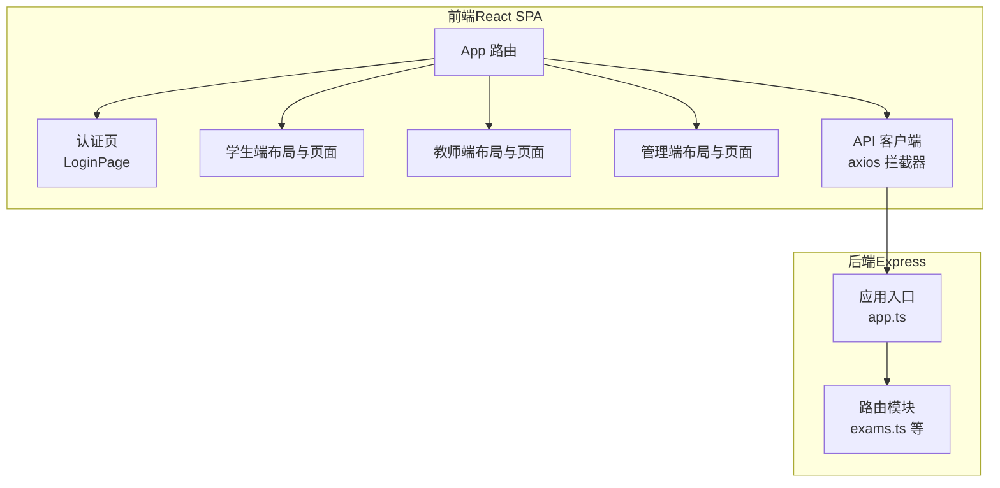
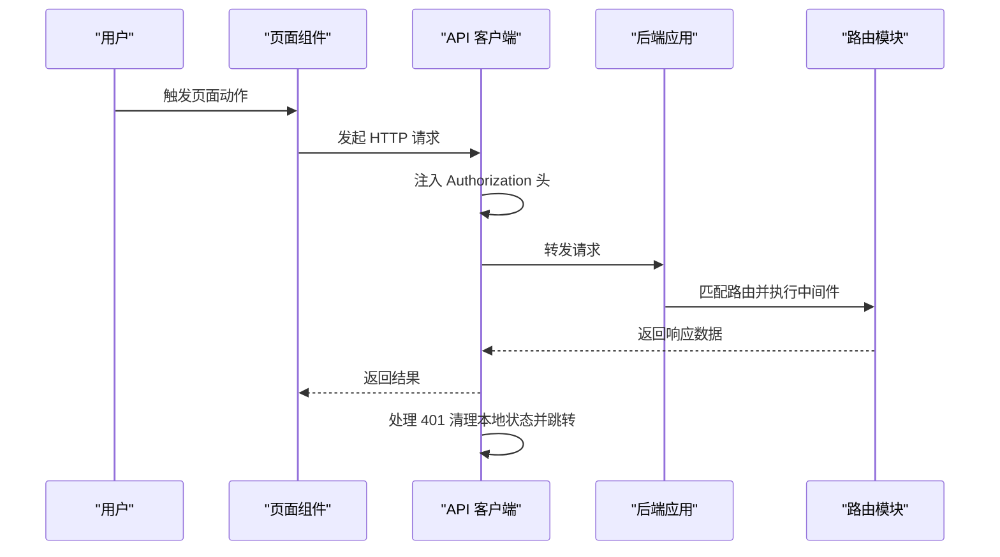
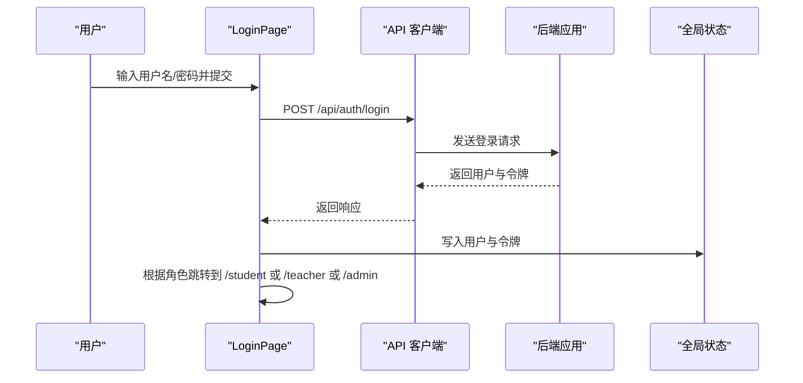
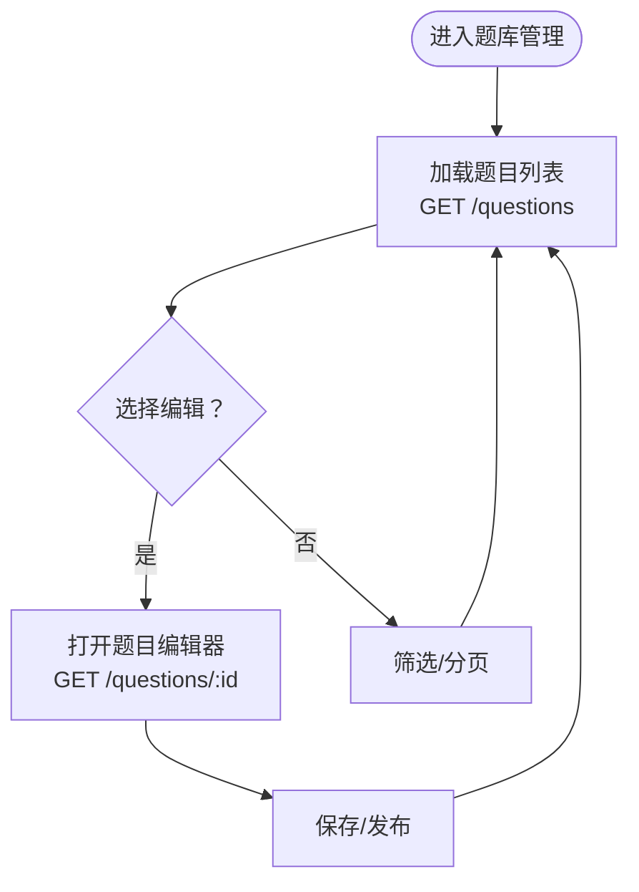
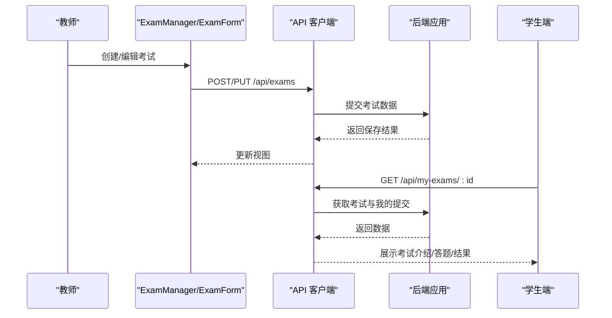
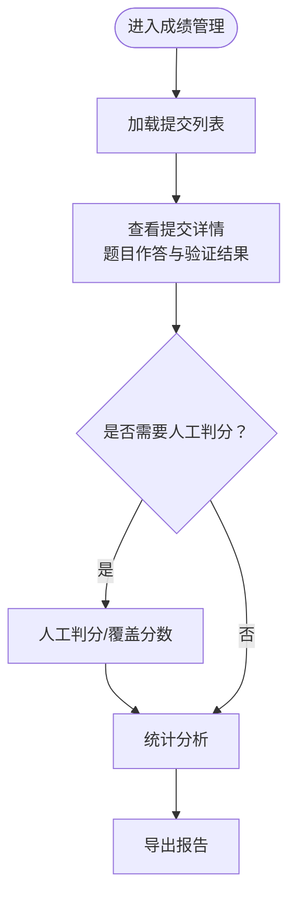
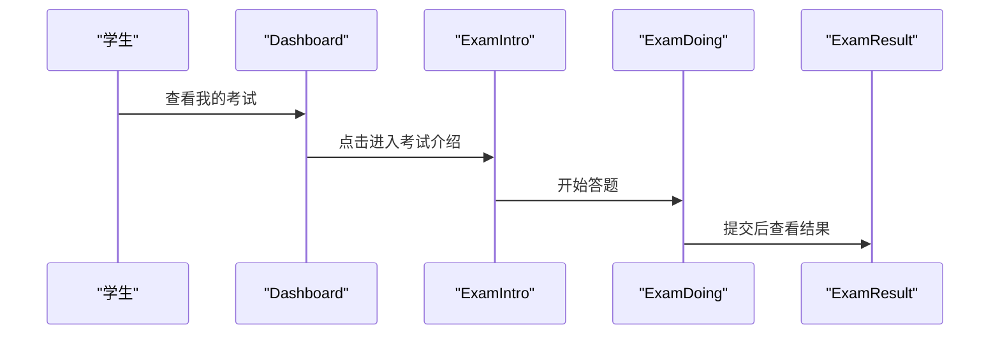
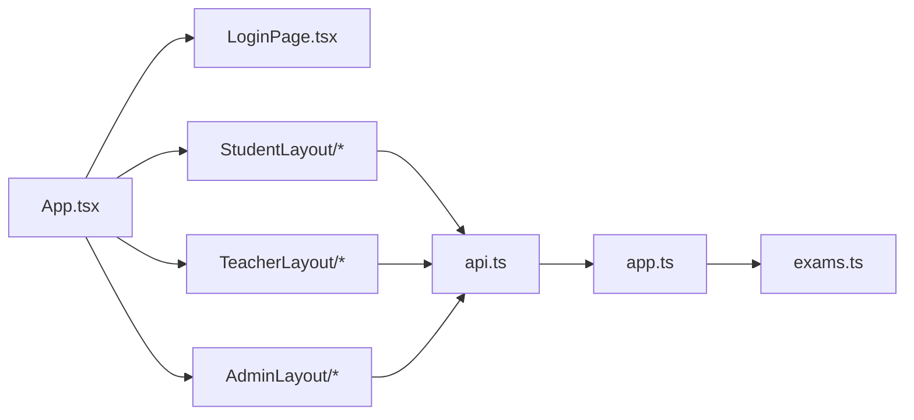

# 页面组件

<cite>
**本文引用的文件**
- [package.json](file://package.json)
- [gen_docx.py](file://gen_docx.py)
- [App.tsx](file://packages/client/src/App.tsx)
- [LoginPage.tsx](file://packages/client/src/pages/auth/LoginPage.tsx)
- [StudentLayout.tsx](file://packages/client/src/components/layout/StudentLayout.tsx)
- [StudentDashboard.tsx](file://packages/client/src/pages/student/Dashboard.tsx)
- [ExamIntro.tsx](file://packages/client/src/pages/student/ExamIntro.tsx)
- [ExamDoing.tsx](file://packages/client/src/pages/student/ExamDoing.tsx)
- [ExamResult.tsx](file://packages/client/src/pages/student/ExamResult.tsx)
- [TeacherLayout.tsx](file://packages/client/src/components/layout/TeacherLayout.tsx)
- [QuestionBank.tsx](file://packages/client/src/pages/teacher/QuestionBank.tsx)
- [QuestionEditor.tsx](file://packages/client/src/pages/teacher/QuestionEditor.tsx)
- [ExamManager.tsx](file://packages/client/src/pages/teacher/ExamManager.tsx)
- [ExamForm.tsx](file://packages/client/src/pages/teacher/ExamForm.tsx)
- [ExamMonitor.tsx](file://packages/client/src/pages/teacher/ExamMonitor.tsx)
- [GradingPage.tsx](file://packages/client/src/pages/teacher/GradingPage.tsx)
- [StatisticsPage.tsx](file://packages/client/src/pages/teacher/StatisticsPage.tsx)
- [UserManagement.tsx](file://packages/client/src/pages/admin/UserManagement.tsx)
- [api.ts](file://packages/client/src/services/api.ts)
- [index.ts](file://packages/client/src/types/index.ts)
- [app.ts](file://packages/server/src/app.ts)
- [exams.ts](file://packages/server/src/routes/exams.ts)
</cite>

## 目录
1. [引言](#引言)
2. [项目结构](#项目结构)
3. [核心组件](#核心组件)
4. [架构总览](#架构总览)
5. [详细组件分析](#详细组件分析)
6. [依赖分析](#依赖分析)
7. [性能考虑](#性能考虑)
8. [故障排查指南](#故障排查指南)
9. [结论](#结论)
10. [附录](#附录)

## 引言
本文件面向“页面组件”的综合文档，聚焦于用户认证、题库管理、考试与成绩管理等关键功能页面的实现与组织方式。文档从页面级状态管理、数据获取模式、用户交互逻辑入手，结合前端路由与后端接口，给出可落地的开发规范、性能优化与用户体验最佳实践，帮助开发者快速理解与扩展系统。

## 项目结构
系统采用前后端分离的 Monorepo 架构：
- 前端（React SPA）：通过 Vite 构建，使用 React Router 进行页面路由，Ant Design 提供 UI 组件，Axios 封装 API 请求，Zustand 管理全局状态。
- 后端（Node.js + Express）：提供 REST 接口，统一在应用入口注册路由模块，包含认证、用户、题库、考试、判分、统计等模块。

图表来源
- [App.tsx:38-95](file://packages/client/src/App.tsx#L38-L95)
- [api.ts:1-32](file://packages/client/src/services/api.ts#L1-L32)
- [app.ts:15-43](file://packages/server/src/app.ts#L15-L43)
- [exams.ts:1-38](file://packages/server/src/routes/exams.ts#L1-L38)

章节来源
- [package.json:1-25](file://package.json#L1-L25)
- [gen_docx.py:144-156](file://gen_docx.py#L144-L156)

## 核心组件
- 页面级路由与权限控制：通过 App 中的路由与私有路由包装器实现角色校验与重定向。
- 认证页面：登录页负责凭据提交、令牌存储与跳转；API 客户端统一注入 Authorization 头并处理 401。
- 学生端页面：仪表盘、考试介绍、答题、结果页串联完整流程。
- 教师端页面：题库、题型编辑器、考试管理与表单、监控、判分、统计。
- 管理端页面：用户管理。
- 类型定义：统一的实体类型与分页响应模型，保障前后端契约一致。

章节来源
- [App.tsx:24-36](file://packages/client/src/App.tsx#L24-L36)
- [LoginPage.tsx:11-33](file://packages/client/src/pages/auth/LoginPage.tsx#L11-L33)
- [StudentLayout.tsx:15-34](file://packages/client/src/components/layout/StudentLayout.tsx#L15-L34)
- [TeacherLayout.tsx](file://packages/client/src/components/layout/TeacherLayout.tsx)
- [UserManagement.tsx](file://packages/client/src/pages/admin/UserManagement.tsx)
- [api.ts:1-32](file://packages/client/src/services/api.ts#L1-L32)
- [index.ts:61-145](file://packages/client/src/types/index.ts#L61-L145)

## 架构总览
页面组件与后端接口的交互遵循“页面发起请求 → API 客户端拦截 → Express 路由 → 数据访问层”的链路。认证采用 JWT，API 客户端在请求头附加令牌并在 401 时自动清理本地状态并跳转登录页。

图表来源
- [api.ts:8-30](file://packages/client/src/services/api.ts#L8-L30)
- [app.ts:27-37](file://packages/server/src/app.ts#L27-L37)
- [exams.ts:29-38](file://packages/server/src/routes/exams.ts#L29-L38)

## 详细组件分析

### 认证页面
- 登录页负责表单校验、提交凭据、接收用户信息与令牌，并根据角色跳转至对应布局。
- API 客户端在请求前注入 Authorization 头，响应拦截器处理 401 自动登出与跳转。

图表来源
- [LoginPage.tsx:16-33](file://packages/client/src/pages/auth/LoginPage.tsx#L16-L33)
- [api.ts:8-15](file://packages/client/src/services/api.ts#L8-L15)
- [App.tsx:24-36](file://packages/client/src/App.tsx#L24-L36)

章节来源
- [LoginPage.tsx:11-33](file://packages/client/src/pages/auth/LoginPage.tsx#L11-L33)
- [api.ts:1-32](file://packages/client/src/services/api.ts#L1-L32)
- [App.tsx:24-36](file://packages/client/src/App.tsx#L24-L36)

### 题库管理页面
- 题库列表：筛选、分页、批量操作。
- 题目编辑器：基础信息、规则构建器、预览。
- 与后端交互：GET/POST/PUT/DELETE 对应题目的增删改查与状态变更。

图表来源
- [QuestionBank.tsx](file://packages/client/src/pages/teacher/QuestionBank.tsx)
- [QuestionEditor.tsx](file://packages/client/src/pages/teacher/QuestionEditor.tsx)

章节来源
- [QuestionBank.tsx](file://packages/client/src/pages/teacher/QuestionBank.tsx)
- [QuestionEditor.tsx](file://packages/client/src/pages/teacher/QuestionEditor.tsx)

### 考试页面
- 考试管理：创建、编辑、删除、发布、监控、统计、判分。
- 考试表单：基本信息、选题、设置。
- 考试流程：教师端创建 → 学生端查看介绍 → 开始答题 → 提交 → 判分 → 查看结果。

图表来源
- [ExamManager.tsx:17-35](file://packages/client/src/pages/teacher/ExamManager.tsx#L17-L35)
- [ExamForm.tsx:10-106](file://packages/client/src/pages/teacher/ExamForm.tsx#L10-L106)
- [exams.ts:29-38](file://packages/server/src/routes/exams.ts#L29-L38)

章节来源
- [ExamManager.tsx:17-35](file://packages/client/src/pages/teacher/ExamManager.tsx#L17-L35)
- [ExamForm.tsx:10-106](file://packages/client/src/pages/teacher/ExamForm.tsx#L10-L106)
- [exams.ts:1-38](file://packages/server/src/routes/exams.ts#L1-L38)

### 成绩管理页面
- 成绩列表与详情：按提交维度聚合题目作答与验证结果。
- 统计页面：分数分布、题目分析、导出报告。
- 判分页面：人工复核与分数覆盖。

图表来源
- [GradingPage.tsx](file://packages/client/src/pages/teacher/GradingPage.tsx)
- [StatisticsPage.tsx](file://packages/client/src/pages/teacher/StatisticsPage.tsx)

章节来源
- [GradingPage.tsx](file://packages/client/src/pages/teacher/GradingPage.tsx)
- [StatisticsPage.tsx](file://packages/client/src/pages/teacher/StatisticsPage.tsx)

### 学生端页面
- 仪表盘：展示可参与的考试及其状态卡片，点击进入相应流程。
- 考试介绍页：展示考试信息与开始按钮，触发开始流程。
- 答题页：倒计时、导航、提交确认。
- 结果页：总分与各题得分、评语与复核入口。

图表来源
- [StudentDashboard.tsx:32-59](file://packages/client/src/pages/student/Dashboard.tsx#L32-L59)
- [ExamIntro.tsx:7-33](file://packages/client/src/pages/student/ExamIntro.tsx#L7-L33)
- [ExamDoing.tsx](file://packages/client/src/pages/student/ExamDoing.tsx)
- [ExamResult.tsx](file://packages/client/src/pages/student/ExamResult.tsx)

章节来源
- [StudentDashboard.tsx:32-59](file://packages/client/src/pages/student/Dashboard.tsx#L32-L59)
- [ExamIntro.tsx:7-33](file://packages/client/src/pages/student/ExamIntro.tsx#L7-L33)
- [ExamDoing.tsx](file://packages/client/src/pages/student/ExamDoing.tsx)
- [ExamResult.tsx](file://packages/client/src/pages/student/ExamResult.tsx)

### 管理端页面
- 用户管理：列表、新增、编辑、导入等。

章节来源
- [UserManagement.tsx](file://packages/client/src/pages/admin/UserManagement.tsx)

## 依赖分析
- 前端依赖：React、React Router、Ant Design、Axios、Day.js、Zustand。
- 路由与布局：App 负责注册所有页面路由与私有路由保护；各布局组件承载侧边菜单与用户下拉。
- 类型契约：统一的实体类型与分页响应模型，确保前后端字段一致。
- 后端依赖：Express、Prisma（通过路由模块访问）、中间件（鉴权、授权、错误处理）。

图表来源
- [App.tsx:38-95](file://packages/client/src/App.tsx#L38-L95)
- [api.ts:1-32](file://packages/client/src/services/api.ts#L1-L32)
- [app.ts:15-43](file://packages/server/src/app.ts#L15-L43)
- [exams.ts:1-38](file://packages/server/src/routes/exams.ts#L1-L38)

章节来源
- [index.ts:61-145](file://packages/client/src/types/index.ts#L61-L145)
- [package.json:11-27](file://package.json#L11-L27)

## 性能考虑
- 页面级状态管理
  - 使用 Zustand 管理最小必要状态，避免跨页面共享大对象导致的重渲染。
  - 对高频更新的状态（如计时器）拆分为独立 Store，减少无关组件订阅。
- 表单与输入
  - 表单控件使用受控组件，避免频繁回流；对复杂表单采用节流/防抖。
  - 规则编辑器建议按需渲染与懒加载，减少初始包体。
- 数据获取
  - 列表页采用分页与查询参数缓存策略；对高频请求增加本地缓存与去重。
  - 使用骨架屏与占位符提升感知性能。
- 路由与渲染
  - 路由组件按需加载；图片与富文本延迟加载。
  - 合理拆分组件边界，避免不必要的重渲染。
- 网络与安全
  - API 客户端统一拦截器处理 401 自动登出，避免无效请求。
  - 令牌持久化与过期处理，减少重复鉴权开销。

## 故障排查指南
- 登录失败或 401
  - 检查 API 客户端是否正确注入 Authorization 头。
  - 确认后端路由中间件是否正确执行鉴权与授权。
- 页面空白或路由异常
  - 检查 App 路由配置与私有路由包装器的角色匹配。
  - 确认浏览器本地存储中的用户信息与令牌存在且有效。
- 列表数据加载失败
  - 检查分页参数与过滤条件是否符合后端接口约束。
  - 关注网络面板与错误拦截器返回的消息。
- 考试状态不一致
  - 核对后端考试状态机与前端状态映射，确保状态转换路径一致。
  - 检查提交与判分流程中的并发问题与幂等性。

章节来源
- [api.ts:17-30](file://packages/client/src/services/api.ts#L17-L30)
- [App.tsx:24-36](file://packages/client/src/App.tsx#L24-L36)
- [exams.ts:29-38](file://packages/server/src/routes/exams.ts#L29-L38)

## 结论
本文梳理了页面组件的组织结构、数据获取与交互逻辑，并结合前端路由与后端接口给出了开发规范与优化建议。通过统一的类型契约、页面级状态管理与网络拦截机制，系统实现了清晰的职责划分与良好的用户体验。后续可在规则编辑器、实时监控与统计分析等方面进一步增强性能与可维护性。

## 附录
- 组件树参考（来自文档生成脚本）
  - 学生端：Dashboard、ExamIntro、ExamDoing、ExamResult
  - 教师端：Dashboard、QuestionBank、QuestionEditor、ExamForm、ExamMonitor、GradingPage、StatisticsPage
  - 管理端：UserManagement
  - 共享组件：富文本、状态标签、确认弹窗、文件上传

章节来源
- [gen_docx.py:394-414](file://gen_docx.py#L394-L414)