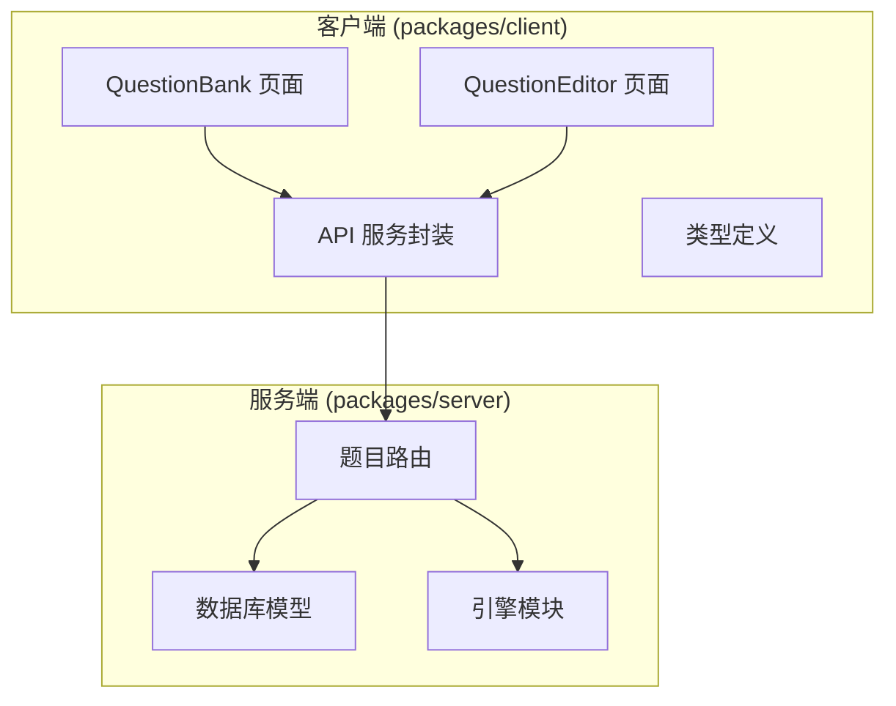
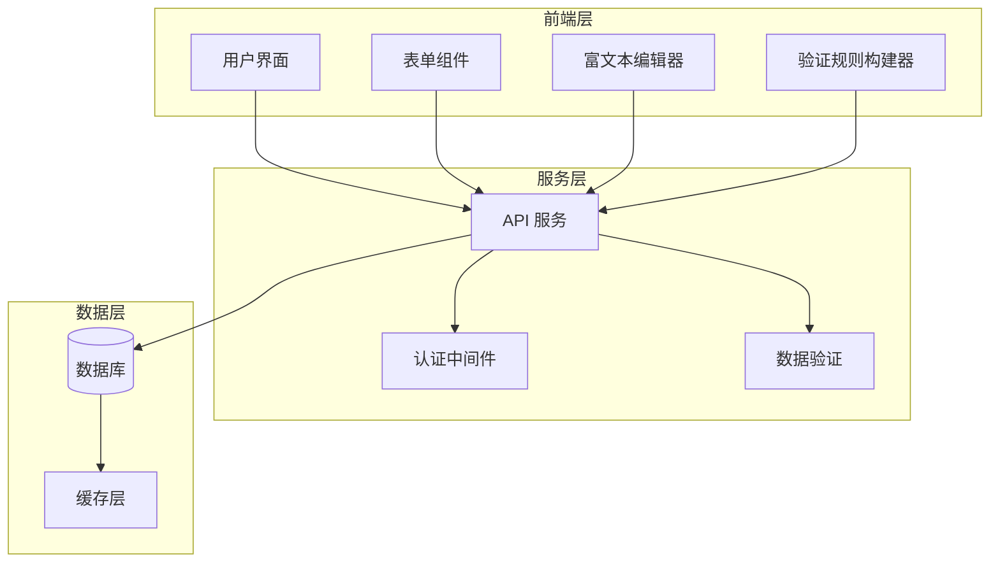
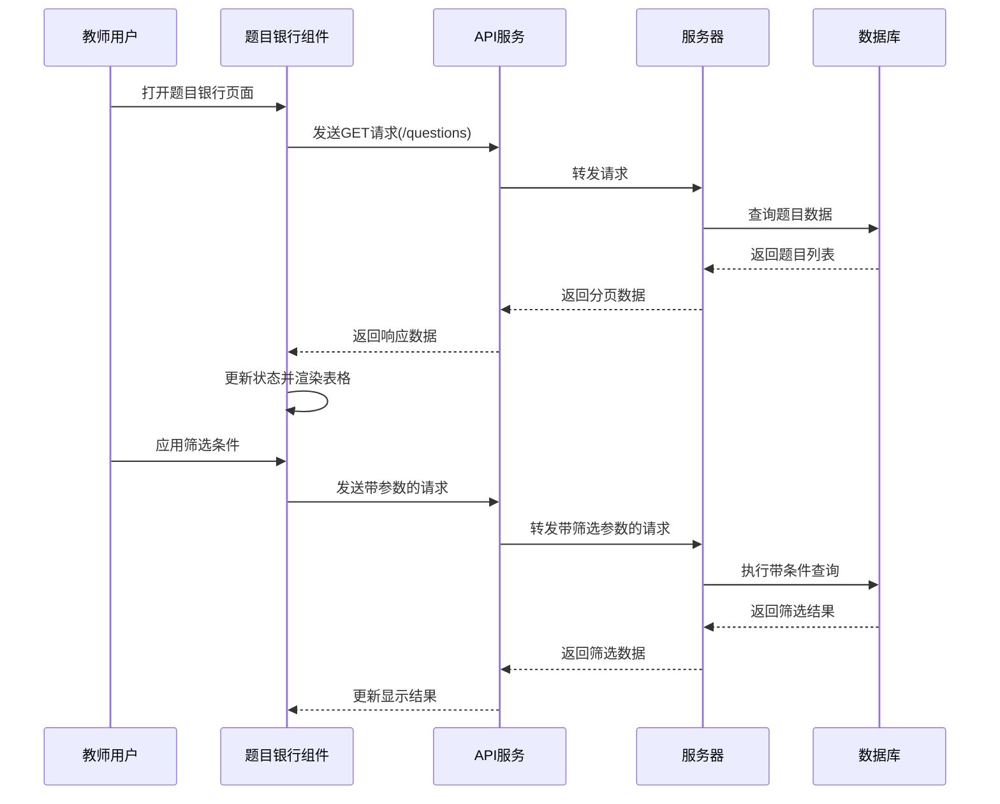
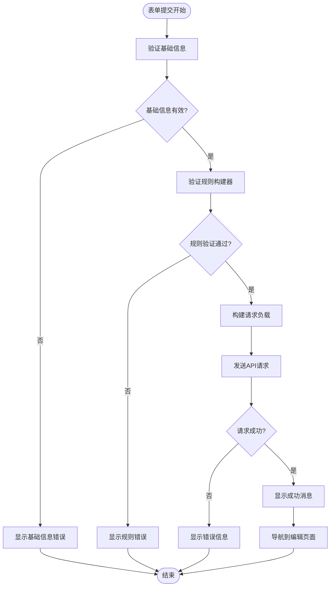
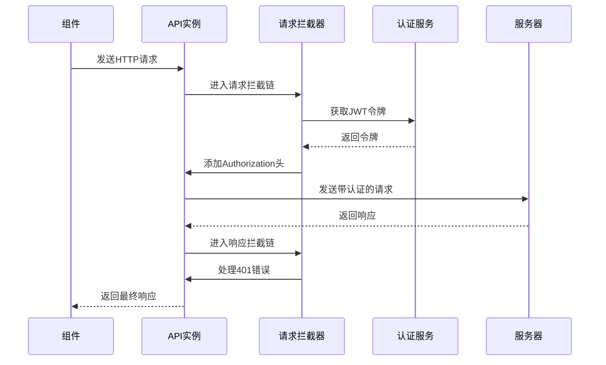
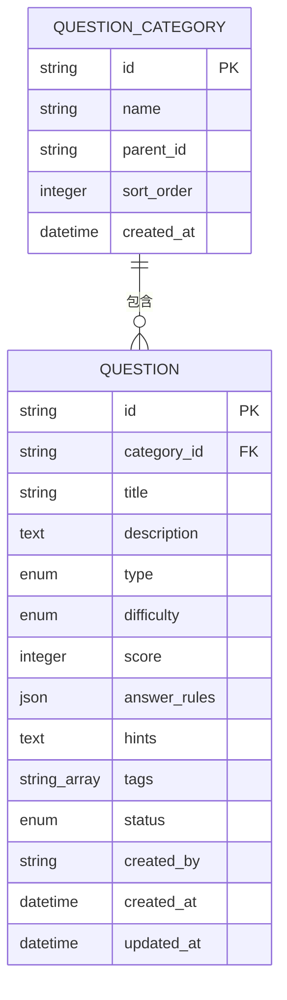

# 题库管理页面

<cite>
**本文档引用的文件**
- [QuestionBank.tsx](file://packages/client/src/pages/teacher/QuestionBank.tsx)
- [QuestionEditor.tsx](file://packages/client/src/pages/teacher/QuestionEditor.tsx)
- [api.ts](file://packages/client/src/services/api.ts)
- [questions.ts](file://packages/server/src/routes/questions.ts)
- [schema.prisma](file://packages/server/prisma/schema.prisma)
- [ExamForm.tsx](file://packages/client/src/pages/teacher/ExamForm.tsx)
- [demo-schemas.ts](file://packages/server/src/engine/demo-schemas.ts)
</cite>

## 目录
1. [简介](#简介)
2. [项目结构](#项目结构)
3. [核心组件](#核心组件)
4. [架构概览](#架构概览)
5. [详细组件分析](#详细组件分析)
6. [依赖关系分析](#依赖关系分析)
7. [性能考虑](#性能考虑)
8. [故障排除指南](#故障排除指南)
9. [结论](#结论)

## 简介

题库管理系统是金山多维表格考试系统的核心组成部分，为教师提供完整的题目管理功能。该系统实现了从题目创建、编辑到发布的完整工作流程，支持多种题目类型、复杂的验证规则构建和智能化的分类管理。

系统采用前后端分离架构，前端基于React和Ant Design构建用户界面，后端使用Express.js和Prisma ORM提供RESTful API服务。通过集成富文本编辑器和验证规则构建器，为教师提供了直观易用的题目编辑体验。

## 项目结构

项目采用Monorepo架构，分为客户端和服务端两个主要包：

**图表来源**
- [QuestionBank.tsx:1-32](file://packages/client/src/pages/teacher/QuestionBank.tsx#L1-L32)
- [QuestionEditor.tsx:1-159](file://packages/client/src/pages/teacher/QuestionEditor.tsx#L1-L159)
- [api.ts:1-32](file://packages/client/src/services/api.ts#L1-L32)
- [questions.ts:1-33](file://packages/server/src/routes/questions.ts#L1-L33)

**章节来源**
- [package.json:17-20](file://package.json#L17-L20)

## 核心组件

### 题目银行页面 (QuestionBank)

题目银行页面是教师管理题目的主要界面，提供了完整的题目列表展示和操作功能。

#### 主要功能特性

- **分页数据加载**: 支持按页码和页面大小获取题目数据
- **多维度筛选**: 支持按搜索关键词、题目类型、难度等级和状态进行筛选
- **批量操作**: 提供删除等批量管理功能
- **实时状态更新**: 删除操作后自动刷新列表

#### 数据结构设计

页面维护了以下核心状态：
- `data`: 分页响应数据，包含题目列表、总数、当前页和页面大小
- `loading`: 加载状态指示器
- `filters`: 筛选条件对象，支持搜索、类型、难度和状态筛选

**章节来源**
- [QuestionBank.tsx:12-32](file://packages/client/src/pages/teacher/QuestionBank.tsx#L12-L32)

### 题目编辑器 (QuestionEditor)

题目编辑器提供了完整的题目创建和编辑功能，集成了验证规则构建器和富文本编辑器。

#### 核心功能模块

- **基础信息表单**: 包含题目标题、描述、类型、难度、分数等基本信息
- **验证规则构建器**: 支持复杂逻辑规则的可视化配置
- **富文本编辑器**: 提供丰富的文本格式化和内容编辑功能
- **分类管理**: 支持题目分类的创建和关联

#### 验证规则系统

系统实现了灵活的验证规则构建器，支持以下操作类型：
- 表结构检查：表存在性、字段存在性、视图存在性等
- 字段属性验证：必填设置、公式字段、字段数量等
- 记录级验证：记录存在性、记录值检查、记录数量统计等

**章节来源**
- [QuestionEditor.tsx:10-30](file://packages/client/src/pages/teacher/QuestionEditor.tsx#L10-L30)
- [QuestionEditor.tsx:118-159](file://packages/client/src/pages/teacher/QuestionEditor.tsx#L118-L159)

## 架构概览

系统采用分层架构设计，确保前后端职责清晰分离：

**图表来源**
- [QuestionBank.tsx:1-32](file://packages/client/src/pages/teacher/QuestionBank.tsx#L1-L32)
- [QuestionEditor.tsx:1-159](file://packages/client/src/pages/teacher/QuestionEditor.tsx#L1-L159)
- [api.ts:1-32](file://packages/client/src/services/api.ts#L1-L32)

## 详细组件分析

### 题目列表组件 (QuestionBank)

#### 数据流处理

**图表来源**
- [QuestionBank.tsx:18-27](file://packages/client/src/pages/teacher/QuestionBank.tsx#L18-L27)
- [api.ts:9-15](file://packages/client/src/services/api.ts#L9-L15)

#### 筛选机制实现

组件实现了动态筛选功能，支持以下筛选条件：
- **搜索关键词**: 支持在题目标题和描述中搜索
- **题目类型**: 支持多种题目类型的筛选（建表、字段、视图、表单、综合）
- **难度等级**: 支持简单、中等、困难三个级别的筛选
- **状态**: 支持草稿、已发布等状态筛选

**章节来源**
- [QuestionBank.tsx:8-10](file://packages/client/src/pages/teacher/QuestionBank.tsx#L8-L10)
- [QuestionBank.tsx:16](file://packages/client/src/pages/teacher/QuestionBank.tsx#L16)

### 题目编辑组件 (QuestionEditor)

#### 表单验证流程

**图表来源**
- [QuestionEditor.tsx:140-157](file://packages/client/src/pages/teacher/QuestionEditor.tsx#L140-L157)

#### 验证规则构建器

系统提供了强大的验证规则构建器，支持以下功能：

**动作类型分类**:
- 表结构检查类：检查表存在、表名称、表数量等
- 字段属性检查类：检查字段存在、字段数量、必填设置、公式字段等
- 视图配置检查类：检查视图存在、类型、筛选、排序、分组等
- 表单配置检查类：检查表单存在、字段配置、表单设置等
- 记录级检查类：检查记录存在、记录值、记录数量等

**参数编辑器**: 每个动作类型都配备了专门的参数编辑器，支持动态参数配置。

**章节来源**
- [QuestionEditor.tsx:10-30](file://packages/client/src/pages/teacher/QuestionEditor.tsx#L10-L30)

### API 服务封装

#### 请求拦截器

**图表来源**
- [api.ts:9-15](file://packages/client/src/services/api.ts#L9-L15)
- [api.ts:18-30](file://packages/client/src/services/api.ts#L18-L30)

**章节来源**
- [api.ts:1-32](file://packages/client/src/services/api.ts#L1-L32)

## 依赖关系分析

### 后端数据模型

系统使用Prisma ORM定义了完整的数据模型，支持复杂的关联关系：

**图表来源**
- [schema.prisma:81-110](file://packages/server/prisma/schema.prisma#L81-L110)

### API 路由设计

后端实现了RESTful API规范，支持完整的CRUD操作：

| 方法 | 路径 | 功能 |
|------|------|------|
| GET | /api/questions | 获取题目列表（支持分页和筛选） |
| POST | /api/questions | 创建新题目 |
| GET | /api/questions/:id | 获取题目详情 |
| PUT | /api/questions/:id | 更新题目信息 |
| DELETE | /api/questions/:id | 删除题目 |
| GET | /api/categories | 获取分类树结构 |
| POST | /api/categories | 创建分类 |

**章节来源**
- [questions.ts:28-33](file://packages/server/src/routes/questions.ts#L28-L33)

## 性能考虑

### 前端性能优化

1. **虚拟滚动**: 对于大量题目数据，建议实现虚拟滚动以提升渲染性能
2. **防抖搜索**: 为搜索输入添加防抖机制，减少不必要的API调用
3. **缓存策略**: 实现智能缓存机制，避免重复请求相同数据
4. **懒加载**: 对于大型富文本内容，实现按需加载

### 后端性能优化

1. **索引优化**: 在常用查询字段上建立数据库索引
2. **分页查询**: 实现高效的分页查询机制
3. **连接池**: 使用连接池管理数据库连接
4. **查询优化**: 优化复杂查询语句，避免N+1问题

## 故障排除指南

### 常见问题及解决方案

#### 题目列表加载失败

**症状**: 题目银行页面无法加载数据，显示加载失败提示

**可能原因**:
- 网络连接问题
- 服务器未启动或端口占用
- 认证令牌过期

**解决步骤**:
1. 检查网络连接状态
2. 确认服务器进程正常运行
3. 清除浏览器缓存和本地存储
4. 重新登录系统

#### 题目保存失败

**症状**: 编辑或创建题目时出现保存失败错误

**可能原因**:
- 验证规则不符合要求
- 必填字段缺失
- 数据库连接异常

**解决步骤**:
1. 检查所有必填字段是否填写完整
2. 验证规则构建器中的配置是否正确
3. 查看控制台错误日志
4. 重启数据库服务

#### 权限相关错误

**症状**: 访问某些功能时出现权限不足提示

**解决步骤**:
1. 确认用户角色为教师
2. 检查用户权限配置
3. 联系系统管理员

**章节来源**
- [QuestionBank.tsx:29-32](file://packages/client/src/pages/teacher/QuestionBank.tsx#L29-L32)
- [QuestionEditor.tsx:152-157](file://packages/client/src/pages/teacher/QuestionEditor.tsx#L152-L157)

## 结论

题库管理系统通过精心设计的架构和完善的组件实现，为教师提供了高效、直观的题目管理体验。系统的主要优势包括：

1. **完整的功能覆盖**: 从题目创建到发布的全生命周期管理
2. **灵活的筛选机制**: 支持多维度的数据筛选和搜索
3. **强大的验证系统**: 集成可配置的验证规则构建器
4. **良好的用户体验**: 响应式设计和流畅的交互体验
5. **可靠的架构设计**: 前后端分离和清晰的职责划分

未来可以进一步优化的方向包括：实现题目版本管理、增加题目模板功能、增强数据分析能力等。这些改进将进一步提升系统的实用性和扩展性。