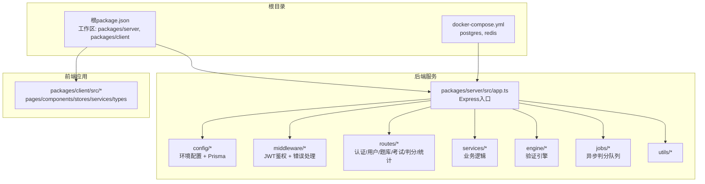
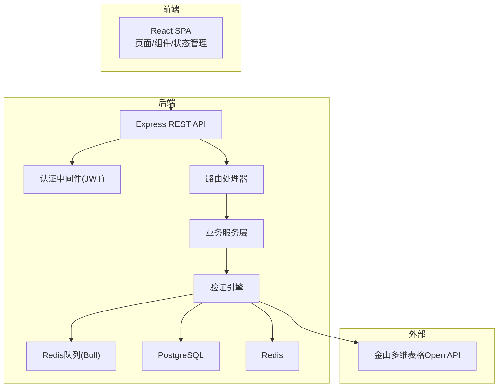
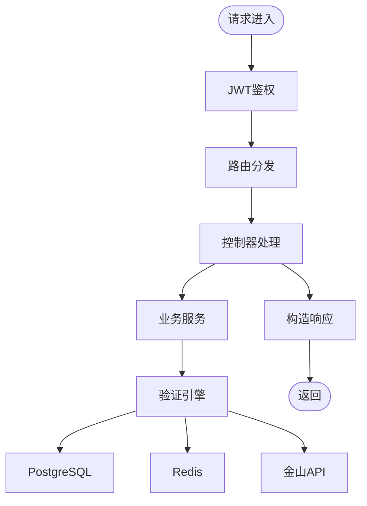

# API设计规范

<cite>
**本文档引用的文件**
- [gen_docx.py](file://gen_docx.py)
- [package.json](file://package.json)
- [docker-compose.yml](file://docker-compose.yml)
</cite>

## 目录
1. [引言](#引言)
2. [项目结构](#项目结构)
3. [核心组件](#核心组件)
4. [架构总览](#架构总览)
5. [详细组件分析](#详细组件分析)
6. [依赖分析](#依赖分析)
7. [性能考虑](#性能考虑)
8. [故障排除指南](#故障排除指南)
9. [结论](#结论)
10. [附录](#附录)

## 引言
本文件基于现有设计文档生成器，系统化整理并输出该考试系统的RESTful API设计规范。内容涵盖HTTP方法、URL模式、请求响应模式、认证机制、版本控制策略、错误码规范与状态码使用标准，并提供端点定义、参数验证规则、响应格式示例与错误处理策略。同时给出API使用示例与最佳实践指导，帮助开发者与使用者快速理解并正确集成系统API。

## 项目结构
- 仓库采用monorepo结构，包含前端与后端两个工作区，通过根目录脚本统一启动开发环境与构建流程。
- 后端服务采用Node.js + Express + TypeScript，结合Prisma ORM访问PostgreSQL，使用Redis作为缓存与队列。
- 前端采用React 18 + TypeScript + Ant Design 5，使用Zustand进行状态管理，Axios进行API调用。

**图表来源**
- [package.json:17-20](file://package.json#L17-L20)
- [docker-compose.yml:3-37](file://docker-compose.yml#L3-L37)
- [gen_docx.py:514-542](file://gen_docx.py#L514-L542)

**章节来源**
- [package.json:6-16](file://package.json#L6-L16)
- [docker-compose.yml:1-37](file://docker-compose.yml#L1-L37)
- [gen_docx.py:510-542](file://gen_docx.py#L510-L542)

## 核心组件
- 认证模块：提供登录、注册、令牌刷新与当前用户信息查询。
- 用户管理模块：管理员对用户的增删改查与批量导入。
- 题库管理模块：教师对题目的增删改查、分类管理与规则构建。
- 考试管理模块：教师对考试的创建、选题组卷、发布/开始/结束与查看答卷。
- 考试参与模块：学生查看考试、开始答题、提交答卷与查看成绩。
- 判分模块：自动判分触发、手动打分、评分完成与批量评分。
- 统计分析模块：总览仪表盘、单场考试分析与学生能力画像。
- 金山API代理模块：统一代理调用金山多维表格Open API，管理Token。

**章节来源**
- [gen_docx.py:244-300](file://gen_docx.py#L244-L300)

## 架构总览
系统采用经典的三层架构：前端React SPA → 后端Node.js/Express REST API → PostgreSQL + Redis数据层，外部对接金山多维表格Open API。验证引擎位于后端，负责解析题目规则并执行判分。

**图表来源**
- [gen_docx.py:140-170](file://gen_docx.py#L140-L170)
- [gen_docx.py:514-542](file://gen_docx.py#L514-L542)

## 详细组件分析

### 认证与授权
- HTTP方法与URL模式
  - POST /api/auth/login：用户凭据换取JWT
  - POST /api/auth/register：新用户注册
  - POST /api/auth/refresh：刷新访问令牌
  - GET /api/auth/me：获取当前用户信息
- 请求与响应
  - 登录/注册：请求体包含用户名/密码；成功返回包含JWT的响应；失败返回错误码与消息。
  - 刷新：请求体包含refresh token；成功返回新的access token。
  - 获取当前用户：需携带有效JWT，返回用户基本信息。
- 参数验证规则
  - 用户名/密码长度与格式校验；邮箱格式校验；角色字段枚举校验。
- 错误处理策略
  - 凭据无效或过期：返回401 Unauthorized。
  - 密码强度不足或重复注册：返回400 Bad Request。
  - 令牌刷新失败：返回401 Unauthorized。
- 使用示例
  - 登录后将JWT保存在本地存储，后续请求在Authorization头中携带Bearer Token。
- 最佳实践
  - 使用HTTPS传输；短有效期access token + 刷新机制；敏感信息不落库明文。

**章节来源**
- [gen_docx.py:244-250](file://gen_docx.py#L244-L250)

### 用户管理（管理员）
- HTTP方法与URL模式
  - GET /api/users：分页与搜索用户列表
  - POST /api/users：创建用户
  - PUT /api/users/:id：更新用户
  - DELETE /api/users/:id：删除用户
  - POST /api/users/batch-import：批量导入（CSV）
- 请求与响应
  - 列表：支持分页参数与关键词过滤；返回用户数组与总数。
  - 创建/更新：请求体包含用户基本信息；返回创建/更新后的用户对象。
  - 删除：无返回体或仅返回成功标志。
  - 批量导入：上传CSV文件，返回导入结果统计。
- 参数验证规则
  - 用户名唯一性；邮箱唯一性；角色字段枚举校验；密码强度要求。
- 错误处理策略
  - 未授权访问：返回403 Forbidden。
  - 资源不存在：返回404 Not Found。
  - 数据冲突（唯一约束）：返回409 Conflict。
- 使用示例
  - 分页查询：GET /api/users?page=1&limit=20&keyword=admin
  - 批量导入：POST /api/users/batch-import（multipart/form-data）
- 最佳实践
  - 对批量导入进行幂等与去重处理；记录导入日志；限制文件大小与格式。

**章节来源**
- [gen_docx.py:251-257](file://gen_docx.py#L251-L257)

### 题库管理（教师）
- HTTP方法与URL模式
  - GET /api/questions：筛选（分类/难度/类型/状态）
  - POST /api/questions：创建题目（含验证规则）
  - GET /api/questions/:id：题目详情
  - PUT /api/questions/:id：更新题目
  - DELETE /api/questions/:id：删除题目
  - GET /api/categories：分类树
  - POST /api/categories：创建分类
- 请求与响应
  - 列表：支持多维筛选；返回题目数组与分页信息。
  - 详情：返回题目对象，包含answer_rules(JSONB)。
  - 分类树：返回树形结构。
- 参数验证规则
  - 题目标题唯一性；分类父子关系校验；难度/类型枚举；规则结构JSONB校验。
- 错误处理策略
  - 非教师角色：返回403 Forbidden。
  - 题目不存在：返回404 Not Found。
  - 规则JSONB结构非法：返回400 Bad Request。
- 使用示例
  - 创建题目：POST /api/questions（请求体包含题目基本信息与规则）
  - 获取分类树：GET /api/categories
- 最佳实践
  - 规则JSONB结构版本化；提供规则校验器；对复杂规则进行预检。

**章节来源**
- [gen_docx.py:258-266](file://gen_docx.py#L258-L266)

### 考试管理（教师）
- HTTP方法与URL模式
  - GET /api/exams：考试列表
  - POST /api/exams：创建考试
  - PUT /api/exams/:id/questions：选题组卷
  - POST /api/exams/:id/publish：发布考试
  - POST /api/exams/:id/start：开始考试
  - POST /api/exams/:id/end：结束考试
  - GET /api/exams/:id/submissions：查看所有答卷
- 请求与响应
  - 选题组卷：请求体包含题目ID与分数覆盖；返回更新后的考试。
  - 发布/开始/结束：触发状态机转换；返回最新状态。
  - 查看答卷：返回答卷列表与统计信息。
- 参数验证规则
  - 考试时间窗口合法性；题目与分数覆盖一致性；状态转换有效性。
- 错误处理策略
  - 非教师角色：返回403 Forbidden。
  - 时间冲突或状态非法：返回400 Bad Request。
  - 考试不存在：返回404 Not Found。
- 使用示例
  - 发布考试：POST /api/exams/:id/publish
  - 查看答卷：GET /api/exams/:id/submissions
- 最佳实践
  - 状态机严格控制；并发修改加锁；日志追踪状态变更。

**章节来源**
- [gen_docx.py:267-275](file://gen_docx.py#L267-L275)

### 考试参与（学生）
- HTTP方法与URL模式
  - GET /api/my-exams：我的考试列表
  - GET /api/my-exams/:id：考试详情/题目
  - POST /api/my-exams/:id/start：开始答题
  - POST /api/my-exams/:id/submit：提交答卷
  - GET /api/my-exams/:id/result：查看成绩
- 请求与响应
  - 开始答题：创建答题记录与表格空间分配。
  - 提交答卷：加入判分队列；返回提交确认。
  - 查看成绩：返回总分、每题得分与评语。
- 参数验证规则
  - 考试状态与权限校验；开始/提交时机校验。
- 错误处理策略
  - 未登录：返回401 Unauthorized。
  - 超出时间窗口：返回400 Bad Request。
  - 重复提交：返回400 Bad Request。
- 使用示例
  - 开始答题：POST /api/my-exams/:id/start
  - 查看成绩：GET /api/my-exams/:id/result
- 最佳实践
  - 心跳上报保持在线；倒计时同步；防止切屏与重复提交。

**章节来源**
- [gen_docx.py:276-282](file://gen_docx.py#L276-L282)

### 判分（教师+自动）
- HTTP方法与URL模式
  - POST /api/grading/:submissionId：触发自动判分
  - POST /api/grading/:submissionId/detail/:detailId：手动对某题打分
  - POST /api/grading/:submissionId/finalize：完成评分
  - POST /api/grading/batch/:examId：批量评分
- 请求与响应
  - 自动判分：异步执行，返回排队确认；完成后推送结果。
  - 手动打分：请求体包含分数与评语；返回更新后的明细。
  - 完成评分：更新最终成绩与状态。
  - 批量评分：返回批处理结果统计。
- 参数验证规则
  - 分数范围校验；评语长度限制；评分人身份校验。
- 错误处理策略
  - 非教师角色：返回403 Forbidden。
  - 提交评分后不可逆：返回400 Bad Request。
  - 评分不存在：返回404 Not Found。
- 使用示例
  - 触发判分：POST /api/grading/:submissionId
  - 手动打分：POST /api/grading/:submissionId/detail/:detailId
- 最佳实践
  - 判分队列限流；人工复核标记；评分审计日志。

**章节来源**
- [gen_docx.py:283-288](file://gen_docx.py#L283-L288)

### 统计分析
- HTTP方法与URL模式
  - GET /api/statistics/overview：总览仪表盘
  - GET /api/statistics/exam/:examId：单场考试分析
  - GET /api/statistics/student/:studentId：学生能力画像
- 请求与响应
  - 总览：返回全局指标与趋势。
  - 单场：返回题目难度、正确率、分数分布。
  - 学生：返回知识点雷达图与能力评估。
- 参数验证规则
  - 考试/学生存在性校验；时间范围合法性。
- 错误处理策略
  - 权限不足：返回403 Forbidden。
  - 资源不存在：返回404 Not Found。
- 使用示例
  - 获取总览：GET /api/statistics/overview
  - 获取学生画像：GET /api/statistics/student/:studentId
- 最佳实践
  - 缓存热点数据；异步计算复杂指标；分页与分段加载。

**章节来源**
- [gen_docx.py:289-294](file://gen_docx.py#L289-L294)

### 金山API代理
- HTTP方法与URL模式
  - POST /api/kingsoft/proxy：代理调用，统一管理Token
  - GET /api/kingsoft/table/:space_id/tables：获取表列表
  - GET /api/kingsoft/table/:space_id/:table_id/fields：获取字段
  - GET /api/kingsoft/table/:space_id/:table_id/views：获取视图
- 请求与响应
  - 代理：转发请求并注入/刷新Token；返回原始响应。
  - 查询：返回表/字段/视图元数据。
- 参数验证规则
  - 空间ID与表ID存在性校验；路径参数合法性。
- 错误处理策略
  - 金山API异常：透传错误码与消息。
  - Token失效：自动刷新并重试。
- 使用示例
  - 获取表列表：GET /api/kingsoft/table/:space_id/tables
- 最佳实践
  - Token集中管理；统一错误映射；限流与熔断。

**章节来源**
- [gen_docx.py:295-299](file://gen_docx.py#L295-L299)

## 依赖分析
- 内部依赖
  - 路由层依赖中间件（JWT鉴权与错误处理）。
  - 业务服务层依赖验证引擎与数据访问层。
  - 验证引擎依赖规则解释器与各类验证器。
- 外部依赖
  - PostgreSQL用于持久化；Redis用于缓存与队列。
  - 金山多维表格Open API用于表格操作验证。
- 版本控制策略
  - API版本号置于路径前缀（如/v1），当前文档未显式定义具体版本号，建议采用语义化版本并在路径中体现（例如/api/v1/...）。
- 错误码规范与状态码使用标准
  - 2xx：成功
    - 200 OK：常规成功
    - 201 Created：资源创建成功
    - 204 No Content：删除成功或无返回体
  - 4xx：客户端错误
    - 400 Bad Request：请求参数错误或业务规则不满足
    - 401 Unauthorized：未认证或令牌无效
    - 403 Forbidden：权限不足
    - 404 Not Found：资源不存在
    - 409 Conflict：资源冲突（如唯一约束）
  - 5xx：服务器错误
    - 500 Internal Server Error：未知服务器错误
    - 503 Service Unavailable：服务不可用（临时）

**图表来源**
- [gen_docx.py:514-542](file://gen_docx.py#L514-L542)

**章节来源**
- [gen_docx.py:514-542](file://gen_docx.py#L514-L542)

## 性能考虑
- 缓存策略
  - 对高频查询（如分类树、统计数据）启用Redis缓存；设置合理TTL。
- 队列与异步
  - 判分采用Redis队列异步执行，避免同步阻塞；批量评分支持并发。
- 连接池与数据库优化
  - 使用连接池；对复杂查询建立索引；分页查询避免全表扫描。
- 并发控制
  - 对状态转换与评分操作加分布式锁；防止竞态条件。
- 监控与告警
  - 关键指标埋点（QPS、延迟、错误率）；异常自动告警。

## 故障排除指南
- 认证相关
  - 401 Unauthorized：检查令牌是否过期或格式错误；使用刷新接口获取新令牌。
  - 403 Forbidden：检查用户角色与资源权限。
- 资源相关
  - 404 Not Found：确认ID是否存在；检查软删除与可见性。
  - 409 Conflict：处理唯一约束冲突（如用户名/邮箱重复）。
- 业务规则
  - 400 Bad Request：检查请求参数与业务规则；参考错误消息定位问题。
- 服务器错误
  - 500 Internal Server Error：查看服务日志；检查数据库/缓存连接。
- 金山API
  - 代理失败：检查Token刷新与网络连通性；查看错误映射。

**章节来源**
- [gen_docx.py:544-563](file://gen_docx.py#L544-L563)

## 结论
本API设计规范基于现有设计文档生成器整理，明确了RESTful API的HTTP方法、URL模式、请求响应模式、认证机制、版本控制策略、错误码规范与状态码使用标准，并提供了端点定义、参数验证规则、响应格式示例与错误处理策略。建议在实际开发中遵循本规范，确保API的一致性、安全性与可维护性。

## 附录
- 响应通用结构
  - 成功响应：{ "code": 0, "message": "success", "data": {} }
  - 失败响应：{ "code": 非0错误码, "message": "错误描述", "data": null }
- 请求头
  - Authorization: Bearer <JWT>
  - Content-Type: application/json
- 环境与部署
  - 使用Docker Compose一键启动PostgreSQL与Redis；开发环境通过根脚本统一启动前后端。

**章节来源**
- [docker-compose.yml:1-37](file://docker-compose.yml#L1-L37)
- [gen_docx.py:544-563](file://gen_docx.py#L544-L563)