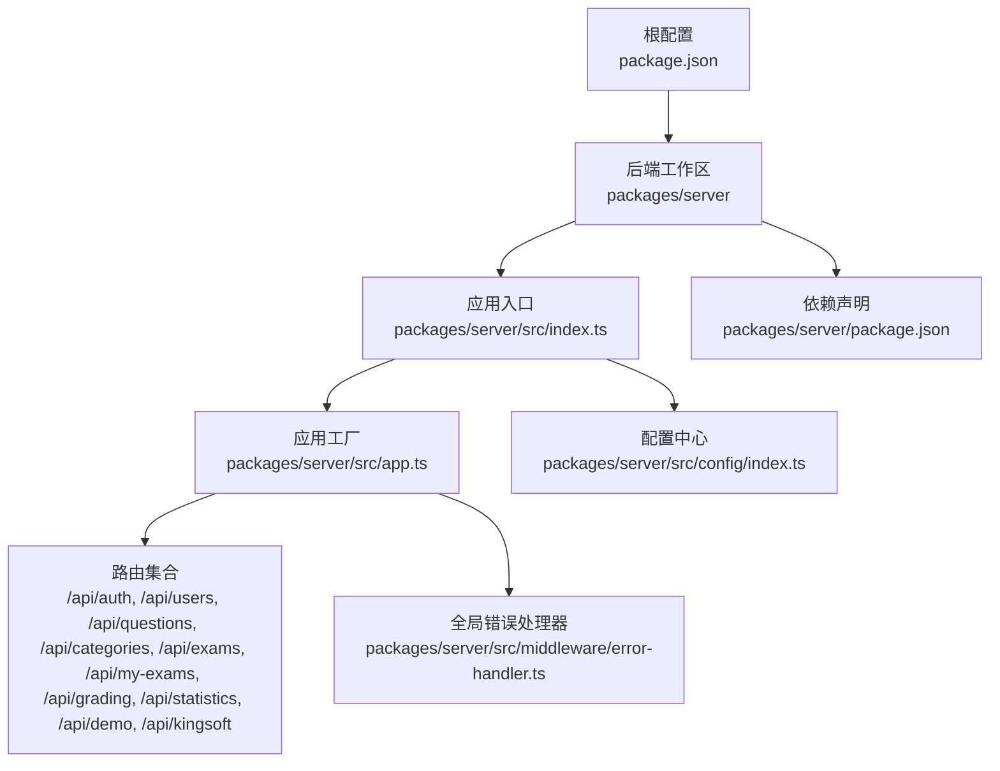
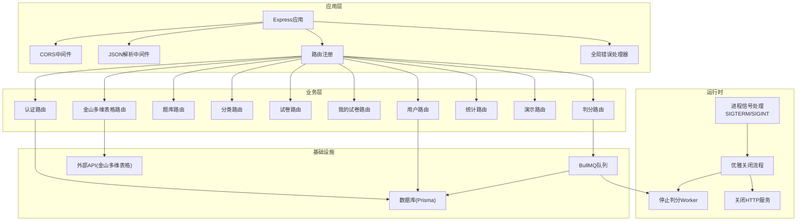
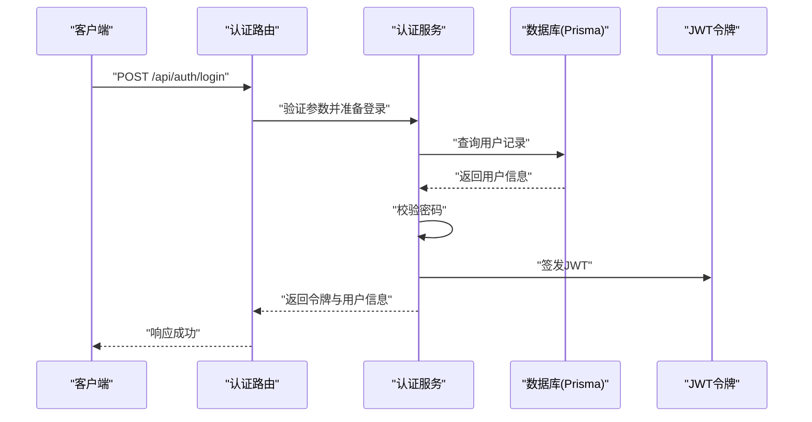
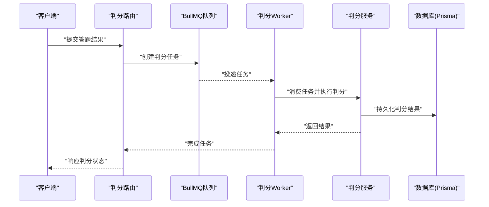
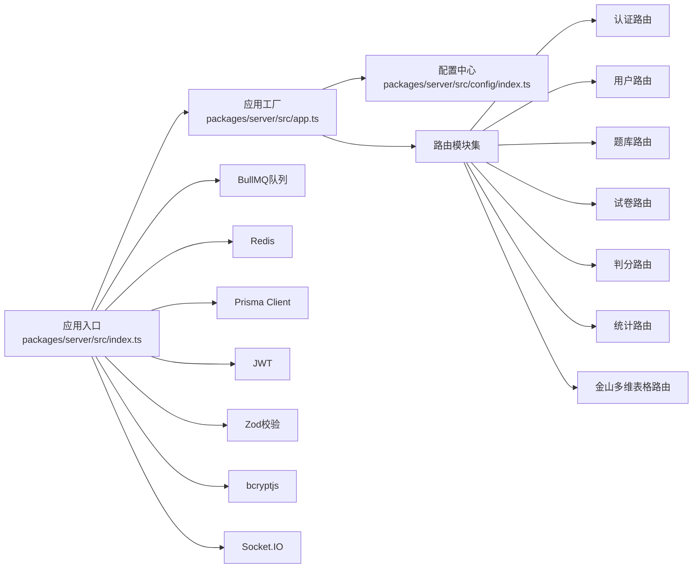

# 业务逻辑层

<cite>
**本文引用的文件**
- [package.json](file://package.json)
- [packages/server/src/index.ts](file://packages/server/src/index.ts)
- [packages/server/src/app.ts](file://packages/server/src/app.ts)
- [packages/server/src/config/index.ts](file://packages/server/src/config/index.ts)
- [packages/server/package.json](file://packages/server/package.json)
</cite>

## 目录
1. [引言](#引言)
2. [项目结构](#项目结构)
3. [核心组件](#核心组件)
4. [架构总览](#架构总览)
5. [详细组件分析](#详细组件分析)
6. [依赖分析](#依赖分析)
7. [性能考虑](#性能考虑)
8. [故障排查指南](#故障排查指南)
9. [结论](#结论)
10. [附录](#附录)

## 引言
本文件聚焦于考试系统的业务逻辑层技术文档，围绕服务类的职责划分、业务流程实现与数据处理逻辑展开，解释服务间的依赖关系、事务管理与异常处理机制，并给出业务规则、数据验证与安全控制要点、服务调用示例以及性能优化建议。由于当前仓库中业务逻辑层源码未直接提供，本文基于现有入口与配置文件进行结构性分析与最佳实践说明，帮助读者在不直接阅读源码的情况下理解系统架构与实现思路。

## 项目结构
项目采用工作区（Workspaces）组织，后端位于 packages/server，前端位于 packages/client。后端通过 Express 应用聚合多个业务路由模块，统一注册健康检查、CORS、JSON 解析与全局错误处理中间件；应用启动时初始化判分队列 Worker 并监听端口，支持优雅关闭。

图表来源
- [packages/server/src/index.ts:1-22](file://packages/server/src/index.ts#L1-L22)
- [packages/server/src/app.ts:1-44](file://packages/server/src/app.ts#L1-L44)
- [packages/server/src/config/index.ts:1-23](file://packages/server/src/config/index.ts#L1-L23)
- [packages/server/package.json:1-34](file://packages/server/package.json#L1-L34)
- [package.json:1-26](file://package.json#L1-L26)

章节来源
- [package.json:1-26](file://package.json#L1-L26)
- [packages/server/src/index.ts:1-22](file://packages/server/src/index.ts#L1-L22)
- [packages/server/src/app.ts:1-44](file://packages/server/src/app.ts#L1-L44)
- [packages/server/src/config/index.ts:1-23](file://packages/server/src/config/index.ts#L1-L23)
- [packages/server/package.json:1-34](file://packages/server/package.json#L1-L34)

## 核心组件
- 应用入口与生命周期
  - 负责创建应用实例、启动判分队列 Worker、监听端口并处理进程信号以实现优雅关闭。
- 应用工厂
  - 注册 CORS、JSON 中间件与健康检查接口；集中挂载各业务路由；最后注册全局错误处理器。
- 配置中心
  - 统一加载环境变量，提供 JWT、数据库、Redis、金山多维表格 Open API 等配置项。
- 依赖与工具
  - 使用 BullMQ 实现异步判分任务队列；Express 提供路由与中间件能力；Zod 进行请求参数校验；bcryptjs 处理密码哈希；jsonwebtoken 生成令牌；Socket.IO 支持实时通信；Prisma 客户端用于数据库访问。

章节来源
- [packages/server/src/index.ts:1-22](file://packages/server/src/index.ts#L1-L22)
- [packages/server/src/app.ts:1-44](file://packages/server/src/app.ts#L1-L44)
- [packages/server/src/config/index.ts:1-23](file://packages/server/src/config/index.ts#L1-L23)
- [packages/server/package.json:13-33](file://packages/server/package.json#L13-L33)

## 架构总览
后端采用“入口 -> 应用工厂 -> 路由 -> 服务/领域模型 -> 数据库/外部服务”的分层结构。入口负责生命周期管理，应用工厂负责中间件与路由装配，路由层承载业务控制器，服务层封装业务规则与数据处理，底层依赖数据库与外部 API（如金山多维表格 Open API）。判分流程通过队列异步执行，保障高并发场景下的稳定性。

图表来源
- [packages/server/src/index.ts:1-22](file://packages/server/src/index.ts#L1-L22)
- [packages/server/src/app.ts:1-44](file://packages/server/src/app.ts#L1-L44)
- [packages/server/package.json:13-33](file://packages/server/package.json#L13-L33)

## 详细组件分析
以下为典型业务流程的序列图与流程图，展示从请求到响应的关键步骤与决策点。由于当前仓库未包含具体源码，以下为通用实现模式与最佳实践，便于在实际开发中对齐。

### 认证与授权流程
- 典型流程：客户端发起登录请求 -> 服务端校验凭据 -> 生成JWT -> 返回令牌与用户信息 -> 前端存储令牌并在后续请求中携带。
- 关键点：密码哈希使用 bcryptjs；JWT 密钥与过期时间来自配置中心；路由层进行输入参数校验（建议使用 Zod）。

### 判分任务流程
- 典型流程：提交答题结果 -> 创建判分任务 -> 入队 -> Worker 消费 -> 执行判分算法 -> 写入结果 -> 通知客户端。
- 关键点：使用 BullMQ 队列解耦；Worker 在应用启动时初始化；判分完成后通过 Socket.IO 推送结果。

### 业务规则与数据验证
- 输入参数校验：建议在路由层使用 Zod 对请求体与查询参数进行严格校验，确保数据类型与范围符合预期。
- 业务规则：例如密码强度策略、用户名唯一性、试卷与题目关联关系等，应在服务层集中实现并保持幂等。
- 数据一致性：涉及多表写入或跨服务操作时，应结合数据库事务与重试机制，避免部分失败导致的数据不一致。

### 安全控制措施
- 传输安全：生产环境启用 HTTPS，限制 CORS 策略，仅允许受信域名。
- 认证与授权：JWT 令牌签名与过期控制，路由中间件校验权限，敏感操作二次确认。
- 数据保护：密码使用 bcryptjs 哈希存储；敏感字段脱敏输出；日志避免泄露凭证。
- 外部集成：金山多维表格 Open API 的密钥与地址从配置中心注入，避免硬编码。

### 事务管理与异常处理
- 事务管理：数据库写入使用 Prisma 事务包裹，保证原子性；对于跨服务操作，采用补偿事务或幂等设计。
- 异常处理：全局错误处理器捕获未处理异常，按类型返回标准化错误响应；判分队列异常需记录并重试/死信处理。

章节来源
- [packages/server/src/app.ts:1-44](file://packages/server/src/app.ts#L1-L44)
- [packages/server/src/config/index.ts:1-23](file://packages/server/src/config/index.ts#L1-L23)
- [packages/server/package.json:13-33](file://packages/server/package.json#L13-L33)

## 依赖分析
- 运行时依赖
  - Express：提供 Web 服务器与路由能力。
  - BullMQ：实现高性能异步任务队列，支撑判分流程。
  - Socket.IO：提供实时通信能力，用于判分结果推送。
  - Prisma Client：数据库访问抽象层。
  - bcryptjs：密码哈希处理。
  - jsonwebtoken：JWT 令牌签发与校验。
  - Zod：请求参数校验。
  - ioredis：Redis 客户端（用于缓存/会话等）。
  - dotenv：环境变量加载。
- 开发依赖
  - TypeScript、Prisma CLI、tsx 等，用于开发与构建。

图表来源
- [packages/server/src/index.ts:1-22](file://packages/server/src/index.ts#L1-L22)
- [packages/server/src/app.ts:1-44](file://packages/server/src/app.ts#L1-L44)
- [packages/server/src/config/index.ts:1-23](file://packages/server/src/config/index.ts#L1-L23)
- [packages/server/package.json:13-33](file://packages/server/package.json#L13-L33)

章节来源
- [packages/server/package.json:13-33](file://packages/server/package.json#L13-L33)
- [packages/server/src/index.ts:1-22](file://packages/server/src/index.ts#L1-L22)
- [packages/server/src/app.ts:1-44](file://packages/server/src/app.ts#L1-L44)

## 性能考虑
- 异步判分：将耗时的判分逻辑放入队列，避免阻塞请求线程，提升吞吐量。
- 缓存策略：利用 Redis 缓存热点数据（如用户信息、题库元数据），降低数据库压力。
- 数据库优化：合理索引、批量写入、连接池配置；对高频查询使用只读副本。
- 请求限流：在网关或路由层实施限流策略，防止突发流量击穿系统。
- 日志与监控：埋点关键链路耗时，结合 APM 工具定位瓶颈。
- 依赖版本：定期更新依赖，关注安全补丁与性能改进。

## 故障排查指南
- 健康检查
  - 访问 /api/health 确认服务可用与时间戳正常。
- 日志定位
  - 查看应用启动日志与优雅关闭日志，确认判分 Worker 初始化与停止流程是否正常。
- 配置问题
  - 检查环境变量是否正确加载（端口、JWT 秘钥、数据库与 Redis 地址、金山多维表格 API 凭据）。
- 队列异常
  - 关注判分任务积压与失败重试情况，必要时调整 Worker 数量与重试策略。
- 错误处理
  - 全局错误处理器会拦截未处理异常，确保返回标准化错误格式以便前端与运维快速定位。

章节来源
- [packages/server/src/app.ts:22-25](file://packages/server/src/app.ts#L22-L25)
- [packages/server/src/index.ts:14-21](file://packages/server/src/index.ts#L14-L21)
- [packages/server/src/config/index.ts:4-22](file://packages/server/src/config/index.ts#L4-L22)

## 结论
业务逻辑层通过清晰的分层与职责划分，结合队列异步化、参数校验与安全控制，实现了稳定高效的考试系统核心能力。建议在后续开发中进一步完善服务类的边界定义、事务与异常处理策略，并持续优化性能与可观测性，以支撑更大规模的并发与更复杂的业务场景。

## 附录
- 服务调用示例（示意）
  - 登录：POST /api/auth/login（携带用户名与密码，返回 JWT 与用户信息）
  - 获取试卷：GET /api/exams/:id
  - 提交答题：POST /api/my-exams/:id/submit（返回判分任务ID）
  - 实时结果：通过 Socket.IO 监听判分完成事件
- 配置项清单（来自配置中心）
  - 端口、节点环境、JWT 秘钥与过期时间、数据库 URL、Redis URL、金山多维表格 API 基础地址与密钥
- 依赖清单（来自后端包配置）
  - Express、BullMQ、Socket.IO、Prisma Client、bcryptjs、jsonwebtoken、Zod、ioredis、dotenv 等

章节来源
- [packages/server/src/app.ts:22-37](file://packages/server/src/app.ts#L22-L37)
- [packages/server/src/config/index.ts:4-22](file://packages/server/src/config/index.ts#L4-L22)
- [packages/server/package.json:13-33](file://packages/server/package.json#L13-L33)