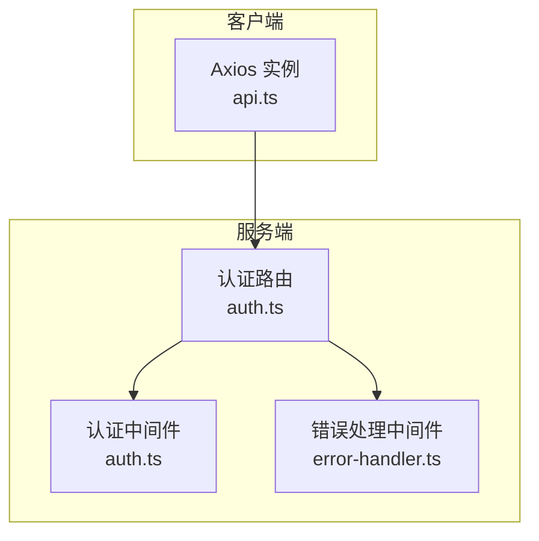
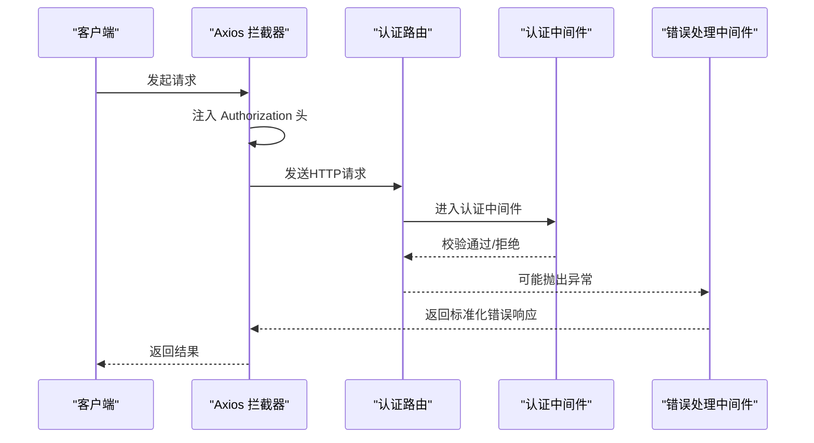
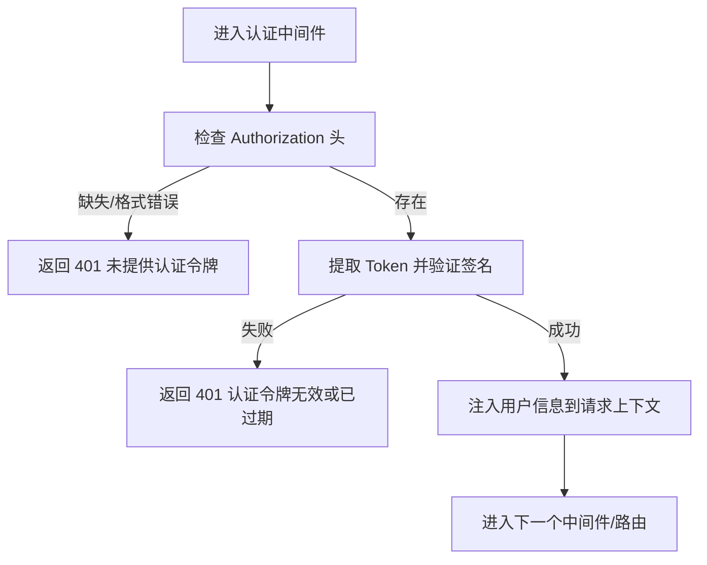
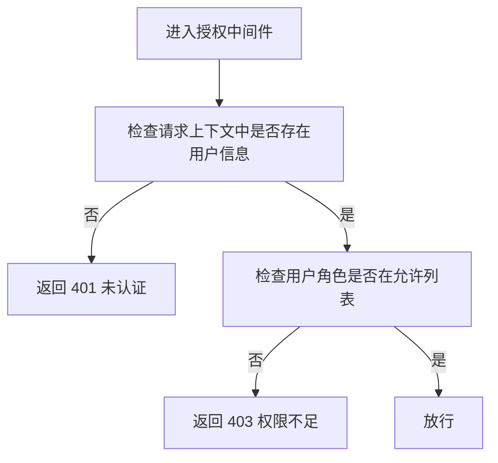
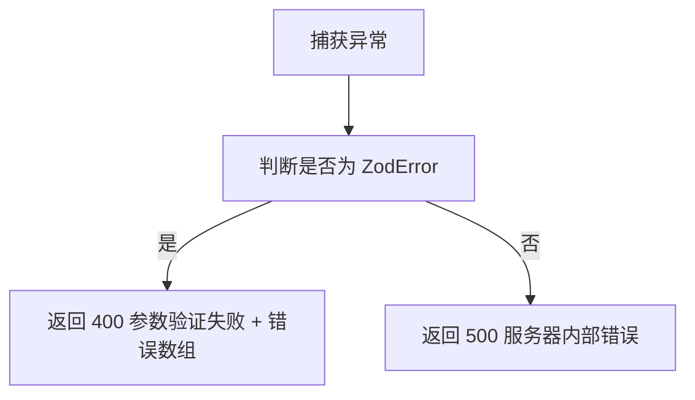
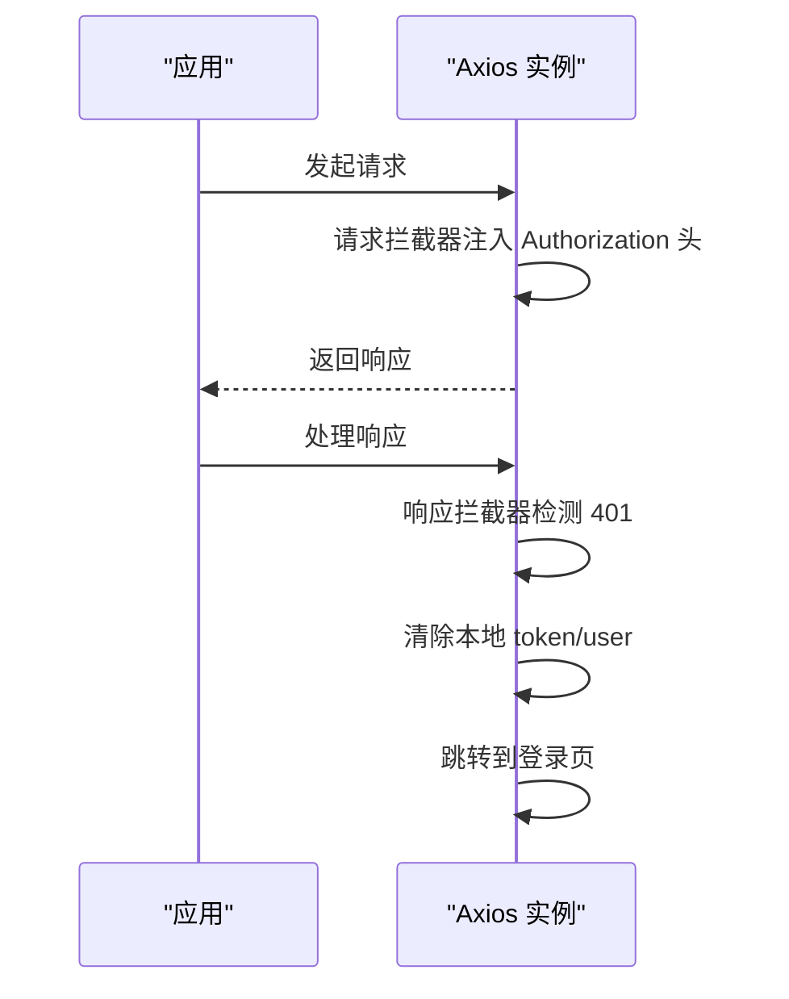
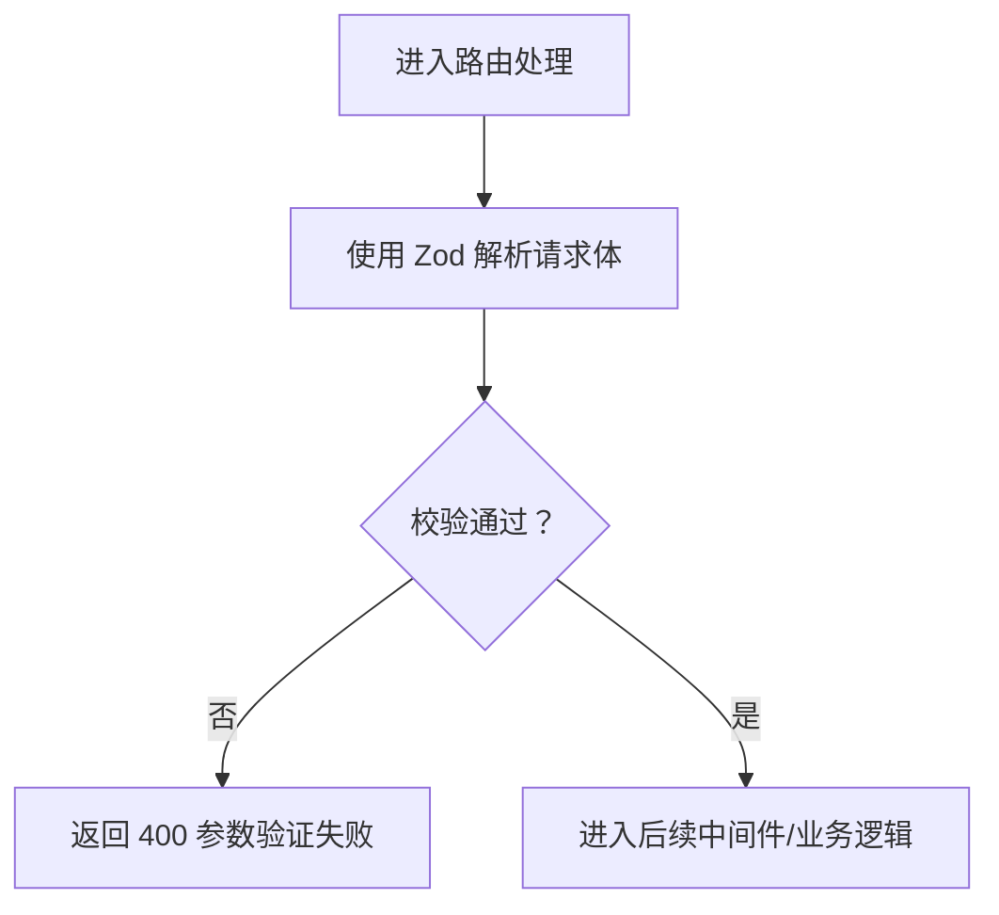
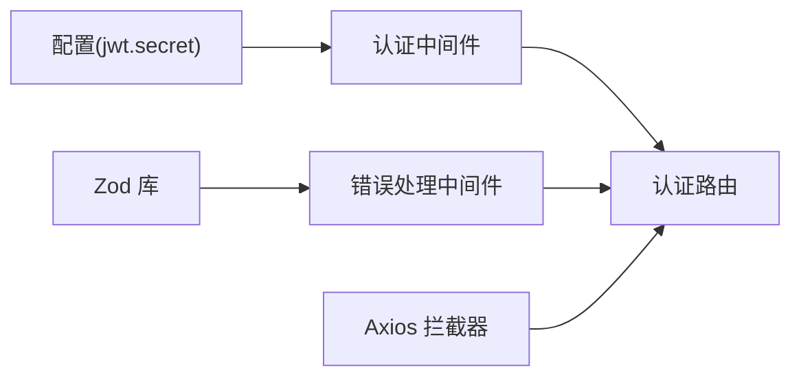

# 中间件与拦截器

<cite>
**本文引用的文件**
- [packages/server/src/middleware/auth.ts](file://packages/server/src/middleware/auth.ts)
- [packages/server/src/middleware/error-handler.ts](file://packages/server/src/middleware/error-handler.ts)
- [packages/server/src/routes/auth.ts](file://packages/server/src/routes/auth.ts)
- [packages/client/src/services/api.ts](file://packages/client/src/services/api.ts)
</cite>

## 目录
1. [引言](#引言)
2. [项目结构](#项目结构)
3. [核心组件](#核心组件)
4. [架构总览](#架构总览)
5. [详细组件分析](#详细组件分析)
6. [依赖关系分析](#依赖关系分析)
7. [性能考虑](#性能考虑)
8. [故障排查指南](#故障排查指南)
9. [结论](#结论)
10. [附录](#附录)

## 引言
本文件围绕考试系统的中间件与拦截器体系展开，重点覆盖以下方面：
- JWT认证中间件：实现原理、Token验证流程与权限控制机制
- 错误处理中间件：异常捕获、错误分类与响应格式标准化
- 数据验证中间件：基于Zod的规则定义、验证流程与扩展思路
- 中间件组合使用与性能优化策略

文档以循序渐进的方式呈现，既面向开发者也兼顾非技术读者的理解需求。

## 项目结构
系统采用前后端分离的双工作区布局，中间件与拦截器主要分布在服务端与客户端：
- 服务端中间件位于 packages/server/src/middleware
- 客户端拦截器位于 packages/client/src/services/api.ts
- 认证路由与业务逻辑位于 packages/server/src/routes/auth.ts

图表来源
- [packages/server/src/middleware/auth.ts:1-46](file://packages/server/src/middleware/auth.ts#L1-L46)
- [packages/server/src/middleware/error-handler.ts:1-19](file://packages/server/src/middleware/error-handler.ts#L1-L19)
- [packages/server/src/routes/auth.ts:45-152](file://packages/server/src/routes/auth.ts#L45-L152)
- [packages/client/src/services/api.ts:1-33](file://packages/client/src/services/api.ts#L1-L33)

章节来源
- [packages/server/src/middleware/auth.ts:1-46](file://packages/server/src/middleware/auth.ts#L1-L46)
- [packages/server/src/middleware/error-handler.ts:1-19](file://packages/server/src/middleware/error-handler.ts#L1-L19)
- [packages/server/src/routes/auth.ts:45-152](file://packages/server/src/routes/auth.ts#L45-L152)
- [packages/client/src/services/api.ts:1-33](file://packages/client/src/services/api.ts#L1-L33)

## 核心组件
- 认证中间件（JWT）
  - 负责从请求头提取并校验JWT，将用户信息注入到请求对象，供后续路由使用
  - 提供角色授权中间件，按角色白名单放行
- 错误处理中间件（全局）
  - 统一捕获未处理异常，区分Zod参数校验错误与服务器内部错误，输出标准化响应
- 客户端拦截器（Axios）
  - 请求拦截：自动附加Authorization头
  - 响应拦截：统一处理401未授权，清理本地凭据并跳转登录页

章节来源
- [packages/server/src/middleware/auth.ts:19-45](file://packages/server/src/middleware/auth.ts#L19-L45)
- [packages/server/src/middleware/error-handler.ts:4-18](file://packages/server/src/middleware/error-handler.ts#L4-L18)
- [packages/client/src/services/api.ts:8-30](file://packages/client/src/services/api.ts#L8-L30)

## 架构总览
下图展示了从客户端到服务端的关键交互路径，以及中间件在其中的位置与职责。

图表来源
- [packages/client/src/services/api.ts:8-30](file://packages/client/src/services/api.ts#L8-L30)
- [packages/server/src/middleware/auth.ts:19-45](file://packages/server/src/middleware/auth.ts#L19-L45)
- [packages/server/src/middleware/error-handler.ts:4-18](file://packages/server/src/middleware/error-handler.ts#L4-L18)
- [packages/server/src/routes/auth.ts:105-128](file://packages/server/src/routes/auth.ts#L105-L128)

## 详细组件分析

### JWT认证中间件
- 设计要点
  - 从Authorization头解析Bearer Token
  - 使用对称密钥验证签名，失败即返回401
  - 成功后将用户信息写入请求上下文，供后续中间件与路由使用
  - 角色授权中间件支持可变角色列表，按需放行
- 关键行为
  - 缺失或格式不正确的Authorization头：401
  - Token无效或过期：401
  - 用户信息缺失：401
  - 角色不在允许列表：403
- 适用场景
  - 登录态保护
  - 不同角色的资源访问控制

图表来源
- [packages/server/src/middleware/auth.ts:19-45](file://packages/server/src/middleware/auth.ts#L19-L45)

章节来源
- [packages/server/src/middleware/auth.ts:19-45](file://packages/server/src/middleware/auth.ts#L19-L45)

### 权限控制中间件
- 设计要点
  - 接收一个或多个角色作为白名单
  - 在认证通过后检查用户角色是否在白名单内
- 关键行为
  - 未认证：401
  - 角色不在白名单：403
  - 符合条件：放行

图表来源
- [packages/server/src/middleware/auth.ts:35-45](file://packages/server/src/middleware/auth.ts#L35-L45)

章节来源
- [packages/server/src/middleware/auth.ts:35-45](file://packages/server/src/middleware/auth.ts#L35-L45)

### 错误处理中间件（全局）
- 设计要点
  - 全局捕获未处理异常
  - 区分Zod参数校验错误与服务器内部错误
  - 开发环境可输出详细错误信息，生产环境隐藏细节
- 关键行为
  - ZodError：400 + 结构化错误数组
  - 其他错误：500 + 标准化消息

图表来源
- [packages/server/src/middleware/error-handler.ts:4-18](file://packages/server/src/middleware/error-handler.ts#L4-L18)

章节来源
- [packages/server/src/middleware/error-handler.ts:4-18](file://packages/server/src/middleware/error-handler.ts#L4-L18)

### 客户端拦截器（Axios）
- 请求拦截
  - 自动从本地存储读取Token并附加到Authorization头
- 响应拦截
  - 统一处理401未授权：清除本地凭据并跳转登录页
  - 其他错误透传给调用方

图表来源
- [packages/client/src/services/api.ts:8-30](file://packages/client/src/services/api.ts#L8-L30)

章节来源
- [packages/client/src/services/api.ts:8-30](file://packages/client/src/services/api.ts#L8-L30)

### 数据验证中间件（基于Zod）
- 设计要点
  - 在路由层使用Zod对请求体进行结构化校验
  - 将ZodError交由全局错误处理中间件统一处理
- 关键行为
  - 校验失败：400 + 错误数组
  - 校验通过：进入业务逻辑

图表来源
- [packages/server/src/routes/auth.ts:60-102](file://packages/server/src/routes/auth.ts#L60-L102)
- [packages/server/src/middleware/error-handler.ts:7-12](file://packages/server/src/middleware/error-handler.ts#L7-L12)

章节来源
- [packages/server/src/routes/auth.ts:60-102](file://packages/server/src/routes/auth.ts#L60-L102)
- [packages/server/src/middleware/error-handler.ts:7-12](file://packages/server/src/middleware/error-handler.ts#L7-L12)

## 依赖关系分析
- 认证中间件依赖于配置中的JWT密钥与Express请求上下文
- 错误处理中间件依赖于Zod库以识别参数校验错误
- 客户端Axios拦截器依赖浏览器本地存储与路由跳转能力
- 路由层同时依赖认证中间件与错误处理中间件

图表来源
- [packages/server/src/middleware/auth.ts:2-3](file://packages/server/src/middleware/auth.ts#L2-L3)
- [packages/server/src/middleware/error-handler.ts:2](file://packages/server/src/middleware/error-handler.ts#L2)
- [packages/server/src/routes/auth.ts:60-102](file://packages/server/src/routes/auth.ts#L60-L102)
- [packages/client/src/services/api.ts:8-30](file://packages/client/src/services/api.ts#L8-L30)

章节来源
- [packages/server/src/middleware/auth.ts:2-3](file://packages/server/src/middleware/auth.ts#L2-L3)
- [packages/server/src/middleware/error-handler.ts:2](file://packages/server/src/middleware/error-handler.ts#L2)
- [packages/server/src/routes/auth.ts:60-102](file://packages/server/src/routes/auth.ts#L60-L102)
- [packages/client/src/services/api.ts:8-30](file://packages/client/src/services/api.ts#L8-L30)

## 性能考虑
- Token验证成本低，但建议：
  - 合理设置过期时间，避免频繁刷新
  - 在网关或反向代理层缓存鉴权结果（如可行）
- 中间件链路短而清晰，避免在认证/授权中间件中执行重逻辑
- 错误处理中间件应避免重复序列化与日志开销，保持单一职责
- 客户端拦截器仅做轻量处理，避免阻塞UI线程

## 故障排查指南
- 401 未提供认证令牌
  - 检查请求头是否包含正确的Authorization头
  - 确认客户端拦截器已正确注入Token
- 401 认证令牌无效或已过期
  - 检查服务端JWT密钥与客户端保存的Token一致性
  - 确认Token未被篡改且未超时
- 403 权限不足
  - 检查用户角色是否在授权中间件允许列表中
- 400 参数验证失败
  - 查看错误数组定位具体字段问题
- 500 服务器内部错误
  - 开发环境查看详细错误信息；生产环境关注日志与监控告警

章节来源
- [packages/server/src/middleware/auth.ts:21-32](file://packages/server/src/middleware/auth.ts#L21-L32)
- [packages/server/src/middleware/auth.ts:37-42](file://packages/server/src/middleware/auth.ts#L37-L42)
- [packages/server/src/middleware/error-handler.ts:7-17](file://packages/server/src/middleware/error-handler.ts#L7-L17)
- [packages/client/src/services/api.ts:21-27](file://packages/client/src/services/api.ts#L21-L27)

## 结论
该中间件与拦截器体系以“轻量、清晰、可组合”为核心设计原则：
- 认证中间件负责身份与角色校验，确保路由层专注业务
- 错误处理中间件统一异常出口，提升可观测性与一致性
- 客户端拦截器承担跨域与凭据管理的通用职责
建议在现有基础上进一步完善：
- 将认证与授权抽象为可插拔模块，便于扩展新策略
- 在高并发场景引入速率限制与重试策略
- 增加审计日志与追踪ID，便于问题定位

## 附录
- 中间件组合示例（概念性说明）
  - 路由级：先执行数据验证中间件，再执行认证中间件，最后执行授权中间件
  - 全局：将错误处理中间件置于路由之后，确保所有异常被捕获
- 自定义验证器建议
  - 基于Zod扩展复杂字段规则与跨字段约束
  - 将常用验证逻辑封装为可复用的schema片段