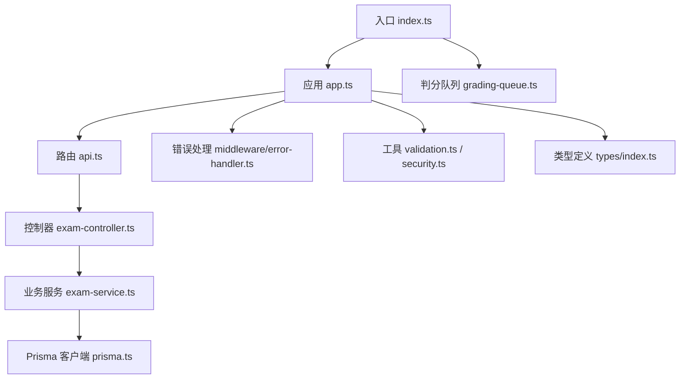
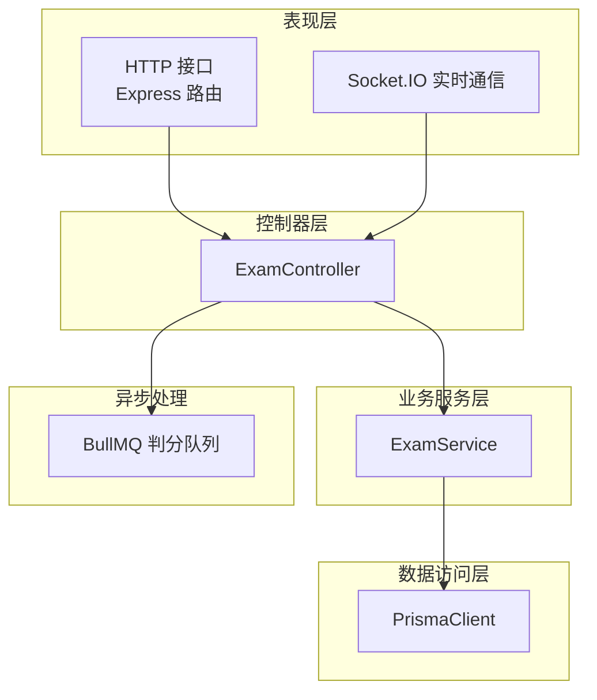
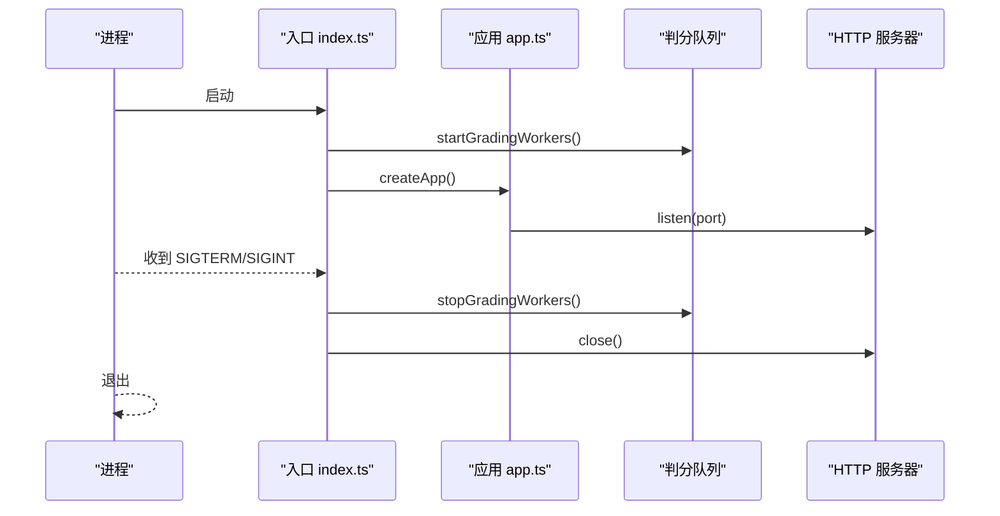
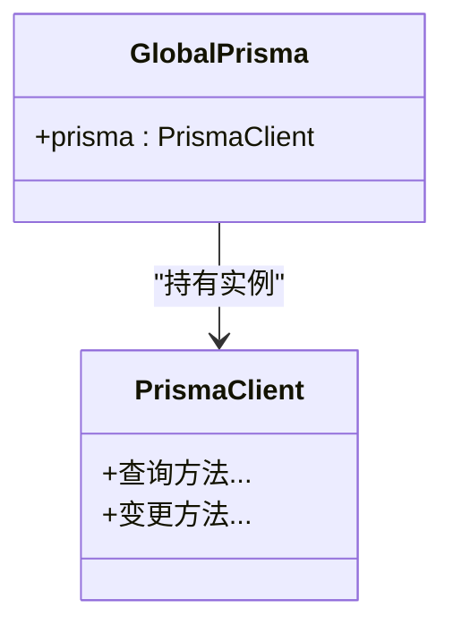
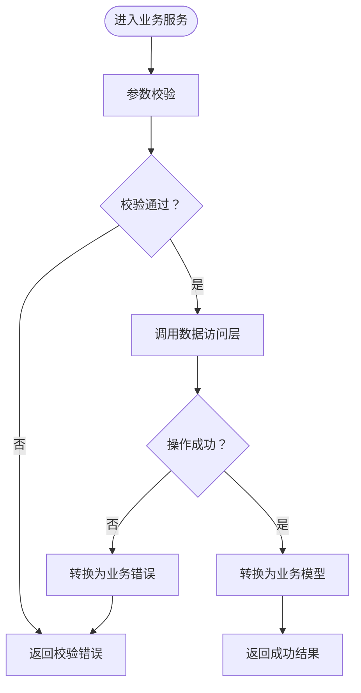
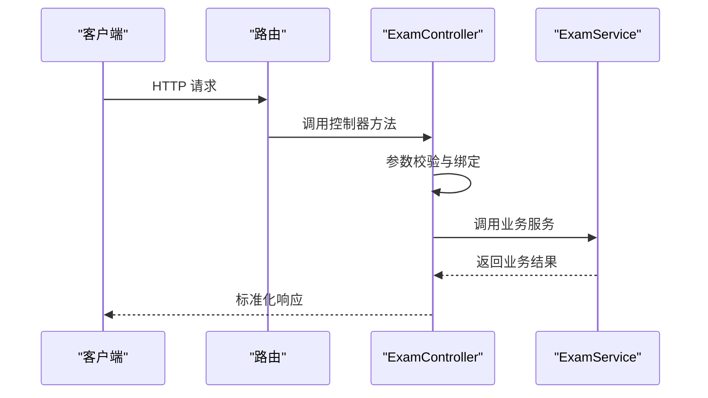
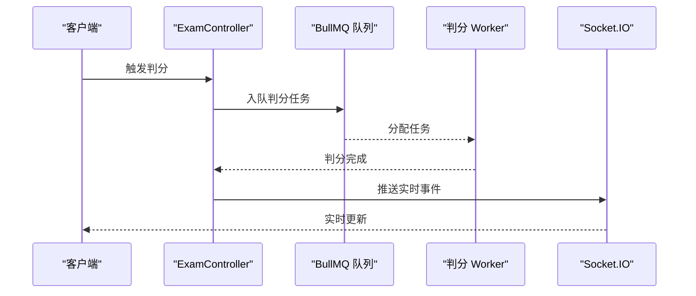
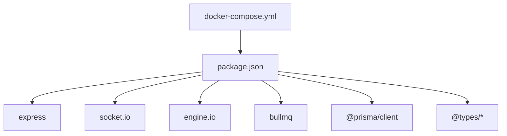

# 后端服务

<cite>
**本文引用的文件**
- [packages/server/src/index.ts](file://packages/server/src/index.ts)
- [packages/server/src/app.ts](file://packages/server/src/app.ts)
- [packages/server/src/config/prisma.ts](file://packages/server/src/config/prisma.ts)
- [packages/server/src/jobs/grading-queue.ts](file://packages/server/src/jobs/grading-queue.ts)
- [packages/server/src/middleware/error-handler.ts](file://packages/server/src/middleware/error-handler.ts)
- [packages/server/src/routes/api.ts](file://packages/server/src/routes/api.ts)
- [packages/server/src/services/exam-service.ts](file://packages/server/src/services/exam-service.ts)
- [packages/server/src/controllers/exam-controller.ts](file://packages/server/src/controllers/exam-controller.ts)
- [packages/server/src/utils/validation.ts](file://packages/server/src/utils/validation.ts)
- [packages/server/src/utils/security.ts](file://packages/server/src/utils/security.ts)
- [packages/server/src/types/index.ts](file://packages/server/src/types/index.ts)
- [docker-compose.yml](file://docker-compose.yml)
- [.gitignore](file://.gitignore)
- [package.json](file://package.json)
- [package-lock.json](file://package-lock.json)
</cite>

## 目录
1. [简介](#简介)
2. [项目结构](#项目结构)
3. [核心组件](#核心组件)
4. [架构总览](#架构总览)
5. [详细组件分析](#详细组件分析)
6. [依赖关系分析](#依赖关系分析)
7. [性能考虑](#性能考虑)
8. [故障排除指南](#故障排除指南)
9. [结论](#结论)
10. [附录](#附录)

## 简介
本项目是一个基于 Node.js 和 Express 的后端服务，采用模块化架构设计，包含 RESTful API、中间件体系、业务逻辑层与数据访问层（Prisma ORM）。系统还集成了 Socket.IO 实现实时通信，并通过 BullMQ 进行判分任务队列的异步处理。本文档面向开发者与运维人员，系统性阐述架构设计、组件职责、数据流、错误处理、安全控制、性能优化与监控方案。

## 项目结构
项目采用 monorepo 结构，核心后端位于 packages/server 目录，主要文件组织如下：
- 入口与应用启动：packages/server/src/index.ts
- 应用实例与路由注册：packages/server/src/app.ts
- 配置与环境变量：packages/server/src/config/prisma.ts
- 业务服务与控制器：packages/server/src/services/* 与 packages/server/src/controllers/*
- 中间件：packages/server/src/middleware/*
- 路由定义：packages/server/src/routes/api.ts
- 工具与类型：packages/server/src/utils/* 与 packages/server/src/types/*
- Docker 编排：docker-compose.yml
- 构建与依赖：package.json、package-lock.json
- 忽略项：.gitignore

图表来源
- [packages/server/src/index.ts:1-21](file://packages/server/src/index.ts#L1-L21)
- [packages/server/src/app.ts](file://packages/server/src/app.ts)
- [packages/server/src/routes/api.ts](file://packages/server/src/routes/api.ts)
- [packages/server/src/controllers/exam-controller.ts](file://packages/server/src/controllers/exam-controller.ts)
- [packages/server/src/services/exam-service.ts](file://packages/server/src/services/exam-service.ts)
- [packages/server/src/config/prisma.ts:1-9](file://packages/server/src/config/prisma.ts#L1-L9)
- [packages/server/src/jobs/grading-queue.ts](file://packages/server/src/jobs/grading-queue.ts)
- [packages/server/src/middleware/error-handler.ts](file://packages/server/src/middleware/error-handler.ts)
- [packages/server/src/utils/validation.ts](file://packages/server/src/utils/validation.ts)
- [packages/server/src/utils/security.ts](file://packages/server/src/utils/security.ts)
- [packages/server/src/types/index.ts](file://packages/server/src/types/index.ts)

章节来源
- [packages/server/src/index.ts:1-21](file://packages/server/src/index.ts#L1-L21)
- [packages/server/src/app.ts](file://packages/server/src/app.ts)
- [packages/server/src/routes/api.ts](file://packages/server/src/routes/api.ts)
- [packages/server/src/config/prisma.ts:1-9](file://packages/server/src/config/prisma.ts#L1-L9)
- [docker-compose.yml](file://docker-compose.yml)
- [.gitignore](file://.gitignore)
- [package.json](file://package.json)
- [package-lock.json:1003-1020](file://package-lock.json#L1003-L1020)

## 核心组件
- 应用入口与生命周期管理：负责启动 HTTP 服务器、初始化判分队列、处理优雅关闭信号。
- 应用实例与中间件：集中注册路由、全局中间件（如错误处理）、CORS、日志等。
- 数据访问层（Prisma）：提供类型安全的数据访问接口，支持开发环境下的全局单例模式以避免重复连接。
- 业务服务层：封装领域业务逻辑，协调数据访问与外部依赖。
- 控制器层：处理 HTTP 请求与响应，调用业务服务并返回标准化结果。
- 队列与实时通信：BullMQ 处理判分任务；Socket.IO 提供实时事件推送。
- 工具与安全：输入校验、安全策略、通用类型定义。

章节来源
- [packages/server/src/index.ts:1-21](file://packages/server/src/index.ts#L1-L21)
- [packages/server/src/app.ts](file://packages/server/src/app.ts)
- [packages/server/src/config/prisma.ts:1-9](file://packages/server/src/config/prisma.ts#L1-L9)
- [packages/server/src/services/exam-service.ts](file://packages/server/src/services/exam-service.ts)
- [packages/server/src/controllers/exam-controller.ts](file://packages/server/src/controllers/exam-controller.ts)
- [packages/server/src/jobs/grading-queue.ts](file://packages/server/src/jobs/grading-queue.ts)
- [packages/server/src/middleware/error-handler.ts](file://packages/server/src/middleware/error-handler.ts)
- [packages/server/src/utils/validation.ts](file://packages/server/src/utils/validation.ts)
- [packages/server/src/utils/security.ts](file://packages/server/src/utils/security.ts)
- [packages/server/src/types/index.ts](file://packages/server/src/types/index.ts)

## 架构总览
系统采用分层架构，自上而下为表现层（HTTP/Socket.IO）、控制器层、业务服务层、数据访问层（Prisma），并通过队列实现异步解耦。

图表来源
- [packages/server/src/app.ts](file://packages/server/src/app.ts)
- [packages/server/src/controllers/exam-controller.ts](file://packages/server/src/controllers/exam-controller.ts)
- [packages/server/src/services/exam-service.ts](file://packages/server/src/services/exam-service.ts)
- [packages/server/src/config/prisma.ts:1-9](file://packages/server/src/config/prisma.ts#L1-L9)
- [packages/server/src/jobs/grading-queue.ts](file://packages/server/src/jobs/grading-queue.ts)

## 详细组件分析

### 应用入口与生命周期
- 启动流程：创建应用实例，启动判分 Worker，监听配置端口。
- 优雅关闭：捕获 SIGTERM/SIGINT，停止判分 Worker 并关闭 HTTP 服务器。

图表来源
- [packages/server/src/index.ts:1-21](file://packages/server/src/index.ts#L1-L21)
- [packages/server/src/jobs/grading-queue.ts](file://packages/server/src/jobs/grading-queue.ts)

章节来源
- [packages/server/src/index.ts:1-21](file://packages/server/src/index.ts#L1-L21)

### 应用实例与中间件
- 中间件注册：统一错误处理、CORS、日志、限流等。
- 路由注册：集中挂载业务路由，便于扩展与维护。
- 安全中间件：统一鉴权、权限校验、请求头与速率限制。

章节来源
- [packages/server/src/app.ts](file://packages/server/src/app.ts)
- [packages/server/src/middleware/error-handler.ts](file://packages/server/src/middleware/error-handler.ts)
- [packages/server/src/utils/security.ts](file://packages/server/src/utils/security.ts)

### 数据访问层（Prisma）
- 单例模式：在非生产环境下将 PrismaClient 绑定到全局对象，避免重复实例化。
- 类型安全：通过 Prisma Client 提供编译期类型检查，降低运行时错误。
- 连接管理：遵循 Prisma 官方最佳实践，确保开发与生产环境的一致性。

图表来源
- [packages/server/src/config/prisma.ts:1-9](file://packages/server/src/config/prisma.ts#L1-L9)

章节来源
- [packages/server/src/config/prisma.ts:1-9](file://packages/server/src/config/prisma.ts#L1-L9)

### 业务服务层
- ExamService：封装考试相关业务逻辑，协调数据访问与外部依赖。
- 输入校验：在进入业务逻辑前进行参数校验，保证数据一致性。
- 错误处理：将底层异常转换为可读的业务错误，便于控制器与前端消费。

图表来源
- [packages/server/src/services/exam-service.ts](file://packages/server/src/services/exam-service.ts)
- [packages/server/src/utils/validation.ts](file://packages/server/src/utils/validation.ts)

章节来源
- [packages/server/src/services/exam-service.ts](file://packages/server/src/services/exam-service.ts)
- [packages/server/src/utils/validation.ts](file://packages/server/src/utils/validation.ts)

### 控制器层
- ExamController：处理 HTTP 请求，调用业务服务，返回标准化响应。
- 参数绑定：从请求体、查询参数或路径参数中提取数据。
- 响应格式：统一状态码、消息与数据结构，便于前端解析。

图表来源
- [packages/server/src/controllers/exam-controller.ts](file://packages/server/src/controllers/exam-controller.ts)
- [packages/server/src/routes/api.ts](file://packages/server/src/routes/api.ts)
- [packages/server/src/services/exam-service.ts](file://packages/server/src/services/exam-service.ts)

章节来源
- [packages/server/src/controllers/exam-controller.ts](file://packages/server/src/controllers/exam-controller.ts)
- [packages/server/src/routes/api.ts](file://packages/server/src/routes/api.ts)

### 队列与实时通信
- BullMQ 判分队列：异步执行判分任务，提高系统吞吐量与响应速度。
- Socket.IO：提供实时事件推送，支持考试状态更新、通知等场景。

图表来源
- [packages/server/src/jobs/grading-queue.ts](file://packages/server/src/jobs/grading-queue.ts)
- [packages/server/src/controllers/exam-controller.ts](file://packages/server/src/controllers/exam-controller.ts)

章节来源
- [packages/server/src/jobs/grading-queue.ts](file://packages/server/src/jobs/grading-queue.ts)
- [packages/server/src/controllers/exam-controller.ts](file://packages/server/src/controllers/exam-controller.ts)

### 错误处理与安全控制
- 统一错误处理：捕获业务异常与系统异常，返回一致的错误格式。
- 安全控制：鉴权中间件、请求头校验、防爆破与限流策略。
- 日志与审计：记录关键操作日志，便于问题追踪与合规审计。

章节来源
- [packages/server/src/middleware/error-handler.ts](file://packages/server/src/middleware/error-handler.ts)
- [packages/server/src/utils/security.ts](file://packages/server/src/utils/security.ts)

## 依赖关系分析
- 框架与运行时：Express、Socket.IO、Engine.IO、BullMQ。
- ORM：Prisma Client。
- 工具与类型：@types/express、@types/node 等。
- Docker：容器化部署与服务编排。

图表来源
- [package.json](file://package.json)
- [package-lock.json:1003-1020](file://package-lock.json#L1003-L1020)
- [package-lock.json:2627-2647](file://package-lock.json#L2627-L2647)
- [package-lock.json:4638-4655](file://package-lock.json#L4638-L4655)
- [docker-compose.yml](file://docker-compose.yml)

章节来源
- [package.json](file://package.json)
- [package-lock.json:1003-1020](file://package-lock.json#L1003-L1020)
- [package-lock.json:2627-2647](file://package-lock.json#L2627-L2647)
- [package-lock.json:4638-4655](file://package-lock.json#L4638-L4655)
- [docker-compose.yml](file://docker-compose.yml)

## 性能考虑
- 异步解耦：使用 BullMQ 将耗时任务（如判分）移出请求链路，提升响应速度。
- 连接池与缓存：合理配置数据库连接池与查询缓存，减少连接开销。
- 中间件优化：按需加载中间件，避免不必要的计算与 I/O。
- 实时通信：Socket.IO 使用高效传输协议，结合房间与命名空间降低广播压力。
- 监控与告警：集成指标采集（如 Prometheus 指标导出）与日志聚合，建立告警机制。

## 故障排除指南
- 启动失败：检查端口占用、环境变量与数据库连接字符串。
- Prisma 初始化异常：确认 Prisma 版本与数据库兼容性，检查 .env 配置。
- 队列堆积：监控队列长度与 Worker 健康状态，必要时扩容 Worker 或优化任务粒度。
- 实时通信断连：检查网络与代理设置，确认 CORS 与握手参数正确。
- 错误响应不一致：核对错误处理中间件是否生效，确保业务异常被正确捕获与转换。

章节来源
- [packages/server/src/middleware/error-handler.ts](file://packages/server/src/middleware/error-handler.ts)
- [packages/server/src/config/prisma.ts:1-9](file://packages/server/src/config/prisma.ts#L1-L9)
- [packages/server/src/jobs/grading-queue.ts](file://packages/server/src/jobs/grading-queue.ts)

## 结论
该后端服务通过清晰的分层架构、类型安全的 ORM、异步队列与实时通信，构建了高可用、可扩展的考试系统后端。配合完善的错误处理与安全控制，能够满足生产环境的稳定性与安全性要求。建议持续完善监控体系与自动化测试，进一步提升交付质量与运维效率。

## 附录
- 部署建议：使用 docker-compose 进行本地与生产环境编排，结合 Nginx 反向代理与 SSL 终止。
- 开发规范：统一代码风格、提交规范与分支策略；对敏感配置使用环境变量注入。
- 扩展方向：引入 GraphQL、微服务拆分、分布式缓存与消息队列增强。