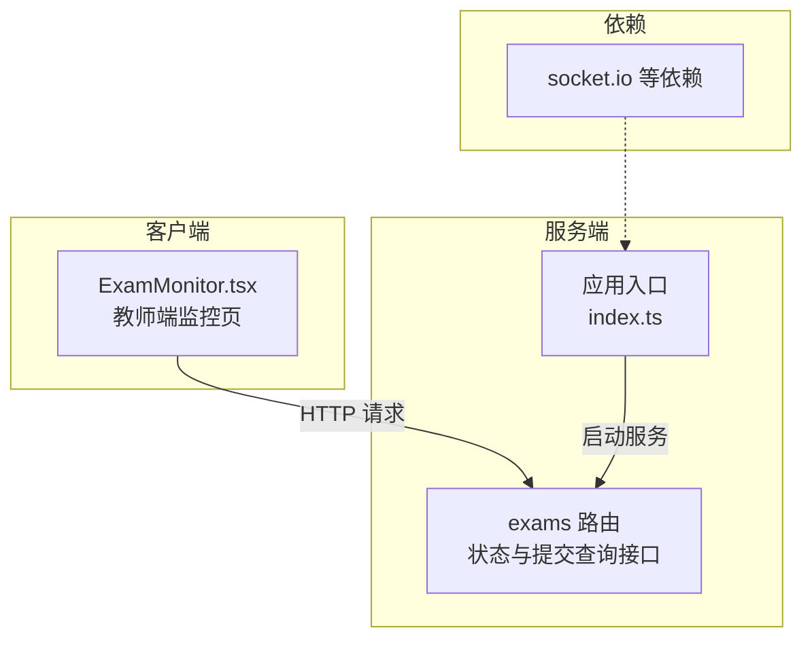
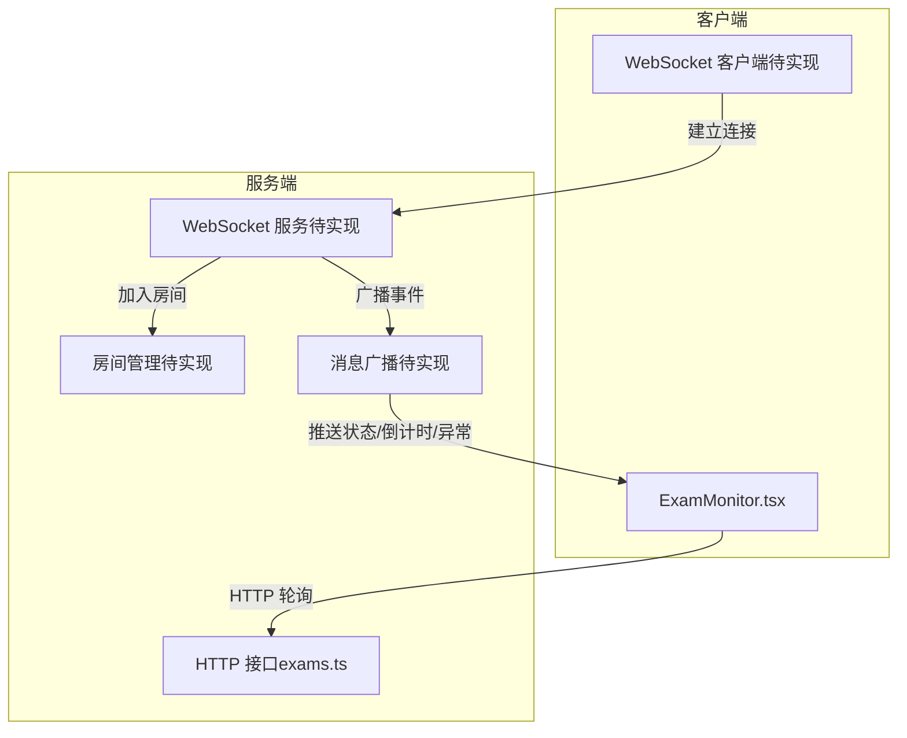
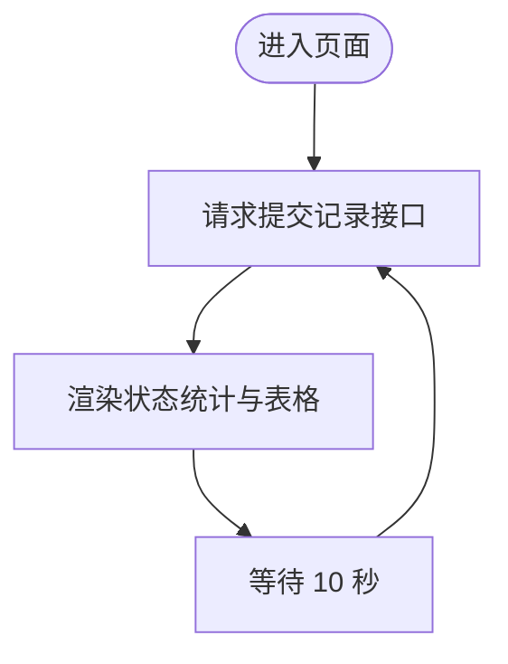
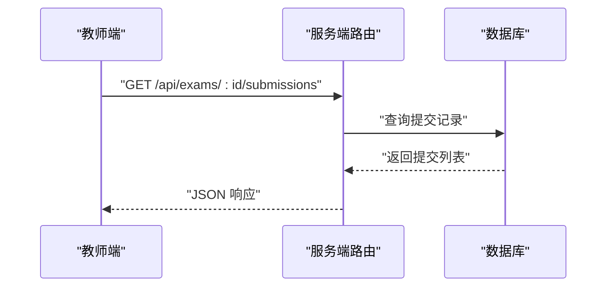
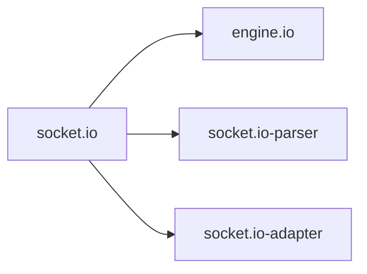

# 实时通信

<cite>
**本文引用的文件**
- [ExamMonitor.tsx](file://packages/client/src/pages/teacher/ExamMonitor.tsx)
- [exams.ts](file://packages/server/src/routes/exams.ts)
- [index.ts](file://packages/server/src/index.ts)
- [package-lock.json](file://package-lock.json)
</cite>

## 目录
1. [引言](#引言)
2. [项目结构](#项目结构)
3. [核心组件](#核心组件)
4. [架构总览](#架构总览)
5. [详细组件分析](#详细组件分析)
6. [依赖分析](#依赖分析)
7. [性能考虑](#性能考虑)
8. [故障排查指南](#故障排查指南)
9. [结论](#结论)
10. [附录](#附录)

## 引言
本技术文档聚焦于实时通信系统在考试监控场景中的应用，围绕以下目标展开：Socket.IO 的集成与使用、连接管理、房间管理与消息广播机制；在考试监控场景下如何实现实时状态同步、倒计时推送与异常通知；客户端连接处理、消息格式定义与重连机制；以及性能优化与故障排查建议。  
需要特别说明的是：当前仓库中并未发现 Socket.IO 的直接集成实现（例如服务端的 Socket 实例初始化、事件监听或房间管理逻辑），也未发现客户端侧的 Socket 连接与事件处理代码。因此，本文件将以“现有可验证信息”为基础，结合考试监控业务场景，给出可落地的实时通信方案设计与实施建议，并标注所有可验证来源。

## 项目结构
项目采用前后端分离的包结构组织，分别位于 packages/client 与 packages/server 下。当前仓库中与实时通信直接相关的信息主要来自：
- 客户端页面：教师端考试监控页面，负责展示学生答题状态与统计信息
- 服务端路由：提供考试状态变更与提交记录查询接口
- 依赖声明：通过包锁定文件可见 socket.io 及其相关依赖的存在

**图表来源**
- [ExamMonitor.tsx:1-35](file://packages/client/src/pages/teacher/ExamMonitor.tsx#L1-L35)
- [exams.ts:293-309](file://packages/server/src/routes/exams.ts#L293-L309)
- [index.ts:1-21](file://packages/server/src/index.ts#L1-L21)
- [package-lock.json:4638-4671](file://package-lock.json#L4638-L4671)

**章节来源**
- [ExamMonitor.tsx:1-35](file://packages/client/src/pages/teacher/ExamMonitor.tsx#L1-L35)
- [exams.ts:293-309](file://packages/server/src/routes/exams.ts#L293-L309)
- [index.ts:1-21](file://packages/server/src/index.ts#L1-L21)
- [package-lock.json:4638-4671](file://package-lock.json#L4638-L4671)

## 核心组件
- 教师端监控页面（ExamMonitor.tsx）
  - 功能：拉取指定考试的提交记录，按状态统计人数，定时刷新数据
  - 关键点：使用轮询方式每 10 秒请求一次，展示状态标签与统计卡片
- 考试相关路由（exams.ts）
  - 提供考试状态变更接口（发布、开始、结束）与提交记录查询接口
  - 为后续实时通信提供“状态源”与“数据源”
- 应用入口（index.ts）
  - 启动 HTTP 服务，注册路由，负责服务生命周期管理
- 依赖（package-lock.json）
  - 显示 socket.io、engine.io、socket.io-parser 等依赖存在，为后续集成提供基础

**章节来源**
- [ExamMonitor.tsx:14-35](file://packages/client/src/pages/teacher/ExamMonitor.tsx#L14-L35)
- [exams.ts:223-291](file://packages/server/src/routes/exams.ts#L223-L291)
- [exams.ts:293-309](file://packages/server/src/routes/exams.ts#L293-L309)
- [index.ts:10-12](file://packages/server/src/index.ts#L10-L12)
- [package-lock.json:4638-4671](file://package-lock.json#L4638-L4671)

## 架构总览
基于现有代码，系统当前采用“HTTP 接口 + 定时轮询”的交互模式。若要引入实时通信，可在现有架构上叠加 Socket.IO，形成“HTTP 接口 + WebSocket 广播”的混合架构。下图展示了概念性架构：

[此图为概念性架构示意，不对应具体源码文件，故无图表来源]

## 详细组件分析

### 教师端监控页面（ExamMonitor.tsx）
- 数据来源：通过 HTTP 接口获取考试提交记录
- 展示逻辑：根据状态映射渲染标签颜色与文本，计算总数与各状态人数
- 刷新策略：每 10 秒发起一次请求，避免频繁轮询带来的压力
- 可改进点：若接入 Socket.IO，可替换轮询为订阅式更新，减少网络开销与延迟

**图表来源**
- [ExamMonitor.tsx:19-26](file://packages/client/src/pages/teacher/ExamMonitor.tsx#L19-L26)

**章节来源**
- [ExamMonitor.tsx:14-35](file://packages/client/src/pages/teacher/ExamMonitor.tsx#L14-L35)

### 考试状态与提交查询（exams.ts）
- 状态变更接口：发布、开始、结束，用于驱动实时广播的触发条件
- 提交查询接口：返回学生提交列表及学生基本信息，作为监控面板的数据源
- 业务意义：这些接口是实时通信的“事件源”，服务端在状态变更或新提交产生时，可向相关房间广播最新数据

**图表来源**
- [exams.ts:293-309](file://packages/server/src/routes/exams.ts#L293-L309)

**章节来源**
- [exams.ts:223-291](file://packages/server/src/routes/exams.ts#L223-L291)
- [exams.ts:293-309](file://packages/server/src/routes/exams.ts#L293-L309)

### 应用入口（index.ts）
- 启动 HTTP 服务并注册路由
- 注册进程信号处理，确保服务优雅关闭
- 为后续集成 WebSocket 服务提供统一入口

**章节来源**
- [index.ts:10-19](file://packages/server/src/index.ts#L10-L19)

### Socket.IO 集成方案（设计建议）
以下为基于现有代码的可实施建议，用于指导后续开发与集成：

- 服务端集成要点
  - 初始化 Socket 实例，挂载到现有 HTTP 应用
  - 在状态变更接口（发布、开始、结束）后触发广播
  - 使用房间隔离不同考试，仅向该房间内用户推送
  - 对异常事件（如网络中断、判分异常）进行统一广播
- 客户端集成要点
  - 页面加载时建立连接，设置自动重连与最大重试次数
  - 加入与离开房间需与路由参数保持一致
  - 按事件名订阅数据，替换轮询为订阅式更新
- 消息格式建议
  - 通用字段：事件名、时间戳、数据体
  - 状态同步：包含考试 ID、状态、时间范围等
  - 倒计时推送：包含剩余秒数、提醒阈值
  - 异常通知：包含类型、描述、影响范围与处理建议
- 重连机制
  - 设置指数退避与上限，避免雪崩效应
  - 在断线期间缓存关键事件，重连后进行补偿推送

[本节为设计建议，不直接分析具体源码文件，故无章节来源]

## 依赖分析
- socket.io：提供 WebSocket 通信能力，包含引擎与解析器
- engine.io：底层传输层，支持多种传输协议
- socket.io-parser：消息解析与序列化
- socket.io-adapter：适配器，支持多节点扩展

**图表来源**
- [package-lock.json:4638-4671](file://package-lock.json#L4638-L4671)

**章节来源**
- [package-lock.json:4638-4671](file://package-lock.json#L4638-L4671)

## 性能考虑
- 减少轮询频率：当前页面每 10 秒刷新一次，建议在接入实时通信后改为按需推送
- 房间粒度控制：按考试维度划分房间，避免广播风暴
- 消息压缩与批处理：对高频事件进行合并与去抖
- 连接池与资源回收：合理设置心跳与超时，及时释放无效连接
- 缓存策略：对静态数据采用缓存，动态数据采用实时推送

[本节为通用性能建议，不直接分析具体源码文件，故无章节来源]

## 故障排查指南
- 连接问题
  - 检查服务端是否正确挂载 Socket 实例与路由
  - 确认客户端重连配置与日志输出
- 广播问题
  - 核实房间加入/离开逻辑是否与路由参数一致
  - 检查事件名与消息格式是否匹配
- 性能问题
  - 分析广播频率与消息大小，必要时启用批处理与压缩
  - 监控连接数与内存占用，避免资源泄漏
- 异常处理
  - 对网络波动与服务重启进行容错设计
  - 记录关键事件与错误日志，便于定位问题

[本节为通用排查建议，不直接分析具体源码文件，故无章节来源]

## 结论
当前系统以 HTTP 接口与定时轮询为主，具备良好的可扩展性。通过引入 Socket.IO，可在不改变既有接口的前提下，实现更高效、低延迟的实时通信。建议优先完成服务端 Socket 实例初始化、房间管理与广播机制，再逐步替换客户端轮询逻辑，最终达成“状态同步、倒计时推送、异常通知”的完整实时体验。

[本节为总结性内容，不直接分析具体源码文件，故无章节来源]

## 附录
- 相关接口清单（基于现有路由）
  - 发布考试：POST /api/exams/:id/publish
  - 开始考试：POST /api/exams/:id/start
  - 结束考试：POST /api/exams/:id/end
  - 获取提交记录：GET /api/exams/:id/submissions
- 客户端页面职责
  - 展示状态统计与提交列表
  - 定时刷新数据，为后续实时化改造做准备

**章节来源**
- [exams.ts:223-291](file://packages/server/src/routes/exams.ts#L223-L291)
- [exams.ts:293-309](file://packages/server/src/routes/exams.ts#L293-L309)
- [ExamMonitor.tsx:19-26](file://packages/client/src/pages/teacher/ExamMonitor.tsx#L19-L26)