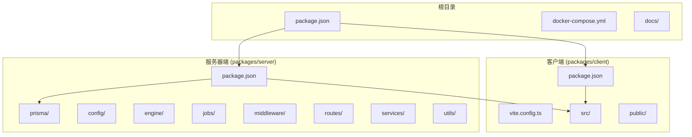
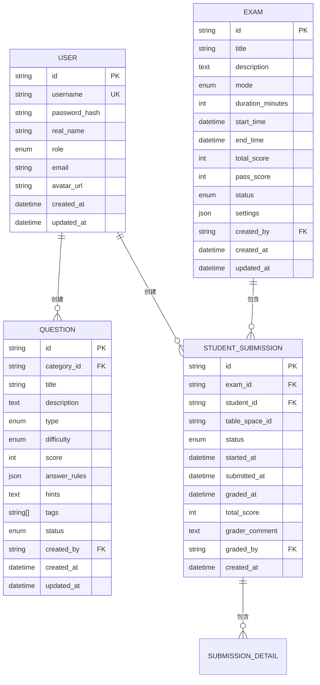
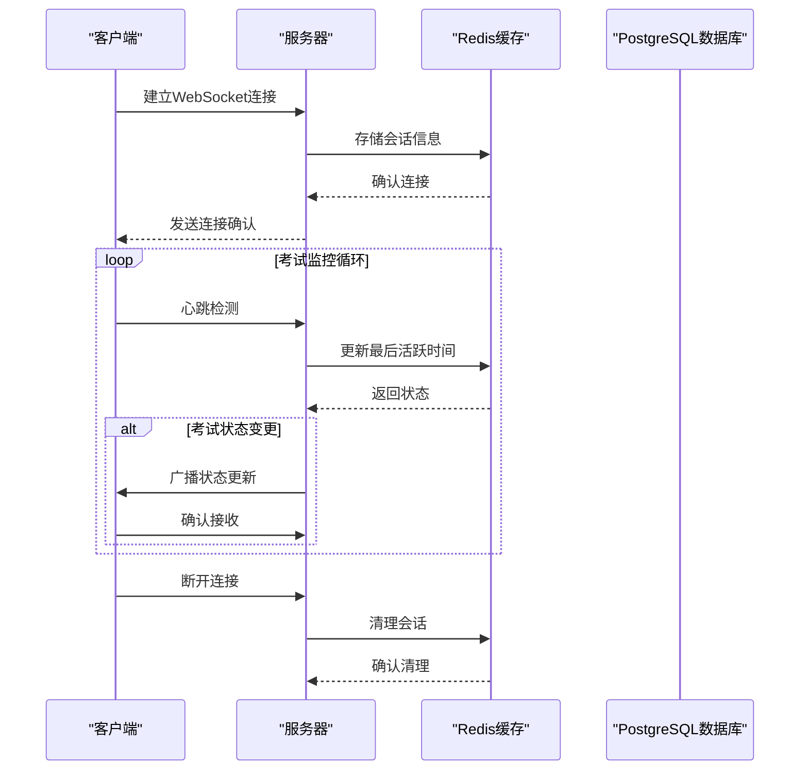
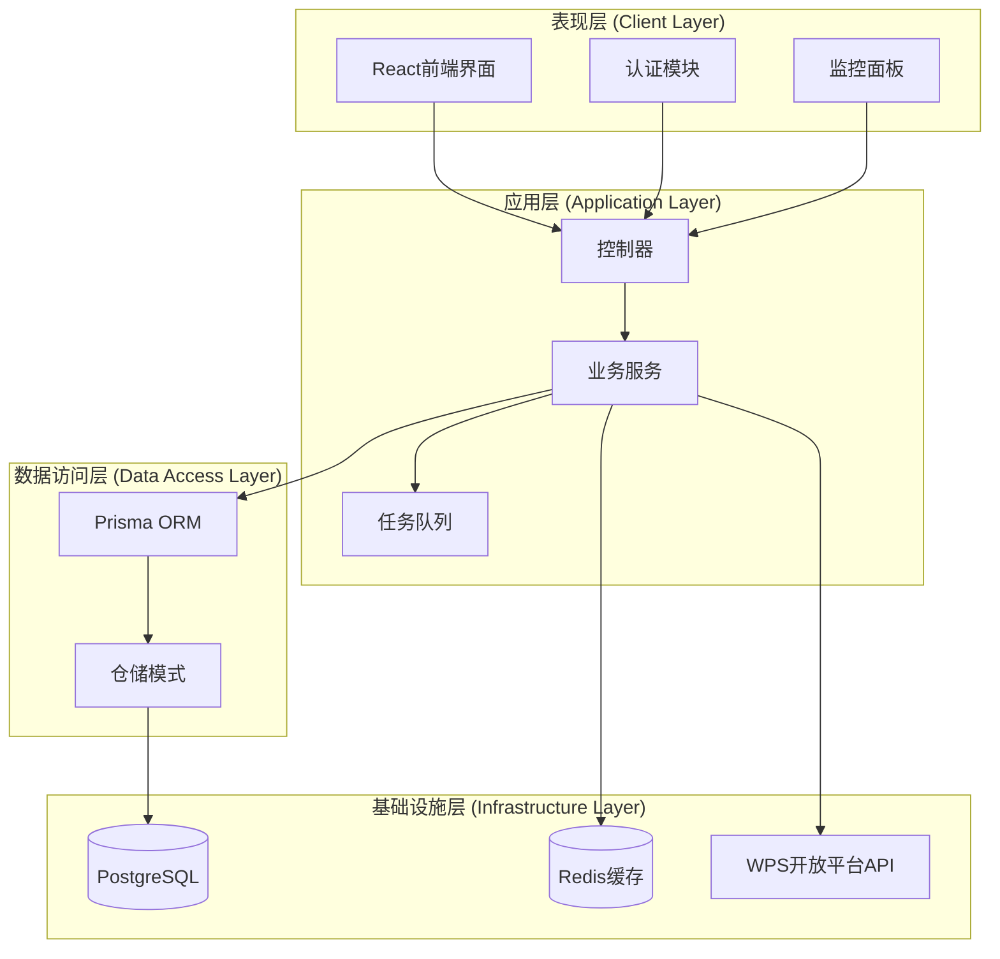
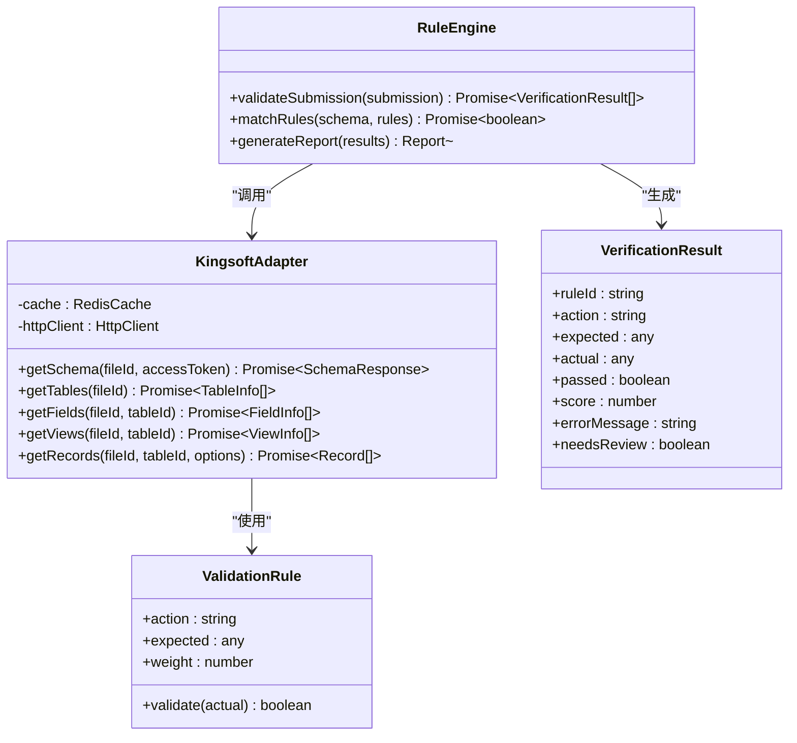
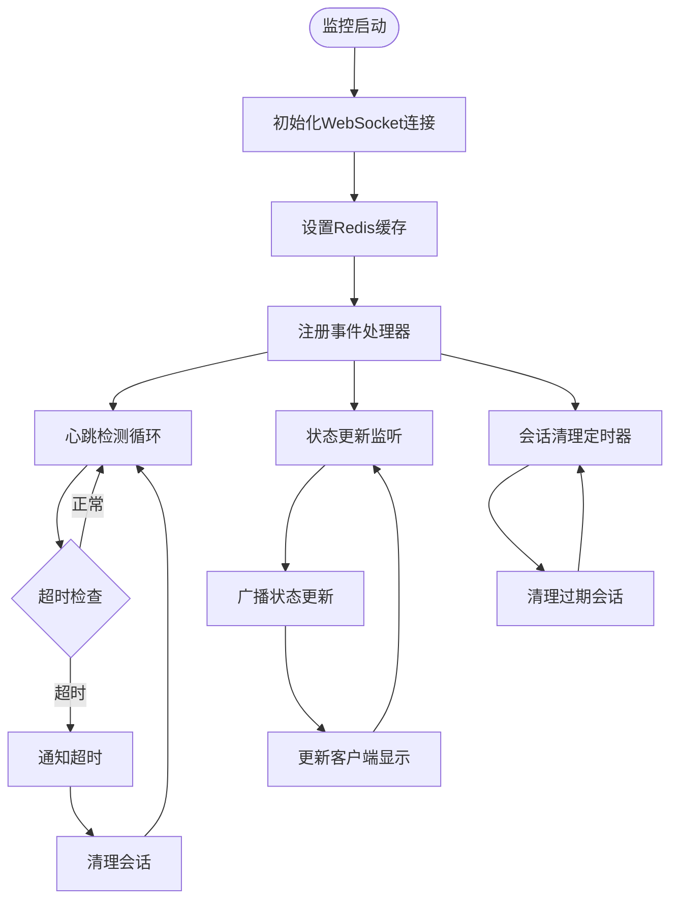
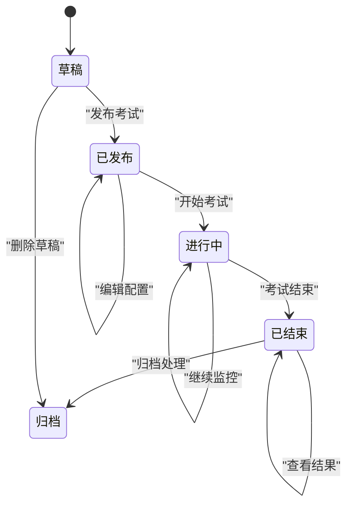

# 实时监控系统

<cite>
**本文档引用的文件**
- [package.json](file://package.json)
- [docker-compose.yml](file://docker-compose.yml)
- [kingsoft-api-reference.md](file://docs/kingsoft-api-reference.md)
- [vite.config.ts](file://packages/client/vite.config.ts)
- [tsconfig.json](file://packages/server/tsconfig.json)
- [app.ts](file://packages/server/src/app.ts)
- [index.ts](file://packages/server/src/index.ts)
- [schema.prisma](file://packages/server/prisma/schema.prisma)
- [package.json](file://packages/client/package.json)
- [package.json](file://packages/server/package.json)
</cite>

## 目录
1. [简介](#简介)
2. [项目结构](#项目结构)
3. [核心组件](#核心组件)
4. [架构概览](#架构概览)
5. [详细组件分析](#详细组件分析)
6. [依赖关系分析](#依赖关系分析)
7. [性能考虑](#性能考虑)
8. [故障排除指南](#故障排除指南)
9. [结论](#结论)

## 简介

这是一个基于金山多维表格的实时监控系统，专为在线考试设计。系统采用现代化的技术栈，包括 React 前端、Express 后端、PostgreSQL 数据库和 Redis 缓存，实现了完整的考试管理、实时监控和自动评分功能。

该系统的核心特色是与金山多维表格的深度集成，通过 WPS 开放平台 API 实现对学生成绩表的实时监控和自动验证。系统支持多种考试模式，包括练习、测验和正式考试，并提供了完整的权限管理和实时通信功能。

## 项目结构

项目采用 Monorepo 架构，分为客户端和服务器端两个独立的工作空间：



**图表来源**
- [package.json:1-26](file://package.json#L1-L26)
- [docker-compose.yml:1-37](file://docker-compose.yml#L1-L37)

**章节来源**
- [package.json:1-26](file://package.json#L1-L26)
- [docker-compose.yml:1-37](file://docker-compose.yml#L1-L37)

## 核心组件

### 数据模型架构

系统使用 Prisma ORM 定义了完整的数据模型，涵盖了用户管理、题目管理、考试组织和实时监控等核心业务领域：



**图表来源**
- [schema.prisma:60-243](file://packages/server/prisma/schema.prisma#L60-L243)

### 实时通信架构

系统集成了 Socket.IO 实现实时监控功能，支持考试过程中的实时状态更新和通知推送：



**图表来源**
- [index.ts:1-29](file://packages/server/src/index.ts#L1-L29)
- [app.ts:15-44](file://packages/server/src/app.ts#L15-L44)

**章节来源**
- [schema.prisma:1-243](file://packages/server/prisma/schema.prisma#L1-L243)
- [index.ts:1-29](file://packages/server/src/index.ts#L1-L29)
- [app.ts:15-44](file://packages/server/src/app.ts#L15-L44)

## 架构概览

系统采用分层架构设计，确保了良好的可维护性和扩展性：



**图表来源**
- [app.ts:1-44](file://packages/server/src/app.ts#L1-L44)
- [package.json:6-16](file://package.json#L6-L16)

## 详细组件分析

### 金山多维表格集成组件

系统的核心创新在于与金山多维表格的深度集成，通过专门的适配器实现：



**图表来源**
- [kingsoft-api-reference.md:540-560](file://docs/kingsoft-api-reference.md#L540-L560)

### 实时监控组件

系统实现了多层次的实时监控机制：



**图表来源**
- [index.ts:10-14](file://packages/server/src/index.ts#L10-L14)
- [app.ts:22-25](file://packages/server/src/app.ts#L22-L25)

### 考试管理组件

系统提供了完整的考试生命周期管理：



**图表来源**
- [schema.prisma:44-50](file://packages/server/prisma/schema.prisma#L44-L50)

**章节来源**
- [kingsoft-api-reference.md:503-571](file://docs/kingsoft-api-reference.md#L503-L571)
- [index.ts:10-14](file://packages/server/src/index.ts#L10-L14)
- [app.ts:22-25](file://packages/server/src/app.ts#L22-L25)

## 依赖关系分析

系统使用了现代化的依赖管理策略，确保了开发效率和运行稳定性：

```mermaid
graph LR
subgraph "客户端依赖"
React[react@^18.3.1]
AntD[antd@^5.18.0]
Axios[axios@^1.7.2]
SocketIO[socket.io-client@^4.8.3]
Zustand[zustand@^4.5.2]
end
subgraph "服务器端依赖"
Express[express@^4.19.2]
Prisma[@prisma/client@^5.14.0]
BullMQ[bullmq@^5.78.0]
SocketIO[socket.io@^4.7.5]
Redis[ioredis@^5.11.1]
JWT[jsonwebtoken@^9.0.2]
end
subgraph "开发工具"
TypeScript[typescript@^5.4.0]
Vite[vite@^5.3.0]
PrismaCLI[prisma@^5.14.0]
end
React --> AntD
React --> Axios
React --> SocketIO
React --> Zustand
Express --> Prisma
Express --> BullMQ
Express --> SocketIO
Express --> Redis
Express --> JWT
```

**图表来源**
- [package.json:21-24](file://packages/server/package.json#L21-L24)
- [package.json:11-22](file://packages/client/package.json#L11-L22)

**章节来源**
- [package.json:21-35](file://packages/server/package.json#L21-L35)
- [package.json:11-31](file://packages/client/package.json#L11-L31)

## 性能考虑

系统在设计时充分考虑了性能优化，采用了多种策略来确保高并发下的稳定运行：

### 缓存策略
- 使用 Redis 缓存频繁访问的数据，减少数据库压力
- 实现智能缓存失效机制，确保数据一致性
- 对 Schema 查询结果进行长期缓存

### 连接池管理
- PostgreSQL 连接池配置，支持高并发查询
- Redis 连接池优化，提升缓存性能
- Socket.IO 连接池管理，支持大量并发连接

### 异步处理
- BullMQ 任务队列处理耗时操作
- 异步评分处理，避免阻塞主线程
- 批量数据处理优化

## 故障排除指南

### 常见问题诊断

**数据库连接问题**
- 检查 DATABASE_URL 环境变量配置
- 验证 PostgreSQL 服务状态
- 确认网络连接和防火墙设置

**实时监控异常**
- 检查 Redis 服务可用性
- 验证 WebSocket 连接状态
- 监控 Socket.IO 事件处理

**API 调用失败**
- 验证 WPS 开放平台凭据
- 检查请求签名和时间戳
- 确认访问令牌有效性

**性能问题排查**
- 监控数据库查询执行时间
- 检查 Redis 缓存命中率
- 分析内存使用情况

**章节来源**
- [docker-compose.yml:15-19](file://docker-compose.yml#L15-L19)
- [docker-compose.yml:28-32](file://docker-compose.yml#L28-L32)

## 结论

实时监控系统是一个功能完整、架构清晰的现代化考试管理平台。系统通过以下关键特性实现了高效的实时监控：

1. **深度集成**：与金山多维表格的无缝集成，实现了真正的实时监控
2. **技术先进**：采用最新的前端和后端技术栈，确保系统的现代性和可维护性
3. **性能优化**：通过缓存、异步处理和连接池等技术手段，保证了高并发下的稳定运行
4. **扩展性强**：模块化的架构设计，便于功能扩展和定制化开发

该系统为在线教育提供了强大的技术支持，特别是在实时监控和自动评分方面展现了卓越的能力。通过持续的优化和改进，系统能够满足各种规模的在线考试需求。