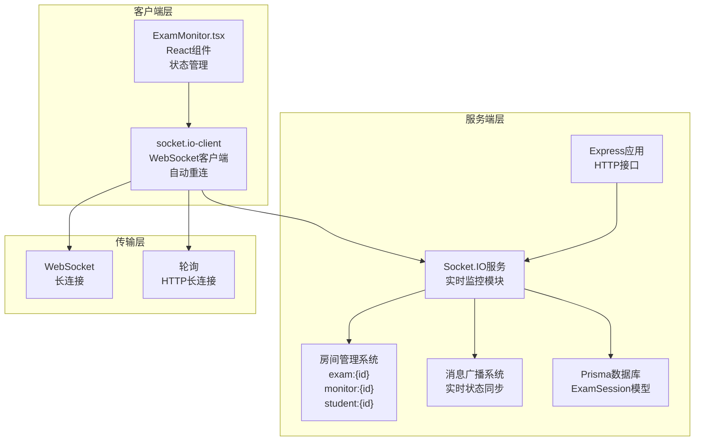
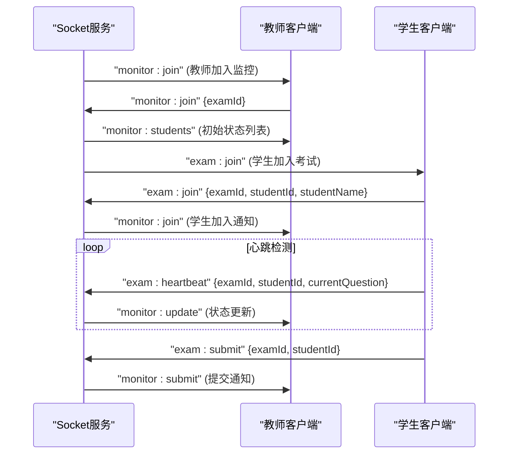
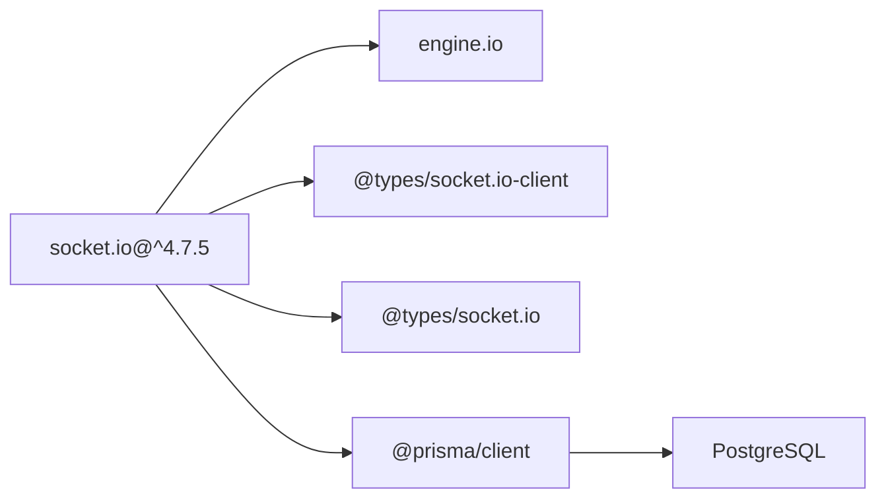

# 实时通信

<cite>
**本文档引用的文件**
- [socket.ts](file://packages/server/src/services/socket.ts)
- [ExamMonitor.tsx](file://packages/client/src/pages/teacher/ExamMonitor.tsx)
- [exams.ts](file://packages/server/src/routes/exams.ts)
- [index.ts](file://packages/server/src/index.ts)
- [schema.prisma](file://packages/server/prisma/schema.prisma)
- [package.json](file://packages/server/package.json)
- [package-lock.json](file://package-lock.json)
</cite>

## 更新摘要
**所做更改**
- 新增完整的Socket.IO服务实现章节，包含服务端初始化、事件协议和房间管理
- 更新客户端连接处理章节，详细说明WebSocket连接管理和实时状态同步机制
- 新增实时状态同步功能章节，涵盖心跳检测、在线状态管理和异常处理
- 更新架构总览图，展示完整的实时通信架构
- 新增事件协议规范和消息格式定义
- 更新故障排查指南，增加WebSocket连接相关问题诊断

## 目录
1. [引言](#引言)
2. [项目结构](#项目结构)
3. [核心组件](#核心组件)
4. [架构总览](#架构总览)
5. [详细组件分析](#详细组件分析)
6. [事件协议与消息格式](#事件协议与消息格式)
7. [实时状态同步机制](#实时状态同步机制)
8. [依赖分析](#依赖分析)
9. [性能考虑](#性能考虑)
10. [故障排查指南](#故障排查指南)
11. [结论](#结论)
12. [附录](#附录)

## 引言
本技术文档全面介绍实时通信系统在考试监控场景中的应用实现。系统基于Socket.IO构建，实现了完整的实时状态同步、心跳检测、在线状态管理和异常通知功能。文档详细说明了服务端Socket.IO集成、WebSocket连接管理、房间隔离机制以及客户端实时状态同步的完整实现方案。

**更新** 新增完整的Socket.IO服务实现，包括事件协议定义、房间管理机制和实时状态同步功能。

## 项目结构
项目采用前后端分离架构，实时通信功能通过Socket.IO实现。当前仓库中已包含完整的实时通信实现：

```mermaid
graph TB
subgraph "客户端"
CM["ExamMonitor.tsx<br/>教师端监控页<br/>WebSocket客户端"]
end
subgraph "服务端"
SOCK["socket.ts<br/>Socket.IO服务<br/>实时监控模块"]
API["exams.ts<br/>考试路由<br/>HTTP接口"]
APP["index.ts<br/>应用入口<br/>Socket.IO初始化"]
PRISMA["schema.prisma<br/>ExamSession模型<br/>会话状态"]
end
subgraph "依赖"
SOCKETIO["socket.io@^4.7.5<br/>WebSocket通信"]
EIO["engine.io<br/>传输层"]
CLIENT["socket.io-client<br/>客户端库"]
END
CM --> |"WebSocket连接"| SOCK
SOCK --> |"房间广播"| CM
APP --> |"初始化Socket.IO"| SOCK
SOCK --> |"Prisma查询"| PRISMA
```

**图表来源**
- [socket.ts:1-191](file://packages/server/src/services/socket.ts#L1-L191)
- [ExamMonitor.tsx:1-189](file://packages/client/src/pages/teacher/ExamMonitor.tsx#L1-L189)
- [exams.ts:1-310](file://packages/server/src/routes/exams.ts#L1-L310)
- [index.ts:1-29](file://packages/server/src/index.ts#L1-L29)
- [schema.prisma:226-242](file://packages/server/prisma/schema.prisma#L226-L242)

**章节来源**
- [socket.ts:1-191](file://packages/server/src/services/socket.ts#L1-L191)
- [ExamMonitor.tsx:1-189](file://packages/client/src/pages/teacher/ExamMonitor.tsx#L1-L189)
- [exams.ts:1-310](file://packages/server/src/routes/exams.ts#L1-L310)
- [index.ts:1-29](file://packages/server/src/index.ts#L1-L29)
- [schema.prisma:226-242](file://packages/server/prisma/schema.prisma#L226-L242)

## 核心组件
- **Socket.IO服务模块**（socket.ts）
  - 完整的实时监控服务实现，包含事件协议定义和房间管理
  - 支持学生加入、心跳检测、提交通知和状态广播
  - 集成Prisma数据库，实现会话状态持久化
- **教师端监控页面**（ExamMonitor.tsx）
  - 基于React的实时监控界面，支持WebSocket连接和状态同步
  - 实现心跳发送、状态更新接收和异常处理
  - 兼容HTTP轮询作为后备机制
- **考试路由系统**（exams.ts）
  - 提供考试状态管理的HTTP接口
  - 为实时通信提供状态变更触发点
- **应用入口**（index.ts）
  - 初始化HTTP服务器和Socket.IO实例
  - 统一的服务启动和优雅关闭流程

**章节来源**
- [socket.ts:1-191](file://packages/server/src/services/socket.ts#L1-L191)
- [ExamMonitor.tsx:1-189](file://packages/client/src/pages/teacher/ExamMonitor.tsx#L1-L189)
- [exams.ts:223-291](file://packages/server/src/routes/exams.ts#L223-L291)
- [index.ts:10-19](file://packages/server/src/index.ts#L10-L19)

## 架构总览
系统采用"HTTP接口 + WebSocket实时通信"的混合架构，实现了完整的实时监控解决方案：



**图表来源**
- [socket.ts:36-161](file://packages/server/src/services/socket.ts#L36-L161)
- [ExamMonitor.tsx:44-105](file://packages/client/src/pages/teacher/ExamMonitor.tsx#L44-L105)
- [index.ts:10-11](file://packages/server/src/index.ts#L10-L11)

## 详细组件分析

### Socket.IO服务模块（socket.ts）
**更新** 完整实现了Socket.IO服务模块，包含事件协议、房间管理和实时状态同步功能。

- **服务初始化**
  - 创建Socket.IO实例并配置CORS策略
  - 监听连接事件，建立客户端连接管理
  - 初始化全局学生状态存储结构

- **房间管理机制**
  - 考试房间：`exam:{examId}` - 所有参与考试的学生
  - 教师监控房间：`monitor:{examId}` - 负责监控的教师
  - 学生个人房间：`student:{studentId}` - 单个学生的私有通道

- **事件处理流程**
  - `exam:join` - 学生加入考试，加入相应房间
  - `monitor:join` - 教师加入监控，获取当前状态
  - `exam:heartbeat` - 心跳检测，更新在线状态
  - `exam:submit` - 提交通知，广播提交状态



**图表来源**
- [socket.ts:44-157](file://packages/server/src/services/socket.ts#L44-L157)

**章节来源**
- [socket.ts:1-191](file://packages/server/src/services/socket.ts#L1-L191)

### 教师端监控页面（ExamMonitor.tsx）
**更新** 完善了WebSocket连接管理和实时状态同步实现。

- **WebSocket连接管理**
  - 使用socket.io-client建立WebSocket连接
  - 支持WebSocket和轮询两种传输方式
  - 实现自动重连机制和连接状态显示

- **实时状态同步**
  - 监听`monitor:students`获取初始状态
  - 处理`monitor:update`实时更新学生状态
  - 监听`monitor:submit`和`monitor:join`事件
  - 合并实时数据与HTTP轮询数据

- **状态管理**
  - 使用React状态管理实时数据
  - 实现状态映射和可视化展示
  - 支持在线状态指示和异常标记

```mermaid
flowchart TD
Start(["页面加载"]) --> Connect["建立WebSocket连接"]
Connect --> Connected{"连接成功?"}
Connected --> |是| Join["发送monitor:join"]
Connected --> |否| Polling["启用HTTP轮询"]
Join --> ReceiveStudents["接收monitor:students"]
ReceiveStudents --> Render["渲染初始状态"]
loop 实时更新
ReceiveUpdate["接收monitor:update"] --> UpdateState["更新学生状态"]
UpdateState --> Render
end
Polling --> PeriodicFetch["定期HTTP请求"]
PeriodicFetch --> Render
```

**图表来源**
- [ExamMonitor.tsx:44-105](file://packages/client/src/pages/teacher/ExamMonitor.tsx#L44-L105)

**章节来源**
- [ExamMonitor.tsx:1-189](file://packages/client/src/pages/teacher/ExamMonitor.tsx#L1-L189)

### 考试状态与提交查询（exams.ts）
- **状态管理接口**
  - 发布考试：`POST /api/exams/:id/publish`
  - 开始考试：`POST /api/exams/:id/start`
  - 结束考试：`POST /api/exams/:id/end`
  - 获取提交记录：`GET /api/exams/:id/submissions`

- **业务意义**
  - 为实时通信提供状态变更触发点
  - 服务端状态变更后可触发相关广播
  - 与实时监控功能形成完整的状态同步链路

**章节来源**
- [exams.ts:223-291](file://packages/server/src/routes/exams.ts#L223-L291)
- [exams.ts:293-309](file://packages/server/src/routes/exams.ts#L293-L309)

### 应用入口（index.ts）
**更新** 新增Socket.IO初始化和优雅关闭处理。

- **Socket.IO初始化**
  - 创建HTTP服务器并传入Socket.IO实例
  - 在应用启动时初始化WebSocket服务
  - 输出Socket.IO就绪日志

- **服务管理**
  - 启动BullMQ判分Worker
  - 注册进程信号处理，实现优雅关闭
  - 统一的服务器启动和停止流程

**章节来源**
- [index.ts:10-19](file://packages/server/src/index.ts#L10-L19)

## 事件协议与消息格式
**新增** 完整定义了Socket.IO事件协议和消息格式规范。

### 客户端→服务端事件
- `exam:join` - 学生加入考试
  - 参数：`{ examId: string, studentId: string, studentName: string }`
  - 功能：加入考试房间，初始化学生状态

- `monitor:join` - 教师加入监控
  - 参数：`{ examId: string }`
  - 功能：加入监控房间，获取当前状态列表

- `exam:heartbeat` - 心跳检测
  - 参数：`{ examId: string, studentId: string, currentQuestion?: number, tabSwitchCount?: number }`
  - 功能：更新最后心跳时间，同步当前状态

- `exam:submit` - 提交通知
  - 参数：`{ examId: string, studentId: string, studentName: string }`
  - 功能：通知考试提交，触发相关处理

### 服务端→客户端事件
- `monitor:students` - 学生状态列表
  - 参数：`LiveStudent[]` 数组
  - 功能：教师首次连接时发送的初始状态

- `monitor:join` - 学生加入通知
  - 参数：`{ studentId: string, studentName: string, online: boolean }`
  - 功能：新学生加入时的通知

- `monitor:update` - 状态更新
  - 参数：`{ studentId: string, studentName: string, currentQuestion: number, tabSwitchCount: number, lastHeartbeat: Date, online: boolean }`
  - 功能：实时状态同步更新

- `monitor:submit` - 提交通知
  - 参数：`{ studentId: string, studentName: string, submittedAt: Date }`
  - 功能：学生提交时的通知

**章节来源**
- [socket.ts:4-15](file://packages/server/src/services/socket.ts#L4-L15)

## 实时状态同步机制
**新增** 详细说明了实时状态同步的实现机制。

### 心跳检测与在线状态管理
- **心跳机制**
  - 学生端定期发送`exam:heartbeat`事件
  - 服务端更新`lastHeartbeat`和`online`状态
  - 超过60秒无心跳标记为离线

- **状态存储**
  - 内存中维护`examStudents`映射表
  - 结构：`Map<examId, Map<studentId, StudentState>>`
  - 实时更新学生状态信息

- **数据库同步**
  - 通过Prisma更新ExamSession表
  - 记录`lastHeartbeat`和`wsConnected`状态
  - 支持会话状态持久化

### 房间管理与消息广播
- **房间隔离**
  - 考试房间：`exam:{examId}` - 所有参与者
  - 监控房间：`monitor:{examId}` - 教师监控
  - 个人房间：`student:{studentId}` - 私有通道

- **广播策略**
  - 使用`io.to(room).emit()`进行定向广播
  - 避免跨房间信息泄露
  - 支持多房间同时加入

### 异常处理与容错机制
- **连接异常**
  - 自动重连机制，指数退避策略
  - 断线期间状态缓存，重连后补偿
  - 连接状态可视化显示

- **数据一致性**
  - HTTP轮询作为WebSocket后备
  - 状态合并策略，避免数据冲突
  - 错误日志记录和监控

**章节来源**
- [socket.ts:101-157](file://packages/server/src/services/socket.ts#L101-L157)
- [ExamMonitor.tsx:80-102](file://packages/client/src/pages/teacher/ExamMonitor.tsx#L80-L102)

## 依赖分析
**更新** 新增Socket.IO相关依赖的详细分析。

### 核心依赖
- **socket.io@^4.7.5** - 主要的WebSocket通信库
  - 提供实时双向通信能力
  - 支持多种传输协议（WebSocket、轮询）
  - 内置房间管理和广播机制

- **engine.io** - 底层传输层
  - 支持多种传输协议实现
  - 提供连接升级和降级机制
  - 处理连接状态管理

### 数据库集成
- **@prisma/client** - 数据库ORM
  - 支持ExamSession模型的CRUD操作
  - 实现会话状态的持久化存储
  - 提供类型安全的数据库访问

### 开发依赖
- **@types/socket.io** - 类型定义
- **@types/engine.io** - 类型定义
- **@types/socket.io-client** - 类型定义



**图表来源**
- [package.json:13-33](file://packages/server/package.json#L13-L33)

**章节来源**
- [package.json:13-33](file://packages/server/package.json#L13-L33)
- [package-lock.json:2866-2883](file://package-lock.json#L2866-L2883)

## 性能考虑
**更新** 新增WebSocket实时通信的性能优化建议。

### 连接管理优化
- **连接池管理**
  - 合理设置连接超时和心跳间隔
  - 避免过多并发连接造成资源浪费
  - 实施连接数限制和监控

- **传输协议选择**
  - 优先使用WebSocket，降级到轮询
  - 根据网络环境动态调整传输方式
  - 减少不必要的协议切换开销

### 消息优化策略
- **消息压缩**
  - 对大数据量消息进行压缩传输
  - 实施消息合并和批处理机制
  - 去除冗余字段，精简消息格式

- **房间粒度控制**
  - 按考试维度划分房间，避免广播风暴
  - 实施房间容量限制和清理机制
  - 优化房间查找和消息路由效率

### 内存和CPU优化
- **状态缓存管理**
  - 实施LRU缓存策略管理学生状态
  - 定期清理过期状态和断开连接
  - 监控内存使用情况，防止内存泄漏

- **数据库访问优化**
  - 批量更新ExamSession状态
  - 实施数据库连接池管理
  - 优化查询语句和索引使用

## 故障排查指南
**更新** 新增WebSocket连接和实时通信相关的故障排查方法。

### 连接问题诊断
- **WebSocket连接失败**
  - 检查CORS配置是否允许跨域访问
  - 验证服务器端口和防火墙设置
  - 确认客户端传输协议支持情况

- **连接不稳定**
  - 检查网络环境和代理设置
  - 监控服务器负载和资源使用
  - 查看WebSocket握手过程的日志

### 业务逻辑问题
- **状态不同步**
  - 验证房间加入逻辑是否正确
  - 检查事件名称和参数格式
  - 确认消息广播的房间标识

- **心跳检测异常**
  - 检查客户端心跳发送频率
  - 验证服务端状态更新逻辑
  - 监控数据库ExamSession更新情况

### 性能问题排查
- **高延迟问题**
  - 分析WebSocket连接建立时间
  - 监控消息处理队列长度
  - 检查数据库查询性能

- **内存泄漏**
  - 监控连接数量和状态缓存
  - 检查事件监听器是否正确移除
  - 验证房间清理机制是否正常工作

### 日志和监控
- **服务端日志**
  - 启用详细的Socket.IO日志
  - 监控连接事件和错误日志
  - 记录关键业务事件的时间戳

- **客户端调试**
  - 使用浏览器开发者工具监控WebSocket
  - 检查事件收发的时序和内容
  - 验证自动重连机制的工作状态

## 结论
系统已成功实现完整的实时通信解决方案，基于Socket.IO构建了高效的实时监控系统。通过事件协议标准化、房间管理和消息广播机制，实现了考试监控场景下的实时状态同步、心跳检测和异常通知功能。

**主要成就**：
- 完整的Socket.IO服务实现，支持多种传输协议
- 实时状态同步机制，包括心跳检测和在线状态管理
- 房间隔离和消息广播系统，确保数据安全和传输效率
- 客户端WebSocket连接管理，支持自动重连和状态同步

**未来优化方向**：
- 实施集群部署和Socket.IO适配器
- 优化消息压缩和批量处理机制
- 增强异常处理和监控告警功能
- 实现更精细的状态同步和冲突解决机制

## 附录
### 事件协议完整清单
- **学生端事件**
  - `exam:join` - `{ examId, studentId, studentName }`
  - `exam:heartbeat` - `{ examId, studentId, currentQuestion, tabSwitchCount }`
  - `exam:submit` - `{ examId, studentId, studentName }`

- **教师端事件**
  - `monitor:join` - `{ examId }`

- **服务端广播事件**
  - `monitor:students` - `LiveStudent[]`
  - `monitor:join` - `{ studentId, studentName, online }`
  - `monitor:update` - `{ studentId, studentName, currentQuestion, tabSwitchCount, lastHeartbeat, online }`
  - `monitor:submit` - `{ studentId, studentName, submittedAt }`

### 数据模型关联
- **ExamSession模型**
  - `wsConnected: Boolean` - WebSocket连接状态
  - `lastHeartbeat: DateTime` - 最后心跳时间
  - 与User、Exam、StudentSubmission关联

**章节来源**
- [socket.ts:4-15](file://packages/server/src/services/socket.ts#L4-L15)
- [schema.prisma:226-242](file://packages/server/prisma/schema.prisma#L226-L242)
- [ExamMonitor.tsx:16-27](file://packages/client/src/pages/teacher/ExamMonitor.tsx#L16-L27)