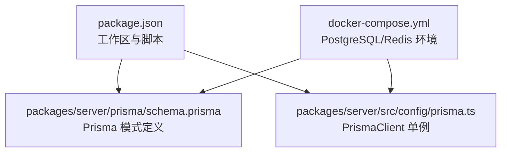
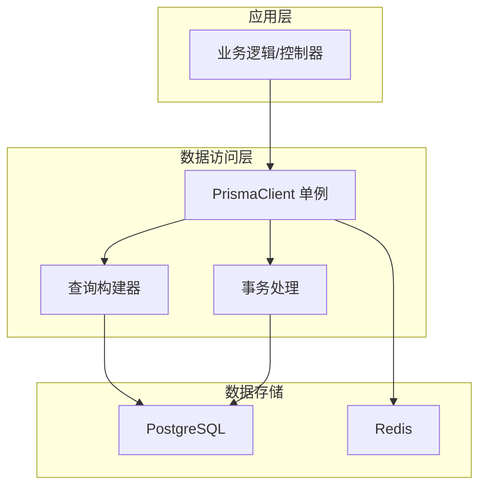
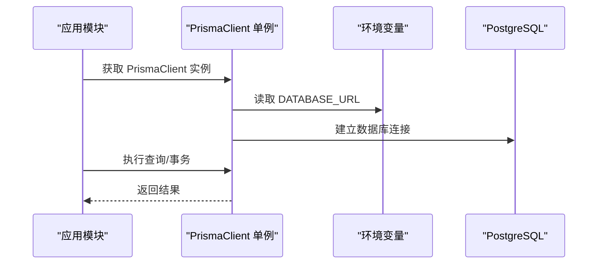
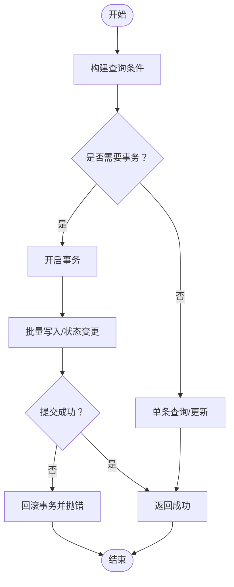
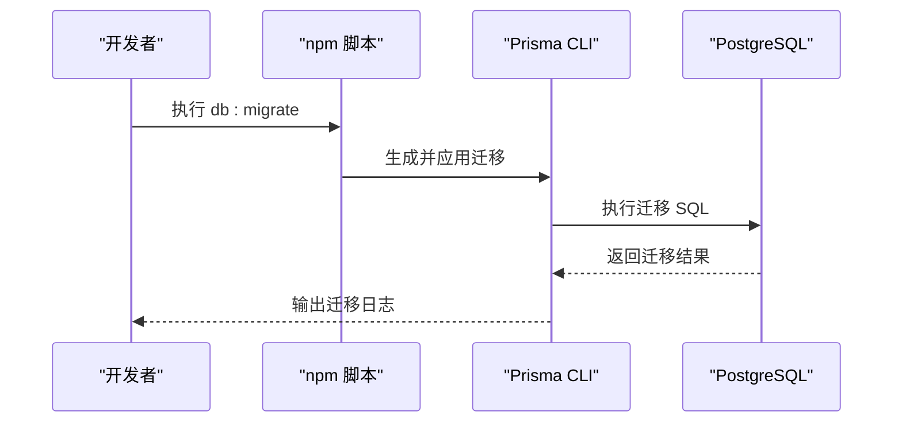
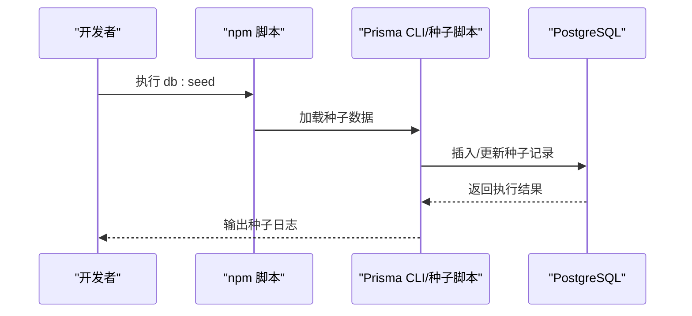
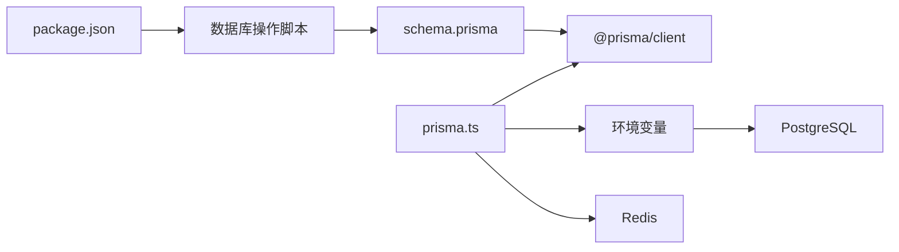

# 数据访问层

<cite>
**本文引用的文件**
- [package.json](file://package.json)
- [docker-compose.yml](file://docker-compose.yml)
- [schema.prisma](file://packages/server/prisma/schema.prisma)
- [prisma.ts](file://packages/server/src/config/prisma.ts)
</cite>

## 目录
1. [简介](#简介)
2. [项目结构](#项目结构)
3. [核心组件](#核心组件)
4. [架构总览](#架构总览)
5. [详细组件分析](#详细组件分析)
6. [依赖分析](#依赖分析)
7. [性能考虑](#性能考虑)
8. [故障排除指南](#故障排除指南)
9. [结论](#结论)
10. [附录](#附录)

## 简介
本文件聚焦于考试系统的数据访问层，基于 Prisma ORM 的配置与使用进行系统化技术文档整理。内容涵盖数据库连接管理、查询构建、事务处理、实体关系模型、数据迁移与种子数据管理、查询优化与索引设计、性能监控方案以及最佳实践与常见问题解决方案。本文所有技术细节均来源于仓库中现有的 Prisma 配置与模式定义文件。

## 项目结构
围绕数据访问层的关键文件组织如下：
- Prisma 模式定义：定义了完整的领域模型、枚举类型、字段约束与关系映射
- Prisma 客户端初始化：在应用中以单例方式提供 PrismaClient 实例
- 工作区脚本：通过 npm workspaces 在 packages/server 中执行数据库相关命令
- Docker Compose：提供 PostgreSQL 与 Redis 的本地开发环境



**图表来源**
- [package.json:1-26](file://package.json#L1-L26)
- [schema.prisma:1-243](file://packages/server/prisma/schema.prisma#L1-L243)
- [prisma.ts:1-10](file://packages/server/src/config/prisma.ts#L1-L10)
- [docker-compose.yml:1-37](file://docker-compose.yml#L1-L37)

**章节来源**
- [package.json:1-26](file://package.json#L1-L26)
- [docker-compose.yml:1-37](file://docker-compose.yml#L1-L37)

## 核心组件
- Prisma 模式定义（schema.prisma）
  - 定义了用户、题目分类、题目、考试、学生提交、提交详情、验证结果、会话等核心模型
  - 使用枚举类型统一管理状态与分类（如角色、题型、难度、考试模式、提交状态等）
  - 明确字段长度、默认值、唯一性与外键约束，并通过 relation 关联形成完整的 ER 模型
- Prisma 客户端初始化（prisma.ts）
  - 采用全局单例模式避免重复实例化，开发环境下将实例挂载到全局对象以支持 HMR
  - 通过环境变量注入数据库连接字符串，确保运行时可配置

**章节来源**
- [schema.prisma:1-243](file://packages/server/prisma/schema.prisma#L1-L243)
- [prisma.ts:1-10](file://packages/server/src/config/prisma.ts#L1-L10)

## 架构总览
下图展示了数据访问层的整体交互：应用通过 PrismaClient 访问数据库；Docker Compose 提供 PostgreSQL 与 Redis 的后端服务；工作区脚本用于迁移与种子数据管理。



**图表来源**
- [prisma.ts:1-10](file://packages/server/src/config/prisma.ts#L1-L10)
- [schema.prisma:1-243](file://packages/server/prisma/schema.prisma#L1-L243)
- [docker-compose.yml:1-37](file://docker-compose.yml#L1-L37)

## 详细组件分析

### 实体关系模型（ER）
- 用户（User）：支持管理员、教师、学生三种角色；与题目创建、考试创建、提交、阅卷、会话关联
- 题目分类（QuestionCategory）：支持树形父子关系；与题目关联
- 题目（Question）：包含题型、难度、分数、答案规则、标签、状态等；与分类、创建者、考试与提交详情关联
- 考试（Exam）：包含模式（练习/测验/正式）、时间、总分、及格分、状态等；与创建者、题目、提交、会话关联
- 学生提交（StudentSubmission）：记录一次考试的答题提交；与考试、学生、阅卷人、详情、会话关联
- 提交详情（SubmissionDetail）：记录每道题的答案与得分；与提交、题目、验证结果关联
- 验证结果（VerificationResult）：记录评分规则执行结果；与提交详情、提交关联
- 会话（ExamSession）：记录考生在线状态与心跳；与提交、学生、考试关联

```mermaid
erDiagram
USER {
uuid id PK
varchar username UK
varchar password_hash
varchar real_name
enum role
varchar email
varchar avatar_url
timestamp created_at
timestamp updated_at
}
QUESTION_CATEGORY {
uuid id PK
varchar name
uuid parent_id FK
int sort_order
timestamp created_at
}
QUESTION {
uuid id PK
uuid category_id FK
varchar title
text description
enum type
enum difficulty
int score
json answer_rules
text hints
varchar_array tags
enum status
uuid created_by FK
timestamp created_at
timestamp updated_at
}
EXAM {
uuid id PK
varchar title
text description
enum mode
int duration_minutes
timestamp start_time
timestamp end_time
int total_score
int pass_score
enum status
json settings
uuid created_by FK
timestamp created_at
timestamp updated_at
}
EXAM_QUESTION {
uuid id PK
uuid exam_id FK
uuid question_id FK
int sort_order
int score_override
}
STUDENT_SUBMISSION {
uuid id PK
uuid exam_id FK
uuid student_id FK
varchar table_space_id
enum status
timestamp started_at
timestamp submitted_at
timestamp graded_at
int total_score
text grader_comment
uuid graded_by FK
timestamp created_at
}
SUBMISSION_DETAIL {
uuid id PK
uuid submission_id FK
uuid question_id FK
json answer_json
int score
boolean is_correct
timestamp created_at
}
VERIFICATION_RESULT {
uuid id PK
uuid submission_detail_id FK
uuid submission_id FK
varchar rule_id
varchar action
json expected
json actual
boolean passed
int score
text error_message
boolean needs_review
timestamp verified_at
}
EXAM_SESSION {
uuid id PK
uuid submission_id UK FK
uuid student_id FK
uuid exam_id FK
boolean ws_connected
timestamp last_heartbeat
inet ip_address
timestamp created_at
}
USER ||--o{ QUESTION : "创建"
USER ||--o{ EXAM : "创建"
USER ||--o{ STUDENT_SUBMISSION : "作答/阅卷"
QUESTION_CATEGORY ||--o{ QUESTION : "包含"
EXAM ||--o{ EXAM_QUESTION : "包含"
EXAM_QUESTION ||--|| QUESTION : "引用"
EXAM ||--o{ STUDENT_SUBMISSION : "产生"
STUDENT_SUBMISSION ||--o{ SUBMISSION_DETAIL : "包含"
SUBMISSION_DETAIL ||--o{ VERIFICATION_RESULT : "验证"
STUDENT_SUBMISSION ||--|| EXAM_SESSION : "对应"
EXAM_SESSION ||--|| USER : "学生"
EXAM_SESSION ||--|| EXAM : "考试"
```

**图表来源**
- [schema.prisma:60-242](file://packages/server/prisma/schema.prisma#L60-L242)

**章节来源**
- [schema.prisma:60-242](file://packages/server/prisma/schema.prisma#L60-L242)

### 数据库连接管理
- 连接来源：通过环境变量注入数据库连接字符串，确保在不同环境（开发/测试/生产）可灵活切换
- 客户端生命周期：采用单例模式，避免重复连接与资源浪费；开发模式下缓存至全局对象以支持热重载
- 依赖外部服务：PostgreSQL 由 Docker Compose 提供，包含健康检查与持久化卷



**图表来源**
- [prisma.ts:1-10](file://packages/server/src/config/prisma.ts#L1-L10)
- [schema.prisma:7-10](file://packages/server/prisma/schema.prisma#L7-L10)
- [docker-compose.yml:4-19](file://docker-compose.yml#L4-L19)

**章节来源**
- [prisma.ts:1-10](file://packages/server/src/config/prisma.ts#L1-L10)
- [schema.prisma:7-10](file://packages/server/prisma/schema.prisma#L7-L10)
- [docker-compose.yml:4-19](file://docker-compose.yml#L4-L19)

### 查询构建与事务处理
- 查询构建：基于 Prisma Client 的类型安全查询接口，支持过滤、排序、分页、聚合与关系展开
- 事务处理：使用 Prisma 的事务 API 包裹多个写操作，保证一致性；适用于批量插入、评分与状态更新等场景
- 错误处理：对异常进行捕获与分类，结合业务语义返回合适的错误码与消息



[此流程图为通用实现建议，不直接映射具体源文件]

### 数据迁移策略
- 迁移命令：通过工作区脚本在 packages/server 中执行数据库迁移
- 迁移流程：基于 Prisma 的迁移机制生成 SQL 并应用到目标数据库，保持模式演进的可追踪性
- 版本控制：迁移文件纳入版本控制，确保团队协作一致



**图表来源**
- [package.json:10-10](file://package.json#L10-L10)

**章节来源**
- [package.json:10-10](file://package.json#L10-L10)

### 种子数据管理
- 种子命令：通过工作区脚本在 packages/server 中执行种子数据导入
- 设计原则：先清理或保留必要的初始数据，再按依赖顺序插入基础枚举、字典与初始用户/题库/考试模板
- 可重复性：种子脚本应幂等，避免重复执行导致的数据冲突



**图表来源**
- [package.json:11-11](file://package.json#L11-L11)

**章节来源**
- [package.json:11-11](file://package.json#L11-L11)

### 查询优化与索引设计
- 字段选择与投影：仅查询必要字段，减少网络传输与序列化开销
- 索引策略：对高频过滤与连接字段建立索引（如唯一用户名、外键、状态与时间范围字段）
- 分页与游标：使用游标分页降低深度偏移带来的性能损耗
- 缓存：对静态或低频变更数据使用 Redis 缓存，减轻数据库压力
- 批量操作：合并多次写入为批量操作，减少往返次数

[本节为通用优化建议，不直接引用具体源文件]

### 性能监控方案
- 数据库指标：监控慢查询、连接数、锁等待与表扫描
- 应用侧埋点：记录查询耗时、事务时延与错误率
- 告警阈值：为关键路径设置合理的超时与错误率阈值
- 定期审计：定期审查索引使用情况与查询计划

[本节为通用监控建议，不直接引用具体源文件]

## 依赖分析
- 外部依赖
  - Prisma Client：提供类型安全的数据库访问能力
  - PostgreSQL：作为主数据库，由 Docker Compose 提供
  - Redis：用于会话与缓存（根据模式中的 inet 字段与会话模型推断）
- 内部依赖
  - 工作区脚本：集中管理数据库相关命令
  - 模式文件：定义数据模型与关系，驱动 Prisma Client 生成



**图表来源**
- [prisma.ts:1-10](file://packages/server/src/config/prisma.ts#L1-L10)
- [schema.prisma:1-243](file://packages/server/prisma/schema.prisma#L1-L243)
- [package.json:6-16](file://package.json#L6-L16)

**章节来源**
- [prisma.ts:1-10](file://packages/server/src/config/prisma.ts#L1-L10)
- [schema.prisma:1-243](file://packages/server/prisma/schema.prisma#L1-L243)
- [package.json:6-16](file://package.json#L6-L16)

## 性能考虑
- 合理使用关系加载：避免 N+1 查询，优先使用 include 或 select 投影
- 控制事务范围：尽量缩短事务持续时间，避免长时间持有行锁
- 利用数据库特性：针对 JSON 字段使用合适的数据类型与查询方式
- 监控与调优：结合数据库与应用侧指标，持续优化热点查询与写入路径

[本节提供通用指导，不直接引用具体源文件]

## 故障排除指南
- 连接失败
  - 检查 DATABASE_URL 是否正确，确认 Postgres 服务已启动并通过健康检查
  - 校验凭据与数据库名称是否匹配
- 迁移失败
  - 查看迁移日志，定位失败的 SQL 语句
  - 确认数据库权限与网络连通性
- 查询异常
  - 检查字段映射与枚举值是否匹配
  - 排查关系字段的外键约束与唯一性
- 开发体验
  - 使用 Prisma Studio 可视化浏览数据与模式
  - 在开发环境中启用日志输出以便调试

**章节来源**
- [docker-compose.yml:4-19](file://docker-compose.yml#L4-L19)
- [package.json:11-13](file://package.json#L11-L13)

## 结论
本数据访问层以 Prisma ORM 为核心，结合明确的实体关系模型与严格的枚举约束，提供了类型安全且可维护的数据访问能力。通过单例客户端、工作区脚本与容器化环境，实现了从开发到部署的一致性与可重复性。建议在后续迭代中完善索引策略、引入缓存与监控体系，并持续优化热点查询与事务处理，以进一步提升系统整体性能与稳定性。

## 附录
- 常用命令
  - 同时启动前端与后端：npm run dev
  - 启动后端服务：npm run dev:server
  - 启动前端服务：npm run dev:client
  - 数据库迁移：npm run db:migrate
  - 导入种子数据：npm run db:seed
  - 打开 Prisma Studio：npm run db:studio
  - 启动容器：npm run docker:up
  - 停止容器：npm run docker:down

**章节来源**
- [package.json:6-16](file://package.json#L6-L16)