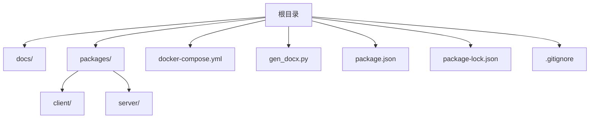
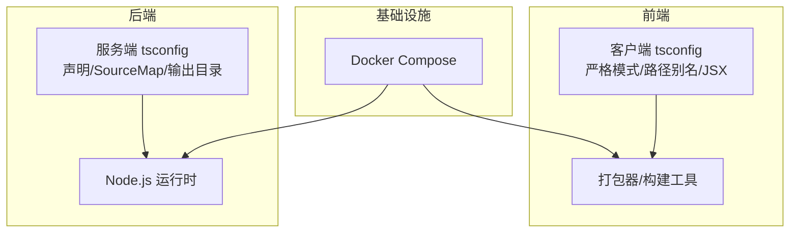
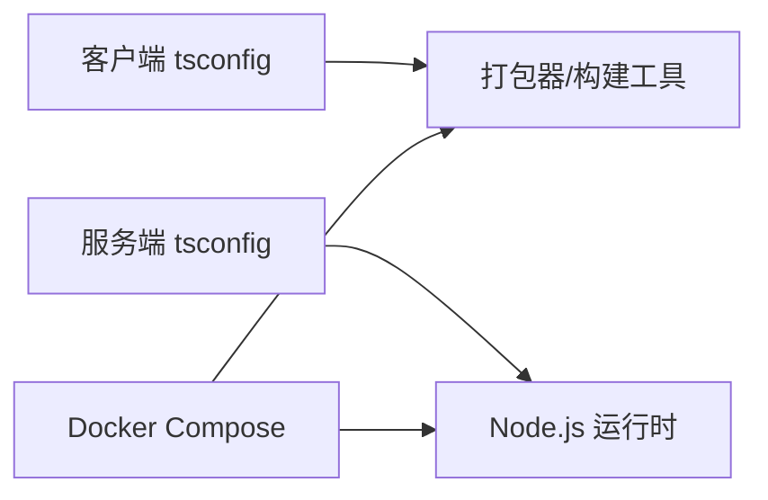

# 代码规范

<cite>
**本文引用的文件**
- [docker-compose.yml](file://docker-compose.yml)
- [gen_docx.py](file://gen_docx.py)
- [packages/client/tsconfig.json](file://packages/client/tsconfig.json)
- [packages/server/tsconfig.json](file://packages/server/tsconfig.json)
</cite>

## 目录
1. [引言](#引言)
2. [项目结构](#项目结构)
3. [核心组件](#核心组件)
4. [架构总览](#架构总览)
5. [详细组件分析](#详细组件分析)
6. [依赖分析](#依赖分析)
7. [性能考虑](#性能考虑)
8. [故障排查指南](#故障排查指南)
9. [结论](#结论)
10. [附录](#附录)

## 引言
本文件旨在为考试系统仓库建立统一的代码规范，覆盖以下方面：
- TypeScript 编码规范与编译选项
- React 组件开发规范（基于现有配置）
- Node.js 后端开发规范（基于现有配置）
- 命名约定、文件组织结构与代码格式化标准
- ESLint 配置说明、Prettier 格式化规则与 TypeScript 编译选项
- 代码注释规范、错误处理模式与日志记录标准
- Git 提交消息格式、代码审查检查清单与质量门禁标准
- 前端 UI 一致性规范与后端架构约束

说明：当前仓库中未发现独立的 ESLint/Prettier 配置文件与前端/后端源代码，因此本规范在无明确配置的情况下提供通用建议与最佳实践，并以现有 tsconfig 作为基础约束。

## 项目结构
仓库采用多包（monorepo）布局，包含客户端与服务端两个包，以及 Docker 编排文件与文档生成脚本。下图展示顶层结构与关键文件的关系。

图表来源
- [docker-compose.yml](file://docker-compose.yml)
- [gen_docx.py](file://gen_docx.py)

章节来源
- [docker-compose.yml](file://docker-compose.yml)
- [gen_docx.py](file://gen_docx.py)

## 核心组件
- 客户端 TypeScript 配置：面向浏览器与 Vite 等打包器，启用严格模式、路径别名与 JSX 支持。
- 服务端 TypeScript 配置：面向 Node.js 运行时，启用声明文件与 Source Map 输出，便于调试与发布。

章节来源
- [packages/client/tsconfig.json](file://packages/client/tsconfig.json)
- [packages/server/tsconfig.json](file://packages/server/tsconfig.json)

## 架构总览
系统采用前后端分离架构，通过 Docker 编排进行容器化部署。前端使用现代打包工具与 TypeScript，后端使用 Node.js 与 TypeScript 编译输出。

图表来源
- [packages/client/tsconfig.json](file://packages/client/tsconfig.json)
- [packages/server/tsconfig.json](file://packages/server/tsconfig.json)
- [docker-compose.yml](file://docker-compose.yml)

## 详细组件分析

### TypeScript 编码规范
- 语言版本与模块系统
  - 客户端：目标 ES2020，模块解析器为 bundler，适合现代打包器。
  - 服务端：目标 ES2022，模块解析器为 bundler，适配 Node.js 运行时。
- 严格性与类型安全
  - 双端均启用严格模式，建议保持严格模式以提升类型安全。
- 路径别名与模块解析
  - 客户端定义了路径别名，建议统一使用别名导入以减少相对路径复杂度。
- JSX 与运行时库
  - 客户端启用 react-jsx，服务端默认不启用 JSX；如需在服务端使用 JSX，请显式配置。
- 输出与调试
  - 服务端启用 declaration、declarationMap、sourceMap，便于调试与发布；客户端设置 noEmit，由打包器负责输出。

章节来源
- [packages/client/tsconfig.json](file://packages/client/tsconfig.json)
- [packages/server/tsconfig.json](file://packages/server/tsconfig.json)

### React 组件开发规范
- 文件组织
  - 建议按功能域或页面划分目录，组件文件以 PascalCase 命名，样式与测试文件与组件同名并就近存放。
- 导入与别名
  - 使用路径别名进行导入，避免深层相对路径。
- 类型与 Hooks
  - 所有 props 与返回值使用明确类型；自定义 Hook 返回值应解构清晰。
- JSX 最佳实践
  - 单行 JSX 使用括号包裹；长列表渲染使用稳定 key；避免内联样式，优先使用 CSS Modules 或主题变量。
- 错误边界与加载状态
  - 在数据层外层包裹错误边界与骨架屏，提升用户体验。
- 事件与副作用
  - 将副作用封装到自定义 Hook 中，保持组件职责单一。

章节来源
- [packages/client/tsconfig.json](file://packages/client/tsconfig.json)

### Node.js 后端开发规范
- 目录结构
  - 源码位于 src，编译输出至 dist；建议按领域模型分层（controller/service/repository）。
- 类型与导出
  - 使用 TypeScript 明确参数与返回值类型；对外接口导出类型与实现分离。
- 错误处理
  - 使用统一的错误类或错误码体系；在中间件中捕获异常并标准化响应。
- 日志记录
  - 使用结构化日志（如 JSON），包含时间戳、级别、请求 ID、模块与上下文字段。
- 配置管理
  - 使用环境变量与配置文件分离，敏感信息不进入代码库。
- 测试与覆盖率
  - 单元测试与集成测试并重，覆盖率不低于 80%。

章节来源
- [packages/server/tsconfig.json](file://packages/server/tsconfig.json)

### 命名约定
- 目录与文件
  - 目录使用小驼峰或复数名词；组件文件使用 PascalCase；Hook 使用 use 前缀；工具函数使用动词短语。
- 类型与接口
  - 接口以 I 开头或使用抽象名词；枚举使用全大写与下划线；常量使用全大写。
- 变量与函数
  - 变量使用小驼峰；布尔变量以 is/has/can 前缀；函数以动词开头。
- 路径别名
  - 保持别名简洁且具语义，如 @/components、@/hooks、@/services。

章节来源
- [packages/client/tsconfig.json](file://packages/client/tsconfig.json)
- [packages/server/tsconfig.json](file://packages/server/tsconfig.json)

### 代码格式化与静态检查
- ESLint
  - 推荐使用 TypeScript ESLint 规则集，启用 no-unused-vars、no-explicit-any、prefer-const 等规则。
  - 对 React 项目启用 React/JSX 规则与 hooks 规则。
- Prettier
  - 统一缩进、引号、尾逗号与行宽；与 ESLint 冲突时以 Prettier 为准。
- Git 钩子
  - 使用 Husky + lint-staged 在提交前自动格式化与静态检查。

章节来源
- [packages/client/tsconfig.json](file://packages/client/tsconfig.json)
- [packages/server/tsconfig.json](file://packages/server/tsconfig.json)

### 代码注释规范
- 函数与接口
  - 使用 JSDoc 注释参数、返回值与异常；对复杂逻辑补充说明。
- 组件与页面
  - 注释用途、关键 props、行为与注意事项。
- 架构决策
  - 重要设计选择与权衡记录在变更日志或架构文档中。

章节来源
- [packages/client/tsconfig.json](file://packages/client/tsconfig.json)
- [packages/server/tsconfig.json](file://packages/server/tsconfig.json)

### 错误处理模式
- 分层处理
  - 控制器层：参数校验与错误转换；服务层：业务异常与领域错误；持久层：数据库异常与重试策略。
- 统一响应
  - 使用统一的错误码与消息结构；敏感信息不直接暴露给客户端。
- 日志记录
  - 记录错误堆栈、请求 ID、用户标识与上下文参数。

章节来源
- [packages/server/tsconfig.json](file://packages/server/tsconfig.json)

### 日志记录标准
- 字段建议
  - 时间戳、级别（info/warn/error/debug）、模块、请求 ID、用户 ID、操作、耗时、状态码、错误详情。
- 输出介质
  - 控制台与文件双通道；生产环境输出到集中式日志系统。

章节来源
- [packages/server/tsconfig.json](file://packages/server/tsconfig.json)

### Git 提交消息格式
- 结构
  - type(scope): subject
  - body（可选）：详细说明变更动机与影响
  - footer（可选）：破坏性变更、关闭 Issue
- 示例
  - feat(client): 添加登录表单组件
  - fix(server): 修复用户查询空结果异常
  - chore(deps): 升级 React 到最新版本

章节来源
- [gen_docx.py](file://gen_docx.py)

### 代码审查检查清单
- 代码质量
  - 通过 ESLint/Prettier；无 TODO/FIXME；无魔法数字；函数长度合理。
- 可维护性
  - 命名清晰；注释充分；模块职责单一。
- 安全性
  - 输入校验；权限控制；敏感信息脱敏。
- 兼容性
  - 低版本浏览器/Node 版本兼容性验证。
- 性能
  - 避免不必要的重渲染；懒加载与缓存策略。

章节来源
- [packages/client/tsconfig.json](file://packages/client/tsconfig.json)
- [packages/server/tsconfig.json](file://packages/server/tsconfig.json)

### 质量门禁标准
- 必须项
  - 通过 CI 的 Lint、测试与构建；单元测试覆盖率达标；无高危安全漏洞。
- 建议项
  - 文档更新；性能回归检测；A/B 实验与灰度发布。

章节来源
- [docker-compose.yml](file://docker-compose.yml)

### 前端 UI 一致性规范
- 设计系统
  - 使用 Ant Design 组件库，遵循其设计规范与无障碍要求。
- 主题与样式
  - 使用 CSS 变量与主题切换；避免内联样式；组件样式模块化。
- 交互与反馈
  - 明确的加载、成功、失败状态；键盘可访问性；提示文案一致。

章节来源
- [packages/client/tsconfig.json](file://packages/client/tsconfig.json)

### 后端架构约束
- 分层与解耦
  - 控制器、服务、仓储三层分离；依赖倒置；接口隔离。
- 数据一致性
  - 幂等性设计；事务边界清晰；补偿机制。
- 可观测性
  - 指标采集、链路追踪、日志聚合；健康检查端点。

章节来源
- [packages/server/tsconfig.json](file://packages/server/tsconfig.json)

## 依赖分析
- tsconfig 作为统一编译约束，确保两端一致的类型安全与模块解析策略。
- Docker Compose 用于本地与预发环境的一致化部署，建议在 CI 中复用相同镜像与环境变量。

图表来源
- [packages/client/tsconfig.json](file://packages/client/tsconfig.json)
- [packages/server/tsconfig.json](file://packages/server/tsconfig.json)
- [docker-compose.yml](file://docker-compose.yml)

章节来源
- [packages/client/tsconfig.json](file://packages/client/tsconfig.json)
- [packages/server/tsconfig.json](file://packages/server/tsconfig.json)
- [docker-compose.yml](file://docker-compose.yml)

## 性能考虑
- 前端
  - 代码分割与懒加载；图片与字体优化；减少重渲染；使用 React Profiler 定位热点。
- 后端
  - 连接池与超时配置；缓存策略；异步任务队列；数据库索引与查询优化。
- 构建与部署
  - 启用 Source Map 与声明文件仅在开发/发布需要时开启；CI 并行化测试与构建。

章节来源
- [packages/client/tsconfig.json](file://packages/client/tsconfig.json)
- [packages/server/tsconfig.json](file://packages/server/tsconfig.json)

## 故障排查指南
- 构建失败
  - 检查 tsconfig 的 target/moduleResolution 是否与打包器匹配；确认路径别名解析。
- 运行时错误
  - 查看结构化日志中的请求 ID 与堆栈；定位具体模块与调用链。
- Docker 启动问题
  - 确认镜像版本、端口映射与环境变量；查看容器日志。

章节来源
- [packages/client/tsconfig.json](file://packages/client/tsconfig.json)
- [packages/server/tsconfig.json](file://packages/server/tsconfig.json)
- [docker-compose.yml](file://docker-compose.yml)

## 结论
本规范以现有 tsconfig 为基础，结合通用工程实践，为前端与后端开发提供统一的约束与指导。建议尽快完善 ESLint/Prettier 配置与源代码结构，持续通过 CI 与代码审查保障质量门禁。

## 附录
- 常用命令参考
  - 安装依赖：npm ci
  - 构建前端：npm run build
  - 构建后端：npm run build
  - 启动容器：docker-compose up -d
  - 停止容器：docker-compose down

章节来源
- [docker-compose.yml](file://docker-compose.yml)
- [gen_docx.py](file://gen_docx.py)