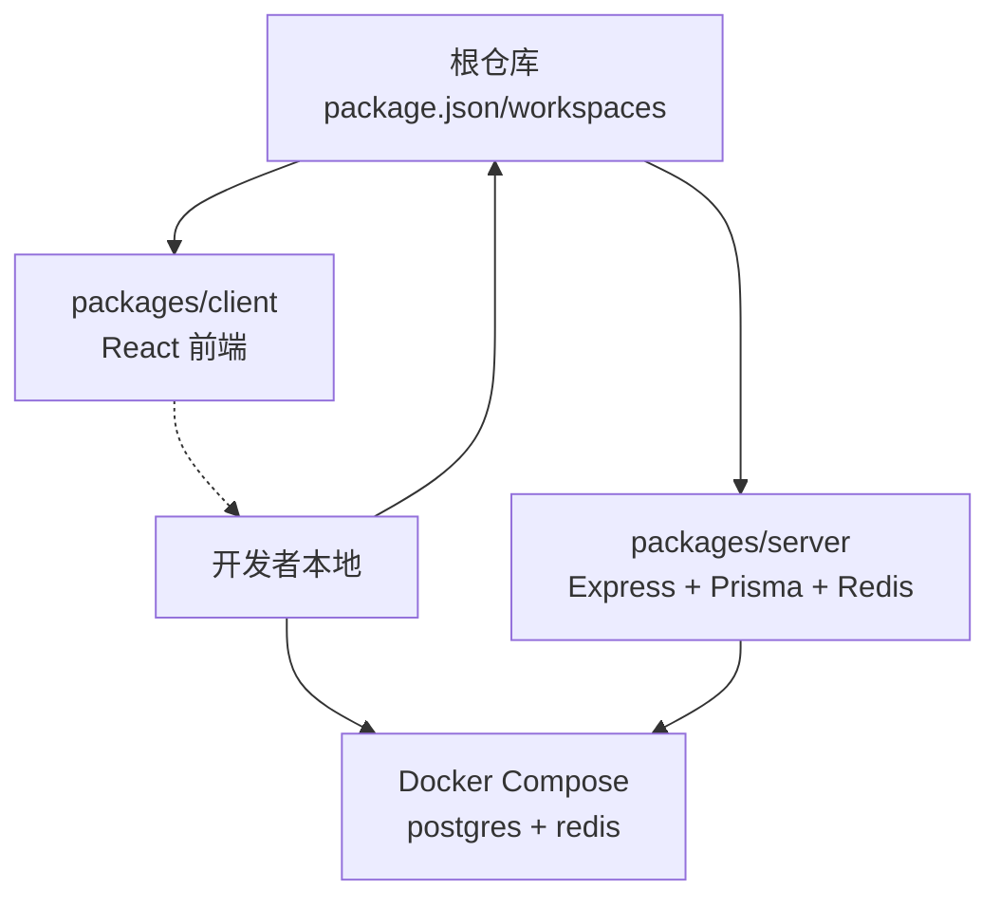
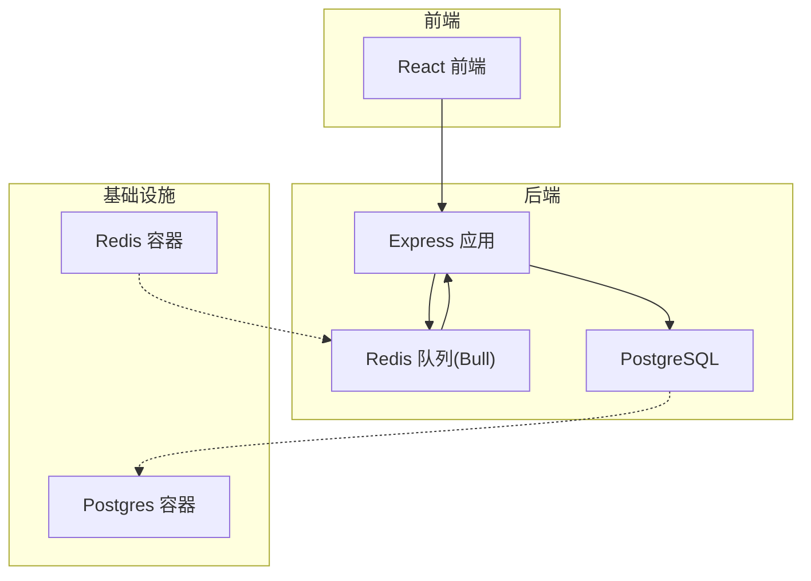
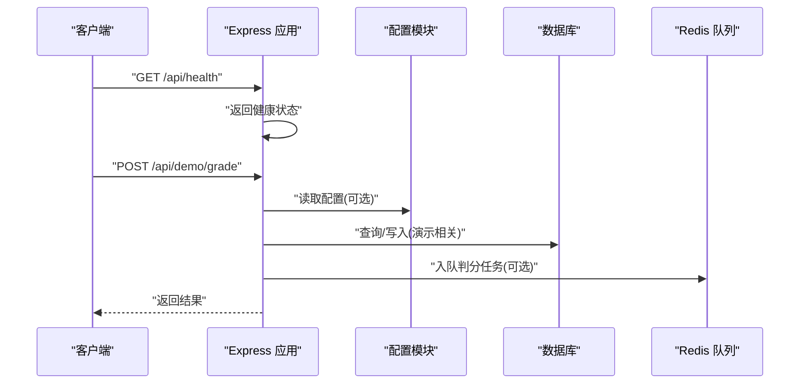
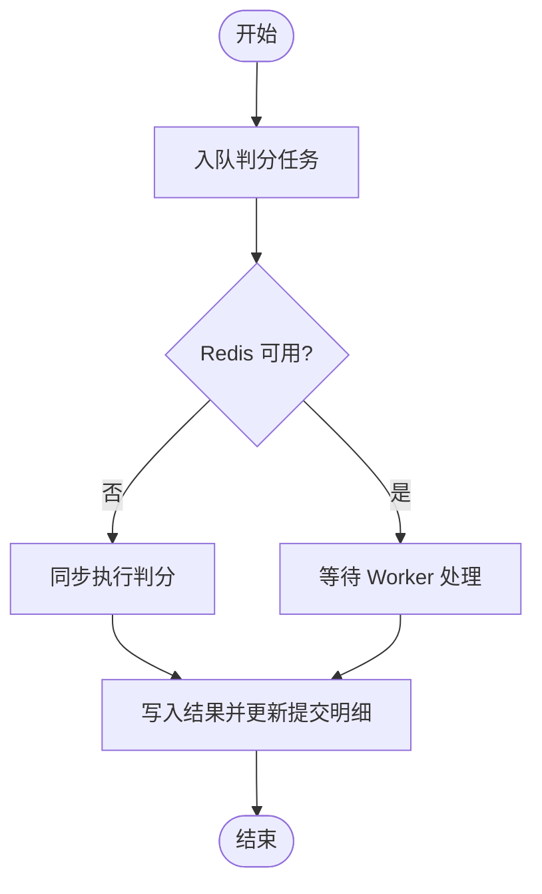
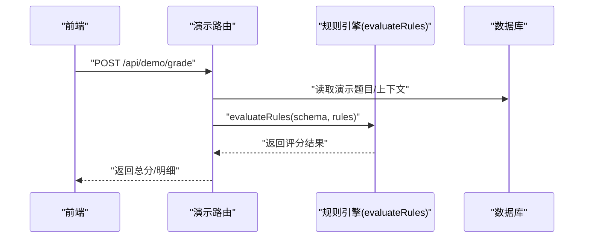
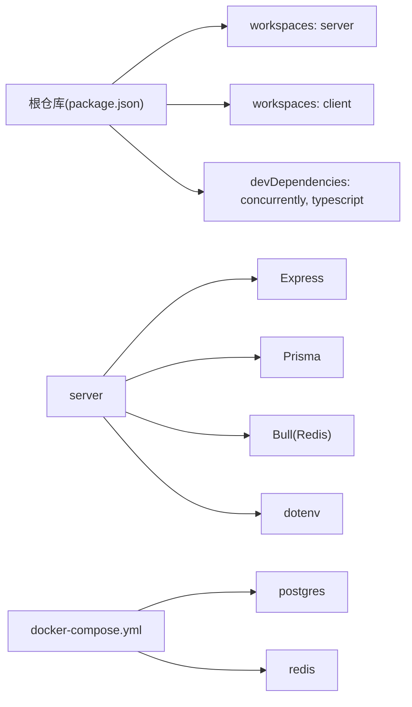

# 开发指南

<cite>
**本文档引用的文件**
- [package.json](file://package.json)
- [docker-compose.yml](file://docker-compose.yml)
- [.gitignore](file://.gitignore)
- [packages/server/src/config/index.ts](file://packages/server/src/config/index.ts)
- [packages/server/src/app.ts](file://packages/server/src/app.ts)
- [packages/server/src/routes/demo.ts](file://packages/server/src/routes/demo.ts)
- [packages/server/src/jobs/grading-queue.ts](file://packages/server/src/jobs/grading-queue.ts)
- [packages/server/src/services/grading-service.ts](file://packages/server/src/services/grading-service.ts)
- [packages/server/prisma/seed.ts](file://packages/server/prisma/seed.ts)
- [gen_docx.py](file://gen_docx.py)
- [docs/kingsoft-api-reference.md](file://docs/kingsoft-api-reference.md)
</cite>

## 目录
1. [简介](#简介)
2. [项目结构](#项目结构)
3. [核心组件](#核心组件)
4. [架构总览](#架构总览)
5. [详细组件分析](#详细组件分析)
6. [依赖分析](#依赖分析)
7. [性能考量](#性能考量)
8. [故障排查指南](#故障排查指南)
9. [结论](#结论)
10. [附录](#附录)

## 简介
本开发指南面向“金山多维表格考试系统”团队，覆盖 Monorepo 开发模式、npm scripts 使用、依赖管理策略、Git 工作流与分支管理、代码审查标准、测试策略（单元/集成）、调试与性能分析、问题排查以及新成员入职培训要点。项目采用根仓库统一管理、工作区（workspaces）组织前后端包，并通过 Docker Compose 提供数据库与缓存等基础设施。

## 项目结构
- 根仓库负责统一脚本与依赖管理，工作区包含 server 与 client 两个子包。
- 服务端使用 Express、Prisma、Redis 队列进行异步判分；前端采用 React 生态（类型与状态管理由工程化配置支撑）。
- 文档与脚本包含金山 API 参考与生成 Word 的工具脚本，便于规则引擎与验证流程的落地。

图表来源
- [package.json:17-20](file://package.json#L17-L20)
- [docker-compose.yml:3-37](file://docker-compose.yml#L3-L37)

章节来源
- [package.json:1-26](file://package.json#L1-L26)
- [docker-compose.yml:1-37](file://docker-compose.yml#L1-L37)

## 核心组件
- 根脚本与工作区
  - 统一的开发、构建、迁移、种子数据与容器编排命令，支持并发启动前后端。
- 服务端配置与路由
  - 通过 dotenv 加载环境变量，集中暴露 JWT、数据库、Redis、第三方 API 等配置；Express 应用注册健康检查与各模块路由。
- 验证引擎与判分队列
  - 基于 Redis 的 Bull 队列实现异步判分；当 Redis 不可用时降级为同步执行；判分完成后持久化结果并更新提交明细。
- 示例演示路由
  - 提供演示题目与评分接口，便于规则引擎验证与联调。
- 数据种子
  - 通过 Prisma seed 构建典型题目与规则，覆盖表/字段/视图/筛选/分组等常见验证动作。

章节来源
- [package.json:6-16](file://package.json#L6-L16)
- [packages/server/src/config/index.ts:1-22](file://packages/server/src/config/index.ts#L1-L22)
- [packages/server/src/app.ts:15-43](file://packages/server/src/app.ts#L15-L43)
- [packages/server/src/jobs/grading-queue.ts:43-167](file://packages/server/src/jobs/grading-queue.ts#L43-L167)
- [packages/server/src/routes/demo.ts:107-144](file://packages/server/src/routes/demo.ts#L107-L144)
- [packages/server/prisma/seed.ts:107-162](file://packages/server/prisma/seed.ts#L107-L162)

## 架构总览
系统采用“前端页面 + 后端服务 + 数据库/缓存”的三层架构。服务端提供 REST API、异步判分队列与健康检查；前端通过 API 与服务端交互；数据库与缓存通过 Docker Compose 提供。

图表来源
- [packages/server/src/app.ts:15-43](file://packages/server/src/app.ts#L15-L43)
- [packages/server/src/jobs/grading-queue.ts:43-167](file://packages/server/src/jobs/grading-queue.ts#L43-L167)
- [docker-compose.yml:3-37](file://docker-compose.yml#L3-L37)

## 详细组件分析

### 组件A：服务端配置与路由
- 配置加载
  - 通过 dotenv 读取环境变量，集中导出端口、JWT、数据库连接、Redis 连接与第三方 API 凭据。
- 路由注册
  - 注册认证、用户、题目、分类、考试、判分、统计、演示与金山对接等路由；统一错误处理中间件。
- 健康检查
  - 提供 /api/health 快速探测服务状态。

图表来源
- [packages/server/src/app.ts:15-43](file://packages/server/src/app.ts#L15-L43)
- [packages/server/src/config/index.ts:1-22](file://packages/server/src/config/index.ts#L1-L22)
- [packages/server/src/routes/demo.ts:107-144](file://packages/server/src/routes/demo.ts#L107-L144)

章节来源
- [packages/server/src/config/index.ts:1-22](file://packages/server/src/config/index.ts#L1-L22)
- [packages/server/src/app.ts:15-43](file://packages/server/src/app.ts#L15-L43)
- [packages/server/src/routes/demo.ts:107-144](file://packages/server/src/routes/demo.ts#L107-L144)

### 组件B：异步判分队列（Redis/Bull）
- 队列初始化
  - 懒加载 Redis 连接，分别建立“单题判分”和“整场考试判分”两个队列。
- 入队与降级
  - Redis 不可用时同步执行判分，保证功能可用性。
- Worker 处理
  - 并发 worker 处理判分任务，记录日志并返回结果；支持超时与失败处理。
- 结果回写
  - 判分完成后写入验证结果表并更新提交明细分数与正确性标记。

图表来源
- [packages/server/src/jobs/grading-queue.ts:43-167](file://packages/server/src/jobs/grading-queue.ts#L43-L167)
- [packages/server/src/services/grading-service.ts:203-238](file://packages/server/src/services/grading-service.ts#L203-L238)

章节来源
- [packages/server/src/jobs/grading-queue.ts:43-167](file://packages/server/src/jobs/grading-queue.ts#L43-L167)
- [packages/server/src/services/grading-service.ts:203-238](file://packages/server/src/services/grading-service.ts#L203-L238)

### 组件C：演示路由与规则引擎联调
- 演示接口
  - 提供演示题目列表与评分入口，支持选择不同 Mock Schema 进行规则评估。
- 规则评估
  - 基于传入的 answerRules 与 schema 执行规则引擎，返回总分、满分与逐条规则结果。

图表来源
- [packages/server/src/routes/demo.ts:107-144](file://packages/server/src/routes/demo.ts#L107-L144)

章节来源
- [packages/server/src/routes/demo.ts:107-144](file://packages/server/src/routes/demo.ts#L107-L144)

### 组件D：数据种子与验证动作映射
- 种子数据
  - 通过 Prisma seed 创建多种类型的题目，覆盖表/字段/视图/筛选/分组等验证动作。
- 动作映射
  - 将规则动作与对应 API 或视图能力进行映射，指导验证引擎实现。

章节来源
- [packages/server/prisma/seed.ts:107-162](file://packages/server/prisma/seed.ts#L107-L162)
- [gen_docx.py:315-339](file://gen_docx.py#L315-L339)

## 依赖分析
- 根仓库
  - workspaces 指向 packages/server 与 packages/client。
  - devDependencies 包含 concurrently 与 TypeScript。
- 服务端
  - Express、Prisma、Bull（Redis 队列）、dotenv 等。
- 基础设施
  - Docker Compose 提供 Postgres 与 Redis，含健康检查与卷挂载。

图表来源
- [package.json:17-24](file://package.json#L17-L24)
- [docker-compose.yml:3-37](file://docker-compose.yml#L3-L37)

章节来源
- [package.json:17-24](file://package.json#L17-L24)
- [docker-compose.yml:3-37](file://docker-compose.yml#L3-L37)

## 性能考量
- 异步判分
  - 使用 Redis 队列解耦评分耗时操作，避免阻塞请求；在 Redis 不可用时自动降级为同步执行，保障稳定性。
- 并发控制
  - Worker 设置合理并发度，避免过度占用资源；对长时间任务进行超时与失败处理。
- 数据库与缓存
  - 通过 Docker Compose 统一管理数据库与缓存，确保开发环境一致；生产环境建议独立部署并开启连接池与索引优化。
- 健康检查
  - 提供 /api/health 快速探测，便于容器编排与负载均衡。

章节来源
- [packages/server/src/jobs/grading-queue.ts:147-167](file://packages/server/src/jobs/grading-queue.ts#L147-L167)
- [packages/server/src/app.ts:22-25](file://packages/server/src/app.ts#L22-L25)
- [docker-compose.yml:15-19](file://docker-compose.yml#L15-L19)

## 故障排查指南
- 环境变量缺失
  - 确认 .env 文件存在且包含必要的 JWT、数据库、Redis、第三方 API 凭据。
- 数据库/缓存不可用
  - 使用 docker compose up -d 启动服务；检查健康检查输出；确认端口映射与卷挂载正常。
- 判分任务堆积
  - 检查 Redis 连接是否可用；查看 Worker 日志；适当调整并发度。
- 规则引擎异常
  - 使用演示路由 /api/demo/grade 进行最小化复现；核对 Mock Schema 与 answerRules。
- Git 与忽略文件
  - 确保 .gitignore 正确忽略 node_modules、dist、日志、Python 缓存等。

章节来源
- [.gitignore:1-12](file://.gitignore#L1-L12)
- [docker-compose.yml:3-37](file://docker-compose.yml#L3-L37)
- [packages/server/src/config/index.ts:1-22](file://packages/server/src/config/index.ts#L1-L22)
- [packages/server/src/jobs/grading-queue.ts:79-85](file://packages/server/src/jobs/grading-queue.ts#L79-L85)
- [packages/server/src/routes/demo.ts:119-144](file://packages/server/src/routes/demo.ts#L119-L144)

## 结论
本指南提供了从项目结构、核心组件、架构到开发流程、测试与运维的全栈指引。建议团队在日常开发中严格遵循脚本化与容器化的工作流，结合规则引擎与演示路由进行高效联调，并以异步判分为抓手提升系统吞吐与稳定性。

## 附录

### A. 代码规范与最佳实践
- 目录命名与职责
  - server: 路由、中间件、服务、引擎、作业、Prisma、测试
  - client: 页面、组件、状态、服务、类型
- 命名约定
  - 路由模块以复数形式命名；服务函数以动词开头；常量全大写加下划线。
- 配置管理
  - 所有敏感信息通过环境变量注入；提供默认值与类型校验。
- 错误处理
  - 统一错误中间件；对外返回明确的错误码与消息；内部记录堆栈。

章节来源
- [packages/server/src/app.ts:15-43](file://packages/server/src/app.ts#L15-L43)
- [packages/server/src/config/index.ts:1-22](file://packages/server/src/config/index.ts#L1-L22)

### B. 开发流程与脚本使用
- 开发
  - npm run dev：并发启动 server 与 client
  - npm run dev:server / dev:client：单独启动后端或前端
- 构建
  - npm run build：依次构建 server 与 client
- 数据库
  - npm run db:migrate：迁移
  - npm run db:seed：填充种子数据
  - npm run db:studio：打开 Prisma Studio
- 容器
  - npm run docker:up / docker:down：启动/停止数据库与缓存

章节来源
- [package.json:6-16](file://package.json#L6-L16)

### C. 依赖管理策略
- 根仓库统一管理 devDependencies（如 concurrently、typescript），子包聚焦业务依赖。
- 使用 workspaces 管理本地包依赖解析，避免重复安装与版本漂移。
- Docker Compose 固化数据库与缓存版本，确保环境一致性。

章节来源
- [package.json:17-24](file://package.json#L17-L24)
- [docker-compose.yml:3-37](file://docker-compose.yml#L3-L37)

### D. Git 工作流与分支管理
- 分支模型
  - main：发布基线
  - develop：集成分支
  - feature/*：功能开发
  - hotfix/*：紧急修复
- 提交规范
  - 类型(scope): 描述（不超过 50 字）
  - 类型：feat/fix/docs/style/refactor/test/chore
- 合并与审查
  - Pull Request 必须通过 CI 与代码审查；合并前确保无冲突与测试通过。

章节来源
- [package.json:17-20](file://package.json#L17-L20)

### E. 代码审查标准
- 可读性
  - 函数/模块职责单一；变量命名清晰；注释简洁有效。
- 安全性
  - 禁止硬编码密钥；输入参数必须校验；错误信息不泄露内部细节。
- 性能
  - 避免 N+1 查询；合理使用缓存；长耗时操作放入队列。
- 测试
  - 新增功能必须配套单元/集成测试；覆盖率不低于阈值。

章节来源
- [packages/server/src/jobs/grading-queue.ts:147-167](file://packages/server/src/jobs/grading-queue.ts#L147-L167)

### F. 测试策略
- 单元测试
  - 验证规则引擎每种 action 的判分逻辑；隔离外部依赖。
- 集成测试
  - 验证所有 REST 端点行为；使用 Supertest。
- 前端测试
  - 使用 React Testing Library 测试核心组件（如 RuleBuilder、ExamTimer）。
- E2E 测试
  - 使用 Playwright 覆盖完整考试流程端到端。

章节来源
- [gen_docx.py:544-562](file://gen_docx.py#L544-L562)

### G. 调试技巧与性能分析
- 本地调试
  - 使用 npm run dev 并行启动；利用浏览器开发者工具与服务端日志定位问题。
- 性能分析
  - 使用 Node.js Profiler 识别热点函数；监控 Redis 队列长度与处理时延。
- 日志与可观测性
  - 统一日志格式；关键路径打点；结合健康检查与告警。

章节来源
- [packages/server/src/app.ts:22-25](file://packages/server/src/app.ts#L22-L25)
- [packages/server/src/jobs/grading-queue.ts:154-163](file://packages/server/src/jobs/grading-queue.ts#L154-L163)

### H. 贡献指南与新成员入职
- 环境准备
  - 安装 Node.js、Docker、PostgreSQL/Redis（或使用 docker compose）
- 项目初始化
  - 安装依赖、复制 .env.example 为 .env、执行数据库迁移与种子数据
- 规则引擎对接
  - 参考金山 API 参考文档，理解 Schema 查询与视图/字段/记录操作
- 培训材料
  - 目录结构、脚本使用、路由与服务职责、演示路由与规则联调、队列与判分流程

章节来源
- [docker-compose.yml:3-37](file://docker-compose.yml#L3-L37)
- [docs/kingsoft-api-reference.md:1-603](file://docs/kingsoft-api-reference.md#L1-L603)
- [gen_docx.py:509-542](file://gen_docx.py#L509-L542)