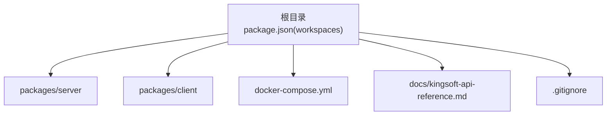
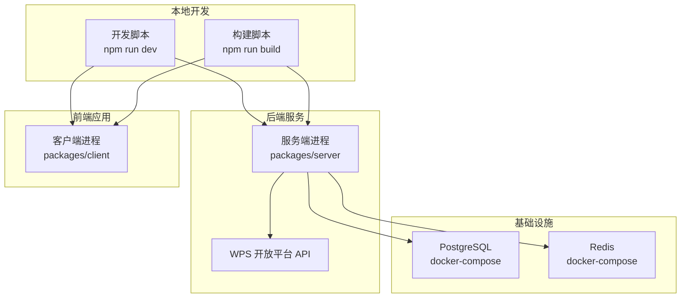
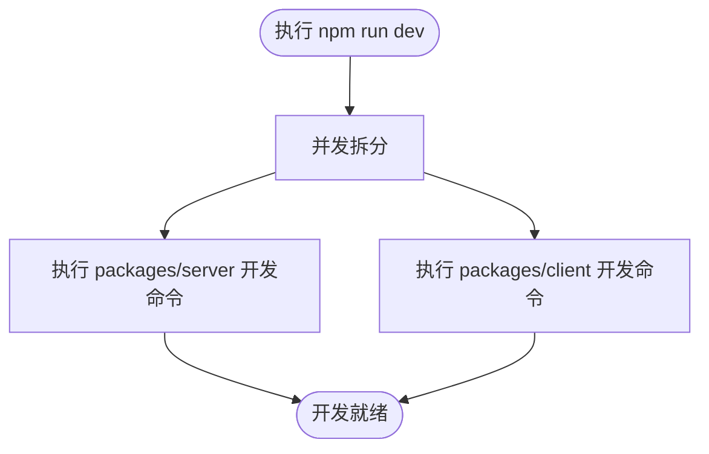
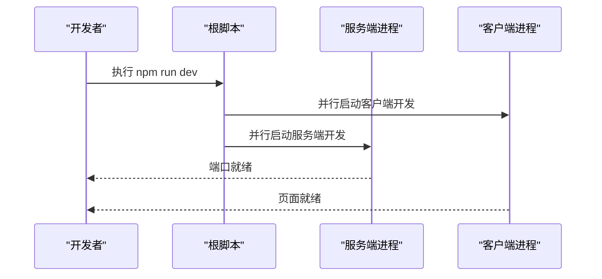
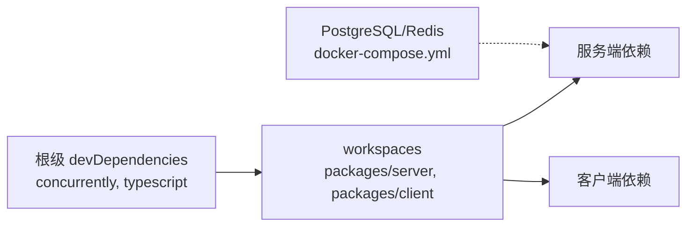

# 开发流程

<cite>
**本文档引用的文件**
- [package.json](file://package.json)
- [docker-compose.yml](file://docker-compose.yml)
- [.gitignore](file://.gitignore)
- [kingsoft-api-reference.md](file://docs/kingsoft-api-reference.md)
</cite>

## 目录
1. [简介](#简介)
2. [项目结构](#项目结构)
3. [核心组件](#核心组件)
4. [架构总览](#架构总览)
5. [详细组件分析](#详细组件分析)
6. [依赖关系分析](#依赖关系分析)
7. [性能考量](#性能考量)
8. [故障排查指南](#故障排查指南)
9. [结论](#结论)
10. [附录](#附录)

## 简介
本项目是一个基于 Monorepo 的“金山多维表格考试系统”，采用 npm workspaces 组织前后端包，通过 Docker Compose 提供数据库与缓存等基础设施，使用并发脚本统一启动开发环境，并围绕 WPS 开放平台的 REST API 与 AirScript 能力构建考试验证与判分能力。本文档面向开发者与团队协作，系统化阐述开发模式、依赖管理、本地调试与热重载、Git 工作流、分支与合并规范、代码审查流程、CI/CD 与自动化测试、版本发布与变更日志维护、向后兼容性保障以及团队协作与沟通规范。

## 项目结构
仓库采用 Monorepo 结构，根目录通过 npm workspaces 声明工作区，分别指向 packages/server 与 packages/client。根脚本统一调度各工作区任务，同时提供数据库迁移、种子数据、可视化工具与容器编排命令。.gitignore 屏蔽了常见产物与临时文件，便于隔离本地状态与缓存。

**图表来源**
- [package.json:17-20](file://package.json#L17-L20)
- [docker-compose.yml:1-37](file://docker-compose.yml#L1-L37)

**章节来源**
- [package.json:1-26](file://package.json#L1-L26)
- [.gitignore:1-11](file://.gitignore#L1-L11)

## 核心组件
- 根级 npm scripts
  - 开发：并行启动服务端与客户端开发进程
  - 构建：依次构建服务端与客户端
  - 数据库：迁移、种子数据、可视化工具
  - 容器：一键拉起/关闭 PostgreSQL 与 Redis
- Docker Compose
  - 提供持久化存储、健康检查与端口映射
- 文档与 API 参考
  - 提供 WPS 开放平台 REST API 与 AirScript 的完整使用说明与规则映射

**章节来源**
- [package.json:6-16](file://package.json#L6-L16)
- [docker-compose.yml:1-37](file://docker-compose.yml#L1-L37)
- [kingsoft-api-reference.md:1-603](file://docs/kingsoft-api-reference.md#L1-L603)

## 架构总览
下图展示了开发与运行时的整体架构：前端与后端通过 workspaces 管理；数据库与缓存由 Docker Compose 提供；后端通过 WPS 开放平台 API 读取表格 Schema 与记录，驱动判分引擎。

**图表来源**
- [package.json:6-16](file://package.json#L6-L16)
- [docker-compose.yml:3-37](file://docker-compose.yml#L3-L37)
- [kingsoft-api-reference.md:33-226](file://docs/kingsoft-api-reference.md#L33-L226)

## 详细组件分析

### 开发模式与 npm workspaces 使用
- 工作区声明
  - 根 package.json 的 workspaces 字段明确指向 packages/server 与 packages/client，使 npm 能在根目录统一安装与链接依赖。
- 并行开发
  - 根脚本通过 concurrently 并发执行两个工作区的 dev 命令，实现前后端同启。
- 依赖管理策略
  - 根级 devDependencies 仅包含开发期工具（如 concurrently），避免污染工作区生产依赖。
  - 工作区间共享依赖由 npm 自动去重与提升，减少重复安装与体积。

**图表来源**
- [package.json:6-9](file://package.json#L6-L9)

**章节来源**
- [package.json:17-24](file://package.json#L17-L24)
- [package.json:6-9](file://package.json#L6-L9)

### 本地调试与热重载机制
- 前后端同启
  - 通过根脚本并行启动，确保服务端与客户端同时进入监听模式，便于联调。
- 容器化依赖
  - 使用 docker compose 提供数据库与缓存，结合健康检查降低环境不一致带来的调试成本。
- 文件变更与重启
  - 建议在各自工作区使用热重载工具（如后端热启动、前端 Vite/HMR）以缩短反馈周期。

**图表来源**
- [package.json:6-9](file://package.json#L6-L9)

**章节来源**
- [package.json:6-9](file://package.json#L6-L9)
- [docker-compose.yml:15-19](file://docker-compose.yml#L15-L19)
- [docker-compose.yml:28-32](file://docker-compose.yml#L28-L32)

### Git 工作流程、分支管理与合并规范
- 分支模型
  - 主分支：保护分支，仅允许通过评审与 CI 通过的 Pull Request 合并。
  - 功能分支：基于主分支创建，命名建议采用 feature/xxx 或 chore/xxx。
  - 修复分支：hotfix/xxx，用于紧急修复。
- 提交规范
  - 类型限定：feat、fix、docs、style、refactor、test、chore、perf、ci 等。
  - 格式：type(scope): subject；subject 首字母小写，末尾不加句号。
- 合并与审核
  - 合并前必须通过 CI 与代码评审；优先使用 Squash Merge 保持提交历史整洁。

[本节为通用实践说明，无需特定文件引用]

### 代码审查流程
- 触发与范围
  - PR 自动触发基础检查（语法、类型、单元测试覆盖率）。
- 审查要点
  - 逻辑正确性、边界条件、错误处理、性能影响、可维护性与安全性。
- 通过标准
  - 至少一名维护者批准；阻断性问题需在合并前解决。

[本节为通用实践说明，无需特定文件引用]

### CI/CD 管道与自动化测试
- 管道阶段建议
  - 安装依赖、类型检查、单元测试、集成测试、构建产物、制品归档。
- 测试覆盖
  - 单元测试：最小可测试单元；集成测试：跨模块协作；端到端测试：关键业务链路。
- 发布策略
  - 通过标签触发发布；制品上传至制品库；镜像推送至镜像仓库。

[本节为通用实践说明，无需特定文件引用]

### 版本发布、变更日志与向后兼容性
- 版本语义化
  - 主版本：破坏性变更；次版本：新增功能且向后兼容；修订版本：修复且向后兼容。
- 变更日志
  - 按类别记录 feat、fix、breaking change；每次发布生成对应版本条目。
- 兼容性保障
  - 严格控制对外 API 的稳定性；对破坏性变更提供迁移指引与过渡期。

[本节为通用实践说明，无需特定文件引用]

### 团队协作工具与沟通规范
- 工具建议
  - 项目管理：Jira/Tapd；即时沟通：企业微信/钉钉；文档：Confluence/Wiki。
- 沟通规范
  - 问题单化、简明描述、必要上下文与复现步骤；评审与讨论记录沉淀。

[本节为通用实践说明，无需特定文件引用]

## 依赖关系分析
- 根级依赖
  - concurrently：用于并行启动多个工作区进程。
  - typescript：开发期类型支持（根级 devDependency，服务于整体 TS 生态）。
- 工作区依赖
  - 由各自工作区 package.json 管理，根级 workspaces 保证统一安装与链接。
- 外部依赖
  - Docker Compose 提供数据库与缓存服务，减少本地环境差异。

**图表来源**
- [package.json:21-24](file://package.json#L21-L24)
- [package.json:17-20](file://package.json#L17-L20)
- [docker-compose.yml:1-37](file://docker-compose.yml#L1-L37)

**章节来源**
- [package.json:21-24](file://package.json#L21-L24)
- [package.json:17-20](file://package.json#L17-L20)
- [docker-compose.yml:1-37](file://docker-compose.yml#L1-L37)

## 性能考量
- 并发启动优化
  - 使用并发工具并行启动前后端，缩短冷启动时间。
- 依赖去重与缓存
  - 利用 npm workspaces 的依赖提升与缓存策略，减少重复下载与安装。
- 容器健康检查
  - 通过健康检查确保数据库与缓存可用，避免无效重试导致的性能损耗。

[本节提供通用指导，无需特定文件引用]

## 故障排查指南
- 端口占用
  - 检查本地端口是否被占用；必要时调整 docker-compose 端口映射。
- 容器健康失败
  - 查看容器日志与健康检查间隔/超时配置；确认凭据与数据库初始化。
- 依赖安装异常
  - 清理 node_modules 与 lockfile，重新安装；核对 npm/yarn 版本与工作区配置。
- 环境变量缺失
  - 根据 .gitignore 屏蔽的 .env/.env.local，补充本地配置文件并确保权限正确。

**章节来源**
- [docker-compose.yml:15-19](file://docker-compose.yml#L15-L19)
- [docker-compose.yml:28-32](file://docker-compose.yml#L28-L32)
- [.gitignore:1-5](file://.gitignore#L1-L5)

## 结论
本项目通过 npm workspaces 实现前后端一体化开发与依赖管理，借助 Docker Compose 提供稳定的基础设施，配合根级脚本实现高效并行开发。围绕 WPS 开放平台的 API 与 AirScript 能力，系统具备清晰的验证与判分路径。建议团队在此基础上完善 CI/CD、测试体系与版本治理，持续提升交付质量与协作效率。

[本节为总结性内容，无需特定文件引用]

## 附录

### 开发环境搭建清单
- 安装 Node.js 与 npm（满足工作区要求）
- 安装 Docker 与 docker-compose
- 在根目录执行安装命令，等待依赖安装完成
- 启动数据库与缓存：执行容器相关脚本
- 启动开发：执行根脚本并行启动前后端

**章节来源**
- [package.json:6-16](file://package.json#L6-L16)
- [docker-compose.yml:1-37](file://docker-compose.yml#L1-L37)

### 本地调试与热重载最佳实践
- 前端：启用 HMR，按需刷新样式与组件
- 后端：启用热重启（如 ts-node-dev），保存即生效
- 数据库：使用 docker volume 保持数据持久化，避免频繁重建

[本节为通用实践说明，无需特定文件引用]

### WPS 开放平台 API 与判分规则映射
- 核心流程
  - 获取 file_id 与 access_token → 调用 Schema 查询 → 规则引擎匹配 → 生成判分报告
- 规则到 API 的映射
  - 表存在、表名模糊匹配、表数量、字段存在/类型/必填/公式/关联、视图存在/类型/筛选/排序/分组、表单存在/字段/设置、记录存在/值/数量

**章节来源**
- [kingsoft-api-reference.md:503-571](file://docs/kingsoft-api-reference.md#L503-L571)
- [kingsoft-api-reference.md:514-540](file://docs/kingsoft-api-reference.md#L514-L540)