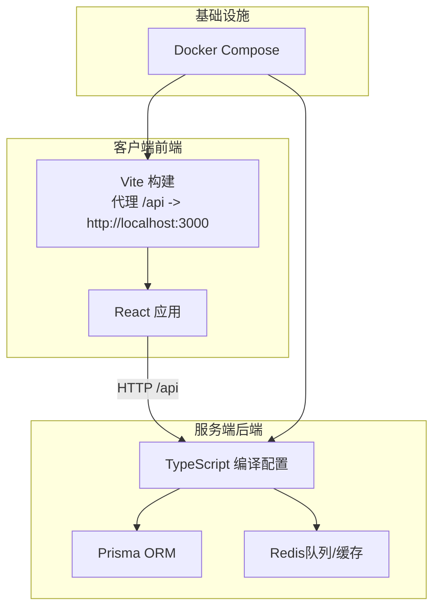
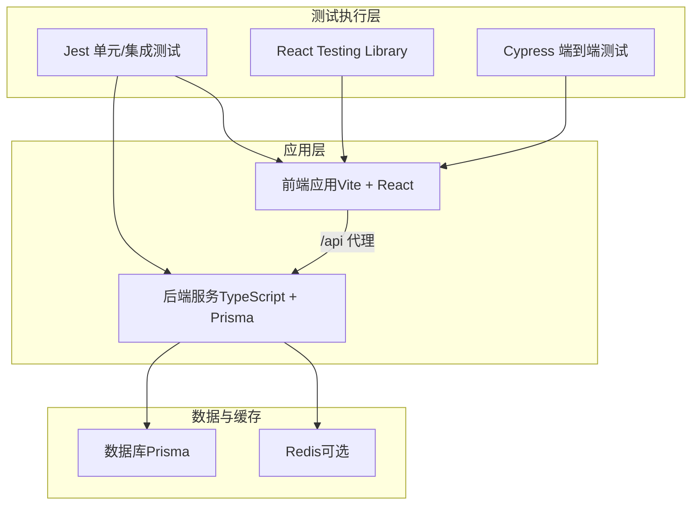
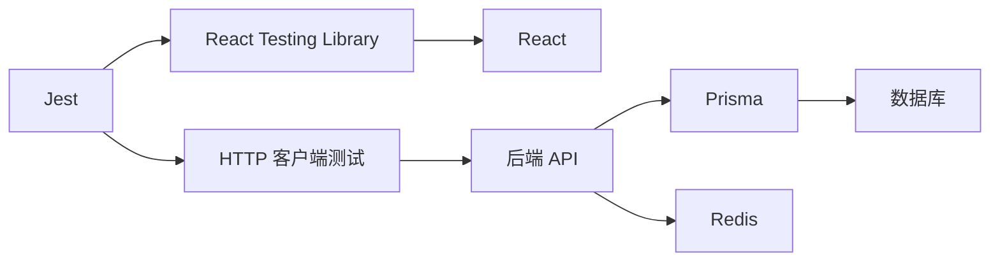

# 测试策略

<cite>
**本文引用的文件**
- [package.json](file://package.json)
- [docker-compose.yml](file://docker-compose.yml)
- [packages/client/vite.config.ts](file://packages/client/vite.config.ts)
- [packages/client/tsconfig.json](file://packages/client/tsconfig.json)
- [packages/client/tsconfig.node.json](file://packages/client/tsconfig.node.json)
- [packages/server/tsconfig.json](file://packages/server/tsconfig.json)
- [packages/server/prisma/seed.ts](file://packages/server/prisma/seed.ts)
- [packages/server/src/engine/demo-schemas.ts](file://packages/server/src/engine/demo-schemas.ts)
- [packages/client/src/pages/teacher/GradingPage.tsx](file://packages/client/src/pages/teacher/GradingPage.tsx)
</cite>

## 目录
1. [简介](#简介)
2. [项目结构](#项目结构)
3. [核心组件](#核心组件)
4. [架构总览](#架构总览)
5. [详细组件分析](#详细组件分析)
6. [依赖分析](#依赖分析)
7. [性能考虑](#性能考虑)
8. [故障排查指南](#故障排查指南)
9. [结论](#结论)
10. [附录](#附录)

## 简介
本测试策略文档面向考试系统（前端：React/Vite；后端：TypeScript/Prisma）的测试体系设计与落地，覆盖单元测试、集成测试、端到端测试的编写方法与最佳实践，明确 Jest 配置要点、React Testing Library 的使用建议、测试覆盖率目标、API 测试策略、数据库测试隔离与 Mock 数据管理、性能与安全测试方法、用户体验测试流程、测试环境配置、CI 中的测试执行与报告生成，以及 TDD 实践与测试代码维护规范。

## 项目结构
- 前端客户端位于 packages/client，采用 Vite 构建工具与 React 技术栈，通过代理将 /api 请求转发至本地服务端（端口 3000），便于联调与测试。
- 后端服务位于 packages/server，使用 TypeScript 编译配置，Prisma 作为 ORM，提供数据库迁移与种子数据脚本，支持快速初始化测试数据。
- 根目录包含统一的包管理与容器编排配置，便于在 CI 或本地环境中快速搭建一致的测试运行环境。

图表来源
- [packages/client/vite.config.ts:1-21](file://packages/client/vite.config.ts#L1-L21)
- [packages/server/tsconfig.json:1-20](file://packages/server/tsconfig.json#L1-L20)
- [docker-compose.yml](file://docker-compose.yml)

章节来源
- [packages/client/vite.config.ts:1-21](file://packages/client/vite.config.ts#L1-L21)
- [packages/server/tsconfig.json:1-20](file://packages/server/tsconfig.json#L1-L20)
- [docker-compose.yml](file://docker-compose.yml)

## 核心组件
- 前端应用与路由：通过 Vite 提供开发服务器与构建能力，代理 /api 到后端，便于前后端联调。
- 后端服务与数据库：基于 Prisma 的数据模型与迁移机制，提供种子数据脚本以快速初始化测试数据。
- 引擎与演示模式：后端存在演示场景的数据结构与索引，可用于自动化测试中的 Mock 数据管理。

章节来源
- [packages/client/vite.config.ts:1-21](file://packages/client/vite.config.ts#L1-L21)
- [packages/server/prisma/seed.ts:1-244](file://packages/server/prisma/seed.ts#L1-L244)
- [packages/server/src/engine/demo-schemas.ts:182-193](file://packages/server/src/engine/demo-schemas.ts#L182-L193)

## 架构总览
下图展示测试视角下的系统交互关系：前端通过代理访问后端 API，后端连接数据库与缓存，测试在独立的隔离环境中运行，并通过 CI 进行自动化执行与报告输出。

图表来源
- [packages/client/vite.config.ts:1-21](file://packages/client/vite.config.ts#L1-L21)
- [packages/server/tsconfig.json:1-20](file://packages/server/tsconfig.json#L1-L20)

## 详细组件分析

### 单元测试（Jest + React Testing Library）
- 测试框架与配置
  - 使用 Jest 作为测试运行器与断言库，结合 React Testing Library 进行组件渲染与交互测试。
  - 在根目录 package.json 中定义测试脚本与环境变量，确保测试在 Node 环境中稳定运行。
- 组件测试策略
  - 使用 React Testing Library 渲染组件树，模拟用户行为（点击、输入等），断言 DOM 变化与可访问性属性。
  - 对于复杂页面（如教师阅卷页），优先测试关键交互与状态变更，避免过度渲染细节导致脆弱测试。
- 最佳实践
  - 将“渲染与交互”与“业务逻辑”解耦，对纯函数与工具方法进行独立单元测试。
  - 使用测试专用的内存存储或轻量级 Mock 替代真实副作用。
  - 为每个功能模块建立最小化的测试集，减少不必要的依赖注入。

章节来源
- [packages/client/src/pages/teacher/GradingPage.tsx:241-269](file://packages/client/src/pages/teacher/GradingPage.tsx#L241-L269)

### 集成测试（API + 数据库）
- 接口测试
  - 使用 Jest 编写 API 测试，针对后端路由进行请求/响应校验，包括鉴权、参数校验、状态码与返回体结构。
  - 对于需要会话或认证的接口，使用受控的测试账户与令牌，避免污染生产数据。
- 数据库测试隔离
  - 使用 Prisma 的迁移与种子脚本，在测试前清理与重建测试数据，保证每次测试的确定性。
  - 在 CI 环境中使用独立的测试数据库实例，避免并发测试造成的数据竞争。
- Mock 数据管理
  - 基于后端演示模式的数据结构与索引，构建稳定的 Mock 数据集，用于模拟不同场景（如自动判分结果）。
  - 将 Mock 数据集中管理，按场景拆分文件，便于复用与维护。

章节来源
- [packages/server/prisma/seed.ts:1-244](file://packages/server/prisma/seed.ts#L1-L244)
- [packages/server/src/engine/demo-schemas.ts:182-193](file://packages/server/src/engine/demo-schemas.ts#L182-L193)

### 端到端测试（Cypress）
- 场景覆盖
  - 登录流程、教师布置/阅卷、学生作答与提交、查看成绩等关键业务路径。
- 环境与稳定性
  - 使用 Docker Compose 启动完整栈（前端、后端、数据库、缓存），确保 E2E 在与生产相近的环境中执行。
  - 通过 Vite 的代理配置，使 E2E 测试能够直接访问后端 API。
- 失败恢复与重试
  - 对不稳定元素（如网络延迟、动画）增加等待与重试策略，提升测试鲁棒性。

章节来源
- [packages/client/vite.config.ts:1-21](file://packages/client/vite.config.ts#L1-L21)
- [docker-compose.yml](file://docker-compose.yml)

### 性能测试
- 关键指标
  - 首屏加载时间、交互响应时间、路由切换耗时、列表渲染性能。
- 工具与方法
  - 使用浏览器性能面板与 Lighthouse 进行基准测量；在 CI 中引入阈值检查，防止回归。
- 前后端协同
  - 对慢查询与高延迟接口进行专项优化与压测，结合 Prisma 查询日志定位瓶颈。

### 安全测试
- 输入验证与权限控制
  - 针对敏感接口进行越权与注入测试，确保鉴权中间件与参数校验生效。
- 传输与存储
  - 检查 HTTPS 与安全头配置，密码哈希强度与会话管理策略。

### 用户体验测试
- 可访问性（a11y）
  - 使用 axe 或类似工具在测试中加入可访问性检查，确保标签、键盘导航与屏幕阅读器友好。
- 交互一致性
  - 对关键按钮、表单、提示信息进行一致性测试，保证跨浏览器与设备的一致表现。

## 依赖分析
- 前端依赖
  - Vite 提供开发与构建能力；代理配置将 /api 请求转发至后端，便于联调。
  - React Testing Library 用于组件测试，强调以用户视角验证行为。
- 后端依赖
  - Prisma 提供类型安全的数据库操作与迁移；bullmq 支持任务队列（可选）。
  - Redis 用于缓存与消息队列（可选），需在测试环境中隔离。

图表来源
- [packages/client/vite.config.ts:1-21](file://packages/client/vite.config.ts#L1-L21)
- [packages/server/tsconfig.json:1-20](file://packages/server/tsconfig.json#L1-L20)

章节来源
- [packages/client/vite.config.ts:1-21](file://packages/client/vite.config.ts#L1-L21)
- [packages/server/tsconfig.json:1-20](file://packages/server/tsconfig.json#L1-L20)

## 性能考虑
- 测试执行效率
  - 并行运行独立测试，避免共享状态导致的串行化；对慢速测试进行拆分或降采样。
- 数据与缓存
  - 在测试中使用内存数据库或独立实例，减少 IO 瓶颈；对缓存进行隔离或禁用，避免干扰。
- 前端性能
  - 在组件测试中避免渲染大型列表，必要时使用虚拟化或分页策略。

## 故障排查指南
- 常见问题
  - 端口冲突：确认 Vite 与后端监听端口未被占用；在 Docker 中映射正确。
  - 代理失效：检查 /api 代理规则与后端地址是否一致。
  - 数据不一致：确保测试前执行 Prisma 清库与种子脚本；在 CI 中使用独立数据库。
- 日志与诊断
  - 打开后端查询日志与前端错误控制台；在 E2E 中启用截图与视频录制以便回放。
- 回归防护
  - 为关键缺陷建立回归测试用例，设置失败即阻断的 CI 规则。

章节来源
- [packages/client/vite.config.ts:1-21](file://packages/client/vite.config.ts#L1-L21)
- [packages/server/prisma/seed.ts:1-244](file://packages/server/prisma/seed.ts#L1-L244)

## 结论
通过分层测试策略（单元、集成、端到端）、严格的数据库隔离与 Mock 数据管理、完善的性能与安全测试方法，以及 CI 中的自动化执行与报告生成，可以显著提升考试系统的质量与交付效率。建议在团队内推广 TDD 文化，持续完善测试矩阵与维护规范。

## 附录

### Jest 配置与覆盖率要求
- 配置要点
  - 使用 Jest 默认配置，结合 React Testing Library 的渲染工具；为 API 测试准备独立的 HTTP 客户端与测试环境。
  - 在 package.json 中定义测试脚本与环境变量，确保 Node 版本与模块解析符合项目需求。
- 覆盖率目标
  - 单元测试：语句覆盖率、分支覆盖率、函数覆盖率、行覆盖率均不低于 80%。
  - 集成测试：关键业务路径与错误处理分支覆盖率达到 100%。
  - 端到端测试：核心用户旅程覆盖率达到 100%，并保持稳定通过。

章节来源
- [package.json](file://package.json)

### 测试环境配置与 CI 执行
- 环境准备
  - 使用 Docker Compose 启动完整栈，确保前端代理、后端 API、数据库与缓存可用。
  - 在 CI 中设置独立数据库与缓存实例，避免并发冲突。
- 执行顺序
  - 先运行单元测试，再执行集成测试，最后运行端到端测试；失败即停止，保留 artifacts。
- 报告生成
  - 输出 HTML 与 JSON 报告，上传至 CI 平台，结合覆盖率阈值进行质量门禁。

章节来源
- [docker-compose.yml](file://docker-compose.yml)

### 测试驱动开发（TDD）实践
- 基本流程
  - 先编写失败的测试用例，再实现最小功能使其通过，最后重构并提高覆盖率。
- 团队协作
  - 采用结对编程与代码评审，确保测试质量与可维护性；为新特性先写测试再实现。

### 测试代码维护指南
- 命名与组织
  - 测试文件命名与源文件一一对应；按功能模块划分目录，避免交叉依赖。
- Mock 与 Fixtures
  - 将 Mock 数据集中管理，按场景拆分；定期更新以匹配真实数据结构变化。
- 依赖升级
  - 跟踪 Jest、RTL、Cypress 等依赖版本，及时修复破坏性变更；在 CI 中锁定版本以保证稳定性。