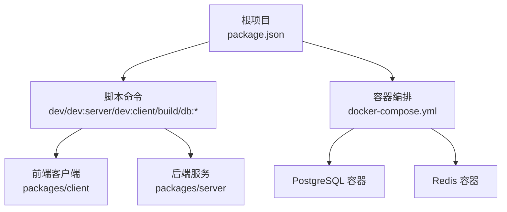
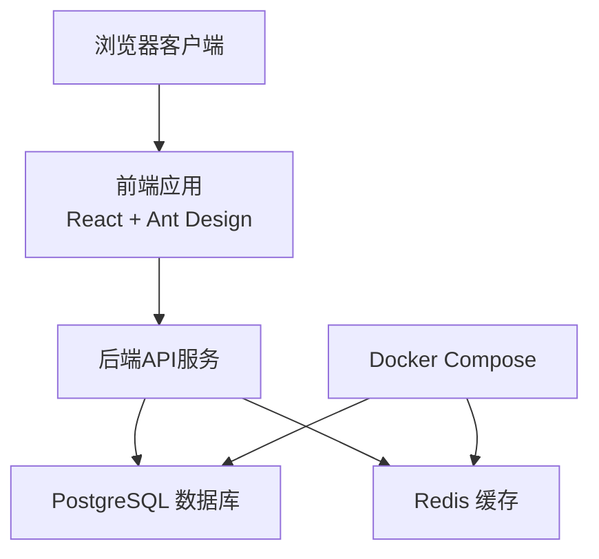
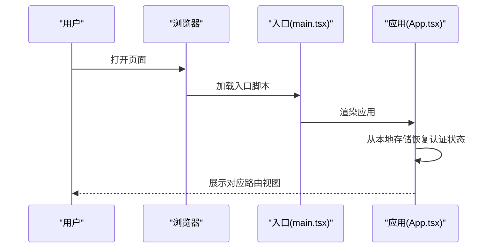
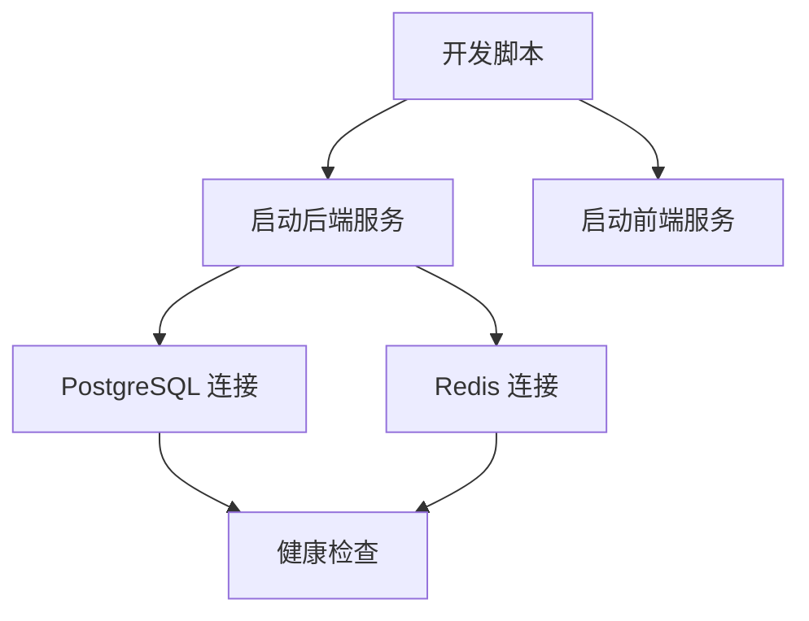

# 调试与故障排除

<cite>
**本文引用的文件**
- [docker-compose.yml](file://docker-compose.yml)
- [package.json](file://package.json)
- [packages/client/src/main.tsx](file://packages/client/src/main.tsx)
- [packages/client/src/App.tsx](file://packages/client/src/App.tsx)
</cite>

## 目录
1. [简介](#简介)
2. [项目结构](#项目结构)
3. [核心组件](#核心组件)
4. [架构总览](#架构总览)
5. [详细组件分析](#详细组件分析)
6. [依赖分析](#依赖分析)
7. [性能考虑](#性能考虑)
8. [故障排除指南](#故障排除指南)
9. [结论](#结论)
10. [附录](#附录)

## 简介
本文件面向开发与运维工程师，提供考试系统的调试与故障排除实践指南。内容涵盖：
- 开发环境调试技巧（断点、变量检查）
- 浏览器开发者工具使用、网络请求监控与性能分析
- 后端服务调试、数据库查询优化与Redis缓存调试
- Docker容器调试、日志分析与错误追踪
- 常见问题诊断流程、性能瓶颈识别与内存泄漏检测
- 生产环境问题排查与紧急修复流程

## 项目结构
该仓库采用多包工作区结构，包含前端客户端与后端服务两个子包，并通过根级脚本统一启动与构建。数据库与缓存通过Docker Compose编排。

图表来源
- [package.json:6-16](file://package.json#L6-L16)
- [docker-compose.yml:3-37](file://docker-compose.yml#L3-L37)

章节来源
- [package.json:1-26](file://package.json#L1-L26)
- [docker-compose.yml:1-37](file://docker-compose.yml#L1-L37)

## 核心组件
- 多包工作区：通过根级脚本统一管理前后端开发与构建。
- 容器化基础设施：PostgreSQL与Redis通过健康检查保障可用性。
- 前端应用入口：React应用在浏览器中渲染，路由与权限控制集中在应用层。

章节来源
- [package.json:17-20](file://package.json#L17-L20)
- [docker-compose.yml:4-32](file://docker-compose.yml#L4-L32)
- [packages/client/src/main.tsx:1-18](file://packages/client/src/main.tsx#L1-L18)
- [packages/client/src/App.tsx:38-96](file://packages/client/src/App.tsx#L38-L96)

## 架构总览
下图展示从浏览器到后端服务与数据存储的整体链路，以及容器化依赖关系。

图表来源
- [docker-compose.yml:3-37](file://docker-compose.yml#L3-L37)
- [packages/client/src/App.tsx:38-96](file://packages/client/src/App.tsx#L38-L96)

## 详细组件分析

### 前端应用调试要点
- 应用入口与严格模式：入口文件启用React严格模式，有助于捕获副作用问题；建议在开发阶段关注严格模式带来的重复调用提示。
- 路由与权限：应用集中定义路由与角色校验逻辑，便于定位鉴权失败或重定向异常。
- 状态与本地存储：登录状态从本地存储加载，可结合浏览器开发者工具的Application面板检查localStorage/sessionStorage变化。

图表来源
- [packages/client/src/main.tsx:9-17](file://packages/client/src/main.tsx#L9-L17)
- [packages/client/src/App.tsx:39-43](file://packages/client/src/App.tsx#L39-L43)

章节来源
- [packages/client/src/main.tsx:1-18](file://packages/client/src/main.tsx#L1-L18)
- [packages/client/src/App.tsx:24-36](file://packages/client/src/App.tsx#L24-L36)
- [packages/client/src/App.tsx:38-96](file://packages/client/src/App.tsx#L38-L96)

### 后端服务调试策略
- 启动方式：通过根脚本同时启动前后端，便于联调；也可单独启动后端服务进行独立调试。
- 数据库迁移与种子：提供迁移与种子脚本，便于快速初始化测试数据。
- API Studio：提供可视化数据库管理工具入口，便于验证Schema与数据一致性。

章节来源
- [package.json:6-16](file://package.json#L6-L16)

### 数据库与缓存调试
- PostgreSQL：配置了健康检查命令，可通过容器日志与健康检查结果判断连接与可用性。
- Redis：同样配置健康检查，用于确认缓存服务状态。
- 健康检查间隔与超时：短周期健康检查有助于快速发现服务异常。

章节来源
- [docker-compose.yml:15-19](file://docker-compose.yml#L15-L19)
- [docker-compose.yml:28-32](file://docker-compose.yml#L28-L32)

## 依赖分析
- 工作区脚本：根脚本统一管理开发、构建与数据库相关任务。
- 并发执行：开发脚本并发启动前后端，提高调试效率。
- 容器编排：通过Compose管理数据库与缓存，减少环境差异导致的问题。

图表来源
- [package.json:7-9](file://package.json#L7-L9)
- [docker-compose.yml:15-19](file://docker-compose.yml#L15-L19)
- [docker-compose.yml:28-32](file://docker-compose.yml#L28-L32)

章节来源
- [package.json:6-16](file://package.json#L6-L16)
- [docker-compose.yml:3-37](file://docker-compose.yml#L3-L37)

## 性能考虑
- 前端性能
  - 使用浏览器性能面板记录首次内容绘制与交互延迟，定位长任务与阻塞渲染的组件。
  - 结合网络面板观察资源加载与接口耗时，识别慢请求与重复请求。
- 后端性能
  - 关注数据库查询计划与索引使用情况，避免N+1查询与全表扫描。
  - 利用缓存命中率与键空间统计评估Redis使用效果。
- 容器资源
  - 通过容器监控CPU与内存占用，结合健康检查失败事件定位异常。

## 故障排除指南

### 开发环境调试
- 断点与变量检查
  - 在浏览器开发者工具Sources中为关键函数设置断点，逐步执行并检查作用域内变量。
  - 对异步流程使用条件断点，基于状态变化触发断点。
- 变量与状态
  - 在Console中打印全局状态对象，核对鉴权状态与路由参数是否符合预期。
- 路由与权限
  - 若出现无权限跳转，检查鉴权store中的用户角色与目标路由所需角色匹配情况。

章节来源
- [packages/client/src/App.tsx:24-36](file://packages/client/src/App.tsx#L24-L36)

### 浏览器开发者工具使用
- Network面板
  - 观察XHR/Fetch请求的响应时间、状态码与返回体大小，定位慢接口与错误接口。
  - 检查CORS与Cookie设置，确保跨域与会话正常。
- Performance面板
  - 录制页面交互过程，分析主线程占用与垃圾回收行为。
- Application面板
  - 检查LocalStorage/SessionStorage与IndexedDB，确认认证信息与离线数据状态。

### 后端服务调试
- 日志与错误追踪
  - 在后端服务中输出关键请求上下文（如请求ID、用户ID、路径），便于串联日志。
  - 使用结构化日志格式，配合日志聚合平台进行检索与告警。
- 数据库查询优化
  - 使用EXPLAIN/ANALYZE分析慢查询，补充缺失索引或重构SQL。
  - 避免在高频路径上执行复杂子查询与隐式类型转换。
- Redis缓存调试
  - 使用INFO与KEYS/SCAN检查键空间与内存使用。
  - 核对TTL与过期策略，避免缓存穿透与雪崩。

### Docker容器调试
- 容器健康检查
  - 关注健康检查失败次数与间隔，结合容器日志定位具体错误。
- 端口映射与连通性
  - 确认宿主机端口映射正确，使用容器内工具（如psql/redis-cli）验证服务可达性。
- 卷与持久化
  - 检查卷挂载路径与权限，避免因权限不足导致的数据写入失败。

章节来源
- [docker-compose.yml:11-12](file://docker-compose.yml#L11-L12)
- [docker-compose.yml:24-25](file://docker-compose.yml#L24-L25)
- [docker-compose.yml:15-19](file://docker-compose.yml#L15-L19)
- [docker-compose.yml:28-32](file://docker-compose.yml#L28-L32)

### 常见问题诊断流程
- 登录无权限跳转
  - 步骤：检查鉴权store状态、路由角色校验、后端返回的角色信息。
  - 关联文件：[packages/client/src/App.tsx:24-36](file://packages/client/src/App.tsx#L24-L36)
- 页面空白或白屏
  - 步骤：查看浏览器Console错误、Network面板失败请求、入口渲染逻辑。
  - 关联文件：[packages/client/src/main.tsx:9-17](file://packages/client/src/main.tsx#L9-L17)
- 接口超时或5xx
  - 步骤：检查后端日志、数据库连接池、Redis连接状态与健康检查。
  - 关联文件：[docker-compose.yml:15-19](file://docker-compose.yml#L15-L19), [docker-compose.yml:28-32](file://docker-compose.yml#L28-L32)
- 缓存命中率低
  - 步骤：检查键设计、TTL策略、热点键与冷数据淘汰策略。
  - 关联文件：[docker-compose.yml:28-32](file://docker-compose.yml#L28-L32)

### 性能瓶颈识别与内存泄漏检测
- 前端
  - 使用Performance面板录制交互，关注长任务与频繁重绘。
  - 使用Memory面板快照对比，定位未释放的对象引用。
- 后端
  - 分析数据库慢查询与锁等待，优化索引与事务边界。
  - 监控Redis内存增长趋势，调整淘汰策略与过期时间。
- 容器
  - 监控CPU与内存峰值，结合健康检查失败事件定位异常。

### 生产环境问题排查与紧急修复流程
- 快速止损
  - 回滚最近变更，临时关闭高风险功能开关。
- 证据收集
  - 导出关键日志、慢查询与错误堆栈，保留现场。
- 修复与验证
  - 在预生产环境复现并验证修复方案。
- 监控回归
  - 上线后持续观察指标与告警，确保问题彻底解决。

## 结论
本指南提供了从开发到生产的全链路调试与故障排除方法。通过合理利用浏览器工具、后端日志与容器健康检查，结合数据库与缓存的专项优化手段，能够高效定位并解决问题。建议在团队内形成标准化的诊断流程与知识沉淀，以降低问题处理成本。

## 附录
- 快速命令参考
  - 启动开发环境：[package.json:7-9](file://package.json#L7-L9)
  - 构建前后端：[package.json:10](file://package.json#L10)
  - 数据库迁移与种子：[package.json:11-12](file://package.json#L11-L12)
  - 启停容器：[package.json:14-15](file://package.json#L14-L15)
- 容器与端口
  - PostgreSQL：[docker-compose.yml:11-12](file://docker-compose.yml#L11-L12)
  - Redis：[docker-compose.yml:24-25](file://docker-compose.yml#L24-L25)