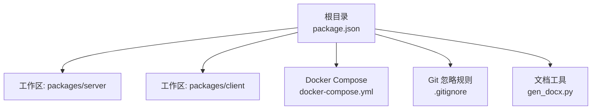
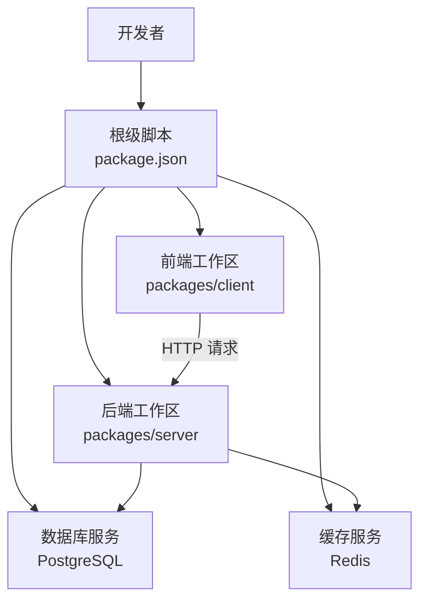
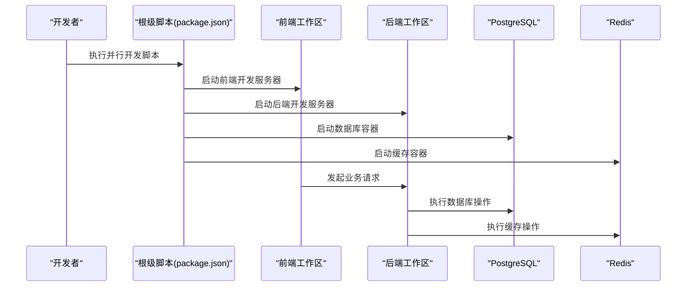
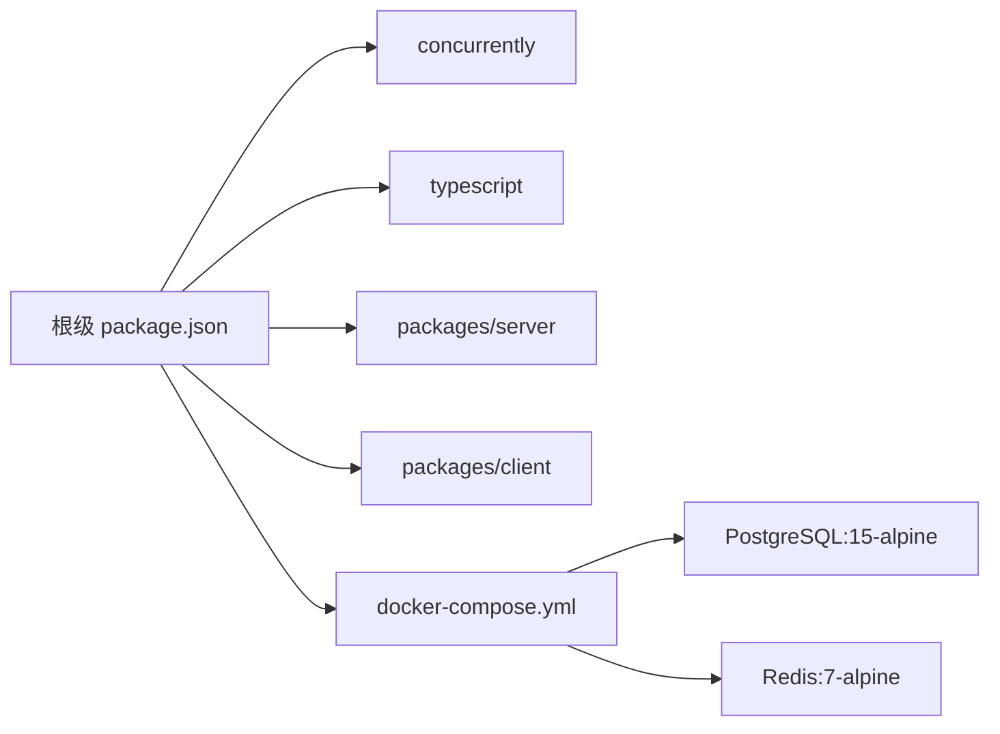

# 贡献指南

<cite>
**本文引用的文件**
- [package.json](file://package.json)
- [docker-compose.yml](file://docker-compose.yml)
- [.gitignore](file://.gitignore)
- [gen_docx.py](file://gen_docx.py)
</cite>

## 目录
1. [简介](#简介)
2. [项目结构](#项目结构)
3. [核心组件](#核心组件)
4. [架构总览](#架构总览)
5. [详细组件分析](#详细组件分析)
6. [依赖关系分析](#依赖关系分析)
7. [性能考虑](#性能考虑)
8. [故障排查指南](#故障排查指南)
9. [结论](#结论)
10. [附录](#附录)

## 简介
本贡献指南面向首次参与“金山多维表格考试系统”的开发者与文档贡献者，旨在帮助你快速完成入职流程、搭建开发环境、理解项目结构，并掌握代码与文档贡献流程、Pull Request 模板与代码评审标准、社区行为准则与沟通渠道、问题反馈与版本发布流程，以及开源许可与知识产权保护要求。由于仓库中未包含各工作区的具体源码与配置文件，本文在不涉及具体实现细节的前提下，基于现有配置文件与通用实践给出可操作的建议与流程。

## 项目结构
该仓库采用 NPM Workspaces 的多包管理方式，顶层通过脚本统一启动前后端服务、构建与数据库迁移等任务；同时使用 Docker Compose 提供数据库与缓存等基础设施。顶层配置文件如下：
- 根级 package.json：定义工作区、常用开发脚本与依赖
- docker-compose.yml：定义数据库与缓存服务容器
- .gitignore：忽略构建产物、环境变量与日志等文件
- gen_docx.py：文档生成脚本（可能用于导出 Word 文档）

**图表来源**
- [package.json:17-20](file://package.json#L17-L20)
- [docker-compose.yml:1-37](file://docker-compose.yml#L1-L37)
- [.gitignore:1-12](file://.gitignore#L1-L12)

**章节来源**
- [package.json:1-26](file://package.json#L1-L26)
- [docker-compose.yml:1-37](file://docker-compose.yml#L1-L37)
- [.gitignore:1-12](file://.gitignore#L1-L12)

## 核心组件
- 工作区与脚本
  - 使用 NPM Workspaces 管理 packages/server 与 packages/client
  - 常用脚本包括：并行启动前后端、分别启动前端或后端、统一构建、数据库迁移与种子数据、打开数据库可视化工具、启动/停止 Docker 服务
- 基础设施编排
  - 使用 PostgreSQL 与 Redis 容器，提供健康检查与持久化卷
- 版本与描述
  - 项目名称、版本与描述由根级 package.json 统一声明

**章节来源**
- [package.json:6-16](file://package.json#L6-L16)
- [package.json:17-20](file://package.json#L17-L20)
- [docker-compose.yml:3-37](file://docker-compose.yml#L3-L37)

## 架构总览
下图展示了本地开发时的典型交互：开发者通过根级脚本启动前后端与数据库服务，前端与后端分别在各自工作区内运行，数据库与缓存通过 Docker Compose 提供。

**图表来源**
- [package.json:6-16](file://package.json#L6-L16)
- [docker-compose.yml:3-37](file://docker-compose.yml#L3-L37)

## 详细组件分析

### 开发环境配置
- 前端与后端并行开发
  - 使用根级脚本并行启动前端与后端，便于联调
- 单独启动前端或后端
  - 可通过分别执行前端或后端的开发脚本进行独立调试
- 数据库与缓存
  - 通过 Docker Compose 启动 PostgreSQL 与 Redis，默认暴露端口并配置健康检查
- 数据库迁移与种子数据
  - 提供数据库迁移与种子数据脚本，便于初始化测试数据
- 数据库可视化
  - 提供数据库可视化工具脚本，便于查看与调试
- Docker 管理
  - 提供一键启动与停止容器的脚本

**图表来源**
- [package.json:6-16](file://package.json#L6-L16)
- [docker-compose.yml:3-37](file://docker-compose.yml#L3-L37)

**章节来源**
- [package.json:6-16](file://package.json#L6-L16)
- [docker-compose.yml:3-37](file://docker-compose.yml#L3-L37)

### 代码贡献流程
- 分支策略
  - 建议采用功能分支开发，主分支仅合并通过评审的变更
- 提交规范
  - 使用清晰的提交信息，遵循约定式提交风格（如 feat、fix、docs、refactor）
- Pull Request 模板
  - 在 PR 描述中包含：变更内容、影响范围、测试验证、相关 Issue 链接
- 代码评审标准
  - 可读性：命名规范、注释与文档完善
  - 正确性：边界条件、异常处理、单元测试覆盖
  - 性能：避免冗余计算与阻塞操作
  - 兼容性：接口与配置变更需向后兼容或明确升级指引
- 自动化检查
  - 建议在 CI 中集成格式化、类型检查与静态分析

[本节为通用流程建议，不直接分析具体文件，故无“章节来源”]

### 文档贡献方式与示例
- 文档位置
  - 文档位于 docs 目录，可参考现有文档结构与命名风格
- 示例脚本
  - gen_docx.py 可作为文档导出或转换的参考脚本
- 翻译规范
  - 保持术语一致，优先使用官方译名；跨语言对照表可维护在文档中
- 示例代码编写指南
  - 示例应最小可用、可复现；提供必要的前置条件与预期结果

**章节来源**
- [gen_docx.py](file://gen_docx.py)

### 社区行为准则与沟通渠道
- 行为准则
  - 尊重与包容，禁止骚扰与歧视；鼓励建设性反馈
- 沟通渠道
  - 使用 Issue 进行问题讨论与需求追踪；PR 用于代码变更
- 问题反馈流程
  - 新建 Issue 时填写模板：标题、重现步骤、期望与实际结果、环境信息、日志与截图

[本节为通用流程建议，不直接分析具体文件，故无“章节来源”]

### Bug 报告模板与功能请求流程
- Bug 报告模板
  - 环境信息：操作系统、浏览器/Node 版本、依赖版本
  - 复现步骤：最小可复现步骤清单
  - 期望结果 vs 实际结果
  - 日志与截图
- 功能请求流程
  - 在 Issue 中描述背景、目标、可行性分析与替代方案
  - 讨论通过后进入开发计划

[本节为通用流程建议，不直接分析具体文件，故无“章节来源”]

### 版本发布周期
- 发布节奏
  - 建议采用固定周期（如每月）或按功能里程碑发布
- 版本号
  - 遵循语义化版本控制；重大变更打补丁版本
- 发布清单
  - 更新 Changelog、更新依赖、回归测试、部署验证

[本节为通用流程建议，不直接分析具体文件，故无“章节来源”]

### 开源许可证与知识产权
- 许可证
  - 请在仓库根目录添加 LICENSE 文件，明确许可证类型与版权归属
- 版权声明
  - 在每个文件头部添加标准版权声明与许可证标识
- 知识产权保护
  - 不引入第三方侵权资源；贡献前进行合规审查

[本节为通用流程建议，不直接分析具体文件，故无“章节来源”]

## 依赖关系分析
- 根级依赖
  - concurrently：并行执行多个命令
  - typescript：类型支持（可在工作区中按需启用）
- 工作区
  - packages/server 与 packages/client 通过 workspaces 管理
- Docker 依赖
  - PostgreSQL 与 Redis 镜像版本在 docker-compose.yml 中定义

**图表来源**
- [package.json:21-24](file://package.json#L21-L24)
- [package.json:17-20](file://package.json#L17-L20)
- [docker-compose.yml:4-22](file://docker-compose.yml#L4-L22)

**章节来源**
- [package.json:21-24](file://package.json#L21-L24)
- [package.json:17-20](file://package.json#L17-L20)
- [docker-compose.yml:4-22](file://docker-compose.yml#L4-L22)

## 性能考虑
- 并行开发
  - 使用并发脚本减少等待时间，提升迭代效率
- 容器化依赖
  - 通过 Docker Compose 管理数据库与缓存，避免本地环境差异导致的性能波动
- 构建与打包
  - 在工作区中按需启用增量构建与缓存，缩短构建时间

[本节为通用指导，不直接分析具体文件，故无“章节来源”]

## 故障排查指南
- 端口冲突
  - PostgreSQL 默认映射 5432，Redis 映射 6379；若冲突，请调整 docker-compose.yml 中的端口映射
- 权限与卷
  - 确认数据卷权限，避免容器内写入失败
- 健康检查
  - 利用健康检查脚本确认数据库与缓存可用性
- 构建产物清理
  - .gitignore 已忽略 dist、node_modules 等目录，必要时可手动清理以排除缓存干扰

**章节来源**
- [docker-compose.yml:11-19](file://docker-compose.yml#L11-L19)
- [docker-compose.yml:24-32](file://docker-compose.yml#L24-L32)
- [.gitignore:1-12](file://.gitignore#L1-L12)

## 结论
本贡献指南基于现有配置文件给出了可落地的开发与协作流程建议。由于仓库未包含各工作区的具体源码，建议在后续补充：
- 各工作区的 package.json、构建脚本与依赖
- 代码规范与 Lint 规则
- 测试策略与覆盖率要求
- CI/CD 流水线配置
- 文档模板与翻译规范

[本节为总结性内容，不直接分析具体文件，故无“章节来源”]

## 附录
- 快速开始
  - 安装依赖后，使用根级脚本启动数据库与缓存容器，再启动前后端服务
- 常用命令
  - 并行开发、单独启动前端/后端、数据库迁移与种子数据、数据库可视化、Docker 启停

**章节来源**
- [package.json:6-16](file://package.json#L6-L16)
- [docker-compose.yml:14-19](file://docker-compose.yml#L14-L19)
- [docker-compose.yml:28-32](file://docker-compose.yml#L28-L32)