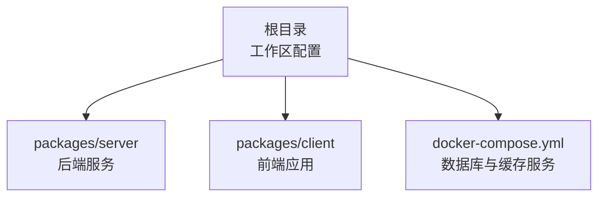
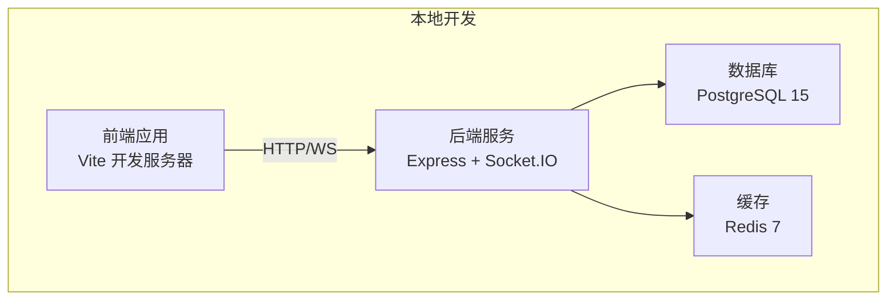
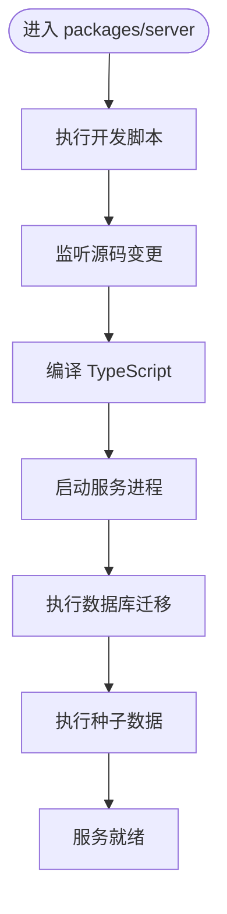
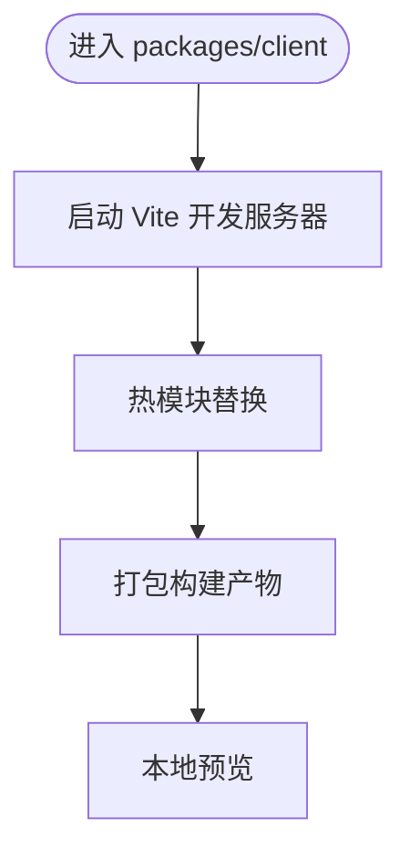
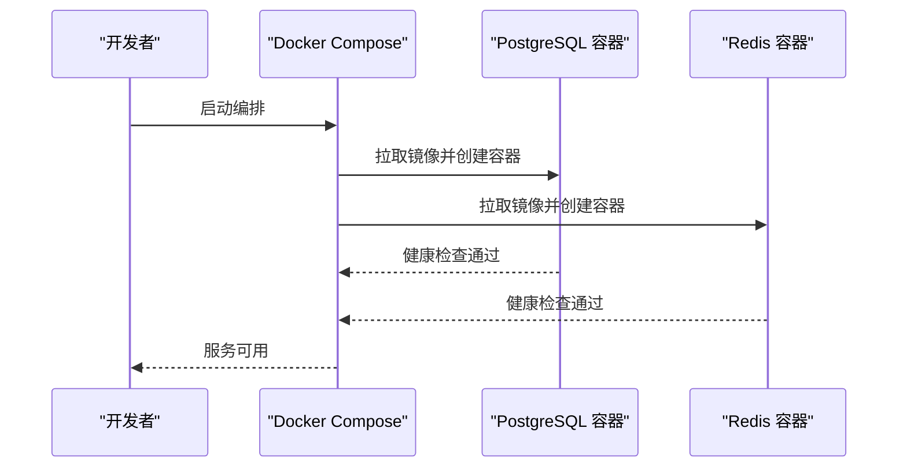
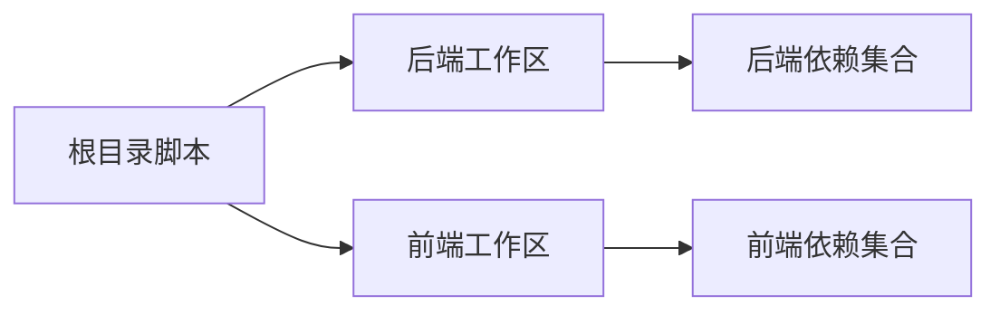

# 快速开始

<cite>
**本文引用的文件**
- [docker-compose.yml](file://docker-compose.yml)
- [package.json](file://package.json)
- [packages/server/package.json](file://packages/server/package.json)
- [packages/client/package.json](file://packages/client/package.json)
</cite>

## 目录
1. [简介](#简介)
2. [项目结构](#项目结构)
3. [核心组件](#核心组件)
4. [架构总览](#架构总览)
5. [详细组件分析](#详细组件分析)
6. [依赖分析](#依赖分析)
7. [性能考虑](#性能考虑)
8. [故障排除指南](#故障排除指南)
9. [结论](#结论)
10. [附录](#附录)

## 简介
本指南面向首次接触“金山多维表格考试系统”的开发者，帮助你在最短时间内完成环境准备、依赖安装与本地开发环境搭建。你将学会：
- 环境要求与前置条件（Node.js、PostgreSQL、Redis）
- 使用 Docker Compose 一键启动后端数据库与缓存服务
- 手动配置开发环境并运行前后端工作区
- 数据库迁移与种子数据导入
- 基本功能验证流程
- 常见安装问题的排查与解决思路

## 项目结构
该仓库采用多包（monorepo）结构，通过根目录的 npm 工作区管理前后端两个子包：
- packages/server：后端服务（基于 Express、Prisma、Socket.IO 等）
- packages/client：前端应用（基于 React、Vite、Ant Design 等）

图表来源
- [package.json:17-20](file://package.json#L17-L20)
- [packages/server/package.json:1-35](file://packages/server/package.json#L1-L35)
- [packages/client/package.json:1-29](file://packages/client/package.json#L1-L29)
- [docker-compose.yml:1-37](file://docker-compose.yml#L1-L37)

章节来源
- [package.json:1-26](file://package.json#L1-L26)
- [packages/server/package.json:1-35](file://packages/server/package.json#L1-L35)
- [packages/client/package.json:1-29](file://packages/client/package.json#L1-L29)
- [docker-compose.yml:1-37](file://docker-compose.yml#L1-L37)

## 核心组件
- 后端服务（packages/server）
  - 框架与工具：Express、Prisma、Socket.IO、BullMQ、bcryptjs、jsonwebtoken、ioredis、CORS、Zod
  - 开发脚本：开发、构建、启动、数据库迁移、种子数据、Prisma Studio
- 前端应用（packages/client）
  - 框架与工具：React、Vite、Ant Design、Axios、Day.js、Zustand、React Router
  - 开发脚本：开发、构建、预览
- 本地开发编排（docker-compose.yml）
  - PostgreSQL 15（健康检查、持久化卷）
  - Redis 7（健康检查、持久化卷）

章节来源
- [packages/server/package.json:5-12](file://packages/server/package.json#L5-L12)
- [packages/server/package.json:13-33](file://packages/server/package.json#L13-L33)
- [packages/client/package.json:6-10](file://packages/client/package.json#L6-L10)
- [packages/client/package.json:11-27](file://packages/client/package.json#L11-L27)
- [docker-compose.yml:3-37](file://docker-compose.yml#L3-L37)

## 架构总览
下图展示了本地开发时的典型交互：前端通过 HTTP/WS 访问后端，后端连接数据库与缓存，同时可选地使用 Prisma Studio 进行数据库可视化。

图表来源
- [packages/server/package.json:13-33](file://packages/server/package.json#L13-L33)
- [docker-compose.yml:3-37](file://docker-compose.yml#L3-L37)

## 详细组件分析

### 后端服务（packages/server）
- 关键职责
  - 提供 REST/Socket 接口
  - 数据访问层（Prisma）
  - 队列任务（BullMQ）
  - 身份认证与会话（bcryptjs、jsonwebtoken）
  - 缓存操作（ioredis）
- 开发与构建
  - 开发：监听源码变化自动重启
  - 构建：TypeScript 编译
  - 启动：生产模式运行
- 数据库相关
  - 迁移：Prisma 迁移
  - 种子：执行种子脚本
  - 可视化：Prisma Studio

图表来源
- [packages/server/package.json:5-12](file://packages/server/package.json#L5-L12)

章节来源
- [packages/server/package.json:5-12](file://packages/server/package.json#L5-L12)
- [packages/server/package.json:13-33](file://packages/server/package.json#L13-L33)

### 前端应用（packages/client）
- 关键职责
  - 用户界面与路由
  - 状态管理（Zustand）
  - 请求封装（Axios）
  - UI 组件库（Ant Design）
- 开发与构建
  - 开发：Vite 快速热更新
  - 构建：TypeScript + Vite 打包
  - 预览：本地静态预览

图表来源
- [packages/client/package.json:6-10](file://packages/client/package.json#L6-L10)

章节来源
- [packages/client/package.json:6-10](file://packages/client/package.json#L6-L10)
- [packages/client/package.json:11-27](file://packages/client/package.json#L11-L27)

### 数据库与缓存（PostgreSQL 与 Redis）
- PostgreSQL
  - 版本：15（Alpine）
  - 默认凭据与数据库名
  - 端口映射与持久化卷
  - 健康检查：pg_isready
- Redis
  - 版本：7（Alpine）
  - 端口映射与持久化卷
  - 健康检查：redis-cli ping

图表来源
- [docker-compose.yml:3-37](file://docker-compose.yml#L3-L37)

章节来源
- [docker-compose.yml:3-37](file://docker-compose.yml#L3-L37)

## 依赖分析
- 工作区与脚本
  - 根目录定义了工作区与常用脚本，统一在 packages/server 与 packages/client 上执行子命令
- 外部依赖
  - 后端：Prisma、Socket.IO、BullMQ、ioredis、bcryptjs、jsonwebtoken、CORS、Zod
  - 前端：React、Vite、Ant Design、Axios、Day.js、Zustand、React Router

图表来源
- [package.json:6-16](file://package.json#L6-L16)
- [packages/server/package.json:13-33](file://packages/server/package.json#L13-L33)
- [packages/client/package.json:11-27](file://packages/client/package.json#L11-L27)

章节来源
- [package.json:6-16](file://package.json#L6-L16)
- [packages/server/package.json:13-33](file://packages/server/package.json#L13-L33)
- [packages/client/package.json:11-27](file://packages/client/package.json#L11-L27)

## 性能考虑
- 开发阶段建议使用 Vite 的热更新与按需编译，减少等待时间
- 数据库迁移与种子脚本仅在开发环境执行，避免对生产造成影响
- Redis 与 PostgreSQL 使用轻量级 Alpine 镜像，启动速度快但注意资源限制
- 如需更高性能，可在生产环境调整容器资源配额与网络策略

## 故障排除指南
- Docker 启动失败
  - 检查端口占用（默认 5432、6379），必要时修改映射或释放端口
  - 查看容器健康检查日志，确认数据库与缓存服务状态
- 数据库连接异常
  - 确认环境变量中的数据库主机、端口、用户名与密码与编排一致
  - 等待数据库初始化完成后再进行迁移与种子导入
- 前端无法访问后端接口
  - 检查跨域配置（CORS）是否允许前端地址
  - 确认后端服务已启动且端口可达
- 依赖安装失败
  - 清理 node_modules 与锁定文件后重装
  - 确保 Node.js 版本满足各包要求（详见下一节）
- 数据库迁移/种子报错
  - 先确认数据库服务已就绪
  - 按顺序执行迁移与种子脚本，查看具体错误信息定位问题

## 结论
通过本指南，你可以快速完成环境准备与本地开发环境搭建。推荐优先使用 Docker Compose 一键启动数据库与缓存，再在根目录执行统一的开发脚本以并行启动前后端。遇到问题时，结合健康检查与分步执行策略可有效定位与修复。

## 附录

### 环境要求与前置条件
- Node.js
  - 建议使用 LTS 版本，确保与各包的开发依赖兼容
- 数据库
  - PostgreSQL 15（随 Docker Compose 自动提供）
- 缓存
  - Redis 7（随 Docker Compose 自动提供）

章节来源
- [docker-compose.yml:4-19](file://docker-compose.yml#L4-L19)
- [docker-compose.yml:21-32](file://docker-compose.yml#L21-L32)

### 依赖安装步骤
- 安装根目录依赖
  - 在项目根目录执行安装命令，以启用工作区与开发工具
- 安装子包依赖
  - 分别在 packages/server 与 packages/client 目录执行安装命令

章节来源
- [package.json:17-20](file://package.json#L17-L20)
- [packages/server/package.json:1-35](file://packages/server/package.json#L1-L35)
- [packages/client/package.json:1-29](file://packages/client/package.json#L1-L29)

### 本地开发环境搭建
- 方式一：使用 Docker Compose 一键启动
  - 启动：在根目录执行一键启动脚本
  - 停止：在根目录执行一键停止脚本
- 方式二：手动配置开发环境
  - 启动数据库与缓存：参考编排文件中的服务定义
  - 启动后端：在 packages/server 目录执行开发脚本
  - 启动前端：在 packages/client 目录执行开发脚本
  - 并行启动：在根目录执行统一的并行开发脚本

章节来源
- [docker-compose.yml:3-37](file://docker-compose.yml#L3-L37)
- [package.json:6-16](file://package.json#L6-L16)
- [packages/server/package.json:5-12](file://packages/server/package.json#L5-L12)
- [packages/client/package.json:6-10](file://packages/client/package.json#L6-L10)

### 项目启动命令
- 并行启动前后端
  - 在根目录执行统一的并行开发脚本
- 单独启动
  - 后端：在 packages/server 目录执行开发脚本
  - 前端：在 packages/client 目录执行开发脚本
- 构建产物
  - 后端：在 packages/server 目录执行构建脚本
  - 前端：在 packages/client 目录执行构建脚本

章节来源
- [package.json:6-16](file://package.json#L6-L16)
- [packages/server/package.json:5-12](file://packages/server/package.json#L5-L12)
- [packages/client/package.json:6-10](file://packages/client/package.json#L6-L10)

### 初始数据导入与基本功能验证
- 数据库迁移
  - 在 packages/server 目录执行数据库迁移脚本
- 导入种子数据
  - 在 packages/server 目录执行种子数据脚本
- 启动服务
  - 在 packages/server 目录执行启动脚本
- 功能验证
  - 访问前端页面，确认接口连通性与基础交互

章节来源
- [packages/server/package.json:9-11](file://packages/server/package.json#L9-L11)
- [package.json:11-13](file://package.json#L11-L13)