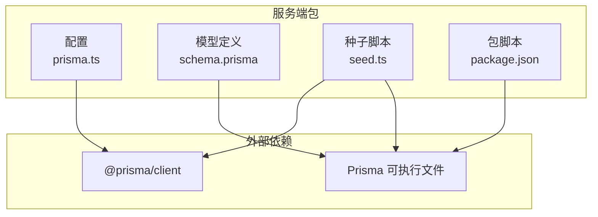
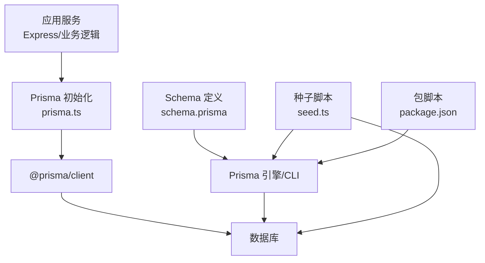
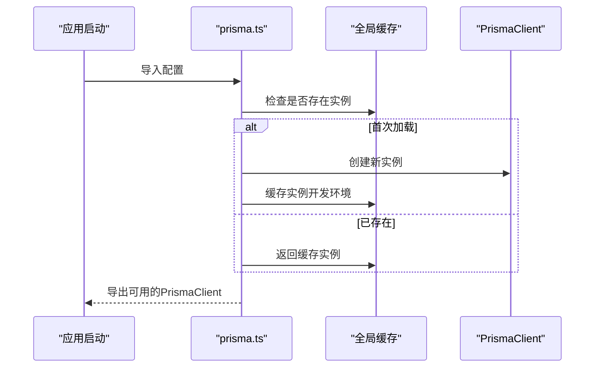
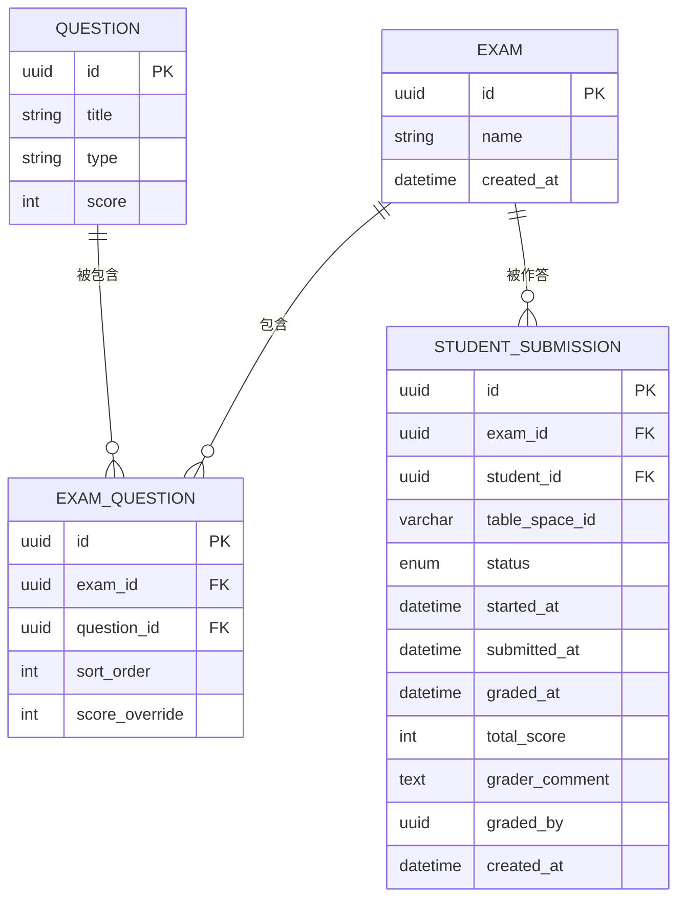
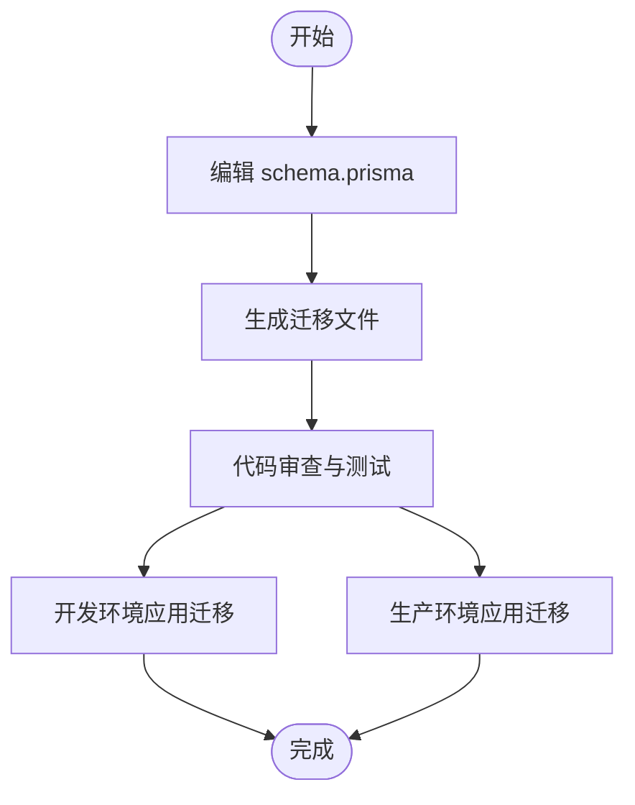
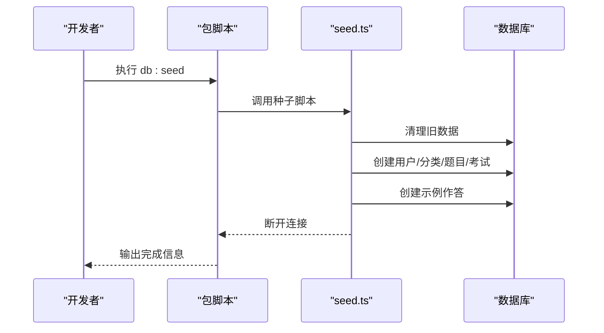
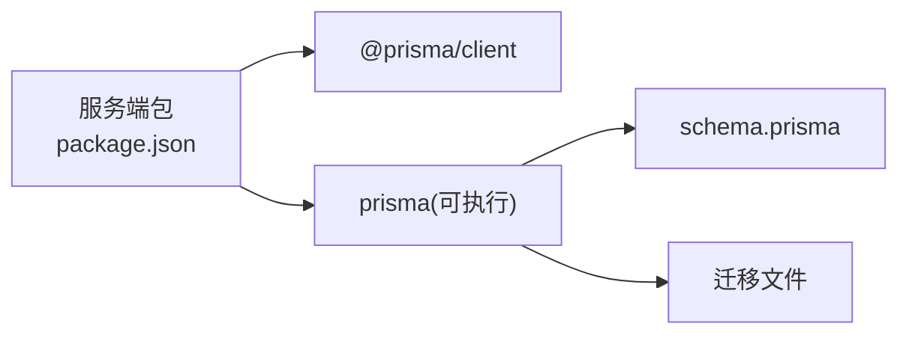

# Prisma ORM集成

<cite>
**本文引用的文件**
- [packages/server/src/config/prisma.ts](file://packages/server/src/config/prisma.ts)
- [packages/server/package.json](file://packages/server/package.json)
- [packages/server/prisma/schema.prisma](file://packages/server/prisma/schema.prisma)
- [packages/server/prisma/seed.ts](file://packages/server/prisma/seed.ts)
- [.gitignore](file://.gitignore)
- [docker-compose.yml](file://docker-compose.yml)
</cite>

## 目录
1. [简介](#简介)
2. [项目结构](#项目结构)
3. [核心组件](#核心组件)
4. [架构总览](#架构总览)
5. [详细组件分析](#详细组件分析)
6. [依赖分析](#依赖分析)
7. [性能考虑](#性能考虑)
8. [故障排查指南](#故障排查指南)
9. [结论](#结论)
10. [附录](#附录)

## 简介
本文件面向后端开发者，系统性梳理该工程中Prisma ORM的集成与使用方式，覆盖以下主题：
- Prisma Client的配置与初始化（含开发期全局实例化）
- 连接池与事务管理的建议实践
- 查询优化与常见查询模式
- 数据模型映射、类型安全与编译时验证
- 关联查询与聚合查询的实现思路
- Prisma Migrate的使用、版本控制与环境部署策略
- 错误处理、性能监控与调试技巧
- 最佳实践清单

## 项目结构
该工程采用多包结构，Prisma相关配置集中在服务端包中，包含：
- 配置层：Prisma Client初始化与全局实例化
- 模型层：Prisma Schema定义
- 工具层：数据库迁移与种子脚本
- 构建与运行：通过包内脚本触发Prisma命令

图表来源
- [packages/server/src/config/prisma.ts:1-9](file://packages/server/src/config/prisma.ts#L1-L9)
- [packages/server/package.json:5-11](file://packages/server/package.json#L5-L11)
- [packages/server/prisma/schema.prisma:143-173](file://packages/server/prisma/schema.prisma#L143-L173)
- [packages/server/prisma/seed.ts:1-244](file://packages/server/prisma/seed.ts#L1-L244)

章节来源
- [packages/server/src/config/prisma.ts:1-9](file://packages/server/src/config/prisma.ts#L1-L9)
- [packages/server/package.json:1-34](file://packages/server/package.json#L1-L34)
- [.gitignore:1-11](file://.gitignore#L1-L11)

## 核心组件
- Prisma Client初始化与全局实例化：在开发环境下避免热重载导致的重复实例化，生产环境直接使用全局缓存实例，确保进程内唯一性与稳定性。
- Prisma Schema：定义数据模型、字段映射、索引与唯一约束等，支撑类型安全与编译时验证。
- 种子脚本：用于快速生成演示数据，便于本地开发与测试。
- 包脚本：封装Prisma常用命令，如迁移、Studio可视化、种子填充等。

章节来源
- [packages/server/src/config/prisma.ts:1-9](file://packages/server/src/config/prisma.ts#L1-L9)
- [packages/server/prisma/schema.prisma:143-173](file://packages/server/prisma/schema.prisma#L143-L173)
- [packages/server/prisma/seed.ts:1-244](file://packages/server/prisma/seed.ts#L1-L244)
- [packages/server/package.json:5-11](file://packages/server/package.json#L5-L11)

## 架构总览
下图展示Prisma在应用中的角色与交互路径：服务端业务逻辑通过已初始化的Prisma Client访问数据库；Schema驱动类型安全与编译时校验；迁移与种子脚本保障数据库演进与数据准备。

图表来源
- [packages/server/src/config/prisma.ts:1-9](file://packages/server/src/config/prisma.ts#L1-L9)
- [packages/server/package.json:5-11](file://packages/server/package.json#L5-L11)
- [packages/server/prisma/schema.prisma:143-173](file://packages/server/prisma/schema.prisma#L143-L173)
- [packages/server/prisma/seed.ts:1-244](file://packages/server/prisma/seed.ts#L1-L244)

## 详细组件分析

### 组件A：Prisma Client初始化与全局实例化
- 设计要点
  - 使用全局对象缓存PrismaClient实例，开发模式下仅首次创建，避免HMR导致的重复实例化问题。
  - 生产环境直接复用全局实例，保证进程内一致性。
- 实践建议
  - 在应用启动阶段显式调用初始化模块，确保后续所有数据访问共享同一客户端。
  - 如需自定义连接池参数或日志级别，可在初始化时传入相应选项（参考Prisma官方文档）。
  - 在微服务或多进程场景中，确保每个进程独立实例化，避免跨进程共享实例带来的竞态问题。

图表来源
- [packages/server/src/config/prisma.ts:1-9](file://packages/server/src/config/prisma.ts#L1-L9)

章节来源
- [packages/server/src/config/prisma.ts:1-9](file://packages/server/src/config/prisma.ts#L1-L9)

### 组件B：数据模型映射与类型安全
- 模型映射
  - 字段映射：通过注解将Prisma模型字段映射到数据库列名，确保命名风格一致。
  - 唯一约束：使用复合唯一索引保证业务完整性。
  - 关系映射：通过外键字段与关系注解建立模型间的一对多/多对多关系。
- 类型安全与编译时验证
  - Prisma根据Schema生成强类型客户端，调用方可获得自动补全与编译期错误提示。
  - 对枚举、时间戳、UUID等特殊类型提供精确类型支持，降低运行时风险。
- 典型模型片段
  - 考试与题目关联模型展示了外键、排序字段与唯一约束的组合使用。
  - 学生作答模型体现了状态枚举、时间戳与可空字段的设计取舍。

图表来源
- [packages/server/prisma/schema.prisma:143-173](file://packages/server/prisma/schema.prisma#L143-L173)

章节来源
- [packages/server/prisma/schema.prisma:143-173](file://packages/server/prisma/schema.prisma#L143-L173)

### 组件C：常用查询模式与关联/聚合查询
- 常用查询模式
  - 单表读写：基于模型的create、findUnique、findMany、update、delete等。
  - 条件过滤：结合where、orderBy、take/skip实现分页与排序。
  - 关联查询：通过include或select嵌套查询关联模型字段，减少N+1问题。
- 关联查询
  - 一对多：父模型查询时包含子集合，子模型查询时包含父实体。
  - 多对多：通过中间表模型进行双向关联，注意唯一约束与排序字段的使用。
- 聚合查询
  - 计数：统计记录数量，常用于分页总数。
  - 聚合：求和、平均值、最大/最小值，结合分组与过滤条件实现报表需求。
- 性能建议
  - 明确选择需要的字段，避免SELECT *。
  - 合理使用索引字段作为过滤条件，必要时添加复合索引。
  - 对大结果集使用分页与限制返回条数。

（本节为概念性说明，不直接分析具体文件）

### 组件D：Prisma Migrate与版本控制
- 使用流程
  - 修改Schema后生成迁移：通过包脚本触发Prisma迁移命令。
  - 应用迁移至目标环境：在不同环境执行迁移以保持数据库结构一致。
  - 回滚与修复：遵循迁移文件不可变原则，必要时新增迁移修复问题。
- 版本控制策略
  - 将迁移文件纳入版本库，确保团队协作一致性。
  - 为破坏性变更编写迁移说明，便于审查与回滚。
- 环境部署策略
  - 开发环境：使用迁移命令自动应用最新结构。
  - 预发布/生产环境：在CI/CD流水线中执行迁移，确保部署前数据库已就绪。
  - Docker部署：在容器启动脚本中执行迁移，保证数据库初始化顺序。

图表来源
- [packages/server/package.json:9-11](file://packages/server/package.json#L9-L11)

章节来源
- [packages/server/package.json:5-11](file://packages/server/package.json#L5-L11)

### 组件E：种子数据与数据准备
- 种子脚本职责
  - 清理现有数据，避免重复导入造成冲突。
  - 按照业务顺序创建用户、分类、题目、考试等核心数据。
  - 生成典型作答样例，便于前端与测试验证。
- 执行方式
  - 通过包脚本统一入口执行种子脚本，确保环境变量与数据库连接正确。
  - 脚本结束时主动断开连接，释放资源。

图表来源
- [packages/server/prisma/seed.ts:1-244](file://packages/server/prisma/seed.ts#L1-L244)
- [packages/server/package.json:10-11](file://packages/server/package.json#L10-L11)

章节来源
- [packages/server/prisma/seed.ts:1-244](file://packages/server/prisma/seed.ts#L1-L244)
- [packages/server/package.json:10-11](file://packages/server/package.json#L10-L11)

## 依赖分析
- 内部依赖
  - 服务端包通过脚本间接依赖Prisma CLI与引擎，实际运行时由客户端库负责数据库通信。
- 外部依赖
  - @prisma/client：提供类型安全的数据库访问能力。
  - prisma：提供Schema管理、迁移与Studio等工具链。
- 版本与兼容性
  - 客户端与引擎版本需匹配，避免运行时异常。
  - Node版本需满足最低要求，确保Prisma工具链正常工作。

图表来源
- [packages/server/package.json:13-33](file://packages/server/package.json#L13-L33)
- [packages/server/prisma/schema.prisma:143-173](file://packages/server/prisma/schema.prisma#L143-L173)

章节来源
- [packages/server/package.json:13-33](file://packages/server/package.json#L13-L33)

## 性能考虑
- 连接池与并发
  - 在高并发场景中，合理设置连接池大小与超时参数，避免连接耗尽。
  - 使用事务批处理批量写入，减少往返次数。
- 查询优化
  - 优先使用索引字段作为过滤条件，避免全表扫描。
  - 减少不必要的关联查询，按需选择字段。
  - 对大结果集使用分页与限制返回条数。
- 监控与诊断
  - 启用Prisma日志，定位慢查询与异常SQL。
  - 结合数据库性能分析工具，识别瓶颈。
- 缓存策略
  - 对静态或低频变更的数据引入缓存层，减轻数据库压力。

（本节为通用指导，不直接分析具体文件）

## 故障排查指南
- 常见问题
  - 迁移失败：检查Schema变更是否符合数据库约束，必要时手动修复或新增迁移。
  - 连接异常：确认数据库可达、凭据正确与网络策略放通。
  - 类型错误：更新客户端后重新生成类型，清理缓存并重启开发服务器。
- 调试技巧
  - 使用Prisma Studio查看数据与Schema状态，辅助定位问题。
  - 在开发环境开启详细日志，逐步缩小问题范围。
  - 对复杂查询拆分为简单步骤，逐一验证中间结果。
- 错误处理
  - 对数据库异常进行捕获与分类处理，避免泄露敏感信息。
  - 在事务中出现异常时及时回滚，保证数据一致性。

（本节为通用指导，不直接分析具体文件）

## 结论
该工程以简洁的方式集成了Prisma ORM，通过全局实例化确保客户端稳定，借助Schema实现类型安全与编译时验证，并提供迁移与种子脚本完善开发与部署流程。建议在生产环境中进一步完善连接池配置、事务边界与监控告警，持续优化查询性能与数据一致性。

## 附录
- 开发与运维建议
  - 在CI/CD中加入迁移与健康检查步骤，确保部署质量。
  - 对数据库凭据与敏感配置使用环境变量管理，避免硬编码。
  - 定期备份数据库并在预生产环境验证迁移脚本。