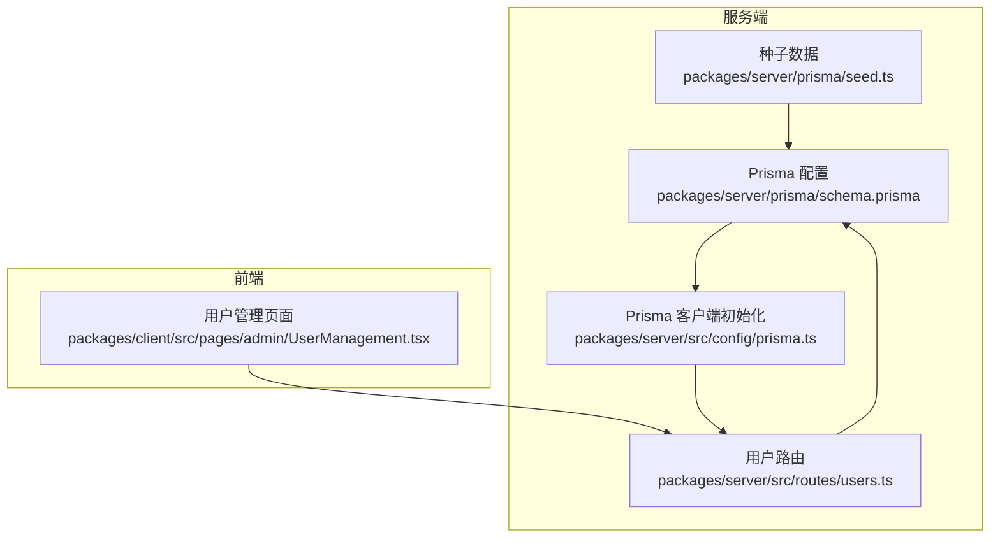
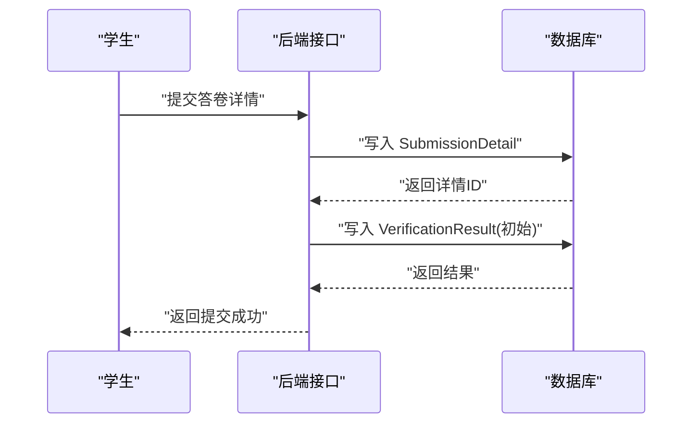
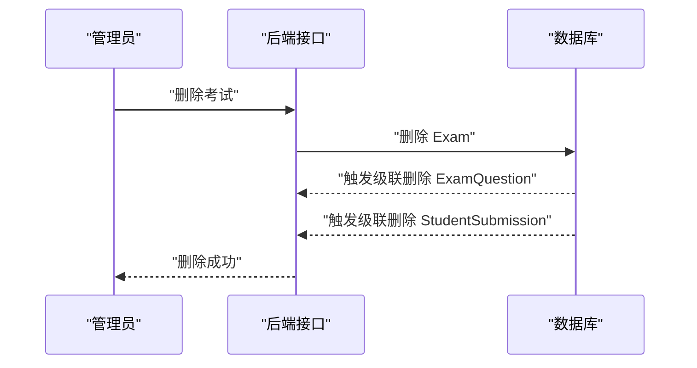
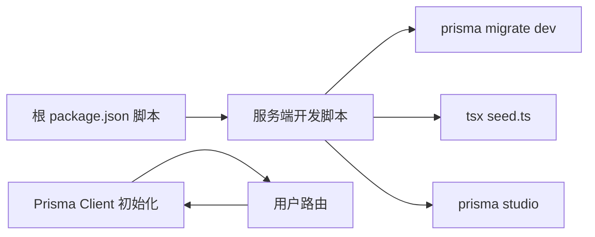

# 实体关系模型

<cite>
**本文引用的文件**
- [schema.prisma](file://packages/server/prisma/schema.prisma)
- [prisma.ts](file://packages/server/src/config/prisma.ts)
- [users.ts](file://packages/server/src/routes/users.ts)
- [seed.ts](file://packages/server/prisma/seed.ts)
- [package.json（根）](file://package.json)
- [package.json（服务端）](file://packages/server/package.json)
</cite>

## 目录
1. [简介](#简介)
2. [项目结构](#项目结构)
3. [核心组件](#核心组件)
4. [架构总览](#架构总览)
5. [详细组件分析](#详细组件分析)
6. [依赖分析](#依赖分析)
7. [性能考虑](#性能考虑)
8. [故障排查指南](#故障排查指南)
9. [结论](#结论)
10. [附录](#附录)

## 简介
本文件基于 Prisma Schema 定义，系统化梳理考试系统中的核心实体及其关系，覆盖用户(User)、题目(Question)、考试(Exam)、答卷(Submission)、角色(Role)等，并明确一对一、一对多、多对多关系的建模方式，解释外键约束、级联删除与更新策略，给出 ER 图与业务逻辑说明，为数据库设计者提供可执行的实体关系参考。

## 项目结构
- 后端使用 Prisma 作为 ORM，数据源为 PostgreSQL。
- 服务端工作区通过脚本统一管理数据库迁移、种子数据与开发环境。
- 前端页面展示用户管理等业务场景，后端路由与 Prisma 模型保持一致的数据结构。



**图表来源**
- [schema.prisma](file://packages/server/prisma/schema.prisma)
- [prisma.ts](file://packages/server/src/config/prisma.ts)
- [users.ts](file://packages/server/src/routes/users.ts)
- [seed.ts](file://packages/server/prisma/seed.ts)

**章节来源**
- [package.json（根）:1-26](file://package.json#L1-L26)
- [package.json（服务端）:1-34](file://packages/server/package.json#L1-L34)

## 核心组件
本节聚焦于核心实体与枚举，说明其字段、数据类型与业务含义。

- 用户(User)
  - 关键字段：主键 id、唯一用户名 username、密码哈希 passwordHash、真实姓名 realName、角色 role、邮箱 email、头像 avatarUrl、创建/更新时间 createdAt/updatedAt。
  - 数据类型：id 使用 UUID；字符串字段采用变长限制；role 为枚举；时间字段默认值与自动更新策略由注解控制。
  - 业务含义：系统身份主体，区分管理员、教师、学生三类角色。

- 题目分类(QuestionCategory)
  - 关键字段：主键 id、名称 name、父节点 parentId（自关联）、排序字段 sortOrder、创建时间 createdAt。
  - 关系：自关联树形结构，支持层级分类；与题目建立一对多关系。

- 题目(Question)
  - 关键字段：主键 id、所属分类 categoryId、标题 title、描述 description、类型 type、难度 difficulty、分数 score、答案规则 answerRules、提示 hints、标签 tags、状态 status、创建者 createdBy、创建/更新时间 createdAt/updatedAt。
  - 关系：属于一个分类；可被某用户创建；与考试通过中间表关联；与答卷详情关联。

- 考试(Exam)
  - 关键字段：主键 id、标题 title、描述 description、模式 mode、时长 durationMinutes、开始/结束时间 startTime/endTime、总分 totalScore、及格分 passScore、状态 status、设置 settings、创建者 createdBy、创建/更新时间 createdAt/updatedAt。
  - 关系：可被某用户创建；与题目通过中间表关联；生成多个答卷；生成会话记录。

- 考试-题目中间表(ExamQuestion)
  - 关键字段：主键 id、考试 examId、题目 questionId、排序 sortOrde、分数覆盖 scoreOverride。
  - 约束：复合唯一索引(examId, questionId)，确保同一考试中不重复包含同一题目。
  - 级联：删除考试时级联删除该中间表记录。

- 答卷(StudentSubmission)
  - 关键字段：主键 id、所属考试 examId、学生 studentId、表空间标识 tableSpaceId、状态 status、开始/提交/阅卷时间 startedAt/submittedAt/gradedAt、总分 totalScore、评阅意见 graderComment、评阅人 gradedBy、创建时间 createdAt。
  - 关系：属于一个考试与一个学生；可有多个答卷详情；可有评阅结果；可有会话记录；与评阅人是自引用关系。

- 答卷详情(SubmissionDetail)
  - 关键字段：主键 id、所属答卷 submissionId、题目 questionId、答案 answerJson、得分 score、是否正确 isCorrect、创建时间 createdAt。
  - 关系：属于一个答卷与一个题目；可有评阅结果。

- 评阅结果(VerificationResult)
  - 关键字段：主键 id、所属答卷详情 submissionDetailId、所属答卷 submissionId、规则标识 ruleId、动作 action、期望 expected、实际 actual、是否通过 passed、得分 score、错误信息 errorMessage、是否需要复核 needsReview、评阅时间 verifiedAt。
  - 关系：属于一个答卷详情与一个答卷。

- 考试会话(ExamSession)
  - 关键字段：主键 id、唯一答卷 submissionId、学生 studentId、考试 examId、WebSocket 连接状态 wsConnected、最后心跳 lastHeartbeat、IP 地址 ipAddress、创建时间 createdAt。
  - 关系：唯一对应一个答卷；属于一个学生与一个考试。

- 枚举
  - 用户角色(UserRole)：admin、teacher、student
  - 题目类型(QuestionType)：create_table、add_field、config_view、create_form、comprehensive
  - 难度(Difficulty)：easy、medium、hard
  - 题目状态(QuestionStatus)：draft、published、archived
  - 考试模式(ExamMode)：practice、quiz、exam
  - 考试状态(ExamStatus)：draft、published、in_progress、ended、archived
  - 答卷状态(SubmissionStatus)：pending、in_progress、submitted、grading、graded

**章节来源**
- [schema.prisma:60-242](file://packages/server/prisma/schema.prisma#L60-L242)

## 架构总览
下图展示核心实体之间的关系与流向，标注外键、唯一性与级联策略。

```mermaid
erDiagram
USER ||--o{ QUESTION : "创建者"
USER ||--o{ EXAM : "创建者"
USER ||--o{ STUDENT_SUBMISSION : "学生"
USER ||--o{ STUDENT_SUBMISSION : "评阅人(自引用)"
USER ||--o{ EXAM_SESSION : "学生"
QUESTION_CATEGORY ||--o{ QUESTION : "分类"
QUESTION ||--o{ EXAM_QUESTION : "被包含"
EXAM ||--o{ EXAM_QUESTION : "包含"
EXAM ||--o{ STUDENT_SUBMISSION : "产生"
STUDENT_SUBMISSION ||--o{ SUBMISSION_DETAIL : "包含"
SUBMISSION_DETAIL ||--o{ VERIFICATION_RESULT : "产生"
STUDENT_SUBMISSION ||--|| EXAM_SESSION : "唯一会话"
EXAM_QUESTION {
string examId FK
string questionId FK
int sortOrder
int scoreOverride
}
STUDENT_SUBMISSION {
string examId FK
string studentId FK
string tableSpaceId
enum status
datetime startedAt
datetime submittedAt
datetime gradedAt
int totalScore
string graderComment
string gradedBy FK
}
SUBMISSION_DETAIL {
string submissionId FK
string questionId FK
json answerJson
int score
boolean isCorrect
}
VERIFICATION_RESULT {
string submissionDetailId FK
string submissionId FK
string ruleId
string action
json expected
json actual
boolean passed
int score
string errorMessage
boolean needsReview
datetime verifiedAt
}
EXAM_SESSION {
string submissionId FK UK
string studentId FK
string examId FK
boolean wsConnected
datetime lastHeartbeat
inet ipAddress
}
```

**图表来源**
- [schema.prisma:60-242](file://packages/server/prisma/schema.prisma#L60-L242)

## 详细组件分析

### 用户(User)实体
- 字段与类型
  - id(String, UUID, 主键)
  - username(String, 唯一)
  - passwordHash(String)
  - realName(String?)
  - role(UserRole)
  - email(String?)
  - avatarUrl(String?)
  - createdAt(DateTime), updatedAt(DateTime)
- 关系
  - 创建题目、创建考试、答题、评阅、会话
- 业务含义
  - 角色驱动访问控制；用于审计与归属

**章节来源**
- [schema.prisma:60-79](file://packages/server/prisma/schema.prisma#L60-L79)

### 题目分类(QuestionCategory)实体
- 字段与类型
  - id(String, UUID, 主键)
  - name(String)
  - parentId(String?, 自关联)
  - sortOrder(Int)
  - createdAt(DateTime)
- 关系
  - 父子节点自关联；与题目一对多
- 业务含义
  - 支持层级化的题目组织

**章节来源**
- [schema.prisma:81-94](file://packages/server/prisma/schema.prisma#L81-L94)

### 题目(Question)实体
- 字段与类型
  - id(String, UUID, 主键)
  - categoryId(String?, 外键)
  - title(String)
  - description(String?)
  - type(QuestionType)
  - difficulty(Difficulty)
  - score(Int)
  - answerRules(Json)
  - hints(String?)
  - tags(String[])
  - status(QuestionStatus)
  - createdBy(String?, 外键)
  - createdAt/updatedAt(DateTime)
- 关系
  - 属于一个分类；可被某用户创建；与考试通过中间表关联；与答卷详情关联
- 业务含义
  - 考试内容载体；支持多种题型与难度

**章节来源**
- [schema.prisma:96-119](file://packages/server/prisma/schema.prisma#L96-L119)

### 考试(Exam)实体
- 字段与类型
  - id(String, UUID, 主键)
  - title(String)
  - description(String?)
  - mode(ExamMode)
  - durationMinutes(Int?)
  - startTime/endTime(DateTime?)
  - totalScore(Int)
  - passScore(Int?)
  - status(ExamStatus)
  - settings(Json)
  - createdBy(String?, 外键)
  - createdAt/updatedAt(DateTime)
- 关系
  - 可被某用户创建；与题目通过中间表关联；生成多个答卷；生成会话
- 业务含义
  - 组织与发布考试；控制时长、状态与评分

**章节来源**
- [schema.prisma:121-144](file://packages/server/prisma/schema.prisma#L121-L144)

### 考试-题目中间表(ExamQuestion)
- 字段与类型
  - id(String, UUID, 主键)
  - examId(String, 外键)
  - questionId(String, 外键)
  - sortOrder(Int)
  - scoreOverride(Int?)
- 约束
  - 复合唯一(examId, questionId)
- 级联
  - 删除考试时级联删除中间表记录
- 业务含义
  - 将题目分配到具体考试并支持排序与分数覆盖

**章节来源**
- [schema.prisma:146-159](file://packages/server/prisma/schema.prisma#L146-L159)

### 答卷(StudentSubmission)
- 字段与类型
  - id(String, UUID, 主键)
  - examId(String, 外键)
  - studentId(String, 外键)
  - tableSpaceId(String?)
  - status(SubmissionStatus)
  - startedAt/submittedAt/gradedAt(DateTime?)
  - totalScore(Int?)
  - graderComment(String?)
  - gradedBy(String?, 外键)
  - createdAt(DateTime)
- 约束
  - 复合唯一(examId, studentId)
- 关系
  - 属于一个考试与一个学生；可有多个答卷详情；可有评阅结果；可有会话
- 业务含义
  - 记录一次完整的作答过程与结果

**章节来源**
- [schema.prisma:161-185](file://packages/server/prisma/schema.prisma#L161-L185)

### 答卷详情(SubmissionDetail)
- 字段与类型
  - id(String, UUID, 主键)
  - submissionId(String, 外键)
  - questionId(String, 外键)
  - answerJson(Json)
  - score(Int?)
  - isCorrect(Boolean?)
  - createdAt(DateTime)
- 约束
  - 复合唯一(submissionId, questionId)
- 关系
  - 属于一个答卷与一个题目；可有评阅结果
- 业务含义
  - 记录每道题的答案与即时评分

**章节来源**
- [schema.prisma:187-203](file://packages/server/prisma/schema.prisma#L187-L203)

### 评阅结果(VerificationResult)
- 字段与类型
  - id(String, UUID, 主键)
  - submissionDetailId(String, 外键)
  - submissionId(String, 外键)
  - ruleId(String)
  - action(String)
  - expected/actual(Json?)
  - passed(Boolean)
  - score(Int)
  - errorMessage(String?)
  - needsReview(Boolean)
  - verifiedAt(DateTime)
- 关系
  - 属于一个答卷详情与一个答卷
- 业务含义
  - 描述评分规则执行结果与最终得分

**章节来源**
- [schema.prisma:205-224](file://packages/server/prisma/schema.prisma#L205-L224)

### 考试会话(ExamSession)
- 字段与类型
  - id(String, UUID, 主键)
  - submissionId(String, 外键, 唯一)
  - studentId(String, 外键)
  - examId(String, 外键)
  - wsConnected(Boolean)
  - lastHeartbeat(DateTime?)
  - ipAddress(Inet?)
  - createdAt(DateTime)
- 关系
  - 唯一对应一个答卷；属于一个学生与一个考试
- 业务含义
  - 记录在线考试期间的会话状态与安全信息

**章节来源**
- [schema.prisma:226-242](file://packages/server/prisma/schema.prisma#L226-L242)

### 关系建模与约束策略
- 一对一
  - ExamSession 与 StudentSubmission：一对一强约束（ExamSession.submissionId 唯一）
- 一对多
  - User → Question/Exam：一对多（创建者）
  - QuestionCategory → Question：一对多（分类）
  - Exam → StudentSubmission：一对多（产生答卷）
  - StudentSubmission → SubmissionDetail：一对多（包含题目作答）
- 多对多
  - Exam — Question：通过 ExamQuestion 中间表实现多对多
- 外键与级联
  - ExamQuestion.examId onDelete: Cascade
  - SubmissionDetail.submissionId onDelete: Cascade
  - VerificationResult.submissionId onDelete: Cascade
  - VerificationResult.submissionDetailId onDelete: Cascade
  - ExamSession.submissionId onDelete: Cascade
- 唯一性
  - ExamQuestion(examId, questionId) 唯一
  - StudentSubmission(examId, studentId) 唯一
  - ExamSession(submissionId) 唯一

**章节来源**
- [schema.prisma:146-159](file://packages/server/prisma/schema.prisma#L146-L159)
- [schema.prisma:161-185](file://packages/server/prisma/schema.prisma#L161-L185)
- [schema.prisma:187-203](file://packages/server/prisma/schema.prisma#L187-L203)
- [schema.prisma:205-224](file://packages/server/prisma/schema.prisma#L205-L224)
- [schema.prisma:226-242](file://packages/server/prisma/schema.prisma#L226-L242)

### 典型流程序列图

#### 提交答卷流程


**图表来源**
- [schema.prisma:187-203](file://packages/server/prisma/schema.prisma#L187-L203)
- [schema.prisma:205-224](file://packages/server/prisma/schema.prisma#L205-L224)

#### 删除考试流程


**图表来源**
- [schema.prisma:146-159](file://packages/server/prisma/schema.prisma#L146-L159)
- [schema.prisma:161-185](file://packages/server/prisma/schema.prisma#L161-L185)

## 依赖分析
- 服务端依赖 Prisma Client 与 Prisma Engine，通过全局单例管理客户端实例。
- 脚本统一管理数据库迁移、种子数据与可视化工具。
- 前端页面通过 API 与后端交互，后端路由与 Prisma 模型字段保持一致。



**图表来源**
- [package.json（根）:6-16](file://package.json#L6-L16)
- [package.json（服务端）:5-11](file://packages/server/package.json#L5-L11)
- [prisma.ts:1-9](file://packages/server/src/config/prisma.ts#L1-L9)

**章节来源**
- [package.json（根）:1-26](file://package.json#L1-L26)
- [package.json（服务端）:1-34](file://packages/server/package.json#L1-L34)
- [prisma.ts:1-9](file://packages/server/src/config/prisma.ts#L1-L9)

## 性能考虑
- 索引建议
  - 在 ExamQuestion(examId, questionId) 上保证查询与去重效率
  - 在 StudentSubmission(examId, studentId) 上保证按人查卷效率
  - 在 VerificationResult(submissionId, submissionDetailId) 上保证评分回溯效率
- 查询优化
  - 后端路由仅选择必要字段，避免 N+1 查询
  - 使用分页参数控制返回量
- 写入优化
  - 批量写入中间表与详情表时注意事务一致性
- 缓存与会话
  - ExamSession 记录 IP 与心跳，便于并发与安全控制

## 故障排查指南
- 常见问题
  - 外键约束冲突：检查中间表唯一性与关联字段是否为空
  - 级联删除影响范围过大：确认删除考试前是否需要保留历史
  - 评阅结果缺失：确认 SubmissionDetail 是否存在且已写入 VerificationResult
- 排查步骤
  - 使用 Prisma Studio 查看实体与关系
  - 检查路由层字段选择与校验
  - 核对种子数据与测试用例，定位异常数据

**章节来源**
- [users.ts:45-100](file://packages/server/src/routes/users.ts#L45-L100)
- [seed.ts:1-244](file://packages/server/prisma/seed.ts#L1-L244)

## 结论
本 ER 模型以 Prisma Schema 为依据，完整刻画了用户、题目、考试、答卷、会话等核心实体的关系与约束。通过明确的外键、唯一性与级联策略，既保障了业务完整性，也为后续扩展与维护提供了清晰的边界。建议在生产环境中结合索引策略与查询优化进一步提升性能。

## 附录
- 数据库连接与客户端
  - 使用 PostgreSQL 作为数据源
  - 通过 Prisma Client 初始化与全局缓存减少实例创建开销
- 开发与运维
  - 使用脚本统一管理迁移、种子与可视化工具
  - 前端页面与后端路由字段保持一致，降低耦合

**章节来源**
- [schema.prisma:7-10](file://packages/server/prisma/schema.prisma#L7-L10)
- [prisma.ts:1-9](file://packages/server/src/config/prisma.ts#L1-L9)
- [package.json（根）:6-16](file://package.json#L6-L16)
- [package.json（服务端）:5-11](file://packages/server/package.json#L5-L11)