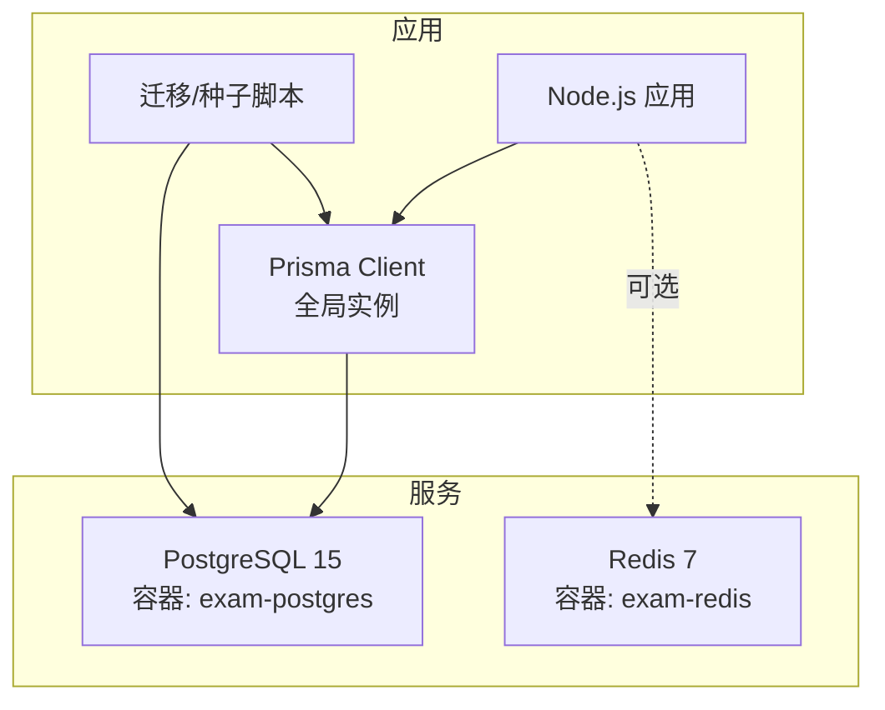
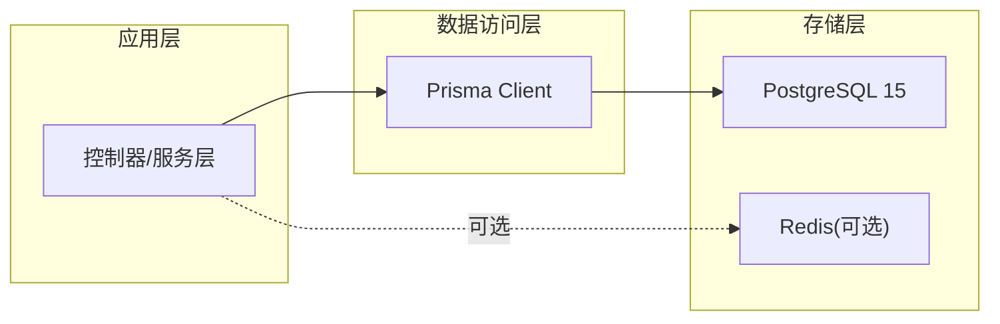
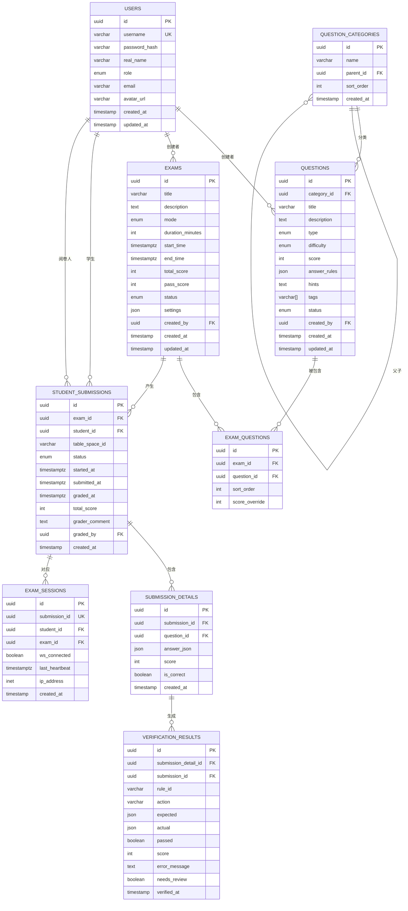
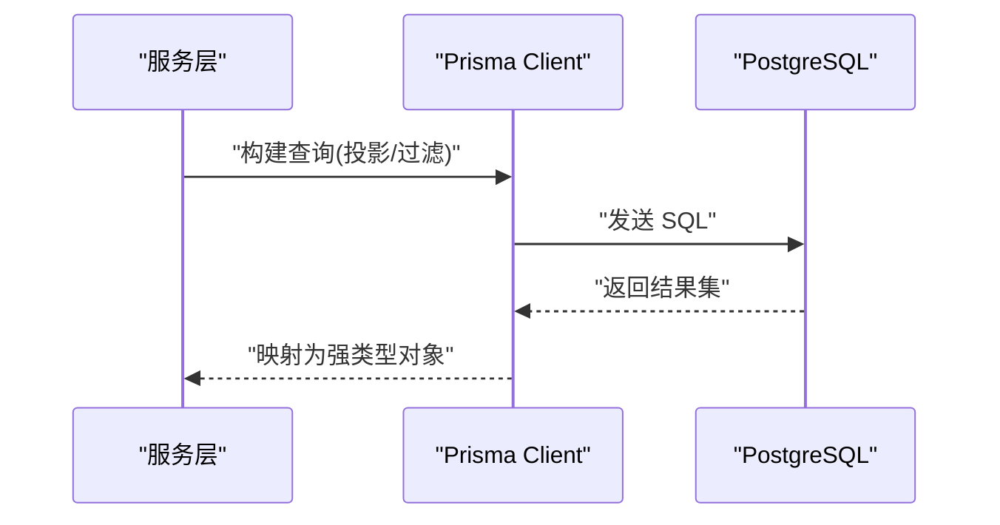
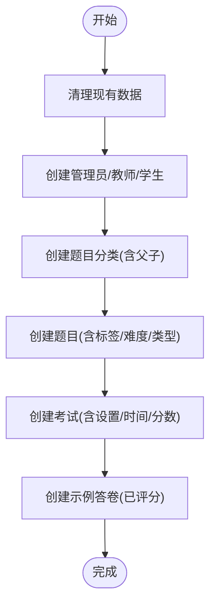
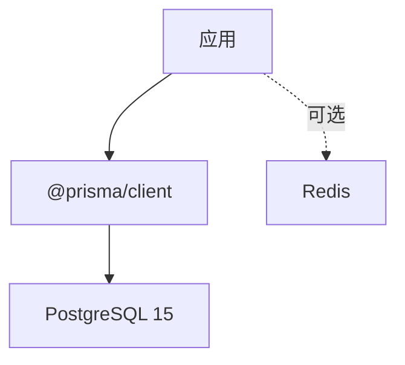

# 数据库设计

<cite>
**本文引用的文件**
- [schema.prisma](file://packages/server/prisma/schema.prisma)
- [prisma.ts](file://packages/server/src/config/prisma.ts)
- [seed.ts](file://packages/server/prisma/seed.ts)
- [docker-compose.yml](file://docker-compose.yml)
- [package.json](file://packages/server/package.json)
</cite>

## 目录
1. [简介](#简介)
2. [项目结构](#项目结构)
3. [核心组件](#核心组件)
4. [架构总览](#架构总览)
5. [详细组件分析](#详细组件分析)
6. [依赖分析](#依赖分析)
7. [性能考虑](#性能考虑)
8. [故障排查指南](#故障排查指南)
9. [结论](#结论)
10. [附录](#附录)

## 简介
本文件面向数据库管理员与后端开发者，提供基于 PostgreSQL 15 的考试系统数据库设计综合文档。内容涵盖实体关系模型、表结构与字段类型选择、索引与约束策略、Prisma ORM 使用方式与查询优化、数据迁移与种子数据管理、数据完整性保障、性能调优、备份恢复与监控告警最佳实践。

## 项目结构
系统采用分层与按功能模块组织的结构，数据库相关的关键位置如下：
- Prisma 模式文件：定义数据模型、枚举、关系与注解
- Prisma 客户端配置：全局单例 PrismaClient 实例
- 种子脚本：初始化演示数据（用户、分类、题目、考试、答卷）
- Docker Compose：本地 Postgres 15 与 Redis 配置
- 包管理脚本：数据库迁移与 Studio 启动命令

图表来源
- [docker-compose.yml:1-37](file://docker-compose.yml#L1-L37)
- [prisma.ts:1-9](file://packages/server/src/config/prisma.ts#L1-L9)
- [package.json:5-12](file://packages/server/package.json#L5-L12)

章节来源
- [docker-compose.yml:1-37](file://docker-compose.yml#L1-L37)
- [prisma.ts:1-9](file://packages/server/src/config/prisma.ts#L1-L9)
- [package.json:1-34](file://packages/server/package.json#L1-L34)

## 核心组件
本节概述数据库中的核心实体及其职责边界：
- 用户(User)：系统角色(admin/teacher/student)，关联创建的题目与考试、答题会话、评分记录
- 题目分类(QuestionCategory)：树形层级结构，支持父子关系与排序
- 题目(Question)：包含类型、难度、分数、答案规则、标签、状态等
- 考试(Exam)：模式(练习/测验/正式)、时长、时间窗口、总分与及格线、状态
- 关联表：ExamQuestion(考试-题目多对多)、StudentSubmission(学生答卷)、SubmissionDetail(答卷详情)、VerificationResult(验证结果)、ExamSession(考试会话)
- 枚举：UserRole、QuestionType、Difficulty、QuestionStatus、ExamMode、ExamStatus、SubmissionStatus

章节来源
- [schema.prisma:12-58](file://packages/server/prisma/schema.prisma#L12-L58)
- [schema.prisma:60-79](file://packages/server/prisma/schema.prisma#L60-L79)
- [schema.prisma:81-94](file://packages/server/prisma/schema.prisma#L81-L94)
- [schema.prisma:96-119](file://packages/server/prisma/schema.prisma#L96-L119)
- [schema.prisma:121-144](file://packages/server/prisma/schema.prisma#L121-L144)
- [schema.prisma:146-159](file://packages/server/prisma/schema.prisma#L146-L159)
- [schema.prisma:161-185](file://packages/server/prisma/schema.prisma#L161-L185)
- [schema.prisma:187-203](file://packages/server/prisma/schema.prisma#L187-L203)
- [schema.prisma:205-224](file://packages/server/prisma/schema.prisma#L205-L224)
- [schema.prisma:226-242](file://packages/server/prisma/schema.prisma#L226-L242)

## 架构总览
下图展示数据库层与应用层交互，以及 Prisma 在其中的角色。

图表来源
- [prisma.ts:1-9](file://packages/server/src/config/prisma.ts#L1-L9)
- [docker-compose.yml:4-19](file://docker-compose.yml#L4-L19)
- [docker-compose.yml:21-32](file://docker-compose.yml#L21-L32)

## 详细组件分析

### 实体关系模型与表结构
- 用户(User)
  - 主键：String(UUID)
  - 唯一索引：username
  - 字段类型：字符串、枚举、时间戳
  - 关系：创建者(一对多)、阅卷者(一对多)、答卷(一对多)、会话(一对多)
- 题目分类(QuestionCategory)
  - 主键：String(UUID)
  - 自引用外键：parent_id -> id
  - 排序字段：sort_order
  - 关系：父节点(一对一)、子节点(一对多)、题目(一对多)
- 题目(Question)
  - 主键：String(UUID)
  - 外键：category_id -> QuestionCategory(id)
  - 默认值：difficulty=medium, score=10, answerRules=[], tags=[]
  - 关系：所属分类、创建者、参与考试、答题详情
- 考试(Exam)
  - 主键：String(UUID)
  - 默认值：mode=practice, totalScore=100
  - 关系：创建者、考试-题目、学生答卷、会话
- 考试-题目(ExamQuestion)
  - 复合唯一索引：(exam_id, question_id)
  - 删除行为：级联删除
- 学生答卷(StudentSubmission)
  - 复合唯一索引：(exam_id, student_id)
  - 状态：SubmissionStatus
  - 关系：所属考试、学生、阅卷人、详情、验证结果、会话
- 答卷详情(SubmissionDetail)
  - 复合唯一索引：(submission_id, question_id)
  - 删除行为：级联删除
  - 关系：所属答卷、题目、验证结果
- 验证结果(VerificationResult)
  - 关系：所属详情、所属答卷
- 考试会话(ExamSession)
  - 唯一键：submission_id
  - 关系：所属答卷、学生、考试

图表来源
- [schema.prisma:60-79](file://packages/server/prisma/schema.prisma#L60-L79)
- [schema.prisma:81-94](file://packages/server/prisma/schema.prisma#L81-L94)
- [schema.prisma:96-119](file://packages/server/prisma/schema.prisma#L96-L119)
- [schema.prisma:121-144](file://packages/server/prisma/schema.prisma#L121-L144)
- [schema.prisma:146-159](file://packages/server/prisma/schema.prisma#L146-L159)
- [schema.prisma:161-185](file://packages/server/prisma/schema.prisma#L161-L185)
- [schema.prisma:187-203](file://packages/server/prisma/schema.prisma#L187-L203)
- [schema.prisma:205-224](file://packages/server/prisma/schema.prisma#L205-L224)
- [schema.prisma:226-242](file://packages/server/prisma/schema.prisma#L226-L242)

章节来源
- [schema.prisma:60-79](file://packages/server/prisma/schema.prisma#L60-L79)
- [schema.prisma:81-94](file://packages/server/prisma/schema.prisma#L81-L94)
- [schema.prisma:96-119](file://packages/server/prisma/schema.prisma#L96-L119)
- [schema.prisma:121-144](file://packages/server/prisma/schema.prisma#L121-L144)
- [schema.prisma:146-159](file://packages/server/prisma/schema.prisma#L146-L159)
- [schema.prisma:161-185](file://packages/server/prisma/schema.prisma#L161-L185)
- [schema.prisma:187-203](file://packages/server/prisma/schema.prisma#L187-L203)
- [schema.prisma:205-224](file://packages/server/prisma/schema.prisma#L205-L224)
- [schema.prisma:226-242](file://packages/server/prisma/schema.prisma#L226-L242)

### 字段类型与约束策略
- 主键与唯一性
  - 所有实体主键使用 UUID(String)，确保分布式安全与不可猜测性
  - 唯一约束：用户名(username)、复合唯一索引用于关联表
- 字符串长度
  - 使用 VarChar(N) 控制长度上限，如 username(64)、realName(128)、email(255)、avatarUrl(512)、IP 地址使用 inet 类型
- JSON 字段
  - answerRules、settings、answerJson 使用 JSON/JSONB；根据实际查询需求可在 PostgreSQL 层面建立 GIN 索引以加速检索
- 时间戳
  - created_at、updated_at、started_at、submitted_at、graded_at、verified_at 使用 timestamptz，统一 UTC 存储
- 默认值与空值
  - difficulty 默认 medium，score 默认 10，tags 默认空数组，answerRules 默认空数组，status 默认 draft 或 pending
- 外键与级联
  - ExamQuestion、SubmissionDetail、VerificationResult 设置级联删除，保证数据一致性

章节来源
- [schema.prisma:60-79](file://packages/server/prisma/schema.prisma#L60-L79)
- [schema.prisma:81-94](file://packages/server/prisma/schema.prisma#L81-L94)
- [schema.prisma:96-119](file://packages/server/prisma/schema.prisma#L96-L119)
- [schema.prisma:121-144](file://packages/server/prisma/schema.prisma#L121-L144)
- [schema.prisma:146-159](file://packages/server/prisma/schema.prisma#L146-L159)
- [schema.prisma:161-185](file://packages/server/prisma/schema.prisma#L161-L185)
- [schema.prisma:187-203](file://packages/server/prisma/schema.prisma#L187-L203)
- [schema.prisma:205-224](file://packages/server/prisma/schema.prisma#L205-L224)
- [schema.prisma:226-242](file://packages/server/prisma/schema.prisma#L226-L242)

### Prisma ORM 使用方式与查询优化
- 客户端初始化
  - 全局单例 PrismaClient，开发环境缓存于全局对象，避免重复实例化
- 查询优化建议
  - 为高频过滤字段建立索引：username、(exam_id, student_id)、(submission_id, question_id)、(exam_id, question_id)
  - 对 JSON 字段查询使用 GIN 索引；必要时将频繁查询的 JSON 键提取为独立列
  - 使用 select 投影减少网络传输与序列化开销
  - 批量写入：使用 transaction 包裹多个写操作，提升原子性与性能
  - 分页：使用 cursor 或 offset 分页，优先考虑基于索引的游标分页
- 迁移与版本控制
  - 使用 Prisma Migrate 管理结构变更；在生产环境执行前先在预发布环境验证
- Studio 调试
  - 使用 prisma studio 快速浏览与验证数据模型

图表来源
- [prisma.ts:1-9](file://packages/server/src/config/prisma.ts#L1-L9)
- [package.json:9-11](file://packages/server/package.json#L9-L11)

章节来源
- [prisma.ts:1-9](file://packages/server/src/config/prisma.ts#L1-L9)
- [package.json:5-12](file://packages/server/package.json#L5-L12)

### 数据迁移策略
- 开发阶段
  - 使用 prisma migrate dev 创建迁移文件并同步到本地数据库
- 预发布/生产阶段
  - 使用 prisma migrate deploy 应用已审阅的迁移，避免自动检测
  - 在执行迁移前进行备份与回滚计划
- 版本兼容
  - 避免破坏性变更；必要时通过添加新列+数据迁移+切换逻辑的方式平滑过渡

章节来源
- [package.json:9-11](file://packages/server/package.json#L9-L11)

### 种子数据管理
- 目的：快速搭建演示环境，包含用户、分类、题目、考试、答卷示例
- 流程：启动前清理旧数据，按顺序创建用户、分类、题目、考试，最后创建带评分的示例答卷
- 访问方式：npm 脚本 db:seed

图表来源
- [seed.ts:1-244](file://packages/server/prisma/seed.ts#L1-L244)

章节来源
- [seed.ts:1-244](file://packages/server/prisma/seed.ts#L1-L244)
- [package.json:10](file://packages/server/package.json#L10)

### 数据完整性保证
- 强一致外键约束：所有关系均通过外键维护
- 唯一性约束：用户名唯一、复合唯一索引防止重复关联
- 级联删除：删除考试或答卷时自动清理明细与验证结果
- 默认值与非空：关键字段设置合理默认值，避免脏数据
- 业务状态机：SubmissionStatus、ExamStatus 等枚举约束状态流转

章节来源
- [schema.prisma:146-159](file://packages/server/prisma/schema.prisma#L146-L159)
- [schema.prisma:161-185](file://packages/server/prisma/schema.prisma#L161-L185)
- [schema.prisma:187-203](file://packages/server/prisma/schema.prisma#L187-L203)
- [schema.prisma:205-224](file://packages/server/prisma/schema.prisma#L205-L224)
- [schema.prisma:226-242](file://packages/server/prisma/schema.prisma#L226-L242)

## 依赖分析
- 外部依赖
  - PostgreSQL 15：作为主数据库
  - Redis：可选缓存/会话存储
- 内部依赖
  - Prisma Client：ORM 客户端
  - Node.js 应用：业务逻辑层

图表来源
- [package.json:13-24](file://packages/server/package.json#L13-L24)
- [docker-compose.yml:4-19](file://docker-compose.yml#L4-L19)
- [docker-compose.yml:21-32](file://docker-compose.yml#L21-L32)

章节来源
- [package.json:1-34](file://packages/server/package.json#L1-L34)
- [docker-compose.yml:1-37](file://docker-compose.yml#L1-L37)

## 性能考虑
- 索引策略
  - 为高频查询字段建立 B-tree/GIN 索引；对 JSON 字段使用 GIN
  - 复合唯一索引用于关联表，避免重复与提升连接效率
- 查询优化
  - 使用 select 投影与 where 条件精确过滤
  - 分页与游标分页，避免大结果集全量传输
  - 批量写入与事务包裹
- 缓存与异步
  - Redis 缓存热点数据与会话信息
  - 异步任务处理耗时操作(如评分、统计)
- 数据库参数
  - 调整共享缓冲区、工作内存、并发连接数等参数以适配负载
- 监控与日志
  - 启用慢查询日志与执行计划分析
  - 结合 APM 工具追踪慢查询与错误

## 故障排查指南
- 连接问题
  - 检查 DATABASE_URL 环境变量与容器健康检查
  - 确认 Postgres 服务可用与端口映射正确
- 迁移失败
  - 查看迁移日志与回滚脚本
  - 在预发布环境先行验证
- 数据不一致
  - 核查唯一约束与外键关系
  - 检查级联删除是否触发
- 性能下降
  - 分析慢查询与缺少索引
  - 评估分页策略与查询投影

章节来源
- [docker-compose.yml:15-19](file://docker-compose.yml#L15-L19)
- [package.json:9-11](file://packages/server/package.json#L9-L11)

## 结论
该数据库设计围绕用户、题目、考试、答卷等核心实体展开，采用 UUID 主键、明确的枚举与状态机、严格的外键与唯一约束，结合 Prisma ORM 提供的强类型与迁移能力，形成可演进、可维护、可扩展的数据层。配合合理的索引策略、查询优化与运维实践，能够满足考试系统的高可用与高性能需求。

## 附录
- 环境准备
  - 使用 docker-compose 启动 Postgres 15 与 Redis
  - 通过 npm 脚本执行迁移与种子数据
- 常用命令
  - 数据库迁移：npm run db:migrate
  - 填充种子数据：npm run db:seed
  - 启动 Prisma Studio：npm run db:studio

章节来源
- [docker-compose.yml:1-37](file://docker-compose.yml#L1-L37)
- [package.json:5-12](file://packages/server/package.json#L5-L12)