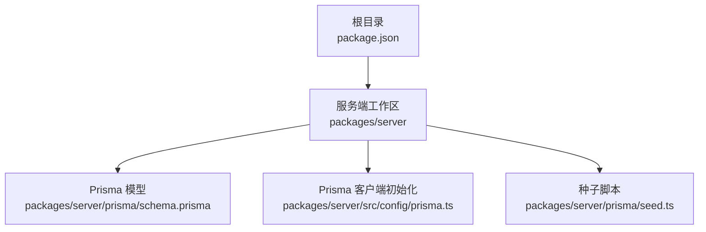
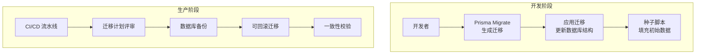
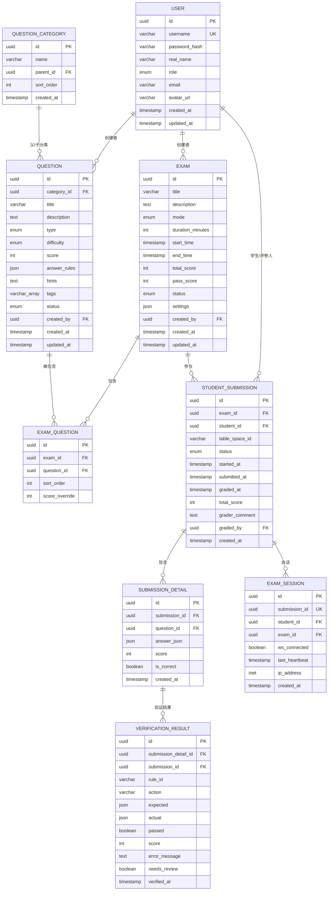
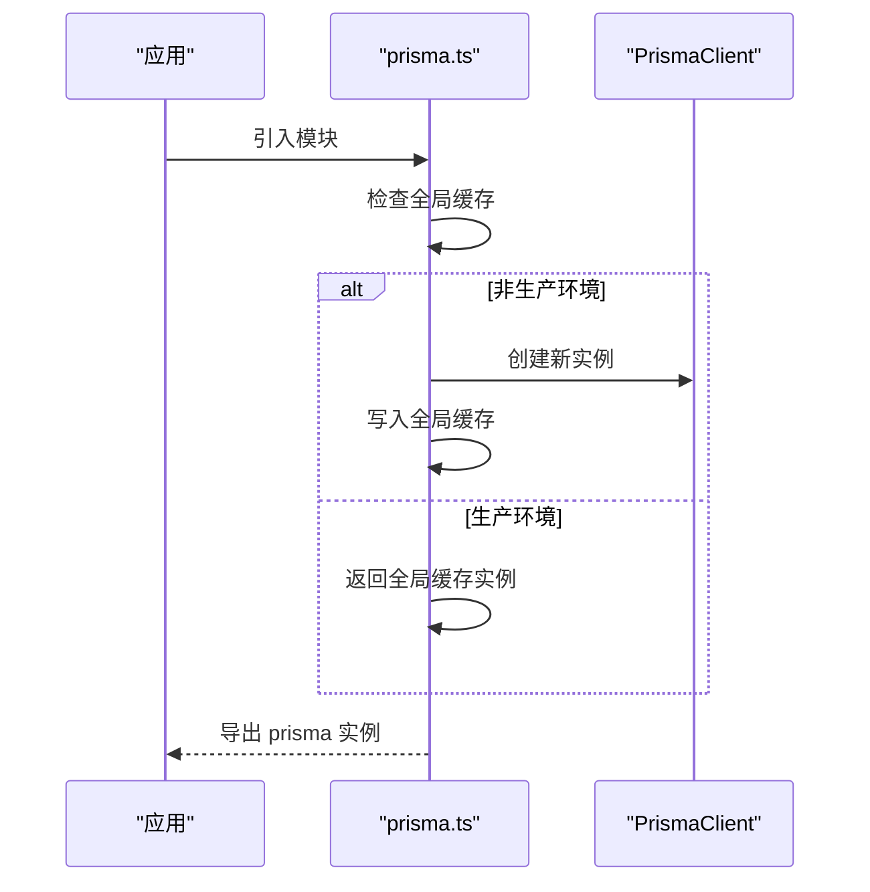
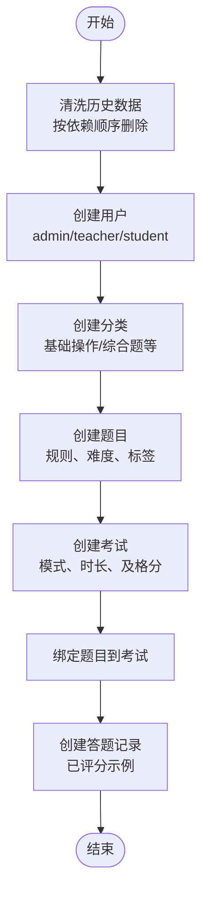
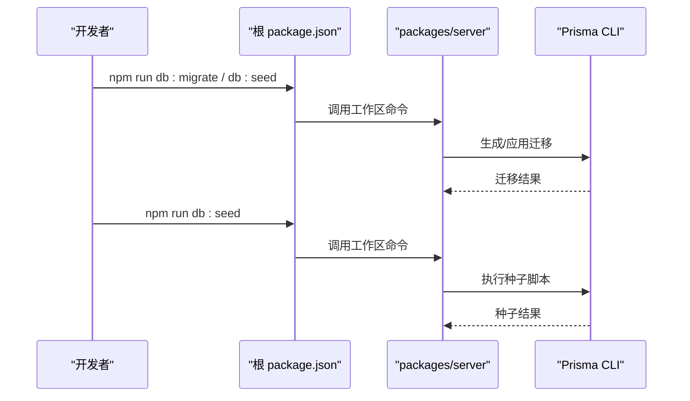
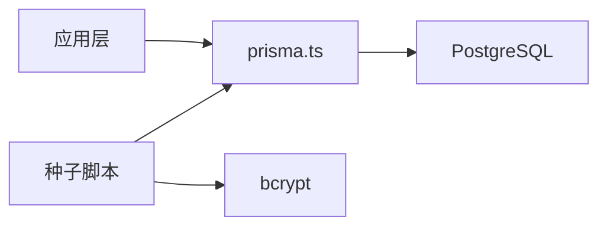

# 数据迁移与种子

<cite>
**本文引用的文件**
- [schema.prisma](file://packages/server/prisma/schema.prisma)
- [prisma.ts](file://packages/server/src/config/prisma.ts)
- [seed.ts](file://packages/server/prisma/seed.ts)
- [package.json](file://package.json)
</cite>

## 目录
1. [简介](#简介)
2. [项目结构](#项目结构)
3. [核心组件](#核心组件)
4. [架构总览](#架构总览)
5. [详细组件分析](#详细组件分析)
6. [依赖分析](#依赖分析)
7. [性能考虑](#性能考虑)
8. [故障排查指南](#故障排查指南)
9. [结论](#结论)
10. [附录](#附录)

## 简介
本文件面向数据库管理员（DBA）与开发者，系统化阐述本项目的“数据迁移与种子管理”实践，涵盖：
- Prisma Migrate 的工作原理与迁移文件生成/执行流程
- 种子数据的结构设计、初始数据加载与开发环境准备
- 迁移策略、版本升级与回滚方案
- 生产环境部署的数据迁移最佳实践、备份策略与数据一致性保证
- 数据结构变更、字段增删与索引优化的实施方法

## 项目结构
本项目采用 Monorepo 结构，使用 npm workspaces 管理前后端包。数据库层由 Prisma 提供 ORM 与迁移能力，核心文件分布如下：
- 数据模型与枚举定义：packages/server/prisma/schema.prisma
- Prisma 客户端初始化：packages/server/src/config/prisma.ts
- 种子数据脚本：packages/server/prisma/seed.ts
- 工作区脚本与命令入口：package.json

**图表来源**
- [package.json:1-26](file://package.json#L1-L26)
- [schema.prisma:1-243](file://packages/server/prisma/schema.prisma#L1-L243)
- [prisma.ts:1-10](file://packages/server/src/config/prisma.ts#L1-L10)
- [seed.ts:1-245](file://packages/server/prisma/seed.ts#L1-L245)

**章节来源**
- [package.json:1-26](file://package.json#L1-L26)

## 核心组件
- Prisma 模型与数据结构
  - 使用 PostgreSQL 作为数据源，通过 schema.prisma 定义实体、枚举、关系与注解（如唯一性、默认值、映射等）
  - 关键实体包括用户、题目、分类、考试、答题、会话等，覆盖教学与评测场景
- Prisma 客户端初始化
  - 在非生产环境将客户端实例挂载到全局，避免重复连接与内存泄漏
- 种子数据
  - 通过 seed.ts 清洗历史数据后，批量创建用户、分类、题目、考试、答题记录等，便于本地开发与演示

**章节来源**
- [schema.prisma:1-243](file://packages/server/prisma/schema.prisma#L1-L243)
- [prisma.ts:1-10](file://packages/server/src/config/prisma.ts#L1-L10)
- [seed.ts:1-245](file://packages/server/prisma/seed.ts#L1-L245)

## 架构总览
下图展示从开发到生产的典型数据流：本地开发使用 Prisma Migrate 生成迁移并应用；通过种子脚本注入初始数据；生产环境遵循“只读迁移、可回滚”的策略。

[此图为概念性示意，不直接对应具体源码文件，故无“图表来源”标注]

## 详细组件分析

### 组件一：Prisma 模型与数据结构
- 设计要点
  - 使用 UUID 为主键，提升分布式安全性
  - 通过枚举统一状态与类型，减少业务侧歧义
  - 合理的外键关系与唯一约束，保障引用完整性
  - JSON 字段用于灵活配置（如题目规则、考试设置），兼顾扩展性
- 复杂度与性能
  - 实体间存在一对多/多对多关系，需结合索引与查询策略优化
  - JSON 字段的查询建议限制在必要场景，避免全表扫描
- 变更策略
  - 新增字段建议带默认值或允许 NULL，避免破坏现有记录
  - 删除字段前先迁移数据或保留兼容字段，再在后续版本清理

**图表来源**
- [schema.prisma:60-242](file://packages/server/prisma/schema.prisma#L60-L242)

**章节来源**
- [schema.prisma:1-243](file://packages/server/prisma/schema.prisma#L1-L243)

### 组件二：Prisma 客户端初始化
- 初始化逻辑
  - 将 PrismaClient 实例缓存于全局对象，避免重复创建
  - 非生产环境启用全局缓存，加速开发体验
- 最佳实践
  - 在应用启动时初始化，关闭时显式断开连接
  - 在并发场景下复用同一实例，避免连接池耗尽

**图表来源**
- [prisma.ts:1-10](file://packages/server/src/config/prisma.ts#L1-L10)

**章节来源**
- [prisma.ts:1-10](file://packages/server/src/config/prisma.ts#L1-L10)

### 组件三：种子数据脚本
- 脚本职责
  - 清洗历史数据（按依赖顺序删除）
  - 批量创建用户、分类、题目、考试、答题记录等
  - 输出登录凭据，便于本地快速验证
- 数据一致性
  - 通过事务性写入与顺序依赖控制，确保外键约束满足
  - 对密码进行哈希处理，保障安全基线
- 开发环境准备
  - 一键运行即可获得完整演示数据
  - 建议在每次模型迭代后同步更新种子脚本

**图表来源**
- [seed.ts:6-235](file://packages/server/prisma/seed.ts#L6-L235)

**章节来源**
- [seed.ts:1-245](file://packages/server/prisma/seed.ts#L1-L245)

### 组件四：迁移与种子的调用链
- 命令入口
  - 顶层 package.json 定义了 db:migrate、db:seed、db:studio 等工作区脚本
- 执行流程
  - 开发者在 packages/server 下执行迁移与种子命令
  - Prisma 依据 schema.prisma 生成迁移文件并应用
  - 种子脚本在数据库结构就绪后运行，填充演示数据

**图表来源**
- [package.json:6-15](file://package.json#L6-L15)

**章节来源**
- [package.json:1-26](file://package.json#L1-L26)

## 依赖分析
- 组件耦合
  - 应用层通过 prisma.ts 获取 PrismaClient，避免直接引入 @prisma/client
  - 种子脚本独立于业务逻辑，仅依赖 PrismaClient
- 外部依赖
  - PostgreSQL 数据源通过 DATABASE_URL 环境变量配置
  - bcrypt 用于密码哈希，提升种子数据的安全性
- 潜在风险
  - 过度依赖 JSON 字段可能导致查询性能下降
  - 删除/重命名字段需谨慎，应先迁移数据并保留兼容字段

**图表来源**
- [prisma.ts:1-10](file://packages/server/src/config/prisma.ts#L1-L10)
- [seed.ts:1-5](file://packages/server/prisma/seed.ts#L1-L5)

**章节来源**
- [prisma.ts:1-10](file://packages/server/src/config/prisma.ts#L1-L10)
- [seed.ts:1-245](file://packages/server/prisma/seed.ts#L1-L245)

## 性能考虑
- 查询优化
  - 为高频过滤字段建立索引（如用户用户名、考试状态、答题提交时间）
  - 控制 JSON 字段的使用范围，避免全表扫描
- 连接管理
  - 使用全局缓存的 PrismaClient，减少连接创建开销
  - 在长时间任务中及时断开连接，释放资源
- 迁移性能
  - 大表变更建议分批执行，避免长时间锁表
  - 在维护窗口内执行结构变更，降低对线上业务的影响

[本节为通用指导，无需“章节来源”]

## 故障排查指南
- 迁移失败
  - 检查 DATABASE_URL 是否正确指向目标数据库
  - 查看迁移文件是否违反唯一性/外键约束
  - 使用 Prisma Studio 检查当前数据库结构
- 种子脚本报错
  - 确认数据库已应用最新迁移
  - 检查种子脚本中的依赖顺序是否与删除顺序一致
  - 核对 bcrypt 版本与 Node 环境兼容性
- 连接问题
  - 非生产环境确认全局缓存是否生效
  - 检查 PrismaClient 的断开时机，避免连接泄漏

**章节来源**
- [seed.ts:237-244](file://packages/server/prisma/seed.ts#L237-L244)
- [prisma.ts:7-9](file://packages/server/src/config/prisma.ts#L7-L9)

## 结论
本项目以 Prisma 为核心，结合清晰的模型设计、稳定的客户端初始化与可复现的种子脚本，形成了从开发到生产的完整数据管理闭环。建议在生产环境中坚持“只读迁移、可回滚”的原则，并配合完善的备份与一致性校验机制，确保数据安全与业务连续性。

[本节为总结性内容，无需“章节来源”]

## 附录

### A. 迁移策略与版本升级
- 基本流程
  - 在本地修改 schema.prisma 后生成迁移，预审后再合并到主分支
  - 通过 CI/CD 自动应用迁移，失败即回滚
- 回滚方案
  - 使用 Prisma 提供的回滚命令，逐级回退
  - 若涉及数据删除，需依赖备份恢复或补偿脚本

[本节为通用指导，无需“章节来源”]

### B. 生产环境部署最佳实践
- 部署前
  - 先在测试环境验证迁移与种子脚本
  - 备份生产数据库，记录当前快照
- 部署中
  - 在维护窗口内执行迁移，监控慢查询
  - 应用迁移后运行种子脚本，核对关键数据
- 部署后
  - 运行一致性校验脚本，比对关键指标
  - 记录部署日志与回滚预案

[本节为通用指导，无需“章节来源”]

### C. 数据结构变更与索引优化
- 字段增删
  - 新增字段建议允许 NULL 或提供默认值
  - 删除字段前迁移数据或保留兼容字段
- 索引优化
  - 为常用过滤与连接字段建立索引
  - 定期分析慢查询日志，调整索引策略

[本节为通用指导，无需“章节来源”]