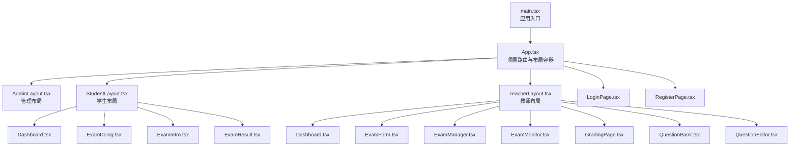
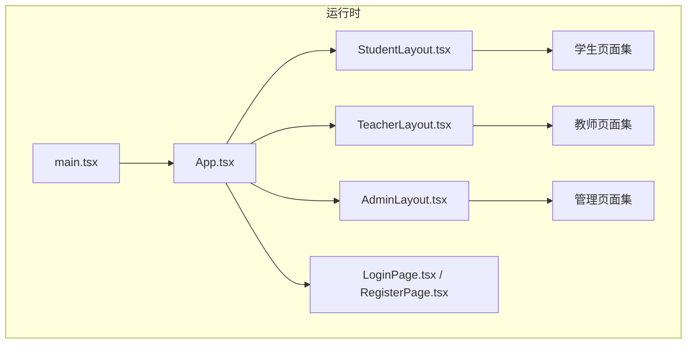
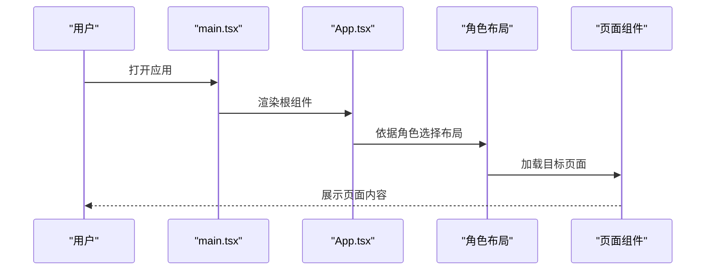
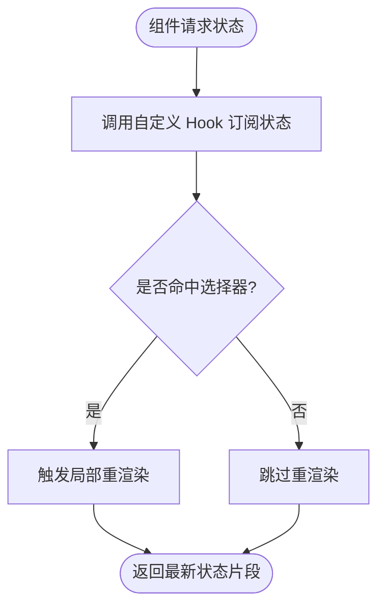
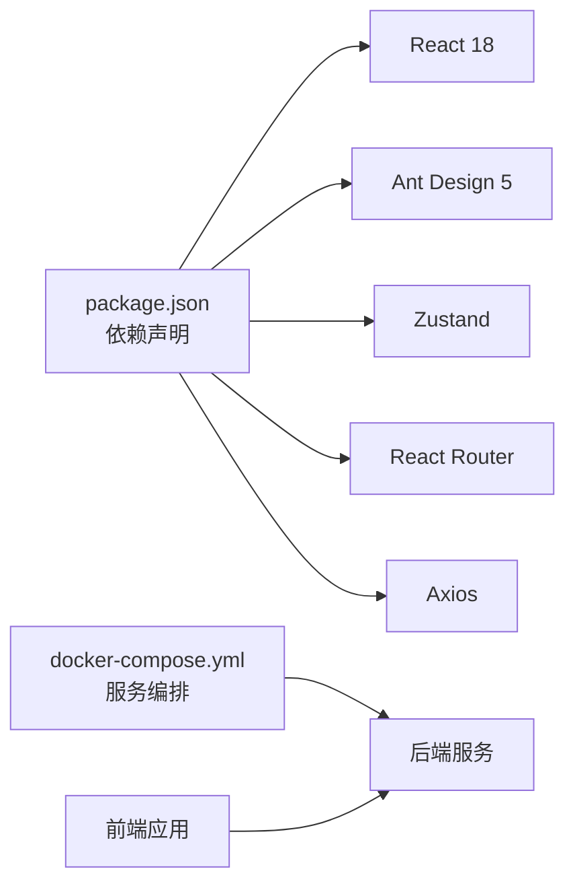

# 前端架构

<cite>
**本文引用的文件**
- [App.tsx](file://packages/client/src/App.tsx)
- [main.tsx](file://packages/client/src/main.tsx)
- [AdminLayout.tsx](file://packages/client/src/components/layout/AdminLayout.tsx)
- [StudentLayout.tsx](file://packages/client/src/components/layout/StudentLayout.tsx)
- [TeacherLayout.tsx](file://packages/client/src/components/layout/TeacherLayout.tsx)
- [LoginPage.tsx](file://packages/client/src/pages/auth/LoginPage.tsx)
- [RegisterPage.tsx](file://packages/client/src/pages/auth/RegisterPage.tsx)
- [Dashboard.tsx](file://packages/client/src/pages/student/Dashboard.tsx)
- [ExamDoing.tsx](file://packages/client/src/pages/student/ExamDoing.tsx)
- [ExamIntro.tsx](file://packages/client/src/pages/student/ExamIntro.tsx)
- [ExamResult.tsx](file://packages/client/src/pages/student/ExamResult.tsx)
- [Dashboard.tsx](file://packages/client/src/pages/teacher/Dashboard.tsx)
- [ExamForm.tsx](file://packages/client/src/pages/teacher/ExamForm.tsx)
- [ExamManager.tsx](file://packages/client/src/pages/teacher/ExamManager.tsx)
- [ExamMonitor.tsx](file://packages/client/src/pages/teacher/ExamMonitor.tsx)
- [GradingPage.tsx](file://packages/client/src/pages/teacher/GradingPage.tsx)
- [QuestionBank.tsx](file://packages/client/src/pages/teacher/QuestionBank.tsx)
- [QuestionEditor.tsx](file://packages/client/src/pages/teacher/QuestionEditor.tsx)
- [package.json](file://package.json)
- [docker-compose.yml](file://docker-compose.yml)
- [gen_docx.py](file://gen_docx.py)
</cite>

## 目录
1. [引言](#引言)
2. [项目结构](#项目结构)
3. [核心组件](#核心组件)
4. [架构总览](#架构总览)
5. [详细组件分析](#详细组件分析)
6. [依赖分析](#依赖分析)
7. [性能考虑](#性能考虑)
8. [故障排查指南](#故障排查指南)
9. [结论](#结论)
10. [附录](#附录)

## 引言
本文件面向金山多维表格考试系统的前端应用，基于 React 18 构建，采用模块化与分层设计，覆盖组件层次、路由设计、状态管理（Zustand）、UI 组件库（Ant Design 5）集成与主题定制、模块化与代码分割策略、性能优化、组件通信模式、错误边界与用户体验优化等关键主题。本文档旨在帮助开发者快速理解系统架构与实现要点，并提供可操作的最佳实践建议。

## 项目结构
前端位于 packages/client 目录，采用按角色与页面功能划分的目录组织方式：
- 根入口：main.tsx 负责挂载应用；App.tsx 定义顶层路由与布局容器。
- 布局层：AdminLayout、StudentLayout、TeacherLayout 提供三类角色的统一导航与内容区域。
- 页面层：按角色拆分页面，如学生端（Dashboard、ExamDoing、ExamIntro、ExamResult）、教师端（Dashboard、ExamForm、ExamManager、ExamMonitor、GradingPage、QuestionBank、QuestionEditor）与管理端（用户管理）。
- 认证页：LoginPage、RegisterPage 支持登录与注册流程。
- 其他：demo 页面用于演示用途。

图表来源
- [main.tsx](file://packages/client/src/main.tsx)
- [App.tsx](file://packages/client/src/App.tsx)
- [AdminLayout.tsx](file://packages/client/src/components/layout/AdminLayout.tsx)
- [StudentLayout.tsx](file://packages/client/src/components/layout/StudentLayout.tsx)
- [TeacherLayout.tsx](file://packages/client/src/components/layout/TeacherLayout.tsx)
- [Dashboard.tsx](file://packages/client/src/pages/student/Dashboard.tsx)
- [ExamDoing.tsx](file://packages/client/src/pages/student/ExamDoing.tsx)
- [ExamIntro.tsx](file://packages/client/src/pages/student/ExamIntro.tsx)
- [ExamResult.tsx](file://packages/client/src/pages/student/ExamResult.tsx)
- [Dashboard.tsx](file://packages/client/src/pages/teacher/Dashboard.tsx)
- [ExamForm.tsx](file://packages/client/src/pages/teacher/ExamForm.tsx)
- [ExamManager.tsx](file://packages/client/src/pages/teacher/ExamManager.tsx)
- [ExamMonitor.tsx](file://packages/client/src/pages/teacher/ExamMonitor.tsx)
- [GradingPage.tsx](file://packages/client/src/pages/teacher/GradingPage.tsx)
- [QuestionBank.tsx](file://packages/client/src/pages/teacher/QuestionBank.tsx)
- [QuestionEditor.tsx](file://packages/client/src/pages/teacher/QuestionEditor.tsx)
- [LoginPage.tsx](file://packages/client/src/pages/auth/LoginPage.tsx)
- [RegisterPage.tsx](file://packages/client/src/pages/auth/RegisterPage.tsx)

章节来源
- [main.tsx](file://packages/client/src/main.tsx)
- [App.tsx](file://packages/client/src/App.tsx)

## 核心组件
- 应用入口与根组件
  - main.tsx：负责创建根容器并渲染根组件。
  - App.tsx：定义顶层路由与布局容器，承载各角色布局与页面。
- 布局组件
  - AdminLayout、StudentLayout、TeacherLayout：分别封装管理端、学生端、教师端的通用导航、侧边栏与内容区。
- 页面组件
  - 学生端：Dashboard、ExamDoing、ExamIntro、ExamResult，覆盖学习中心、考试进行、考试说明、结果查看等。
  - 教师端：Dashboard、ExamForm、ExamManager、ExamMonitor、GradingPage、QuestionBank、QuestionEditor，覆盖教学中心、试卷编辑、监考、阅卷、题库与题目编辑等。
  - 管理端：UserManagement（用户管理）。
  - 认证：LoginPage、RegisterPage。

章节来源
- [main.tsx](file://packages/client/src/main.tsx)
- [App.tsx](file://packages/client/src/App.tsx)
- [AdminLayout.tsx](file://packages/client/src/components/layout/AdminLayout.tsx)
- [StudentLayout.tsx](file://packages/client/src/components/layout/StudentLayout.tsx)
- [TeacherLayout.tsx](file://packages/client/src/components/layout/TeacherLayout.tsx)
- [Dashboard.tsx](file://packages/client/src/pages/student/Dashboard.tsx)
- [ExamDoing.tsx](file://packages/client/src/pages/student/ExamDoing.tsx)
- [ExamIntro.tsx](file://packages/client/src/pages/student/ExamIntro.tsx)
- [ExamResult.tsx](file://packages/client/src/pages/student/ExamResult.tsx)
- [Dashboard.tsx](file://packages/client/src/pages/teacher/Dashboard.tsx)
- [ExamForm.tsx](file://packages/client/src/pages/teacher/ExamForm.tsx)
- [ExamManager.tsx](file://packages/client/src/pages/teacher/ExamManager.tsx)
- [ExamMonitor.tsx](file://packages/client/src/pages/teacher/ExamMonitor.tsx)
- [GradingPage.tsx](file://packages/client/src/pages/teacher/GradingPage.tsx)
- [QuestionBank.tsx](file://packages/client/src/pages/teacher/QuestionBank.tsx)
- [QuestionEditor.tsx](file://packages/client/src/pages/teacher/QuestionEditor.tsx)
- [LoginPage.tsx](file://packages/client/src/pages/auth/LoginPage.tsx)
- [RegisterPage.tsx](file://packages/client/src/pages/auth/RegisterPage.tsx)

## 架构总览
系统采用“入口 -> 根组件 -> 布局 -> 页面”的分层结构，路由在根组件中集中配置，不同角色通过各自布局组件注入统一的导航与权限控制。Ant Design 5 作为基础 UI 组件库，提供一致的交互与视觉体验；Zustand 作为轻量级状态管理方案，服务于认证、全局提示、当前考试状态等跨组件共享数据。

图表来源
- [main.tsx](file://packages/client/src/main.tsx)
- [App.tsx](file://packages/client/src/App.tsx)
- [StudentLayout.tsx](file://packages/client/src/components/layout/StudentLayout.tsx)
- [TeacherLayout.tsx](file://packages/client/src/components/layout/TeacherLayout.tsx)
- [AdminLayout.tsx](file://packages/client/src/components/layout/AdminLayout.tsx)
- [LoginPage.tsx](file://packages/client/src/pages/auth/LoginPage.tsx)
- [RegisterPage.tsx](file://packages/client/src/pages/auth/RegisterPage.tsx)

## 详细组件分析

### 路由与布局设计
- 根组件 App.tsx 负责顶层路由与布局容器，根据用户角色选择对应布局组件。
- StudentLayout/TeacherLayout/AdminLayout 封装导航菜单、面包屑、内容区，确保各角色界面一致性。
- 页面组件按功能域拆分，降低耦合度，便于独立开发与测试。

图表来源
- [main.tsx](file://packages/client/src/main.tsx)
- [App.tsx](file://packages/client/src/App.tsx)
- [StudentLayout.tsx](file://packages/client/src/components/layout/StudentLayout.tsx)
- [TeacherLayout.tsx](file://packages/client/src/components/layout/TeacherLayout.tsx)
- [AdminLayout.tsx](file://packages/client/src/components/layout/AdminLayout.tsx)

章节来源
- [App.tsx](file://packages/client/src/App.tsx)
- [StudentLayout.tsx](file://packages/client/src/components/layout/StudentLayout.tsx)
- [TeacherLayout.tsx](file://packages/client/src/components/layout/TeacherLayout.tsx)
- [AdminLayout.tsx](file://packages/client/src/components/layout/AdminLayout.tsx)

### 状态管理模式：Zustand
- 使用场景
  - 认证状态：登录态、用户信息、权限标识。
  - 全局提示：成功/失败消息、加载状态。
  - 考试相关：当前考试 ID、答题进度、提交状态。
- 优势
  - 轻量、TypeScript 友好、API 简洁，适合中小型应用。
  - 与 React Hooks 结合自然，无需 Provider 包裹即可在组件内直接订阅状态。
- 与 React Hooks 的结合
  - 在组件中通过自定义 Hook 暴露状态选择器，避免无关重渲染。
  - 对于高频更新的状态，配合选择器与浅比较以减少重渲染。

图表来源
- [App.tsx](file://packages/client/src/App.tsx)

章节来源
- [App.tsx](file://packages/client/src/App.tsx)
- [gen_docx.py](file://gen_docx.py)

### Ant Design 5 集成与主题定制
- 集成方式
  - 按需引入组件与样式，保证包体体积可控。
  - 使用 CSS-in-JS 能力（如 antd-style 或内置样式机制）实现主题变量注入与动态切换。
- 主题定制
  - 通过 Token 体系统一色板、字号、间距、圆角等设计变量。
  - 支持暗色模式与品牌色替换，满足多角色界面一致性与可访问性需求。

章节来源
- [package.json](file://package.json)

### 组件通信模式
- 父子通信：通过 props 下发数据与回调，保持单向数据流。
- 兄弟/跨层级通信：通过 Zustand 状态共享或事件总线（如自定义发布订阅），避免深层传递。
- 表单与校验：使用 Ant Design Form 组件，结合规则与受控表单，统一校验与错误提示。
- 列表与表格：使用 Ant Design Table，支持排序、筛选、分页与行选择，提升交互效率。

章节来源
- [StudentLayout.tsx](file://packages/client/src/components/layout/StudentLayout.tsx)
- [TeacherLayout.tsx](file://packages/client/src/components/layout/TeacherLayout.tsx)
- [ExamDoing.tsx](file://packages/client/src/pages/student/ExamDoing.tsx)
- [ExamManager.tsx](file://packages/client/src/pages/teacher/ExamManager.tsx)

### 错误边界与用户体验优化
- 错误边界
  - 在 App.tsx 中包裹错误边界组件，捕获子树异常并降级展示。
  - 对网络错误、鉴权失效等常见异常进行分类处理与提示。
- 用户体验
  - 加载态：长列表与异步接口使用骨架屏或占位符。
  - 反馈：全局提示与局部错误信息结合，确保及时可见。
  - 可访问性：键盘导航、焦点管理、语义化标签与高对比度色彩。

章节来源
- [App.tsx](file://packages/client/src/App.tsx)

## 依赖分析
- 运行时依赖
  - React 18、Ant Design 5、Zustand、路由（如 react-router）、HTTP 客户端（如 axios）。
- 开发与构建
  - Vite/Webpack、TypeScript、ESLint/Prettier、Docker Compose。
- 服务端联调
  - 通过 docker-compose 启动后端服务，前端通过代理或环境变量配置 API 地址。

图表来源
- [package.json](file://package.json)
- [docker-compose.yml](file://docker-compose.yml)

章节来源
- [package.json](file://package.json)
- [docker-compose.yml](file://docker-compose.yml)

## 性能考虑
- 代码分割
  - 路由级懒加载：对教师端与学生端页面进行动态导入，减少首屏体积。
  - 组件级懒加载：大组件（如富文本编辑器、图表）按需加载。
- 缓存与去抖
  - 列表与搜索：使用防抖与本地缓存，降低重复请求。
  - 图片与资源：启用浏览器缓存与 CDN，合理设置缓存头。
- 渲染优化
  - 使用 React.memo、选择器与浅比较，避免不必要的重渲染。
  - 大列表虚拟化：使用虚拟滚动组件，限制可视区域内节点数量。
- 资源体积
  - 按需引入 Ant Design 组件与样式，移除未使用模块。
  - Tree-shaking 与压缩：生产构建开启最小化与副作用标记。

章节来源
- [StudentLayout.tsx](file://packages/client/src/components/layout/StudentLayout.tsx)
- [TeacherLayout.tsx](file://packages/client/src/components/layout/TeacherLayout.tsx)

## 故障排查指南
- 登录与鉴权
  - 检查登录页参数与后端接口响应，确认 Token 存储与刷新逻辑。
  - 若出现 401/403，优先清理本地存储并重新登录。
- 页面空白或白屏
  - 查看错误边界日志，定位具体组件异常；检查路由与懒加载配置。
- 性能问题
  - 使用 React DevTools Profiler 分析重渲染热点；检查是否存在全量状态更新。
- 主题与样式异常
  - 确认主题 Token 注入顺序与覆盖规则；检查 CSS-in-JS 上下文是否正确包裹。

章节来源
- [LoginPage.tsx](file://packages/client/src/pages/auth/LoginPage.tsx)
- [App.tsx](file://packages/client/src/App.tsx)

## 结论
该前端应用以 React 18 为基础，采用分层布局与按角色划分的页面结构，结合 Zustand 实现轻量高效的状态管理，Ant Design 5 提供一致的 UI 体验与主题定制能力。通过路由懒加载、组件懒加载与虚拟化等策略，兼顾可维护性与性能表现。建议持续完善错误边界与监控埋点，进一步提升稳定性与可观测性。

## 附录
- 快速启动
  - 安装依赖后，使用 docker-compose 启动后端服务，再启动前端开发服务器。
- 角色与页面映射
  - 学生端：Dashboard、ExamDoing、ExamIntro、ExamResult
  - 教师端：Dashboard、ExamForm、ExamManager、ExamMonitor、GradingPage、QuestionBank、QuestionEditor
  - 管理端：UserManagement
  - 认证：LoginPage、RegisterPage

章节来源
- [docker-compose.yml](file://docker-compose.yml)
- [Dashboard.tsx](file://packages/client/src/pages/student/Dashboard.tsx)
- [ExamDoing.tsx](file://packages/client/src/pages/student/ExamDoing.tsx)
- [ExamIntro.tsx](file://packages/client/src/pages/student/ExamIntro.tsx)
- [ExamResult.tsx](file://packages/client/src/pages/student/ExamResult.tsx)
- [Dashboard.tsx](file://packages/client/src/pages/teacher/Dashboard.tsx)
- [ExamForm.tsx](file://packages/client/src/pages/teacher/ExamForm.tsx)
- [ExamManager.tsx](file://packages/client/src/pages/teacher/ExamManager.tsx)
- [ExamMonitor.tsx](file://packages/client/src/pages/teacher/ExamMonitor.tsx)
- [GradingPage.tsx](file://packages/client/src/pages/teacher/GradingPage.tsx)
- [QuestionBank.tsx](file://packages/client/src/pages/teacher/QuestionBank.tsx)
- [QuestionEditor.tsx](file://packages/client/src/pages/teacher/QuestionEditor.tsx)
- [LoginPage.tsx](file://packages/client/src/pages/auth/LoginPage.tsx)
- [RegisterPage.tsx](file://packages/client/src/pages/auth/RegisterPage.tsx)