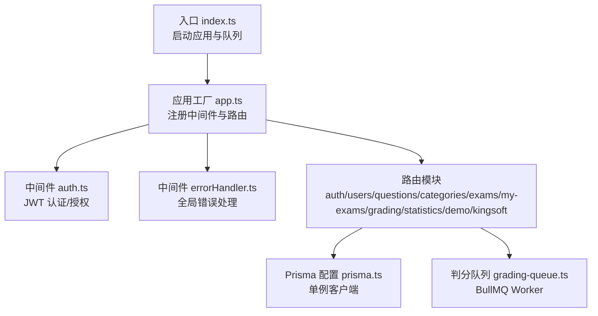
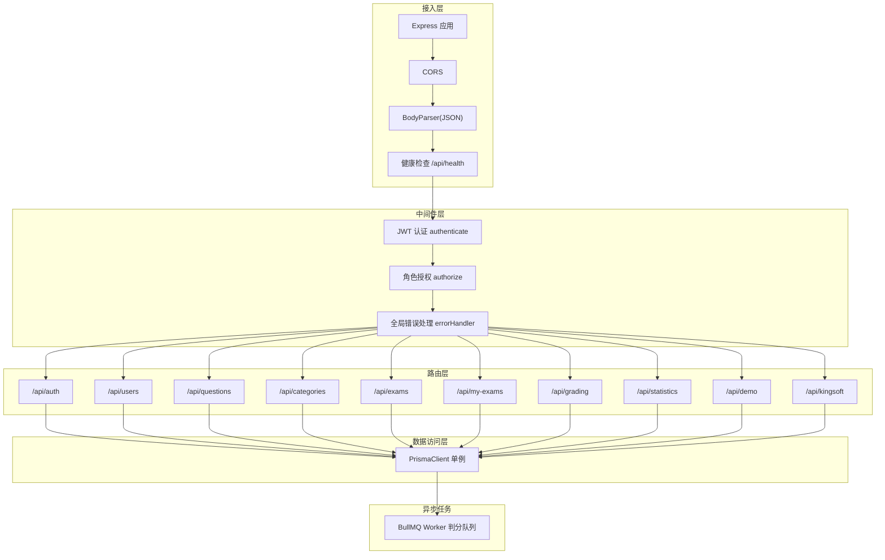
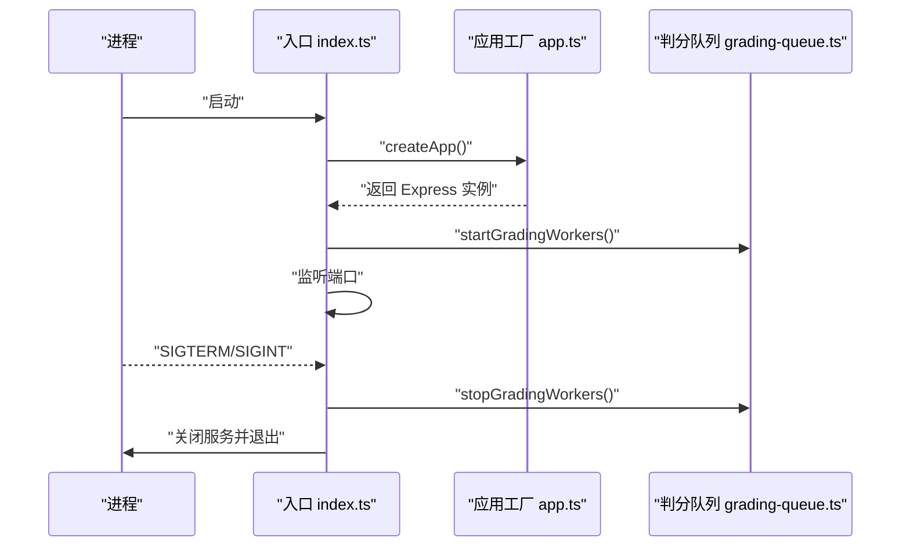
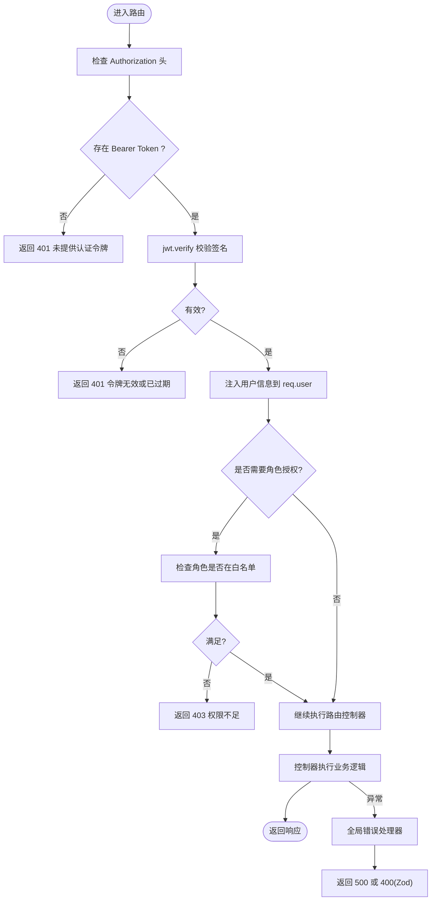
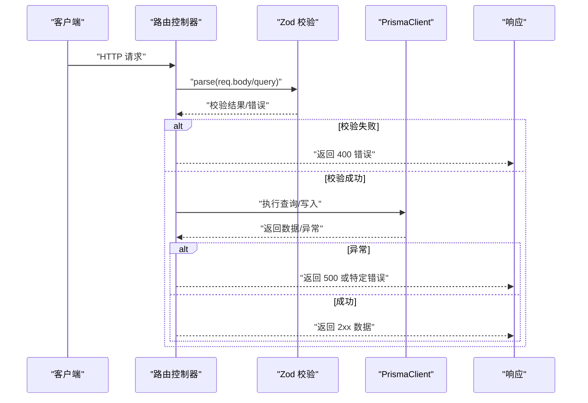
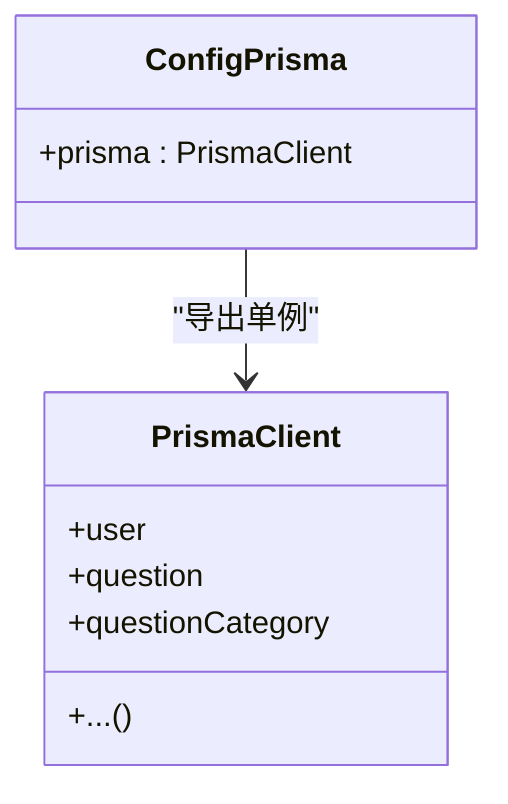
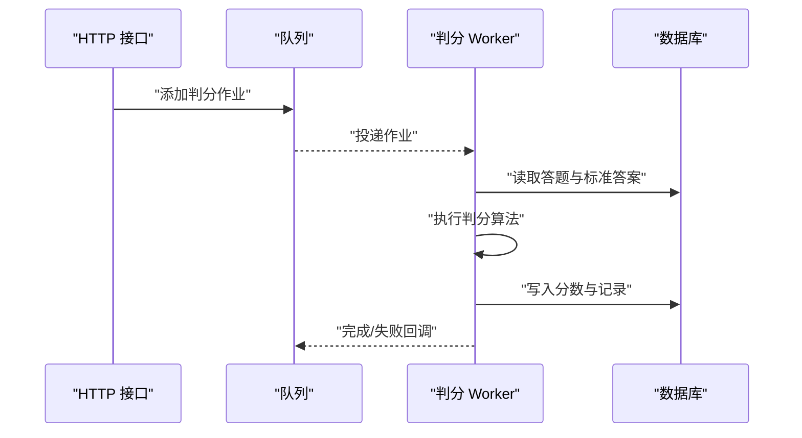
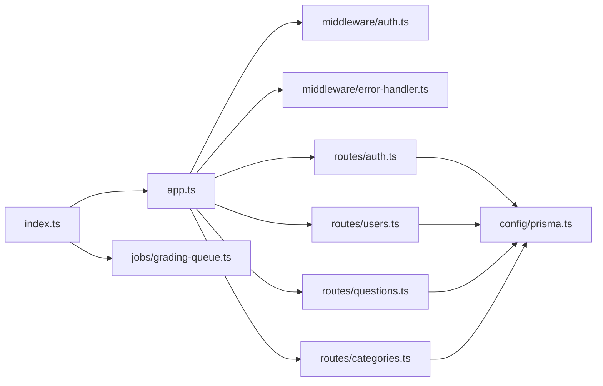

# 后端架构

<cite>
**本文引用的文件**
- [packages/server/src/index.ts](file://packages/server/src/index.ts)
- [packages/server/src/app.ts](file://packages/server/src/app.ts)
- [packages/server/src/middleware/auth.ts](file://packages/server/src/middleware/auth.ts)
- [packages/server/src/middleware/error-handler.ts](file://packages/server/src/middleware/error-handler.ts)
- [packages/server/src/config/prisma.ts](file://packages/server/src/config/prisma.ts)
- [packages/server/src/routes/auth.ts](file://packages/server/src/routes/auth.ts)
- [packages/server/src/routes/users.ts](file://packages/server/src/routes/users.ts)
- [packages/server/src/routes/questions.ts](file://packages/server/src/routes/questions.ts)
- [packages/server/src/routes/categories.ts](file://packages/server/src/routes/categories.ts)
- [packages/server/src/jobs/grading-queue.ts](file://packages/server/src/jobs/grading-queue.ts)
</cite>

## 目录
1. [引言](#引言)
2. [项目结构](#项目结构)
3. [核心组件](#核心组件)
4. [架构总览](#架构总览)
5. [组件详解](#组件详解)
6. [依赖关系分析](#依赖关系分析)
7. [性能与可扩展性](#性能与可扩展性)
8. [故障排查指南](#故障排查指南)
9. [结论](#结论)
10. [附录](#附录)

## 引言
本文件面向金山多维表格考试系统的后端服务，基于 Node.js + Express 的实现，系统性梳理其架构设计与工程实践，覆盖中间件体系、路由组织、控制器模式、数据访问层（Prisma ORM）、数据库连接与事务、业务服务层（依赖注入与模块化）、API 设计规范、错误处理与安全策略，以及异步任务、缓存与性能监控的落地方案。

## 项目结构
后端采用 monorepo 结构，核心服务位于 packages/server，入口文件负责启动应用与判分队列；应用通过 Express 组织路由，Prisma 提供数据访问层；中间件统一处理认证与错误；业务路由按领域拆分，如认证、用户、题库、分类、考试、判分、统计等。

图示来源
- [packages/server/src/index.ts:1-21](file://packages/server/src/index.ts#L1-L21)
- [packages/server/src/app.ts:15-43](file://packages/server/src/app.ts#L15-L43)
- [packages/server/src/middleware/auth.ts:19-45](file://packages/server/src/middleware/auth.ts#L19-L45)
- [packages/server/src/middleware/error-handler.ts:4-18](file://packages/server/src/middleware/error-handler.ts#L4-L18)
- [packages/server/src/config/prisma.ts:1-9](file://packages/server/src/config/prisma.ts#L1-L9)
- [packages/server/src/jobs/grading-queue.ts](file://packages/server/src/jobs/grading-queue.ts)

章节来源
- [packages/server/src/index.ts:1-21](file://packages/server/src/index.ts#L1-L21)
- [packages/server/src/app.ts:15-43](file://packages/server/src/app.ts#L15-L43)

## 核心组件
- 应用工厂：集中初始化 Express 实例、注册 CORS、JSON 解析、健康检查、路由挂载与全局错误处理。
- 中间件体系：认证中间件负责 JWT 校验并将用户信息注入请求上下文；授权中间件按角色放行；全局错误处理器统一返回格式。
- 路由与控制器：每个领域一个 Router，控制器函数内完成参数校验（Zod）、调用数据访问层、返回响应。
- 数据访问层：Prisma 单例客户端，避免重复实例化；通过模型方法进行查询与写入。
- 异步判分：使用 BullMQ Worker 处理判分任务，支持队列持久化与并发控制。
- 配置与环境：从配置对象读取端口、JWT 密钥与过期时间等。

章节来源
- [packages/server/src/app.ts:15-43](file://packages/server/src/app.ts#L15-L43)
- [packages/server/src/middleware/auth.ts:19-45](file://packages/server/src/middleware/auth.ts#L19-L45)
- [packages/server/src/middleware/error-handler.ts:4-18](file://packages/server/src/middleware/error-handler.ts#L4-L18)
- [packages/server/src/config/prisma.ts:1-9](file://packages/server/src/config/prisma.ts#L1-L9)
- [packages/server/src/jobs/grading-queue.ts](file://packages/server/src/jobs/grading-queue.ts)

## 架构总览
系统采用“应用工厂 + 中间件 + 路由层 + 数据访问层 + 异步任务”的分层架构。认证与授权在路由前执行，业务路由按功能域划分，数据访问通过 Prisma 客户端完成，判分等耗时任务下沉到队列。

图示来源
- [packages/server/src/app.ts:15-43](file://packages/server/src/app.ts#L15-L43)
- [packages/server/src/middleware/auth.ts:19-45](file://packages/server/src/middleware/auth.ts#L19-L45)
- [packages/server/src/middleware/error-handler.ts:4-18](file://packages/server/src/middleware/error-handler.ts#L4-L18)
- [packages/server/src/config/prisma.ts:1-9](file://packages/server/src/config/prisma.ts#L1-L9)
- [packages/server/src/jobs/grading-queue.ts](file://packages/server/src/jobs/grading-queue.ts)

## 组件详解

### 应用工厂与入口
- 入口负责创建应用实例、启动判分 Worker、监听端口，并注册优雅退出信号。
- 应用工厂负责注册通用中间件、健康检查端点、所有业务路由与全局错误处理。

图示来源
- [packages/server/src/index.ts:1-21](file://packages/server/src/index.ts#L1-L21)
- [packages/server/src/app.ts:15-43](file://packages/server/src/app.ts#L15-L43)
- [packages/server/src/jobs/grading-queue.ts](file://packages/server/src/jobs/grading-queue.ts)

章节来源
- [packages/server/src/index.ts:1-21](file://packages/server/src/index.ts#L1-L21)
- [packages/server/src/app.ts:15-43](file://packages/server/src/app.ts#L15-L43)

### 中间件体系
- 认证中间件：从 Authorization 头解析 Bearer Token，使用密钥验证并注入用户信息到请求上下文。
- 授权中间件：根据角色白名单放行，未认证或无权限直接返回相应状态码。
- 全局错误处理：捕获未处理异常，对 Zod 参数校验错误输出结构化错误；开发环境附加细节；其他错误统一 500。

图示来源
- [packages/server/src/middleware/auth.ts:19-45](file://packages/server/src/middleware/auth.ts#L19-L45)
- [packages/server/src/middleware/error-handler.ts:4-18](file://packages/server/src/middleware/error-handler.ts#L4-L18)

章节来源
- [packages/server/src/middleware/auth.ts:19-45](file://packages/server/src/middleware/auth.ts#L19-L45)
- [packages/server/src/middleware/error-handler.ts:4-18](file://packages/server/src/middleware/error-handler.ts#L4-L18)

### 路由与控制器模式
- 路由组织：按领域拆分 Router，统一挂载到 /api 前缀下，便于扩展与维护。
- 控制器模式：每个路由处理函数内完成参数校验（Zod）、调用数据访问层、构造响应体。
- 认证与授权：多数路由使用 authenticate 作为前置中间件；部分管理类接口使用 authorize 指定角色。

图示来源
- [packages/server/src/routes/auth.ts:24-47](file://packages/server/src/routes/auth.ts#L24-L47)
- [packages/server/src/routes/users.ts:26-43](file://packages/server/src/routes/users.ts#L26-L43)
- [packages/server/src/routes/questions.ts:28-33](file://packages/server/src/routes/questions.ts#L28-L33)
- [packages/server/src/routes/categories.ts:15-78](file://packages/server/src/routes/categories.ts#L15-L78)
- [packages/server/src/config/prisma.ts:1-9](file://packages/server/src/config/prisma.ts#L1-L9)

章节来源
- [packages/server/src/routes/auth.ts:24-47](file://packages/server/src/routes/auth.ts#L24-L47)
- [packages/server/src/routes/users.ts:26-43](file://packages/server/src/routes/users.ts#L26-L43)
- [packages/server/src/routes/questions.ts:28-33](file://packages/server/src/routes/questions.ts#L28-L33)
- [packages/server/src/routes/categories.ts:15-78](file://packages/server/src/routes/categories.ts#L15-L78)

### 数据访问层（Prisma ORM）
- 单例客户端：通过全局变量持有 PrismaClient 实例，开发环境避免热重载导致的重复实例问题。
- 查询与写入：各路由控制器直接调用 prisma 模型方法，遵循最小职责原则。
- 连接与事务：Prisma 默认使用连接池；事务通过事务块包裹多个写操作，保证一致性。

图示来源
- [packages/server/src/config/prisma.ts:1-9](file://packages/server/src/config/prisma.ts#L1-L9)

章节来源
- [packages/server/src/config/prisma.ts:1-9](file://packages/server/src/config/prisma.ts#L1-L9)

### 业务服务与模块化
- 服务边界：当前实现以“路由 + 控制器 + Prisma”为主，未见显式服务层抽象；建议后续引入服务类封装业务规则，提升复用与测试性。
- 依赖注入：未发现容器或 DI 注入框架；可通过应用工厂集中注入配置与客户端，减少耦合。
- 模块化：路由按领域拆分，职责清晰；建议进一步拆分“查询服务/命令服务”，并引入领域事件或适配器模式。

### API 设计规范
- 路由前缀：统一使用 /api，按资源命名，如 /users、/questions、/categories 等。
- 方法与状态码：遵循 REST 语义；错误返回 400（参数/Zod）、401（未认证）、403（权限不足）、500（服务器内部）。
- 响应结构：统一返回 JSON；开发环境可在错误响应中包含详细信息。
- 分页与过滤：列表接口支持分页参数与模糊搜索、类型/难度/角色等筛选条件。

章节来源
- [packages/server/src/app.ts:22-37](file://packages/server/src/app.ts#L22-L37)
- [packages/server/src/routes/users.ts:26-43](file://packages/server/src/routes/users.ts#L26-L43)
- [packages/server/src/routes/questions.ts:28-33](file://packages/server/src/routes/questions.ts#L28-L33)
- [packages/server/src/middleware/error-handler.ts:4-18](file://packages/server/src/middleware/error-handler.ts#L4-L18)

### 安全策略
- 认证：JWT Bearer Token，服务端验证签名与有效期。
- 授权：基于角色白名单的细粒度授权，管理员与教师可访问管理接口。
- 输入校验：Zod 在路由层进行参数校验，降低 SQL 注入与参数异常风险。
- CORS：默认启用跨域，生产环境建议限制来源与方法。

章节来源
- [packages/server/src/middleware/auth.ts:19-45](file://packages/server/src/middleware/auth.ts#L19-L45)
- [packages/server/src/app.ts:18-20](file://packages/server/src/app.ts#L18-L20)

### 异步任务与判分队列
- 队列技术：使用 BullMQ Worker 执行判分任务，支持作业持久化与并发控制。
- 启停管理：应用启动时开启 Worker，进程收到终止信号时优雅关闭 Worker 再退出。

图示来源
- [packages/server/src/index.ts:7-8](file://packages/server/src/index.ts#L7-L8)
- [packages/server/src/jobs/grading-queue.ts](file://packages/server/src/jobs/grading-queue.ts)

章节来源
- [packages/server/src/index.ts:7-8](file://packages/server/src/index.ts#L7-L8)
- [packages/server/src/jobs/grading-queue.ts](file://packages/server/src/jobs/grading-queue.ts)

## 依赖关系分析
- 入口依赖应用工厂与判分队列；应用工厂依赖各路由模块与中间件；路由依赖 Prisma 客户端与中间件；中间件依赖配置与 JWT。
- 耦合与内聚：路由与控制器内聚较好；Prisma 单例降低耦合；建议未来引入服务层进一步解耦业务规则。

图示来源
- [packages/server/src/index.ts:1-21](file://packages/server/src/index.ts#L1-L21)
- [packages/server/src/app.ts:15-43](file://packages/server/src/app.ts#L15-L43)
- [packages/server/src/middleware/auth.ts:1-45](file://packages/server/src/middleware/auth.ts#L1-L45)
- [packages/server/src/middleware/error-handler.ts:1-18](file://packages/server/src/middleware/error-handler.ts#L1-L18)
- [packages/server/src/config/prisma.ts:1-9](file://packages/server/src/config/prisma.ts#L1-L9)
- [packages/server/src/routes/auth.ts:1-47](file://packages/server/src/routes/auth.ts#L1-L47)
- [packages/server/src/routes/users.ts:1-43](file://packages/server/src/routes/users.ts#L1-L43)
- [packages/server/src/routes/questions.ts:1-33](file://packages/server/src/routes/questions.ts#L1-L33)
- [packages/server/src/routes/categories.ts:1-78](file://packages/server/src/routes/categories.ts#L1-L78)
- [packages/server/src/jobs/grading-queue.ts](file://packages/server/src/jobs/grading-queue.ts)

章节来源
- [packages/server/src/index.ts:1-21](file://packages/server/src/index.ts#L1-L21)
- [packages/server/src/app.ts:15-43](file://packages/server/src/app.ts#L15-L43)

## 性能与可扩展性
- 连接池与事务：Prisma 默认连接池，建议结合数据库最大连接数与 QPS 进行压测优化；对批量写入使用事务块减少往返。
- 缓存策略：对高频只读数据（如分类树、静态字典）引入 Redis 缓存；对判分结果可做短期缓存以减轻重复计算。
- 异步化：判分等 CPU 密集任务已下沉至队列；建议对评分慢的题型增加预判分或增量评分。
- 监控与可观测性：建议集成指标采集（如 Prometheus）、日志聚合（如 ELK）与分布式追踪（如 OpenTelemetry），并埋点关键路径耗时。
- 可扩展性：路由按领域拆分良好；建议引入微服务或领域驱动设计，将高并发模块独立部署。

## 故障排查指南
- 认证失败：检查 Authorization 头格式、JWT 密钥与过期时间；确认中间件顺序正确。
- 参数校验失败：查看 Zod 返回的字段与原因，修正前端请求或控制器校验规则。
- 数据库异常：关注 Prisma 报错码（如记录不存在、唯一约束冲突），在路由层转换为明确的 4xx/500。
- 服务器内部错误：查看全局错误处理器输出，开发环境可获取详细堆栈；生产环境避免泄露敏感信息。
- 队列不工作：确认 Worker 已启动、Redis 可达、作业被正确入队与消费。

章节来源
- [packages/server/src/middleware/error-handler.ts:4-18](file://packages/server/src/middleware/error-handler.ts#L4-L18)
- [packages/server/src/routes/categories.ts:50-78](file://packages/server/src/routes/categories.ts#L50-L78)

## 结论
该后端服务采用清晰的分层架构与模块化路由，配合 Prisma ORM 与 BullMQ 队列，满足考试系统的核心需求。建议后续引入服务层与依赖注入、完善缓存与监控体系，并持续优化判分算法与数据库索引，以支撑更高并发与更复杂的业务场景。

## 附录
- 健康检查：GET /api/health 返回运行状态与时戳。
- 路由前缀：/api 下按领域划分，便于扩展新模块。
- 开发与生产：开发环境可输出错误详情，生产环境统一 500 提示。