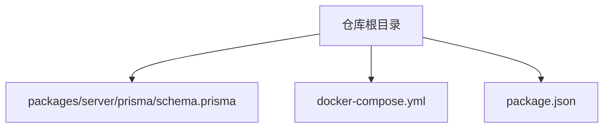
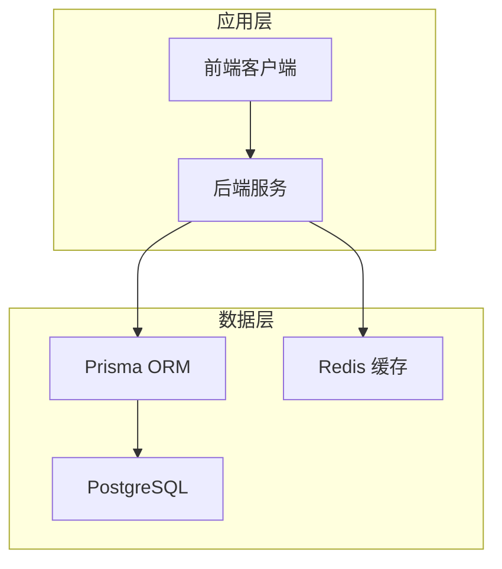
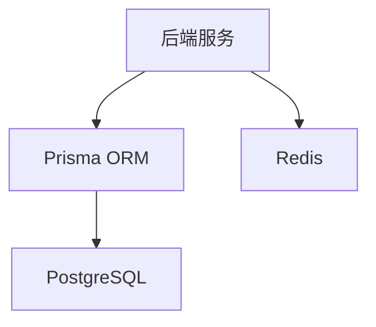

# 数据架构

<cite>
**本文引用的文件**
- [schema.prisma](file://packages/server/prisma/schema.prisma)
- [docker-compose.yml](file://docker-compose.yml)
- [package.json](file://package.json)
</cite>

## 目录
1. [简介](#简介)
2. [项目结构](#项目结构)
3. [核心组件](#核心组件)
4. [架构总览](#架构总览)
5. [详细组件分析](#详细组件分析)
6. [依赖分析](#依赖分析)
7. [性能考虑](#性能考虑)
8. [故障排查指南](#故障排查指南)
9. [结论](#结论)
10. [附录](#附录)

## 简介
本文件面向金山多维表格考试系统，聚焦于其数据架构与实现要点，涵盖以下方面：
- PostgreSQL 数据库设计理念与表结构关系
- Prisma ORM 的数据模型、迁移管理与查询优化
- Redis 缓存层的设计策略（会话存储、实时数据缓存与性能优化）
- 数据一致性、备份恢复与安全措施
- 数据访问模式、索引设计与查询性能优化最佳实践

## 项目结构
围绕数据架构的关键文件与位置如下：
- Prisma 数据模型定义：packages/server/prisma/schema.prisma
- 容器编排与服务依赖：docker-compose.yml
- 项目依赖与脚本：package.json



**图示来源**
- [schema.prisma:1-243](file://packages/server/prisma/schema.prisma#L1-L243)
- [docker-compose.yml](file://docker-compose.yml)
- [package.json](file://package.json)

**章节来源**
- [schema.prisma:1-243](file://packages/server/prisma/schema.prisma#L1-L243)
- [docker-compose.yml](file://docker-compose.yml)
- [package.json](file://package.json)

## 核心组件
本系统以“用户-题目-考试-提交-会话”为主线构建核心实体模型，并通过 Prisma ORM 映射到 PostgreSQL。核心实体与关系概览：
- 用户（User）：支持管理员、教师、学生三种角色；与题目创建、考试创建、提交评分、会话建立相关联
- 题目（Question）：包含类型、难度、分数、答案规则、标签、状态等字段；与分类树、考试题关联
- 分类（QuestionCategory）：支持父子层级的分类树；与题目关联
- 考试（Exam）：支持练习、测验、正式考试三种模式；与考试题、提交、会话关联
- 考试题（ExamQuestion）：连接考试与题目的多对多中间表，支持排序与分数覆盖
- 提交（StudentSubmission）：记录学生作答、状态流转、评分与评阅信息；与会话关联
- 提交详情（SubmissionDetail）：记录每道题的答案与得分明细
- 验证结果（VerificationResult）：记录自动验证与人工复核结果
- 会话（ExamSession）：记录在线考试的会话状态、心跳、IP 地址等

```mermaid
erDiagram
USERS {
uuid id PK
varchar username UK
varchar password_hash
varchar real_name
enum role
varchar email
varchar avatar_url
timestamp created_at
timestamp updated_at
}
QUESTION_CATEGORIES {
uuid id PK
varchar name
uuid parent_id
int sort_order
timestamp created_at
}
QUESTIONS {
uuid id PK
uuid category_id
varchar title
text description
enum type
enum difficulty
int score
json answer_rules
text hints
varchar[] tags
enum status
uuid created_by
timestamp created_at
timestamp updated_at
}
EXAMS {
uuid id PK
varchar title
text description
enum mode
int duration_minutes
timestamp start_time
timestamp end_time
int total_score
int pass_score
enum status
json settings
uuid created_by
timestamp created_at
timestamp updated_at
}
EXAM_QUESTIONS {
uuid id PK
uuid exam_id FK
uuid question_id FK
int sort_order
int score_override
unique(exam_id, question_id)
}
STUDENT_SUBMISSIONS {
uuid id PK
uuid exam_id FK
uuid student_id FK
varchar table_space_id
enum status
timestamp started_at
timestamp submitted_at
timestamp graded_at
int total_score
text grader_comment
uuid graded_by
timestamp created_at
}
SUBMISSION_DETAILS {
uuid id PK
uuid submission_id FK
uuid question_id FK
json answer_json
int score
boolean is_correct
timestamp created_at
unique(submission_id, question_id)
}
VERIFICATION_RESULTS {
uuid id PK
uuid submission_detail_id FK
uuid submission_id FK
varchar rule_id
varchar action
json expected
json actual
boolean passed
int score
text error_message
boolean needs_review
timestamp verified_at
}
EXAM_SESSIONS {
uuid id PK
uuid submission_id UK FK
uuid student_id FK
uuid exam_id FK
boolean ws_connected
timestamp last_heartbeat
inet ip_address
timestamp created_at
}
USERS ||--o{ QUESTIONS : "创建者"
USERS ||--o{ EXAMS : "创建者"
USERS ||--o{ STUDENT_SUBMISSIONS : "评阅人(可选)"
USERS ||--o{ EXAM_SESSIONS : "参与者"
QUESTION_CATEGORIES ||--o{ QUESTIONS : "父分类"
QUESTIONS ||--o{ EXAM_QUESTIONS : "被包含"
EXAMS ||--o{ EXAM_QUESTIONS : "包含"
EXAMS ||--o{ STUDENT_SUBMISSIONS : "产生"
STUDENT_SUBMISSIONS ||--o{ SUBMISSION_DETAILS : "包含"
SUBMISSION_DETAILS ||--o{ VERIFICATION_RESULTS : "验证结果"
STUDENT_SUBMISSIONS ||--|| EXAM_SESSIONS : "绑定"
```

**图示来源**
- [schema.prisma:60-242](file://packages/server/prisma/schema.prisma#L60-L242)

**章节来源**
- [schema.prisma:60-242](file://packages/server/prisma/schema.prisma#L60-L242)

## 架构总览
系统采用“前端 + 后端 + 数据库”的三层架构，结合 Prisma ORM 进行数据建模与访问，容器化部署通过 Docker Compose 统一编排。



说明：
- 前端通过后端接口访问数据
- 后端使用 Prisma 访问 PostgreSQL
- Redis 用于会话存储、实时数据缓存与性能优化

**图示来源**
- [schema.prisma:3-10](file://packages/server/prisma/schema.prisma#L3-L10)
- [docker-compose.yml](file://docker-compose.yml)

**章节来源**
- [schema.prisma:3-10](file://packages/server/prisma/schema.prisma#L3-L10)
- [docker-compose.yml](file://docker-compose.yml)

## 详细组件分析

### 数据模型与实体关系
- 角色与权限：用户具备 admin、teacher、student 三类角色，支撑不同业务权限
- 题目体系：题目按类型（新建表格、新增字段、配置视图、创建表单、综合）与难度分级；支持标签、提示、答案规则与状态管理
- 考试模式：支持 practice、quiz、exam 三种模式；包含时长、起止时间、总分与及格线
- 提交流程：从提交创建、状态流转（pending → in_progress → submitted → grading → graded）、评分与评语，最终汇总总分
- 实时会话：ExamSession 记录在线会话的心跳、IP 与绑定的提交记录

```mermaid
classDiagram
class User {
+String id
+String username
+UserRole role
+DateTime createdAt
+DateTime updatedAt
}
class Question {
+String id
+QuestionType type
+Difficulty difficulty
+Int score
+QuestionStatus status
+DateTime createdAt
+DateTime updatedAt
}
class QuestionCategory {
+String id
+String name
+Int sortOrder
+DateTime createdAt
}
class Exam {
+String id
+ExamMode mode
+Int durationMinutes
+DateTime startTime
+DateTime endTime
+Int totalScore
+Int passScore
+ExamStatus status
+DateTime createdAt
+DateTime updatedAt
}
class ExamQuestion {
+String id
+Int sortOrder
+Int scoreOverride
}
class StudentSubmission {
+String id
+SubmissionStatus status
+DateTime startedAt
+DateTime submittedAt
+DateTime gradedAt
+Int totalScore
+DateTime createdAt
}
class SubmissionDetail {
+String id
+Int score
+Boolean isCorrect
+DateTime createdAt
}
class VerificationResult {
+String id
+Boolean passed
+Int score
+Boolean needsReview
+DateTime verifiedAt
}
class ExamSession {
+String id
+Boolean wsConnected
+DateTime lastHeartbeat
+DateTime createdAt
}
User "1" -- "many" Question : "创建者"
QuestionCategory "1" -- "many" Question : "子分类"
Exam "1" -- "many" ExamQuestion : "包含"
Question "1" -- "many" ExamQuestion : "被包含"
Exam "1" -- "many" StudentSubmission : "产生"
StudentSubmission "1" -- "many" SubmissionDetail : "包含"
SubmissionDetail "1" -- "many" VerificationResult : "验证结果"
StudentSubmission "1" --|| ExamSession : "绑定"
```

**图示来源**
- [schema.prisma:60-242](file://packages/server/prisma/schema.prisma#L60-L242)

**章节来源**
- [schema.prisma:60-242](file://packages/server/prisma/schema.prisma#L60-L242)

### Prisma ORM 使用方式
- 数据源与生成器
  - 数据库提供方：PostgreSQL
  - 数据库连接：通过环境变量 DATABASE_URL 指定
  - 客户端生成器：prisma-client-js
- 数据模型定义
  - 使用枚举类型表达状态与分类，确保值域约束与可读性
  - 使用 Json 字段存储动态结构（如答案规则、设置），兼顾灵活性与查询限制
  - 外键关系通过 relation 关键字声明，支持级联删除与唯一约束
- 迁移管理
  - 建议使用 Prisma Migrate 在开发与生产环境进行版本化迁移
  - 迁移文件应纳入版本控制，配合 CI/CD 自动化部署
- 查询优化
  - 使用 select/orderBy/include 精准投影与关联加载，避免 N+1
  - 对高频查询字段建立索引（见“性能考虑”）
  - 使用事务包裹写操作，保证一致性

**章节来源**
- [schema.prisma:3-10](file://packages/server/prisma/schema.prisma#L3-L10)
- [schema.prisma:60-242](file://packages/server/prisma/schema.prisma#L60-L242)

### Redis 缓存层设计策略
- 会话存储
  - 使用 Redis 存储在线会话（ExamSession）与用户会话元数据，支持快速查找与过期清理
  - 结合后端 WebSocket 心跳机制，维护会话活跃度
- 实时数据缓存
  - 将高频读取的静态数据（如题型/难度/状态枚举）放入 Redis，降低数据库压力
  - 对提交详情与验证结果的热路径进行缓存，缩短响应时间
- 性能优化
  - 合理设置 TTL，避免内存膨胀
  - 使用批量操作（pipeline/mset）减少网络往返
  - 对热点键进行分片或集群化部署

**章节来源**
- [schema.prisma:226-242](file://packages/server/prisma/schema.prisma#L226-L242)

### 数据一致性保证
- 事务与锁
  - 写入密集场景（如评分、状态变更）使用数据库事务，确保原子性
  - 对并发写入的关键更新使用行级锁或乐观锁策略
- 幂等性
  - 提交与评分流程中引入幂等键，避免重复处理
- 强一致读
  - 对强一致要求高的场景（如计分、状态校验）直接读取主库

**章节来源**
- [schema.prisma:146-159](file://packages/server/prisma/schema.prisma#L146-L159)
- [schema.prisma:161-185](file://packages/server/prisma/schema.prisma#L161-L185)
- [schema.prisma:187-203](file://packages/server/prisma/schema.prisma#L187-L203)
- [schema.prisma:205-224](file://packages/server/prisma/schema.prisma#L205-L224)

### 备份恢复策略
- 数据库备份
  - 定期执行逻辑备份（pg_dump）与物理备份（基于快照/归档日志）
  - 备份保留周期与轮转策略需满足 RPO/RTO 要求
- 恢复演练
  - 定期进行恢复演练，验证备份完整性与恢复时间
- 变更审计
  - 对生产库的结构变更与重要数据变更进行审计与回滚预案

**章节来源**
- [docker-compose.yml](file://docker-compose.yml)

### 数据安全措施
- 访问控制
  - 严格区分用户角色（admin/teacher/student），最小权限原则
  - 接口鉴权与会话管理，防止越权访问
- 敏感数据保护
  - 密码字段仅保存哈希值，不存储明文
  - 传输加密（TLS）与存储加密（如启用数据库加密功能）
- 日志与监控
  - 记录敏感操作日志，定期审计
  - 监控异常登录与高风险操作

**章节来源**
- [schema.prisma:60-79](file://packages/server/prisma/schema.prisma#L60-L79)
- [schema.prisma:121-144](file://packages/server/prisma/schema.prisma#L121-L144)

## 依赖分析
- 数据库依赖
  - PostgreSQL 作为主存储，通过 Prisma ORM 访问
- 缓存依赖
  - Redis 作为会话与热数据缓存
- 容器编排
  - Docker Compose 统一编排数据库与缓存服务



**图示来源**
- [schema.prisma:3-10](file://packages/server/prisma/schema.prisma#L3-L10)
- [docker-compose.yml](file://docker-compose.yml)

**章节来源**
- [schema.prisma:3-10](file://packages/server/prisma/schema.prisma#L3-L10)
- [docker-compose.yml](file://docker-compose.yml)

## 性能考虑
- 索引设计
  - 高频过滤字段：username、email、status、type、difficulty、mode
  - 关联字段：created_by、category_id、exam_id、student_id、question_id
  - 唯一约束字段：exam_id+question_id、submission_id、username
- 查询优化
  - 使用 select 精准投影，避免返回冗余字段
  - 使用 include 预加载必要关联，减少 N+1 查询
  - 对大结果集分页（skip/take）与游标分页
- 缓存策略
  - 静态枚举与配置缓存
  - 热门题库与考试列表短期缓存
  - 会话与心跳缓存，降低数据库压力
- 事务与批处理
  - 批量写入与事务合并，减少锁竞争
  - 对评分与统计类任务异步化

**章节来源**
- [schema.prisma:60-242](file://packages/server/prisma/schema.prisma#L60-L242)

## 故障排查指南
- 连接问题
  - 检查 DATABASE_URL 是否正确，网络连通性与防火墙
- 迁移失败
  - 查看迁移日志，确认权限与版本冲突
- 查询慢
  - 使用 EXPLAIN 分析执行计划，补充缺失索引
- 缓存异常
  - 检查 Redis 连接、TTL 设置与内存占用
- 会话异常
  - 核对 ExamSession 的心跳与过期策略

**章节来源**
- [schema.prisma:3-10](file://packages/server/prisma/schema.prisma#L3-L10)
- [schema.prisma:226-242](file://packages/server/prisma/schema.prisma#L226-L242)

## 结论
本数据架构以 Prisma ORM 为核心，结合 PostgreSQL 与 Redis，形成清晰的实体模型与访问路径。通过合理的索引、缓存与事务策略，可在保证数据一致性的同时提升查询与交互性能。建议在生产环境中完善备份恢复、安全加固与监控审计体系，持续优化查询与缓存策略。

## 附录
- 开发与运行
  - 使用 Prisma CLI 初始化与迁移
  - 通过 Docker Compose 启动数据库与缓存服务
- 版本与依赖
  - package.json 中的依赖项与脚本可用于本地开发与测试

**章节来源**
- [package.json](file://package.json)
- [docker-compose.yml](file://docker-compose.yml)