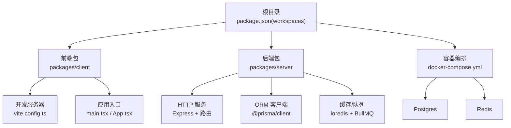
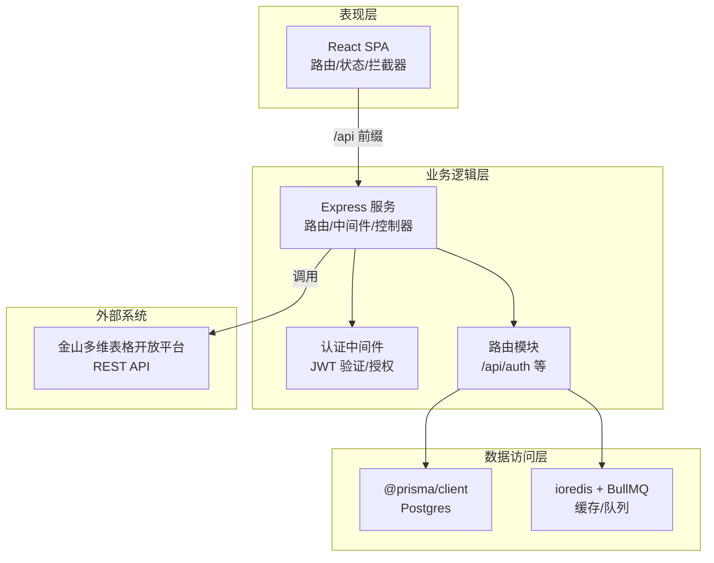
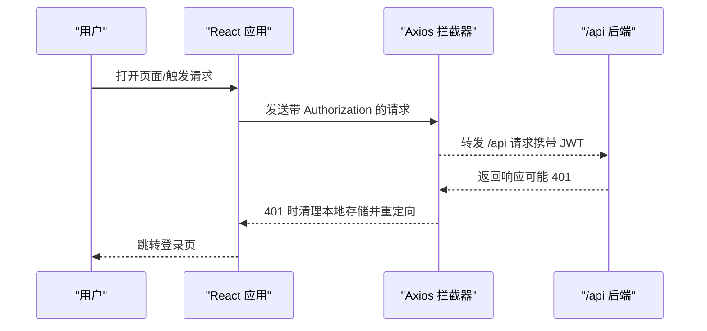
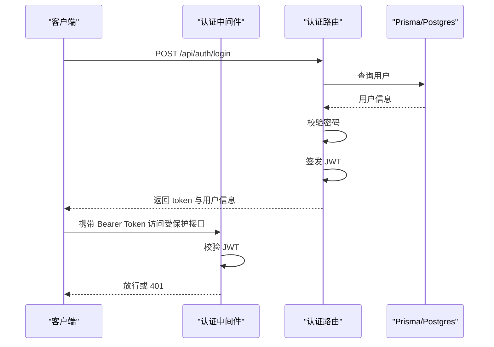
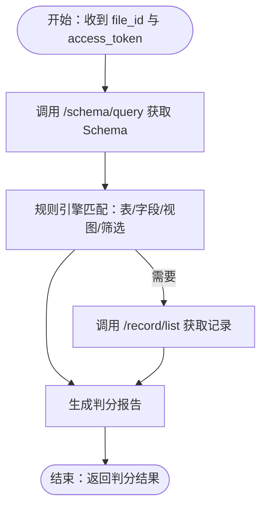
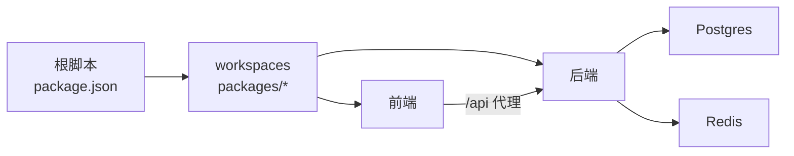

# 整体架构设计

<cite>
**本文档引用的文件**
- [package.json](file://package.json)
- [docker-compose.yml](file://docker-compose.yml)
- [packages/server/package.json](file://packages/server/package.json)
- [packages/server/src/config/prisma.ts](file://packages/server/src/config/prisma.ts)
- [packages/server/src/middleware/auth.ts](file://packages/server/src/middleware/auth.ts)
- [packages/server/src/routes/auth.ts](file://packages/server/src/routes/auth.ts)
- [packages/client/vite.config.ts](file://packages/client/vite.config.ts)
- [packages/client/src/main.tsx](file://packages/client/src/main.tsx)
- [packages/client/src/App.tsx](file://packages/client/src/App.tsx)
- [packages/client/src/stores/auth.ts](file://packages/client/src/stores/auth.ts)
- [packages/client/src/services/api.ts](file://packages/client/src/services/api.ts)
- [docs/kingsoft-api-reference.md](file://docs/kingsoft-api-reference.md)
- [.gitignore](file://.gitignore)
</cite>

## 目录
1. [引言](#引言)
2. [项目结构](#项目结构)
3. [核心组件](#核心组件)
4. [架构总览](#架构总览)
5. [详细组件分析](#详细组件分析)
6. [依赖关系分析](#依赖关系分析)
7. [性能考量](#性能考量)
8. [故障排查指南](#故障排查指南)
9. [结论](#结论)
10. [附录](#附录)

## 引言
本文件面向“金山多维表格考试系统”，提供整体架构设计文档。重点阐述分层架构（表现层、业务逻辑层、数据访问层）、Monorepo 架构（npm workspaces）与 Docker 编排、前后端分离与通信机制、系统边界与外部依赖集成、内部模块解耦策略，并给出架构决策的技术考量与未来扩展方向。

## 项目结构
系统采用 Monorepo 结构，根目录通过 npm workspaces 管理两个子包：前端 React 应用与后端 Node.js 服务。根脚本统一编排开发、构建与数据库迁移；Docker Compose 提供 Postgres 与 Redis 的本地化依赖环境。

图表来源
- [package.json:17-20](file://package.json#L17-L20)
- [packages/client/vite.config.ts:1-21](file://packages/client/vite.config.ts#L1-L21)
- [packages/client/src/main.tsx:1-17](file://packages/client/src/main.tsx#L1-L17)
- [packages/client/src/App.tsx:1-60](file://packages/client/src/App.tsx#L1-L60)
- [packages/server/package.json:13-24](file://packages/server/package.json#L13-L24)
- [packages/server/src/config/prisma.ts:1-9](file://packages/server/src/config/prisma.ts#L1-L9)
- [docker-compose.yml:1-37](file://docker-compose.yml#L1-L37)

章节来源
- [package.json:1-26](file://package.json#L1-L26)
- [docker-compose.yml:1-37](file://docker-compose.yml#L1-L37)

## 核心组件
- 前端 React 应用
  - 使用 Vite 作为开发服务器与代理，将 /api 前缀转发至后端服务。
  - 应用入口初始化国际化、路由与主题上下文。
  - 使用 Zustand 管理认证状态，Axios 统一拦截器注入 JWT 并处理 401。
- 后端 Node.js 服务
  - Express 提供 REST API，内置认证中间件与角色授权。
  - Prisma 作为 ORM 客户端连接数据库。
  - ioredis + BullMQ 实现异步任务与缓存。
  - 路由模块化组织，如认证路由。
- 外部依赖
  - Postgres 与 Redis 通过 Docker Compose 提供。
  - 金山多维表格开放平台 API 作为外部验证引擎对接目标。

章节来源
- [packages/client/vite.config.ts:1-21](file://packages/client/vite.config.ts#L1-L21)
- [packages/client/src/main.tsx:1-17](file://packages/client/src/main.tsx#L1-L17)
- [packages/client/src/App.tsx:1-60](file://packages/client/src/App.tsx#L1-L60)
- [packages/client/src/stores/auth.ts:1-43](file://packages/client/src/stores/auth.ts#L1-L43)
- [packages/client/src/services/api.ts:1-32](file://packages/client/src/services/api.ts#L1-L32)
- [packages/server/package.json:13-24](file://packages/server/package.json#L13-L24)
- [packages/server/src/config/prisma.ts:1-9](file://packages/server/src/config/prisma.ts#L1-L9)
- [packages/server/src/middleware/auth.ts:1-45](file://packages/server/src/middleware/auth.ts#L1-L45)
- [packages/server/src/routes/auth.ts:1-152](file://packages/server/src/routes/auth.ts#L1-L152)
- [docker-compose.yml:1-37](file://docker-compose.yml#L1-L37)

## 架构总览
系统采用经典的三层架构：
- 表现层（Presentation Layer）
  - React SPA，负责用户交互、状态管理与 API 调用。
- 业务逻辑层（Business Logic Layer）
  - Express 路由与控制器，处理认证、授权、规则校验与调用外部金山 API。
- 数据访问层（Data Access Layer）
  - Prisma ORM + Postgres；Redis 用于缓存与队列。

系统边界与集成点：
- 内部边界：前端与后端通过 /api 前缀通信；后端内部模块按功能拆分（认证、题库、考试、判分）。
- 外部边界：后端对接金山多维表格开放平台 REST API，进行 Schema 与记录读取、表/字段/视图操作。

图表来源
- [packages/client/src/services/api.ts:1-32](file://packages/client/src/services/api.ts#L1-L32)
- [packages/client/src/App.tsx:1-60](file://packages/client/src/App.tsx#L1-L60)
- [packages/server/src/middleware/auth.ts:1-45](file://packages/server/src/middleware/auth.ts#L1-L45)
- [packages/server/src/routes/auth.ts:1-152](file://packages/server/src/routes/auth.ts#L1-L152)
- [packages/server/src/config/prisma.ts:1-9](file://packages/server/src/config/prisma.ts#L1-L9)
- [packages/server/package.json:13-24](file://packages/server/package.json#L13-L24)
- [docs/kingsoft-api-reference.md:33-68](file://docs/kingsoft-api-reference.md#L33-L68)

## 详细组件分析

### 前端组件分析（React SPA）
- 应用入口与路由
  - 初始化国际化、路由与主题上下文，按角色保护路由。
- 状态管理
  - 使用 Zustand 管理登录态与用户信息，持久化到 localStorage。
- API 通信
  - Axios 实例统一设置 baseURL 与超时；请求头注入 Bearer Token；统一处理 401 清理本地存储并跳转登录。

图表来源
- [packages/client/src/services/api.ts:1-32](file://packages/client/src/services/api.ts#L1-L32)
- [packages/client/src/stores/auth.ts:1-43](file://packages/client/src/stores/auth.ts#L1-L43)
- [packages/client/src/App.tsx:24-36](file://packages/client/src/App.tsx#L24-L36)

章节来源
- [packages/client/src/main.tsx:1-17](file://packages/client/src/main.tsx#L1-L17)
- [packages/client/src/App.tsx:1-60](file://packages/client/src/App.tsx#L1-L60)
- [packages/client/src/stores/auth.ts:1-43](file://packages/client/src/stores/auth.ts#L1-L43)
- [packages/client/src/services/api.ts:1-32](file://packages/client/src/services/api.ts#L1-L32)
- [packages/client/vite.config.ts:12-20](file://packages/client/vite.config.ts#L12-L20)

### 后端组件分析（Node.js + Express）
- 认证中间件
  - 解析 Authorization 头，校验 JWT，失败返回 401。
  - 角色授权装饰器，按角色放行。
- 认证路由
  - 登录：校验参数、查询用户、比对密码、签发 JWT。
  - 注册：参数校验、去重、哈希密码、创建用户。
  - 个人信息：受保护路由，返回用户信息。
  - 刷新：基于当前用户信息重新签发 JWT。
- 数据访问
  - Prisma 客户端连接数据库，开发环境全局缓存以避免重复实例。
- 外部集成
  - 通过金山开放平台 REST API 获取 Schema 与记录，支持判分引擎规则映射。

图表来源
- [packages/server/src/middleware/auth.ts:19-44](file://packages/server/src/middleware/auth.ts#L19-L44)
- [packages/server/src/routes/auth.ts:24-66](file://packages/server/src/routes/auth.ts#L24-L66)
- [packages/server/src/config/prisma.ts:1-9](file://packages/server/src/config/prisma.ts#L1-L9)

章节来源
- [packages/server/src/middleware/auth.ts:1-45](file://packages/server/src/middleware/auth.ts#L1-L45)
- [packages/server/src/routes/auth.ts:1-152](file://packages/server/src/routes/auth.ts#L1-L152)
- [packages/server/src/config/prisma.ts:1-9](file://packages/server/src/config/prisma.ts#L1-L9)
- [packages/server/package.json:13-24](file://packages/server/package.json#L13-L24)

### 金山多维表格 API 集成
- 核心能力
  - 通过 /schema/query 获取完整 Schema，支撑规则引擎匹配（表名、字段、视图、筛选条件等）。
  - 支持记录列举与创建，满足判分与数据回写需求。
- 鉴权与签名
  - 使用 WPS-3 签名（Content-Md5 + Date + X-Auth），配合 access_token。
- 适配建议
  - 抽象 Kingsoft Adapter，封装 Schema 缓存与常用查询方法，统一错误处理（401、404、429）。

图表来源
- [docs/kingsoft-api-reference.md:33-68](file://docs/kingsoft-api-reference.md#L33-L68)
- [docs/kingsoft-api-reference.md:503-561](file://docs/kingsoft-api-reference.md#L503-L561)

章节来源
- [docs/kingsoft-api-reference.md:1-603](file://docs/kingsoft-api-reference.md#L1-L603)

## 依赖关系分析
- Monorepo 与工作区
  - 根 package.json 声明 workspaces，统一脚本编排前后端开发与构建。
  - 通过 npm run dev:server 与 npm run dev:client 并行启动。
- 外部依赖
  - Docker Compose 提供 Postgres 与 Redis，健康检查保障可用性。
- 前后端通信
  - 前端通过 /api 代理到后端 3000 端口；后端通过 @prisma/client 与数据库交互，通过 ioredis/BullMQ 与 Redis 交互。

图表来源
- [package.json:6-15](file://package.json#L6-L15)
- [package.json:17-20](file://package.json#L17-L20)
- [packages/client/vite.config.ts:14-19](file://packages/client/vite.config.ts#L14-L19)
- [docker-compose.yml:4-32](file://docker-compose.yml#L4-L32)

章节来源
- [package.json:1-26](file://package.json#L1-L26)
- [docker-compose.yml:1-37](file://docker-compose.yml#L1-L37)

## 性能考量
- 前端
  - 使用 Axios 拦截器减少重复代码；合理设置超时与重试策略。
  - 路由守卫避免无谓渲染，按需加载页面组件。
- 后端
  - JWT 验证与授权中间件应尽量轻量；对频繁请求的接口考虑缓存（Redis）。
  - Prisma 查询优化：使用 select 精简字段、分页与索引。
  - 异步任务：BullMQ 队列化非实时任务，降低请求延迟。
- 外部 API
  - 对金山 API 做指数退避重试与限流控制；对 Schema 结果做短期缓存。

## 故障排查指南
- 常见问题定位
  - 401 未认证：检查前端是否正确保存与注入 Bearer Token；确认后端 JWT 密钥与过期配置。
  - 403 权限不足：确认用户角色与路由授权配置。
  - 数据库连接失败：检查 Prisma 连接字符串与 Docker Postgres 健康状态。
  - Redis 不可用：确认 Docker Redis 健康与连接参数。
  - 金山 API 错误：检查 access_token 有效性、签名头与请求体 MD5。
- 建议措施
  - 前端：在拦截器中打印错误状态码与响应体，便于定位。
  - 后端：增加中间件日志与错误捕获，区分业务错误与系统错误。
  - 外部集成：统一错误码映射与重试策略，记录重试次数与退避间隔。

章节来源
- [packages/client/src/services/api.ts:17-30](file://packages/client/src/services/api.ts#L17-L30)
- [packages/server/src/middleware/auth.ts:19-32](file://packages/server/src/middleware/auth.ts#L19-L32)
- [docker-compose.yml:15-19](file://docker-compose.yml#L15-L19)
- [docker-compose.yml:28-32](file://docker-compose.yml#L28-L32)
- [docs/kingsoft-api-reference.md:556-560](file://docs/kingsoft-api-reference.md#L556-L560)

## 结论
该系统通过 Monorepo 与 npm workspaces 实现前后端一体化管理，借助 Docker Compose 提供稳定的数据与缓存依赖。前端与后端通过 /api 前缀清晰隔离，后端以 Express + Prisma + Redis 构建业务与数据层，外部通过金山多维表格开放平台 API 实现核心验证能力。整体架构具备良好的可维护性与扩展性，适合后续引入微服务、可观测性与更复杂的判分规则引擎。

## 附录
- 开发与运维
  - 开发：根脚本一键启动前后端与数据库；前端代理到后端 3000 端口。
  - 构建：分别构建前后端产物。
  - 数据库：Prisma 迁移与 Studio 管理。
- 文件忽略
  - 根 .gitignore 已排除 node_modules、dist、日志与 Prisma 目录等。

章节来源
- [package.json:6-15](file://package.json#L6-L15)
- [package.json:1-26](file://package.json#L1-L26)
- [.gitignore:1-11](file://.gitignore#L1-L11)