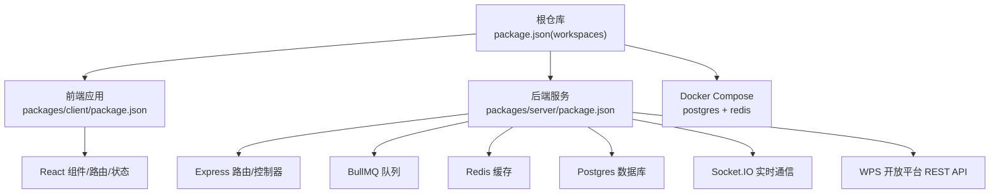
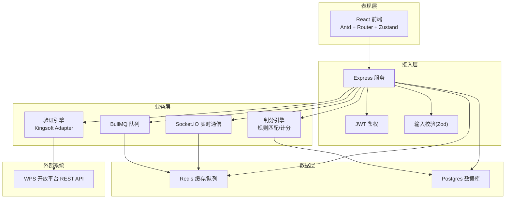
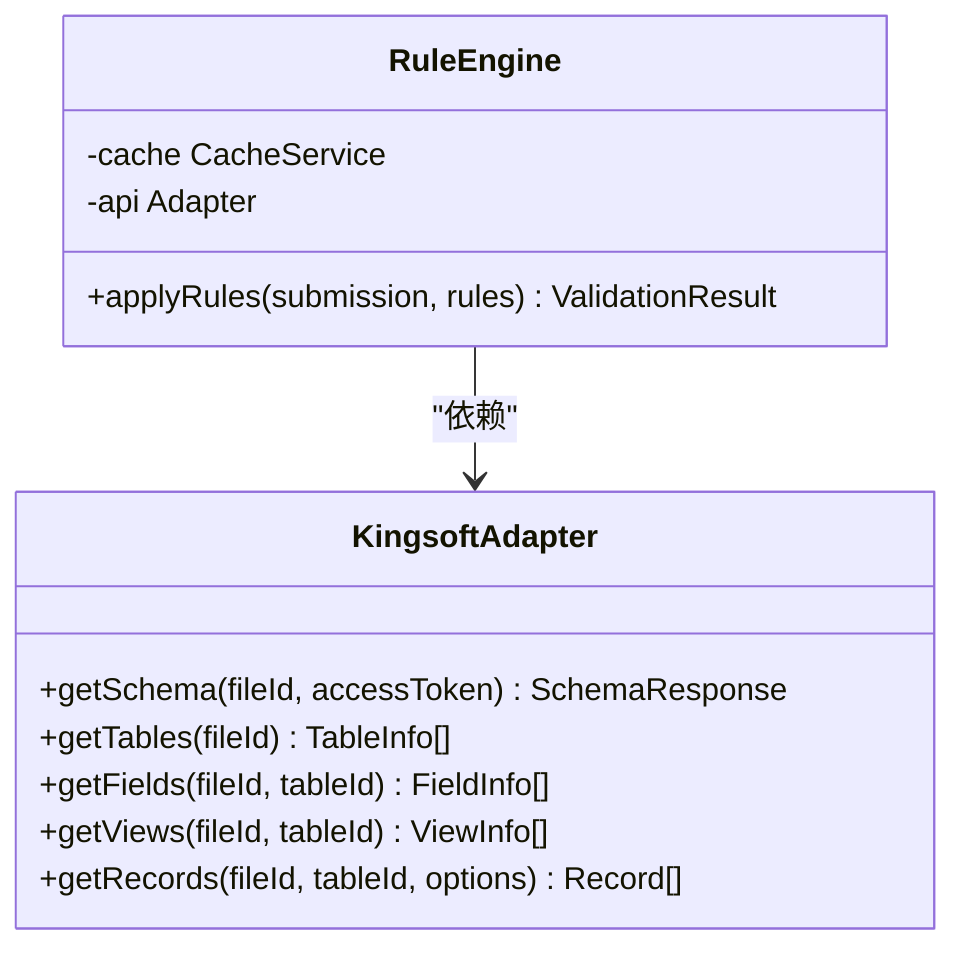
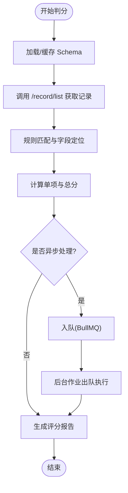
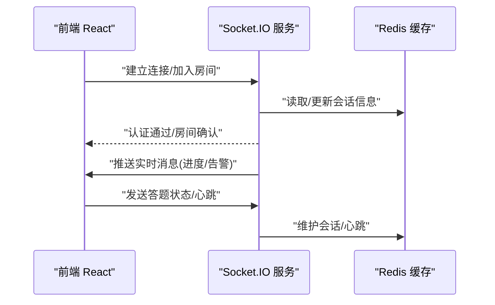
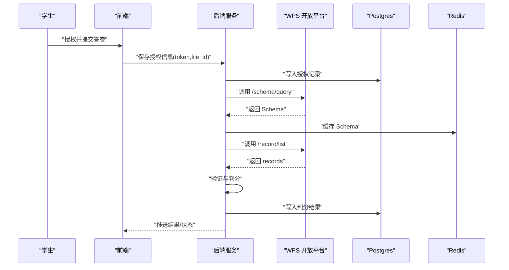
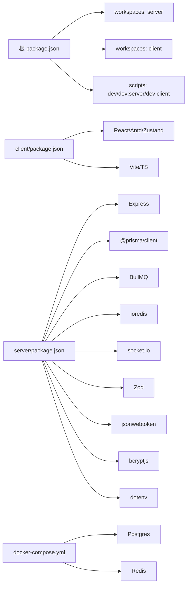

# 系统架构

<cite>
**本文档引用的文件**
- [package.json](file://package.json)
- [docker-compose.yml](file://docker-compose.yml)
- [packages/client/package.json](file://packages/client/package.json)
- [packages/server/package.json](file://packages/server/package.json)
- [docs/kingsoft-api-reference.md](file://docs/kingsoft-api-reference.md)
</cite>

## 目录
1. [引言](#引言)
2. [项目结构](#项目结构)
3. [核心组件](#核心组件)
4. [架构总览](#架构总览)
5. [详细组件分析](#详细组件分析)
6. [依赖分析](#依赖分析)
7. [性能考虑](#性能考虑)
8. [故障排查指南](#故障排查指南)
9. [结论](#结论)
10. [附录](#附录)

## 引言
本系统是面向金山多维表格的考试系统，围绕“验证引擎 + 判分系统 + 实时通信”的核心能力构建。系统采用 Monorepo 架构，通过 npm workspaces 组织前后端两个子包，并以 Docker Compose 提供数据库与缓存的本地化运行环境。系统通过对接 WPS 开放平台的服务端 REST API，读取学生作答表格的 Schema 与记录，驱动规则引擎进行自动化验证与判分；同时利用 Socket.IO 提供实时通信能力，支撑监考与答题状态的即时反馈。

## 项目结构
系统采用根仓库 + 工作区（workspaces）的 Monorepo 组织方式，前端 React 应用与后端 Node.js 服务分别位于 packages/client 与 packages/server 下，由根 package.json 的 workspaces 字段声明。根 scripts 负责统一启动开发与构建流程，并通过 concurrently 并行启动前后端服务。

- 根级配置
  - 根 package.json 声明 workspaces 为 packages/server 与 packages/client，并提供 dev/build/db:* 等统一脚本。
  - docker-compose.yml 提供 Postgres 与 Redis 的容器化依赖，便于本地开发与测试。
- 前端（packages/client）
  - 使用 Vite + React + TypeScript，依赖 Ant Design UI、路由、状态管理与 HTTP 客户端等。
- 后端（packages/server）
  - 使用 Express + Prisma（@prisma/client），集成 BullMQ（队列）、Socket.IO（实时通信）、Redis（缓存/队列存储）、JWT（鉴权）、Zod（校验）等。

图表来源
- [package.json:17-20](file://package.json#L17-L20)
- [packages/client/package.json:1-29](file://packages/client/package.json#L1-L29)
- [packages/server/package.json:1-35](file://packages/server/package.json#L1-L35)
- [docker-compose.yml:1-37](file://docker-compose.yml#L1-L37)

章节来源
- [package.json:1-26](file://package.json#L1-L26)
- [docker-compose.yml:1-37](file://docker-compose.yml#L1-L37)
- [packages/client/package.json:1-29](file://packages/client/package.json#L1-L29)
- [packages/server/package.json:1-35](file://packages/server/package.json#L1-L35)

## 核心组件
- 验证引擎（Rule Engine）
  - 基于 WPS 开放平台 Schema 查询接口，解析表结构、字段类型、视图与筛选条件，形成可执行的验证规则集。
  - 通过适配器模式对接外部 API，支持缓存与错误处理策略。
- 判分系统（Scoring Engine）
  - 读取记录列表，结合规则与评分模板，输出评分明细与总分。
  - 支持异步任务队列，避免长耗时操作阻塞主流程。
- 实时通信（Real-time Communication）
  - 基于 Socket.IO，提供监考端与考生端的双向消息通道，支持答题进度、异常告警等事件推送。
- 数据与缓存（Data & Cache）
  - Redis 作为缓存与队列存储，提升 Schema 与中间结果的复用效率。
  - Postgres 存储业务数据（如用户、考试、提交记录等）。
- 前端界面（Frontend）
  - React + Ant Design，负责登录授权引导、答题界面、判分结果展示与实时消息订阅。

章节来源
- [docs/kingsoft-api-reference.md:503-571](file://docs/kingsoft-api-reference.md#L503-L571)
- [packages/server/package.json:13-34](file://packages/server/package.json#L13-L34)

## 架构总览
系统采用分层架构：表现层（前端 React）、接入层（后端 Express）、业务层（验证/判分）、数据层（Postgres + Redis）。WPS 开放平台作为外部数据源，通过 REST API 与 AirScript 辅助能力，为系统提供结构化 Schema 与记录数据。

图表来源
- [packages/server/package.json:13-34](file://packages/server/package.json#L13-L34)
- [docs/kingsoft-api-reference.md:33-68](file://docs/kingsoft-api-reference.md#L33-L68)

## 详细组件分析

### 验证引擎（Rule Engine）
- 能力边界
  - 通过 /schema/query 获取完整 Schema，解析 sheets、fields、views 结构，形成规则匹配所需的元数据。
  - 提供便捷方法：按 file_id 获取表、字段、视图与记录，支持基于缓存的二次查询。
- 错误处理
  - 针对 401（令牌过期）、404（file_id 无效）、429（频率限制）等返回码，采用刷新令牌、重试与指数退避策略。
- 适配器接口
  - 定义 KingsoftAdapter 接口，封装 getSchema、getTables、getFields、getViews、getRecords 等方法，便于替换与扩展。

图表来源
- [docs/kingsoft-api-reference.md:540-560](file://docs/kingsoft-api-reference.md#L540-L560)

章节来源
- [docs/kingsoft-api-reference.md:503-571](file://docs/kingsoft-api-reference.md#L503-L571)
- [docs/kingsoft-api-reference.md:540-560](file://docs/kingsoft-api-reference.md#L540-L560)

### 判分系统（Scoring Engine）
- 数据来源
  - 通过 /record/list 获取 records 与 fieldsSchema，结合规则引擎输出的期望字段与视图配置，进行字段值匹配与计分。
- 处理流程
  - 解析 records，按规则映射到评分模板，输出单项得分与总分。
  - 对长耗时任务使用队列异步处理，保障接口响应。
- 输出
  - 返回结构化的评分报告，包含每题得分、总分、异常项与建议。

图表来源
- [docs/kingsoft-api-reference.md:183-224](file://docs/kingsoft-api-reference.md#L183-L224)
- [packages/server/package.json:16-16](file://packages/server/package.json#L16-L16)

章节来源
- [docs/kingsoft-api-reference.md:183-224](file://docs/kingsoft-api-reference.md#L183-L224)
- [packages/server/package.json:16-16](file://packages/server/package.json#L16-L16)

### 实时通信（Socket.IO）
- 通信模型
  - 前端连接后端 Socket.IO 服务，订阅与自身相关的房间或事件（如答题进度、异常告警）。
  - 后端根据 JWT 鉴权与权限控制，向特定客户端推送消息。
- 缓存与持久化
  - 使用 Redis 保存会话与房间信息，确保断线重连与消息不丢失。
- 典型场景
  - 考试开始/结束通知、异常行为告警、监考端与考生端的状态同步。

图表来源
- [packages/server/package.json:22-22](file://packages/server/package.json#L22-L22)
- [packages/server/package.json:20-20](file://packages/server/package.json#L20-L20)

章节来源
- [packages/server/package.json:22-22](file://packages/server/package.json#L22-L22)
- [packages/server/package.json:20-20](file://packages/server/package.json#L20-L20)

### 数据流与集成模式
- 鉴权与初始化
  - 学生在前端授权后，后端获取 access_token 与 file_id，并写入数据库。
- 验证与判分
  - 后端定时/手动触发，调用 /schema/query 获取 Schema，随后调用 /record/list 获取记录，交由验证与判分引擎处理。
- 结果回传
  - 判分结果写入数据库，前端轮询或通过 WebSocket 推送展示。

图表来源
- [docs/kingsoft-api-reference.md:503-571](file://docs/kingsoft-api-reference.md#L503-L571)
- [docs/kingsoft-api-reference.md:69-115](file://docs/kingsoft-api-reference.md#L69-L115)
- [docs/kingsoft-api-reference.md:183-224](file://docs/kingsoft-api-reference.md#L183-L224)

章节来源
- [docs/kingsoft-api-reference.md:503-571](file://docs/kingsoft-api-reference.md#L503-L571)
- [docs/kingsoft-api-reference.md:69-115](file://docs/kingsoft-api-reference.md#L69-L115)
- [docs/kingsoft-api-reference.md:183-224](file://docs/kingsoft-api-reference.md#L183-L224)

## 依赖分析
- 工作区与脚本
  - 根 package.json 通过 workspaces 声明子包，dev 脚本使用 concurrently 并行启动前后端开发服务器。
  - db:* 脚本委托给 packages/server 内部命令，便于统一迁移与种子数据管理。
- 前端依赖
  - React 生态（React、React Router、React DOM），Ant Design UI，状态管理（Zustand），HTTP 客户端（Axios），时间工具（Day.js）。
- 后端依赖
  - Web 框架（Express）、ORM（Prisma）、队列（BullMQ）、缓存（ioredis）、鉴权（bcryptjs、jsonwebtoken）、校验（Zod）、实时通信（socket.io）、环境变量（dotenv）。
- 运行时依赖
  - Docker Compose 提供 Postgres 与 Redis，满足本地开发与测试需求。

图表来源
- [package.json:17-20](file://package.json#L17-L20)
- [package.json:6-16](file://package.json#L6-L16)
- [packages/client/package.json:1-29](file://packages/client/package.json#L1-L29)
- [packages/server/package.json:13-34](file://packages/server/package.json#L13-L34)
- [docker-compose.yml:1-37](file://docker-compose.yml#L1-L37)

章节来源
- [package.json:1-26](file://package.json#L1-L26)
- [packages/client/package.json:1-29](file://packages/client/package.json#L1-L29)
- [packages/server/package.json:1-35](file://packages/server/package.json#L1-L35)
- [docker-compose.yml:1-37](file://docker-compose.yml#L1-L37)

## 性能考虑
- 缓存策略
  - 将 WPS Schema 与常用查询结果缓存至 Redis，减少对外部 API 的重复调用，降低延迟与限流风险。
- 异步处理
  - 使用 BullMQ 将长耗时判分任务放入队列，避免阻塞请求线程，提高吞吐量。
- 数据库优化
  - 对高频查询字段建立索引，合理拆分读写库，必要时引入只读副本。
- 实时通信
  - 使用 Redis 作为 Socket.IO 的适配器，支持横向扩展与会话一致性。
- 前端体验
  - 采用懒加载与分包策略，减少首屏体积；对频繁交互使用本地状态与节流。

## 故障排查指南
- WPS API 错误码
  - 401：access_token 过期或无效，需刷新或引导用户重新授权。
  - 404：file_id 不存在或无权限，需检查表格链接与授权范围。
  - 429：请求频率过高，采用指数退避重试与限流控制。
- Redis/Postgres 连接问题
  - 检查 docker-compose 服务状态与端口映射，确认健康检查通过。
- Socket.IO 断线
  - 核对鉴权头与房间权限，查看 Redis 会话是否正常续期。
- 前后端联调
  - 使用根脚本统一启动，避免端口冲突；关注 CORS 与跨域配置。

章节来源
- [docs/kingsoft-api-reference.md:556-560](file://docs/kingsoft-api-reference.md#L556-L560)
- [docker-compose.yml:15-19](file://docker-compose.yml#L15-L19)
- [docker-compose.yml:28-32](file://docker-compose.yml#L28-L32)

## 结论
该系统以 Monorepo 与 npm workspaces 为基础，清晰划分前端与后端职责；通过 WPS 开放平台 API 获取 Schema 与记录，结合验证与判分引擎实现自动化考试评估；借助 Redis 与 BullMQ 提升性能与可靠性；Socket.IO 提供实时通信能力。整体架构具备良好的扩展性与可维护性，适合在教学与测评场景中持续演进。

## 附录
- 技术栈摘要
  - 前端：React、TypeScript、Vite、Ant Design、Zustand、Axios、Day.js
  - 后端：Node.js、Express、Prisma、BullMQ、Socket.IO、ioredis、jsonwebtoken、bcryptjs、Zod、dotenv
  - 基础设施：Postgres、Redis、Docker Compose
- API 参考
  - 服务端 REST API：/schema/query、/record/list 等
  - 鉴权头：Content-Md5、Content-Type、Date、X-Auth
  - 字段类型与视图类型参考详见文档

章节来源
- [packages/client/package.json:11-27](file://packages/client/package.json#L11-L27)
- [packages/server/package.json:13-34](file://packages/server/package.json#L13-L34)
- [docs/kingsoft-api-reference.md:33-68](file://docs/kingsoft-api-reference.md#L33-L68)
- [docs/kingsoft-api-reference.md:377-446](file://docs/kingsoft-api-reference.md#L377-L446)