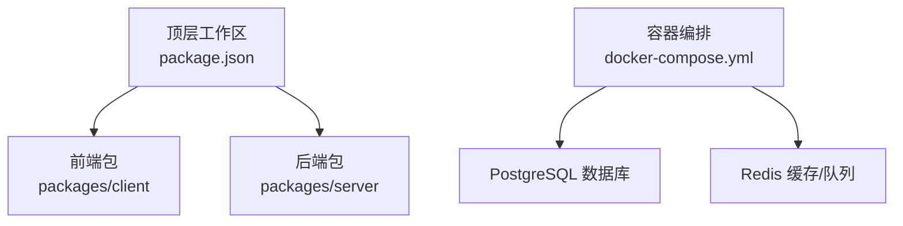
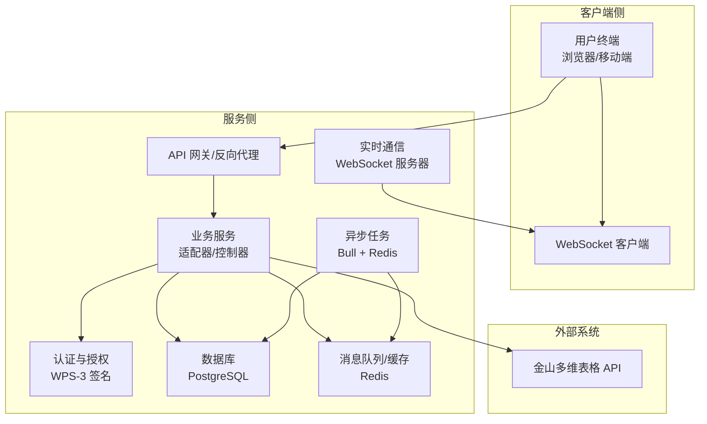
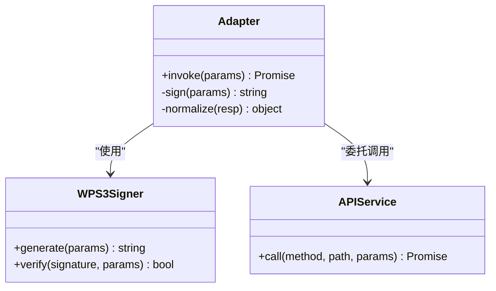
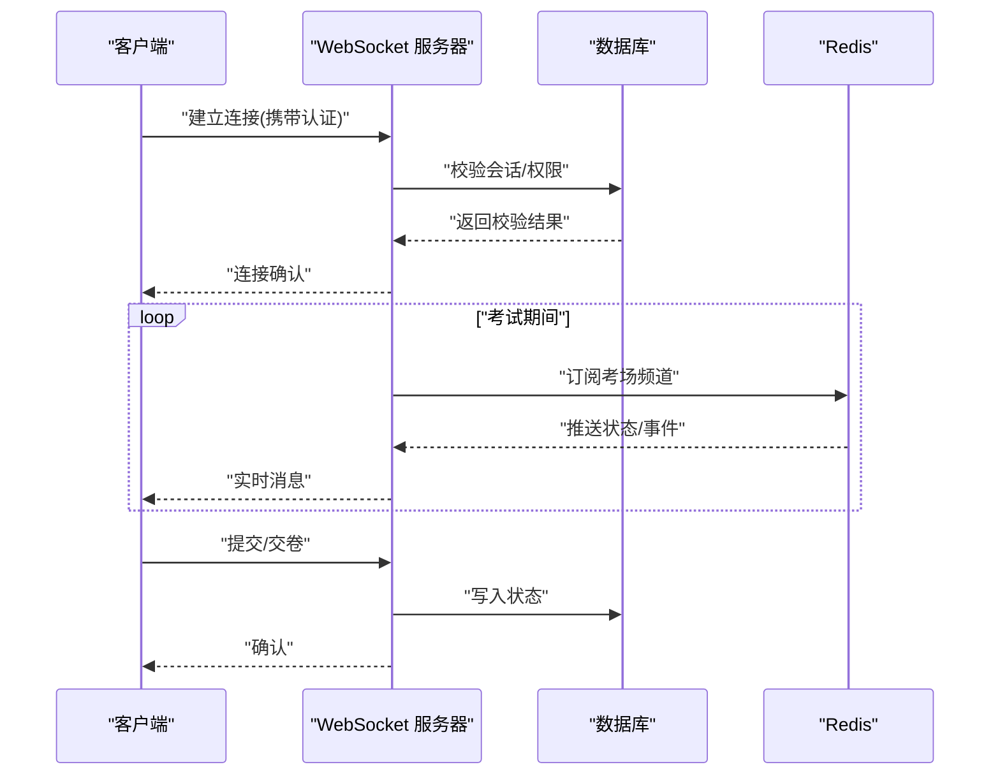
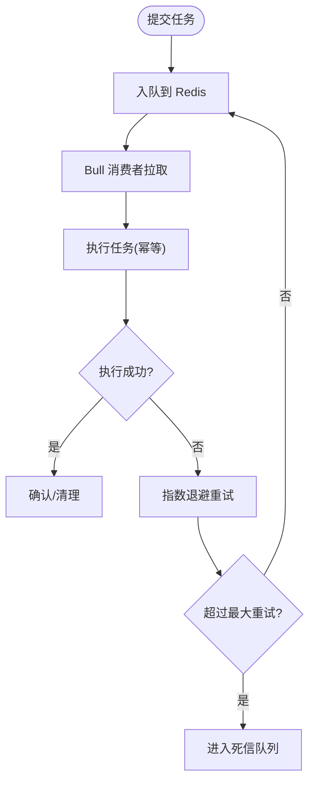
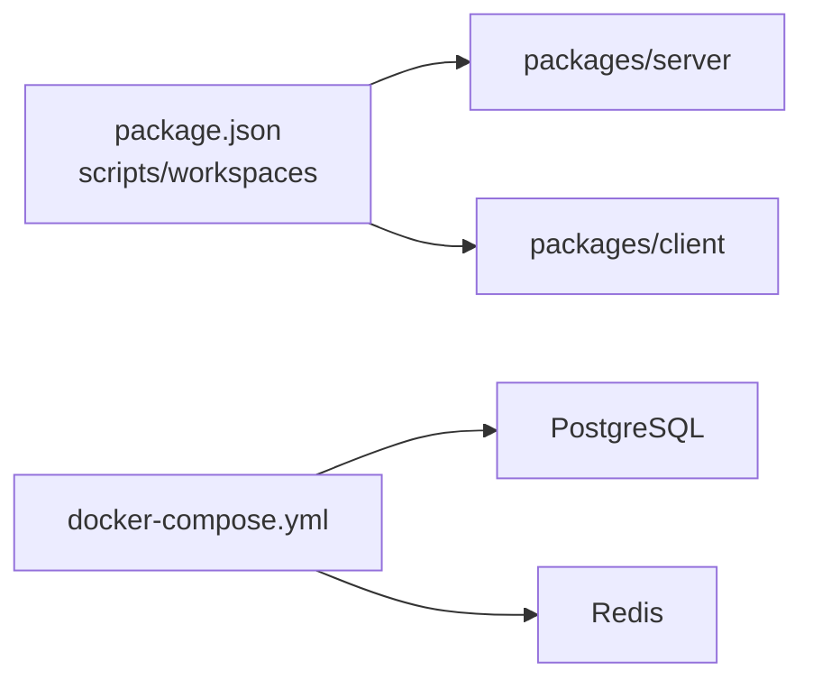

# 集成模式

<cite>
**本文引用的文件**
- [package.json](file://package.json)
- [docker-compose.yml](file://docker-compose.yml)
</cite>

## 目录
1. [引言](#引言)
2. [项目结构](#项目结构)
3. [核心组件](#核心组件)
4. [架构总览](#架构总览)
5. [详细组件分析](#详细组件分析)
6. [依赖关系分析](#依赖关系分析)
7. [性能考量](#性能考量)
8. [故障排查指南](#故障排查指南)
9. [结论](#结论)
10. [附录](#附录)

## 引言
本文件面向“金山多维表格考试系统”的集成模式，聚焦于系统与金山API的集成架构、适配器模式实现、WPS-3签名认证机制、WebSocket实时通信（考试监控与状态同步）、异步任务处理（Redis队列与Bull任务调度）、第三方服务集成最佳实践、错误处理策略与监控方案，以及API网关、服务发现与负载均衡的架构建议。由于当前仓库仅包含顶层工作区与容器编排配置，本文在缺乏具体后端/前端源码的情况下，仍基于现有配置与通用工程实践给出可落地的集成蓝图与实施建议。

## 项目结构
- 工作区采用monorepo布局，通过顶层脚本统一管理前后端开发与构建流程。
- 容器编排定义了数据库(PostgreSQL)与缓存/消息队列(Redis)的基础运行环境，为后续服务集成提供基础设施支撑。

**图表来源**
- [package.json:1-26](file://package.json#L1-L26)
- [docker-compose.yml:1-37](file://docker-compose.yml#L1-L37)

**章节来源**
- [package.json:1-26](file://package.json#L1-L26)
- [docker-compose.yml:1-37](file://docker-compose.yml#L1-L37)

## 核心组件
- 适配器层：封装对金山API的调用，屏蔽底层差异，提供统一接口；支持WPS-3签名认证参数注入与校验。
- 实时通信层：基于WebSocket实现考试监控与状态同步，确保监考端与客户端之间的低延迟数据交换。
- 异步任务层：以Redis为消息中间件，结合Bull实现任务队列与调度，承载如生成报表、发送通知等后台任务。
- 第三方服务集成：围绕数据库(PostgreSQL)与缓存(Redis)进行连接池、超时与重试策略配置，保障高可用性。
- 错误处理与监控：建立统一的异常捕获、指标上报与告警通道，覆盖网络请求、数据库操作与队列消费失败场景。

## 架构总览
下图展示系统与外部服务的集成关系与数据流：

**图表来源**
- [docker-compose.yml:1-37](file://docker-compose.yml#L1-L37)

## 详细组件分析

### 金山API集成与适配器模式
- 设计要点
  - 适配器负责封装API调用细节，提供稳定接口；内部实现WPS-3签名参数的生成与注入，并对响应进行标准化处理。
  - 支持多版本API切换与降级策略，避免上游变更影响系统稳定性。
- 接口契约
  - 请求参数：包含业务必需字段与WPS-3签名参数。
  - 响应格式：统一封装成功/失败状态与错误码，便于上层统一处理。
- 错误处理
  - 对网络异常、鉴权失败、业务错误分别处理，记录上下文日志并触发重试或熔断。

**图表来源**
- [package.json:1-26](file://package.json#L1-L26)

**章节来源**
- [package.json:1-26](file://package.json#L1-L26)

### WebSocket实时通信集成
- 监考与状态同步
  - 通过WebSocket建立持久连接，实现实时推送考试状态、异常告警与答题进度更新。
  - 采用心跳保活与断线重连策略，保证长连接稳定性。
- 连接管理
  - 在服务端维护连接池与会话状态，按考场/房间维度隔离数据通道。
- 安全与限流
  - 结合认证令牌与IP白名单，限制并发连接数与消息速率，防止滥用。

**图表来源**
- [docker-compose.yml:1-37](file://docker-compose.yml#L1-L37)

**章节来源**
- [docker-compose.yml:1-37](file://docker-compose.yml#L1-L37)

### 异步任务处理集成（Redis + Bull）
- 队列模型
  - 使用Redis作为消息中间件，Bull实现任务队列与调度；支持优先级、延迟、重试与死信队列。
- 典型任务
  - 考试统计报表生成、邮件/短信通知、附件归档、日志清理等。
- 可靠性
  - 任务执行幂等化设计，配合Redis持久化与Bull作业状态追踪，确保不丢失、不重复。

**图表来源**
- [docker-compose.yml:1-37](file://docker-compose.yml#L1-L37)

**章节来源**
- [docker-compose.yml:1-37](file://docker-compose.yml#L1-L37)

### 第三方服务集成最佳实践
- 数据库(PostgreSQL)
  - 连接池大小与超时设置需结合QPS与事务复杂度评估；启用只读副本分担查询压力。
  - 事务边界清晰，避免长事务锁表；对热点表建立合适索引。
- 缓存/队列(Redis)
  - 合理设置TTL与内存淘汰策略；对热key进行分片或本地缓存降压。
  - 使用发布订阅实现广播式通知，使用列表/流实现有序消息处理。
- API网关与服务治理
  - 统一入口负责路由、限流、鉴权与协议转换；结合服务注册与发现实现动态路由。
  - 负载均衡采用就近访问与健康检查，结合熔断与隔离策略提升整体韧性。

### 错误处理策略与监控方案
- 错误分类与处置
  - 网络类错误：自动重试+退避；超过阈值转人工介入。
  - 业务类错误：记录上下文日志与traceId，区分可恢复与不可恢复错误。
  - 并发冲突：采用乐观锁/分布式锁，必要时回滚并提示重试。
- 监控与告警
  - 指标：请求量/成功率/耗时/P95/P99、队列积压、连接池使用率、Redis命中率。
  - 日志：结构化日志，关键路径打点；与APM工具对接。
  - 告警：分级阈值、收敛规则与升级策略，避免告警风暴。

## 依赖关系分析
- 工作区脚本
  - 通过顶层脚本统一启动前后端开发与构建，简化本地联调与部署流程。
- 容器编排
  - PostgreSQL与Redis作为基础依赖，提供数据库与缓存能力；健康检查确保服务可用性。

**图表来源**
- [package.json:1-26](file://package.json#L1-L26)
- [docker-compose.yml:1-37](file://docker-compose.yml#L1-L37)

**章节来源**
- [package.json:1-26](file://package.json#L1-L26)
- [docker-compose.yml:1-37](file://docker-compose.yml#L1-L37)

## 性能考量
- 连接与资源
  - 合理配置数据库连接池与Redis连接数上限，避免资源争用。
  - 对高频接口开启HTTP/2或多路复用，减少握手开销。
- 缓存策略
  - 利用多级缓存（本地缓存+分布式缓存）降低后端压力；对冷数据定期淘汰。
- 队列吞吐
  - 根据任务类型划分队列优先级；对CPU密集型与IO密集型任务分离执行器。
- 网络与安全
  - WebSocket启用压缩与二进制帧传输；对敏感数据加密存储与传输。

## 故障排查指南
- 常见问题定位
  - API调用失败：检查WPS-3签名参数是否正确生成与传递；查看上游返回码与限流状态。
  - WebSocket断连：确认心跳间隔与超时设置；排查NAT/防火墙导致的TCP中断。
  - 队列堆积：检查消费者数量与处理耗时；核对死信队列中积压任务。
  - 数据库慢查询：分析慢日志与索引缺失；评估分库分表策略。
- 快速恢复
  - 临时降级非关键功能；切换只读副本；扩大缓存容量。
  - 回滚最近变更；重启异常实例；重建队列索引。

## 结论
本集成模式以适配器封装外部API、以WebSocket实现低延迟交互、以Redis+Bull承载异步任务为核心，辅以完善的错误处理与监控体系。结合容器化基础设施与服务治理手段，可在保证稳定性的同时满足考试系统的高可用与高性能需求。实际落地时，建议先完成适配器与认证模块的原型验证，再逐步完善实时通信与异步任务的生产级配置。

## 附录
- API网关与服务发现
  - 建议引入Kubernetes + Service Mesh或专用API网关，实现灰度发布、金丝雀与蓝绿部署。
- 负载均衡
  - 前端静态资源与后端接口分别配置独立LB；后端服务采用一致性哈希或轮询策略。
- 安全加固
  - TLS全链路加密；敏感参数脱敏；审计日志与合规留痕。