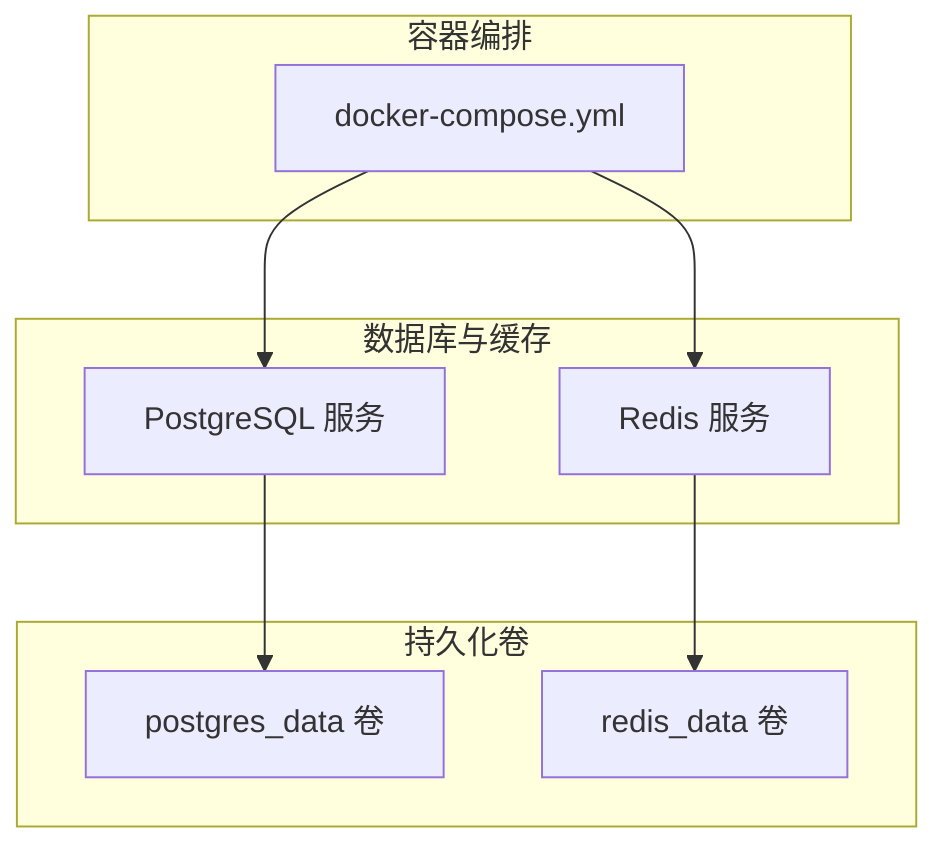
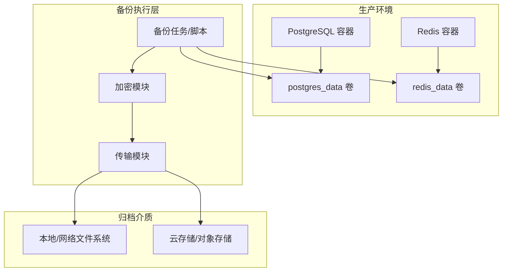
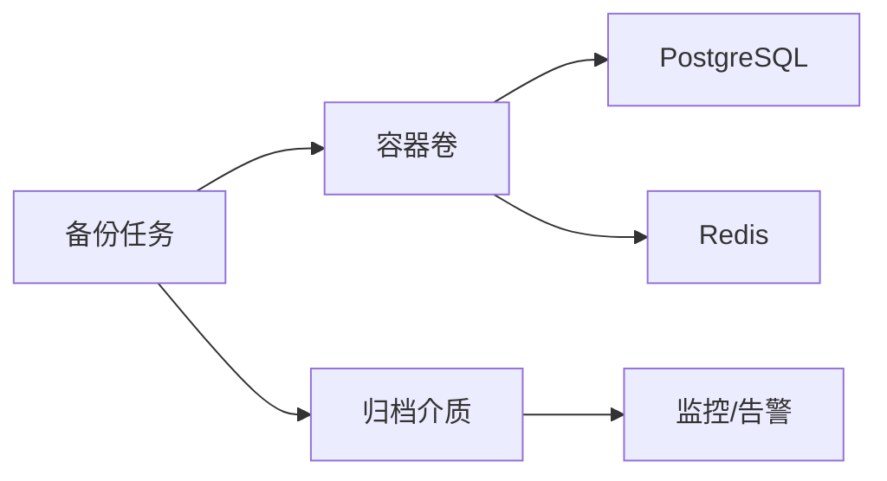
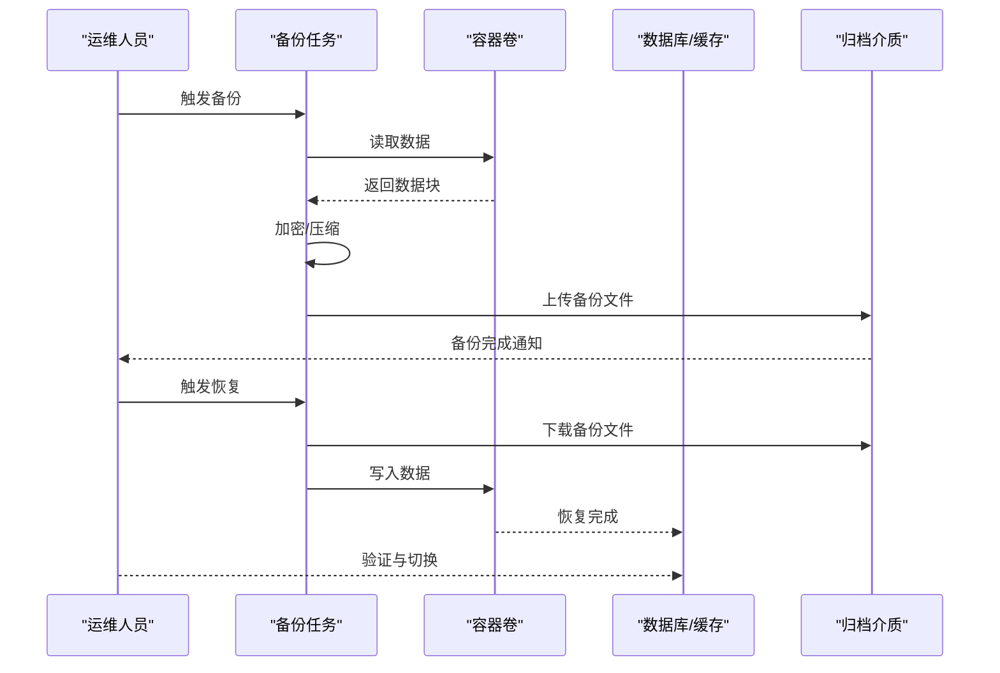

# 备份恢复

<cite>
**本文引用的文件**
- [docker-compose.yml](file://docker-compose.yml)
- [gen_docx.py](file://gen_docx.py)
</cite>

## 目录
1. [引言](#引言)
2. [项目结构](#项目结构)
3. [核心组件](#核心组件)
4. [架构总览](#架构总览)
5. [详细组件分析](#详细组件分析)
6. [依赖关系分析](#依赖关系分析)
7. [性能考量](#性能考量)
8. [故障排查指南](#故障排查指南)
9. [结论](#结论)
10. [附录](#附录)

## 引言
本方案面向“考试系统”的数据备份与灾难恢复，结合现有容器化部署与数据库组件，给出可落地的备份策略（全量/增量）、存储与传输安全、验证与恢复测试、RTO/RPO目标、迁移与应急处置、以及审计与合规建议。由于仓库中未包含业务侧备份脚本或运维工具，本方案以容器卷与数据库服务为依据，提供通用且可扩展的实践路径。

## 项目结构
系统采用容器编排方式运行数据库与缓存组件，核心数据持久化通过命名卷实现，便于进行快照与备份操作。

图表来源
- [docker-compose.yml:1-36](file://docker-compose.yml#L1-L36)

章节来源
- [docker-compose.yml:1-36](file://docker-compose.yml#L1-L36)

## 核心组件
- PostgreSQL 数据库：用于存储系统核心数据，使用容器卷进行持久化，支持逻辑备份与物理备份。
- Redis 缓存：用于会话、临时数据等，同样挂载到独立卷，便于备份与恢复。
- 容器卷：postgres_data、redis_data，分别对应数据库与缓存的数据目录，是备份与快照的关键对象。

章节来源
- [docker-compose.yml:3-36](file://docker-compose.yml#L3-L36)

## 架构总览
下图展示备份与恢复在系统中的位置与交互关系，强调备份源（数据库/缓存卷）与外部存储介质之间的衔接。

## 详细组件分析

### PostgreSQL 备份策略
- 全量备份
  - 使用逻辑备份工具生成 SQL 脚本，确保可跨版本恢复与平台迁移。
  - 建议在业务低峰期执行，周期按 RPO 目标设定（如每日一次）。
- 增量备份
  - 利用数据库 WAL 归档能力，结合物理备份工具进行增量捕获。
  - 结合容器卷快照（如底层存储支持）实现快速增量基线。
- 存储位置
  - 建议将备份文件存放于独立的归档卷或对象存储桶，避免与生产卷同地。
- 加密与传输
  - 备份文件在写入归档前进行端到端加密；传输阶段启用 TLS/HTTPS 等安全通道。
- 验证与恢复测试
  - 定期对备份集进行只读恢复演练，验证完整性与可用性；记录测试结果与耗时（RTO）。

章节来源
- [docker-compose.yml:3-20](file://docker-compose.yml#L3-L20)

### Redis 备份策略
- 全量备份
  - 使用 RDB 快照或 AOF 持久化文件作为备份源；也可直接导出当前内存状态。
- 增量备份
  - 基于 AOF 追加日志进行增量捕获；结合定期快照形成全量+增量组合。
- 存储位置与安全
  - 同样遵循独立存储、加密与安全传输原则。
- 验证与恢复测试
  - 在隔离环境中进行还原与功能验证，记录 RTO/RPO 实测值。

章节来源
- [docker-compose.yml:21-32](file://docker-compose.yml#L21-L32)

### 备份验证与恢复测试流程
- 验证清单
  - 备份文件完整性校验（哈希/数字签名）
  - 可恢复性测试（最小化环境还原）
  - 性能回归测试（查询/读写延迟）
- 测试频率
  - 关键系统至少每季度一次全量验证；每月一次增量验证。
- 记录与报告
  - 保存测试时间、参与人员、结果摘要与改进建议。

章节来源
- [gen_docx.py:156-170](file://gen_docx.py#L156-L170)

### 灾难恢复计划（DRP）
- 目标设定
  - RTO：根据业务影响设定（如小时级或分钟级）
  - RPO：基于备份粒度与 WAL/AOF保留策略确定（如小于等于 15 分钟）
- 触发条件
  - 生产卷损坏、数据库实例不可用、主从复制中断等。
- 恢复步骤
  - 快速评估与决策（是否回滚到最近备份）
  - 恢复数据库与缓存至目标环境
  - 运行健康检查与数据一致性校验
  - 切换流量并持续监控
- 人员与沟通
  - 明确角色分工与通知机制，确保快速响应。

章节来源
- [docker-compose.yml:3-36](file://docker-compose.yml#L3-L36)

### 数据迁移与系统迁移
- 数据迁移
  - 使用逻辑备份导入目标数据库；必要时进行表结构与索引重建。
  - 对比迁移前后数据一致性，记录差异与修正措施。
- 系统迁移
  - 重新编排容器与卷映射，确保新环境参数一致（端口、环境变量、健康检查）。
  - 迁移后进行端到端功能测试与压力测试。

章节来源
- [docker-compose.yml:1-36](file://docker-compose.yml#L1-L36)

### 应急处理与数据修复
- 常见问题
  - 备份失败：检查磁盘空间、权限、网络与证书；重试并告警。
  - 恢复异常：回退到上一版本备份；定位日志与差异点。
  - 数据不一致：执行一致性校验，必要时进行部分表修复或重放日志。
- 修复流程
  - 识别问题根因 → 制定修复方案 → 执行修复 → 回归验证 → 文档更新。

章节来源
- [docker-compose.yml:3-36](file://docker-compose.yml#L3-L36)

### 审计日志与合规要求
- 日志内容
  - 备份任务执行时间、状态、大小、校验结果
  - 恢复任务执行时间、状态、验证结果
  - 权限变更与访问记录
- 合规建议
  - 保留备份介质与日志至少满足法规要求的最短期限
  - 对敏感数据进行脱敏或加密存储
  - 定期进行内部与外部审计

## 依赖关系分析
- 组件耦合
  - 备份任务依赖容器卷与数据库/缓存服务；恢复过程依赖目标环境的编排配置。
- 外部依赖
  - 存储介质（本地/网络/云）、加密与传输工具、监控与告警系统。
- 循环依赖
  - 备份与恢复流程为单向依赖，不存在循环。

图表来源
- [docker-compose.yml:3-36](file://docker-compose.yml#L3-L36)

章节来源
- [docker-compose.yml:3-36](file://docker-compose.yml#L3-L36)

## 性能考量
- 备份窗口
  - 将全量备份安排在业务低峰；增量备份尽量异步执行。
- I/O 优化
  - 使用压缩与并行策略降低 I/O 峰值；合理设置 WAL/AOF 参数。
- 恢复效率
  - 优先使用增量备份与快速卷恢复；减少停机时间。

## 故障排查指南
- 备份失败
  - 检查存储空间与权限；确认网络与证书；查看备份日志与告警。
- 恢复异常
  - 核对备份集完整性；确认目标环境参数；逐步回放日志。
- 数据不一致
  - 执行一致性校验；定位差异数据；必要时进行重放或修复。

章节来源
- [docker-compose.yml:3-36](file://docker-compose.yml#L3-L36)

## 结论
本方案基于现有容器化部署与数据库组件，给出了可操作的备份与恢复实践路径。建议尽快引入自动化备份脚本、加密与传输模块，并建立完善的验证与演练机制，以满足业务连续性与合规要求。

## 附录
- 术语
  - RTO：恢复时间目标
  - RPO：恢复点目标
  - WAL：Write-Ahead Logging
  - AOF：Append-Only File
- 参考流程图
  - 备份与恢复序列示意

