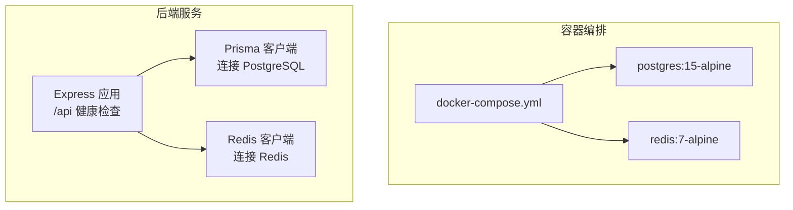
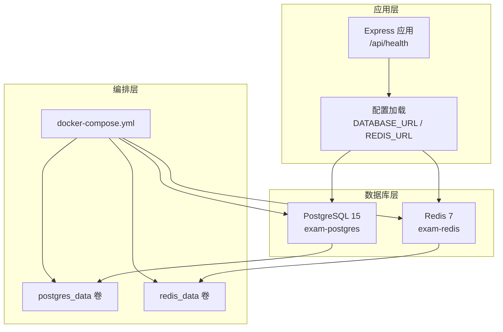
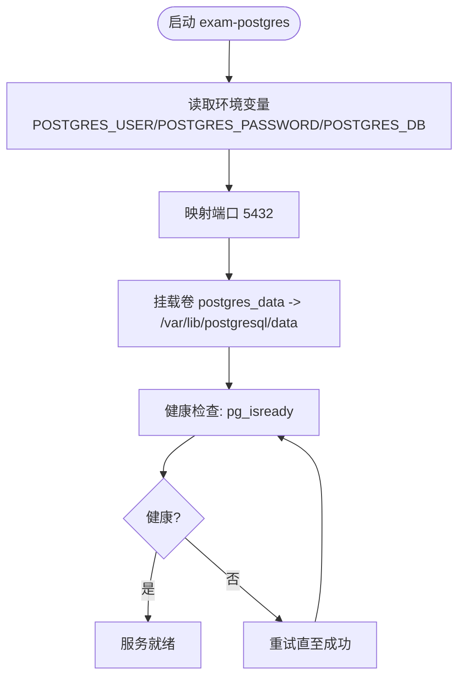
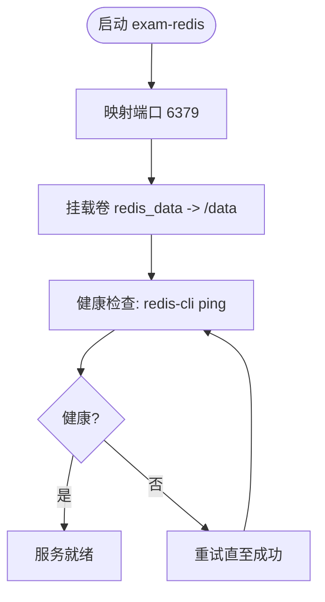
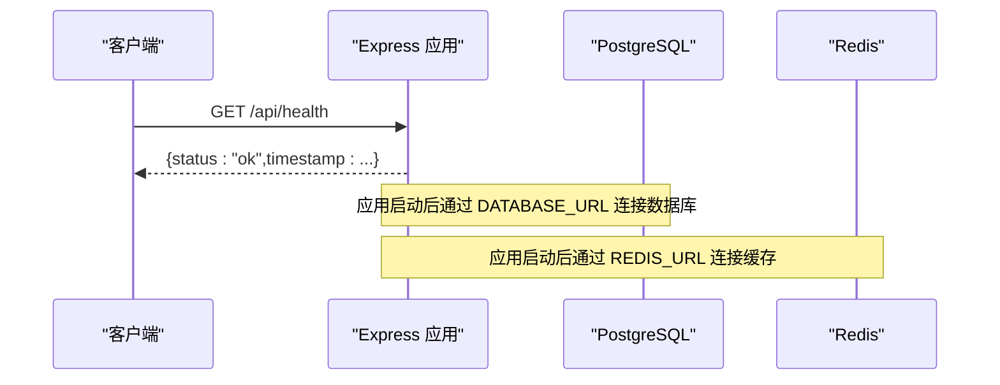
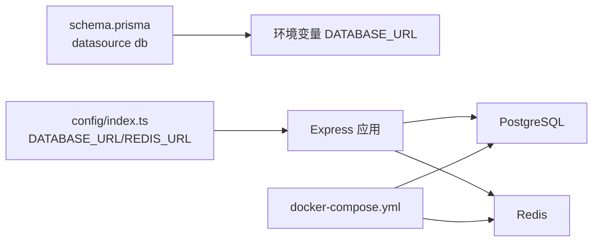

# 容器化部署

<cite>
**本文引用的文件**
- [docker-compose.yml](file://docker-compose.yml)
- [packages/server/src/config/index.ts](file://packages/server/src/config/index.ts)
- [packages/server/src/app.ts](file://packages/server/src/app.ts)
- [packages/server/prisma/schema.prisma](file://packages/server/prisma/schema.prisma)
- [packages/server/package.json](file://packages/server/package.json)
- [.gitignore](file://.gitignore)
</cite>

## 目录
1. [简介](#简介)
2. [项目结构](#项目结构)
3. [核心组件](#核心组件)
4. [架构总览](#架构总览)
5. [详细组件分析](#详细组件分析)
6. [依赖关系分析](#依赖关系分析)
7. [性能与资源优化](#性能与资源优化)
8. [故障排查指南](#故障排查指南)
9. [结论](#结论)
10. [附录](#附录)

## 简介
本指南围绕项目中的 docker-compose.yml 配置，系统性说明 PostgreSQL 和 Redis 的容器编排方式，涵盖环境变量、数据卷挂载、健康检查、网络映射以及本地与生产环境的差异化部署策略。同时提供容器生命周期管理（启动、停止、重启）、日志查看与调试方法，并给出资源限制与性能优化建议，帮助读者在不同环境中稳定运行该考试系统。

## 项目结构
该项目采用 Docker Compose 编排数据库与缓存服务，配合后端服务使用 Prisma 访问 PostgreSQL，使用 Redis 进行会话与任务队列等场景。前端通过代理访问后端 API。

图表来源
- [docker-compose.yml:1-37](file://docker-compose.yml#L1-L37)
- [packages/server/src/app.ts:15-43](file://packages/server/src/app.ts#L15-L43)
- [packages/server/prisma/schema.prisma:7-10](file://packages/server/prisma/schema.prisma#L7-L10)

章节来源
- [docker-compose.yml:1-37](file://docker-compose.yml#L1-L37)
- [packages/server/src/app.ts:15-43](file://packages/server/src/app.ts#L15-L43)
- [packages/server/prisma/schema.prisma:7-10](file://packages/server/prisma/schema.prisma#L7-L10)

## 核心组件
- PostgreSQL 数据库服务：提供持久化存储，承载用户、题目、考试、判分结果等业务数据。
- Redis 缓存/消息队列服务：用于会话、任务队列、临时状态等。
- 后端应用：提供 /api/health 健康检查接口，使用 Prisma 连接 PostgreSQL，使用 Redis 连接 Redis。

章节来源
- [docker-compose.yml:4-19](file://docker-compose.yml#L4-L19)
- [docker-compose.yml:21-32](file://docker-compose.yml#L21-L32)
- [packages/server/src/app.ts:22-25](file://packages/server/src/app.ts#L22-L25)
- [packages/server/prisma/schema.prisma:7-10](file://packages/server/prisma/schema.prisma#L7-L10)

## 架构总览
下图展示容器编排与后端服务的关系，以及健康检查与数据持久化的要点。

图表来源
- [docker-compose.yml:1-37](file://docker-compose.yml#L1-L37)
- [packages/server/src/config/index.ts:11-16](file://packages/server/src/config/index.ts#L11-L16)
- [packages/server/src/app.ts:22-25](file://packages/server/src/app.ts#L22-L25)

## 详细组件分析

### PostgreSQL 服务编排
- 镜像与容器名：使用官方 postgres:15-alpine 镜像，容器名为 exam-postgres。
- 环境变量：
  - POSTGRES_USER：数据库用户名
  - POSTGRES_PASSWORD：数据库密码
  - POSTGRES_DB：默认数据库名称
- 端口映射：将宿主机 5432 映射到容器 5432。
- 数据卷：挂载 postgres_data 到 /var/lib/postgresql/data，确保数据持久化。
- 健康检查：通过 pg_isready 检查数据库可用性，间隔与超时时间合理，重试次数适中。

图表来源
- [docker-compose.yml:4-19](file://docker-compose.yml#L4-L19)

章节来源
- [docker-compose.yml:4-19](file://docker-compose.yml#L4-L19)

### Redis 服务编排
- 镜像与容器名：使用官方 redis:7-alpine 镜像，容器名为 exam-redis。
- 端口映射：将宿主机 6379 映射到容器 6379。
- 数据卷：挂载 redis_data 到 /data，确保持久化。
- 健康检查：通过 redis-cli ping 检查，间隔与超时时间合理，重试次数适中。

图表来源
- [docker-compose.yml:21-32](file://docker-compose.yml#L21-L32)

章节来源
- [docker-compose.yml:21-32](file://docker-compose.yml#L21-L32)

### 后端应用与配置
- 健康检查端点：/api/health 返回状态与时间戳，便于外部监控。
- 数据库连接：通过 DATABASE_URL 环境变量连接 PostgreSQL。
- Redis 连接：通过 REDIS_URL 环境变量连接 Redis。
- 开发脚本：包含数据库迁移与种子数据脚本，便于初始化。

图表来源
- [packages/server/src/app.ts:22-25](file://packages/server/src/app.ts#L22-L25)
- [packages/server/src/config/index.ts:11-16](file://packages/server/src/config/index.ts#L11-L16)

章节来源
- [packages/server/src/app.ts:22-25](file://packages/server/src/app.ts#L22-L25)
- [packages/server/src/config/index.ts:11-16](file://packages/server/src/config/index.ts#L11-L16)
- [packages/server/package.json:5-11](file://packages/server/package.json#L5-L11)

## 依赖关系分析
- 数据库依赖：Prisma 在 schema.prisma 中声明使用 PostgreSQL，并从环境变量 DATABASE_URL 获取连接字符串。
- 应用依赖：后端应用通过配置模块读取 DATABASE_URL 与 REDIS_URL，分别连接 PostgreSQL 与 Redis。
- 编排依赖：docker-compose.yml 将数据库与缓存服务以独立容器运行，提供端口映射与数据卷持久化。

图表来源
- [packages/server/prisma/schema.prisma:7-10](file://packages/server/prisma/schema.prisma#L7-L10)
- [packages/server/src/config/index.ts:11-16](file://packages/server/src/config/index.ts#L11-L16)
- [docker-compose.yml:1-37](file://docker-compose.yml#L1-L37)

章节来源
- [packages/server/prisma/schema.prisma:7-10](file://packages/server/prisma/schema.prisma#L7-L10)
- [packages/server/src/config/index.ts:11-16](file://packages/server/src/config/index.ts#L11-L16)
- [docker-compose.yml:1-37](file://docker-compose.yml#L1-L37)

## 性能与资源优化
- 数据库性能
  - 使用官方精简镜像 postgres:15-alpine，减少镜像体积与启动时间。
  - 通过数据卷持久化避免容器重建导致的数据丢失。
  - 建议在生产环境为 PostgreSQL 设置合理的内存与连接池参数，结合数据库监控工具观察慢查询与锁等待。
- 缓存性能
  - 使用 redis:7-alpine，适合开发与小规模生产。
  - 建议在生产环境启用持久化策略（如 RDB 或 AOF），并根据业务量调整最大内存与淘汰策略。
- 健康检查
  - PostgreSQL 与 Redis 的健康检查间隔与超时已合理配置，可按实际负载微调重试次数与间隔。
- 网络与安全
  - 生产环境建议将数据库与缓存置于隔离网络，限制对外暴露端口，仅开放必要端口。
  - 使用强密码与最小权限原则配置数据库用户。

[本节为通用建议，不直接分析具体文件]

## 故障排查指南
- 健康检查失败
  - PostgreSQL：检查容器日志，确认环境变量是否正确；使用 pg_isready 命令验证数据库可用性。
  - Redis：检查容器日志，确认 redis-cli ping 是否返回 PONG。
- 数据卷问题
  - 若容器重启后数据丢失，检查 postgres_data 与 redis_data 卷是否正确挂载。
- 端口冲突
  - 若宿主机 5432 或 6379 已被占用，修改 docker-compose.yml 中的端口映射或释放端口。
- 应用无法连接数据库/缓存
  - 确认后端应用的 DATABASE_URL 与 REDIS_URL 环境变量指向正确的容器地址与端口。
  - 在同一 docker-compose 网络内，可使用服务名作为主机名（例如 postgres、redis）。
- 日志查看
  - 使用容器日志命令查看 PostgreSQL 与 Redis 的输出，定位异常。
  - 应用侧错误处理中间件会在开发模式下输出详细错误信息，便于定位问题。

章节来源
- [docker-compose.yml:15-19](file://docker-compose.yml#L15-L19)
- [docker-compose.yml:28-32](file://docker-compose.yml#L28-L32)
- [packages/server/src/config/index.ts:11-16](file://packages/server/src/config/index.ts#L11-L16)
- [packages/server/src/middleware/error-handler.ts:4-17](file://packages/server/src/middleware/error-handler.ts#L4-L17)

## 结论
通过 docker-compose.yml 对 PostgreSQL 与 Redis 的标准化编排，结合后端应用对环境变量的统一读取，能够快速搭建本地与生产环境。建议在生产环境中进一步完善网络隔离、持久化策略与资源限制，并建立完善的监控与告警机制，确保系统的稳定性与可维护性。

[本节为总结性内容，不直接分析具体文件]

## 附录

### 本地开发环境部署策略
- 使用 docker-compose 启动数据库与缓存服务。
- 在后端应用中设置 DATABASE_URL 与 REDIS_URL 指向本地容器（例如使用服务名与端口）。
- 通过健康检查端点 /api/health 验证服务可用性。
- 如需初始化数据库，可在后端工程中执行数据库迁移与种子数据脚本。

章节来源
- [docker-compose.yml:1-37](file://docker-compose.yml#L1-L37)
- [packages/server/src/app.ts:22-25](file://packages/server/src/app.ts#L22-L25)
- [packages/server/package.json:5-11](file://packages/server/package.json#L5-L11)

### 生产环境部署策略
- 将数据库与缓存置于隔离网络，限制对外暴露端口。
- 使用强密码与最小权限原则配置数据库用户。
- 启用持久化与备份策略，定期备份数据卷。
- 配置健康检查与监控告警，及时发现异常。
- 根据业务负载调整容器资源限制与并发连接数。

[本节为通用建议，不直接分析具体文件]

### 容器生命周期管理
- 启动：使用 docker-compose up -d 启动所有服务。
- 停止：使用 docker-compose down 停止并移除容器。
- 重启：使用 docker-compose restart 重启指定服务或全部服务。
- 查看日志：使用 docker-compose logs -f 查看实时日志。

[本节为通用操作说明，不直接分析具体文件]

### 环境变量与配置要点
- 数据库连接：DATABASE_URL 由后端配置模块读取，Prisma schema 中声明数据源为 PostgreSQL。
- Redis 连接：REDIS_URL 由后端配置模块读取，用于连接 Redis。
- 健康检查：后端应用提供 /api/health 接口，便于外部监控。

章节来源
- [packages/server/src/config/index.ts:11-16](file://packages/server/src/config/index.ts#L11-L16)
- [packages/server/prisma/schema.prisma:7-10](file://packages/server/prisma/schema.prisma#L7-L10)
- [packages/server/src/app.ts:22-25](file://packages/server/src/app.ts#L22-L25)