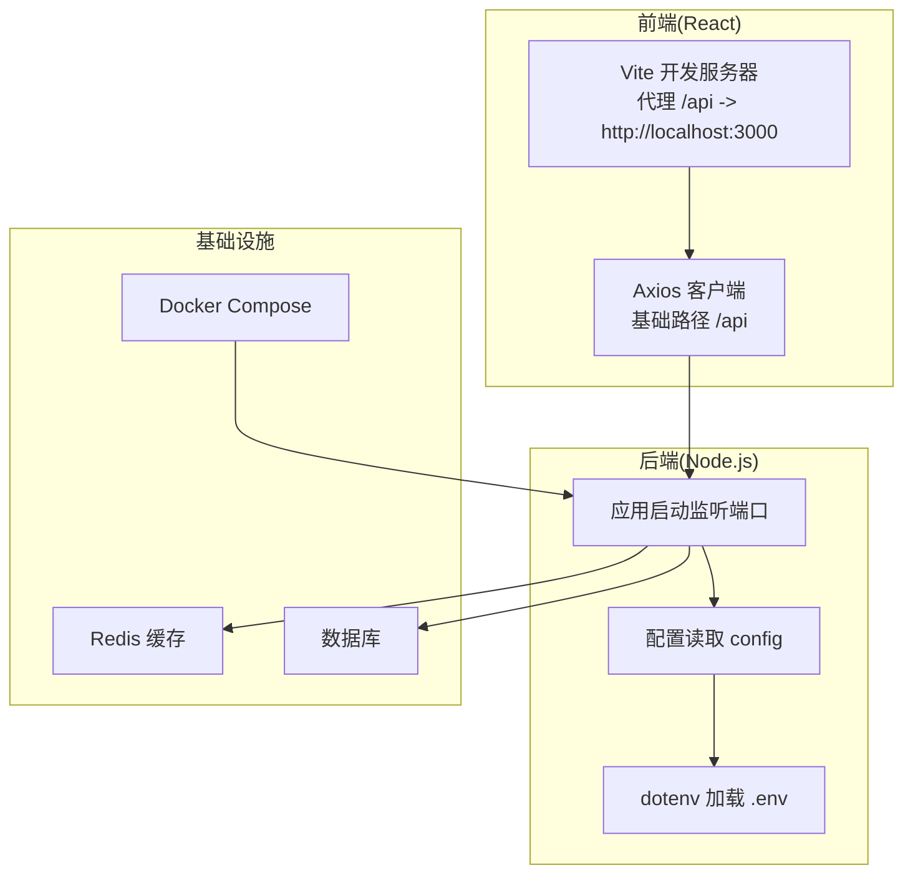
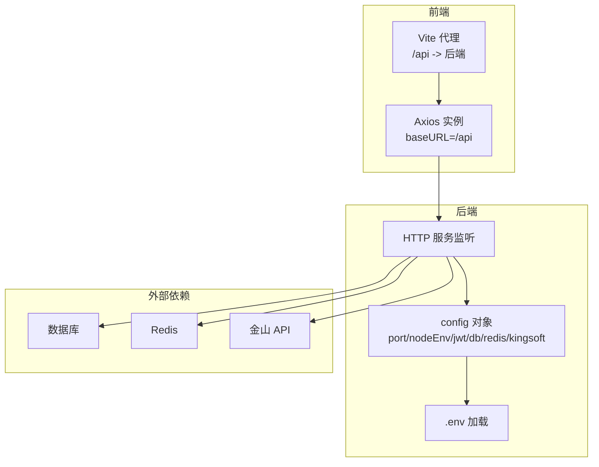
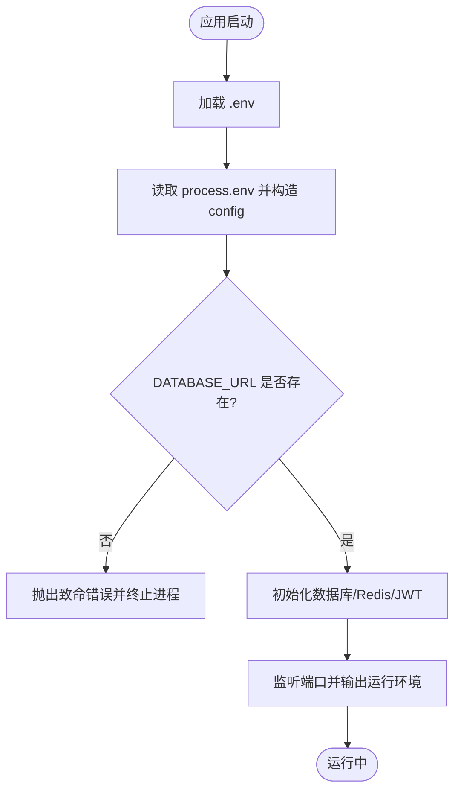
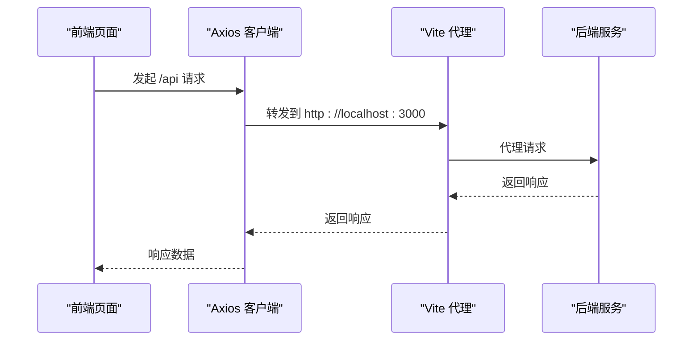
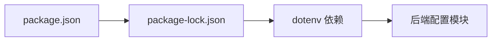

# 环境配置

<cite>
**本文引用的文件**
- [packages/server/src/config/index.ts](file://packages/server/src/config/index.ts)
- [packages/server/src/index.ts](file://packages/server/src/index.ts)
- [packages/client/vite.config.ts](file://packages/client/vite.config.ts)
- [packages/client/src/services/api.ts](file://packages/client/src/services/api.ts)
- [package.json](file://package.json)
- [package-lock.json](file://package-lock.json)
- [docker-compose.yml](file://docker-compose.yml)
</cite>

## 目录
1. [简介](#简介)
2. [项目结构](#项目结构)
3. [核心组件](#核心组件)
4. [架构总览](#架构总览)
5. [详细组件分析](#详细组件分析)
6. [依赖分析](#依赖分析)
7. [性能考虑](#性能考虑)
8. [故障排查指南](#故障排查指南)
9. [结论](#结论)
10. [附录](#附录)

## 简介
本指南聚焦于该考试系统在不同运行环境下的“环境配置”，涵盖后端服务的环境变量定义与加载、前端代理与构建行为、以及容器化编排中的环境注入方式。文档将明确生产环境所需的关键变量（如数据库连接、Redis、JWT 密钥、第三方 API 凭据），对比开发/测试/生产的配置差异与切换方法，并给出安全配置最佳实践、版本管理与变更控制建议，以及配置验证与常见问题排查步骤。

## 项目结构
该项目采用多包结构（monorepo），包含前端客户端与后端服务两部分，配合 Vite 开发服务器与 Docker Compose 进行本地与容器化部署。后端通过 dotenv 加载环境变量；前端通过 Vite 的代理将 /api 请求转发至后端；生产部署可借助 docker-compose 注入环境变量。

图表来源
- [packages/client/vite.config.ts:12-20](file://packages/client/vite.config.ts#L12-L20)
- [packages/client/src/services/api.ts:3-6](file://packages/client/src/services/api.ts#L3-L6)
- [packages/server/src/config/index.ts:1-22](file://packages/server/src/config/index.ts#L1-L22)
- [packages/server/src/index.ts:10-12](file://packages/server/src/index.ts#L10-L12)
- [docker-compose.yml](file://docker-compose.yml)

章节来源
- [packages/client/vite.config.ts:1-21](file://packages/client/vite.config.ts#L1-L21)
- [packages/client/src/services/api.ts:1-32](file://packages/client/src/services/api.ts#L1-L32)
- [packages/server/src/config/index.ts:1-22](file://packages/server/src/config/index.ts#L1-L22)
- [packages/server/src/index.ts:1-21](file://packages/server/src/index.ts#L1-L21)
- [docker-compose.yml](file://docker-compose.yml)

## 核心组件
- 环境变量加载：后端通过 dotenv 在应用启动时加载 .env 文件，随后从 process.env 中读取配置项。
- 配置对象：统一导出 config 对象，包含端口、运行环境、JWT、数据库、Redis、第三方 API 等字段。
- 前端代理：Vite 将 /api 前缀请求代理到后端地址，便于开发阶段联调。
- 应用启动：后端监听配置的端口并在控制台输出当前运行环境标识。

章节来源
- [packages/server/src/config/index.ts:1-22](file://packages/server/src/config/index.ts#L1-L22)
- [packages/server/src/index.ts:10-12](file://packages/server/src/index.ts#L10-L12)
- [packages/client/vite.config.ts:12-20](file://packages/client/vite.config.ts#L12-L20)

## 架构总览
下图展示了前后端与外部依赖之间的关系，以及环境变量在各层的使用位置。

图表来源
- [packages/client/src/services/api.ts:3-6](file://packages/client/src/services/api.ts#L3-L6)
- [packages/client/vite.config.ts:12-20](file://packages/client/vite.config.ts#L12-L20)
- [packages/server/src/config/index.ts:4-22](file://packages/server/src/config/index.ts#L4-L22)
- [packages/server/src/index.ts:10-12](file://packages/server/src/index.ts#L10-L12)

## 详细组件分析

### 后端环境配置模块
- dotenv 初始化：在入口处加载 .env 文件，使 process.env 可用。
- 关键配置项：
  - 服务端口与运行环境：port、nodeEnv
  - JWT：secret、expiresIn
  - 数据库：DATABASE_URL（必填）
  - Redis：REDIS_URL（默认本地）
  - 第三方接口：KINGSOFT_API_BASE_URL、KINGSOFT_API_KEY、KINGSOFT_API_SECRET
- 生产注意事项：
  - DATABASE_URL 必须指向生产数据库实例
  - REDIS_URL 指向生产缓存集群
  - JWT 密钥应足够随机且定期轮换
  - KINGSOFT_* 凭据仅在需要对接时启用

图表来源
- [packages/server/src/config/index.ts:1-22](file://packages/server/src/config/index.ts#L1-L22)
- [packages/server/src/index.ts:10-12](file://packages/server/src/index.ts#L10-L12)

章节来源
- [packages/server/src/config/index.ts:1-22](file://packages/server/src/config/index.ts#L1-L22)

### 前端代理与 API 客户端
- Vite 代理：开发时将 /api 转发到后端地址，避免跨域与 CORS 处理。
- Axios 客户端：固定 baseURL=/api，自动附加本地存储的 token，处理 401 统一跳转登录。

图表来源
- [packages/client/vite.config.ts:12-20](file://packages/client/vite.config.ts#L12-L20)
- [packages/client/src/services/api.ts:3-6](file://packages/client/src/services/api.ts#L3-L6)

章节来源
- [packages/client/vite.config.ts:1-21](file://packages/client/vite.config.ts#L1-L21)
- [packages/client/src/services/api.ts:1-32](file://packages/client/src/services/api.ts#L1-L32)

### 容器化与环境注入
- docker-compose.yml 用于编排后端服务及依赖（数据库、Redis 等），可在其中注入环境变量或挂载 .env 文件。
- 建议将敏感变量通过环境变量注入，避免硬编码在镜像中。

章节来源
- [docker-compose.yml](file://docker-compose.yml)

## 依赖分析
- dotenv：用于加载 .env 文件，使 process.env 可用。
- 项目脚本与依赖：package.json 与 package-lock.json 描述了项目依赖树，dotenv 作为开发/运行期依赖被安装。

图表来源
- [package.json](file://package.json)
- [package-lock.json:2563-2574](file://package-lock.json#L2563-L2574)
- [packages/server/src/config/index.ts:1-2](file://packages/server/src/config/index.ts#L1-L2)

章节来源
- [package.json](file://package.json)
- [package-lock.json:2563-2574](file://package-lock.json#L2563-L2574)
- [packages/server/src/config/index.ts:1-2](file://packages/server/src/config/index.ts#L1-L2)

## 性能考虑
- 环境变量读取为常量时间操作，对启动与运行时性能影响极小。
- 建议在生产环境将敏感变量以只读方式注入容器，避免频繁重启带来的抖动。
- 使用独立的 .env.prod/.env.staging/.env.dev 文件，结合 CI/CD 的环境矩阵进行差异化部署。

## 故障排查指南
- 启动失败（数据库连接）：
  - 现象：进程启动即退出或报数据库连接错误
  - 排查：确认 DATABASE_URL 已正确注入；检查网络连通性与凭据
  - 参考：[packages/server/src/config/index.ts:11-13](file://packages/server/src/config/index.ts#L11-L13)
- JWT 认证异常：
  - 现象：登录成功但后续接口返回 401
  - 排查：确认 JWT_SECRET 一致且未过期；检查前端是否正确携带 Authorization 头
  - 参考：[packages/client/src/services/api.ts:8-15](file://packages/client/src/services/api.ts#L8-L15)
- Redis 连接失败：
  - 现象：缓存相关功能不可用
  - 排查：确认 REDIS_URL 正确；检查网络策略与防火墙
  - 参考：[packages/server/src/config/index.ts:14-16](file://packages/server/src/config/index.ts#L14-L16)
- 第三方 API 无法访问：
  - 现象：对接金山 API 的功能失败
  - 排查：核对 KINGSOFT_API_BASE_URL、KINGSOFT_API_KEY、KINGSOFT_API_SECRET 是否齐全
  - 参考：[packages/server/src/config/index.ts:17-21](file://packages/server/src/config/index.ts#L17-L21)
- 开发代理无效：
  - 现象：前端 /api 请求 404 或跨域
  - 排查：确认 Vite 代理配置指向正确的后端地址
  - 参考：[packages/client/vite.config.ts:12-20](file://packages/client/vite.config.ts#L12-L20)

章节来源
- [packages/server/src/config/index.ts:11-21](file://packages/server/src/config/index.ts#L11-L21)
- [packages/client/src/services/api.ts:8-15](file://packages/client/src/services/api.ts#L8-L15)
- [packages/client/vite.config.ts:12-20](file://packages/client/vite.config.ts#L12-L20)

## 结论
本项目通过 dotenv 将环境变量集中管理，并在后端统一导出配置对象供各模块使用。前端通过 Vite 代理简化开发联调。生产部署建议使用 docker-compose 注入环境变量，严格区分开发/测试/生产三套配置，确保敏感信息不泄露。遵循本文的安全与变更控制建议，可显著提升系统的稳定性与安全性。

## 附录

### 环境变量清单与用途
- NODE_ENV：运行环境标识（development/test/production）
- PORT：后端监听端口
- JWT_SECRET：JWT 签名密钥
- JWT_EXPIRES_IN：JWT 过期间隔
- DATABASE_URL：数据库连接字符串（生产必须）
- REDIS_URL：Redis 连接字符串（默认本地）
- KINGSOFT_API_BASE_URL：第三方 API 基础地址
- KINGSOFT_API_KEY：第三方 API Key
- KINGSOFT_API_SECRET：第三方 API Secret

章节来源
- [packages/server/src/config/index.ts:5-21](file://packages/server/src/config/index.ts#L5-L21)

### 不同环境的配置差异与切换
- 开发环境（local）：
  - 使用本地 Redis 与数据库
  - JWT 密钥可使用默认值，便于快速启动
  - Vite 代理到本地后端
- 测试环境（staging）：
  - 使用隔离的测试数据库与 Redis
  - JWT 密钥与生产保持一致但独立管理
- 生产环境（production）：
  - 所有敏感变量通过环境注入
  - REDIS_URL 指向生产缓存集群
  - DATABASE_URL 指向生产数据库实例

章节来源
- [packages/server/src/config/index.ts:5-21](file://packages/server/src/config/index.ts#L5-L21)
- [packages/client/vite.config.ts:12-20](file://packages/client/vite.config.ts#L12-L20)

### 安全配置最佳实践
- 敏感信息保护：
  - 使用环境变量而非代码内嵌
  - 通过 CI/CD 的密文变量管理敏感值
  - 定期轮换 JWT_SECRET 与第三方 API 密钥
- 访问控制：
  - 限制数据库与 Redis 的网络访问范围
  - 为不同环境设置独立的 IAM 角色与访问策略
- 日志与监控：
  - 避免在日志中打印敏感变量
  - 通过指标与告警监控配置变更与异常

### 配置文件版本管理与变更控制
- 版本管理：
  - 将 .env.* 文件纳入版本控制，但仅保留示例与差异说明
  - 使用 .gitignore 排除真实敏感 .env 文件
- 变更控制：
  - 通过 Pull Request 审批后合并配置变更
  - 在 CI 中增加配置校验步骤（如变量存在性检查）
- 环境矩阵：
  - 在 CI 中为 dev/stage/prod 分别注入对应 .env 文件
  - 使用 docker-compose 的 env_file 字段加载环境变量

章节来源
- [docker-compose.yml](file://docker-compose.yml)