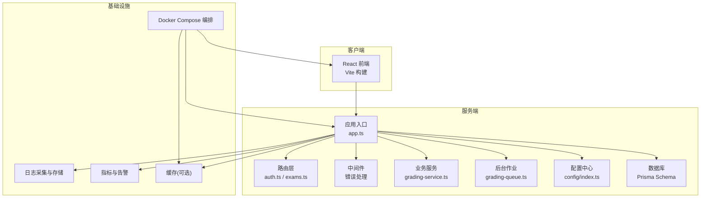
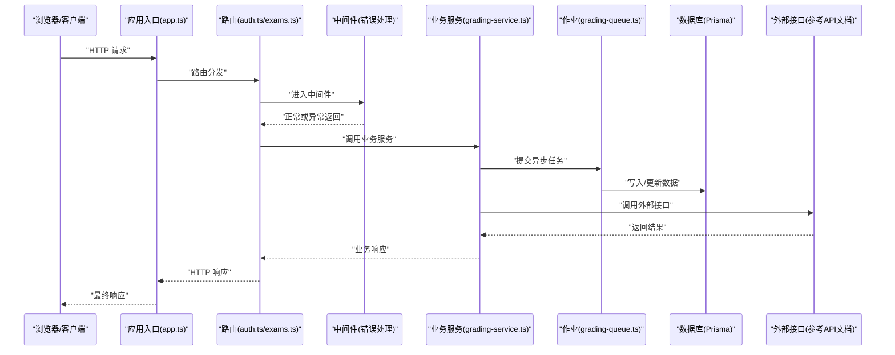
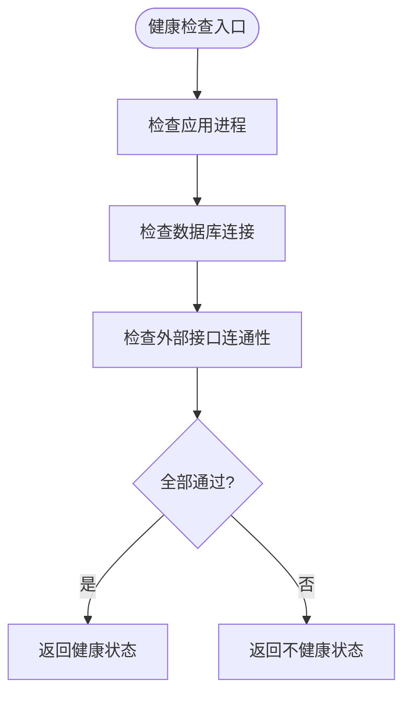
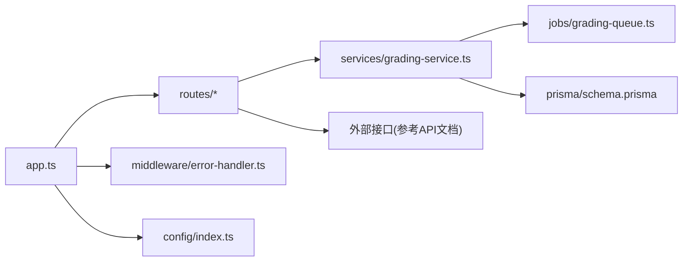

# 监控维护

<cite>
**本文引用的文件**
- [docker-compose.yml](file://docker-compose.yml)
- [server/package.json](file://packages/server/package.json)
- [server/src/app.ts](file://packages/server/src/app.ts)
- [server/src/config/index.ts](file://packages/server/src/config/index.ts)
- [server/src/middleware/error-handler.ts](file://packages/server/src/middleware/error-handler.ts)
- [server/src/routes/auth.ts](file://packages/server/src/routes/auth.ts)
- [server/src/routes/exams.ts](file://packages/server/src/routes/exams.ts)
- [server/prisma/schema.prisma](file://packages/server/prisma/schema.prisma)
- [server/src/jobs/grading-queue.ts](file://packages/server/src/jobs/grading-queue.ts)
- [server/src/services/grading-service.ts](file://packages/server/src/services/grading-service.ts)
- [client/package.json](file://packages/client/package.json)
- [client/vite.config.ts](file://packages/client/vite.config.ts)
- [docs/kingsoft-api-reference.md](file://docs/kingsoft-api-reference.md)
</cite>

## 目录
1. [简介](#简介)
2. [项目结构](#项目结构)
3. [核心组件](#核心组件)
4. [架构总览](#架构总览)
5. [详细组件分析](#详细组件分析)
6. [依赖关系分析](#依赖关系分析)
7. [性能考量](#性能考量)
8. [故障排查指南](#故障排查指南)
9. [结论](#结论)
10. [附录](#附录)

## 简介
本指南面向考试系统的运维与开发团队，围绕应用健康检查、性能指标监控与告警、日志收集与分析、数据库与缓存监控、系统资源监控、定期维护任务（日志清理、缓存清理、数据库优化）、故障检测与自动恢复、手动干预流程以及监控工具配置与自定义指标设置，提供可落地的实施方案与最佳实践。文档基于仓库现有代码与配置进行分析，并结合通用监控体系给出建议。

## 项目结构
项目采用前后端分离的多包结构，后端使用 TypeScript + Express 风格的服务端框架，数据库通过 Prisma 管理；前端为 React 应用，构建工具为 Vite。容器编排通过 Docker Compose 实现，便于本地与生产环境的一致化部署与监控集成。

图表来源
- [server/src/app.ts](file://packages/server/src/app.ts)
- [server/src/routes/auth.ts](file://packages/server/src/routes/auth.ts)
- [server/src/routes/exams.ts](file://packages/server/src/routes/exams.ts)
- [server/src/middleware/error-handler.ts](file://packages/server/src/middleware/error-handler.ts)
- [server/src/services/grading-service.ts](file://packages/server/src/services/grading-service.ts)
- [server/src/jobs/grading-queue.ts](file://packages/server/src/jobs/grading-queue.ts)
- [server/src/config/index.ts](file://packages/server/src/config/index.ts)
- [server/prisma/schema.prisma](file://packages/server/prisma/schema.prisma)
- [docker-compose.yml](file://docker-compose.yml)

章节来源
- [docker-compose.yml](file://docker-compose.yml)
- [server/src/app.ts](file://packages/server/src/app.ts)
- [client/vite.config.ts](file://packages/client/vite.config.ts)

## 核心组件
- 应用入口与路由：应用启动与路由分发位于服务端入口文件，负责承载认证、考试、统计等业务路由。
- 中间件：统一错误处理中间件用于捕获异常并输出标准化响应，是健康检查与日志采集的关键节点。
- 业务服务与作业：评分服务与评分队列构成异步处理链路，涉及数据库写入与外部接口调用，是性能与可用性监控的重点对象。
- 数据库与配置：Prisma Schema 定义数据模型，配置模块集中管理运行时参数，二者影响系统稳定性与可观测性。

章节来源
- [server/src/app.ts](file://packages/server/src/app.ts)
- [server/src/middleware/error-handler.ts](file://packages/server/src/middleware/error-handler.ts)
- [server/src/routes/auth.ts](file://packages/server/src/routes/auth.ts)
- [server/src/routes/exams.ts](file://packages/server/src/routes/exams.ts)
- [server/src/services/grading-service.ts](file://packages/server/src/services/grading-service.ts)
- [server/src/jobs/grading-queue.ts](file://packages/server/src/jobs/grading-queue.ts)
- [server/prisma/schema.prisma](file://packages/server/prisma/schema.prisma)
- [server/src/config/index.ts](file://packages/server/src/config/index.ts)

## 架构总览
下图展示从客户端到服务端、数据库与外部系统的交互路径，以及监控点位的建议落点。

图表来源
- [server/src/app.ts](file://packages/server/src/app.ts)
- [server/src/routes/auth.ts](file://packages/server/src/routes/auth.ts)
- [server/src/routes/exams.ts](file://packages/server/src/routes/exams.ts)
- [server/src/middleware/error-handler.ts](file://packages/server/src/middleware/error-handler.ts)
- [server/src/services/grading-service.ts](file://packages/server/src/services/grading-service.ts)
- [server/src/jobs/grading-queue.ts](file://packages/server/src/jobs/grading-queue.ts)
- [server/prisma/schema.prisma](file://packages/server/prisma/schema.prisma)
- [docs/kingsoft-api-reference.md](file://docs/kingsoft-api-reference.md)

## 详细组件分析

### 健康检查与运行状态
- 推荐在应用入口暴露健康检查端点，返回应用、数据库连接、外部服务连通性等状态。
- 结合容器编排的健康探针，实现自动重启与滚动更新。
- 在中间件中记录请求耗时与异常次数，作为健康度的辅助指标。

图表来源
- [server/src/app.ts](file://packages/server/src/app.ts)
- [server/src/middleware/error-handler.ts](file://packages/server/src/middleware/error-handler.ts)
- [server/prisma/schema.prisma](file://packages/server/prisma/schema.prisma)
- [docs/kingsoft-api-reference.md](file://docs/kingsoft-api-reference.md)

章节来源
- [server/src/app.ts](file://packages/server/src/app.ts)
- [server/src/middleware/error-handler.ts](file://packages/server/src/middleware/error-handler.ts)

### 性能指标监控与告警
- 指标类型建议：
  - 响应时间与吞吐量：按路由维度统计 P50/P95/P99。
  - 错误率与异常分布：区分业务异常与系统异常。
  - 资源占用：CPU、内存、线程数、GC 次数与停顿时间。
  - 数据库指标：查询延迟、慢查询、连接池使用率。
  - 外部接口指标：调用耗时、成功率、超时率。
- 告警阈值建议：
  - 响应时间 P99 > 阈值持续 N 分钟。
  - 错误率 > 阈值 或 异常突增。
  - 数据库连接池空闲/等待超时。
  - 外部接口超时率 > 阈值。
- 可视化：仪表盘展示趋势与分布，支持按角色/场景筛选。

章节来源
- [server/src/routes/auth.ts](file://packages/server/src/routes/auth.ts)
- [server/src/routes/exams.ts](file://packages/server/src/routes/exams.ts)
- [server/src/services/grading-service.ts](file://packages/server/src/services/grading-service.ts)
- [server/src/jobs/grading-queue.ts](file://packages/server/src/jobs/grading-queue.ts)
- [server/prisma/schema.prisma](file://packages/server/prisma/schema.prisma)

### 日志收集、分析与存储
- 日志采集：
  - 应用日志：标准输出/标准错误，由容器平台统一收集。
  - 访问日志：在中间件中记录请求方法、路径、状态码、耗时、用户标识等。
  - 错误日志：捕获异常堆栈与上下文信息。
- 日志分析：
  - 关键词检索：IP、用户ID、异常类型、路由路径。
  - 统计分析：错误TopN、慢请求TopN、接口访问热力图。
- 存储策略：
  - 本地保留短期（如7天），远端归档长期（如1年）。
  - 压缩与轮转，避免单文件过大。
  - 保留合规与审计所需的最小必要信息。

章节来源
- [server/src/middleware/error-handler.ts](file://packages/server/src/middleware/error-handler.ts)

### 数据库监控（Prisma）
- 连接池监控：活跃连接数、等待连接数、最大连接数、超时次数。
- 查询性能：慢查询阈值与数量、重复索引扫描、锁等待。
- 模式变更：迁移执行时间、失败回滚、版本一致性。
- 建议措施：
  - 启用慢查询日志与分析器。
  - 对高频查询建立合适索引。
  - 定期执行数据库维护任务（统计信息更新、碎片整理）。

章节来源
- [server/prisma/schema.prisma](file://packages/server/prisma/schema.prisma)

### Redis 性能监控（可选）
- 若系统使用 Redis 缓存或会话存储，建议监控：
  - 内存使用率与淘汰策略命中率。
  - 命令耗时分布与阻塞命令。
  - 连接数与带宽。
- 告警阈值：内存使用率 > 阈值、阻塞命令堆积、连接池耗尽。

章节来源
- [docker-compose.yml](file://docker-compose.yml)

### 系统资源监控
- CPU：平均使用率、峰值、负载均衡。
- 内存：RSS、GC 前后差异、交换使用。
- 磁盘：I/O 吞吐、队列长度、空间剩余。
- 网络：连接数、并发请求数、丢包率。
- 建议：结合容器平台的资源配额与限制，设置弹性扩缩容阈值。

章节来源
- [docker-compose.yml](file://docker-compose.yml)

### 定期维护任务
- 日志清理：按保留策略删除过期日志，压缩历史日志。
- 缓存清理：定期失效过期键、清理冷数据、重建热点键。
- 数据库优化：重建索引、更新统计信息、执行分区维护（如有分区）。
- 版本与补丁：定期评估并应用安全补丁与依赖升级。

章节来源
- [server/prisma/schema.prisma](file://packages/server/prisma/schema.prisma)

### 故障检测、自动恢复与手动干预
- 自动恢复：
  - 容器健康探针失败时自动重启。
  - 数据库断连时启用重试与熔断，超时后快速失败。
  - 外部接口超时触发降级（如离线评分）。
- 手动干预：
  - 快速定位：根据日志与指标定位异常路由与服务实例。
  - 回滚：回退到上一个稳定版本或数据库迁移。
  - 限流与熔断：临时降低外部依赖调用量，保护核心链路。
  - 人工介入：暂停高风险作业、释放阻塞资源。

章节来源
- [server/src/middleware/error-handler.ts](file://packages/server/src/middleware/error-handler.ts)
- [server/src/services/grading-service.ts](file://packages/server/src/services/grading-service.ts)
- [server/src/jobs/grading-queue.ts](file://packages/server/src/jobs/grading-queue.ts)

### 监控工具配置与自定义指标
- 工具选择：Prometheus + Grafana（指标与可视化）、ELK/EFK（日志）、APM（如 Jaeger/Zipkin，可选）。
- 配置要点：
  - 指标导出：在应用中暴露指标端点，按路由、异常类型、数据库操作分类。
  - 告警规则：基于 PromQL 编写，结合业务 SLA 设置阈值。
  - 可视化面板：仪表盘包含健康总览、路由性能、数据库与外部接口状态。
- 自定义指标：
  - 业务指标：评分完成数、待评分任务数、异常评分比例。
  - 运行指标：队列积压、作业耗时、缓存命中率。

章节来源
- [server/src/app.ts](file://packages/server/src/app.ts)
- [server/src/routes/exams.ts](file://packages/server/src/routes/exams.ts)
- [server/src/services/grading-service.ts](file://packages/server/src/services/grading-service.ts)
- [server/src/jobs/grading-queue.ts](file://packages/server/src/jobs/grading-queue.ts)

## 依赖关系分析
- 服务端依赖关系：
  - 应用入口依赖路由、中间件、配置与服务。
  - 业务服务依赖作业与数据库。
  - 路由依赖中间件以保证统一的错误处理与日志记录。
- 外部依赖：
  - 外部接口调用需纳入监控与告警范围。
  - 数据库依赖 Prisma 管理，需关注迁移与性能。

图表来源
- [server/src/app.ts](file://packages/server/src/app.ts)
- [server/src/routes/auth.ts](file://packages/server/src/routes/auth.ts)
- [server/src/routes/exams.ts](file://packages/server/src/routes/exams.ts)
- [server/src/middleware/error-handler.ts](file://packages/server/src/middleware/error-handler.ts)
- [server/src/services/grading-service.ts](file://packages/server/src/services/grading-service.ts)
- [server/src/jobs/grading-queue.ts](file://packages/server/src/jobs/grading-queue.ts)
- [server/prisma/schema.prisma](file://packages/server/prisma/schema.prisma)
- [docs/kingsoft-api-reference.md](file://docs/kingsoft-api-reference.md)

章节来源
- [server/src/app.ts](file://packages/server/src/app.ts)
- [server/src/middleware/error-handler.ts](file://packages/server/src/middleware/error-handler.ts)
- [server/src/routes/auth.ts](file://packages/server/src/routes/auth.ts)
- [server/src/routes/exams.ts](file://packages/server/src/routes/exams.ts)
- [server/src/services/grading-service.ts](file://packages/server/src/services/grading-service.ts)
- [server/src/jobs/grading-queue.ts](file://packages/server/src/jobs/grading-queue.ts)
- [server/prisma/schema.prisma](file://packages/server/prisma/schema.prisma)
- [docs/kingsoft-api-reference.md](file://docs/kingsoft-api-reference.md)

## 性能考量
- 路由与中间件：确保中间件无阻塞逻辑，避免在错误处理中引入额外 IO。
- 业务服务：对数据库写入批量化、对高频查询使用缓存与索引。
- 异步作业：合理设置队列大小与并发度，防止内存与数据库压力过大。
- 外部接口：设置超时与重试策略，避免雪崩效应。

章节来源
- [server/src/middleware/error-handler.ts](file://packages/server/src/middleware/error-handler.ts)
- [server/src/services/grading-service.ts](file://packages/server/src/services/grading-service.ts)
- [server/src/jobs/grading-queue.ts](file://packages/server/src/jobs/grading-queue.ts)

## 故障排查指南
- 快速定位：
  - 查看健康检查端点与容器日志。
  - 检查数据库连接与慢查询日志。
  - 审核外部接口调用状态与超时情况。
- 常见问题：
  - 响应时间升高：检查路由热点、数据库索引缺失、缓存未命中。
  - 错误率上升：定位异常路由与业务服务，查看错误日志与堆栈。
  - 评分作业积压：检查队列并发与数据库写入性能。
- 恢复步骤：
  - 临时降级非关键功能。
  - 重启不稳定实例或回滚最近变更。
  - 清理缓存与重建索引。

章节来源
- [server/src/app.ts](file://packages/server/src/app.ts)
- [server/src/middleware/error-handler.ts](file://packages/server/src/middleware/error-handler.ts)
- [server/src/services/grading-service.ts](file://packages/server/src/services/grading-service.ts)
- [server/src/jobs/grading-queue.ts](file://packages/server/src/jobs/grading-queue.ts)
- [server/prisma/schema.prisma](file://packages/server/prisma/schema.prisma)

## 结论
通过在应用入口、路由、中间件、业务服务与数据库层面建立完善的健康检查、性能指标与日志体系，并结合容器编排与外部监控工具，可以有效保障系统的稳定性与可维护性。建议优先落地健康检查与日志采集，再逐步完善指标与告警，最后形成自动化运维闭环。

## 附录
- 外部接口参考：可结合 API 文档对接口行为进行监控与告警。
- 容器编排：利用 Compose 文件统一管理服务与资源，便于监控与扩容。

章节来源
- [docs/kingsoft-api-reference.md](file://docs/kingsoft-api-reference.md)
- [docker-compose.yml](file://docker-compose.yml)