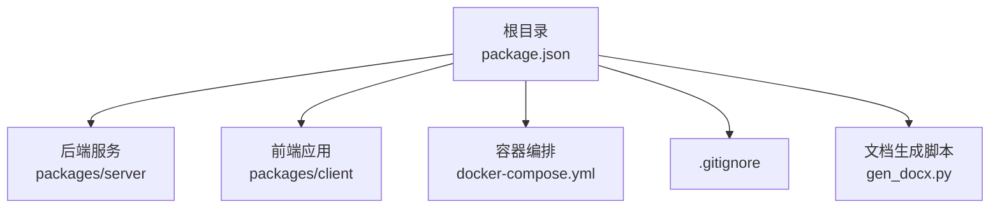
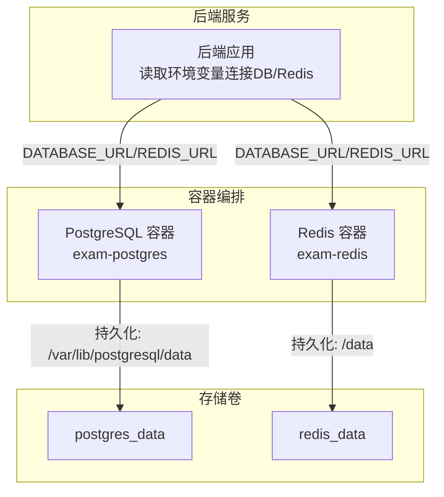
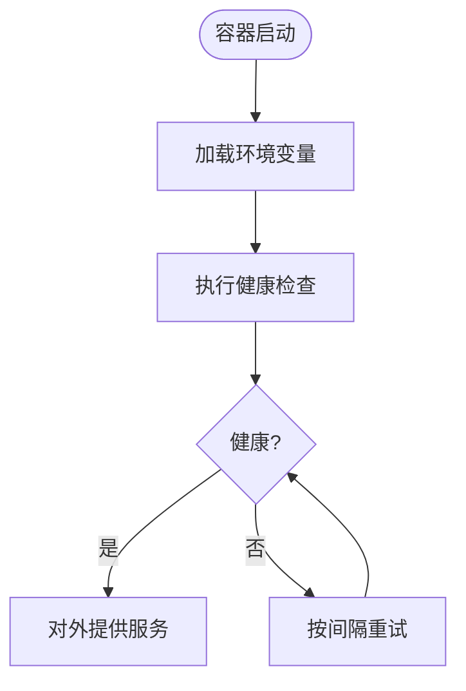
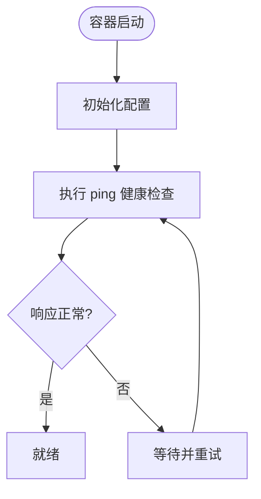
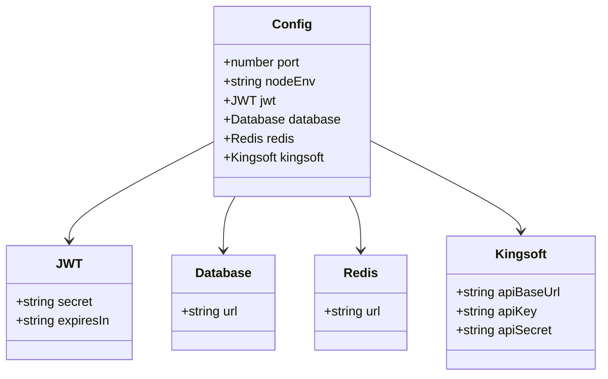
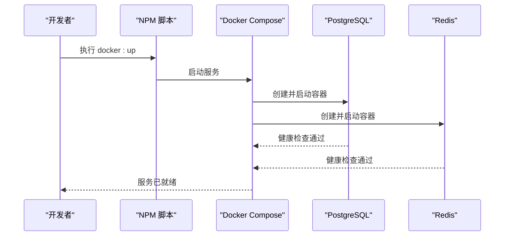
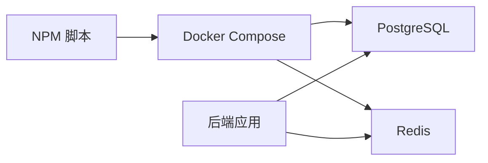

# 部署运维

<cite>
**本文引用的文件**
- [docker-compose.yml](file://docker-compose.yml)
- [package.json](file://package.json)
- [.gitignore](file://.gitignore)
- [packages/server/src/config/index.ts](file://packages/server/src/config/index.ts)
- [gen_docx.py](file://gen_docx.py)
</cite>

## 目录
1. [简介](#简介)
2. [项目结构](#项目结构)
3. [核心组件](#核心组件)
4. [架构总览](#架构总览)
5. [详细组件分析](#详细组件分析)
6. [依赖关系分析](#依赖关系分析)
7. [性能考虑](#性能考虑)
8. [故障排除指南](#故障排除指南)
9. [结论](#结论)
10. [附录](#附录)

## 简介
本指南面向考试系统的部署与运维，围绕 Docker 容器化编排展开，覆盖 PostgreSQL 与 Redis 的服务编排、生产环境配置与安全加固、系统监控与日志管理、性能调优、数据备份与灾难恢复、系统升级流程、负载均衡与反向代理、SSL 证书配置以及故障排除与最佳实践。文档基于仓库现有配置与脚本，结合实际工程落地建议，帮助团队在生产环境中稳定运行系统。

## 项目结构
项目采用 Monorepo 结构，根目录通过 NPM Workspaces 管理前后端子包；数据库与缓存通过 Docker Compose 编排；开发与运维常用命令集中在根级脚本中。

**图表来源**
- [package.json:1-26](file://package.json#L1-L26)
- [docker-compose.yml:1-37](file://docker-compose.yml#L1-L37)
- [.gitignore:1-11](file://.gitignore#L1-L11)
- [gen_docx.py:509-536](file://gen_docx.py#L509-L536)

**章节来源**
- [package.json:1-26](file://package.json#L1-L26)
- [gen_docx.py:509-536](file://gen_docx.py#L509-L536)

## 核心组件
- 数据库服务：PostgreSQL 15（Alpine 版本），持久化卷映射，健康检查，暴露 5432 端口。
- 缓存服务：Redis 7（Alpine 版本），持久化卷映射，健康检查，暴露 6379 端口。
- 后端配置：通过环境变量加载，支持 JWT 密钥、数据库连接、Redis 连接、第三方接口参数等。
- 开发与运维脚本：根级 NPM 脚本提供一键启动/停止容器、数据库迁移、种子数据、Prisma Studio 等能力。

**章节来源**
- [docker-compose.yml:1-37](file://docker-compose.yml#L1-L37)
- [packages/server/src/config/index.ts:1-22](file://packages/server/src/config/index.ts#L1-L22)
- [package.json:6-16](file://package.json#L6-L16)

## 架构总览
下图展示容器化部署的整体拓扑与交互关系，突出数据库与缓存的编排、持久化与健康检查，以及后端服务如何通过环境变量连接这些基础设施。

**图表来源**
- [docker-compose.yml:3-36](file://docker-compose.yml#L3-L36)
- [packages/server/src/config/index.ts:11-16](file://packages/server/src/config/index.ts#L11-L16)

## 详细组件分析

### PostgreSQL 编排与配置
- 镜像与版本：使用官方 postgres:15-alpine。
- 健康检查：通过 pg_isready 检测数据库可用性，短周期重试以快速发现异常。
- 端口映射：将容器内 5432 映射到宿主机，便于本地调试或测试。
- 持久化：挂载 postgres_data 卷，避免容器删除导致数据丢失。
- 环境变量：用户名、密码、数据库名集中配置，便于统一管理。

**图表来源**
- [docker-compose.yml:7-19](file://docker-compose.yml#L7-L19)

**章节来源**
- [docker-compose.yml:4-19](file://docker-compose.yml#L4-L19)

### Redis 编排与配置
- 镜像与版本：使用官方 redis:7-alpine。
- 健康检查：通过 redis-cli ping 检查实例状态。
- 端口映射：将 6379 映射到宿主机。
- 持久化：挂载 redis_data 卷，保证数据不丢失。
- 环境变量：未显式设置认证，如需生产加固应启用密码认证。

**图表来源**
- [docker-compose.yml:21-32](file://docker-compose.yml#L21-L32)

**章节来源**
- [docker-compose.yml:21-32](file://docker-compose.yml#L21-L32)

### 后端配置与环境变量
后端通过 dotenv 加载环境变量，关键项包括：
- 服务端口与运行环境
- JWT 密钥与过期时间
- 数据库连接字符串（DATABASE_URL）
- Redis 连接地址（REDIS_URL）
- 第三方接口基础地址与密钥（KINGSOFT_*）

**图表来源**
- [packages/server/src/config/index.ts:4-22](file://packages/server/src/config/index.ts#L4-L22)

**章节来源**
- [packages/server/src/config/index.ts:1-22](file://packages/server/src/config/index.ts#L1-L22)

### 开发与运维脚本
根级 NPM 脚本提供常用操作：
- 同时启动前后端开发服务
- 构建前后端产物
- 执行数据库迁移、种子数据、Prisma Studio
- 使用 Docker Compose 启动/停止容器

**图表来源**
- [package.json:6-16](file://package.json#L6-L16)
- [docker-compose.yml:3-36](file://docker-compose.yml#L3-L36)

**章节来源**
- [package.json:6-16](file://package.json#L6-L16)

## 依赖关系分析
- 后端服务依赖数据库与缓存提供的连接信息（通过环境变量注入）。
- Docker Compose 为数据库与缓存提供稳定的网络与持久化存储。
- 根级脚本作为统一入口，协调开发与运维任务。

**图表来源**
- [package.json:6-16](file://package.json#L6-L16)
- [docker-compose.yml:3-36](file://docker-compose.yml#L3-L36)
- [packages/server/src/config/index.ts:11-16](file://packages/server/src/config/index.ts#L11-L16)

**章节来源**
- [package.json:6-16](file://package.json#L6-L16)
- [docker-compose.yml:3-36](file://docker-compose.yml#L3-L36)
- [packages/server/src/config/index.ts:11-16](file://packages/server/src/config/index.ts#L11-L16)

## 性能考虑
- 数据库与缓存均启用健康检查，缩短故障发现时间，提升整体可用性。
- 生产环境建议：
  - 限制容器资源（CPU/内存配额）防止资源争用。
  - 使用独立网络隔离数据库与缓存，减少跨服务延迟。
  - 为 PostgreSQL 设置连接池上限与超时参数，避免连接风暴。
  - 为 Redis 配置持久化策略（RDB/AOF）与淘汰策略，平衡性能与可靠性。
  - 在应用侧增加连接复用与超时控制，避免阻塞。
  - 使用只读副本与主从复制提升读扩展能力（如业务需要）。

[本节为通用指导，无需列出章节来源]

## 故障排除指南
- 容器无法启动或频繁重启
  - 检查健康检查失败原因（数据库不可达、缓存不可用）。
  - 查看容器日志定位具体错误。
- 数据库连接失败
  - 确认 DATABASE_URL 正确（主机名、端口、数据库名、凭据）。
  - 确保容器网络连通与端口映射正确。
- Redis 连接失败
  - 确认 REDIS_URL 正确，必要时开启认证并更新密码。
- 开发联调问题
  - 使用 NPM 脚本启动前后端，确认端口无冲突。
  - 如需查看数据库模型与数据，使用 db:studio 或 db:seed 脚本。

**章节来源**
- [docker-compose.yml:15-19](file://docker-compose.yml#L15-L19)
- [docker-compose.yml:28-32](file://docker-compose.yml#L28-L32)
- [packages/server/src/config/index.ts:11-16](file://packages/server/src/config/index.ts#L11-L16)
- [package.json:6-16](file://package.json#L6-L16)

## 结论
本指南基于仓库现有配置，给出了容器化部署的实施路径与运维要点。建议在生产环境中进一步完善安全加固、监控告警、备份恢复与升级流程，并结合业务规模进行容量规划与性能优化，确保系统稳定、安全、可扩展地运行。

[本节为总结性内容，无需列出章节来源]

## 附录

### 生产环境配置清单
- 环境变量（示例字段）
  - PORT、NODE_ENV
  - JWT_SECRET、JWT_EXPIRES_IN
  - DATABASE_URL（含主机、端口、数据库名、用户、密码）
  - REDIS_URL（含主机、端口、可选密码）
  - KINGSOFT_API_BASE_URL、KINGSOFT_API_KEY、KINGSOFT_API_SECRET
- 安全加固
  - 为 Redis 启用访问密码与 TLS。
  - 限制数据库与缓存的访问白名单与网络隔离。
  - 使用强 JWT 密钥并定期轮换。
  - 严格管理 .env 文件与 CI 凭据。
- 备份与恢复
  - PostgreSQL：定期逻辑备份（如使用 pg_dump），保留多个历史版本，验证恢复流程。
  - Redis：开启 RDB/AOF，定期导出快照，异地容灾。
- 监控与日志
  - 收集容器与应用日志，建立告警阈值（CPU/内存/磁盘/连接数/错误率）。
  - 关键指标：QPS、P95/P99 延迟、数据库连接池使用率、Redis 内存与命中率。
- 升级流程
  - 制定灰度发布策略，先小范围验证，再全量升级。
  - 升级前执行数据库迁移与备份，回滚预案准备充分。
- 负载均衡与反向代理
  - 使用反向代理（如 Nginx/Traefik）统一入口，配置健康检查与超时。
  - 启用 SSL/TLS 并配置强加密套件与证书自动续期。
- 最佳实践
  - 将敏感配置放入密钥管理服务，避免硬编码。
  - 使用只读副本与连接池降低压力。
  - 定期演练灾难恢复，确保 RTO/RPO 满足业务要求。

[本节为通用指导，无需列出章节来源]