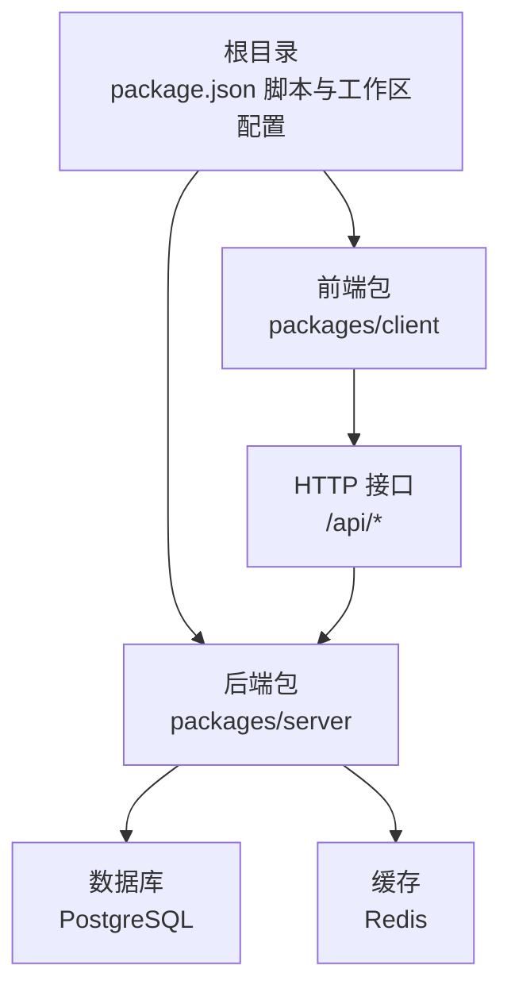
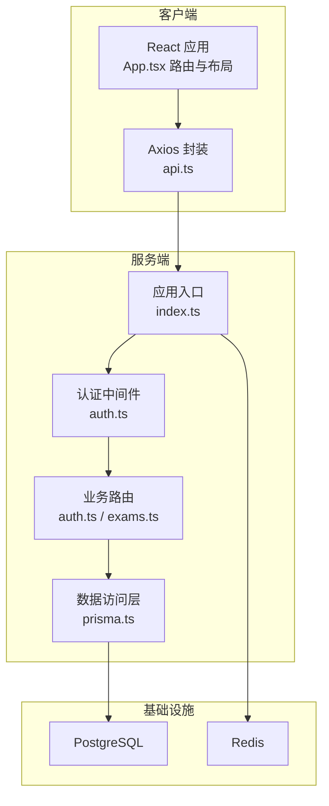
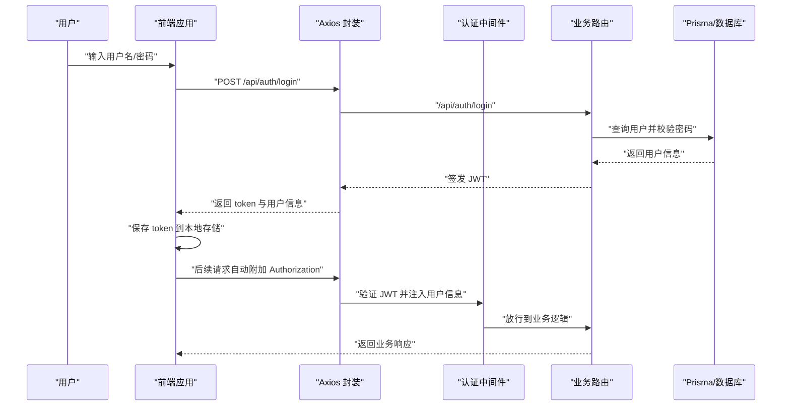
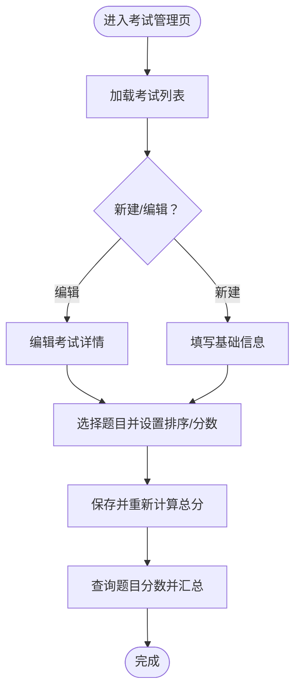
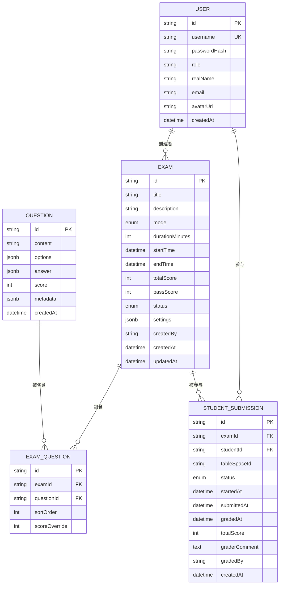
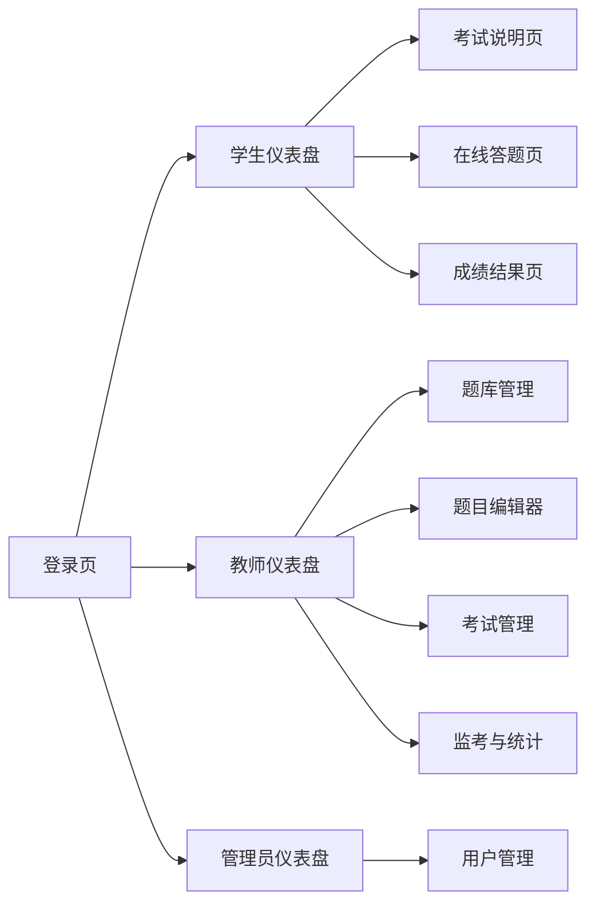
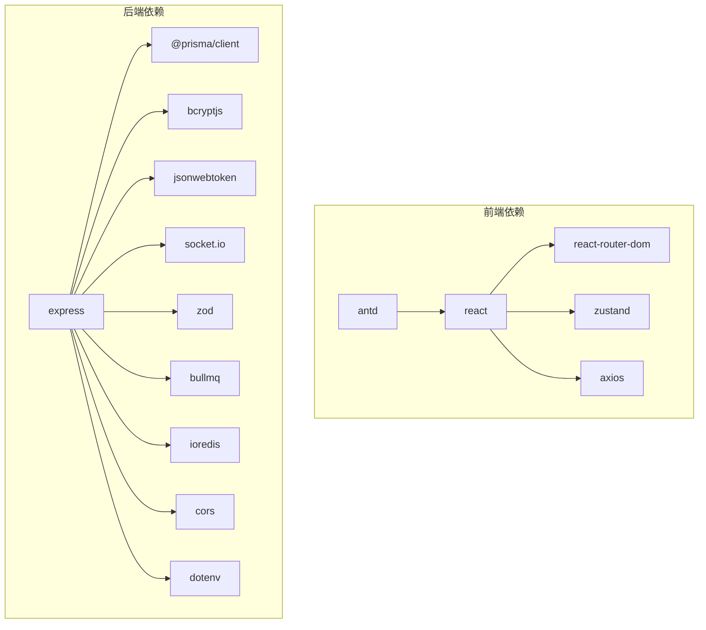

# 项目概述

<cite>
**本文引用的文件**
- [package.json](file://package.json)
- [docker-compose.yml](file://docker-compose.yml)
- [packages/server/package.json](file://packages/server/package.json)
- [packages/server/src/index.ts](file://packages/server/src/index.ts)
- [packages/server/src/config/prisma.ts](file://packages/server/src/config/prisma.ts)
- [packages/server/src/middleware/auth.ts](file://packages/server/src/middleware/auth.ts)
- [packages/server/src/routes/auth.ts](file://packages/server/src/routes/auth.ts)
- [packages/server/src/routes/exams.ts](file://packages/server/src/routes/exams.ts)
- [packages/server/prisma/schema.prisma](file://packages/server/prisma/schema.prisma)
- [packages/client/package.json](file://packages/client/package.json)
- [packages/client/src/App.tsx](file://packages/client/src/App.tsx)
- [packages/client/src/services/api.ts](file://packages/client/src/services/api.ts)
- [packages/client/src/pages/auth/LoginPage.tsx](file://packages/client/src/pages/auth/LoginPage.tsx)
- [packages/client/src/pages/auth/RegisterPage.tsx](file://packages/client/src/pages/auth/RegisterPage.tsx)
- [packages/client/src/pages/teacher/ExamManager.tsx](file://packages/client/src/pages/teacher/ExamManager.tsx)
- [packages/client/src/pages/admin/UserManagement.tsx](file://packages/client/src/pages/admin/UserManagement.tsx)
- [packages/client/src/types/index.ts](file://packages/client/src/types/index.ts)
- [gen_docx.py](file://gen_docx.py)
</cite>

## 目录
1. [引言](#引言)
2. [项目结构](#项目结构)
3. [核心组件](#核心组件)
4. [架构总览](#架构总览)
5. [详细组件分析](#详细组件分析)
6. [依赖关系分析](#依赖关系分析)
7. [性能考虑](#性能考虑)
8. [故障排查指南](#故障排查指南)
9. [结论](#结论)
10. [附录](#附录)

## 引言
本项目是基于金山多维表格能力构建的智能化技能评估系统，面向教师、学生与管理员三类角色，提供从“出题阅卷”到“在线考试”的完整闭环。系统采用 Monorepo 架构与前后端分离设计，后端以 Express + Prisma 为核心，结合 Redis、PostgreSQL 提供高可用的数据与缓存支撑；前端使用 React + Ant Design + Zustand 实现多角色交互界面与状态管理。通过 Docker Compose 快速搭建开发环境，支持本地开发与部署。

## 项目结构
项目采用 Lerna/Yarn Workspaces 风格的 Monorepo 组织方式，根目录通过脚本统一管理前后端工作区，数据库迁移与 Prisma Studio 由后端脚本提供，容器化服务通过 docker-compose 编排 PostgreSQL 与 Redis。

图表来源
- [package.json:1-26](file://package.json#L1-L26)
- [packages/client/package.json:1-29](file://packages/client/package.json#L1-L29)
- [packages/server/package.json:1-35](file://packages/server/package.json#L1-L35)
- [docker-compose.yml:1-37](file://docker-compose.yml#L1-L37)

章节来源
- [package.json:1-26](file://package.json#L1-L26)
- [docker-compose.yml:1-37](file://docker-compose.yml#L1-L37)

## 核心组件
- 后端服务（Express）
  - 应用入口与监听：负责启动 HTTP 服务并输出运行环境信息。
  - 认证中间件：基于 JWT 的鉴权与授权，拦截未认证或权限不足请求。
  - 数据访问：通过 Prisma 客户端连接数据库，提供类型安全的查询与写入。
  - 路由模块：包含认证、考试管理等业务路由，统一参数校验与错误处理。
- 前端应用（React）
  - 路由与布局：按角色划分布局与页面，私有路由保护与重定向。
  - 状态管理：使用轻量状态库管理登录态与全局状态。
  - 服务封装：Axios 封装统一基地址、请求头注入与 401 自动登出。
- 数据模型（Prisma）
  - 考试、题目、提交、用户等核心实体，定义字段、索引与关系映射。
- 开发与运维
  - Docker Compose：一键拉起数据库与缓存服务。
  - NPM 脚本：统一开发、构建、迁移、种子数据与可视化工具链。

章节来源
- [packages/server/src/index.ts:1-8](file://packages/server/src/index.ts#L1-L8)
- [packages/server/src/middleware/auth.ts:1-45](file://packages/server/src/middleware/auth.ts#L1-L45)
- [packages/server/src/config/prisma.ts:1-9](file://packages/server/src/config/prisma.ts#L1-L9)
- [packages/server/src/routes/auth.ts:1-152](file://packages/server/src/routes/auth.ts#L1-L152)
- [packages/server/src/routes/exams.ts:1-221](file://packages/server/src/routes/exams.ts#L1-L221)
- [packages/server/prisma/schema.prisma:143-173](file://packages/server/prisma/schema.prisma#L143-L173)
- [packages/client/src/App.tsx:1-60](file://packages/client/src/App.tsx#L1-L60)
- [packages/client/src/services/api.ts:1-32](file://packages/client/src/services/api.ts#L1-L32)

## 架构总览
系统采用典型的三层架构：前端通过 Axios 发起 REST 请求至后端，后端使用 Prisma 进行数据库操作，Redis 用于会话与队列等场景，PostgreSQL 存储持久化数据。Docker Compose 将数据库与缓存容器化，便于本地开发与 CI/CD。

图表来源
- [packages/client/src/App.tsx:38-60](file://packages/client/src/App.tsx#L38-L60)
- [packages/client/src/services/api.ts:3-32](file://packages/client/src/services/api.ts#L3-L32)
- [packages/server/src/index.ts:4-8](file://packages/server/src/index.ts#L4-L8)
- [packages/server/src/middleware/auth.ts:19-45](file://packages/server/src/middleware/auth.ts#L19-L45)
- [packages/server/src/routes/auth.ts:24-66](file://packages/server/src/routes/auth.ts#L24-L66)
- [packages/server/src/routes/exams.ts:29-39](file://packages/server/src/routes/exams.ts#L29-L39)
- [packages/server/src/config/prisma.ts:3-9](file://packages/server/src/config/prisma.ts#L3-L9)
- [docker-compose.yml:4-32](file://docker-compose.yml#L4-L32)

## 详细组件分析

### 认证与授权流程
系统通过 JWT 实现无状态认证，前端在请求头携带 Bearer Token，后端中间件解析并校验令牌，再根据角色进行授权控制。

图表来源
- [packages/client/src/pages/auth/LoginPage.tsx:16-33](file://packages/client/src/pages/auth/LoginPage.tsx#L16-L33)
- [packages/client/src/services/api.ts:8-30](file://packages/client/src/services/api.ts#L8-L30)
- [packages/server/src/middleware/auth.ts:19-45](file://packages/server/src/middleware/auth.ts#L19-L45)
- [packages/server/src/routes/auth.ts:24-66](file://packages/server/src/routes/auth.ts#L24-L66)

章节来源
- [packages/client/src/pages/auth/LoginPage.tsx:1-33](file://packages/client/src/pages/auth/LoginPage.tsx#L1-L33)
- [packages/client/src/services/api.ts:1-32](file://packages/client/src/services/api.ts#L1-L32)
- [packages/server/src/middleware/auth.ts:1-45](file://packages/server/src/middleware/auth.ts#L1-L45)
- [packages/server/src/routes/auth.ts:1-152](file://packages/server/src/routes/auth.ts#L1-L152)

### 考试管理流程（教师侧）
教师可创建/编辑考试、选择题目、设置排序与分数权重，并实时计算总分。系统通过 Prisma 执行批量更新与关联查询，确保一致性。

图表来源
- [packages/client/src/pages/teacher/ExamManager.tsx:17-35](file://packages/client/src/pages/teacher/ExamManager.tsx#L17-L35)
- [packages/server/src/routes/exams.ts:29-39](file://packages/server/src/routes/exams.ts#L29-L39)
- [packages/server/src/routes/exams.ts:175-221](file://packages/server/src/routes/exams.ts#L175-L221)

章节来源
- [packages/client/src/pages/teacher/ExamManager.tsx:1-35](file://packages/client/src/pages/teacher/ExamManager.tsx#L1-L35)
- [packages/server/src/routes/exams.ts:1-221](file://packages/server/src/routes/exams.ts#L1-L221)

### 数据模型与关系
系统围绕用户、考试、题目、提交等核心实体建立关系，Prisma Schema 明确了主键、外键、唯一约束与映射表名，保证数据一致性与查询效率。

图表来源
- [packages/server/prisma/schema.prisma:143-173](file://packages/server/prisma/schema.prisma#L143-L173)

章节来源
- [packages/server/prisma/schema.prisma:143-173](file://packages/server/prisma/schema.prisma#L143-L173)

### 前端页面与路由组织
前端采用按角色划分的布局与页面，私有路由保护确保仅授权用户可见对应功能。注册与登录页面提供用户自助接入能力。

图表来源
- [packages/client/src/App.tsx:38-60](file://packages/client/src/App.tsx#L38-L60)
- [packages/client/src/pages/auth/LoginPage.tsx:16-33](file://packages/client/src/pages/auth/LoginPage.tsx#L16-L33)
- [packages/client/src/pages/auth/RegisterPage.tsx:13-34](file://packages/client/src/pages/auth/RegisterPage.tsx#L13-L34)
- [packages/client/src/pages/teacher/ExamManager.tsx:17-35](file://packages/client/src/pages/teacher/ExamManager.tsx#L17-L35)
- [packages/client/src/pages/admin/UserManagement.tsx:13-35](file://packages/client/src/pages/admin/UserManagement.tsx#L13-L35)

章节来源
- [packages/client/src/App.tsx:1-60](file://packages/client/src/App.tsx#L1-L60)
- [packages/client/src/pages/auth/LoginPage.tsx:1-33](file://packages/client/src/pages/auth/LoginPage.tsx#L1-L33)
- [packages/client/src/pages/auth/RegisterPage.tsx:1-34](file://packages/client/src/pages/auth/RegisterPage.tsx#L1-L34)
- [packages/client/src/pages/teacher/ExamManager.tsx:1-35](file://packages/client/src/pages/teacher/ExamManager.tsx#L1-L35)
- [packages/client/src/pages/admin/UserManagement.tsx:1-35](file://packages/client/src/pages/admin/UserManagement.tsx#L1-L35)

## 依赖关系分析
- 技术栈概览
  - 前端：React 18、Ant Design、React Router、Zustand、Axios、Day.js
  - 后端：Express、Prisma、Bcrypt、BullMQ、CORS、Dotenv、Socket.IO、Zod
  - 基础设施：PostgreSQL、Redis
- 工作区与脚本
  - 根级脚本统一启动前后端开发、构建、数据库迁移与可视化工具
  - 前后端各自维护独立的依赖与构建脚本
- 外部依赖与集成点
  - JWT 用于认证与授权
  - Prisma 作为 ORM 与数据库抽象层
  - Socket.IO 可用于实时通信（如监考场景）
  - BullMQ 可用于异步任务（如批改、报表生成）

图表来源
- [packages/client/package.json:11-20](file://packages/client/package.json#L11-L20)
- [packages/server/package.json:13-24](file://packages/server/package.json#L13-L24)

章节来源
- [packages/client/package.json:1-29](file://packages/client/package.json#L1-L29)
- [packages/server/package.json:1-35](file://packages/server/package.json#L1-L35)

## 性能考虑
- 数据访问
  - 使用 Prisma 的预编译查询与关系嵌套，减少 N+1 查询风险；对高频查询建立必要索引。
- 缓存策略
  - 对静态资源与热点数据使用 Redis 缓存，降低数据库压力；对会话与临时状态进行 TTL 管理。
- 并发与异步
  - 使用 BullMQ 处理耗时任务（如评分、报表导出），避免阻塞主请求线程。
- 前端优化
  - 按需加载与懒路由，减少首屏体积；合理拆分组件，提升渲染性能。
- 网络与安全
  - Axios 统一拦截器处理超时与错误，JWT 令牌短期有效并支持刷新；后端严格参数校验与权限控制。

## 故障排查指南
- 登录失败
  - 检查用户名/密码是否正确，确认后端路由参数校验与密码哈希比对逻辑。
  - 查看浏览器控制台与网络面板，确认请求头 Authorization 是否正确注入。
- 权限不足
  - 确认用户角色与路由守卫配置，检查中间件是否正确解析 JWT 并注入用户信息。
- 数据库问题
  - 使用 Prisma CLI 执行迁移与种子数据，确认连接字符串与环境变量配置。
  - 通过 Prisma Studio 检查数据一致性与表结构。
- 容器无法启动
  - 检查 Postgres/Redis 健康检查与端口占用，确认卷挂载路径与权限。

章节来源
- [packages/server/src/routes/auth.ts:24-66](file://packages/server/src/routes/auth.ts#L24-L66)
- [packages/server/src/middleware/auth.ts:19-45](file://packages/server/src/middleware/auth.ts#L19-L45)
- [packages/client/src/services/api.ts:8-30](file://packages/client/src/services/api.ts#L8-L30)
- [docker-compose.yml:15-32](file://docker-compose.yml#L15-L32)

## 结论
本项目以 Monorepo 与前后端分离为核心，结合 Express + Prisma + React 的技术组合，提供了覆盖教师出题、学生在线考试、管理员系统管理的完整业务闭环。通过 Docker Compose 与标准化脚本，降低了开发与部署门槛；借助 JWT、Prisma 与 Redis，兼顾了安全性与性能。建议在后续迭代中完善实时监考、自动化评分与报表导出等高级能力，持续优化用户体验与系统稳定性。

## 附录
- 角色与页面映射参考
  - 学生端：仪表盘、考试说明、在线答题、结果查看
  - 教师端：题库管理、题目编辑、考试管理、监考与统计
  - 管理员端：用户管理
- 前端组件树参考
  - App 根路由与各角色布局下的页面组件层级

章节来源
- [gen_docx.py:391-414](file://gen_docx.py#L391-L414)